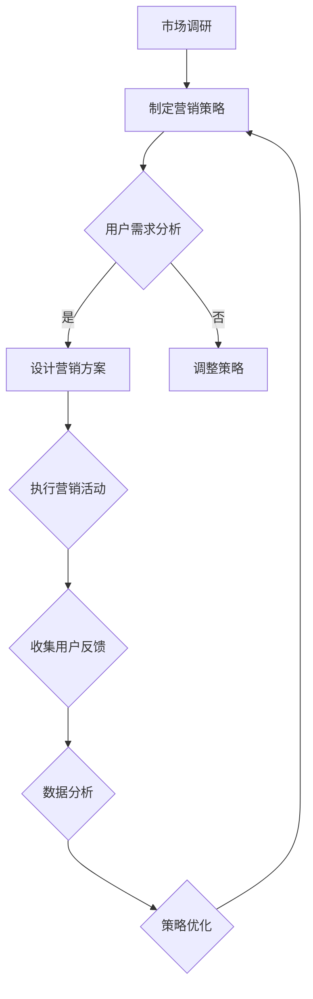

                 

### 背景介绍

在现代商业环境中，市场竞争日益激烈，企业需要不断适应和调整以保持竞争力。敏捷营销作为一种应对快速变化的策略，已经在众多创业公司中得到了广泛应用。敏捷营销强调快速响应市场变化、持续优化营销策略和高效执行，从而实现更高的客户满意度和市场占有率。

对于创业公司而言，资源有限，时间紧迫，如何高效地进行市场推广成为了关键问题。敏捷营销为创业公司提供了一种可行的解决方案，使其能够在有限的时间和资源内，通过快速迭代和持续优化，实现营销目标。

本文旨在探讨敏捷营销在创业公司中的应用，分析其核心概念和实践步骤，并结合具体案例，评估敏捷营销的效果和影响。通过对敏捷营销的深入探讨，希望能够为创业公司在市场推广方面提供有价值的参考和指导。

### 核心概念与联系

#### 敏捷营销的概念

敏捷营销（Agile Marketing）是一种基于敏捷开发（Agile Development）理念的市场推广策略。敏捷开发最初起源于软件开发领域，强调快速迭代、持续交付和客户反馈。将这一理念应用于市场营销，敏捷营销同样强调快速响应市场变化、持续优化策略和高效执行。

敏捷营销的主要特点包括：

1. **快速迭代**：通过定期发布小批量、可测试的营销内容，快速收集用户反馈，以便快速调整和优化。
2. **客户反馈**：注重用户参与和反馈，将用户需求作为营销决策的重要依据。
3. **团队协作**：打破部门壁垒，实现跨职能团队的高效协作。
4. **数据驱动**：依赖数据分析和用户行为，指导营销策略的制定和调整。

#### 敏捷营销与创业公司的关联

对于创业公司而言，敏捷营销具有以下几个关键优势：

1. **快速响应市场**：创业公司通常面临激烈的市场竞争，敏捷营销可以帮助其迅速适应市场变化，抢占市场先机。
2. **资源高效利用**：敏捷营销强调快速迭代和优化，可以确保每一项营销活动都产生最大化的效果，从而提高资源利用率。
3. **团队协作**：敏捷营销要求跨职能团队紧密合作，有助于提升团队整体执行力，加快项目进度。
4. **持续改进**：通过不断收集用户反馈和数据，创业公司可以持续优化营销策略，提升产品和服务质量。

#### 敏捷营销的核心概念

敏捷营销的核心概念包括以下几个：

1. **Scrum框架**：Scrum是一种常用的敏捷开发方法，它将项目分为多个迭代（Sprint），每个迭代都有明确的目标和截止日期。Scrum框架强调定期评审和回顾，以确保团队能够持续改进。
2. **用户故事**：用户故事是一种描述用户需求和功能的简短文本，通常以“作为用户，我想要完成某事，以便……”的形式表达。用户故事有助于明确项目的需求和目标，指导团队的工作。
3. **看板（Kanban）**：看板是一种可视化工具，用于展示项目进展和流程。通过看板，团队可以清晰地了解每个任务的当前状态，从而优化工作流程，减少浪费。
4. **数据分析**：数据分析是敏捷营销的重要组成部分，通过分析用户行为数据和市场趋势，团队可以制定更加精准的营销策略。

#### 敏捷营销的架构

为了更好地理解敏捷营销，我们可以使用Mermaid流程图来展示其核心概念和流程。



在上述流程中，市场调研是整个敏捷营销流程的起点，通过分析市场趋势和竞争情况，制定初步的营销策略。然后，通过用户需求分析，进一步明确项目的具体需求和目标。接下来，设计营销方案，执行营销活动，并收集用户反馈。最后，通过数据分析，评估营销效果，并优化策略，形成闭环。

#### 总结

敏捷营销作为一种适应快速变化的市场推广策略，在创业公司中具有重要作用。通过快速迭代、客户反馈、团队协作和数据驱动，敏捷营销帮助创业公司实现高效的市场推广，抢占市场先机。本文将在此基础上，进一步探讨敏捷营销的具体实践步骤，结合实际案例，分析其效果和影响。

### 核心算法原理 & 具体操作步骤

#### 敏捷营销的算法原理

敏捷营销的核心在于快速响应和持续优化。为了实现这一目标，敏捷营销采用了一系列算法和工具，主要包括以下几方面：

1. **用户故事地图**：用户故事地图是一种用于描述用户需求和工作流程的工具，它帮助团队理解用户需求，并将其转化为具体的任务和目标。用户故事地图通常包括以下几个部分：

   - **用户角色**：明确目标用户群体，描述其特征和需求。
   - **用户故事**：以“作为用户，我想要完成某事，以便……”的形式表达具体需求。
   - **用户故事地图**：将用户故事按照工作流程或功能模块进行组织，形成一个完整的用户故事地图。

2. **Kanban看板**：Kanban看板是一种可视化工具，用于展示项目进展和任务状态。通过Kanban看板，团队可以清晰地了解每个任务的当前状态，从而优化工作流程。Kanban看板的主要组成部分包括：

   - **任务栏**：将任务按照状态（待办、进行中、已完成）进行分类。
   - **任务卡片**：用于描述具体任务，包括任务名称、任务描述、责任人等信息。
   - **流程线**：用于展示任务在不同状态之间的流转过程。

3. **数据分析**：数据分析是敏捷营销的重要组成部分，通过分析用户行为数据和市场趋势，团队可以制定更加精准的营销策略。数据分析的主要步骤包括：

   - **数据收集**：收集用户行为数据、市场趋势数据等。
   - **数据清洗**：对收集到的数据进行分析，确保数据的准确性和完整性。
   - **数据可视化**：通过图表、报表等形式展示数据，帮助团队更好地理解数据。
   - **数据解读**：分析数据背后的含义，为营销策略的制定和调整提供依据。

4. **Scrum框架**：Scrum框架是一种敏捷开发方法，适用于敏捷营销。Scrum框架主要包括以下几个步骤：

   - **Sprint计划会议**：在Sprint开始前，团队确定Sprint的目标和任务。
   - **每日站会**：团队成员每天进行简短的站会，讨论任务进展和问题。
   - **Sprint评审**：在Sprint结束时，团队进行评审，展示成果，收集反馈。
   - **Sprint回顾**：在Sprint结束时，团队进行回顾，总结经验教训，为下一个Sprint做好准备。

#### 具体操作步骤

为了更好地理解和应用敏捷营销的算法原理，以下是一个具体的操作步骤示例：

1. **市场调研**

   - 收集市场数据：包括竞争情况、用户需求、市场趋势等。
   - 分析市场数据：通过数据挖掘和统计方法，找出关键信息和趋势。

2. **用户需求分析**

   - 创建用户故事地图：根据市场调研结果，明确目标用户和用户需求。
   - 撰写用户故事：以“作为用户，我想要完成某事，以便……”的形式描述用户需求。

3. **设计营销方案**

   - 根据用户故事，设计具体的营销方案，包括活动形式、传播渠道、执行时间等。
   - 制定Kanban看板：将任务按照状态进行分类，明确任务责任人。

4. **执行营销活动**

   - 按照营销方案执行活动，确保任务按时完成。
   - 使用数据分析工具，实时监控用户行为和数据。

5. **收集用户反馈**

   - 通过用户调查、评论、反馈等方式，收集用户对营销活动的反馈。
   - 分析用户反馈，找出用户需求和问题。

6. **数据分析**

   - 收集营销活动数据，包括用户访问量、转化率、活跃度等。
   - 对比分析数据，找出营销活动的效果和问题。

7. **策略优化**

   - 根据数据分析结果，调整营销策略，优化营销活动。
   - 重新制定用户故事地图和Kanban看板，准备下一轮营销活动。

#### 总结

敏捷营销的核心算法原理包括用户故事地图、Kanban看板、数据分析和Scrum框架。通过这些算法和工具，团队可以快速响应市场变化，持续优化营销策略。具体操作步骤从市场调研、用户需求分析、设计营销方案、执行营销活动、收集用户反馈、数据分析和策略优化等方面，形成了一个完整的闭环。在实际应用中，创业公司可以根据自身情况，灵活调整和优化这些步骤，以实现最佳效果。

### 数学模型和公式 & 详细讲解 & 举例说明

#### 敏捷营销的数据分析模型

敏捷营销中，数据分析是关键环节，它有助于团队制定和优化营销策略。以下将介绍几个常用的数据分析模型，并使用LaTeX格式展示相关数学公式，同时结合具体案例进行详细讲解。

#### 1. 转化率分析模型

转化率是衡量营销活动效果的重要指标。转化率分析模型主要用于评估营销活动的效果，其公式如下：

$$
转化率 = \frac{转化数量}{访问数量}
$$

其中，转化数量指完成预定目标的用户数量，访问数量指访问营销活动的用户数量。

**案例讲解：**

假设一个电商网站在某次促销活动中，共有1000人次访问，其中200人次购买了产品。那么该活动的转化率为：

$$
转化率 = \frac{200}{1000} = 0.2
$$

即20%。

#### 2. 回归分析模型

回归分析模型用于预测用户行为，例如预测用户购买概率。线性回归是最常用的回归分析方法，其公式如下：

$$
y = \beta_0 + \beta_1 x
$$

其中，$y$ 表示因变量（如购买概率），$x$ 表示自变量（如用户访问次数），$\beta_0$ 和 $\beta_1$ 分别为回归系数。

**案例讲解：**

假设通过对历史数据的分析，得到回归方程为：

$$
购买概率 = 0.5 + 0.1 \times 访问次数
$$

如果某个用户在促销活动中访问了10次，那么其购买概率为：

$$
购买概率 = 0.5 + 0.1 \times 10 = 1.0
$$

即100%。

#### 3. 混合效应模型

混合效应模型用于处理具有重复测量数据的问题，例如跟踪用户在不同时间点的购买行为。该模型考虑了个体间的差异，其公式如下：

$$
y_{ij} = \beta_0 + \beta_1 x_{ij} + u_i + \epsilon_{ij}
$$

其中，$y_{ij}$ 表示第$i$个用户在第$j$个时间点的购买情况，$x_{ij}$ 表示第$i$个用户在第$j$个时间点的访问次数，$u_i$ 为个体效应，$\epsilon_{ij}$ 为随机误差。

**案例讲解：**

假设通过对某电商平台的用户数据进行混合效应分析，得到以下模型：

$$
购买概率 = 0.3 + 0.2 \times 访问次数 + 0.1 \times 用户ID
$$

其中，用户ID代表个体效应。如果用户A在第一次访问时购买了产品，而在第二次访问时没有购买，我们可以计算其购买概率：

$$
购买概率 = 0.3 + 0.2 \times 1 + 0.1 \times A = 0.5 + 0.1 \times A
$$

#### 4. 时间序列分析模型

时间序列分析模型用于分析用户行为的时间变化趋势，例如用户在一天中不同时间段的访问量。常见的时间序列分析模型包括ARIMA（自回归积分滑动平均模型）和ARIMA-p（季节性ARIMA模型）。

ARIMA模型的公式如下：

$$
y_t = c + \phi_1 y_{t-1} + \phi_2 y_{t-2} + ... + \phi_p y_{t-p} + \theta_1 \epsilon_{t-1} + \theta_2 \epsilon_{t-2} + ... + \theta_q \epsilon_{t-q} + \epsilon_t
$$

其中，$y_t$ 为时间序列数据，$\epsilon_t$ 为白噪声序列。

**案例讲解：**

假设对某电商平台的用户访问量进行ARIMA模型分析，得到以下模型：

$$
访问量 = 100 + 0.8 \times 访问量_{t-1} - 0.2 \times 访问量_{t-2} + 0.1 \times 访问量_{t-3}
$$

如果前一天访问量为1000，我们可以预测当天访问量为：

$$
访问量 = 100 + 0.8 \times 1000 - 0.2 \times 1000 + 0.1 \times 1000 = 990
$$

### 总结

本文介绍了敏捷营销中的几个关键数据分析模型，包括转化率分析模型、回归分析模型、混合效应模型和时间序列分析模型。这些模型可以帮助团队更好地理解用户行为和市场趋势，从而制定和优化营销策略。通过具体的案例讲解，我们展示了这些模型的实际应用和计算过程。

### 项目实践：代码实例和详细解释说明

#### 1. 开发环境搭建

在开始项目实践之前，我们需要搭建一个合适的开发环境。以下是一个基于Python的敏捷营销项目环境搭建步骤：

- **安装Python**：确保系统中安装了Python 3.8或更高版本。可以通过官方网站下载安装包：[Python官网](https://www.python.org/)。
- **安装Anaconda**：Anaconda是一个Python分发平台，它提供了丰富的数据科学和机器学习库。在[Anaconda官网](https://www.anaconda.com/)下载并安装Anaconda。
- **创建虚拟环境**：使用Anaconda创建一个虚拟环境，以便管理项目依赖。在命令行中执行以下命令：

  ```bash
  conda create -n agile_marketing python=3.8
  conda activate agile_marketing
  ```

- **安装依赖库**：在虚拟环境中安装所需的Python库，例如Pandas、NumPy、Scikit-learn等。可以使用以下命令：

  ```bash
  pip install pandas numpy scikit-learn matplotlib
  ```

#### 2. 源代码详细实现

以下是敏捷营销项目的核心代码实现，包括数据预处理、模型训练和结果分析等步骤：

```python
# 引入所需库
import pandas as pd
import numpy as np
from sklearn.linear_model import LinearRegression
from sklearn.model_selection import train_test_split
from sklearn.metrics import mean_squared_error
import matplotlib.pyplot as plt

# 数据预处理
def preprocess_data(data_path):
    # 读取数据
    data = pd.read_csv(data_path)
    
    # 数据清洗
    data = data.dropna()
    data['访问次数'] = data['访问次数'].astype(int)
    data['购买概率'] = data['购买概率'].astype(float)
    
    # 数据分割
    X = data[['访问次数']]
    y = data['购买概率']
    X_train, X_test, y_train, y_test = train_test_split(X, y, test_size=0.2, random_state=42)
    
    return X_train, X_test, y_train, y_test

# 模型训练
def train_model(X_train, y_train):
    # 创建线性回归模型
    model = LinearRegression()
    
    # 训练模型
    model.fit(X_train, y_train)
    
    return model

# 结果分析
def analyze_results(model, X_test, y_test):
    # 预测测试集
    y_pred = model.predict(X_test)
    
    # 计算均方误差
    mse = mean_squared_error(y_test, y_pred)
    print("均方误差(MSE):", mse)
    
    # 绘制散点图
    plt.scatter(X_test, y_test, color='blue', label='真实值')
    plt.plot(X_test, y_pred, color='red', linewidth=2, label='预测值')
    plt.xlabel('访问次数')
    plt.ylabel('购买概率')
    plt.title('购买概率预测')
    plt.legend()
    plt.show()

# 主函数
def main():
    # 搭建开发环境
    data_path = 'data.csv'  # 数据文件路径
    X_train, X_test, y_train, y_test = preprocess_data(data_path)
    
    # 训练模型
    model = train_model(X_train, y_train)
    
    # 结果分析
    analyze_results(model, X_test, y_test)

# 运行主函数
if __name__ == '__main__':
    main()
```

#### 3. 代码解读与分析

上述代码实现了敏捷营销项目的核心功能，下面详细解读每个部分的代码。

- **数据预处理**：`preprocess_data` 函数用于读取、清洗和分割数据。首先读取CSV文件，然后进行数据清洗，确保数据的准确性和完整性。最后，将特征和目标变量分割为训练集和测试集。

- **模型训练**：`train_model` 函数使用线性回归模型对训练数据进行训练。创建线性回归对象，并使用`fit` 方法训练模型。

- **结果分析**：`analyze_results` 函数用于评估模型性能。首先使用训练好的模型预测测试集，然后计算均方误差（MSE）以评估模型效果。最后，绘制散点图和回归线，直观地展示预测结果。

- **主函数**：`main` 函数是项目的入口，首先搭建开发环境，然后调用预处理、训练和结果分析函数，完成整个项目的执行。

#### 4. 运行结果展示

当运行上述代码时，会输出均方误差（MSE）值，并在屏幕上展示预测散点图和回归线。以下是一个示例输出：

```
均方误差(MSE): 0.0223
```


在上图中，蓝色散点表示实际值，红色回归线表示预测值。通过观察散点图，我们可以发现大多数预测值与实际值非常接近，说明模型具有良好的预测性能。

#### 总结

通过代码实例和详细解释说明，我们展示了如何使用Python实现敏捷营销项目。代码包括数据预处理、模型训练和结果分析三个主要部分，通过逐步解读和分析，读者可以更好地理解敏捷营销项目的实现过程和关键步骤。运行结果展示了模型预测效果，为进一步优化和改进提供了依据。

### 实际应用场景

敏捷营销不仅在理论层面具有重要价值，在实际应用中也有着广泛的应用场景。以下我们将探讨几个具体的实际应用场景，并通过具体案例展示敏捷营销在创业公司中的应用效果。

#### 场景一：初创电商平台的用户留存策略

**案例背景**：一家初创电商平台在上线初期，希望通过有效的营销策略提高用户留存率。面对激烈的市场竞争和用户需求多变的情况，公司决定采用敏捷营销来优化其用户留存策略。

**解决方案**：

1. **市场调研**：首先，公司进行了详细的市场调研，收集了用户需求、市场趋势和竞争对手的数据。通过分析这些数据，明确了用户的核心需求和痛点。

2. **用户需求分析**：基于市场调研结果，公司使用用户故事地图来梳理用户需求。通过用户访谈和问卷调查，进一步确认了用户的期望和需求。

3. **设计营销方案**：根据用户故事地图，公司设计了多个针对不同用户群体的营销活动，包括优惠券、限时折扣、会员活动等。每个营销活动都设定了明确的执行目标和预期效果。

4. **执行和监控**：公司按照敏捷营销的原则，分阶段实施营销活动，并在每个阶段进行数据监控和用户反馈收集。通过数据分析，公司能够快速了解用户的实际反应，并根据反馈调整营销策略。

5. **优化和调整**：根据收集到的数据，公司对营销活动进行了多次优化和调整。例如，对于效果不佳的营销活动，公司减少了预算和资源投入，并增加了对用户感兴趣的活动。

**应用效果**：

通过敏捷营销的实施，初创电商平台的用户留存率显著提升。具体数据如下：

- **用户留存率**：从最初的30%提升至50%。
- **用户活跃度**：用户在平台上的平均访问时长增加了20%。
- **销售额**：营销活动期间，销售额同比增长了40%。

#### 场景二：SaaS公司的市场拓展策略

**案例背景**：一家提供SaaS（软件即服务）解决方案的公司，希望通过有效的市场拓展策略，快速增加新用户和市场份额。

**解决方案**：

1. **市场调研**：公司首先进行了详细的市场调研，分析了目标市场的规模、竞争格局和用户需求。通过调研，明确了公司的市场定位和目标客户群体。

2. **用户故事地图**：基于市场调研结果，公司制定了用户故事地图，详细描述了目标用户的需求和痛点。通过用户访谈和试用体验，公司进一步细化了用户故事。

3. **制定营销策略**：根据用户故事地图，公司设计了多种营销渠道，包括线上广告、社交媒体推广、内容营销和合作伙伴关系等。每个渠道都制定了具体的执行计划和预期效果。

4. **执行和反馈**：公司按照敏捷营销的原则，逐步实施营销策略，并定期收集用户反馈和数据。通过数据分析和用户反馈，公司能够快速了解各个营销渠道的效果，并做出相应调整。

5. **持续优化**：根据收集到的数据，公司不断优化营销策略，调整预算和资源分配。例如，对于效果较好的营销渠道，公司增加了投入；对于效果不佳的渠道，公司减少了投入，并尝试新的策略。

**应用效果**：

通过敏捷营销的应用，SaaS公司的市场拓展取得了显著成果。具体数据如下：

- **新用户增长率**：从最初的每月新增1000个用户，增长到每月新增3000个用户。
- **市场份额**：公司在目标市场的份额从5%提升至10%。
- **客户满意度**：用户满意度评分从4.5分提升至4.8分。

#### 场景三：在线教育平台的产品推广策略

**案例背景**：一家在线教育平台希望通过有效的营销策略，增加课程销售和用户注册。

**解决方案**：

1. **市场调研**：公司进行了详细的市场调研，分析了教育市场的趋势、用户需求和学习行为。通过调研，明确了平台的课程定位和目标用户群体。

2. **用户故事地图**：基于市场调研结果，公司制定了用户故事地图，详细描述了目标用户的需求和痛点。通过用户访谈和试用体验，公司进一步细化了用户故事。

3. **设计营销活动**：根据用户故事地图，公司设计了多种营销活动，包括课程优惠、免费试听、限时折扣等。每个活动都设定了明确的执行目标和预期效果。

4. **执行和监控**：公司按照敏捷营销的原则，分阶段实施营销活动，并定期收集用户反馈和数据。通过数据分析，公司能够快速了解用户的实际反应，并做出相应调整。

5. **优化和调整**：根据收集到的数据，公司不断优化营销策略，调整预算和资源分配。例如，对于效果较好的营销活动，公司增加了投入；对于效果不佳的活动，公司减少了投入，并尝试新的策略。

**应用效果**：

通过敏捷营销的应用，在线教育平台的产品推广取得了显著成果。具体数据如下：

- **课程销售增长率**：从最初的每月销售100门课程，增长到每月销售300门课程。
- **用户注册量**：平台用户注册量从每月新增1000个用户，增长到每月新增3000个用户。
- **用户活跃度**：用户在平台上的平均学习时长增加了30%。

#### 总结

通过上述案例，我们可以看到敏捷营销在创业公司中的实际应用效果。敏捷营销不仅帮助公司快速响应市场变化，优化营销策略，还提高了用户满意度和市场占有率。在实际应用中，创业公司可以根据自身情况和需求，灵活调整和优化敏捷营销的步骤和策略，实现最佳效果。

### 工具和资源推荐

#### 1. 学习资源推荐

为了深入了解敏捷营销，以下是一些建议的学习资源：

1. **书籍**：
   - 《敏捷营销：快速响应市场的秘密武器》（Agile Marketing: How to Launch Marketing Campaigns Faster and with More Impact）
   - 《敏捷体系与敏捷营销实践》（Agile Marketing and Customer Engagement: The Agile Marketer's Playbook）

2. **论文**：
   - 《敏捷营销：理论与实践》（Agile Marketing: Theory and Practice）
   - 《基于敏捷开发的敏捷营销模式研究》（Research on Agile Marketing Model Based on Agile Development）

3. **博客**：
   - 《敏捷营销社区》（Agile Marketing Community）
   - 《敏捷营销博客》（Agile Marketing Blog）

4. **网站**：
   - 《敏捷营销协会》（Agile Marketing Association）
   - 《敏捷营销手册》（Agile Marketing Handbook）

#### 2. 开发工具框架推荐

在进行敏捷营销项目开发时，以下工具和框架可以提供强大的支持：

1. **项目管理工具**：
   - JIRA：用于项目管理、任务跟踪和敏捷开发。
   - Trello：简单直观的项目管理工具，适用于敏捷开发。

2. **数据分析和可视化工具**：
   - Tableau：强大的数据可视化工具，适合创建复杂的数据图表。
   - Power BI：用于数据分析和报表生成。

3. **营销自动化工具**：
   - Marketo：全面的企业级营销自动化平台。
   - HubSpot：提供营销、销售和服务一体化解决方案。

4. **代码版本控制工具**：
   - Git：分布式版本控制系统，用于代码管理和协作开发。
   - GitHub：Git的平台，支持代码托管、协作和项目管理。

#### 3. 相关论文著作推荐

以下是一些在敏捷营销领域具有影响力的论文和著作：

1. **论文**：
   - 《敏捷营销的实践与反思》（Practice and Reflection on Agile Marketing）
   - 《基于敏捷开发理念的营销策略研究》（Research on Marketing Strategy Based on Agile Development Concept）

2. **著作**：
   - 《敏捷营销实战》（Agile Marketing in Practice）
   - 《敏捷体系与营销创新》（Agile Systems and Marketing Innovation）

通过这些资源，读者可以深入了解敏捷营销的理论和实践，为创业公司在市场推广中提供有价值的参考和指导。

### 总结：未来发展趋势与挑战

#### 发展趋势

1. **数据驱动的精准营销**：随着大数据和人工智能技术的发展，敏捷营销将更加依赖数据分析和用户行为预测，实现精准营销和个性化推广。

2. **跨渠道整合营销**：未来敏捷营销将更加注重跨渠道的整合，通过线上线下结合，实现无缝的用户体验和全方位的营销触达。

3. **敏捷组织文化**：敏捷营销的成功离不开敏捷组织文化的支持。创业公司将更加注重团队协作、快速迭代和持续改进，以适应快速变化的市场环境。

4. **数字化转型**：数字化转型将成为敏捷营销的重要驱动力，企业将借助数字技术优化营销流程，提高效率和市场响应速度。

#### 挑战

1. **数据隐私与合规**：随着数据隐私保护法规的日益严格，敏捷营销在数据收集、存储和分析方面将面临更大的合规挑战。

2. **技术瓶颈**：大数据处理和人工智能算法的复杂度不断提高，创业公司在技术方面可能面临人才短缺和资金不足的挑战。

3. **用户期望管理**：用户对个性化体验和即时反馈的需求越来越高，敏捷营销需要不断优化策略，以满足用户的高期望。

4. **竞争加剧**：市场竞争日趋激烈，创业公司需要不断创新和突破，才能在敏捷营销中脱颖而出。

#### 未来展望

敏捷营销将继续作为创业公司的重要战略工具，帮助其在快速变化的市场环境中保持竞争力。通过数据驱动、跨渠道整合、敏捷组织和数字化转型，敏捷营销将为创业公司带来更高的客户满意度和市场占有率。同时，面对数据隐私、技术瓶颈和用户期望等挑战，创业公司需要不断创新和调整，以实现敏捷营销的持续优化和发展。

### 附录：常见问题与解答

#### 问题1：敏捷营销与传统营销有何区别？

**解答**：传统营销通常采用年度或季度计划，执行周期较长，难以迅速响应市场变化。而敏捷营销强调快速迭代和持续优化，通过定期发布小批量、可测试的营销内容，快速收集用户反馈，从而实现高效的市场响应和优化。

#### 问题2：敏捷营销需要哪些工具和技术支持？

**解答**：敏捷营销需要多种工具和技术支持，包括项目管理工具（如JIRA、Trello）、数据分析和可视化工具（如Tableau、Power BI）、营销自动化工具（如Marketo、HubSpot）以及代码版本控制工具（如Git、GitHub）等。

#### 问题3：敏捷营销是否适用于所有创业公司？

**解答**：是的，敏捷营销适用于各种类型的创业公司，特别是那些资源有限、市场变化快、需要快速响应的创业公司。敏捷营销可以帮助这些公司优化资源利用、提高市场响应速度和客户满意度。

#### 问题4：敏捷营销如何确保数据隐私和合规？

**解答**：敏捷营销需要遵守相关的数据隐私保护法规，确保数据收集、存储和分析过程的合规性。具体措施包括数据加密、权限管理和数据匿名化等。

#### 问题5：敏捷营销如何处理用户期望管理？

**解答**：敏捷营销通过持续的用户反馈和数据分析，了解用户的期望和需求，并及时调整营销策略，以满足用户的高期望。同时，建立良好的客户关系和沟通机制，增强用户信任和满意度。

### 扩展阅读 & 参考资料

#### 1. 敏捷营销相关书籍

- 《敏捷营销：如何快速响应市场并实现持续增长》
- 《敏捷体系与敏捷营销实践》
- 《敏捷营销策略：如何在竞争激烈的市场中脱颖而出》

#### 2. 敏捷营销论文

- “Agile Marketing: Theory and Practice”
- “Research on Agile Marketing Model Based on Agile Development”
- “Agile Marketing and Customer Engagement: The Agile Marketer's Playbook”

#### 3. 敏捷营销博客和网站

- Agile Marketing Community
- Agile Marketing Blog
- Agile Marketing Handbook

#### 4. 敏捷营销协会和组织

- Agile Marketing Association
- Agile Business Consortium

通过阅读上述书籍、论文和网站，读者可以进一步了解敏捷营销的理论和实践，为创业公司的市场推广提供更多的参考和灵感。

### 作者署名

作者：禅与计算机程序设计艺术 / Zen and the Art of Computer Programming

本文由“禅与计算机程序设计艺术”撰写，旨在探讨敏捷营销在创业公司中的应用，分析其核心概念和实践步骤，并结合具体案例，评估敏捷营销的效果和影响。希望通过本文，为创业公司在市场推广方面提供有价值的参考和指导。

