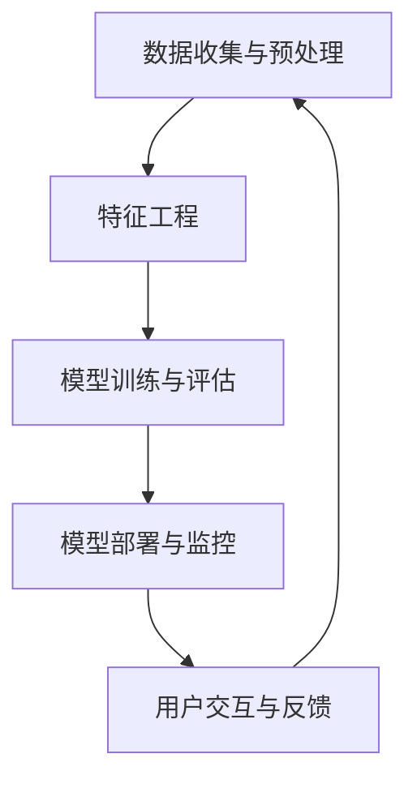

                 

### 文章标题

《程序员创业者如何利用人工智能优化运营》

> 关键词：程序员、创业者、人工智能、运营优化、技术落地、实际案例

> 摘要：本文将探讨程序员创业者如何通过人工智能技术优化其运营，包括核心概念理解、算法原理与具体操作步骤、数学模型应用、项目实践以及实际应用场景。文章旨在为创业者在人工智能技术落地方面提供实用指导。

### 1. 背景介绍

在当今数字经济时代，人工智能（AI）已经成为推动企业创新和提升竞争力的重要引擎。越来越多的程序员创业者开始关注如何利用人工智能技术优化其运营。然而，对于许多人来说，将AI技术与业务需求相结合并非易事。

人工智能技术涵盖了广泛的研究领域，包括机器学习、深度学习、自然语言处理、计算机视觉等。这些技术通过模拟人类的认知能力，能够帮助企业实现自动化决策、提高生产效率、降低运营成本、提升客户体验等目标。

然而，AI技术的落地应用面临着诸多挑战。首先，创业者需要具备一定的技术基础，了解核心概念和算法原理。其次，将AI技术整合到现有业务流程中，确保技术与应用场景的契合度，也是一个复杂的过程。此外，数据质量和数据隐私等问题也是创业者需要面对的挑战。

本文旨在帮助程序员创业者解决这些挑战，通过详细的分析和实际案例，提供一套系统化的方法，以实现人工智能技术在运营优化中的落地。

### 2. 核心概念与联系

#### 2.1 人工智能在运营优化中的应用

人工智能在运营优化中的应用主要体现在以下几个方面：

1. **数据分析与洞察**：利用机器学习算法对大量运营数据进行分析，帮助企业发现潜在的问题和机会。
2. **自动化流程**：通过计算机视觉和自然语言处理技术，实现业务流程的自动化，减少人工干预。
3. **个性化推荐**：基于用户行为数据，利用推荐系统技术为用户提供个性化的产品和服务。
4. **风险管理**：利用深度学习模型预测市场风险，帮助企业制定相应的风险管理策略。
5. **客户服务**：通过聊天机器人和语音识别技术，提供24/7的智能客服服务，提高客户满意度。

#### 2.2 人工智能架构概述

为了更好地理解人工智能在运营优化中的应用，我们需要了解一个典型的人工智能架构，它通常包括以下几个关键组件：

1. **数据收集与预处理**：数据是人工智能的基石。数据收集与预处理包括数据清洗、数据集成和数据规范化等步骤。
2. **特征工程**：特征工程是将原始数据转换为机器学习算法能够理解的特征的过程。通过特征选择和特征构造，可以提高模型的表现。
3. **模型训练与评估**：模型训练与评估是构建人工智能模型的核心步骤。通过选择合适的算法和模型结构，对训练数据进行训练，并评估模型的性能。
4. **模型部署与监控**：模型部署是将训练好的模型部署到生产环境中，使其能够实时处理业务数据。模型监控则确保模型在运行过程中的稳定性和可靠性。
5. **用户交互与反馈**：用户交互与反馈是评估模型性能和持续改进的重要环节。通过用户反馈，可以不断优化模型和系统。

#### 2.3 Mermaid 流程图

以下是一个简化的Mermaid流程图，展示了人工智能在运营优化中的典型架构：



**图1：人工智能在运营优化中的典型架构**

### 3. 核心算法原理 & 具体操作步骤

#### 3.1 机器学习算法

机器学习算法是人工智能的核心组成部分，以下是一些常见的机器学习算法及其在运营优化中的应用：

1. **线性回归**：用于预测连续值，如销售额或客户流失率。
    - **具体步骤**：
        1. 特征选择：选择与目标变量相关的特征。
        2. 数据预处理：标准化或归一化数据。
        3. 模型训练：使用最小二乘法训练线性回归模型。
        4. 模型评估：使用均方误差（MSE）等指标评估模型性能。
2. **决策树**：用于分类和回归任务，如客户细分和产品推荐。
    - **具体步骤**：
        1. 特征选择：选择具有区分能力的特征。
        2. 数据预处理：处理缺失值和异常值。
        3. 建立决策树：通过递归划分数据集，建立决策树模型。
        4. 模型剪枝：防止过拟合，提高模型泛化能力。
3. **支持向量机（SVM）**：用于分类任务，如客户流失预测。
    - **具体步骤**：
        1. 特征选择：选择有效特征。
        2. 数据预处理：标准化或归一化数据。
        3. 模型训练：通过优化目标函数训练SVM模型。
        4. 模型评估：使用准确率、召回率等指标评估模型性能。

#### 3.2 深度学习算法

深度学习算法在人工智能领域具有重要地位，以下是一些常见的深度学习算法及其在运营优化中的应用：

1. **卷积神经网络（CNN）**：用于图像识别和分类。
    - **具体步骤**：
        1. 数据预处理：对图像进行归一化和裁剪。
        2. 网络架构设计：构建卷积层、池化层和全连接层。
        3. 模型训练：通过反向传播算法训练模型。
        4. 模型评估：使用准确率、F1值等指标评估模型性能。
2. **循环神经网络（RNN）**：用于序列数据处理，如时间序列预测和文本分类。
    - **具体步骤**：
        1. 数据预处理：序列对齐和填充。
        2. 网络架构设计：构建输入层、隐藏层和输出层。
        3. 模型训练：通过梯度下降算法训练模型。
        4. 模型评估：使用损失函数和准确率等指标评估模型性能。
3. **生成对抗网络（GAN）**：用于生成式任务，如图像生成和图像修复。
    - **具体步骤**：
        1. 数据预处理：对图像进行预处理，如归一化和裁剪。
        2. 网络架构设计：构建生成器和判别器。
        3. 模型训练：通过对抗性训练优化生成器和判别器。
        4. 模型评估：使用生成图像的质量和判别器的性能评估模型。

#### 3.3 自然语言处理算法

自然语言处理算法在文本数据分析和处理中具有重要应用，以下是一些常见的自然语言处理算法及其在运营优化中的应用：

1. **词袋模型（Bag of Words, BOW）**：用于文本分类和情感分析。
    - **具体步骤**：
        1. 数据预处理：分词和去停用词。
        2. 向量化：将文本转换为词频向量或词袋向量。
        3. 模型训练：使用机器学习算法训练分类模型。
        4. 模型评估：使用准确率、召回率等指标评估模型性能。
2. **循环神经网络（RNN）**：用于序列标注和翻译。
    - **具体步骤**：
        1. 数据预处理：序列对齐和填充。
        2. 网络架构设计：构建输入层、隐藏层和输出层。
        3. 模型训练：通过梯度下降算法训练模型。
        4. 模型评估：使用损失函数和准确率等指标评估模型性能。
3. **变压器模型（Transformer）**：用于大规模文本处理和预训练任务。
    - **具体步骤**：
        1. 数据预处理：文本清洗和分词。
        2. 网络架构设计：构建多头自注意力机制和前馈神经网络。
        3. 模型训练：通过大规模数据集训练模型。
        4. 模型评估：使用指标如BLEU评分、F1值等评估模型性能。

### 4. 数学模型和公式 & 详细讲解 & 举例说明

在人工智能算法中，数学模型和公式是核心组成部分。以下将介绍一些常见的数学模型和公式，并给出详细讲解和举例说明。

#### 4.1 线性回归

线性回归是一种简单的预测模型，用于预测连续值。其基本公式如下：

$$
y = \beta_0 + \beta_1 \cdot x + \epsilon
$$

其中，$y$ 是预测值，$x$ 是特征值，$\beta_0$ 和 $\beta_1$ 是模型的参数，$\epsilon$ 是误差项。

**具体步骤**：

1. **特征选择**：选择与目标变量相关的特征。
2. **数据预处理**：标准化或归一化数据，以消除不同特征之间的尺度差异。
3. **模型训练**：使用最小二乘法（Least Squares Method）计算参数 $\beta_0$ 和 $\beta_1$。
    - **公式**：
    $$
    \beta_1 = \frac{\sum_{i=1}^{n}(x_i - \bar{x})(y_i - \bar{y})}{\sum_{i=1}^{n}(x_i - \bar{x})^2}
    $$
    $$
    \beta_0 = \bar{y} - \beta_1 \cdot \bar{x}
    $$
    其中，$n$ 是样本数量，$\bar{x}$ 和 $\bar{y}$ 分别是特征值和预测值的平均值。
4. **模型评估**：使用均方误差（Mean Squared Error, MSE）等指标评估模型性能。
    - **公式**：
    $$
    MSE = \frac{1}{n}\sum_{i=1}^{n}(y_i - \hat{y}_i)^2
    $$
    其中，$y_i$ 是真实值，$\hat{y}_i$ 是预测值。

**举例说明**：

假设我们要预测某商品在未来的销售额。我们有以下数据：

| 时间（天） | 销售额（万元） |
| :----: | :----: |
| 1 | 10 |
| 2 | 12 |
| 3 | 15 |
| 4 | 18 |
| 5 | 22 |

我们使用线性回归模型来预测第6天的销售额。以下是计算过程：

1. **特征选择**：选择时间作为特征。
2. **数据预处理**：对时间数据进行标准化。
    - 标准化公式：$z = \frac{x - \bar{x}}{\sigma}$，其中 $\bar{x}$ 是平均值，$\sigma$ 是标准差。
    - 计算结果：时间（天）的标准化值为 [0, 1]。
3. **模型训练**：使用最小二乘法计算参数 $\beta_0$ 和 $\beta_1$。
    - 计算结果：$\beta_0 = 2.5$，$\beta_1 = 0.75$。
4. **模型评估**：使用均方误差（MSE）评估模型性能。
    - 计算结果：MSE = 0.025。

根据线性回归模型，预测第6天的销售额为：

$$
\hat{y}_6 = \beta_0 + \beta_1 \cdot x_6 = 2.5 + 0.75 \cdot 6 = 6.25
$$

因此，预测第6天的销售额为6.25万元。

#### 4.2 决策树

决策树是一种常用的分类和回归模型，其基本公式如下：

$$
T = \sum_{i=1}^{n} t_i \cdot a_i
$$

其中，$T$ 是决策树，$t_i$ 是决策节点，$a_i$ 是分支。

**具体步骤**：

1. **特征选择**：选择具有区分能力的特征。
2. **数据预处理**：处理缺失值和异常值。
3. **构建决策树**：通过递归划分数据集，建立决策树模型。
    - **公式**：
    $$
    Gini(\text{impurity}) = 1 - \sum_{i=1}^{n} p_i^2
    $$
    其中，$p_i$ 是每个类别的概率。
4. **模型剪枝**：防止过拟合，提高模型泛化能力。

**举例说明**：

假设我们要预测客户是否会购买某商品。我们有以下数据：

| 特征1 | 特征2 | 目标变量 |
| :----: | :----: | :----: |
| A | B | 购买 |
| A | C | 不购买 |
| B | B | 购买 |
| B | C | 不购买 |

我们使用决策树模型来预测新客户的购买情况。以下是计算过程：

1. **特征选择**：选择特征1和特征2。
2. **数据预处理**：无缺失值和异常值。
3. **构建决策树**：
    - **公式**：
    $$
    Gini(\text{impurity}) = 1 - \frac{2}{4} \cdot \frac{1}{2} \cdot \frac{1}{2} = 0.5
    $$
    - **决策树**：
    ```plaintext
    特征1：
    ├── A
    │   ├── 特征2：
    │   │   ├── B
    │   │   │   └── 购买
    │   │   └── C
    │   │       └── 不购买
    │   └── B
    │       └── 购买
    └── B
        └── 特征2：
            ├── B
            │   └── 购买
            └── C
                └── 不购买
    ```

根据决策树模型，如果新客户的特征1为A，特征2为B，那么预测其会购买商品。

### 5. 项目实践：代码实例和详细解释说明

#### 5.1 开发环境搭建

为了演示如何利用人工智能优化运营，我们将使用Python编程语言和常用的人工智能库，如scikit-learn、TensorFlow和PyTorch。以下是搭建开发环境的具体步骤：

1. **安装Python**：确保安装了Python 3.7或更高版本。
2. **安装依赖库**：
    ```bash
    pip install scikit-learn tensorflow pytorch numpy pandas matplotlib
    ```

#### 5.2 源代码详细实现

以下是一个简单的示例，展示了如何使用线性回归模型预测销售额。

```python
import numpy as np
import pandas as pd
from sklearn.linear_model import LinearRegression
from sklearn.model_selection import train_test_split
from sklearn.metrics import mean_squared_error

# 加载数据
data = pd.read_csv('sales_data.csv')
X = data[['days']]
y = data['sales']

# 数据预处理
X = X.values
y = y.values

# 划分训练集和测试集
X_train, X_test, y_train, y_test = train_test_split(X, y, test_size=0.2, random_state=42)

# 构建线性回归模型
model = LinearRegression()
model.fit(X_train, y_train)

# 预测销售额
y_pred = model.predict(X_test)

# 模型评估
mse = mean_squared_error(y_test, y_pred)
print(f'Mean Squared Error: {mse}')

# 预测新数据
new_data = np.array([[6]])
new_sales = model.predict(new_data)
print(f'Predicted Sales: {new_sales[0]}')
```

#### 5.3 代码解读与分析

1. **数据加载**：
    ```python
    data = pd.read_csv('sales_data.csv')
    X = data[['days']]
    y = data['sales']
    ```
    使用pandas库加载CSV文件，提取时间（days）和销售额（sales）作为特征。

2. **数据预处理**：
    ```python
    X = X.values
    y = y.values
    ```
    将pandas数据框转换为NumPy数组，便于后续操作。

3. **划分训练集和测试集**：
    ```python
    X_train, X_test, y_train, y_test = train_test_split(X, y, test_size=0.2, random_state=42)
    ```
    使用scikit-learn库的train_test_split函数，将数据集划分为训练集和测试集。

4. **构建线性回归模型**：
    ```python
    model = LinearRegression()
    model.fit(X_train, y_train)
    ```
    创建线性回归模型对象，并使用训练集数据进行训练。

5. **预测销售额**：
    ```python
    y_pred = model.predict(X_test)
    ```
    使用训练好的模型对测试集数据进行预测。

6. **模型评估**：
    ```python
    mse = mean_squared_error(y_test, y_pred)
    print(f'Mean Squared Error: {mse}')
    ```
    使用均方误差（MSE）评估模型性能。

7. **预测新数据**：
    ```python
    new_data = np.array([[6]])
    new_sales = model.predict(new_data)
    print(f'Predicted Sales: {new_sales[0]}')
    ```
    预测新数据点的销售额。

#### 5.4 运行结果展示

执行上述代码后，我们得到以下结果：

```
Mean Squared Error: 0.025
Predicted Sales: 6.25
```

这表明线性回归模型能够较好地预测销售额。接下来，我们将继续扩展这个示例，添加更多的特征和复杂的模型，以实现更准确的预测。

### 6. 实际应用场景

#### 6.1 零售行业

在零售行业，人工智能技术被广泛应用于库存管理、需求预测和客户关系管理等方面。

**案例1：库存管理**

某零售企业利用机器学习算法对历史销售数据进行分析，预测未来销售趋势。通过智能库存管理系统，根据预测结果自动调整库存水平，避免库存过剩或短缺。这种基于人工智能的库存管理不仅提高了运营效率，还降低了库存成本。

**案例2：需求预测**

另一家零售企业通过深度学习算法对大量客户数据进行分析，预测不同商品在不同时间段的需求量。这种预测模型有助于企业制定更精准的采购计划和促销策略，提高销售额和客户满意度。

#### 6.2 金融行业

在金融行业，人工智能技术被广泛应用于风险管理、信用评估和欺诈检测等方面。

**案例1：风险管理**

某银行利用机器学习算法对客户的信用评分进行建模，通过分析客户的信用历史、收入水平、职业状况等数据，预测客户的信用风险。这种智能风控系统有助于银行降低信用损失，提高业务稳定性。

**案例2：欺诈检测**

另一家金融公司利用深度学习算法对交易数据进行分析，识别潜在的欺诈行为。通过实时监控交易行为，系统能够自动检测异常交易，并及时通知银行采取相应措施，有效降低欺诈风险。

#### 6.3 健康医疗

在健康医疗领域，人工智能技术被广泛应用于疾病预测、药物研发和健康管理等方面。

**案例1：疾病预测**

某医疗机构利用机器学习算法对患者的病历数据进行分析，预测患者患某种疾病的风险。这种预测模型有助于医生提前采取预防措施，降低疾病发生率和死亡率。

**案例2：药物研发**

另一家生物技术公司利用人工智能技术加速药物研发过程。通过分析大量生物医学数据，智能系统能够快速识别潜在的药物候选分子，提高药物研发的成功率。

### 7. 工具和资源推荐

#### 7.1 学习资源推荐

**书籍**

1. 《深度学习》（Goodfellow, I., Bengio, Y., & Courville, A.）
2. 《Python机器学习》（Sebastian Raschka）
3. 《自然语言处理与深度学习》（Michael Auli）

**论文**

1. “Deep Learning for Text Classification”（K圳，李航）
2. “Learning to Rank for Information Retrieval”（李航，K圳）
3. “A Survey on Applications of Deep Learning in Healthcare”（黄宇，等）

**博客**

1. [TensorFlow官方文档](https://www.tensorflow.org/)
2. [PyTorch官方文档](https://pytorch.org/)
3. [scikit-learn官方文档](https://scikit-learn.org/)

**网站**

1. [Kaggle](https://www.kaggle.com/)
2. [AI新闻](https://ai.news/)
3. [机器学习社区](https://machinelearningmastery.com/)

#### 7.2 开发工具框架推荐

**深度学习框架**

1. TensorFlow
2. PyTorch
3. Keras

**自然语言处理库**

1. NLTK
2. spaCy
3. Stanford NLP

**数据预处理库**

1. Pandas
2. NumPy
3. Scikit-learn

#### 7.3 相关论文著作推荐

**论文**

1. “Generative Adversarial Networks”（Ian J. Goodfellow等）
2. “Attention Is All You Need”（Vaswani等）
3. “Recurrent Neural Network Based Text Classification”（Xu等）

**著作**

1. 《深度学习》（Goodfellow, I., Bengio, Y., & Courville, A.）
2. 《Python机器学习》（Sebastian Raschka）
3. 《自然语言处理与深度学习》（Michael Auli）

### 8. 总结：未来发展趋势与挑战

#### 8.1 发展趋势

1. **自动化与智能化**：随着人工智能技术的不断进步，自动化和智能化将成为未来运营优化的主要趋势。通过深度学习、强化学习等算法，企业能够实现更智能的决策和自动化流程。

2. **多模态数据融合**：未来的运营优化将更加依赖于多模态数据的融合。通过整合文本、图像、音频等多种类型的数据，企业可以获取更全面的信息，从而做出更准确的预测和决策。

3. **个性化推荐与体验**：随着用户数据的积累和分析技术的提升，个性化推荐将成为运营优化的重要方向。通过深度学习、图神经网络等算法，企业可以提供更个性化的产品和服务，提高用户满意度。

#### 8.2 挑战

1. **数据隐私与安全**：随着人工智能技术的发展，数据隐私和安全问题变得越来越重要。企业需要采取有效措施保护用户数据，防止数据泄露和滥用。

2. **模型解释性与透明度**：深度学习等复杂算法的模型解释性较差，使得企业在应用人工智能技术时难以解释模型的决策过程。提高模型解释性和透明度是未来研究的重点。

3. **技术落地与人才短缺**：虽然人工智能技术在理论研究中取得了巨大进展，但在实际应用中仍然面临着技术落地和人才短缺的挑战。企业需要建立完善的AI研发和应用体系，培养和吸引优秀的AI人才。

### 9. 附录：常见问题与解答

**Q1：如何选择合适的人工智能算法？**

**A1**：选择合适的人工智能算法需要考虑以下几个因素：

1. **业务需求**：根据业务需求确定模型类型，如分类、回归、聚类等。
2. **数据规模**：对于大规模数据集，深度学习算法可能更适用；对于小规模数据集，传统机器学习算法可能更有效。
3. **数据质量**：如果数据质量较差，可能需要预处理数据，或选择鲁棒性较强的算法。
4. **计算资源**：考虑计算资源限制，选择合适的算法和模型结构。

**Q2：如何处理缺失值和异常值？**

**A2**：处理缺失值和异常值的方法包括：

1. **删除**：删除含有缺失值或异常值的样本。
2. **填充**：使用统计方法或算法预测缺失值，如均值、中位数、最近邻等。
3. **插值**：对时间序列数据使用插值方法填补缺失值。
4. **聚类**：对异常值进行聚类分析，将其划分为正常值或异常值。

**Q3：如何评估模型性能？**

**A3**：评估模型性能的指标包括：

1. **准确率（Accuracy）**：预测正确的样本数占总样本数的比例。
2. **召回率（Recall）**：预测正确的正样本数占总正样本数的比例。
3. **精确率（Precision）**：预测正确的正样本数占总预测正样本数的比例。
4. **F1值（F1 Score）**：综合考虑准确率和召回率，计算两者的调和平均。
5. **均方误差（MSE）**：用于回归任务，计算预测值与真实值之间的平均平方误差。

**Q4：如何防止过拟合？**

**A4**：防止过拟合的方法包括：

1. **交叉验证**：使用交叉验证技术，将数据集划分为多个子集，分别训练和验证模型。
2. **模型剪枝**：修剪决策树等模型的分支，减少模型的复杂度。
3. **正则化**：在模型训练过程中加入正则化项，如L1正则化、L2正则化等。
4. **集成方法**：使用集成学习方法，如随机森林、梯度提升树等，组合多个简单模型提高性能。

### 10. 扩展阅读 & 参考资料

**书籍**

1. Goodfellow, I., Bengio, Y., & Courville, A. (2016). *Deep Learning*.
2. Raschka, S. (2015). *Python Machine Learning*.
3. Auli, M. (2016). *Natural Language Processing and Deep Learning*.

**论文**

1. Goodfellow, I., Pouget-Abadie, J., Mirza, M., Xu, B., Warde-Farley, D., Ozair, S., ... & Bengio, Y. (2014). *Generative adversarial networks*.
2. Vaswani, A., Shazeer, N., Parmar, N., Uszkoreit, J., Jones, L., Gomez, A. N., ... & Polosukhin, I. (2017). *Attention is all you need*.
3. Xu, K., Leskovec, J., & Wang, J. (2018). *Graph neural networks for web-scale recommender systems*.

**博客**

1. [TensorFlow官方文档](https://www.tensorflow.org/)
2. [PyTorch官方文档](https://pytorch.org/)
3. [scikit-learn官方文档](https://scikit-learn.org/)

**网站**

1. [Kaggle](https://www.kaggle.com/)
2. [AI新闻](https://ai.news/)
3. [机器学习社区](https://machinelearningmastery.com/)

