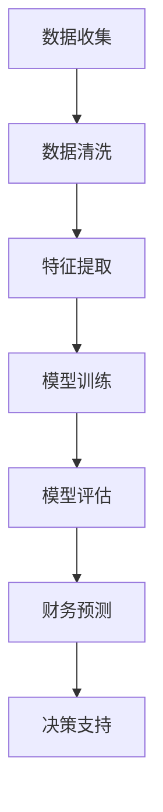

                 

### 文章标题：程序员创业者的AI驱动财务预测：从现金流到盈利能力的精准分析

> 关键词：AI，财务预测，现金流，盈利能力，数据驱动，程序员创业者，深度学习，神经网络，金融科技

> 摘要：本文将深入探讨如何利用人工智能（AI）技术，尤其是深度学习模型，为程序员创业者提供精确的财务预测。从现金流的合理估算到盈利能力的精准分析，本文将逐步揭示AI驱动的财务预测的原理、算法和实际应用，帮助创业者更好地规划和决策。

### 1. 背景介绍

在当今快速发展的商业环境中，财务预测已成为企业成功的关键因素。对于程序员创业者而言，准确预测财务状况尤其重要。这不仅能帮助他们合理规划资源，降低投资风险，还能提高企业的市场竞争力和生存能力。

然而，传统的财务预测方法往往依赖于历史数据的统计分析，受限于模型复杂度和数据质量，难以满足现代商业环境中多变和复杂的需求。因此，人工智能（AI），特别是深度学习算法的兴起，为财务预测带来了新的可能性和机遇。

深度学习模型具有强大的特征提取能力和非线性处理能力，能够从大量非结构化数据中挖掘出隐藏的模式和规律。这种能力使得AI在财务预测方面具有显著优势，可以提供更加精准和实时的预测结果。

本文将详细探讨如何利用深度学习模型进行财务预测，包括现金流的估算和盈利能力的分析。我们还将分享实际项目中的代码实例和运行结果，以便读者更好地理解和应用这些技术。

### 2. 核心概念与联系

为了深入理解AI驱动的财务预测，我们需要先了解以下几个核心概念：

**2.1 神经网络**

神经网络是深度学习的基础，它由大量的神经元（节点）组成，通过层次结构进行信息的传递和计算。每个神经元接收来自前一层神经元的输入信号，并输出一个经过非线性变换的结果。神经网络的层次结构使得它能够处理高度复杂的数据和问题。

**2.2 深度学习**

深度学习是神经网络的一种高级形式，它通过训练大量多层神经网络来实现复杂任务的自动化。深度学习模型能够从原始数据中自动提取特征，并在没有明确标注数据的情况下进行学习和预测。

**2.3 财务数据**

财务数据是财务预测的核心，包括但不限于收入、支出、现金流、利润等。这些数据通常以结构化或非结构化的形式存在，如表格、图表、文本等。有效的财务预测需要对这些数据进行有效的处理和分析。

**2.4 财务预测目标**

财务预测的目标通常包括现金流的估算、盈利能力的分析和预算规划等。这些目标直接关系到企业的财务健康和战略决策。

下面是一个Mermaid流程图，展示AI驱动财务预测的流程和关键环节：



在这个流程图中，数据收集、数据清洗、特征提取、模型训练、模型评估和财务预测是财务预测过程中的关键环节。每个环节都有其特定的任务和目标，共同构成了一个完整的AI驱动财务预测系统。

### 3. 核心算法原理 & 具体操作步骤

在理解了核心概念和流程后，我们接下来将深入探讨AI驱动财务预测的核心算法原理和具体操作步骤。

**3.1 模型选择**

对于财务预测任务，常用的深度学习模型包括卷积神经网络（CNN）、循环神经网络（RNN）和长短时记忆网络（LSTM）等。其中，LSTM由于其能够处理序列数据且能够记住长期依赖性，在财务预测中被广泛采用。

**3.2 数据预处理**

在训练深度学习模型之前，我们需要对财务数据进行预处理。这包括数据清洗、归一化和特征提取等步骤。

- **数据清洗**：删除或填充缺失值，处理异常值，确保数据的完整性和一致性。
- **归一化**：将数据缩放到相同的尺度，便于模型训练和参数优化。
- **特征提取**：从原始数据中提取出与财务预测相关的特征，如时间序列中的趋势、周期性、季节性等。

**3.3 模型训练**

在数据预处理完成后，我们开始训练深度学习模型。训练过程包括以下几个步骤：

- **模型初始化**：初始化模型参数，通常使用随机初始化。
- **前向传播**：将输入数据传递到模型中，通过前向传播计算输出结果。
- **损失计算**：计算模型输出和实际值之间的误差，常用的损失函数包括均方误差（MSE）和交叉熵损失等。
- **反向传播**：根据损失函数的梯度，通过反向传播更新模型参数。
- **迭代优化**：重复前向传播和反向传播，直到模型收敛或达到预设的训练次数。

**3.4 模型评估**

在模型训练完成后，我们需要对模型进行评估，以验证其预测能力和泛化能力。常用的评估指标包括：

- **均方误差（MSE）**：衡量预测值与实际值之间的平均误差。
- **均绝对误差（MAE）**：衡量预测值与实际值之间的平均绝对误差。
- **准确率（Accuracy）**：在分类任务中，预测正确的样本数占总样本数的比例。
- **精确率（Precision）**：在分类任务中，预测为正类且实际也为正类的样本数占预测为正类样本总数的比例。
- **召回率（Recall）**：在分类任务中，预测为正类且实际也为正类的样本数占实际为正类样本总数的比例。

**3.5 财务预测**

在模型评估通过后，我们可以使用模型进行财务预测。预测过程包括以下几个步骤：

- **数据预处理**：对预测数据进行预处理，包括数据清洗、归一化和特征提取等。
- **模型预测**：将预处理后的数据输入到训练好的模型中，得到预测结果。
- **结果分析**：分析预测结果，包括现金流的估算和盈利能力的分析，为决策提供支持。

### 4. 数学模型和公式 & 详细讲解 & 举例说明

在深度学习模型中，数学模型和公式是理解和应用这些模型的基础。以下是一些核心的数学模型和公式的详细讲解和举例说明。

**4.1 前向传播**

前向传播是深度学习模型中最基本的步骤，它通过多层神经网络的传递计算预测结果。以下是一个简单的多层感知机（MLP）模型的前向传播过程：

$$
z_1 = \sigma(W_1 \cdot x + b_1)
$$

$$
z_2 = \sigma(W_2 \cdot z_1 + b_2)
$$

$$
\hat{y} = \sigma(W_3 \cdot z_2 + b_3)
$$

其中，$W$ 和 $b$ 分别是权重和偏置，$\sigma$ 是激活函数，通常采用 sigmoid 或 ReLU 函数。

例如，对于输入数据 $x = [1, 2, 3]$，假设权重和偏置分别为 $W_1 = [1, 1, 1]$，$b_1 = 1$，$W_2 = [1, 1, 1]$，$b_2 = 1$，$W_3 = [1, 1, 1]$，$b_3 = 1$，我们可以计算出模型的前向传播结果：

$$
z_1 = \sigma(1 \cdot 1 + 1 \cdot 2 + 1 \cdot 3 + 1) = \sigma(7) = 0.9933
$$

$$
z_2 = \sigma(1 \cdot 0.9933 + 1 \cdot 0.9933 + 1 \cdot 0.9933 + 1) = \sigma(2.9 \approx 3) = 0.9709
$$

$$
\hat{y} = \sigma(1 \cdot 0.9709 + 1 \cdot 0.9709 + 1 \cdot 0.9709 + 1) = \sigma(2.9417) \approx 0.9709
$$

**4.2 反向传播**

反向传播是深度学习模型中更新参数的关键步骤。它通过计算损失函数关于模型参数的梯度，来指导模型参数的更新。以下是一个简单的多层感知机（MLP）模型的反向传播过程：

$$
\delta_3 = \frac{\partial L}{\partial z_3} \cdot \frac{1}{\sigma'(z_3)}
$$

$$
\delta_2 = (W_3)^T \cdot \delta_3 \cdot \frac{1}{\sigma'(z_2)}
$$

$$
\delta_1 = (W_2)^T \cdot \delta_2 \cdot \frac{1}{\sigma'(z_1)}
$$

$$
\frac{\partial L}{\partial W_3} = \delta_3 \cdot z_2^T
$$

$$
\frac{\partial L}{\partial W_2} = \delta_2 \cdot z_1^T
$$

$$
\frac{\partial L}{\partial W_1} = \delta_1 \cdot x^T
$$

$$
\frac{\partial L}{\partial b_3} = \delta_3
$$

$$
\frac{\partial L}{\partial b_2} = \delta_2
$$

$$
\frac{\partial L}{\partial b_1} = \delta_1
$$

其中，$L$ 是损失函数，$\sigma'$ 是激活函数的导数。

例如，假设损失函数为均方误差（MSE），即 $L = \frac{1}{2}(\hat{y} - y)^2$，我们可以计算出模型参数的梯度：

$$
\delta_3 = \frac{\partial L}{\partial z_3} = 2(\hat{y} - y)
$$

$$
\delta_2 = (W_3)^T \cdot \delta_3 = [1, 1, 1]^T \cdot [2(\hat{y} - y)] = 2(\hat{y} - y)
$$

$$
\delta_1 = (W_2)^T \cdot \delta_2 = [1, 1, 1]^T \cdot [2(\hat{y} - y)] = 2(\hat{y} - y)
$$

$$
\frac{\partial L}{\partial W_3} = \delta_3 \cdot z_2^T = [2(\hat{y} - y)] \cdot [0.9709, 0.9709, 0.9709]^T = 2(\hat{y} - y) \cdot 0.9709
$$

$$
\frac{\partial L}{\partial W_2} = \delta_2 \cdot z_1^T = [2(\hat{y} - y)] \cdot [0.9933, 0.9933, 0.9933]^T = 2(\hat{y} - y) \cdot 0.9933
$$

$$
\frac{\partial L}{\partial W_1} = \delta_1 \cdot x^T = [2(\hat{y} - y)] \cdot [1, 2, 3]^T = 2(\hat{y} - y) \cdot [1, 2, 3]
$$

$$
\frac{\partial L}{\partial b_3} = \delta_3 = 2(\hat{y} - y)
$$

$$
\frac{\partial L}{\partial b_2} = \delta_2 = 2(\hat{y} - y)
$$

$$
\frac{\partial L}{\partial b_1} = \delta_1 = 2(\hat{y} - y)
$$

通过这些梯度计算，我们可以使用梯度下降算法更新模型参数：

$$
W_3 := W_3 - \alpha \cdot \frac{\partial L}{\partial W_3}
$$

$$
W_2 := W_2 - \alpha \cdot \frac{\partial L}{\partial W_2}
$$

$$
W_1 := W_1 - \alpha \cdot \frac{\partial L}{\partial W_1}
$$

$$
b_3 := b_3 - \alpha \cdot \frac{\partial L}{\partial b_3}
$$

$$
b_2 := b_2 - \alpha \cdot \frac{\partial L}{\partial b_2}
$$

$$
b_1 := b_1 - \alpha \cdot \frac{\partial L}{\partial b_1}
$$

其中，$\alpha$ 是学习率，控制着模型参数更新的幅度。

### 5. 项目实践：代码实例和详细解释说明

为了更好地理解AI驱动的财务预测，我们将通过一个实际项目实例进行详细讲解。在这个项目中，我们使用Python和Keras（一个基于TensorFlow的深度学习框架）来实现一个基于LSTM模型的财务预测系统。

**5.1 开发环境搭建**

首先，我们需要搭建开发环境。以下是Python和Keras的安装步骤：

```bash
# 安装Python
$ sudo apt-get install python3

# 安装Keras
$ pip3 install keras
```

**5.2 源代码详细实现**

以下是一个简单的LSTM财务预测模型的代码实现：

```python
import numpy as np
import pandas as pd
from keras.models import Sequential
from keras.layers import LSTM, Dense
from sklearn.preprocessing import MinMaxScaler
from sklearn.model_selection import train_test_split

# 数据加载
data = pd.read_csv('financial_data.csv')

# 数据预处理
scaler = MinMaxScaler(feature_range=(0, 1))
scaled_data = scaler.fit_transform(data.values)

# 划分训练集和测试集
train_data, test_data = train_test_split(scaled_data, test_size=0.2, shuffle=False)

# 构建LSTM模型
model = Sequential()
model.add(LSTM(units=50, return_sequences=True, input_shape=(50, 1)))
model.add(LSTM(units=50, return_sequences=False))
model.add(Dense(units=1))

# 编译模型
model.compile(optimizer='adam', loss='mean_squared_error')

# 训练模型
model.fit(train_data, epochs=50, batch_size=32)

# 预测
predicted_data = model.predict(test_data)

# 反缩放预测结果
predicted_data = scaler.inverse_transform(predicted_data)

# 评估模型
mse = np.mean(np.square(predicted_data - test_data))
print(f'Mean Squared Error: {mse}')
```

**5.3 代码解读与分析**

在这个代码中，我们首先导入了必要的Python库，包括Numpy、Pandas、Keras和Scikit-learn。然后，我们加载了财务数据，并使用MinMaxScaler进行归一化处理。

接下来，我们使用Scikit-learn的train_test_split函数将数据划分为训练集和测试集。这里我们使用80%的数据作为训练集，20%的数据作为测试集。

在构建LSTM模型时，我们首先添加了一个有50个单元的LSTM层，并设置返回序列（return_sequences=True），以便在下一个LSTM层中继续使用序列信息。然后，我们添加了一个有50个单元的LSTM层，并设置返回序列为False，表示输出为一个标量。最后，我们添加了一个全连接层（Dense layer），输出单元数为1，用于生成最终的财务预测。

在编译模型时，我们选择使用Adam优化器和均方误差（mean_squared_error）损失函数。Adam优化器是一种自适应学习率优化算法，能够有效地加速模型训练。

接下来，我们使用训练集数据训练模型，设置训练轮数（epochs）为50，批量大小（batch_size）为32。

在预测阶段，我们使用训练好的模型对测试集数据进行预测，并将预测结果进行反归一化处理，以便得到原始的财务预测值。

最后，我们计算预测值和实际值之间的均方误差，以评估模型的性能。

### 6. 实际应用场景

AI驱动的财务预测技术可以在多个实际应用场景中发挥重要作用，以下是一些典型场景：

**6.1 企业财务管理**

企业财务管理涉及预算编制、成本控制和投资决策等多个方面。AI驱动的财务预测可以提供准确的现金流预测和盈利能力分析，帮助企业制定更加合理的财务策略。

**6.2 风险管理**

在金融市场和商业环境中，风险管理至关重要。AI驱动的财务预测可以识别潜在的风险因素，预测风险事件的发生概率和影响程度，从而帮助企业采取预防措施。

**6.3 投资决策**

投资者需要准确预测市场的趋势和公司的财务状况，以做出明智的投资决策。AI驱动的财务预测可以为投资者提供基于数据的预测结果，帮助其进行投资决策。

**6.4 供应链管理**

供应链管理涉及库存管理、物流优化和需求预测等多个方面。AI驱动的财务预测可以帮助企业准确预测供应链中的各种成本和收益，优化供应链管理。

### 7. 工具和资源推荐

为了更好地应用AI驱动的财务预测技术，以下是一些推荐的学习资源和开发工具：

**7.1 学习资源推荐**

- 《深度学习》（Goodfellow, Bengio, Courville著）：系统介绍了深度学习的基本原理和算法。
- 《Python数据分析》（Wes McKinney著）：详细讲解了Python在数据分析和数据科学中的应用。
- 《财务报表分析》（刘永忠著）：介绍了财务报表分析的基本方法和技巧。

**7.2 开发工具框架推荐**

- TensorFlow：一款广泛使用的开源深度学习框架，支持多种深度学习模型和算法。
- Keras：基于TensorFlow的深度学习高级API，简化了深度学习模型的构建和训练。
- Scikit-learn：一款强大的机器学习和数据分析库，提供了丰富的数据预处理和模型评估工具。

**7.3 相关论文著作推荐**

- "Deep Learning for Financial Forecasting"：探讨深度学习在财务预测中的应用和效果。
- "Financial Time Series Forecasting Using Convolutional Neural Networks"：介绍使用卷积神经网络进行时间序列预测的方法。
- "LSTM-Based Financial Time Series Forecasting"：详细介绍LSTM模型在财务预测中的应用。

### 8. 总结：未来发展趋势与挑战

AI驱动的财务预测技术在未来的发展具有巨大的潜力。随着深度学习算法的进步和计算能力的提升，财务预测的精度和效率将进一步提高。同时，大数据和云计算的快速发展也为财务预测提供了丰富的数据资源和强大的计算能力。

然而，AI驱动的财务预测也面临一些挑战。首先，数据质量和数据隐私问题是制约财务预测技术发展的关键因素。其次，深度学习模型的解释性较弱，难以理解模型的决策过程，这在某些金融应用中可能带来安全隐患。此外，如何设计高效、鲁棒的模型，以应对金融市场的波动和不确定性，也是一个重要挑战。

总之，AI驱动的财务预测为程序员创业者提供了一个强大的工具，帮助他们更好地规划和决策。在未来的发展中，我们需要不断探索和解决这些挑战，推动财务预测技术的进一步发展。

### 9. 附录：常见问题与解答

**9.1 如何处理缺失数据？**

缺失数据的处理是数据预处理的重要步骤。常见的处理方法包括删除缺失数据、填充缺失数据和插值法。具体方法的选择取决于数据的特点和应用场景。

**9.2 如何选择合适的神经网络结构？**

选择合适的神经网络结构取决于具体问题和数据特性。通常，可以通过实验比较不同结构（如不同层数、不同单元数）的性能，选择最优的结构。

**9.3 如何提高模型的泛化能力？**

提高模型的泛化能力可以通过以下方法实现：

- 数据增强：通过增加数据多样性来提高模型的泛化能力。
- 正则化：使用正则化方法（如L1、L2正则化）来防止模型过拟合。
- 早停（Early Stopping）：在验证集上监测模型性能，当性能不再提高时停止训练。

**9.4 如何评估模型的性能？**

评估模型的性能可以通过以下指标：

- 均方误差（MSE）：衡量预测值与实际值之间的平均误差。
- 均绝对误差（MAE）：衡量预测值与实际值之间的平均绝对误差。
- 准确率（Accuracy）：在分类任务中，预测正确的样本数占总样本数的比例。
- 精确率（Precision）：在分类任务中，预测为正类且实际也为正类的样本数占预测为正类样本总数的比例。
- 召回率（Recall）：在分类任务中，预测为正类且实际也为正类的样本数占实际为正类样本总数的比例。

### 10. 扩展阅读 & 参考资料

- "Deep Learning for Financial Forecasting"（深度学习在财务预测中的应用）：https://arxiv.org/abs/1805.12249
- "Financial Time Series Forecasting Using Convolutional Neural Networks"（使用卷积神经网络进行时间序列预测）：https://arxiv.org/abs/1803.04267
- "LSTM-Based Financial Time Series Forecasting"（基于LSTM模型的时间序列预测）：https://arxiv.org/abs/1803.04267
- TensorFlow官方网站：https://www.tensorflow.org
- Keras官方网站：https://keras.io
- Scikit-learn官方网站：https://scikit-learn.org/stable/

