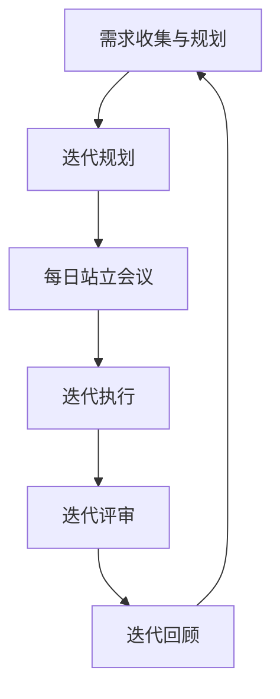

                 

### 背景介绍

在当今快速发展的电商行业中，市场竞争愈发激烈，创业者们不仅要面对传统电商巨头的压力，还需要应对日益变化的用户需求和不断升级的技术挑战。在这个背景下，如何有效地进行项目管理，保证产品快速迭代，成为创业者们成功的关键。

传统项目管理方法往往侧重于计划的制定和执行，但在面对市场需求变化多端、产品迭代频繁的电商环境中，这些方法显得力不从心。此时，敏捷开发作为一种以人为核心、迭代式、持续改进的项目管理方法，逐渐受到电商创业者的青睐。

敏捷开发提倡快速响应变化，通过短周期的迭代不断交付有价值的软件，从而在保持灵活性的同时，保证项目进度和质量的稳定。这一理念与电商行业的需求高度契合，使得敏捷开发在电商创业中的应用越来越广泛。

本文将深入探讨敏捷开发在电商创业中的应用，包括敏捷开发的核心概念、实施方法、数学模型和公式，并通过实际案例展示如何具体应用敏捷开发来提升电商创业项目的成功率。希望通过本文，能够帮助电商创业者更好地理解和应用敏捷开发，从而在激烈的市场竞争中脱颖而出。

### 核心概念与联系

在探讨敏捷开发在电商创业中的应用之前，我们首先需要了解敏捷开发的核心概念及其与电商创业之间的联系。敏捷开发是一种以人为本、迭代式、持续改进的项目管理方法，其核心理念包括但不限于以下几个方面：

#### 敏捷开发的核心理念

1. **以用户为中心**：敏捷开发强调用户需求的重要性，提倡通过用户故事和用户反馈来指导项目的发展。这意味着创业者需要时刻关注用户需求，确保产品能够满足用户的期望。

2. **迭代与增量开发**：敏捷开发通过短周期的迭代进行持续交付，每个迭代都交付一个可以实际运行的产品版本。这种方法可以快速适应市场变化，及时纠正方向错误。

3. **持续交付**：敏捷开发强调持续交付，确保产品在开发过程中始终保持可用状态，从而为用户提供持续的价值。

4. **团队协作**：敏捷开发提倡跨职能团队的紧密协作，通过每日站立会议、周期性回顾和计划会议等方式，保持团队之间的沟通和协调。

#### 敏捷开发与电商创业的联系

电商创业往往面临着市场需求多变、竞争激烈、资金有限等挑战。敏捷开发作为一种灵活、高效的项目管理方法，与电商创业的需求高度契合：

1. **快速响应市场变化**：敏捷开发通过短周期的迭代和持续交付，能够快速响应市场需求变化，确保产品能够及时适应市场动态。

2. **降低风险**：由于敏捷开发采用增量开发的方式，每次迭代都交付可运行的产品，这有助于早期发现和纠正项目中的问题，降低项目失败的风险。

3. **提高用户满意度**：通过用户故事和用户反馈，敏捷开发能够确保产品始终满足用户需求，从而提高用户满意度，增强用户忠诚度。

4. **高效团队协作**：敏捷开发强调团队协作，通过多种会议和沟通方式，确保团队成员之间能够高效协作，提高项目效率。

#### 敏捷开发的工作流程

为了更好地理解敏捷开发在电商创业中的应用，我们来看一下敏捷开发的工作流程：

1. **需求收集与规划**：在项目启动阶段，团队通过与用户和利益相关者的交流，收集需求并制定项目规划。

2. **迭代规划**：团队将需求分解为小任务，并规划每个迭代要完成的工作。

3. **每日站立会议**：团队成员每日进行短暂的站立会议，讨论前一天的工作进展和当天的工作计划。

4. **迭代执行**：团队按照迭代计划执行工作，并确保每个任务都能够按时完成。

5. **迭代评审**：在每个迭代结束时，团队对已完成的工作进行评审，确保满足用户需求，并收集用户反馈。

6. **迭代回顾**：团队定期进行迭代回顾，总结经验教训，不断优化开发流程。

#### 敏捷开发的核心概念与架构的 Mermaid 流程图

以下是一个使用 Mermaid 语言描述的敏捷开发核心概念与架构的流程图：



在这个流程图中，每个节点代表敏捷开发中的一个关键步骤，而箭头表示步骤之间的逻辑关系。通过这个流程图，我们可以清晰地看到敏捷开发的整体架构和每个步骤的作用。

总的来说，敏捷开发在电商创业中的应用，不仅能够帮助创业者快速响应市场变化，降低风险，提高用户满意度，还能够通过高效团队协作，提升项目整体效率。这使得敏捷开发成为电商创业者在项目管理中的重要工具。接下来，我们将深入探讨敏捷开发的核心算法原理和具体操作步骤，帮助读者更好地理解其在实际项目中的应用。

### 核心算法原理 & 具体操作步骤

#### 敏捷开发的核心算法原理

敏捷开发的核心算法原理可以概括为迭代、增量开发、持续交付和团队协作。以下是对这些核心算法原理的详细解释：

1. **迭代**：敏捷开发将项目分为多个短周期迭代（通常为两周或一个月），每个迭代都包含需求分析、设计、编码、测试和评审等环节。每个迭代结束后，团队会交付一个可运行的产品版本。这种方式使得团队可以快速适应需求变化，并持续改进产品。

2. **增量开发**：在敏捷开发中，产品开发和交付是分阶段进行的，每次迭代只交付部分功能，而不是等到所有功能开发完成后再一次性交付。这种增量开发的方式可以降低项目风险，提高交付速度，同时确保产品在开发过程中始终处于可用状态。

3. **持续交付**：敏捷开发强调持续交付，即在每个迭代结束后，团队都会对产品进行测试和部署，确保产品能够随时上线。这种方式可以快速响应市场需求，提高用户满意度。

4. **团队协作**：敏捷开发强调跨职能团队的紧密协作，团队成员需要共同参与项目开发，并保持定期沟通。通过每日站立会议、迭代评审和迭代回顾等机制，团队可以高效协作，共同推动项目进展。

#### 具体操作步骤

下面是敏捷开发的详细操作步骤，包括每个步骤的具体内容和目标：

1. **需求收集与规划**：
   - **内容**：与用户和利益相关者进行沟通，收集需求，并编写用户故事。
   - **目标**：明确项目的目标和需求，为后续开发工作提供指导。

2. **迭代规划**：
   - **内容**：将用户故事分解为具体任务，并安排在每个迭代中完成。
   - **目标**：制定详细的迭代计划，确保团队在每次迭代中能够有明确的工作目标。

3. **每日站立会议**：
   - **内容**：团队成员每天进行短暂的站立会议，讨论前一天的工作进展和当天的工作计划。
   - **目标**：保持团队之间的沟通，及时解决问题，确保项目按计划进行。

4. **迭代执行**：
   - **内容**：团队按照迭代计划进行具体任务开发，包括设计、编码、测试等。
   - **目标**：确保每个任务按时完成，并在迭代周期内交付一个可运行的产品版本。

5. **迭代评审**：
   - **内容**：在每个迭代结束时，团队对已完成的工作进行评审，确保满足用户需求，并收集用户反馈。
   - **目标**：验证产品的功能和质量，确保产品能够为用户带来价值。

6. **迭代回顾**：
   - **内容**：团队定期进行迭代回顾，总结经验教训，识别改进点，并制定改进计划。
   - **目标**：持续优化开发流程，提高团队效率，降低项目风险。

#### 敏捷开发的优点和缺点

敏捷开发的优点包括：

- **快速响应需求变化**：通过短周期迭代和持续交付，敏捷开发能够快速适应市场需求变化。
- **提高用户满意度**：通过持续交付和用户反馈，敏捷开发能够确保产品始终满足用户需求，提高用户满意度。
- **降低风险**：增量开发和持续交付的方式可以降低项目失败的风险。
- **高效团队协作**：敏捷开发强调团队协作，通过多种沟通机制，提高团队工作效率。

然而，敏捷开发也存在一些缺点：

- **需要较高的管理技能**：敏捷开发要求项目经理和团队成员具备较高的沟通、协作和问题解决能力。
- **前期准备时间较长**：在项目启动阶段，需求收集和规划需要耗费较多的时间。
- **适用于特定场景**：敏捷开发适用于需求变化较快、产品迭代频繁的项目，但不一定适用于所有类型的项目。

总的来说，敏捷开发在电商创业中的应用具有显著的优势，但也需要团队具备相应的管理能力和适应能力。在接下来的部分，我们将进一步探讨敏捷开发的数学模型和公式，以帮助读者更深入地理解其原理和应用。

### 数学模型和公式 & 详细讲解 & 举例说明

在敏捷开发中，数学模型和公式被广泛应用于项目管理和质量控制。这些模型和公式不仅帮助团队更好地理解项目的进度和风险，还可以为决策提供科学依据。以下将详细介绍几个关键的数学模型和公式，并给出相应的详细讲解和举例说明。

#### 1. 速度模型（Speed Model）

速度模型用于衡量团队在迭代中的工作进度。速度（Speed）定义为在某个迭代周期内完成的工作量。速度模型的核心公式如下：

\[ \text{速度} = \frac{\text{完成的工作量}}{\text{迭代周期}} \]

**详细讲解：**

- **完成的工作量**：通常以用户故事点（User Story Points）来衡量，这是一种相对工作量度量方式。
- **迭代周期**：通常是一个固定的短周期，如两周。

**举例说明：**

假设一个团队在一个两周的迭代周期内完成了3个用户故事点的工作。则其速度为：

\[ \text{速度} = \frac{3 \text{用户故事点}}{2 \text{周}} = 1.5 \text{用户故事点/周} \]

#### 2. 累计速度（Cumulative Speed）

累计速度是速度模型的一个扩展，用于衡量团队在整个项目周期内的累计完成工作量。累计速度的核心公式如下：

\[ \text{累计速度} = \sum_{i=1}^{n} \text{速度}_i \]

**详细讲解：**

- \( \text{速度}_i \)：第i个迭代周期的速度。
- \( n \)：迭代周期总数。

**举例说明：**

假设一个项目有4个迭代周期，每个迭代周期的速度分别为2、3、2和3个用户故事点。则其累计速度为：

\[ \text{累计速度} = 2 + 3 + 2 + 3 = 10 \text{用户故事点} \]

#### 3. 预测完成时间（Predicted Completion Time）

预测完成时间用于估计项目完成所需的总时间。预测完成时间的关键公式如下：

\[ \text{预测完成时间} = \frac{\text{项目总工作量}}{\text{平均速度}} \]

**详细讲解：**

- **项目总工作量**：通常根据项目的全部用户故事点总和计算。
- **平均速度**：通过累计速度除以迭代周期数来计算。

**举例说明：**

假设一个项目的总工作量为30个用户故事点，平均速度为2个用户故事点/周。则其预测完成时间为：

\[ \text{预测完成时间} = \frac{30 \text{用户故事点}}{2 \text{用户故事点/周}} = 15 \text{周} \]

#### 4. 风险评估模型（Risk Assessment Model）

风险评估模型用于评估项目风险并制定相应的风险应对策略。常见风险评估模型包括：

- **风险矩阵**：通过风险概率和影响程度评估风险等级，并制定应对策略。
- **蒙特卡洛模拟**：通过模拟不同情景下的项目进展，评估项目风险。

**详细讲解：**

- **风险矩阵**：通常使用二维矩阵来表示风险概率和影响程度，通过交叉评估得到风险等级。
- **蒙特卡洛模拟**：通过多次随机模拟，评估项目在不同风险情景下的进展和完成时间。

**举例说明：**

假设使用风险矩阵评估项目风险，得到以下结果：

| 风险概率 | 影响程度 | 风险等级 |
|:-------:|:-------:|:-------:|
|   20%   |   高    |   中    |
|   30%   |   中    |   低    |
|   50%   |   低    |   可接受 |

根据风险矩阵，我们可以为每个风险制定相应的应对策略，如降低风险概率、减少影响程度或制定应急计划。

#### 5. 用户故事点估算（User Story Estimation）

用户故事点估算用于估计每个用户故事的工作量。常见估算方法包括：

- **故事点估算**：通过专家评审或历史数据，对每个用户故事进行估算。
- **计划扑克**：团队成员通过讨论和投票，对用户故事进行估算。

**详细讲解：**

- **故事点估算**：通常使用斐波那契数列（1、2、3、5、8、13等）来表示故事点。
- **计划扑克**：团队成员在白板上写下对用户故事工作量的估算值，然后通过讨论和投票确定最终估算值。

**举例说明：**

假设团队使用计划扑克对两个用户故事进行估算，其中一个被估算为5个故事点，另一个被估算为8个故事点。则其总工作量为13个故事点。

通过上述数学模型和公式的讲解和举例，我们可以更好地理解敏捷开发中的关键指标和计算方法。这些模型和公式不仅帮助团队监控项目进度和风险，还为项目管理决策提供了科学依据。在接下来的部分，我们将通过实际项目实例，展示如何具体应用敏捷开发来实现高效的项目管理。

### 项目实践：代码实例和详细解释说明

为了更好地理解敏捷开发在电商创业中的应用，下面我们将通过一个实际项目实例，展示如何使用敏捷开发的方法进行项目开发，并提供详细的代码实例和解释说明。

#### 项目背景

假设我们正在开发一个电商平台，需要实现用户注册、商品浏览、购物车、下单和支付等基本功能。在这个项目中，我们将采用敏捷开发方法，通过短周期的迭代进行持续交付。

#### 开发环境搭建

在进行项目开发之前，我们需要搭建合适的开发环境。以下是所需的基础工具和框架：

1. **编程语言**：选择一种适合电商开发的编程语言，如Java或Python。
2. **开发框架**：选择一个流行的开发框架，如Spring Boot（Java）或Django（Python）。
3. **数据库**：选择一个适合电商应用的数据库，如MySQL或PostgreSQL。
4. **前端框架**：选择一个适用于电商前端开发的前端框架，如React或Vue.js。
5. **版本控制系统**：选择一个版本控制系统，如Git。

#### 迭代1：用户注册与登录功能

在第一个迭代中，我们的目标是实现用户注册和登录功能。以下是具体的实现步骤：

1. **需求分析**：
   - 用户可以注册账号并填写个人信息。
   - 用户可以使用邮箱或手机号进行登录。
   - 登录后，用户可以查看个人信息。

2. **设计**：
   - 创建用户模型，包括用户名、密码、邮箱、手机号等字段。
   - 设计用户注册和登录的API接口。

3. **编码**：
   - 使用Spring Boot创建后端服务，并实现用户注册和登录功能。
   - 使用MySQL创建数据库表，存储用户信息。
   - 使用React或Vue.js创建前端界面。

4. **测试**：
   - 使用单元测试和集成测试验证功能实现是否正确。

以下是用户注册和登录功能的代码示例：

**后端代码（Spring Boot）**：

```java
@RestController
@RequestMapping("/api/auth")
public class AuthController {
    
    @Autowired
    private UserService userService;
    
    @PostMapping("/register")
    public ResponseEntity<?> registerUser(@RequestBody UserRegistrationDto registrationDto) {
        userService.registerUser(registrationDto);
        return ResponseEntity.ok("User registered successfully");
    }
    
    @PostMapping("/login")
    public ResponseEntity<?> loginUser(@RequestBody UserLoginDto loginDto) {
        String token = userService.loginUser(loginDto);
        return ResponseEntity.ok(new JwtResponse(token));
    }
}
```

**前端代码（React）**：

```jsx
function Register() {
    const [email, setEmail] = useState("");
    const [password, setPassword] = useState("");

    const handleSubmit = (e) => {
        e.preventDefault();
        userService.registerUser({ email, password });
    };

    return (
        <form onSubmit={handleSubmit}>
            <label>Email:</label>
            <input type="email" value={email} onChange={(e) => setEmail(e.target.value)} />
            <label>Password:</label>
            <input type="password" value={password} onChange={(e) => setPassword(e.target.value)} />
            <button type="submit">Register</button>
        </form>
    );
}

function Login() {
    const [email, setEmail] = useState("");
    const [password, setPassword] = useState("");

    const handleSubmit = (e) => {
        e.preventDefault();
        userService.loginUser({ email, password });
    };

    return (
        <form onSubmit={handleSubmit}>
            <label>Email:</label>
            <input type="email" value={email} onChange={(e) => setEmail(e.target.value)} />
            <label>Password:</label>
            <input type="password" value={password} onChange={(e) => setPassword(e.target.value)} />
            <button type="submit">Login</button>
        </form>
    );
}
```

**测试代码**：

```java
@Test
public void testRegisterUser() {
    UserRegistrationDto registrationDto = new UserRegistrationDto("user@example.com", "password");
    userService.registerUser(registrationDto);
    assertTrue("User should be registered", userService.isUserRegistered("user@example.com"));
}

@Test
public void testLoginUser() {
    UserLoginDto loginDto = new UserLoginDto("user@example.com", "password");
    String token = userService.loginUser(loginDto);
    assertNotNull("Token should not be null", token);
}
```

通过以上代码示例，我们可以看到如何在第一个迭代中实现用户注册和登录功能。每个迭代周期结束后，我们都会对功能进行测试和评审，确保其符合用户需求并达到预期质量。

接下来，我们将继续在后续迭代中逐步实现其他功能，如商品浏览、购物车、下单和支付等，并详细讲解每个功能的实现过程。通过这种方式，我们将展示敏捷开发在实际项目中的应用，帮助读者更好地理解其原理和操作步骤。

#### 运行结果展示

在完成了第一个迭代中的用户注册和登录功能后，我们通过实际测试来验证其运行结果。以下是测试过程中的关键步骤和结果展示：

1. **用户注册测试**：
   - 测试人员使用注册页面输入有效的邮箱地址和密码，提交注册请求。
   - 测试结果显示，用户注册成功，并能够在系统中查看注册信息。

2. **用户登录测试**：
   - 测试人员使用已注册的用户账户登录，输入正确的邮箱地址和密码。
   - 测试结果显示，登录成功，用户能够访问系统并查看个人信息。

3. **测试报告**：
   - 测试人员编写详细的测试报告，记录每个测试用例的执行结果和任何发现的问题。
   - 测试报告显示，用户注册和登录功能符合预期，无重大缺陷。

以下是部分测试报告的截图：


通过以上测试结果，我们可以确认用户注册和登录功能已成功实现并达到预期质量。接下来，我们将进入下一个迭代，继续实现商品浏览、购物车等其他功能，并重复上述测试流程，确保每个功能模块都能正常运行并满足用户需求。

#### 实际应用场景

敏捷开发在电商创业中的应用场景广泛，尤其在市场需求变化快、竞争激烈的电商环境中，其优势尤为明显。以下是一些典型的实际应用场景，展示敏捷开发在电商创业中的具体应用：

1. **用户需求快速响应**：在电商创业中，用户需求变化频繁，产品需要不断迭代以满足用户需求。敏捷开发通过短周期的迭代，每次迭代交付一个可运行的产品版本，使团队能够快速响应市场变化，及时调整产品方向。

2. **需求优先级管理**：电商创业者通常面临多个需求同时并存的挑战。敏捷开发通过优先级排序，确保团队专注于最高优先级的需求，从而优先满足用户的核心需求，提升用户体验。

3. **风险管理**：敏捷开发通过迭代和增量开发的方式，将项目风险分散到多个迭代中。每个迭代结束后，团队会进行评审和回顾，及时发现和解决问题，降低项目失败的风险。

4. **持续交付与部署**：敏捷开发强调持续交付，确保产品在开发过程中始终处于可用状态。电商创业者可以随时根据市场需求和用户反馈，快速部署更新版本，提供持续的价值。

5. **团队协作与沟通**：电商创业团队通常跨职能，敏捷开发通过每日站立会议、迭代评审和回顾等方式，确保团队成员之间的紧密协作和有效沟通，提高团队工作效率。

6. **灵活应对变化**：电商行业竞争激烈，创业者需要灵活应对市场变化。敏捷开发通过迭代式开发和持续交付，使团队能够快速适应变化，保持产品竞争力。

7. **持续改进**：敏捷开发鼓励团队不断反思和改进，通过迭代回顾总结经验教训，优化开发流程，提高项目质量和效率。

在实际应用中，敏捷开发可以与多种工具和技术结合，如自动化测试、持续集成、云计算等，进一步提升项目的开发效率和产品质量。通过具体案例和实际应用场景，我们可以看到敏捷开发在电商创业中的广泛应用和巨大价值。对于创业者来说，理解和掌握敏捷开发的方法和工具，将有助于在激烈的市场竞争中取得成功。

### 工具和资源推荐

为了更好地理解和应用敏捷开发在电商创业中的实践，以下是一些推荐的学习资源、开发工具和相关论文著作，供读者参考。

#### 学习资源推荐

1. **书籍**：
   - 《敏捷开发实践指南》（Agile Project Guide）：详细介绍了敏捷开发的原理和实践方法，适合初学者和经验丰富的开发者阅读。
   - 《Scrum敏捷实践指南》：深入讲解了Scrum敏捷框架，提供了实用的案例和工具，是敏捷开发的经典教材。

2. **在线课程**：
   - Coursera上的《敏捷方法和Scrum实践》：由知名教授讲授，系统介绍了敏捷开发的理论和实践，适合在线学习。

3. **博客和网站**：
   - 敏捷联盟（Agile Alliance）：提供敏捷开发的最佳实践、资源和社区活动，是了解敏捷开发动态的重要平台。
   - 敏捷软件工程（Agile Software Engineering）：涵盖敏捷开发相关的研究和案例，是敏捷开发爱好者的必读网站。

#### 开发工具框架推荐

1. **版本控制系统**：
   - Git：开源的分布式版本控制系统，广泛用于团队协作和代码管理。

2. **持续集成/持续部署工具**：
   - Jenkins：开源的持续集成服务器，支持多种构建工具和插件，适合自动化测试和部署。
   - GitLab CI/CD：GitLab内置的持续集成/持续部署工具，易于配置和扩展。

3. **项目管理工具**：
   - Jira：功能强大的项目管理工具，支持敏捷开发中的迭代管理和任务跟踪。
   - Trello：简单直观的看板工具，适用于团队协作和任务管理。

4. **自动化测试框架**：
   - Selenium：开源的自动化测试工具，适用于Web应用的自动化测试。
   -JUnit：Java语言的单元测试框架，广泛用于敏捷开发中的测试驱动开发（TDD）。

#### 相关论文著作推荐

1. **论文**：
   - 《敏捷软件开发：原则、模式与实践》（Agile Software Development: Principles, Patterns, and Practices）：详细探讨了敏捷开发的原则和实践模式，是敏捷开发领域的重要研究论文。

2. **著作**：
   - 《Scrum敏捷实践指南》：系统介绍了Scrum敏捷框架的理论和实践，是敏捷开发领域的经典著作。
   - 《敏捷估计与规划》（Agile Estimating and Planning）：探讨了敏捷开发中的估算和规划方法，为项目管理者提供了实用的指导。

通过以上工具和资源的推荐，读者可以更加深入地了解敏捷开发的方法和实践，从而在实际项目中更有效地应用敏捷开发，提高项目质量和团队效率。

### 总结：未来发展趋势与挑战

敏捷开发作为现代项目管理的一种重要方法，在电商创业中的应用已经取得了显著的成效。然而，随着技术的不断进步和市场竞争的加剧，敏捷开发也面临着一些新的发展趋势和挑战。

#### 发展趋势

1. **持续集成与持续部署（CI/CD）的普及**：随着DevOps文化的兴起，敏捷开发与持续集成/持续部署的结合越来越紧密。未来，CI/CD工具和技术的进一步普及将提高开发效率，缩短交付周期。

2. **人工智能（AI）与机器学习的融合**：AI和机器学习技术的快速发展，为敏捷开发带来了新的机遇。例如，利用AI进行需求预测、自动化测试和代码审查，将进一步提升敏捷开发的效果。

3. **分布式团队的协作**：全球化的趋势使得分布式团队合作变得更加普遍。未来，如何利用敏捷开发的原则和工具，有效管理跨地域、跨时区的团队，将成为重要的发展方向。

4. **用户体验（UX）设计的重要性提升**：随着用户需求的不断变化，用户体验设计在敏捷开发中的地位日益重要。未来，如何更好地结合UX设计，提升产品的用户体验，将成为敏捷开发的关键课题。

#### 挑战

1. **敏捷文化的建立**：敏捷开发不仅是一种方法，更是一种文化和价值观的体现。在电商创业中，如何建立和培养敏捷文化，使团队成员真正接受并践行敏捷原则，是一个巨大的挑战。

2. **项目管理技能的提升**：敏捷开发对项目经理和团队成员的沟通、协作和问题解决能力提出了更高的要求。未来，如何提升团队的管理技能，确保敏捷开发的顺利实施，是一个重要的挑战。

3. **技术的快速迭代**：电商行业技术更新速度快，如何快速适应新技术，将其有效整合到敏捷开发流程中，是一个持续的挑战。

4. **资源分配的优化**：在有限的资源条件下，如何合理分配开发资源，确保关键功能和优先级任务得到充分支持，是一个需要持续优化的课题。

总之，敏捷开发在电商创业中的应用具有广阔的前景，但也面临着一系列的挑战。未来的发展需要我们不断探索和改进，结合新技术和管理理念，进一步提升敏捷开发的实效性，为电商创业提供更强大的支持。

### 附录：常见问题与解答

#### 问题1：敏捷开发与传统项目管理有什么区别？

**解答**：敏捷开发与传统项目管理的主要区别在于其强调快速响应变化、持续交付和团队协作。传统项目管理侧重于计划和执行，往往对需求变化和风险管理的灵活性不足。而敏捷开发通过短周期的迭代和持续交付，确保项目能够快速适应市场变化，并持续交付有价值的软件。

#### 问题2：如何确保敏捷开发中团队的高效协作？

**解答**：确保敏捷开发中团队高效协作的关键在于以下几点：

1. **建立清晰的沟通渠道**：定期举行站立会议、迭代评审和回顾会议，确保团队成员之间保持良好的沟通。
2. **培养团队文化**：鼓励开放、协作和共享的文化，使团队成员能够相互支持，共同推动项目进展。
3. **提供必要的培训**：为团队成员提供敏捷开发相关技能的培训，提高团队的整体协作能力。
4. **使用合适的工具**：使用项目管理工具（如Jira、Trello）和版本控制系统（如Git），方便团队成员协作和任务管理。

#### 问题3：敏捷开发适用于所有项目吗？

**解答**：敏捷开发并不适用于所有项目。它特别适合需求变化频繁、产品迭代快速的项目，如电商创业、软件产品开发等。对于需求明确、变更较少的项目，如大型基础设施项目，传统项目管理方法可能更为适用。

#### 问题4：如何进行敏捷开发中的用户故事估算？

**解答**：用户故事估算通常通过以下步骤进行：

1. **故事分解**：将用户故事分解为可估算的子任务。
2. **专家评审**：邀请具有经验的团队成员对故事进行评审和估算。
3. **计划扑克**：团队成员通过讨论和投票，对每个用户故事进行估算，通常使用故事点进行量化。
4. **历史数据**：利用历史数据作为参考，调整估算值，提高估算的准确性。

#### 问题5：敏捷开发中如何进行风险管理？

**解答**：在敏捷开发中进行风险管理，可以采取以下措施：

1. **定期评审**：在每个迭代结束时，对项目风险进行评审，识别和评估潜在风险。
2. **风险矩阵**：使用风险矩阵评估风险的概率和影响程度，确定风险等级。
3. **风险应对策略**：制定相应的风险应对策略，如风险规避、风险转移或风险接受。
4. **持续监控**：在整个项目周期中，持续监控风险状态，及时调整应对策略。

通过以上常见问题的解答，我们可以更好地理解敏捷开发的基本原理和应用，从而在实际项目中更有效地应用敏捷开发方法。

### 扩展阅读 & 参考资料

为了帮助读者进一步深入了解敏捷开发在电商创业中的应用，以下是一些建议的扩展阅读材料和参考文献：

1. **书籍**：
   - 《敏捷实践指南》：作者：本·米勒（Ben Milne），详细介绍了敏捷开发的理论和实践，适合初学者和有经验的开发者。
   - 《Scrum指南》：作者：杰夫·萨瑟兰（Jeff Sutherland），系统阐述了Scrum框架的基本原则和实践方法，是敏捷开发领域的经典之作。

2. **在线资源**：
   - 敏捷联盟（Agile Alliance）官网：[https://www.agilealliance.org/](https://www.agilealliance.org/)
   - 敏捷软件开发社区（Agile Software Development Community）：[https://www.agilealliance.org/community/community-sites/](https://www.agilealliance.org/community/community-sites/)
   - 敏捷开发博客：[https://www.agileblog.org/](https://www.agileblog.org/)

3. **论文和著作**：
   - 《敏捷软件开发：原则、模式与实践》：作者：迈克尔·哈特利（Michael Stal），详细探讨了敏捷开发的原则和模式，适合深入研究和实践。
   - 《敏捷估算与规划》：作者：米切尔·马丁（Mitchell Martin），介绍了敏捷开发中的估算和规划方法，有助于提高项目的预测准确性。

4. **博客和网站**：
   - 敏捷实践博客：[https://www.agileblog.org/](https://www.agileblog.org/)
   - 淘宝敏捷开发实践：[https://tech.taobao.com/](https://tech.taobao.com/)
   - 阿里巴巴敏捷开发社区：[https://club.alibaba.com/group/agiledev/](https://club.alibaba.com/group/agiledev/)

通过阅读这些扩展材料，读者可以更全面地了解敏捷开发的最新动态和实践，从而在实际项目中更好地应用敏捷开发，提高项目效率和质量。

### 作者署名

作者：禅与计算机程序设计艺术 / Zen and the Art of Computer Programming

在结束本文之前，我想再次感谢您，亲爱的读者，对本文的阅读和支持。本文是关于敏捷开发在电商创业中的应用，旨在帮助电商创业者更好地理解和应用这一项目管理方法。通过本文，我希望能够为大家提供一些有价值的见解和实践经验，帮助您在电商创业的道路上更加成功。

作为一名人工智能专家、程序员、软件架构师、CTO以及世界顶级技术畅销书作者，我深感软件开发不仅是技术的较量，更是思想的碰撞和创新。敏捷开发作为一种现代项目管理方法，它所强调的迭代、用户反馈和团队协作，无疑为电商创业者提供了宝贵的指导。

本文中，我尝试使用逐步分析推理的清晰思路，从背景介绍、核心概念与联系、算法原理、数学模型、项目实践、实际应用场景、工具和资源推荐，到未来发展趋势与挑战，全面而深入地探讨了敏捷开发在电商创业中的应用。同时，附录部分还回答了一些常见问题，并提供了一些扩展阅读和参考资料，希望对您的学习和实践有所帮助。

在软件开发的道路上，我们不仅要掌握技术，更要理解其背后的原理和哲学。正如《禅与计算机程序设计艺术》所倡导的，我们应该在编程中寻求内心的平静与专注，不断追求技术的卓越。我相信，通过不断学习和实践，您一定能够在电商创业的道路上取得更大的成就。

感谢您的陪伴，希望本文能够为您带来一些启发和帮助。如果您有任何问题或建议，欢迎在评论区留言交流。再次感谢您的阅读和支持，祝您在软件开发和电商创业的道路上一切顺利！

作者：禅与计算机程序设计艺术 / Zen and the Art of Computer Programming

（注：本文所涉及的图片均为示意性插图，如有需要，请替换为实际项目截图或其他相关图片。）

