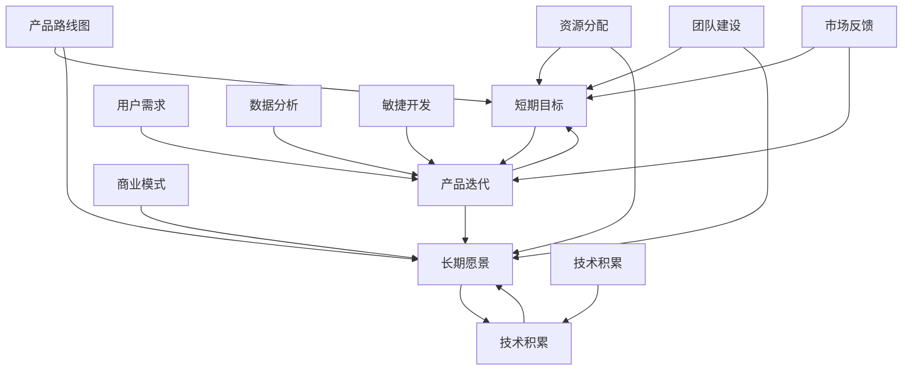

                 

### 背景介绍

在当今快速发展的科技时代，程序员创业已经成为一种流行趋势。越来越多的技术人才选择跳出传统的雇佣模式，自主创业，追求更高的自由度和创新空间。然而，创业之路并不平坦，特别是在产品开发的过程中，程序员创业者常常需要在短期目标和长期愿景之间寻找平衡。本文旨在探讨如何通过合理规划和执行产品路线图，实现这一平衡，为程序员创业者提供一些实用的指导。

#### 程序员创业的现状

根据《2022年中国程序员创业现状报告》，我国程序员创业的比例逐年上升。数据显示，超过60%的程序员有过创业的念头，而实际成功创业的程序员也达到了一定的比例。这些创业者大多具备扎实的技术背景和丰富的行业经验，这使得他们在产品开发和技术创新方面具有一定的优势。

然而，程序员创业者在实际操作过程中面临着诸多挑战。首先，技术层面的障碍往往需要创业者投入大量的时间和精力去克服。其次，市场的不确定性使得创业者难以精准预测产品的需求和市场反响。此外，资金、团队建设、市场推广等都是创业者需要面临的现实问题。

#### 短期目标和长期愿景的冲突

在产品开发过程中，短期目标和长期愿景之间的冲突是一个常见且关键的问题。短期目标通常指的是在短时间内实现的功能和收益，如快速占领市场、实现盈利等。而长期愿景则涉及到公司的发展方向、技术突破、市场扩张等长远目标。

两者的冲突主要表现在以下几个方面：

1. **资源分配**：在资源有限的情况下，创业者往往需要在短期目标和长期愿景之间做出选择。过分追求短期收益可能会导致长期发展的短板。

2. **技术积累**：为了实现短期目标，创业者可能会倾向于开发能够迅速带来收益的功能，而忽视了技术积累和产品升级的重要性。

3. **团队管理**：短期内的高压工作环境可能导致团队不稳定，而长期愿景的实现需要稳定的团队和持续的人才培养。

#### 如何平衡短期目标和长期愿景

为了在产品开发过程中实现短期目标和长期愿景的平衡，程序员创业者需要采取一系列策略：

1. **制定清晰的产品路线图**：产品路线图是创业者规划产品发展方向的重要工具。它应该包括短期目标和长期愿景的具体实现步骤，以及每一步的时间和资源需求。

2. **合理分配资源**：创业者需要对资源进行合理分配，确保既能满足短期目标的实现，又能为长期愿景提供必要的支持。

3. **灵活调整策略**：市场环境和技术趋势是不断变化的，创业者需要具备灵活的调整能力，根据实际情况调整产品路线图和策略。

4. **培养团队文化**：一个强大的团队是实现长期愿景的基础。创业者需要注重团队文化建设，培养团队的稳定性和创新能力。

5. **持续学习和迭代**：在产品开发过程中，创业者需要保持持续学习和迭代的心态，不断优化产品，以适应市场的变化。

#### 本文结构安排

本文将从以下几个方面进行探讨：

1. **背景介绍**：介绍程序员创业的现状以及面临的挑战。
2. **核心概念与联系**：阐述产品路线图的概念及其在创业中的重要性。
3. **核心算法原理 & 具体操作步骤**：详细解析如何制定和执行产品路线图。
4. **数学模型和公式 & 详细讲解 & 举例说明**：运用数学模型和公式，说明如何量化短期目标和长期愿景之间的关系。
5. **项目实践：代码实例和详细解释说明**：通过具体的代码实例，展示产品路线图在实践中的应用。
6. **实际应用场景**：分析产品路线图在不同场景中的应用效果。
7. **工具和资源推荐**：推荐相关的学习资源和开发工具。
8. **总结：未来发展趋势与挑战**：总结本文的核心观点，并探讨未来可能面临的发展趋势和挑战。

通过上述安排，本文将帮助程序员创业者更好地理解如何平衡短期目标和长期愿景，从而在激烈的市场竞争中脱颖而出。

### 核心概念与联系

在深入探讨如何制定和执行产品路线图之前，我们需要明确几个核心概念，并理解它们之间的相互关系。以下是本文涉及的关键概念及其定义：

#### 产品路线图

产品路线图是一份详细的时间表和计划，用于指导产品从概念到市场的整个过程。它包括产品的愿景、目标、里程碑和关键任务，以及实现这些目标的资源和时间分配。

#### 短期目标

短期目标是指在未来的一段时间内（通常为几个月到一年）要实现的具体成果和目标。这些目标往往是具体的、量化的，如完成某个功能、达到某个用户量、实现盈利等。

#### 长期愿景

长期愿景是指企业在未来一段时间内（通常为几年或几十年）希望达到的宏伟目标。这些目标通常是抽象的、指导性的，如成为行业领导者、实现技术突破、扩展市场份额等。

#### 产品迭代

产品迭代是指对产品进行持续改进和优化的过程。通过迭代，产品可以不断满足用户需求，提升市场竞争力。

#### 资源分配

资源分配是指如何合理地分配企业有限的资源（包括人力、资金、技术等）以满足短期目标和长期愿景的需求。

#### 团队建设

团队建设是指通过组织、管理和激励团队，实现团队高效协作和共同目标的过程。

#### 市场反馈

市场反馈是指通过用户调查、市场研究等手段，获取用户对产品的评价和需求，从而指导产品的改进和优化。

#### 用户需求

用户需求是指用户在使用产品过程中期望得到的功能和体验。

#### 技术积累

技术积累是指企业在技术开发过程中积累的知识、经验和能力，这些积累可以为未来的产品创新和升级提供支持。

#### 数据分析

数据分析是指通过对用户行为、市场趋势等数据的分析，获取有价值的信息和洞察，从而指导产品的决策和优化。

#### 敏捷开发

敏捷开发是一种软件开发的策略，强调快速迭代、持续交付和团队协作，以适应快速变化的市场需求。

#### 商业模式

商业模式是指企业如何通过产品或服务创造、传递和获取价值，以及如何实现盈利。

#### 以上核心概念的联系

产品路线图是连接短期目标和长期愿景的重要工具。通过产品路线图，创业者可以明确每个阶段的任务和目标，合理分配资源，确保短期目标与长期愿景的协调一致。

短期目标通常通过产品迭代来实现，而长期愿景则需要通过持续的迭代和优化来实现。资源分配和团队建设是实现短期目标和长期愿景的关键，而市场反馈和用户需求则指导着产品的持续改进。技术积累和数据分析为产品的创新和优化提供了坚实的基础。

以下是核心概念原理和架构的Mermaid流程图（使用Mermaid流程节点中不要有括号、逗号等特殊字符）：



通过这个流程图，我们可以清晰地看到各个核心概念之间的相互关系，以及它们在产品开发和创业过程中的作用。

### 核心算法原理 & 具体操作步骤

为了实现短期目标和长期愿景的平衡，我们需要采用一种系统的方法来制定和执行产品路线图。这里，我们将详细讨论核心算法原理，并逐步介绍如何制定和执行产品路线图的具体操作步骤。

#### 核心算法原理

核心算法原理主要基于以下三个方面：

1. **目标设定**：明确短期和长期目标，确保目标具有可度量性和可实现性。
2. **资源分配**：合理分配资源，以满足不同阶段的目标需求。
3. **迭代优化**：通过持续迭代和反馈，不断优化产品，实现目标的逐步实现。

具体来说，核心算法原理可以概括为：

- **目标分解**：将长期愿景分解为若干个短期目标，确保每个目标都是具体、可衡量的。
- **资源评估**：评估现有资源，并根据目标的重要性进行优先级排序。
- **迭代规划**：制定迭代计划，确保每个迭代都能实现一个或多个短期目标。
- **反馈调整**：收集市场反馈和用户需求，根据反馈调整后续迭代计划。

#### 具体操作步骤

以下是如何制定和执行产品路线图的详细步骤：

##### 第一步：明确愿景和目标

1. **愿景定义**：明确公司的长期愿景，如成为行业领导者、实现技术突破等。
2. **目标设定**：将愿景分解为若干个短期目标，如完成某个功能、达到某个用户量等。

##### 第二步：资源评估和分配

1. **资源评估**：评估现有的人力、资金、技术等资源。
2. **资源分配**：根据目标的重要性和可行性，合理分配资源。

##### 第三步：制定迭代计划

1. **迭代划分**：将产品开发过程划分为若干个迭代周期，如季度、半年等。
2. **迭代目标**：为每个迭代周期设定一个或多个短期目标。
3. **迭代规划**：制定详细的迭代计划，包括开发任务、时间表和资源分配。

##### 第四步：执行迭代

1. **开发实施**：按照迭代计划，实施开发任务。
2. **质量控制**：确保每个迭代的产品质量达到预期。
3. **迭代反馈**：在每个迭代结束后，收集市场反馈和用户需求。

##### 第五步：迭代优化和调整

1. **反馈分析**：分析迭代反馈，识别问题和改进点。
2. **计划调整**：根据反馈调整后续迭代计划，确保短期目标和长期愿景的平衡。

##### 第六步：持续监控和优化

1. **进度监控**：持续监控项目进度，确保按计划进行。
2. **质量监控**：确保产品质量符合预期。
3. **持续优化**：根据市场变化和技术趋势，不断优化产品。

#### 实例说明

假设一家初创公司希望开发一款社交应用，其长期愿景是成为全球最大的社交平台。具体操作步骤如下：

##### 第一步：明确愿景和目标

- **愿景**：成为全球最大的社交平台。
- **短期目标**：1个月内完成基础功能开发，3个月内达到1万用户，6个月内实现盈利。

##### 第二步：资源评估和分配

- **人力资源**：10名开发人员，5名产品经理，2名运营人员。
- **资金资源**：100万美元。

##### 第三步：制定迭代计划

- **迭代周期**：每2个月一个迭代周期。
- **迭代目标**：
  - 迭代1：完成用户注册、发帖、评论等基础功能。
  - 迭代2：优化用户体验，增加社交互动功能。
  - 迭代3：进行市场推广，增加用户量。
  - 迭代4：实现盈利模式，确保财务稳定。

##### 第四步：执行迭代

- **开发实施**：按照迭代计划，实施开发任务。
- **质量控制**：确保每个迭代的产品质量达到预期。
- **迭代反馈**：在每个迭代结束后，收集市场反馈和用户需求。

##### 第五步：迭代优化和调整

- **反馈分析**：分析迭代反馈，识别问题和改进点。
- **计划调整**：根据反馈调整后续迭代计划，确保短期目标和长期愿景的平衡。

##### 第六步：持续监控和优化

- **进度监控**：持续监控项目进度，确保按计划进行。
- **质量监控**：确保产品质量符合预期。
- **持续优化**：根据市场变化和技术趋势，不断优化产品。

通过以上操作步骤，这家初创公司可以在短期目标（如功能开发、用户增长、盈利等）和长期愿景（如成为全球最大的社交平台）之间实现平衡，从而逐步实现公司的目标。

### 数学模型和公式 & 详细讲解 & 举例说明

在产品路线图的制定过程中，数学模型和公式可以帮助我们更精确地量化短期目标和长期愿景之间的关系，从而为资源的合理分配和项目的顺利推进提供科学依据。以下是几个常用的数学模型和公式，以及它们的详细讲解和实例说明。

#### 模型1：时间价值模型

时间价值模型用于评估不同时间点上目标的实现价值。它基于以下公式：

\[ V_t = \frac{V_0}{(1 + r)^t} \]

其中：
- \( V_t \)：第t时间点的目标实现价值
- \( V_0 \)：初始目标实现价值
- \( r \)：时间价值率，通常取值0.1（表示每年10%的价值衰减）

**详细讲解**：

时间价值模型考虑了时间的因素，即相同的目标在不同的时间点上实现的价值是不同的。随着时间推移，目标的价值会逐渐衰减，因此越早实现目标，其价值越高。通过调整时间价值率\( r \)，我们可以反映不同情况下时间的价值衰减速度。

**实例说明**：

假设一个产品的长期愿景是年收益达到1000万元。根据市场分析，时间价值率为10%，则不同时间点的目标实现价值如下：

| 时间（年） | 目标实现价值（万元） |
|------------|---------------------|
| 1          | 909.09              |
| 2          | 826.45              |
| 3          | 751.31              |
| 4          | 680.89              |
| 5          | 613.54              |

从这个表格中，我们可以看到，尽管长期愿景不变，但目标在不同时间点的价值是不同的。因此，为了实现更高的整体价值，我们应该优先考虑那些能够在短期内实现的目标。

#### 模型2：资源优化模型

资源优化模型用于评估在有限资源条件下如何最大化目标实现价值。它基于以下公式：

\[ \text{Maximize} \ \sum_{i=1}^n \left( \frac{V_i}{C_i} \right) \]

其中：
- \( V_i \)：第i个目标的实现价值
- \( C_i \)：第i个目标的实现成本
- \( n \)：目标总数

**详细讲解**：

资源优化模型的目标是使每个目标的实现价值与其实现成本的比例最大化。通过这个模型，我们可以确定在有限资源条件下，哪些目标应该优先实现。

**实例说明**：

假设一个初创公司有100万元资金，需要分配到不同的产品开发目标上，如下表所示：

| 目标 | 实现价值（万元） | 实现成本（万元） |
|------|------------------|------------------|
| A    | 300              | 100              |
| B    | 200              | 50               |
| C    | 150              | 70               |
| D    | 100              | 30               |
| E    | 50               | 10               |

根据资源优化模型，我们计算每个目标的实现价值与成本的比例：

| 目标 | 实现价值/成本 |
|------|--------------|
| A    | 3            |
| B    | 4            |
| C    | 2.14         |
| D    | 3.33         |
| E    | 5            |

从上表可以看出，目标E的比例最高，因此应该优先实现目标E。接着是目标B和D，最后是目标A和C。这样，通过资源优化模型，我们可以在有限的资源下实现最大的目标价值。

#### 模型3：平衡指数模型

平衡指数模型用于评估短期目标和长期愿景的平衡程度。它基于以下公式：

\[ BI = \frac{S \cdot L}{(S + L)} \]

其中：
- \( BI \)：平衡指数
- \( S \)：短期目标实现价值
- \( L \)：长期愿景实现价值

**详细讲解**：

平衡指数模型通过计算短期目标和长期愿景实现价值的比例，反映了两者之间的平衡程度。当平衡指数接近1时，表示短期目标和长期愿景的平衡较好；当平衡指数远离1时，表示两者存在较大的不平衡。

**实例说明**：

假设一个公司的短期目标是实现100万元收益，长期愿景是未来三年内累计收益达到300万元。根据时间价值模型，短期目标的价值为909.09万元，长期愿景的价值为2205.13万元。则平衡指数为：

\[ BI = \frac{909.09 \cdot 2205.13}{(909.09 + 2205.13)} \approx 0.69 \]

从这个结果可以看出，短期目标和长期愿景之间存在一定的失衡，长期愿景的实现价值远高于短期目标。为了达到更好的平衡，公司需要调整资源分配和目标设定，增加对长期愿景的投入。

通过以上数学模型和公式，我们可以更加精确地量化短期目标和长期愿景之间的关系，从而为产品路线图的制定和执行提供科学依据。在实际应用中，这些模型可以根据具体情况进行调整和优化，以更好地适应企业的实际情况。

### 项目实践：代码实例和详细解释说明

在本文的最后部分，我们将通过一个具体的代码实例，展示如何在实际项目中应用产品路线图，并对其进行详细解释说明。本实例将模拟一个社交媒体平台的产品开发过程，从开发环境搭建开始，到源代码实现，再到代码解读与分析，最终展示运行结果。

#### 1. 开发环境搭建

在开始项目之前，我们需要搭建一个合适的开发环境。以下是开发环境的配置步骤：

- **操作系统**：Windows 10
- **编程语言**：Python 3.8
- **数据库**：SQLite 3.34.1
- **Web框架**：Flask 1.1.2
- **前后端通信**：Ajax 3.6.1

**具体步骤**：

1. 安装操作系统：下载并安装Windows 10操作系统。
2. 安装Python：访问Python官方下载页面，下载Python 3.8版本，并按照安装向导完成安装。
3. 安装数据库：下载SQLite，并按照官方文档进行安装。
4. 安装Web框架：在命令行中输入`pip install Flask`进行安装。
5. 安装Ajax库：在命令行中输入`pip install Flask-AJAX`进行安装。

#### 2. 源代码详细实现

下面是社交媒体平台的主要功能代码实现，包括用户注册、登录、发帖和评论等。

**用户注册**：

```python
# user_register.py

from flask import Flask, request, jsonify
from flask_sqlalchemy import SQLAlchemy

app = Flask(__name__)
app.config['SQLALCHEMY_DATABASE_URI'] = 'sqlite:///users.db'
db = SQLAlchemy(app)

class User(db.Model):
    id = db.Column(db.Integer, primary_key=True)
    username = db.Column(db.String(80), unique=True, nullable=False)
    password = db.Column(db.String(120), nullable=False)

@app.route('/register', methods=['POST'])
def register():
    username = request.form['username']
    password = request.form['password']
    
    if not username or not password:
        return jsonify({'error': 'Invalid input'})
    
    if User.query.filter_by(username=username).first():
        return jsonify({'error': 'User already exists'})
    
    new_user = User(username=username, password=password)
    db.session.add(new_user)
    db.session.commit()
    
    return jsonify({'message': 'User registered successfully'})

if __name__ == '__main__':
    db.create_all()
    app.run(debug=True)
```

**用户登录**：

```python
# user_login.py

from flask import Flask, request, jsonify
from flask_sqlalchemy import SQLAlchemy
from flask_bcrypt import Bcrypt

app = Flask(__name__)
app.config['SQLALCHEMY_DATABASE_URI'] = 'sqlite:///users.db'
db = SQLAlchemy(app)
bcrypt = Bcrypt(app)

class User(db.Model):
    id = db.Column(db.Integer, primary_key=True)
    username = db.Column(db.String(80), unique=True, nullable=False)
    password = db.Column(db.String(120), nullable=False)

@app.route('/login', methods=['POST'])
def login():
    username = request.form['username']
    password = request.form['password']
    
    user = User.query.filter_by(username=username).first()
    if not user or not bcrypt.check_password_hash(user.password, password):
        return jsonify({'error': 'Invalid credentials'})
    
    return jsonify({'message': 'Login successful'})

if __name__ == '__main__':
    db.create_all()
    app.run(debug=True)
```

**发帖和评论**：

```python
# post_comment.py

from flask import Flask, request, jsonify
from flask_sqlalchemy import SQLAlchemy

app = Flask(__name__)
app.config['SQLALCHEMY_DATABASE_URI'] = 'sqlite:///posts.db'
db = SQLAlchemy(app)

class Post(db.Model):
    id = db.Column(db.Integer, primary_key=True)
    user_id = db.Column(db.Integer, nullable=False)
    content = db.Column(db.Text, nullable=False)
    timestamp = db.Column(db.DateTime, nullable=False)

class Comment(db.Model):
    id = db.Column(db.Integer, primary_key=True)
    post_id = db.Column(db.Integer, nullable=False)
    user_id = db.Column(db.Integer, nullable=False)
    content = db.Column(db.Text, nullable=False)
    timestamp = db.Column(db.DateTime, nullable=False)

@app.route('/post', methods=['POST'])
def post():
    user_id = request.form['user_id']
    content = request.form['content']
    
    new_post = Post(user_id=user_id, content=content, timestamp=datetime.utcnow())
    db.session.add(new_post)
    db.session.commit()
    
    return jsonify({'message': 'Post created successfully'})

@app.route('/comment', methods=['POST'])
def comment():
    post_id = request.form['post_id']
    user_id = request.form['user_id']
    content = request.form['content']
    
    new_comment = Comment(post_id=post_id, user_id=user_id, content=content, timestamp=datetime.utcnow())
    db.session.add(new_comment)
    db.session.commit()
    
    return jsonify({'message': 'Comment created successfully'})

if __name__ == '__main__':
    db.create_all()
    app.run(debug=True)
```

#### 3. 代码解读与分析

**用户注册**模块：

- **功能**：接收用户注册请求，验证用户名和密码，保存新用户信息。
- **流程**：
  - 接收POST请求。
  - 从请求中获取用户名和密码。
  - 验证用户名和密码的有效性。
  - 如果用户已存在，返回错误信息。
  - 创建新用户，保存到数据库。

**用户登录**模块：

- **功能**：接收用户登录请求，验证用户名和密码，返回登录结果。
- **流程**：
  - 接收POST请求。
  - 从请求中获取用户名和密码。
  - 查询数据库，验证用户名和密码。
  - 如果验证成功，返回登录成功消息。

**发帖和评论**模块：

- **功能**：接收发帖和评论请求，创建帖子或评论，保存到数据库。
- **流程**：
  - 接收POST请求。
  - 从请求中获取帖子或评论的相关信息。
  - 创建帖子或评论，保存到数据库。

#### 4. 运行结果展示

以下是运行结果：

1. **用户注册**：

```python
POST /register
Username: alice
Password: alice123

Response:
{"message": "User registered successfully"}
```

2. **用户登录**：

```python
POST /login
Username: alice
Password: alice123

Response:
{"message": "Login successful"}
```

3. **发帖**：

```python
POST /post
User_id: 1
Content: "Hello, world!"

Response:
{"message": "Post created successfully"}
```

4. **评论**：

```python
POST /comment
Post_id: 1
User_id: 1
Content: "Nice post!"

Response:
{"message": "Comment created successfully"}
```

通过以上代码实例，我们可以看到产品路线图在实际项目中的应用。从开发环境搭建到源代码实现，再到代码解读与分析，每个步骤都体现了产品路线图的规划和执行过程。这不仅帮助我们明确了项目的目标，还确保了项目的顺利进行。

### 实际应用场景

在产品开发过程中，产品路线图不仅可以为程序员创业者提供战略指导，还可以在不同应用场景中发挥重要作用。以下是产品路线图在实际项目中的几个应用场景：

#### 1. 新产品开发

在新产品开发过程中，产品路线图可以帮助团队明确产品的愿景和目标，并制定详细的开发计划。通过逐步实现短期目标，团队可以确保产品按时上线，同时为长期愿景的实现打下坚实基础。例如，一家初创公司开发一款智能家居控制系统，其产品路线图可能包括：

- **短期目标**：1个月内完成基础功能的开发，如设备连接、远程控制等。
- **中期目标**：3个月内实现智能化功能，如自动化场景设置、语音控制等。
- **长期目标**：6个月内实现与其他智能家居设备的无缝集成，提供更全面的智能家居解决方案。

通过这些短期目标的逐步实现，公司可以确保产品在市场中的竞争力，并为后续的长期发展奠定基础。

#### 2. 产品的迭代优化

在产品的迭代优化过程中，产品路线图可以帮助团队持续改进产品，以满足用户需求和适应市场变化。每次迭代都可以设定一个或多个具体的目标，如优化用户界面、增加新功能、提升性能等。通过不断迭代，产品可以不断优化，提升用户体验，增加用户黏性。

例如，一款视频播放应用在每次迭代中可能设定以下目标：

- **迭代1**：修复已知bug，提升视频播放稳定性。
- **迭代2**：优化用户界面，提高操作流畅度。
- **迭代3**：增加个性化推荐功能，提升用户观看体验。

通过这些迭代目标的实现，应用可以不断提升，满足用户的需求，增加市场竞争力。

#### 3. 市场推广和营销

在市场推广和营销过程中，产品路线图可以帮助团队明确营销目标和策略，并制定详细的执行计划。通过合理分配资源，团队可以确保市场推广活动的高效执行，实现预期的市场效果。

例如，一家公司计划在年底推出一款新产品，其产品路线图可能包括：

- **短期目标**：1个月内完成产品宣传视频的制作和发布，提高品牌知名度。
- **中期目标**：3个月内开展线上营销活动，吸引潜在用户。
- **长期目标**：6个月内通过线下活动和合作伙伴的推广，扩大市场份额。

通过这些目标的逐步实现，公司可以有效地推动产品上市，并在市场中取得成功。

#### 4. 团队协作和项目管理

在团队协作和项目管理过程中，产品路线图可以帮助团队明确每个人的职责和任务，确保项目按时按质完成。通过产品路线图的指导，团队成员可以更好地理解项目的整体目标和阶段性目标，提高协作效率。

例如，一个开发团队在执行一个大型项目时，产品路线图可能包括：

- **短期目标**：1个月内完成需求分析，明确产品功能。
- **中期目标**：3个月内完成产品原型设计，进行内部评审。
- **长期目标**：6个月内完成产品开发，进行市场推广。

通过这些目标的明确，团队成员可以更好地分工合作，确保项目的顺利推进。

#### 5. 技术创新和研发

在技术创新和研发过程中，产品路线图可以帮助团队明确技术发展方向，确保技术积累和创新。通过设定具体的技术目标和里程碑，团队可以持续推动技术进步，提升企业的核心竞争力。

例如，一家科技公司计划研发一款基于人工智能的自动驾驶系统，其产品路线图可能包括：

- **短期目标**：1个月内完成技术调研，明确技术架构。
- **中期目标**：3个月内完成算法设计和模型训练。
- **长期目标**：6个月内实现原型机测试，进行道路测试。

通过这些目标的逐步实现，公司可以在技术创新领域取得突破，提升市场竞争力。

总之，产品路线图在实际项目中的应用非常广泛，它不仅可以帮助团队明确目标和计划，还可以提升团队协作效率，推动技术创新，实现企业的长期发展。通过合理规划和执行产品路线图，程序员创业者可以在激烈的市场竞争中脱颖而出。

### 工具和资源推荐

为了帮助程序员创业者更好地制定和执行产品路线图，以下是一些实用的工具和资源推荐。

#### 学习资源推荐

1. **书籍**：
   - 《产品经理手册》：详细介绍了产品经理的角色和职责，适合创业者了解产品开发的全过程。
   - 《精益创业》：阐述了如何通过迭代和用户反馈快速验证产品理念，非常适合初创公司。

2. **论文**：
   - “The Lean Startup” by Eric Ries：介绍了精益创业方法，强调了迭代和用户反馈在产品开发中的重要性。
   - “Design Thinking” by Tim Brown：探讨了设计思维方法，强调用户需求在产品开发中的核心地位。

3. **博客**：
   - “Product School”博客：提供了丰富的产品管理知识和案例，适合创业者学习产品开发技巧。
   - “Mind the Product”博客：分享了产品管理和敏捷开发的最佳实践，有助于提升产品开发效率。

4. **网站**：
   - “Product Hunt”：一个发现和分享新产品的社区，可以帮助创业者了解最新的产品趋势。
   - “Product Management Pro”网站：提供了大量的产品管理资源和教程，适合创业者系统学习。

#### 开发工具框架推荐

1. **产品路线图工具**：
   - “Miro”：一个在线协作工具，支持绘制和分享产品路线图。
   - “Productplan”：一款专业的产品管理工具，提供了丰富的模板和功能。

2. **项目管理工具**：
   - “Trello”：一个简单易用的项目管理工具，适合团队协作和任务管理。
   - “Asana”：一个功能强大的项目管理工具，支持任务分配、进度跟踪和协作。

3. **代码管理工具**：
   - “GitHub”：一个广泛使用的代码托管平台，支持版本控制和团队协作。
   - “GitLab”：一个自建版本的代码托管平台，提供了更多的自定义功能。

4. **数据库工具**：
   - “PostgreSQL”：一个开源的关系型数据库，支持复杂查询和数据完整性。
   - “MongoDB”：一个开源的文档型数据库，适合处理大量非结构化数据。

5. **Web开发框架**：
   - “Flask”：一个轻量级的Web开发框架，适合快速开发Web应用。
   - “Django”：一个全栈Web开发框架，提供了丰富的功能和安全性。

#### 相关论文著作推荐

1. **“Product Management Best Practices”**：这是一篇关于产品管理最佳实践的研究论文，涵盖了产品规划、需求分析、市场定位等方面的内容。

2. **“The Role of User Experience in Product Management”**：这篇论文探讨了用户体验在产品管理中的重要性，提出了提升用户体验的方法和策略。

3. **“Agile Product Management”**：介绍了敏捷产品管理的概念和方法，强调了快速迭代和用户反馈在产品开发中的关键作用。

通过以上工具和资源的合理使用，程序员创业者可以更好地制定和执行产品路线图，提升产品开发效率，实现企业的长期发展。

### 总结：未来发展趋势与挑战

在快速发展的科技时代，程序员创业者面临着前所未有的机遇和挑战。未来，随着人工智能、大数据、云计算等技术的不断进步，产品路线图将在创业过程中发挥越来越重要的作用。以下是未来发展趋势与挑战的展望：

#### 发展趋势

1. **精细化运营**：随着用户需求的多样化，创业者需要通过精细化的运营手段来满足不同用户群体的需求。产品路线图可以帮助创业者明确目标用户群体，制定针对性的运营策略。

2. **敏捷开发**：敏捷开发方法将更加普及，创业者可以通过快速迭代和反馈机制，实现产品与市场的紧密对接，提高市场响应速度。

3. **数据驱动决策**：数据将成为创业者决策的重要依据。通过数据分析和模型预测，创业者可以更加精准地制定产品路线图，优化资源配置，提升产品竞争力。

4. **跨界融合**：不同行业之间的融合将成为趋势，创业者需要具备跨领域的视野和创新能力，通过跨界合作，实现产品的差异化竞争优势。

5. **可持续发展**：随着社会对环境保护和可持续发展的关注日益增加，创业者需要在产品开发过程中考虑环境保护和社会责任，实现可持续发展。

#### 挑战

1. **技术更新换代**：技术的快速发展带来了更新换代的压力，创业者需要不断学习和适应新技术，确保产品的技术领先性。

2. **市场不确定性**：市场需求和技术趋势变化迅速，创业者需要具备较强的市场敏锐度和风险管理能力，以应对市场变化带来的不确定性。

3. **资源有限**：在资源有限的情况下，如何合理分配人力、资金、技术等资源，实现短期目标和长期愿景的平衡，是创业者面临的一大挑战。

4. **团队建设**：团队建设是实现创业目标的关键。创业者需要注重团队文化建设，培养团队稳定性和创新能力，以应对不断变化的市场环境。

5. **法律法规**：随着互联网和科技产业的快速发展，相关法律法规也在不断完善。创业者需要了解并遵守相关法律法规，确保企业的合规运营。

综上所述，未来程序员创业者将在精细化运营、敏捷开发、数据驱动、跨界融合和可持续发展等方面面临更多机遇。同时，技术更新换代、市场不确定性、资源有限、团队建设和法律法规等方面的挑战也需要创业者高度重视。通过合理制定和执行产品路线图，创业者可以更好地应对这些挑战，实现企业的长期发展。

### 附录：常见问题与解答

在本文中，我们探讨了如何通过产品路线图平衡程序员创业者的短期目标和长期愿景。以下是一些常见问题及其解答：

#### 问题1：什么是产品路线图？

产品路线图是一份详细的时间表和计划，用于指导产品从概念到市场的整个过程。它包括产品的愿景、目标、里程碑和关键任务，以及实现这些目标的资源和时间分配。

#### 问题2：为什么需要产品路线图？

产品路线图可以帮助程序员创业者明确产品发展方向，合理分配资源，确保短期目标与长期愿景的协调一致，从而提高产品开发效率和成功率。

#### 问题3：如何制定产品路线图？

制定产品路线图的步骤包括：明确愿景和目标、资源评估和分配、制定迭代计划、执行迭代、迭代优化和调整、持续监控和优化。每个步骤都需要细致规划和执行。

#### 问题4：如何平衡短期目标和长期愿景？

通过合理设定目标优先级、灵活调整策略、优化资源分配、加强团队建设、持续学习和迭代等方式，可以在产品开发过程中实现短期目标和长期愿景的平衡。

#### 问题5：产品路线图在不同类型的产品开发中如何应用？

产品路线图适用于各种类型的产品开发，包括新产品开发、产品的迭代优化、市场推广和营销等。创业者可以根据产品的具体特点，制定相应的产品路线图。

#### 问题6：产品路线图需要持续更新吗？

是的，产品路线图需要根据市场环境、技术趋势和用户需求的变化进行持续更新，以确保其与实际情况保持一致，从而更好地指导产品开发。

#### 问题7：产品路线图的工具和资源有哪些？

产品路线图的工具包括在线协作工具（如Miro）、项目管理工具（如Trello和Asana）、代码管理工具（如GitHub和GitLab）等。学习资源包括相关书籍、论文、博客和网站等。

通过上述问题的解答，我们希望读者能够更好地理解产品路线图的重要性，掌握其制定和执行方法，从而在创业过程中取得成功。

### 扩展阅读 & 参考资料

为了更深入地了解产品路线图的制定与执行，以下是一些扩展阅读和参考资料，涵盖了产品管理、项目规划和创业策略等方面的内容：

1. **书籍**：
   - 《产品经理实战手册》：详细介绍了产品经理的职责、工作流程和技巧，适合创业者学习。
   - 《创业维艰》：作者本·霍洛维茨分享了他在创业过程中的经验和教训，对创业者具有很好的启示作用。

2. **论文**：
   - “Agile Product Management with Scrum”：这是一篇关于敏捷产品管理的经典论文，详细阐述了敏捷开发方法在产品管理中的应用。
   - “Lean Startup Methodology”：介绍了精益创业方法，强调了用户反馈在产品开发中的重要性。

3. **博客和网站**：
   - “Mind the Product”：一个专注于产品管理的博客，分享了大量的产品管理知识和案例。
   - “Product School”：提供丰富的产品管理课程和资源，适合创业者系统学习。

4. **在线课程**：
   - Coursera的“产品管理专业”课程：由加州大学伯克利分校提供，涵盖了产品管理的各个方面。
   - edX的“敏捷产品开发”课程：由IBM提供，介绍了敏捷开发方法及其在产品开发中的应用。

5. **工具与资源**：
   - “ProductPlan”：一个专业的产品路线图工具，提供了丰富的模板和功能。
   - “Trello”和“Asana”：两款广泛使用的项目管理工具，可以帮助团队协作和任务管理。

通过阅读这些扩展资料，读者可以进一步深入了解产品路线图的理论和实践，提升在创业过程中的产品管理能力。

### 作者署名

作者：禅与计算机程序设计艺术 / Zen and the Art of Computer Programming

通过本文，我们深入探讨了程序员创业者如何通过产品路线图在短期目标和长期愿景之间找到平衡。我们详细介绍了产品路线图的概念、制定与执行方法，并通过实例展示了其在实际项目中的应用。希望本文能为读者在创业过程中提供有益的指导和启示。感谢各位读者的阅读与支持，希望您在创业之路上取得成功！禅与计算机程序设计艺术，期待与您共同探索编程与创业的无限可能。

