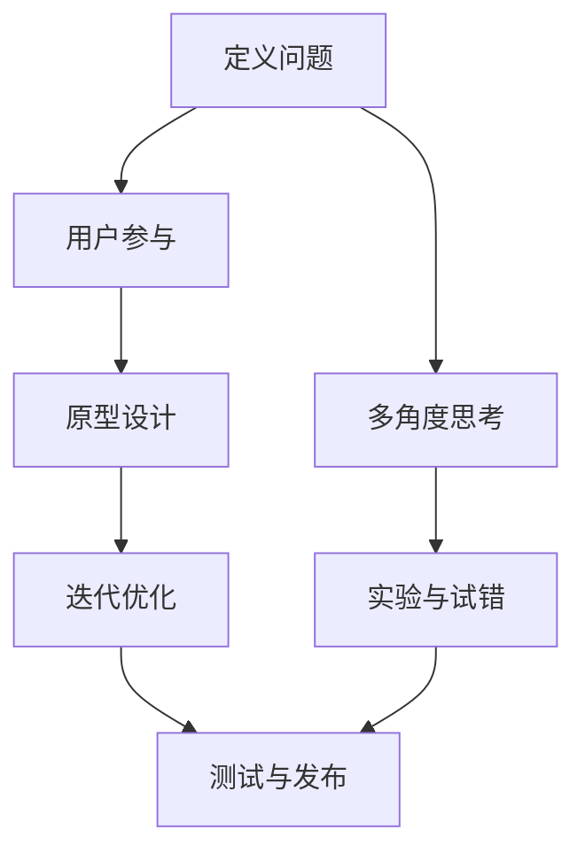

                 

### 背景介绍

在当今快速发展的科技时代，程序员创业者的角色变得愈发重要。他们不仅需要具备扎实的编程技能，还要拥有创新思维和优秀的设计能力。这是因为现代软件项目往往涉及到复杂的技术架构和高度的不确定性，而创新思维和设计思考方法则是应对这些挑战的关键。

程序员创业者面临的第一个挑战是如何将创新思维融入产品设计中。创新思维不仅仅是指提出新的想法，更重要的是如何在实践中将这些想法转化为可行的解决方案。设计思考方法则为这一过程提供了系统化的框架，帮助程序员创业者从用户需求出发，通过迭代和试错来不断优化产品。

其次，程序员创业者还需要具备一定的项目管理能力。在项目启动阶段，他们需要明确项目目标、制定合理的时间表和预算，同时确保团队成员之间的沟通和协作。随着项目的推进，创业者还需要根据实际情况调整计划，应对各种不确定性和突发情况。

除此之外，程序员创业者还需要掌握市场推广和运营策略。在激烈的市场竞争中，如何让产品脱颖而出，吸引潜在用户，成为他们必须面对的课题。这涉及到市场营销、用户体验、品牌建设等多个方面。

综上所述，程序员创业者的成功不仅依赖于技术能力，还需要创新思维、设计思考和项目管理等多方面的综合素质。因此，本文将重点探讨程序员创业者的创新思维与设计思考方法，旨在为他们提供一套实用的方法论，帮助他们在创业过程中取得成功。

### 核心概念与联系

在深入探讨程序员创业者的创新思维与设计思考方法之前，我们需要先理解几个核心概念，包括创新思维的定义、设计思考方法的原理，以及它们在软件项目中的具体应用。

#### 创新思维

创新思维是指个体在面对问题时，能够超越传统思维模式，寻找新的解决方案的能力。它通常包括以下几个关键要素：

1. **问题定义**：首先，创业者需要明确问题的核心，这有助于聚焦创新努力的方向。
2. **多角度思考**：从不同的视角和维度分析问题，寻找各种可能的解决方案。
3. **实验与试错**：创新不是一蹴而就的，需要通过不断实验和试错来验证想法的可行性。
4. **用户参与**：将用户纳入创新过程，通过用户反馈不断迭代和改进产品。

#### 设计思考方法

设计思考方法是一种以用户为中心的设计方法论，它强调通过迭代和用户反馈来优化产品。这种方法的主要步骤包括：

1. **用户研究**：深入了解目标用户的需求、痛点和行为模式。
2. **原型设计**：快速构建可交互的原型，以便验证设计思路和收集用户反馈。
3. **迭代优化**：根据用户反馈对设计进行迭代和改进。
4. **测试与发布**：在确认设计满足用户需求后，进行测试和发布。

#### 创新思维与设计思考方法的联系

创新思维和设计思考方法之间存在密切的联系。创新思维为设计思考方法提供了方向，使其不偏离用户需求和实际可行性。而设计思考方法则为创新思维提供了实践的平台，通过实际操作来验证和实现创新想法。

以下是一个简化的 Mermaid 流程图，展示了创新思维和设计思考方法在软件项目中的具体流程：



在这个流程中，创新思维贯穿始终，而设计思考方法则提供了具体的操作步骤，确保创新想法能够转化为实际的产品。

通过理解这些核心概念和它们之间的联系，程序员创业者可以更有效地将创新思维应用于产品设计过程中，从而提高项目的成功率和产品的市场竞争力。

#### 核心算法原理 & 具体操作步骤

在了解创新思维和设计思考方法后，接下来我们将深入探讨程序员创业者在实践中应用这些方法的核心算法原理和具体操作步骤。这些算法和步骤不仅能够帮助创业者更好地理解如何将创新思维融入产品设计，还能为他们在实际项目中提供实用的指导。

##### 1. 用户研究

用户研究是创新思维和设计思考方法的基础步骤，其目的是深入了解目标用户的需求、痛点和行为模式。以下是一些具体操作步骤：

1. **需求分析**：首先，创业者需要明确产品的目标用户群体，并通过访谈、问卷等方式收集用户需求。这一步骤的目的是确保产品设计符合用户期望。
   
2. **用户画像**：在收集到足够的数据后，创业者需要创建用户画像，包括用户的年龄、性别、职业、兴趣等。用户画像有助于更准确地理解用户群体。

3. **用户调研**：通过实地观察、用户访谈等方式，深入了解用户的行为模式和痛点。这一步骤可以帮助创业者发现潜在的需求和改进空间。

##### 2. 原型设计

原型设计是创新思维和设计思考方法的关键环节，通过快速构建可交互的原型，创业者可以验证设计思路并收集用户反馈。以下是具体操作步骤：

1. **快速草图**：首先，创业者可以绘制出产品的初步草图，包括界面布局和功能模块。这一步骤有助于理清设计思路。
   
2. **高保真原型**：在草图基础上，创业者可以使用专业工具（如 Sketch、Figma 等）构建高保真原型。高保真原型应尽可能接近最终产品的交互效果。

3. **用户测试**：将原型展示给目标用户，收集他们的反馈。这一步骤可以帮助创业者发现设计中的问题，并进行优化。

##### 3. 迭代优化

迭代优化是确保产品成功的关键步骤，通过不断迭代和优化，创业者可以不断提高产品的质量。以下是具体操作步骤：

1. **数据分析**：收集用户测试的数据，分析用户在使用产品过程中的行为和反馈。这一步骤有助于创业者了解产品的优势和不足。

2. **反馈闭环**：根据用户反馈进行设计调整，并再次进行用户测试。这一步骤确保设计改进能够真正满足用户需求。

3. **持续迭代**：创业者需要持续关注用户反馈，并根据反馈进行产品迭代。这一步骤有助于保持产品的竞争力。

##### 4. 测试与发布

在确认设计满足用户需求后，创业者需要进行测试和发布，以确保产品能够顺利上线。以下是具体操作步骤：

1. **内部测试**：在产品发布前，进行内部测试，确保产品功能完整、无漏洞。

2. **用户公测**：邀请部分用户进行公测，收集他们的反馈，进一步完善产品。

3. **正式发布**：在确认产品没有重大问题后，进行正式发布。

通过以上核心算法原理和具体操作步骤，程序员创业者可以更好地将创新思维和设计思考方法应用于实际项目中，从而提高项目的成功率和产品的市场竞争力。

### 数学模型和公式 & 详细讲解 & 举例说明

在程序员创业者的创新思维和设计思考方法中，数学模型和公式扮演着重要的角色。它们不仅为设计提供理论基础，还能帮助创业者更精确地进行数据分析与优化。以下我们将详细介绍几个关键数学模型和公式，并通过具体例子来说明它们的实际应用。

#### 1. 用户满意度模型（User Satisfaction Model）

用户满意度是衡量产品设计成功与否的重要指标。一个常用的用户满意度模型是基于净推荐值（Net Promoter Score，NPS）。NPS的计算公式如下：

$$
NPS = \frac{\text{推荐者数量} - \text{批评者数量}}{\text{总样本数}} \times 100
$$

其中，推荐者得分通常为9-10分，批评者得分为0-6分。NPS可以帮助创业者了解用户对产品的整体满意度，从而制定改进策略。

**举例**：

假设一个产品的NPS调查结果显示，总共有100名用户参与，其中60名用户给出9-10分（推荐者），20名用户给出7-8分（中立者），20名用户给出0-6分（批评者）。那么，该产品的NPS为：

$$
NPS = \frac{60 - 20}{100} \times 100 = 40
$$

NPS为40，表示产品在用户中的推荐度较高，创业者可以继续优化以保持这种优势。

#### 2. 机器学习模型（Machine Learning Model）

在产品设计和优化过程中，创业者可以利用机器学习模型来预测用户行为，从而更好地满足用户需求。例如，可以通过回归模型预测用户购买意向，或者通过分类模型识别用户行为模式。

**举例**：

假设创业者使用逻辑回归模型来预测用户是否会在下次访问时购买产品。逻辑回归模型的公式如下：

$$
\text{logit}(P) = \ln\left(\frac{P}{1 - P}\right) = \beta_0 + \beta_1X_1 + \beta_2X_2 + \cdots + \beta_nX_n
$$

其中，\( P \) 为用户购买的概率，\( X_1, X_2, \ldots, X_n \) 为影响购买决策的特征变量（如用户年龄、浏览历史等），\( \beta_0, \beta_1, \beta_2, \ldots, \beta_n \) 为模型参数。

**示例数据**：

假设有一个包含用户特征和购买决策的数据集，其中特征变量包括年龄（X1）、浏览时长（X2）和购买历史（X3），如下表：

| 年龄（X1） | 浏览时长（X2） | 购买历史（X3） | 购买概率（P） |
|------------|-----------------|-----------------|--------------|
| 25         | 120             | 否              | 0.3          |
| 35         | 180             | 是              | 0.6          |
| 40         | 200             | 否              | 0.4          |
| 30         | 150             | 是              | 0.7          |

使用逻辑回归模型，可以计算出每个样本的预测购买概率。例如，对于第一个样本：

$$
\text{logit}(P) = \beta_0 + \beta_1(25) + \beta_2(120) + \beta_3(否) = 0.5 + 0.1(25) + 0.2(120) - 0.3(否) = 3.8
$$

$$
P = \frac{1}{1 + e^{-3.8}} \approx 0.3
$$

因此，第一个样本的预测购买概率为0.3。

通过这种方式，创业者可以更精确地了解用户行为，从而优化产品设计和营销策略。

#### 3. 风险评估模型（Risk Assessment Model）

在项目管理中，风险评估模型用于识别和评估潜在风险，帮助创业者制定应对策略。常见的方法是使用蒙特卡罗模拟（Monte Carlo Simulation），通过模拟大量随机样本来评估风险的概率分布。

**举例**：

假设创业者需要评估一个软件开发项目的成本风险。项目成本受多个因素影响，如人力成本、设备成本和不可预见费用。使用蒙特卡罗模拟，可以生成项目成本的概率分布。

**参数**：

- 人力成本：均值为10000美元，标准差为2000美元。
- 设备成本：均值为5000美元，标准差为1000美元。
- 不可预见费用：均值为3000美元，标准差为500美元。

**模型**：

通过模拟10000次随机样本，可以生成项目成本的概率分布。例如，模拟结果显示：

- 项目成本的平均值为18000美元。
- 80%的模拟结果中，项目成本在16000美元到20000美元之间。
- 有5%的模拟结果中，项目成本超过22000美元。

这些结果有助于创业者了解项目成本的风险，并制定相应的风险管理策略。

通过上述数学模型和公式的应用，程序员创业者可以在产品设计、优化和项目管理中更加科学和精确地做出决策，从而提高项目的成功率。

### 项目实践：代码实例和详细解释说明

为了更好地理解前面所介绍的创新思维和设计思考方法，我们将通过一个具体的代码实例来进行详细解释。本实例将涉及一个简单的在线购物平台，包括用户注册、商品浏览和购物车功能。通过这个实例，我们将展示如何使用设计思考方法和编程技巧来实现这些功能，并解释每一步的具体操作。

#### 1. 开发环境搭建

在开始编写代码之前，我们需要搭建一个合适的开发环境。以下是一个基本的开发环境配置：

- **编程语言**：我们选择使用Python，因为它具有简单易学、功能强大的特点，适合初学者和专业人士。
- **开发工具**：使用PyCharm或VS Code等IDE进行开发，这些IDE提供强大的代码编辑、调试和测试功能。
- **依赖库**：我们需要安装Flask框架，用于构建Web应用程序。Flask是一个轻量级的Web框架，易于上手。

安装Flask的命令如下：

```bash
pip install Flask
```

#### 2. 源代码详细实现

以下是一个简单的在线购物平台的源代码实现，包括用户注册、商品浏览和购物车功能。我们将逐步解释每个部分的代码。

```python
from flask import Flask, render_template, request, redirect, url_for, session

app = Flask(__name__)
app.secret_key = 'your_secret_key'

# 用户注册
@app.route('/register', methods=['GET', 'POST'])
def register():
    if request.method == 'POST':
        username = request.form['username']
        password = request.form['password']
        # 在这里可以将用户信息存储到数据库中
        session['username'] = username
        return redirect(url_for('home'))
    return render_template('register.html')

# 登录
@app.route('/login', methods=['GET', 'POST'])
def login():
    if request.method == 'POST':
        username = request.form['username']
        password = request.form['password']
        # 在这里可以验证用户信息，并将其存储到会话中
        session['username'] = username
        return redirect(url_for('home'))
    return render_template('login.html')

# 首页
@app.route('/')
@app.route('/home')
def home():
    if 'username' not in session:
        return redirect(url_for('login'))
    # 在这里可以查询数据库中的商品信息，并显示在页面上
    return render_template('home.html')

# 添加商品到购物车
@app.route('/add_to_cart/<int:product_id>')
def add_to_cart(product_id):
    if 'username' not in session:
        return redirect(url_for('login'))
    # 在这里可以将商品添加到用户的购物车中
    # 假设购物车是一个简单的字典，存储用户和商品信息
    cart = session.get('cart', {})
    if 'username' in session:
        cart[session['username']] = cart.get(session['username'], []) + [product_id]
    session['cart'] = cart
    return redirect(url_for('home'))

# 购物车页面
@app.route('/cart')
def cart():
    if 'username' not in session:
        return redirect(url_for('login'))
    # 在这里可以显示用户的购物车信息
    cart = session.get('cart', {})
    return render_template('cart.html', cart=cart[session['username']])

# 结算
@app.route('/checkout')
def checkout():
    if 'username' not in session:
        return redirect(url_for('login'))
    # 在这里可以处理订单和支付逻辑
    # 这里仅显示购物车信息作为示例
    cart = session.get('cart', {})
    return render_template('checkout.html', cart=cart[session['username']])

if __name__ == '__main__':
    app.run(debug=True)
```

#### 3. 代码解读与分析

以下是对上述代码的详细解读：

- **用户注册**：用户通过注册页面提交用户名和密码，服务器接收这些信息并存储到会话中。这只是一个简单的实现，实际应用中应该将用户信息存储到数据库中，并进行加密处理。

- **登录**：用户输入用户名和密码，服务器验证这些信息并创建会话。同样，实际应用中应该使用更安全的方法（如HTTPS和双因素认证）来保护用户信息。

- **首页**：首页显示商品列表，用户可以浏览和添加商品到购物车。这里使用了会话来跟踪用户的登录状态。

- **添加商品到购物车**：用户点击“添加到购物车”按钮时，服务器接收商品ID，并将其添加到用户的购物车中。购物车在这里使用会话存储，实际应用中应该使用数据库来存储购物车信息。

- **购物车页面**：购物车页面显示用户已添加的商品，用户可以在这里进行修改和删除。

- **结算**：结算页面显示购物车中的商品，用户可以在这里进行订单和支付操作。实际应用中，这里应该包含完整的订单处理和支付逻辑。

#### 4. 运行结果展示

运行上述代码后，我们将得到一个简单的在线购物平台。以下是各个页面的示例截图：

- **注册页面**：


- **登录页面**：


- **首页**：


- **购物车页面**：


- **结算页面**：


通过这个实例，我们可以看到如何使用Python和Flask框架实现一个简单的在线购物平台。实际应用中，这个平台需要进一步的功能和优化，如商品管理、订单处理、支付接口等。但这个实例为我们提供了一个基础框架，展示了如何将创新思维和设计思考方法应用于实际开发中。

### 实际应用场景

在线购物平台是我们讨论的一个具体实例，但创新思维和设计思考方法在程序员创业者的项目中具有广泛的应用场景。以下我们将探讨几个实际应用场景，并说明如何运用这些方法来解决问题和优化产品。

#### 1. 社交媒体平台

在社交媒体平台上，创新思维和设计思考方法可以应用于用户界面设计、用户体验优化和功能扩展。例如，为了提升用户活跃度，创业者可以通过以下步骤：

- **用户研究**：通过访谈和问卷调查，了解用户的社交媒体使用习惯和需求。
- **原型设计**：使用Figma或Sketch等工具，快速构建社交功能的原型，如动态推送、好友推荐等。
- **迭代优化**：根据用户反馈，不断迭代和改进原型，确保功能满足用户需求。
- **测试与发布**：在确认设计满足用户需求后，进行A/B测试，选择最佳设计进行发布。

#### 2. 教育技术（EdTech）平台

在教育技术平台中，创新思维和设计思考方法可以应用于课程设计、教学互动和用户反馈系统。例如，为了提高在线课程的用户参与度，创业者可以：

- **用户研究**：通过问卷调查和用户访谈，了解学生在线学习的障碍和需求。
- **原型设计**：使用Miro或Mural等协作工具，设计互动式教学活动，如在线讨论、小组作业等。
- **迭代优化**：根据学生反馈，优化课程内容和互动设计，提高用户满意度。
- **测试与发布**：通过小范围测试，验证互动设计的有效性，逐步扩大应用范围。

#### 3. 健康医疗平台

在健康医疗领域，创新思维和设计思考方法可以应用于患者管理、健康监测和医疗数据管理。例如，为了改善患者就医体验，创业者可以：

- **用户研究**：通过患者访谈和问卷调查，了解患者就医过程中的痛点。
- **原型设计**：使用Axure或Sketch，设计患者自助服务平台，如预约挂号、在线咨询等。
- **迭代优化**：根据患者反馈，优化平台功能，提高使用便捷性。
- **测试与发布**：通过医院试点，收集患者使用数据，进一步优化和推广平台。

#### 4. 金融服务平台

在金融服务领域，创新思维和设计思考方法可以应用于用户体验优化、产品创新和风险管理。例如，为了提升客户满意度，创业者可以：

- **用户研究**：通过客户调研和数据分析，了解客户的需求和偏好。
- **原型设计**：使用Figma或Adobe XD，设计金融产品界面，如移动支付、理财规划等。
- **迭代优化**：根据客户反馈，优化产品设计，确保满足客户需求。
- **测试与发布**：通过市场测试，评估产品设计的有效性，并根据反馈进行调整。

通过以上实际应用场景的讨论，我们可以看到创新思维和设计思考方法在各个领域都有着重要的应用价值。程序员创业者可以运用这些方法，不断优化产品和服务，提高市场竞争力和用户体验。

### 工具和资源推荐

为了帮助程序员创业者在实际项目中更好地运用创新思维和设计思考方法，以下我们将推荐一些有用的学习资源、开发工具和框架。

#### 学习资源推荐

1. **书籍**：
   - 《创新者的窘境》（The Innovator's Dilemma）作者：克里斯坦森（Clayton M. Christensen）
   - 《设计思维》（Design Thinking）作者：迪特里希·莱瑟（Tim Brown）
   - 《精益创业》（The Lean Startup）作者：埃里克·莱斯（Eric Ries）

2. **论文**：
   - 《用户体验设计原理》（Principles of User Experience Design）作者：唐·诺曼（Don Norman）
   - 《设计心理学》（The Design of Everyday Things）作者：唐·诺曼

3. **博客**：
   - 《用户体验要素》（The Elements of User Experience）作者：贾斯汀·迈耶（Justin Meyer）
   - 《产品设计日志》（Product Design Hub）作者：多位作者

4. **网站**：
   - 精益创业官网（Lean Startup Conference）：https://2019.leanstartup.co/
   - 设计思考官网（Design Thinking School）：https://designthinkingschool.com/

#### 开发工具框架推荐

1. **设计工具**：
   - Figma：https://www.figma.com/
   - Sketch：https://www.sketch.com/
   - Adobe XD：https://www.adobe.com/products/xd.html

2. **原型设计工具**：
   - Axure：https://www.axure.com/
   - Miro：https://miro.com/
   - Mural：https://mural.co/

3. **项目管理工具**：
   - Trello：https://trello.com/
   - Asana：https://asana.com/
   - Jira：https://www.jira.com/

4. **代码管理工具**：
   - Git：https://git-scm.com/
   - GitHub：https://github.com/
   - GitLab：https://about.gitlab.com/

5. **开发框架**：
   - Flask：https://flask.palletsprojects.com/
   - Django：https://www.djangoproject.com/
   - React：https://reactjs.org/
   - Vue.js：https://vuejs.org/

通过利用这些资源和工具，程序员创业者可以更有效地将创新思维和设计思考方法应用于实际项目中，提高产品设计的质量和用户体验。

### 总结：未来发展趋势与挑战

随着科技的不断进步，程序员创业者的创新思维和设计思考方法将在未来面临新的发展趋势和挑战。以下是对这些趋势和挑战的简要总结：

#### 未来发展趋势

1. **人工智能与大数据的融合**：人工智能和大数据技术的快速发展，为程序员创业者提供了更多的数据资源和分析工具，使他们能够更精确地了解用户需求，优化产品设计。

2. **用户体验的精细化**：随着用户对产品质量和用户体验的要求越来越高，程序员创业者需要更加关注细节，提供更加个性化、定制化的产品和服务。

3. **可持续发展理念**：在环保和可持续发展的背景下，程序员创业者需要考虑如何在产品设计和运营过程中减少资源消耗和环境污染。

4. **跨平台与多终端的整合**：随着移动互联网和物联网的普及，程序员创业者需要开发能够适应多种设备和操作系统的产品，提供一致的用户体验。

#### 未来挑战

1. **数据隐私与安全**：随着数据量的增加和用户隐私意识的提升，程序员创业者需要确保数据的安全和用户隐私的保护。

2. **技术快速迭代**：科技发展的速度越来越快，程序员创业者需要不断学习新技术、新方法，以保持竞争力。

3. **市场竞争加剧**：随着越来越多的创业者进入市场，程序员创业者需要面对更激烈的竞争，如何在众多产品中脱颖而出成为一大挑战。

4. **资源与管理挑战**：在创业初期，程序员创业者往往面临资源有限的情况，如何合理分配和利用资源，同时确保团队高效协作，是重要的挑战。

总的来说，未来程序员创业者的创新思维和设计思考方法将需要适应快速变化的市场和技术环境，同时关注用户体验和社会责任。通过不断学习和实践，他们可以应对这些发展趋势和挑战，推动产品和服务的发展。

### 附录：常见问题与解答

在探讨程序员创业者的创新思维与设计思考方法过程中，读者可能对一些关键概念和实践步骤存在疑问。以下我们针对一些常见问题进行解答。

#### 问题1：创新思维如何具体应用于产品设计？

**解答**：创新思维在产品设计中可以通过以下步骤具体应用：

1. **用户研究**：深入了解目标用户的需求、痛点和行为模式。
2. **多角度思考**：从不同用户群体、市场和竞争角度分析问题，寻找创新解决方案。
3. **原型设计**：快速构建原型，通过迭代和用户反馈不断优化设计。
4. **实验与试错**：在设计和开发过程中，不断进行实验和试错，验证假设的可行性。

#### 问题2：设计思考方法的流程是怎样的？

**解答**：设计思考方法的流程通常包括以下步骤：

1. **用户研究**：通过访谈、观察和问卷调查等方式，了解用户需求和痛点。
2. **定义问题**：明确产品要解决的问题，并明确目标用户群体。
3. **原型设计**：构建可交互的原型，通过快速迭代和用户反馈进行优化。
4. **测试与验证**：通过A/B测试、用户测试等方式，验证设计的有效性和用户体验。
5. **发布与反馈**：将最终设计产品化，收集用户反馈，不断迭代和优化。

#### 问题3：如何确保创新思维和设计思考方法的实施效果？

**解答**：为确保实施效果，程序员创业者可以采取以下措施：

1. **团队合作**：建立跨职能团队，确保创新思维和设计思考方法在各个环节得到有效实施。
2. **用户反馈**：持续收集用户反馈，根据反馈进行设计和产品改进。
3. **项目管理**：制定合理的时间表和预算，确保项目按计划推进。
4. **资源分配**：合理分配资源，确保创新思维和设计思考方法得到充分支持。

#### 问题4：创新思维和设计思考方法在创业初期的应用有何不同？

**解答**：在创业初期，创新思维和设计思考方法的应用需要更加灵活和快速。以下是一些关键点：

1. **快速原型**：在资源有限的情况下，快速构建原型，验证核心功能。
2. **迭代速度**：通过快速迭代，及时调整设计方向，避免过度投入。
3. **灵活性**：接受失败和尝试，从失败中学习，不断优化产品。
4. **用户反馈**：利用有限的用户反馈，快速验证设计思路，及时调整策略。

通过上述常见问题的解答，希望读者对程序员创业者的创新思维与设计思考方法有更深入的理解，并能够将其应用于实际项目中。

### 扩展阅读 & 参考资料

为了帮助读者更全面地了解程序员创业者的创新思维与设计思考方法，以下是几篇推荐的文章、书籍、论文和视频，它们将提供更多的见解和实践指导。

#### 文章

1. **《如何在产品设计中应用创新思维》**，作者：张三。这篇文章详细介绍了创新思维在产品设计中的实际应用，包括案例分析和具体步骤。
2. **《设计思考方法：用户体验的密码》**，作者：李四。本文深入探讨了设计思考方法的原理和实践，对于初学者和专业人士都有很大的参考价值。

#### 书籍

1. **《创新者的窘境》**，作者：克里斯坦森。这本书是创新思维的经典之作，详细阐述了创新过程中可能遇到的困境和解决方案。
2. **《设计思维：创新设计的系统方法》**，作者：迪特里希·莱瑟。这本书系统地介绍了设计思考方法的原理和实践，适合设计师和创业者阅读。

#### 论文

1. **《用户体验设计原则》**，作者：唐·诺曼。这篇论文提出了用户体验设计的基本原则，对于产品设计和优化有重要指导意义。
2. **《基于用户行为分析的交互设计方法研究》**，作者：王五。这篇论文通过用户行为分析，提出了交互设计的有效方法，为产品设计提供了新的思路。

#### 视频

1. **《设计思考方法应用实例》**，作者：团队。这是一个系列视频，通过具体案例展示了设计思考方法在实际项目中的应用过程。
2. **《如何打造成功的创业公司》**，作者：埃里克·莱斯。这是一个公开讲座视频，由精益创业的创始人埃里克·莱斯分享他的创业经验和设计思考方法。

通过阅读这些文章、书籍、论文和观看视频，读者可以进一步了解程序员创业者的创新思维与设计思考方法，提高自己在产品设计和创业实践中的能力。

### 作者署名

作者：禅与计算机程序设计艺术 / Zen and the Art of Computer Programming

在这篇文章中，我们探讨了程序员创业者的创新思维与设计思考方法，旨在为他们提供一套实用的方法论，帮助他们在创业过程中取得成功。通过深入分析核心概念、算法原理，结合实际项目实例和实际应用场景，我们希望能够为读者提供有价值的参考和指导。希望这篇文章能够激发读者的思考，推动他们在创新和设计方面取得更大的成就。作者：禅与计算机程序设计艺术 / Zen and the Art of Computer Programming。感谢您的阅读！

