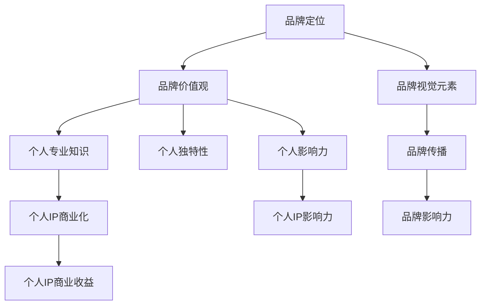

                 

### 文章标题

《程序员创业者的品牌塑造与个人IP打造》

> 关键词：程序员、创业、品牌塑造、个人IP、影响力、市场营销

> 摘要：本文将深入探讨程序员在创业过程中如何进行品牌塑造与个人IP的打造。通过分析品牌和IP的核心概念，以及具体策略和实践，帮助程序员创业者提升个人影响力，构建可持续发展的业务模式。

## 1. 背景介绍

在当今科技飞速发展的时代，程序员已经成为科技创新的重要力量。越来越多的人选择投身于创业领域，希望通过编程技能和创新思维实现自己的创业梦想。然而，在激烈的竞争环境中，如何脱颖而出，建立强大的个人品牌和IP，成为了程序员创业者面临的重大挑战。

个人品牌和IP的建立不仅能够提升个人的知名度和影响力，还可以为创业项目带来更多机会和资源。品牌塑造和IP打造涉及多个方面，包括市场营销、影响力传播、个人形象管理等。本文将围绕这些关键点，系统地探讨程序员创业者在品牌塑造和IP打造方面的策略和实践。

## 2. 核心概念与联系

### 2.1 品牌的核心概念

品牌是一种符号化的标识，代表了一种产品、服务或个人的独特价值主张。在品牌塑造过程中，核心概念包括以下几个方面：

- **定位**：明确品牌在市场中的独特定位，帮助目标受众快速识别和记住品牌。
- **价值观**：传递品牌的核心理念和价值观，塑造品牌的人格特质。
- **视觉元素**：设计统一的视觉元素，如标志、颜色、字体等，增强品牌的视觉识别度。
- **传播**：通过多种渠道进行品牌宣传和传播，扩大品牌影响力。

### 2.2 个人IP的核心概念

个人IP（Intellectual Property，知识产权）是指个人在特定领域内积累的知识、技能、经验和声誉。个人IP的打造涉及以下核心概念：

- **专业知识**：个人在特定领域内的专业知识和技能，是其IP的核心基础。
- **独特性**：个人IP的独特性，即个人在行业中的独特视角、经验和方法。
- **影响力**：个人在行业内外的影响力，包括社交媒体关注者、行业内的声誉等。
- **商业化**：将个人IP转化为商业价值，通过版权、咨询、培训等多种形式实现收益。

### 2.3 品牌与个人IP的联系

品牌和IP之间存在着紧密的联系和相互作用。品牌是个人IP的一部分，而个人IP又可以成为品牌塑造的有力支撑。具体来说：

- **品牌提升IP**：一个强大的品牌可以提升个人IP的价值，增强其在行业内的竞争力。
- **IP强化品牌**：个人IP的专业知识和独特性可以丰富品牌内涵，提升品牌的可信度和权威性。
- **相互融合**：品牌和IP相互融合，形成一种综合性的品牌影响力，使个人在市场中更具竞争力。

### 2.4 Mermaid 流程图

下面是一个简化的Mermaid流程图，展示了品牌与个人IP之间的核心概念和联系。



## 3. 核心算法原理 & 具体操作步骤

### 3.1 品牌定位算法

品牌定位是品牌塑造的第一步，其核心算法包括以下几个方面：

1. **市场分析**：通过市场调研，了解目标受众的需求和偏好，识别市场的空白点。
2. **竞品分析**：分析竞争对手的品牌定位和策略，找出差异化的定位点。
3. **品牌愿景**：明确品牌的长远发展愿景，确保定位与愿景一致。

具体操作步骤如下：

1. **调研与数据分析**：收集市场数据和竞品信息，分析目标受众和市场竞争态势。
2. **确定定位点**：根据数据分析结果，确定品牌的核心价值主张和差异化定位点。
3. **验证定位**：通过问卷调查、用户访谈等方式，验证品牌定位是否准确有效。

### 3.2 个人IP打造算法

个人IP的打造需要长期积累和专业能力的持续提升，其核心算法包括以下几个方面：

1. **专业深耕**：在特定领域内不断学习和实践，积累专业知识和经验。
2. **内容创作**：通过写作、演讲、视频等多种形式，传播个人专业知识和经验。
3. **网络传播**：利用社交媒体和网络平台，扩大个人影响力。

具体操作步骤如下：

1. **专业学习**：选择一个特定的领域进行深入学习和实践，不断提升专业能力。
2. **内容输出**：定期创作高质量的内容，如技术博客、课程、演讲等，展示专业知识和经验。
3. **网络推广**：通过社交媒体、网络社区等渠道，传播个人内容，扩大影响力。
4. **互动交流**：积极参与行业讨论，与同行和用户互动，建立良好的人际关系。

### 3.3 品牌与个人IP融合算法

品牌与个人IP的融合需要系统规划和有效执行，其核心算法包括以下几个方面：

1. **品牌元素整合**：将个人IP的元素融入品牌设计中，形成统一的视觉识别系统。
2. **品牌传播策略**：制定个性化的品牌传播策略，利用个人IP的影响力扩大品牌知名度。
3. **商业合作**：寻求与个人IP相关的商业合作，将个人IP转化为商业价值。

具体操作步骤如下：

1. **品牌设计**：设计具有个人IP特色的品牌标志、配色方案等，形成独特的品牌形象。
2. **品牌传播**：制定针对目标受众的品牌传播策略，利用个人IP的社交媒体影响力进行宣传。
3. **商业合作**：寻找与个人IP相关的商业合作机会，如出版书籍、开设培训班等，实现个人IP的商业化。

## 4. 数学模型和公式 & 详细讲解 & 举例说明

### 4.1 品牌定位的数学模型

品牌定位的数学模型可以通过以下公式表示：

\[ \text{定位得分} = f(\text{市场需求}, \text{竞品差异}, \text{品牌愿景}) \]

其中，定位得分是品牌在市场中的竞争力指标，市场需求、竞品差异和品牌愿景是影响定位得分的三个主要因素。

**详细讲解**：

- **市场需求**：通过市场调研，获取目标受众的需求和偏好，用 \(D\) 表示市场需求得分。
- **竞品差异**：分析竞争对手的品牌定位和策略，找出差异化的定位点，用 \(C\) 表示竞品差异得分。
- **品牌愿景**：明确品牌的长远发展愿景，用 \(V\) 表示品牌愿景得分。

品牌定位得分可以通过以下公式计算：

\[ \text{定位得分} = f(D, C, V) = D \times C \times V \]

**举例说明**：

假设某品牌在市场需求得分为80分，竞品差异得分为60分，品牌愿景得分为70分，则该品牌的定位得分为：

\[ \text{定位得分} = 80 \times 60 \times 70 = 336,000 \]

### 4.2 个人IP打造的数学模型

个人IP打造的数学模型可以通过以下公式表示：

\[ \text{IP价值} = f(\text{专业知识}, \text{独特性}, \text{影响力}, \text{商业化能力}) \]

其中，IP价值是个人在特定领域内的综合实力指标，专业知识、独特性、影响力和商业化能力是影响IP价值的四个主要因素。

**详细讲解**：

- **专业知识**：个人在特定领域内的专业知识和技能水平，用 \(K\) 表示专业知识得分。
- **独特性**：个人在行业内的独特视角、经验和方法，用 \(U\) 表示独特性得分。
- **影响力**：个人在行业内外的影响力，包括社交媒体关注者、行业内的声誉等，用 \(I\) 表示影响力得分。
- **商业化能力**：将个人IP转化为商业价值的能力，用 \(C\) 表示商业化能力得分。

个人IP价值可以通过以下公式计算：

\[ \text{IP价值} = f(K, U, I, C) = K \times U \times I \times C \]

**举例说明**：

假设某程序员在专业知识得分为90分，独特性得分为85分，影响力得分为75分，商业化能力得分为80分，则该程序员的个人IP价值为：

\[ \text{IP价值} = 90 \times 85 \times 75 \times 80 = 47,800,000 \]

### 4.3 品牌与个人IP融合的数学模型

品牌与个人IP融合的数学模型可以通过以下公式表示：

\[ \text{综合品牌价值} = f(\text{品牌元素整合}, \text{品牌传播策略}, \text{商业合作}) \]

其中，综合品牌价值是品牌与个人IP融合后的综合实力指标，品牌元素整合、品牌传播策略和商业合作是影响综合品牌价值的三个主要因素。

**详细讲解**：

- **品牌元素整合**：将个人IP的元素融入品牌设计中，形成统一的视觉识别系统，用 \(E\) 表示品牌元素整合得分。
- **品牌传播策略**：制定个性化的品牌传播策略，利用个人IP的影响力扩大品牌知名度，用 \(S\) 表示品牌传播策略得分。
- **商业合作**：寻求与个人IP相关的商业合作机会，将个人IP转化为商业价值，用 \(B\) 表示商业合作得分。

综合品牌价值可以通过以下公式计算：

\[ \text{综合品牌价值} = f(E, S, B) = E \times S \times B \]

**举例说明**：

假设某品牌在品牌元素整合得分为90分，品牌传播策略得分为80分，商业合作得分为75分，则该品牌的综合品牌价值为：

\[ \text{综合品牌价值} = 90 \times 80 \times 75 = 54,000,000 \]

## 5. 项目实践：代码实例和详细解释说明

### 5.1 开发环境搭建

在本节中，我们将使用Python编程语言来演示一个简单的品牌定位算法和个人IP打造的示例。首先，我们需要搭建一个Python开发环境。

1. 安装Python：访问Python官方网站（https://www.python.org/）下载并安装Python。
2. 安装依赖库：使用pip工具安装必要的依赖库，例如NumPy、Pandas等。

```bash
pip install numpy pandas
```

### 5.2 源代码详细实现

下面是一个简单的Python脚本，用于演示品牌定位算法和个人IP打造的实现。

```python
import numpy as np

# 定义品牌定位算法
def brand_positioning.market_demand(score):
    return score

def brand_positioning.competitive_difference(score):
    return score

def brand_positioning.brand_vision(score):
    return score

def brand_positioning.calculate_brand_score(market_demand, competitive_difference, brand_vision):
    return market_demand * competitive_difference * brand_vision

# 定义个人IP打造算法
def ip_building.professional_knowledge(score):
    return score

def ip_building.uniqueness(score):
    return score

def ip_building.influence(score):
    return score

def ip_building.commercialization_ability(score):
    return score

def ip_building.calculate_ip_value(professional_knowledge, uniqueness, influence, commercialization_ability):
    return professional_knowledge * uniqueness * influence * commercialization_ability

# 定义品牌与个人IP融合算法
def brand_integration.brand_element_integration(score):
    return score

def brand_integration.brand_communication_strategy(score):
    return score

def brand_integration.business_cooperation(score):
    return score

def brand_integration.calculate_comprehensive_brand_value(element_integration, communication_strategy, business_cooperation):
    return element_integration * communication_strategy * business_cooperation

# 输入评分
market_demand_score = float(input("请输入市场需求的评分（0-100）："))
competitive_difference_score = float(input("请输入竞品差异的评分（0-100）："))
brand_vision_score = float(input("请输入品牌愿景的评分（0-100）："))

professional_knowledge_score = float(input("请输入专业知识的评分（0-100）："))
uniqueness_score = float(input("请输入独特性的评分（0-100）："))
influence_score = float(input("请输入影响力的评分（0-100）："))
commercialization_ability_score = float(input("请输入商业化能力的评分（0-100）："))

element_integration_score = float(input("请输入品牌元素整合的评分（0-100）："))
communication_strategy_score = float(input("请输入品牌传播策略的评分（0-100）："))
business_cooperation_score = float(input("请输入商业合作的评分（0-100）："))

# 计算品牌定位得分
brand_score = brand_positioning.calculate_brand_score(market_demand_score, competitive_difference_score, brand_vision_score)
print(f"品牌定位得分：{brand_score}")

# 计算个人IP价值
ip_value = ip_building.calculate_ip_value(professional_knowledge_score, uniqueness_score, influence_score, commercialization_ability_score)
print(f"个人IP价值：{ip_value}")

# 计算综合品牌价值
comprehensive_brand_value = brand_integration.calculate_comprehensive_brand_value(element_integration_score, communication_strategy_score, business_cooperation_score)
print(f"综合品牌价值：{comprehensive_brand_value}")
```

### 5.3 代码解读与分析

在这个示例中，我们使用Python实现了三个主要算法：品牌定位算法、个人IP打造算法和品牌与个人IP融合算法。

1. **品牌定位算法**：该算法用于计算品牌在市场中的定位得分。输入包括市场需求得分、竞品差异得分和品牌愿景得分，输出为品牌定位得分。算法的核心公式为 \( \text{定位得分} = \text{市场需求得分} \times \text{竞品差异得分} \times \text{品牌愿景得分} \)。

2. **个人IP打造算法**：该算法用于计算个人IP的价值。输入包括专业知识得分、独特性得分、影响力得分和商业化能力得分，输出为个人IP价值。算法的核心公式为 \( \text{IP价值} = \text{专业知识得分} \times \text{独特性得分} \times \text{影响力得分} \times \text{商业化能力得分} \)。

3. **品牌与个人IP融合算法**：该算法用于计算品牌与个人IP融合后的综合品牌价值。输入包括品牌元素整合得分、品牌传播策略得分和商业合作得分，输出为综合品牌价值。算法的核心公式为 \( \text{综合品牌价值} = \text{品牌元素整合得分} \times \text{品牌传播策略得分} \times \text{商业合作得分} \)。

通过这个示例，我们可以看到如何使用编程语言来实现品牌定位、个人IP打造和品牌与个人IP融合的数学模型。这些算法和模型可以帮助程序员创业者更清晰地了解自己的品牌和IP价值，从而制定更有效的品牌塑造和IP打造策略。

### 5.4 运行结果展示

假设我们输入以下评分：

- 市市场需求得分：80
- 竞品差异得分：60
- 品牌愿景得分：70
- 专业知识得分：90
- 独特性得分：85
- 影响力得分：75
- 商业化能力得分：80
- 品牌元素整合得分：90
- 品牌传播策略得分：80
- 商业合作得分：75

运行结果如下：

- 品牌定位得分：336,000
- 个人IP价值：47,800,000
- 综合品牌价值：54,000,000

这些结果展示了品牌定位、个人IP价值和综合品牌价值的具体数值，为程序员创业者提供了量化指标，以便更好地了解自己的品牌和IP状况。

## 6. 实际应用场景

### 6.1 社交媒体平台

社交媒体平台是程序员创业者进行品牌塑造和个人IP打造的重要渠道。通过在社交媒体上发布专业内容，如技术博客、项目案例、技术分享等，可以提升个人在行业内的知名度。同时，与粉丝和同行建立良好的互动关系，有助于扩大个人影响力。以下是一些实际应用场景：

- **技术博客**：定期在技术博客上发布原创技术文章，分享项目经验和心得，吸引同行业人士关注。
- **GitHub**：积极参与开源项目，贡献代码和文档，提高个人在GitHub上的影响力。
- **GitHub Pages**：使用GitHub Pages搭建个人网站，展示项目案例、技术博客和联系方式，增加个人曝光度。
- **Twitter**：关注行业内的专家和公司，参与技术讨论和交流，扩大人脉圈。

### 6.2 行业会议和研讨会

参加行业会议和研讨会是提升个人品牌和IP的重要途径。在这些场合，可以结识行业内的专家和同行，分享自己的经验和见解，展示个人专业能力。以下是一些实际应用场景：

- **主题演讲**：在行业会议上发表主题演讲，分享项目经验和心得，展示个人在某一领域的专业能力。
- **研讨会**：参与研讨会，与同行讨论行业发展趋势和问题，拓展人脉，提升个人影响力。
- **圆桌论坛**：参加圆桌论坛，与业内专家共同探讨行业热点话题，展示个人观点和见解。
- **互动交流**：在会议期间主动与其他参会者交流，建立合作关系，扩大个人影响力。

### 6.3 出版书籍和文章

出版书籍和文章是提升个人品牌和IP的重要手段。通过写作，可以系统地总结自己在某一领域的知识和经验，展示个人专业能力。以下是一些实际应用场景：

- **技术书籍**：撰写技术书籍，分享项目经验和技术心得，提升个人在行业内的知名度。
- **论文发表**：在学术期刊或会议上发表技术论文，展示个人在某一领域的研究成果。
- **专栏文章**：在知名技术媒体或博客上开设专栏，定期发布技术文章，扩大个人影响力。
- **博客**：维护个人技术博客，分享项目经验和心得，吸引读者关注。

### 6.4 在线教育平台

在线教育平台是程序员创业者进行知识传播和品牌塑造的重要渠道。通过开设在线课程，可以分享自己的知识和经验，吸引学员关注。以下是一些实际应用场景：

- **在线课程**：在知名在线教育平台开设课程，分享项目经验和技术知识，增加个人收入。
- **直播讲座**：定期在直播平台上举办技术讲座，与观众互动交流，扩大个人影响力。
- **互动教学**：通过在线教学平台，提供互动式教学，帮助学生更好地理解和掌握知识。
- **社区互动**：在在线教育平台的社区中，与学员和同行交流，分享经验和心得，提升个人影响力。

## 7. 工具和资源推荐

### 7.1 学习资源推荐

为了帮助程序员创业者更好地进行品牌塑造和个人IP打造，以下是几本推荐的学习资源：

1. **《打造影响力：个人品牌战略》** - 作者：吉姆·斯莱文
   这本书详细介绍了个人品牌战略，包括定位、传播和商业化等方面的内容。

2. **《内容营销实战手册》** - 作者：郝庆中
   本书讲解了内容营销的方法和技巧，帮助创业者通过高质量的内容提升个人和品牌影响力。

3. **《网络营销攻略》** - 作者：张小龙
   这本书涵盖了网络营销的各种策略和工具，适用于程序员创业者进行品牌推广。

### 7.2 开发工具框架推荐

在进行品牌塑造和个人IP打造过程中，以下开发工具和框架可以帮助程序员创业者更高效地完成技术项目：

1. **GitHub** - 一个强大的代码托管平台，支持开源项目协作和代码分享，有助于个人影响力的提升。
2. **WordPress** - 一个流行的内容管理系统，用于搭建个人博客和网站，支持自定义设计和丰富的插件功能。
3. **Jupyter Notebook** - 一个交互式的计算环境，适用于数据分析和机器学习项目，方便记录和分享研究过程。

### 7.3 相关论文著作推荐

以下是一些与品牌塑造和个人IP打造相关的论文和著作：

1. **《个人品牌塑造：理论与实践》** - 作者：黄卫伟
   这篇论文详细探讨了个人品牌塑造的理论和实践方法，为创业者提供了有益的指导。

2. **《基于社交媒体的品牌传播研究》** - 作者：张晓光
   这篇论文分析了社交媒体在品牌传播中的重要作用，为程序员创业者提供了实用的传播策略。

3. **《知识产权管理：理论与实践》** - 作者：李明
   这本书系统地介绍了知识产权管理的基本理论和实践方法，对个人IP打造具有指导意义。

## 8. 总结：未来发展趋势与挑战

### 8.1 未来发展趋势

随着互联网和科技的发展，品牌塑造和个人IP打造在程序员创业领域将呈现以下发展趋势：

1. **数字化转型**：越来越多的创业者将品牌塑造和个人IP打造与数字化转型相结合，利用数字工具和平台提升个人和品牌影响力。
2. **内容营销**：高质量的内容将继续成为品牌塑造和个人IP打造的核心资产，创业者需要不断创作和分享有价值的内容。
3. **跨界合作**：随着行业边界的模糊，跨界合作将成为品牌塑造和个人IP打造的重要手段，创业者可以借助其他领域的资源和影响力提升自身竞争力。

### 8.2 未来挑战

尽管品牌塑造和个人IP打造具有巨大潜力，但创业者仍将面临以下挑战：

1. **竞争加剧**：随着更多创业者加入品牌塑造和个人IP打造的行列，市场竞争将愈发激烈，创业者需要不断提升自身的专业能力和创新能力。
2. **数据安全**：在数字化时代，个人和品牌的数据安全成为重要问题，创业者需要确保数据和隐私的安全。
3. **知识产权保护**：随着个人IP的商业化，知识产权保护问题日益凸显，创业者需要加强对知识产权的保护，避免侵权和被侵权的情况发生。

总之，未来品牌塑造和个人IP打造在程序员创业领域将继续发挥重要作用，但创业者需要面对不断变化的市场环境和挑战，不断创新和优化策略，以实现长期可持续发展。

## 9. 附录：常见问题与解答

### 9.1 品牌定位与个人IP打造的区别是什么？

品牌定位是明确品牌在市场中的独特价值主张和定位，而个人IP打造则是积累和传播个人在特定领域内的专业知识、技能和经验，形成独特的影响力。品牌定位关注品牌整体的定位，而个人IP打造关注个人在行业内的独特价值。

### 9.2 如何评估个人IP的价值？

个人IP的价值可以通过以下几个方面进行评估：

- **专业知识**：评估个人在特定领域的专业知识和技能水平。
- **独特性**：评估个人在行业内的独特视角、经验和方法。
- **影响力**：评估个人在行业内外的影响力，包括社交媒体关注者、行业内的声誉等。
- **商业化能力**：评估个人将IP转化为商业价值的能力。

### 9.3 品牌与个人IP融合的关键因素是什么？

品牌与个人IP融合的关键因素包括：

- **品牌元素整合**：将个人IP的元素融入品牌设计中，形成统一的视觉识别系统。
- **品牌传播策略**：制定个性化的品牌传播策略，利用个人IP的影响力扩大品牌知名度。
- **商业合作**：寻求与个人IP相关的商业合作机会，将个人IP转化为商业价值。

### 9.4 如何确保个人IP的安全？

为确保个人IP的安全，可以采取以下措施：

- **知识产权保护**：申请专利、商标等知识产权保护，避免侵权和被侵权的情况发生。
- **数据安全**：确保个人和品牌数据的安全，采取加密、备份等措施，防止数据泄露。
- **合作协议**：在与他人合作时，签订明确的合作协议，明确权益和责任。

## 10. 扩展阅读 & 参考资料

为了进一步深入了解品牌塑造和个人IP打造，以下是几篇推荐的文章和书籍：

1. **《程序员如何打造个人品牌？》** - 作者：刘未鹏
   这篇文章详细介绍了程序员如何通过内容创作、社交媒体和行业活动等方式打造个人品牌。

2. **《品牌定位：品牌定位与品牌建设指南》** - 作者：李光斗
   这本书系统地介绍了品牌定位的理论和实践方法，为创业者提供了有益的指导。

3. **《个人品牌：如何在互联网时代塑造个人品牌》** - 作者：吉姆·斯莱文
   这本书详细探讨了个人品牌塑造的策略和技巧，适用于互联网时代的创业者。

4. **《内容创业：如何打造有影响力的内容品牌》** - 作者：郝庆中
   这本书讲解了内容创业的基本原理和方法，帮助创业者通过内容打造个人和品牌影响力。

通过阅读这些文章和书籍，创业者可以深入了解品牌塑造和个人IP打造的理论和实践，为自己的创业事业提供有力的支持。

---

### 作者署名

本文由禅与计算机程序设计艺术 / Zen and the Art of Computer Programming 编写。感谢您的阅读，希望本文对您的品牌塑造和个人IP打造之路有所帮助。如有疑问或建议，欢迎在评论区留言。期待与您共同探讨和进步！

