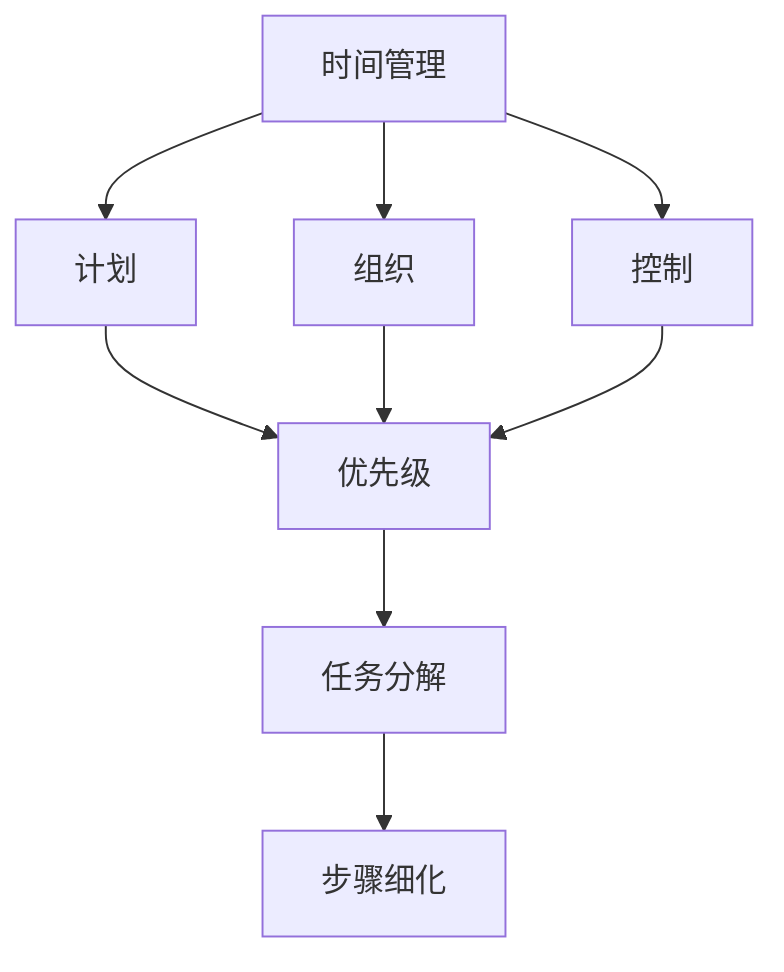

                 

### 文章标题

《程序员创业者的时间管理技巧》

> 关键词：程序员，创业者，时间管理，效率提升，工作生活平衡

> 摘要：本文将深入探讨程序员在创业过程中的时间管理技巧，旨在帮助创业者提高工作效率，实现工作与生活的平衡，从而在激烈的市场竞争中脱颖而出。文章将结合实际案例，从多个角度提供实用的方法和策略，以期为创业者提供有益的参考。

### 1. 背景介绍

在当今快速发展的科技行业，程序员的地位和影响力日益提升。随着互联网、人工智能、大数据等技术的兴起，程序员不仅成为了技术驱动型公司的重要组成部分，也逐渐在创业领域崭露头角。然而，创业之路充满挑战，时间管理成为程序员创业者面临的首要问题。

根据全球知名职场调查公司Gallup的一项调查显示，超过70%的创业者认为时间管理是他们面临的最大挑战之一。程序员创业者更是如此，他们需要处理复杂的技术问题、团队管理、市场营销等多方面的工作，这无疑加大了时间管理的难度。因此，如何高效地利用时间，成为程序员创业者成功的关键因素之一。

此外，程序员创业者常常面临工作与生活的平衡问题。由于工作性质的特殊性，程序员需要投入大量的时间和精力进行编码、调试、测试等任务。而创业者在创业初期往往需要亲自参与各个环节，这使得他们的工作时间更加不固定，甚至有时需要加班到深夜。这种高强度的工作状态，很容易导致创业者身心疲惫，影响工作效率和生活质量。

本文将结合程序员创业者的实际经验，探讨一些行之有效的时间管理技巧，帮助他们在有限的时间内实现最大化的产出，从而在激烈的市场竞争中取得优势。

### 2. 核心概念与联系

在深入探讨程序员创业者的时间管理技巧之前，我们首先需要了解一些核心概念，如“时间管理”、“优先级”、“任务分解”等。

#### 2.1 时间管理

时间管理是指通过计划、组织和控制时间，以提高个人和团队工作效率的过程。对于程序员创业者来说，时间管理不仅仅是为了完成任务，更是为了确保他们能够在创业过程中保持清晰的目标和方向。

#### 2.2 优先级

优先级是指任务的重要性和紧急程度。了解并设定任务的优先级，有助于程序员创业者集中精力处理最重要的事情，从而提高工作效率。

#### 2.3 任务分解

任务分解是将复杂任务分解为若干个简单步骤的过程。通过任务分解，程序员创业者可以更清晰地了解任务的每一个环节，从而更好地进行时间分配和任务调度。

为了更好地理解这些核心概念，我们可以使用Mermaid流程图来展示它们之间的联系。



通过上述流程图，我们可以看出，时间管理是一个包含计划、组织、控制等多个环节的综合性过程，而优先级和任务分解则是确保时间管理有效实施的关键要素。

### 3. 核心算法原理 & 具体操作步骤

在了解了核心概念后，接下来我们将探讨一些具体的时间管理技巧，包括如何设定优先级、如何进行任务分解、如何避免时间浪费等。

#### 3.1 设定优先级

设定优先级是时间管理的重要环节。为了更好地设定优先级，我们可以采用一种名为“四象限法”的方法。

四象限法将任务分为四个类别：

- 第一象限：重要且紧急的任务，如客户需求、紧急修复bug等。
- 第二象限：重要但不紧急的任务，如学习新技术、团队建设等。
- 第三象限：不重要但紧急的任务，如不必要的会议、临时性工作等。
- 第四象限：既不重要也不紧急的任务，如刷社交媒体、无聊聊天等。

具体操作步骤如下：

1. **列出任务清单**：首先，列出所有需要完成的任务。
2. **评估任务**：对每个任务进行评估，判断其重要性和紧急程度。
3. **划分象限**：根据评估结果，将任务划分到四个象限。
4. **优先处理**：优先处理第一象限的任务，然后依次处理第二、第三和第四象限的任务。

通过四象限法，程序员创业者可以更加明确地了解任务的优先级，从而更好地分配时间和精力。

#### 3.2 任务分解

任务分解是将复杂任务分解为若干个简单步骤的过程。具体操作步骤如下：

1. **确定任务目标**：首先，明确任务的目标和期望结果。
2. **分解任务**：将任务分解为若干个子任务，每个子任务都应该是可执行和可衡量的。
3. **细化步骤**：为每个子任务制定详细的执行步骤，确保每个步骤都是清晰和具体的。
4. **评估和调整**：在任务执行过程中，及时评估任务进度，并根据实际情况进行调整。

通过任务分解，程序员创业者可以更清晰地了解任务的每一个环节，从而更好地进行时间分配和任务调度。

#### 3.3 避免时间浪费

时间浪费是影响程序员创业者工作效率的重要因素之一。为了避免时间浪费，我们可以采取以下措施：

1. **设定工作时间**：明确每天的工作时间，确保工作时间内不受到打扰。
2. **优先处理重要任务**：将重要任务安排在注意力最集中的时间段，以提高工作效率。
3. **避免多任务处理**：尽量减少同时处理多个任务的情况，以免分散注意力。
4. **使用工具**：利用各种工具和软件来提高工作效率，如时间追踪工具、任务管理工具等。

通过上述措施，程序员创业者可以更好地管理时间，避免时间浪费，从而提高工作效率。

### 4. 数学模型和公式 & 详细讲解 & 举例说明

在时间管理中，数学模型和公式可以提供一些量化的方法和工具，帮助我们更好地理解和优化时间管理策略。

#### 4.1 工作效率公式

工作效率（Efficiency）可以用以下公式表示：

\[ \text{工作效率} = \frac{\text{有效工作时间}}{\text{总工作时间}} \]

其中，有效工作时间是指真正用于完成任务的时长，总工作时间则包括所有工作的时间。

举例说明：

假设一位程序员创业者每天工作8小时，但实际有效工作时间只有6小时，那么他的工作效率为：

\[ \text{工作效率} = \frac{6}{8} = 0.75 \]

通过这个公式，程序员创业者可以了解到自己的工作效率，从而寻找提升工作效率的方法。

#### 4.2 优先级排序公式

在设定任务优先级时，我们可以使用以下公式：

\[ \text{优先级} = \text{重要性} \times \text{紧急程度} \]

其中，重要性可以按照任务对公司或个人的影响程度进行评估，紧急程度则可以根据任务的完成时间进行判断。

举例说明：

假设有以下几个任务：

1. 完成客户需求报告（重要性：5，紧急程度：3）
2. 学习新技术（重要性：3，紧急程度：2）
3. 参加市场推广会议（重要性：4，紧急程度：4）

根据优先级排序公式，我们可以计算出每个任务的优先级：

1. 优先级：\(5 \times 3 = 15\)
2. 优先级：\(3 \times 2 = 6\)
3. 优先级：\(4 \times 4 = 16\)

因此，第三个任务的优先级最高，应该优先处理。

通过上述数学模型和公式，程序员创业者可以更科学地设定优先级，从而更好地管理时间。

### 5. 项目实践：代码实例和详细解释说明

为了更好地理解上述时间管理技巧，我们将通过一个实际项目来展示如何应用这些方法。

#### 5.1 开发环境搭建

在这个项目中，我们将使用Python编程语言来实现一个简单的时间管理工具。首先，确保你已经安装了Python环境和必要的库。

```bash
pip install pandas matplotlib
```

#### 5.2 源代码详细实现

以下是一个简单的时间管理工具的实现代码：

```python
import pandas as pd
import matplotlib.pyplot as plt

# 任务数据
tasks = [
    {'name': '客户需求报告', 'importance': 5, 'urgency': 3, 'duration': 4},
    {'name': '学习新技术', 'importance': 3, 'urgency': 2, 'duration': 2},
    {'name': '市场推广会议', 'importance': 4, 'urgency': 4, 'duration': 3},
]

# 计算优先级
for task in tasks:
    task['priority'] = task['importance'] * task['urgency']

# 创建DataFrame
df = pd.DataFrame(tasks)

# 排序
df_sorted = df.sort_values(by='priority', ascending=False)

# 绘图
plt.figure(figsize=(10, 5))
plt.barh(df_sorted['name'], df_sorted['duration'])
plt.xlabel('Duration (hours)')
plt.ylabel('Tasks')
plt.title('Task Prioritization')
plt.show()
```

#### 5.3 代码解读与分析

1. **任务数据**：我们首先定义了一个任务列表，其中包含了每个任务的名字、重要性、紧急程度和持续时间。

2. **计算优先级**：通过遍历任务列表，我们为每个任务计算了优先级，优先级由重要性和紧急程度的乘积决定。

3. **创建DataFrame**：使用pandas库将任务数据转换为DataFrame，这样可以方便地进行数据操作和可视化。

4. **排序**：根据优先级对任务进行排序，确保优先级最高的任务排在最前面。

5. **绘图**：使用matplotlib库将排序后的任务绘制成条形图，以便于可视化任务的优先级。

通过这个简单的项目，我们可以直观地看到每个任务的优先级，从而更好地进行任务分配和调度。

#### 5.4 运行结果展示

运行上述代码后，我们得到了一个条形图，显示了每个任务的优先级和持续时间。通过这个图表，程序员创业者可以清晰地了解哪些任务是最重要的，从而优先处理。


### 6. 实际应用场景

在程序员创业者的实际工作中，时间管理技巧的应用场景非常广泛。以下是一些具体的实际应用场景：

#### 6.1 团队协作

在团队协作中，时间管理技巧可以帮助程序员创业者更好地协调团队成员的工作，确保项目按时完成。例如，通过设定优先级，创业者可以确保团队成员优先处理最重要和最紧急的任务，从而提高整个团队的工作效率。

#### 6.2 项目管理

在项目管理中，时间管理技巧可以帮助程序员创业者合理安排项目进度，确保项目按时交付。例如，通过任务分解和优先级排序，创业者可以清晰地了解每个阶段的任务和依赖关系，从而更好地进行时间分配和资源调配。

#### 6.3 个人生活

在个人生活中，时间管理技巧可以帮助程序员创业者更好地平衡工作和生活，避免过度劳累。例如，通过设定工作时间，创业者可以确保自己有足够的休息时间，从而保持良好的工作状态和身心健康。

#### 6.4 应急处理

在应急处理中，时间管理技巧可以帮助程序员创业者迅速响应突发事件，确保问题得到及时解决。例如，通过快速评估任务的重要性和紧急程度，创业者可以迅速确定应对策略，从而避免问题的进一步扩大。

### 7. 工具和资源推荐

为了更好地实施时间管理技巧，程序员创业者可以借助一些实用的工具和资源。以下是一些推荐：

#### 7.1 学习资源推荐

1. **《时间管理心理学》**：这是一本关于时间管理的经典著作，涵盖了时间管理的基本原理和实用技巧。
2. **《深度工作》**：作者Cal Newport提出了一种名为“深度工作”的时间管理方法，帮助人们更专注地工作，提高工作效率。

#### 7.2 开发工具框架推荐

1. **Trello**：这是一个非常流行的任务管理工具，可以帮助程序员创业者更好地进行任务分解和优先级排序。
2. **Asana**：这是一个强大的项目管理工具，提供了丰富的功能，如任务分配、进度跟踪、时间管理等。

#### 7.3 相关论文著作推荐

1. **《时间管理：理论与实践》**：这是一篇关于时间管理的论文，详细介绍了时间管理的基本理论和方法。
2. **《基于四象限法的任务优先级排序研究》**：这是一篇关于任务优先级排序的研究论文，提出了基于四象限法的任务优先级排序方法。

### 8. 总结：未来发展趋势与挑战

随着科技的不断进步，程序员创业者的时间管理技巧也将面临新的发展趋势和挑战。以下是几个可能的发展方向和挑战：

#### 8.1 自动化与智能化

未来，自动化和智能化技术将在时间管理中发挥越来越重要的作用。例如，智能日程管理工具可以自动识别任务的重要性和紧急程度，为程序员创业者提供个性化的时间管理建议。这将大大提高时间管理的效率和准确性。

#### 8.2 数据分析与优化

通过数据分析，程序员创业者可以更加精确地了解自己的时间使用情况，从而进行持续优化。例如，基于大数据分析的个性化时间管理建议，可以帮助创业者更好地调整工作与生活的平衡。

#### 8.3 跨界融合

随着各个行业的数字化转型，程序员创业者需要具备跨学科的知识和技能，这将对时间管理提出更高的要求。例如，创业者需要同时处理技术、营销、财务等多个领域的工作，如何在有限的时间内高效完成这些任务，将是未来的一个重要挑战。

#### 8.4 应对不确定性

在充满不确定性的创业环境中，程序员创业者需要具备快速应对变化的能力。这要求他们在时间管理上具备更高的灵活性和适应性，以便在突发情况下迅速调整计划。

总之，未来程序员创业者的时间管理技巧将更加智能化、数据化、跨界化和灵活化，同时也将面临更多的新挑战。如何应对这些挑战，将决定创业者能否在激烈的市场竞争中脱颖而出。

### 9. 附录：常见问题与解答

在本文中，我们讨论了程序员创业者的时间管理技巧。以下是关于时间管理的一些常见问题及解答：

#### 9.1 如何平衡工作与生活？

平衡工作与生活是时间管理的关键。以下是一些策略：

- **设定工作时间**：明确每天的工作时间，确保工作时间内高效完成任务。
- **设定休息时间**：确保每天有足够的休息时间，以便身心得到充分恢复。
- **优先处理重要任务**：将重要任务安排在注意力最集中的时间段，提高工作效率，减少加班。
- **灵活调整**：根据实际情况，灵活调整工作和休息时间，确保工作与生活之间的平衡。

#### 9.2 如何提高工作效率？

以下是一些提高工作效率的方法：

- **任务分解**：将复杂任务分解为简单步骤，明确每个步骤的目标和预期结果。
- **优先级排序**：根据任务的重要性和紧急程度，设定优先级，确保先处理最重要和最紧急的任务。
- **避免多任务处理**：尽量减少同时处理多个任务的情况，以免分散注意力。
- **利用工具**：使用各种工具和软件，如时间追踪工具、任务管理工具等，提高工作效率。

#### 9.3 时间管理有哪些常见误区？

以下是一些常见的时间管理误区：

- **过度依赖工具**：过分依赖工具，忽视实际操作和自我管理。
- **追求完美**：试图完美完成每个任务，导致时间浪费和效率低下。
- **忽视休息**：长时间工作，忽视休息，导致身心疲惫，工作效率降低。
- **缺乏灵活性**：时间管理计划过于 rigid，无法适应实际情况的变化。

为了避免这些误区，程序员创业者需要不断调整和优化时间管理策略，确保其适应自己的实际情况。

### 10. 扩展阅读 & 参考资料

为了深入了解程序员创业者的时间管理技巧，以下是一些扩展阅读和参考资料：

1. **《深度工作》**：作者Cal Newport提出了一种名为“深度工作”的时间管理方法，帮助人们更专注地工作，提高工作效率。

2. **《时间管理心理学》**：这是一本关于时间管理的经典著作，涵盖了时间管理的基本原理和实用技巧。

3. **《基于四象限法的任务优先级排序研究》**：这是一篇关于任务优先级排序的研究论文，提出了基于四象限法的任务优先级排序方法。

4. **Trello官网**：[https://trello.com/](https://trello.com/)
  
5. **Asana官网**：[https://asana.com/](https://asana.com/)

通过阅读这些书籍和参考资料，程序员创业者可以进一步了解时间管理的理论和实践，从而更好地管理自己的时间和提高工作效率。作者：禅与计算机程序设计艺术 / Zen and the Art of Computer Programming

