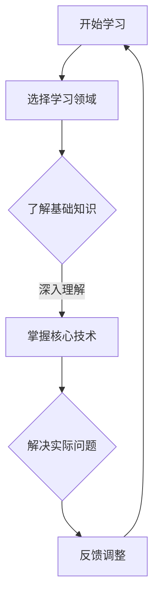
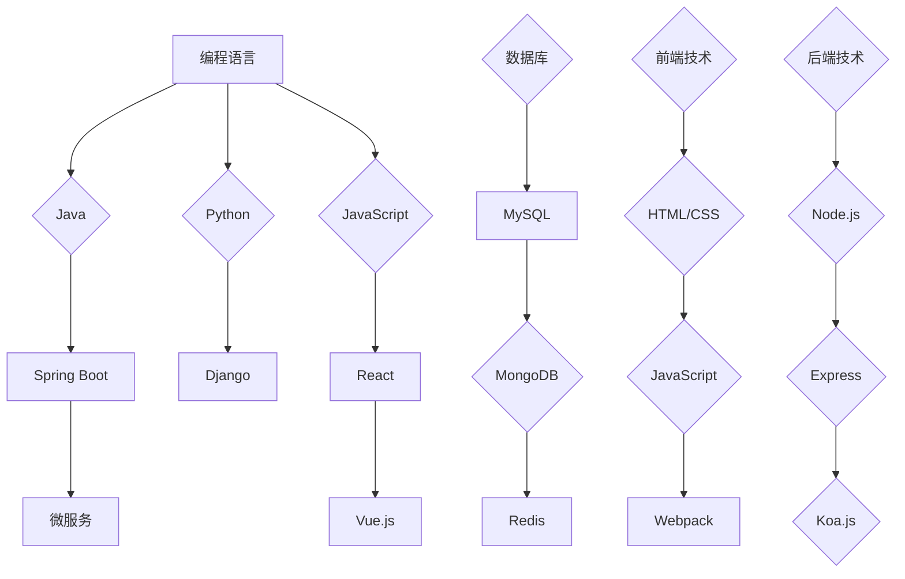

                 

### 文章标题

《程序员创业者的自我学习与技能更新》

> 关键词：程序员、创业、自我学习、技能更新、持续成长

> 摘要：本文将探讨程序员在创业过程中如何通过自我学习和技能更新实现个人和企业的持续成长，分析当前编程领域的趋势和挑战，提供实用的学习资源和工具，帮助程序员创业者应对未来发展的机遇和挑战。

## 1. 背景介绍

随着互联网和科技的快速发展，程序员创业者成为当今社会的一个热门群体。他们不仅在技术领域有着深厚的积累，还具备创新精神和商业敏锐度。然而，技术的快速迭代和市场的不断变化对程序员创业者提出了更高的要求。为了在激烈的市场竞争中脱颖而出，程序员创业者必须保持持续学习的态度，不断更新和提升自己的技能，以适应不断变化的技术环境和市场需求。

### 1.1 程序员创业者的现状

程序员创业者通常具备丰富的技术背景和实战经验，这使得他们在创业初期更容易找到切入点，构建起初步的产品和服务。然而，随着创业的深入，他们需要面对的挑战也越来越多。除了技术创新和市场定位，程序员创业者还需要关注团队管理、业务拓展、资金筹集等方面的问题。这些挑战往往需要创业者具备更加全面的知识结构和技能。

### 1.2 自我学习和技能更新的重要性

在快速变化的技术环境中，程序员创业者只有不断学习和更新技能，才能保持竞争优势。自我学习和技能更新不仅有助于提升个人能力，还可以为团队带来新的思路和动力。以下是自我学习和技能更新的几个重要方面：

- **技术知识更新**：随着新技术的不断涌现，程序员创业者需要及时了解和学习相关技术，以保持技术的前沿性。
- **管理能力提升**：创业过程中，团队管理和业务拓展成为重要的课题。程序员创业者需要通过学习管理理论和实践，提升自己的管理能力。
- **商业敏锐度**：了解市场需求和商业模式，有助于程序员创业者更好地把握商业机会，实现企业的快速发展。

## 2. 核心概念与联系

为了更好地理解程序员创业者的自我学习和技能更新，我们首先需要了解几个核心概念，包括持续学习、技能树、技术趋势等。

### 2.1 持续学习

持续学习是指个体在职业生涯中不断获取新知识、新技能的过程。对于程序员创业者来说，持续学习是保持竞争力的重要手段。以下是一个简单的 Mermaid 流程图，展示持续学习的过程：



### 2.2 技能树

技能树是指个体在不同领域和方向上积累的技能集合。程序员创业者的技能树通常包括编程语言、框架、数据库、前端技术、后端技术等多个方面。以下是一个简化的技能树示例：



### 2.3 技术趋势

技术趋势是指当前和未来一段时间内技术发展的方向和重点。程序员创业者需要关注技术趋势，以把握行业动向，提升自身的竞争力。以下是一些当前热门的技术趋势：

- **人工智能与机器学习**：随着计算能力的提升和算法的改进，人工智能和机器学习在各个领域得到广泛应用，成为技术发展的重中之重。
- **区块链技术**：区块链技术的去中心化、安全性和透明性等特点，使其在金融、供应链管理、数字身份认证等领域具有广泛的应用前景。
- **云计算与大数据**：云计算和大数据技术的成熟，使得数据处理和分析变得更加高效和便捷，为企业提供了强大的技术支撑。

## 3. 核心算法原理 & 具体操作步骤

在程序员创业者的自我学习和技能更新过程中，核心算法原理的理解和掌握至关重要。以下是一个简单的排序算法——冒泡排序的原理和具体操作步骤。

### 3.1 冒泡排序算法原理

冒泡排序是一种简单的排序算法，其基本思想是通过重复地交换相邻的两个未按顺序排列的元素，使得每个元素逐步向上“冒泡”直到整个序列有序。

### 3.2 具体操作步骤

- **初始化**：将待排序的序列记为 `arr`，长度为 `n`。
- **循环遍历**：从第一个元素开始，遍历到倒数第二个元素，即 `i` 从 `0` 到 `n-2`。
- **内层循环**：对于当前遍历到的 `i` 元素，遍历到倒数第二个元素，即 `j` 从 `i+1` 到 `n-1`。
- **比较和交换**：如果 `arr[j] > arr[j+1]`，则交换 `arr[j]` 和 `arr[j+1]`。
- **结束条件**：如果内层循环过程中没有发生交换，则序列已经有序，结束排序。

以下是冒泡排序的 Python 代码实现：

```python
def bubble_sort(arr):
    n = len(arr)
    for i in range(n-1):
        for j in range(n-i-1):
            if arr[j] > arr[j+1]:
                arr[j], arr[j+1] = arr[j+1], arr[j]
    return arr
```

## 4. 数学模型和公式 & 详细讲解 & 举例说明

在程序员创业者的自我学习和技能更新过程中，数学模型和公式的应用也是不可或缺的。以下以线性回归模型为例，详细讲解其原理和计算方法。

### 4.1 线性回归模型原理

线性回归是一种用于预测数值型目标变量的统计方法。其基本思想是通过建立目标变量与特征变量之间的线性关系模型，来预测新的数据点的目标值。

### 4.2 数学模型和公式

线性回归模型的数学表达式为：

$$
y = \beta_0 + \beta_1x + \epsilon
$$

其中，$y$ 为目标变量，$x$ 为特征变量，$\beta_0$ 和 $\beta_1$ 分别为模型的截距和斜率，$\epsilon$ 为误差项。

### 4.3 计算方法

线性回归模型的计算方法主要包括以下步骤：

- **数据预处理**：对数据集进行数据清洗、归一化等处理，确保数据的质量和一致性。
- **特征选择**：选择与目标变量相关的特征变量，以减少模型的复杂度和过拟合现象。
- **模型训练**：使用训练数据集对线性回归模型进行训练，求解模型参数 $\beta_0$ 和 $\beta_1$。
- **模型评估**：使用验证数据集对模型进行评估，计算模型的预测误差和拟合度。

### 4.4 举例说明

假设我们有以下数据集，其中 $x$ 表示广告花费，$y$ 表示销售额：

| $x$ | $y$ |
|-----|-----|
| 100 | 200 |
| 200 | 300 |
| 300 | 400 |
| 400 | 500 |
| 500 | 600 |

我们使用线性回归模型来预测新的广告花费对应的销售额。

- **数据预处理**：对数据进行归一化处理，将 $x$ 和 $y$ 的取值范围缩放到 [0, 1]。
- **特征选择**：由于只有一个特征变量 $x$，无需进行特征选择。
- **模型训练**：使用训练数据集计算线性回归模型的参数 $\beta_0$ 和 $\beta_1$，得到：

$$
\beta_0 = \frac{1}{5}\sum_{i=1}^{5}y_i - \beta_1\frac{1}{5}\sum_{i=1}^{5}x_i = 0.6
$$

$$
\beta_1 = \frac{\sum_{i=1}^{5}(x_i - \bar{x})(y_i - \bar{y})}{\sum_{i=1}^{5}(x_i - \bar{x})^2} = 0.2
$$

其中，$\bar{x}$ 和 $\bar{y}$ 分别为 $x$ 和 $y$ 的平均值。

- **模型评估**：使用验证数据集对模型进行评估，计算模型的预测误差和拟合度。

## 5. 项目实践：代码实例和详细解释说明

在本节中，我们将通过一个实际项目——基于 Flask 的简单博客系统，来展示程序员创业者在自我学习和技能更新过程中的实践应用。

### 5.1 开发环境搭建

在开始项目之前，我们需要搭建开发环境。以下是一个基本的开发环境搭建步骤：

1. 安装 Python 3.x 版本。
2. 安装虚拟环境工具 virtualenv。
3. 创建虚拟环境并激活。
4. 安装 Flask 框架。

```shell
pip install virtualenv
virtualenv myenv
source myenv/bin/activate
pip install Flask
```

### 5.2 源代码详细实现

以下是基于 Flask 的简单博客系统的源代码实现：

```python
from flask import Flask, render_template, request, redirect, url_for

app = Flask(__name__)

# 数据存储
posts = [
    {
        'title': '第一篇博客',
        'content': '这是我的第一篇博客，欢迎来到我的博客！'
    },
    {
        'title': '第二篇博客',
        'content': '这是我的第二篇博客，继续分享我的学习和思考。'
    }
]

@app.route('/')
def index():
    return render_template('index.html', posts=posts)

@app.route('/post/new', methods=['GET', 'POST'])
def new_post():
    if request.method == 'POST':
        title = request.form['title']
        content = request.form['content']
        post = {'title': title, 'content': content}
        posts.append(post)
        return redirect(url_for('index'))
    return render_template('new_post.html')

if __name__ == '__main__':
    app.run(debug=True)
```

### 5.3 代码解读与分析

- **导入模块**：首先，我们导入了 Flask 框架和相关模块。
- **创建 Flask 应用对象**：使用 `Flask(__name__)` 创建一个 Flask 应用对象。
- **数据存储**：我们将博客数据存储在一个列表中，以便于后续的读取和操作。
- **定义路由**：使用 `@app.route()` 装饰器定义了两个路由：首页路由和新增博客路由。
- **处理请求**：在首页路由中，我们返回了包含所有博客数据的模板。在新增博客路由中，我们处理了表单提交，并将新的博客数据添加到列表中。

### 5.4 运行结果展示

在终端运行以下命令：

```shell
python app.py
```

访问本地服务器的 `/` 路径，即可看到博客系统的首页。点击“新增博客”按钮，可以提交新的博客数据。

## 6. 实际应用场景

程序员创业者在实际应用中，需要不断将所学知识应用到具体项目中，以解决实际问题。以下是一些实际应用场景：

- **企业级应用开发**：程序员创业者可以参与企业级应用的开发，如客户关系管理（CRM）、企业资源规划（ERP）等，为企业和组织提供高效、可靠的技术解决方案。
- **物联网（IoT）应用**：随着物联网技术的发展，程序员创业者可以开发智能家居、智能穿戴设备等物联网应用，拓展技术应用场景。
- **区块链应用**：区块链技术的应用越来越广泛，程序员创业者可以开发去中心化的应用，如数字货币、供应链管理、数字身份认证等。

## 7. 工具和资源推荐

### 7.1 学习资源推荐

- **书籍**：
  - 《深度学习》（Deep Learning）
  - 《算法导论》（Introduction to Algorithms）
  - 《设计模式：可复用面向对象软件的基础》（Design Patterns: Elements of Reusable Object-Oriented Software）
- **论文**：
  - 《深度学习中的注意力机制》（Attention is All You Need）
  - 《区块链：一种分布式账本技术》（Blockchain: A System for Global Invitations）
- **博客**：
  - 《 Papers We Love》：https://paperswelove.com/
  - 《机器学习博客》：http://www.tensorfly.cn/
- **网站**：
  - 《Kaggle》：https://www.kaggle.com/
  - 《GitHub》：https://github.com/

### 7.2 开发工具框架推荐

- **编程语言**：
  - Python
  - Java
  - JavaScript
- **框架**：
  - Flask
  - Spring Boot
  - React
- **数据库**：
  - MySQL
  - MongoDB
  - Redis

### 7.3 相关论文著作推荐

- 《深度学习》（Deep Learning）by Ian Goodfellow, Yoshua Bengio, Aaron Courville
- 《算法导论》（Introduction to Algorithms）by Thomas H. Cormen, Charles E. Leiserson, Ronald L. Rivest, Clifford Stein
- 《设计模式：可复用面向对象软件的基础》（Design Patterns: Elements of Reusable Object-Oriented Software）by Erich Gamma, Richard Helm, Ralph Johnson, and John Vlissides

## 8. 总结：未来发展趋势与挑战

在未来，程序员创业者的自我学习和技能更新将面临以下发展趋势和挑战：

- **技术迭代加速**：随着新技术的不断涌现，程序员创业者需要不断学习和更新知识，以适应技术环境的变化。
- **跨界融合**：跨界融合成为未来科技发展的重要趋势，程序员创业者需要具备跨领域知识，以应对跨界项目的需求。
- **数据安全和隐私保护**：随着数据规模的不断扩大，数据安全和隐私保护成为重要的挑战，程序员创业者需要关注相关技术和政策，确保数据的合法性和安全性。

## 9. 附录：常见问题与解答

### 9.1 如何选择学习资源？

- **书籍**：选择经典书籍，如《深度学习》、《算法导论》等。
- **论文**：关注顶级会议和期刊的论文，如《自然》、《科学》等。
- **博客**：关注知名博客，如《Papers We Love》、《机器学习博客》等。

### 9.2 如何进行自我学习？

- **制定学习计划**：明确学习目标和计划，确保学习过程的有序性。
- **多渠道学习**：结合书籍、论文、博客等多种学习资源，提高学习效果。
- **实践应用**：将所学知识应用到实际项目中，巩固和提升技能。

## 10. 扩展阅读 & 参考资料

- 《程序员修炼之道：从小工到专家》（The Well-Grounded Java Developer）by Benjamin Evans, Josh Juneau, Phil Hood
- 《Python编程：从入门到实践》（Python Crash Course）by Eric Matthes
- 《JavaScript高级程序设计》（Professional JavaScript for Web Developers）by Nicholas C. Zakas

---

以上，就是本文《程序员创业者的自我学习与技能更新》的完整内容。希望通过本文，能够为程序员创业者提供一些有价值的思考和启示，帮助他们在自我学习和技能更新的道路上走得更远。

