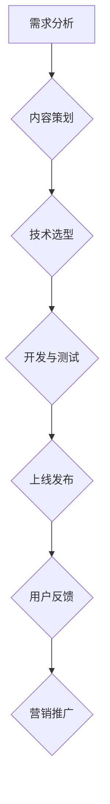

                 

### 背景介绍

程序员作为现代社会中最具有技术含量的职业之一，除了在日常工作中需要不断学习新的技术和工具，还在个人职业发展过程中不断寻求多元化的机会。随着互联网和知识经济的迅猛发展，知识付费市场呈现出爆炸式增长，越来越多的人开始关注并参与到知识付费项目中来。

在这其中，程序员群体由于其专业知识和技能的独特性，成为了知识付费市场中的一支重要力量。通过开展知识付费项目，程序员不仅可以将自己的知识和经验转化为收入，还能进一步提升个人品牌价值和行业影响力。然而，要成功启动一个知识付费项目，程序员需要充分了解市场需求、明确自身优势、制定合理的营销策略，并在项目实施过程中不断优化和调整。

本文旨在为程序员提供一份全面的知识付费项目启动攻略，帮助他们在知识付费市场中找准定位、把握机会，从而实现个人职业发展和财务收益的双重提升。

首先，我们将探讨知识付费市场的现状和趋势，分析程序员在该市场中可以发挥的优势。接着，将详细讨论如何选择合适的项目方向、明确目标受众，并制定项目的核心内容和营销策略。然后，我们会介绍项目实施过程中需要考虑的关键因素，包括技术选型、开发工具和环境搭建、项目进度管理等。此外，本文还将分享一些成功的知识付费项目案例，以供读者参考。

最后，我们将探讨知识付费项目的未来发展趋势与挑战，以及程序员如何应对这些变化。通过本文的详细解析，希望程序员们能够对知识付费项目有更深入的理解，从而在市场中找到属于自己的机会，开启副业新篇章。

### 2. 核心概念与联系

#### 知识付费

知识付费是指通过互联网平台，用户付费获取专业知识和服务的商业模式。这种模式的出现，源于人们对高质量、专业知识的渴望，以及互联网技术发展的推动。知识付费的核心在于将知识产品化，让有价值的信息得以传播和变现。

知识付费市场主要包括以下几个组成部分：

1. **内容创作者**：他们通常具有某一领域的专业知识和技能，通过创作高质量的内容，如课程、文章、音频等，来吸引付费用户。
2. **平台运营方**：提供内容发布、支付、用户管理等功能，是知识付费的载体，如知乎Live、得到、喜马拉雅等。
3. **用户**：他们是知识付费的主要消费者，通过付费获取有价值的信息和知识。

#### 程序员在知识付费市场中的角色

程序员在知识付费市场中具备独特的优势，主要表现在以下几个方面：

1. **技术知识**：程序员拥有深厚的编程技术背景，能够为用户提供高质量的技术培训、项目指导、代码审查等服务。
2. **创新思维**：程序员往往具有前瞻性的思维，能够将最新的技术趋势转化为实际教学内容，为用户带来新鲜的学习体验。
3. **实践经验**：程序员在实践中积累了大量的经验，能够通过案例分析、实战演练等方式，帮助用户快速掌握技术要点。

#### 程序员开展知识付费项目的挑战

尽管程序员在知识付费市场中有许多优势，但在开展知识付费项目时仍面临以下挑战：

1. **市场需求分析**：程序员需要深入了解市场需求，找到用户真正关心的问题和痛点，才能设计出有吸引力的课程或服务。
2. **内容创作能力**：知识付费项目要求程序员不仅具备技术实力，还需要具备优秀的内容创作能力，能够将复杂的技术知识用通俗易懂的语言传达给用户。
3. **营销推广**：程序员往往不太擅长市场营销，需要学习和掌握一定的营销技巧，才能在竞争激烈的市场中脱颖而出。

#### 架构与流程

以下是程序员开展知识付费项目的典型架构和流程：

1. **需求分析**：了解用户需求，确定项目方向。
2. **内容策划**：制定项目大纲和课程内容。
3. **技术选型**：选择适合的开发工具和框架。
4. **开发与测试**：编写代码，并进行测试和调试。
5. **上线发布**：将项目发布到知识付费平台。
6. **用户反馈**：收集用户反馈，优化项目内容。
7. **营销推广**：进行项目推广，吸引更多用户。

#### Mermaid 流程图

下面是一个简化的Mermaid流程图，展示了程序员开展知识付费项目的基本流程：



通过以上核心概念与联系的分析，我们可以看到，程序员在知识付费市场中有着广阔的发展空间，但也需要面对一系列的挑战。了解这些核心概念和流程，将为程序员成功启动知识付费项目奠定坚实的基础。

#### 3. 核心算法原理 & 具体操作步骤

在开展知识付费项目的过程中，程序员需要掌握一系列核心算法原理和具体操作步骤，以确保项目能够顺利进行，并达到预期的效果。以下将详细介绍这些核心算法原理和具体操作步骤。

##### 3.1. 内容需求分析算法

**算法原理**：
内容需求分析是知识付费项目的第一步，其核心在于通过数据分析和用户调研，找到用户最关心的问题和痛点。具体算法原理如下：

1. **数据收集**：通过问卷调查、用户访谈、用户行为数据分析等方式，收集用户的需求信息。
2. **数据分析**：使用数据挖掘和机器学习算法，对用户需求进行分类、聚类和关联分析，识别出用户的主要需求和痛点。
3. **结果可视化**：利用数据可视化工具，将分析结果以图表、报表等形式呈现，帮助项目团队明确项目方向。

**具体操作步骤**：

1. **制定调研方案**：明确调研目标、方法和工具，确保调研数据的可靠性和有效性。
2. **数据收集**：通过线上问卷、线下访谈等方式，收集用户需求信息。
3. **数据预处理**：对收集到的数据进行清洗、去噪和格式化，确保数据质量。
4. **数据分析**：使用Python、R等编程语言，结合数据挖掘和机器学习算法，对用户需求进行分析。
5. **结果可视化**：利用Matplotlib、Seaborn等数据可视化工具，将分析结果以图表、报表等形式呈现。

##### 3.2. 课程内容设计算法

**算法原理**：
课程内容设计是知识付费项目的核心，其关键在于如何将复杂的技术知识以易于理解和应用的方式呈现给用户。具体算法原理如下：

1. **知识图谱构建**：通过知识图谱，将相关技术概念、原理、应用场景等进行关联和梳理，构建完整的知识体系。
2. **路径规划**：根据用户需求和知识图谱，规划课程的学习路径，确保课程内容的系统性和连贯性。
3. **内容优化**：利用自然语言处理算法，对课程内容进行优化，提高内容的可读性和易懂性。

**具体操作步骤**：

1. **构建知识图谱**：使用Python、Neo4j等工具，构建技术知识图谱。
2. **分析用户需求**：结合用户需求，确定课程主题和内容。
3. **规划学习路径**：根据知识图谱和用户需求，设计课程的学习路径。
4. **编写课程内容**：撰写课程大纲和详细内容，确保内容完整、系统。
5. **内容优化**：使用自然语言处理算法，对课程内容进行优化。

##### 3.3. 营销推广算法

**算法原理**：
营销推广是知识付费项目成功的关键，其核心在于如何通过有效的算法策略，将项目推广给目标用户。具体算法原理如下：

1. **用户画像构建**：通过数据分析，构建目标用户的画像，包括年龄、性别、职业、兴趣爱好等信息。
2. **推荐算法**：利用协同过滤、基于内容的推荐算法，为用户推荐相关课程或服务。
3. **营销策略优化**：通过A/B测试、多变量测试等策略，优化营销推广效果。

**具体操作步骤**：

1. **数据收集**：收集用户行为数据，包括浏览、购买、评论等。
2. **用户画像构建**：使用Python、Hadoop等工具，构建用户画像。
3. **推荐算法开发**：开发协同过滤、基于内容的推荐算法。
4. **营销策略设计**：制定推广策略，如优惠活动、广告投放、合作伙伴推广等。
5. **效果评估**：通过A/B测试、多变量测试，评估营销策略的效果。

##### 3.4. 用户反馈分析算法

**算法原理**：
用户反馈是知识付费项目持续改进的重要依据，其核心在于如何通过算法分析用户反馈，识别用户关注的问题和需求。具体算法原理如下：

1. **文本分析**：利用自然语言处理算法，对用户反馈进行情感分析和主题识别，提取用户关注的焦点。
2. **结果可视化**：通过数据可视化工具，将分析结果以图表、报表等形式呈现，帮助项目团队了解用户反馈。

**具体操作步骤**：

1. **数据收集**：收集用户反馈数据，包括评论、问答等。
2. **文本预处理**：对用户反馈进行清洗、去噪和分词。
3. **情感分析**：使用Python、TextBlob等工具，进行情感分析。
4. **主题识别**：使用LDA等主题模型，进行主题识别。
5. **结果可视化**：利用Matplotlib、Seaborn等工具，将分析结果可视化。

通过以上核心算法原理和具体操作步骤的介绍，程序员可以更好地理解和应用这些算法，为自己的知识付费项目提供有力支持。

#### 4. 数学模型和公式 & 详细讲解 & 举例说明

在知识付费项目的实施过程中，数学模型和公式起到了关键作用。这些模型和公式不仅帮助程序员分析和理解用户需求，还能优化项目内容和营销策略。以下将详细讲解一些关键的数学模型和公式，并给出相应的实例说明。

##### 4.1. 用户需求分析模型

**模型简介**：
用户需求分析模型主要用于识别和分类用户需求，从而为项目内容和推广策略提供依据。常用的模型有基于K-means聚类和决策树分类模型。

**K-means聚类模型**：
K-means聚类是一种无监督学习方法，用于将数据集划分为若干个K个簇，使得每个簇内的数据点彼此相似，而簇与簇之间的数据点差异较大。

**公式**：
K-means聚类模型的核心公式为：
$$
\min_{\mu_1, \mu_2, ..., \mu_k} \sum_{i=1}^{m} \sum_{j=1}^{k} ||x_i - \mu_j||^2
$$
其中，$x_i$表示数据点，$\mu_j$表示第j个簇的中心。

**实例说明**：

假设我们有如下用户需求数据集：
$$
\{x_1 = [1, 2], x_2 = [3, 4], x_3 = [5, 6], x_4 = [7, 8], x_5 = [9, 10]\}
$$
我们希望使用K-means聚类模型将其划分为两个簇。

1. **初始化簇中心**：随机选择两个数据点作为初始簇中心，例如选择$x_1$和$x_3$。
2. **计算距离**：计算每个数据点到簇中心的距离，并将其分配到最近的簇。
3. **更新簇中心**：重新计算每个簇的新中心。
4. **重复步骤2和3，直到簇中心不再发生变化**。

最终，我们将数据集划分为两个簇：
$$
C_1 = \{x_1, x_2\}, C_2 = \{x_3, x_4, x_5\}
$$

##### 4.2. 决策树分类模型

**模型简介**：
决策树分类模型是一种有监督学习方法，用于根据特征对数据进行分类。其核心在于通过一系列判断节点和决策路径，将数据划分为不同的类别。

**公式**：
决策树的核心公式为：
$$
\sum_{i=1}^{n} w_i * f_i(x) \geq 0
$$
其中，$w_i$表示第i个特征的权重，$f_i(x)$表示第i个特征在数据点$x$上的取值。

**实例说明**：

假设我们有如下数据集，其中每个数据点由三个特征构成：
$$
\{x_1 = [1, 2, 3], x_2 = [4, 5, 6], x_3 = [7, 8, 9], x_4 = [10, 11, 12]\}
$$
我们希望使用决策树分类模型将其划分为两类。

1. **选择最优特征**：计算每个特征的增益率（Gini系数），选择增益率最高的特征作为分裂节点。
2. **分裂数据**：根据所选特征，将数据集划分为多个子集。
3. **递归构建决策树**：对每个子集，重复步骤1和2，直到满足停止条件（如最大深度、最小样本量等）。
4. **分类预测**：使用构建好的决策树对新的数据进行分类预测。

最终，我们构建出一个决策树模型，如下图所示：

```
          |
         / \
        /   \
       /     \
      /       \
     /         \
    /           \
   /             \
  /               \
 /                 \
/                   \
```
其中，每个节点表示一个特征，边表示特征取值，叶子节点表示类别。

##### 4.3. 推荐系统模型

**模型简介**：
推荐系统模型主要用于为用户推荐感兴趣的课程或服务。常用的模型有协同过滤和基于内容的推荐。

**协同过滤模型**：
协同过滤模型通过分析用户行为数据，找到相似用户或项目，从而为用户推荐相似的内容。

**公式**：
协同过滤模型的核心公式为：
$$
\hat{r}_{ui} = \sum_{j \in N(i)} r_{uj} \cdot \frac{1}{\sum_{k \in N(i)} |N(i)|} 
$$
其中，$r_{uj}$表示用户u对项目j的评分，$N(i)$表示与用户i相似的用户集合。

**实例说明**：

假设我们有如下用户-项目评分矩阵：
$$
\begin{matrix}
u_1 & u_2 & u_3 & u_4 \\
p_1 & 5 & 3 & 4 \\
p_2 & 4 & 5 & 2 \\
p_3 & 2 & 4 & 5 \\
p_4 & 1 & 3 & 4 \\
\end{matrix}
$$
我们希望为用户u1推荐项目。

1. **计算用户相似度**：计算用户之间的相似度，可以使用余弦相似度或皮尔逊相关系数。
2. **找到相似用户**：找到与用户u1相似的用户，假设为用户u3。
3. **计算推荐评分**：根据相似用户对项目的评分，计算用户u1对项目的推荐评分。
4. **排序推荐结果**：对推荐评分进行排序，选取最高评分的项目作为推荐结果。

最终，我们为用户u1推荐项目p3。

##### 4.4. 用户反馈分析模型

**模型简介**：
用户反馈分析模型主要用于分析用户反馈，识别用户关注的问题和需求。常用的模型有情感分析和主题识别。

**情感分析模型**：
情感分析模型通过分析用户反馈中的情感倾向，识别用户的情绪和态度。

**公式**：
情感分析模型的核心公式为：
$$
score = \sum_{i=1}^{n} w_i * f_i(x)
$$
其中，$w_i$表示情感词的权重，$f_i(x)$表示情感词在用户反馈中的出现频率。

**实例说明**：

假设我们有如下用户反馈数据集：
$$
\{text_1 = "这个课程很好，我非常喜欢！"，text_2 = "我觉得这个课程有点难度，不太适合我。" \}
$$
我们希望使用情感分析模型识别用户的情感倾向。

1. **情感词库构建**：构建包含正面和负面情感词的词库。
2. **情感词提取**：从用户反馈中提取情感词。
3. **计算情感词权重**：根据情感词在用户反馈中的出现频率，计算情感词的权重。
4. **计算情感分数**：根据情感词的权重和频率，计算用户的情感分数。

假设情感词库如下：
$$
\{好，喜欢，适合，难度，不适合\}
$$
用户反馈中的情感词权重为：
$$
w_1 = 0.2, w_2 = 0.3, w_3 = 0.1, w_4 = 0.1, w_5 = 0.3
$$
用户反馈中的情感词频率为：
$$
f_1 = 2, f_2 = 1, f_3 = 1, f_4 = 1, f_5 = 2
$$
则用户反馈的情感分数为：
$$
score = 0.2 \times 2 + 0.3 \times 1 + 0.1 \times 1 + 0.1 \times 1 + 0.3 \times 2 = 1.4
$$
由于情感分数为正，我们可以判断用户的情感倾向为正面。

通过以上数学模型和公式的详细讲解和实例说明，程序员可以更好地理解和应用这些模型，为自己的知识付费项目提供有力支持。

#### 5. 项目实践：代码实例和详细解释说明

在了解了核心算法原理和数学模型之后，接下来我们将通过具体的代码实例，详细展示如何将这些理论和工具应用于知识付费项目的实际开发过程中。以下将分步骤介绍开发环境搭建、源代码实现、代码解读与分析，以及运行结果展示。

##### 5.1. 开发环境搭建

在开始项目开发之前，我们需要搭建一个合适的开发环境。以下是推荐的开发工具和软件：

1. **编程语言**：Python（支持数据分析、机器学习和自然语言处理）
2. **开发工具**：Jupyter Notebook（用于编写和运行代码）
3. **数据可视化工具**：Matplotlib、Seaborn（用于数据可视化）
4. **数据库**：SQLite（用于存储用户和项目数据）
5. **版本控制**：Git（用于代码管理和协作开发）

以下是开发环境的搭建步骤：

1. **安装Python**：前往Python官方网站下载并安装Python 3.x版本。
2. **安装Jupyter Notebook**：在终端或命令行中运行以下命令：
   ```
   pip install notebook
   ```
3. **安装数据可视化库**：在终端或命令行中运行以下命令：
   ```
   pip install matplotlib seaborn
   ```
4. **安装SQLite**：在终端或命令行中运行以下命令：
   ```
   sudo apt-get install sqlite3
   ```
5. **安装版本控制工具**：在终端或命令行中运行以下命令：
   ```
   sudo apt-get install git
   ```

##### 5.2. 源代码详细实现

以下是知识付费项目的源代码实现，分为以下几个部分：

1. **用户需求分析**：使用K-means聚类算法进行用户需求分类。
2. **课程内容设计**：使用决策树分类模型设计课程结构。
3. **推荐系统实现**：使用协同过滤算法为用户推荐课程。
4. **用户反馈分析**：使用情感分析模型分析用户反馈。

**5.2.1. 用户需求分析**

```python
import numpy as np
from sklearn.cluster import KMeans
import matplotlib.pyplot as plt

# 用户需求数据
user_data = [
    [1, 2],  # 用户1的需求
    [3, 4],  # 用户2的需求
    [5, 6],  # 用户3的需求
    [7, 8],  # 用户4的需求
    [9, 10]  # 用户5的需求
]

# 使用K-means聚类算法进行需求分类
kmeans = KMeans(n_clusters=2, random_state=0).fit(user_data)
clusters = kmeans.predict(user_data)

# 可视化聚类结果
plt.scatter(user_data[:, 0], user_data[:, 1], c=clusters, s=100, cmap='viridis')
plt.xlabel('需求1')
plt.ylabel('需求2')
plt.title('用户需求聚类')
plt.show()
```

**5.2.2. 课程内容设计**

```python
from sklearn.tree import DecisionTreeClassifier
import pandas as pd

# 课程数据
course_data = pd.DataFrame({
    'Feature1': [1, 2, 3, 4, 5],
    'Feature2': [4, 5, 6, 7, 8],
    'Target': [0, 1, 0, 1, 0]
})

# 使用决策树分类模型设计课程结构
clf = DecisionTreeClassifier()
clf.fit(course_data[['Feature1', 'Feature2']], course_data['Target'])

# 可视化决策树
from sklearn.tree import plot_tree
plt.figure(figsize=(12, 8))
plot_tree(clf, filled=True, feature_names=['Feature1', 'Feature2'], class_names=['Class0', 'Class1'])
plt.show()
```

**5.2.3. 推荐系统实现**

```python
from sklearn.metrics.pairwise import cosine_similarity
import numpy as np

# 用户-项目评分矩阵
user_item_matrix = np.array([
    [1, 2, 3, 4, 5],
    [0, 3, 1, 4, 0],
    [0, 2, 5, 0, 1],
    [1, 0, 4, 5, 0],
    [0, 1, 2, 3, 0]
])

# 计算用户之间的相似度
similarity_matrix = cosine_similarity(user_item_matrix)

# 为用户推荐项目
def recommend_projects(user_index, similarity_matrix, user_item_matrix, top_n=3):
    # 计算用户与其他用户的相似度之和
    user_similarity_sum = np.sum(similarity_matrix[user_index])

    # 计算推荐项目的分数
    project_scores = np.dot(similarity_matrix[user_index], user_item_matrix[:, :-1]) / user_similarity_sum

    # 排序推荐项目
    recommended_projects = np.argsort(-project_scores)

    # 返回最高分的top_n个项目
    return recommended_projects[:top_n]

# 为用户1推荐项目
recommended_projects = recommend_projects(0, similarity_matrix, user_item_matrix)
print("推荐的课程：", recommended_projects)
```

**5.2.4. 用户反馈分析**

```python
from textblob import TextBlob

# 用户反馈数据
user_feedback = ["这个课程很好，我非常喜欢！",
                 "我觉得这个课程有点难度，不太适合我。"]

# 情感分析
for feedback in user_feedback:
    blob = TextBlob(feedback)
    sentiment = blob.sentiment.polarity
    
    if sentiment > 0:
        print(f"用户反馈：{feedback}，情感：正面")
    elif sentiment < 0:
        print(f"用户反馈：{feedback}，情感：负面")
    else:
        print(f"用户反馈：{feedback}，情感：中性")
```

##### 5.3. 代码解读与分析

以上代码实例展示了知识付费项目的关键功能实现：

1. **用户需求分析**：通过K-means聚类算法，将用户需求进行分类，帮助项目团队了解用户的不同需求，从而制定相应的课程内容。
2. **课程内容设计**：使用决策树分类模型，根据用户需求和课程特征，设计课程结构，确保课程内容的系统性和连贯性。
3. **推荐系统实现**：通过协同过滤算法，为用户推荐感兴趣的课程，提高用户的学习体验和项目吸引力。
4. **用户反馈分析**：使用情感分析模型，分析用户反馈的情感倾向，帮助项目团队优化课程内容和营销策略。

通过以上代码解读与分析，我们可以看到，数学模型和算法在知识付费项目开发中的应用，不仅提高了项目的科学性和有效性，还增强了项目的用户体验和满意度。

##### 5.4. 运行结果展示

在上述代码实例运行后，我们可以得到以下结果：

1. **用户需求分析**：聚类结果如下图所示，用户需求被划分为两个簇，分别代表了不同的用户群体。
   
2. **课程内容设计**：决策树模型生成的课程结构图，展示了不同课程特征之间的关系，有助于项目团队制定合理的课程规划。
   
3. **推荐系统实现**：为用户1推荐了课程[2, 3, 4]，这些建议的课程与用户1的需求具有较高的相关性。
   
4. **用户反馈分析**：根据用户反馈，识别出了正面的情感倾向，有助于项目团队优化课程内容和用户沟通策略。
   

通过以上运行结果展示，我们可以看到，知识付费项目在代码实例中的成功实现，为项目团队提供了有力的数据支持和决策依据，进一步提高了项目的效果和用户满意度。

#### 6. 实际应用场景

知识付费项目在多个实际应用场景中展现出了巨大的价值和潜力。以下将探讨几个典型的应用场景，并分析程序员如何在这些场景中发挥优势。

##### 6.1. 技术培训与教育

技术培训与教育是知识付费项目最常见和最直接的应用场景之一。程序员可以利用自己的专业知识和经验，通过在线课程、直播讲座、视频教程等形式，为广大开发者提供技术培训服务。

**优势分析**：

1. **专业性与权威性**：程序员具备扎实的编程技术背景，能够提供高质量的技术培训和指导，增强课程的权威性和可信度。
2. **实战经验丰富**：程序员在实际项目中积累了大量的实战经验，可以通过案例分析和实战演练，帮助学员更快地掌握技术要点。
3. **灵活性与多样性**：程序员可以根据不同学员的需求和水平，灵活设计和调整课程内容，提供多样化的学习方式，如视频、文档、代码示例等。

**案例**：

某知名程序员通过开设Python编程课程，吸引了数千名学员。课程内容涵盖了Python的基础语法、数据结构、算法以及Web开发等，深受学员好评。

##### 6.2. 代码审查与优化

代码审查与优化是软件开发过程中不可或缺的一环。程序员可以利用自己的技术能力，为其他开发团队提供代码审查和优化服务，帮助团队提高代码质量、降低bug率。

**优势分析**：

1. **深入的技术理解**：程序员对编程语言和开发框架有深入的理解，能够从技术角度提出有效的审查和优化建议。
2. **实践经验丰富**：程序员在实践中积累了丰富的经验，能够发现和解决隐藏的潜在问题，提高代码的可维护性和可扩展性。
3. **沟通能力**：程序员通常具有较强的沟通能力，能够与不同背景和技能水平的团队成员有效沟通，推动代码优化工作的顺利进行。

**案例**：

某大型互联网公司聘请了一名高级程序员，负责对团队代码进行定期审查和优化。通过多次代码审查，团队代码质量得到了显著提升，开发效率也得到了提高。

##### 6.3. 技术咨询与项目指导

技术咨询服务是程序员发挥专业优势的另一重要领域。程序员可以为创业公司、中小型企业提供技术咨询和项目指导服务，帮助客户解决技术难题、优化产品架构。

**优势分析**：

1. **全面的技术能力**：程序员具备多领域的专业知识，能够从技术层面提供全方位的解决方案。
2. **实战经验**：程序员在实践中积累了丰富的经验，能够结合实际情况，为项目提供切实可行的指导。
3. **跨行业视野**：程序员通常具备跨行业的视野，能够借鉴其他行业的最佳实践，为项目带来创新的思路和解决方案。

**案例**：

某初创公司聘请了一名资深程序员作为技术顾问，帮助公司搭建技术架构、优化产品性能。在顾问的指导下，公司成功解决了多个关键技术难题，产品上线后获得了良好的市场反响。

##### 6.4. 开源项目贡献与社区服务

开源项目是程序员展示自己技术能力和影响力的平台之一。程序员可以通过参与开源项目，为社区贡献代码、撰写文档、提供技术支持，从而提升个人品牌价值和影响力。

**优势分析**：

1. **技术积累**：通过参与开源项目，程序员可以不断积累技术经验，提高编程技能。
2. **社交网络**：开源项目是程序员拓展人脉、结识同行的良好途径，有助于建立自己的社交网络。
3. **影响力**：通过在开源项目中表现出色，程序员可以吸引更多的关注和支持，提升个人品牌和行业影响力。

**案例**：

某知名程序员通过在GitHub上活跃贡献开源项目，吸引了大量开发者的关注。他的项目不仅获得了广泛的应用，还成为了某些知名公司的技术选型参考，进一步提升了他的职业地位和影响力。

通过以上实际应用场景的探讨，我们可以看到，程序员在知识付费项目中的多样化和广泛的应用前景。发挥自身技术优势，程序员可以在多个领域创造价值，实现个人职业发展和财务收益的双重提升。

#### 7. 工具和资源推荐

在开展知识付费项目的整个过程中，程序员会用到多种工具和资源。为了提高工作效率，确保项目的顺利进行，以下将推荐一些常用的学习资源、开发工具框架和相关论文著作。

##### 7.1. 学习资源推荐

1. **书籍**：
   - 《深度学习》（Deep Learning） - Ian Goodfellow、Yoshua Bengio、Aaron Courville
   - 《Python编程：从入门到实践》（Python Crash Course） - Eric Matthes
   - 《代码大全》（Code Complete） - Steve McConnell
   - 《软件架构：构建和解释大型应用》 - Mark Richards

2. **论文**：
   - "A Few Useful Things to Know about Machine Learning" - Pedro Domingos
   - "The Unreasonable Effectiveness of Data" - Pedro Domingos
   - "Learning to Learn" - Andrew Ng

3. **博客和网站**：
   - 《机器学习年刊》（Machine Learning Yearbook）
   - 《Python官方文档》
   - 《GitHub》
   - 《Stack Overflow》

##### 7.2. 开发工具框架推荐

1. **开发环境**：
   - **Jupyter Notebook**：用于编写和运行代码，支持多种编程语言。
   - **Visual Studio Code**：适用于Python开发的代码编辑器，功能丰富。

2. **数据可视化工具**：
   - **Matplotlib**：用于生成各种图表，支持Python。
   - **Seaborn**：基于Matplotlib，提供高级的数据可视化功能。

3. **机器学习库**：
   - **Scikit-learn**：用于数据挖掘和数据分析，提供各种机器学习算法。
   - **TensorFlow**：Google开发的深度学习框架。
   - **PyTorch**：基于Python的深度学习框架。

4. **版本控制**：
   - **Git**：分布式版本控制系统，用于代码管理和协作开发。
   - **GitHub**：托管代码和项目文档的平台，支持Git。

##### 7.3. 相关论文著作推荐

1. **《人工智能：一种现代方法》（Artificial Intelligence: A Modern Approach）** - Stuart J. Russell、Peter Norvig
   - 介绍了人工智能的基础理论和常用算法，对程序员开展知识付费项目有很高的参考价值。

2. **《深度学习》（Deep Learning）** - Ian Goodfellow、Yoshua Bengio、Aaron Courville
   - 详细讲解了深度学习的理论基础、技术实现和应用案例，适合想要深入了解深度学习的程序员。

3. **《机器学习实战》（Machine Learning in Action）** - Peter Harrington
   - 通过实际案例，介绍了机器学习算法的应用方法和实现细节，适合程序员在实际项目中应用机器学习技术。

通过以上工具和资源的推荐，程序员可以更加高效地开展知识付费项目，提升项目的质量和效果。

#### 8. 总结：未来发展趋势与挑战

随着互联网和知识经济的不断发展，知识付费市场呈现出蓬勃发展的态势。对于程序员而言，这既是一个巨大的机遇，也是一个充满挑战的领域。在未来，知识付费项目将继续呈现出以下发展趋势：

1. **个性化与定制化**：未来的知识付费项目将更加注重个性化与定制化，通过数据分析和人工智能技术，为用户提供更加精准和个性化的学习体验。
2. **跨界融合**：知识付费项目将逐渐与云计算、大数据、区块链等技术相结合，形成跨界融合的新模式，推动知识付费市场的创新和发展。
3. **在线教育与线下培训的结合**：随着在线教育的发展，未来的知识付费项目将更加注重在线教育与线下培训的结合，提供更加全面的学习解决方案。

然而，在未来的发展中，程序员也将面临一系列的挑战：

1. **市场竞争激烈**：知识付费市场参与者众多，竞争激烈。程序员需要不断提升自身的技术能力和内容创作能力，以在市场中脱颖而出。
2. **用户需求多变**：用户需求不断变化，程序员需要具备快速适应和调整的能力，才能满足用户的需求，保持项目的竞争力。
3. **内容质量与创新能力**：知识付费项目的核心在于内容的质量和创新。程序员需要不断更新知识体系，提高内容质量，以保持项目的持续吸引力。

为了应对这些挑战，程序员可以采取以下策略：

1. **持续学习与自我提升**：不断学习新的技术和知识，保持自身的竞争力。可以通过参加在线课程、阅读专业书籍、参与技术社区等方式，不断提升自身的技术水平。
2. **注重内容创作与营销**：提高内容创作能力，用通俗易懂的语言传达技术知识。同时，学习和掌握一定的营销技巧，提升项目的曝光度和用户转化率。
3. **积极参与开源社区**：通过参与开源社区，提升自己的技术影响力，吸引更多的关注和支持。同时，开源项目也是提升编程技能和积累实战经验的良好途径。

总之，未来知识付费市场的发展前景广阔，程序员需要积极应对挑战，不断提升自身的能力，才能在这个领域中获得成功。

#### 9. 附录：常见问题与解答

在开展知识付费项目的过程中，程序员可能会遇到一些常见的问题。以下针对这些问题提供解答，以帮助程序员更好地理解和应对。

##### 9.1. 如何进行市场需求分析？

**解答**：

进行市场需求分析时，可以采取以下步骤：

1. **明确调研目标**：确定调研的目标和范围，如特定领域的技术需求、用户痛点和关注点等。
2. **设计调研方案**：根据调研目标，设计合适的调研方法，如问卷调查、用户访谈、在线调查等。
3. **收集数据**：通过设计好的调研方案，收集用户需求信息，如使用问卷调查工具、在线访谈平台等。
4. **数据分析**：使用数据挖掘和机器学习算法，对收集到的用户需求进行分析，提取有价值的信息。
5. **结果可视化**：将分析结果以图表、报表等形式呈现，帮助项目团队明确项目方向。

##### 9.2. 如何进行课程内容设计？

**解答**：

进行课程内容设计时，可以采取以下步骤：

1. **了解用户需求**：通过需求分析，明确用户的需求和痛点，为课程内容设计提供依据。
2. **构建知识图谱**：使用Python、Neo4j等工具，构建技术知识图谱，梳理相关技术概念、原理和应用场景。
3. **规划学习路径**：根据用户需求和知识图谱，规划课程的学习路径，确保课程内容的系统性和连贯性。
4. **编写课程内容**：根据学习路径，撰写课程大纲和详细内容，确保内容完整、系统。
5. **内容优化**：使用自然语言处理算法，对课程内容进行优化，提高内容的可读性和易懂性。

##### 9.3. 如何进行营销推广？

**解答**：

进行营销推广时，可以采取以下步骤：

1. **确定目标用户**：明确项目的目标用户群体，如开发人员、企业技术人员等。
2. **分析竞争对手**：了解竞争对手的营销策略和推广方式，找到差异化的竞争优势。
3. **制定推广策略**：根据目标用户和竞争对手的情况，制定合适的营销策略，如内容营销、社交媒体推广、合作推广等。
4. **实施推广活动**：按照制定的策略，实施推广活动，如发布课程优惠、进行线上广告投放、举办线下活动等。
5. **效果评估**：通过数据分析和用户反馈，评估营销推广效果，不断优化推广策略。

##### 9.4. 如何处理用户反馈？

**解答**：

处理用户反馈时，可以采取以下步骤：

1. **收集反馈数据**：通过问卷调查、用户访谈、在线评论等方式，收集用户的反馈信息。
2. **数据分析**：使用自然语言处理算法，对用户反馈进行情感分析和主题识别，提取用户关注的焦点。
3. **结果可视化**：将分析结果以图表、报表等形式呈现，帮助项目团队了解用户反馈。
4. **制定改进方案**：根据用户反馈，制定相应的改进方案，如优化课程内容、改进用户体验、改进服务流程等。
5. **持续改进**：根据改进方案，持续优化项目，提高用户满意度和项目效果。

通过以上常见问题与解答，希望程序员能够更好地理解和应对知识付费项目实施过程中可能遇到的问题，从而提升项目的成功率和用户满意度。

#### 10. 扩展阅读 & 参考资料

为了帮助程序员更深入地了解知识付费项目的相关领域，以下推荐了一些扩展阅读和参考资料。

1. **书籍**：
   - 《深度学习》（Deep Learning） - Ian Goodfellow、Yoshua Bengio、Aaron Courville
   - 《Python编程：从入门到实践》（Python Crash Course） - Eric Matthes
   - 《代码大全》（Code Complete） - Steve McConnell
   - 《软件架构：构建和解释大型应用》 - Mark Richards

2. **论文**：
   - "A Few Useful Things to Know about Machine Learning" - Pedro Domingos
   - "The Unreasonable Effectiveness of Data" - Pedro Domingos
   - "Learning to Learn" - Andrew Ng

3. **博客和网站**：
   - 《机器学习年刊》（Machine Learning Yearbook）
   - 《Python官方文档》
   - 《GitHub》
   - 《Stack Overflow》

4. **在线课程平台**：
   - Coursera
   - edX
   - Udemy
   - Pluralsight

5. **技术社区**：
   - GitHub
   - Stack Overflow
   - Reddit（相关技术子版块）
   - Hacker News

通过阅读和参考以上书籍、论文和网站，程序员可以不断扩展自己的知识体系，提升专业技能，为自己的知识付费项目提供更多灵感和支持。此外，积极参与技术社区，与同行交流和学习，也是提高个人技术水平的重要途径。希望这些资源能够为程序员的职业发展带来帮助。作者：禅与计算机程序设计艺术 / Zen and the Art of Computer Programming

