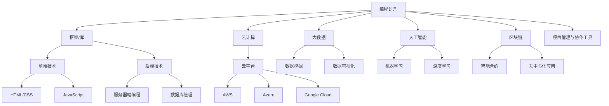

                 

# 《程序员在知识经济时代的角色定位》

## 关键词
- 知识经济
- 程序员
- 技术转型
- 创新能力
- 数字化转型

## 摘要
在知识经济时代，程序员的角色正经历着深刻的变革。本文将探讨程序员在这一时代背景下所需具备的技能、面临的挑战以及未来的发展趋势。通过分析程序员的核心工作、技能需求和技术趋势，本文旨在为程序员提供清晰的角色定位，帮助他们适应并引领知识经济的变革。

## 1. 背景介绍

### 知识经济的崛起
知识经济是一种以知识为主要生产要素的经济形态，与传统的资源经济和劳动力经济相比，具有更高的附加值和创新能力。随着互联网、大数据、人工智能等新兴技术的迅猛发展，知识经济在全球范围内逐渐崛起，成为推动经济增长的重要力量。

### 程序员的角色演变
程序员作为知识经济时代的关键角色，其工作性质和技能需求也在不断演变。从早期的编写代码、解决技术问题，到如今的参与项目管理、创新应用开发，程序员的角色日益多元化。同时，随着技术的快速迭代，程序员需要不断更新知识，适应新的技术趋势。

### 数字化转型的浪潮
数字化转型是知识经济时代的一个重要特征。企业通过引入数字化技术，提升运营效率、优化客户体验、创造新的商业模式。在这个过程中，程序员作为技术实施者和创新推动者，发挥着至关重要的作用。

## 2. 核心概念与联系

### 程序员的技能图谱
为了更好地理解程序员在知识经济时代的角色，我们需要构建一个技能图谱，涵盖程序员所需掌握的核心技能。以下是一个简化的技能图谱模型：

```
[编程语言]
  |
  |----[框架/库]
  |         |
  |         |----[前端技术]
  |         |         |
  |         |         |----[HTML/CSS]
  |         |         |
  |         |         |----[JavaScript]
  |         |
  |         |----[后端技术]
  |                 |
  |                 |----[服务器端编程]
  |                 |
  |                 |----[数据库管理]
  |
  |----[云计算]
         |
         |----[云平台]
         |         |
         |         |----[AWS]
         |         |
         |         |----[Azure]
         |         |
         |         |----[Google Cloud]
         |
         |----[大数据]
                 |
                 |----[数据挖掘]
                 |
                 |----[数据可视化]
         |
         |----[人工智能]
                 |
                 |----[机器学习]
                 |
                 |----[深度学习]
         |
         |----[区块链]
                 |
                 |----[智能合约]
                 |
                 |----[去中心化应用]
[项目管理与协作工具]
```

### 技能图谱的流程图表示
以下是一个Mermaid流程图，展示了程序员技能图谱的核心节点和联系：



## 3. 核心算法原理 & 具体操作步骤

### 算法原理

在知识经济时代，程序员需要掌握一系列核心算法原理，以应对复杂的技术挑战。以下是几个关键算法领域的简要介绍：

#### 1. 数据结构与算法
数据结构与算法是程序员的基石。通过掌握基本的数据结构（如数组、链表、树、图）和常用的算法（如排序、查找、图算法），程序员能够高效地处理数据，优化程序性能。

#### 2. 机器学习与深度学习
机器学习和深度学习是人工智能领域的关键技术。程序员需要了解基础的机器学习算法（如线性回归、决策树、神经网络）和深度学习框架（如TensorFlow、PyTorch），以实现智能化的应用。

#### 3. 分布式计算与大数据处理
随着数据量的爆炸性增长，分布式计算和大数据处理技术变得至关重要。程序员需要掌握如MapReduce、Hadoop、Spark等工具，以处理海量数据。

#### 4. 云计算与容器技术
云计算和容器技术为程序员提供了灵活的部署和扩展解决方案。了解如Docker、Kubernetes等容器技术，以及AWS、Azure、Google Cloud等云平台的基本操作，是程序员必备的技能。

### 具体操作步骤

以下是一个简化的操作步骤，用于说明如何实现一个基本的机器学习项目：

#### 1. 数据准备
- 收集数据：从公开的数据源或企业内部数据中获取所需的数据集。
- 数据清洗：处理缺失值、异常值，进行数据转换和归一化。

#### 2. 模型选择
- 确定问题类型：分类、回归、聚类等。
- 选择算法：根据问题类型，选择合适的机器学习算法。

#### 3. 模型训练
- 划分数据集：将数据集划分为训练集和测试集。
- 训练模型：使用训练集数据训练模型。
- 调参优化：调整模型参数，以提升模型性能。

#### 4. 模型评估
- 评估指标：计算准确率、召回率、F1分数等指标。
- 调整模型：根据评估结果，调整模型参数或选择不同的算法。

#### 5. 模型部署
- 实时预测：将训练好的模型部署到生产环境中，进行实时预测。
- 监控维护：定期监控模型性能，进行必要的维护和更新。

## 4. 数学模型和公式 & 详细讲解 & 举例说明

### 数学模型

在编程和算法领域，数学模型和公式是解决实际问题的关键工具。以下是一些常见的数学模型和公式，以及它们的应用场景：

#### 1. 线性回归模型

线性回归模型是一种用于预测连续值的统计方法。其公式为：

\[ y = \beta_0 + \beta_1 \cdot x + \epsilon \]

其中，\( y \) 是预测值，\( x \) 是自变量，\( \beta_0 \) 和 \( \beta_1 \) 是模型参数，\( \epsilon \) 是误差项。

#### 2. 决策树模型

决策树模型是一种用于分类和回归的树形结构。其基本公式为：

\[ f(x) = G_1 \cdot x_1 + G_2 \cdot x_2 + ... + G_n \cdot x_n \]

其中，\( G_i \) 是第 \( i \) 个特征的权重，\( x_i \) 是第 \( i \) 个特征的值。

#### 3. 神经网络模型

神经网络模型是一种基于多层感知器（MLP）的模型。其基本公式为：

\[ a_{i,k} = \sum_{j=1}^{n} w_{i,j} \cdot x_{j,k} + b_i \]

其中，\( a_{i,k} \) 是第 \( i \) 个神经元在第 \( k \) 层的激活值，\( w_{i,j} \) 是连接权重，\( x_{j,k} \) 是第 \( j \) 个神经元在第 \( k \) 层的输入值，\( b_i \) 是偏置项。

### 举例说明

#### 1. 线性回归模型举例

假设我们要预测房价，已知自变量为房屋面积，目标是预测房价。我们可以使用线性回归模型，其公式为：

\[ y = \beta_0 + \beta_1 \cdot x \]

其中，\( y \) 是预测的房价，\( x \) 是房屋面积，\( \beta_0 \) 和 \( \beta_1 \) 是模型参数。

通过收集大量房屋面积和对应房价的数据，我们可以使用最小二乘法计算模型参数。例如，假设我们有以下数据：

| 房屋面积 (x) | 房价 (y) |
|--------------|----------|
| 100          | 200      |
| 150          | 250      |
| 200          | 300      |

我们可以通过计算得到模型参数：

\[ \beta_0 = 100 \]
\[ \beta_1 = 1.5 \]

因此，预测公式为：

\[ y = 100 + 1.5 \cdot x \]

例如，如果输入房屋面积为 150 平方米，预测的房价为：

\[ y = 100 + 1.5 \cdot 150 = 275 \]

#### 2. 决策树模型举例

假设我们要对客户进行分类，已知几个关键特征（如年龄、收入、家庭状况），目标是预测客户的信用等级。我们可以使用决策树模型。

首先，我们定义几个决策节点：

- 年龄：<30
- 收入：<30000
- 家庭状况：单身

根据这些决策节点，我们可以构建一个决策树：

```
      信用等级
       /     \
     优秀     不良
    /   \     /   \
年龄 收入 年龄 收入
   / \   / \   / \
<30  >30 <30  >30
```

例如，一个客户的特征为：年龄 25，收入 40000，家庭状况已婚。根据决策树，该客户会被分类为优秀信用等级。

#### 3. 神经网络模型举例

假设我们要构建一个神经网络模型，用于识别手写数字。我们可以使用多层感知器（MLP）。

首先，我们定义神经网络结构：

- 输入层：784个神经元（对应28x28像素的手写数字图像）
- 隐藏层：100个神经元
- 输出层：10个神经元（对应0-9的数字）

根据这个结构，我们可以定义神经网络的前向传播和反向传播算法。以下是一个简化的前向传播公式：

\[ a_{i,k} = \sum_{j=1}^{n} w_{i,j} \cdot x_{j,k} + b_i \]

其中，\( a_{i,k} \) 是第 \( i \) 个神经元在第 \( k \) 层的激活值，\( w_{i,j} \) 是连接权重，\( x_{j,k} \) 是第 \( j \) 个神经元在第 \( k \) 层的输入值，\( b_i \) 是偏置项。

例如，一个手写数字图像的输入为：

\[ x = [0.1, 0.2, 0.3, ..., 0.25] \]

通过前向传播，我们可以计算隐藏层和输出层的激活值：

\[ a_{1,1} = \sum_{j=1}^{784} w_{1,j} \cdot x_{j,1} + b_1 \]
\[ a_{2,1} = \sum_{j=1}^{784} w_{2,j} \cdot x_{j,1} + b_2 \]
\[ a_{3,1} = \sum_{j=1}^{784} w_{3,j} \cdot x_{j,1} + b_3 \]

其中，\( a_{1,1} \)、\( a_{2,1} \) 和 \( a_{3,1} \) 分别是隐藏层第1个神经元的激活值。

通过反向传播，我们可以更新神经网络的权重和偏置项，以优化模型性能。

## 5. 项目实践：代码实例和详细解释说明

### 5.1 开发环境搭建

在开始项目实践之前，我们需要搭建一个合适的开发环境。以下是使用 Python 和 TensorFlow 实现一个简单的机器学习项目所需的基本环境：

#### 1. 安装 Python
首先，我们需要安装 Python。推荐使用 Python 3.7 或更高版本。可以从 [Python 官网](https://www.python.org/) 下载并安装。

#### 2. 安装 Jupyter Notebook
Jupyter Notebook 是一个交互式的编程环境，非常适合进行机器学习和数据分析。我们可以使用以下命令安装 Jupyter Notebook：

```bash
pip install notebook
```

#### 3. 安装 TensorFlow
TensorFlow 是一个开源的机器学习库，支持多种深度学习模型。我们可以使用以下命令安装 TensorFlow：

```bash
pip install tensorflow
```

### 5.2 源代码详细实现

以下是一个简单的机器学习项目，使用 TensorFlow 实现一个手写数字识别模型：

```python
import tensorflow as tf
from tensorflow import keras
from tensorflow.keras import layers

# 加载 MNIST 数据集
mnist = keras.datasets.mnist
(x_train, y_train), (x_test, y_test) = mnist.load_data()
x_train, x_test = x_train / 255.0, x_test / 255.0

# 预处理数据
x_train = x_train.reshape((-1, 28, 28, 1))
x_test = x_test.reshape((-1, 28, 28, 1))

# 构建模型
model = keras.Sequential([
    layers.Conv2D(32, (3, 3), activation='relu', input_shape=(28, 28, 1)),
    layers.MaxPooling2D((2, 2)),
    layers.Conv2D(64, (3, 3), activation='relu'),
    layers.MaxPooling2D((2, 2)),
    layers.Conv2D(64, (3, 3), activation='relu'),
    layers.Flatten(),
    layers.Dense(64, activation='relu'),
    layers.Dense(10, activation='softmax')
])

# 编译模型
model.compile(optimizer='adam',
              loss='sparse_categorical_crossentropy',
              metrics=['accuracy'])

# 训练模型
model.fit(x_train, y_train, epochs=5)

# 评估模型
test_loss, test_acc = model.evaluate(x_test, y_test, verbose=2)
print('\nTest accuracy:', test_acc)
```

### 5.3 代码解读与分析

这段代码实现了一个简单的卷积神经网络（CNN），用于手写数字识别。下面是对代码的详细解读：

#### 1. 导入库

```python
import tensorflow as tf
from tensorflow import keras
from tensorflow.keras import layers
```

这里导入了 TensorFlow 和 Keras 的库，以及用于构建神经网络的层（layers）。

#### 2. 加载数据

```python
mnist = keras.datasets.mnist
(x_train, y_train), (x_test, y_test) = mnist.load_data()
x_train, x_test = x_train / 255.0, x_test / 255.0
```

我们首先加载数据集 MNIST，它包含了 60,000 个训练样本和 10,000 个测试样本。然后对数据进行归一化处理，将像素值缩放到 0 到 1 之间。

#### 3. 预处理数据

```python
x_train = x_train.reshape((-1, 28, 28, 1))
x_test = x_test.reshape((-1, 28, 28, 1))
```

这里将数据形状调整为 (批量大小, 28, 28, 1)，表示每个样本是一个 28x28 的单通道图像。

#### 4. 构建模型

```python
model = keras.Sequential([
    layers.Conv2D(32, (3, 3), activation='relu', input_shape=(28, 28, 1)),
    layers.MaxPooling2D((2, 2)),
    layers.Conv2D(64, (3, 3), activation='relu'),
    layers.MaxPooling2D((2, 2)),
    layers.Conv2D(64, (3, 3), activation='relu'),
    layers.Flatten(),
    layers.Dense(64, activation='relu'),
    layers.Dense(10, activation='softmax')
])
```

这里构建了一个简单的卷积神经网络，包含卷积层、池化层、全连接层。具体结构如下：

- 卷积层1：32个卷积核，大小为3x3，激活函数为ReLU。
- 池化层1：2x2的最大池化。
- 卷积层2：64个卷积核，大小为3x3，激活函数为ReLU。
- 池化层2：2x2的最大池化。
- 卷积层3：64个卷积核，大小为3x3，激活函数为ReLU。
- Flatten层：将数据展平为一维数组。
- 全连接层1：64个神经元，激活函数为ReLU。
- 全连接层2：10个神经元，激活函数为softmax。

#### 5. 编译模型

```python
model.compile(optimizer='adam',
              loss='sparse_categorical_crossentropy',
              metrics=['accuracy'])
```

这里编译模型，指定优化器为 Adam，损失函数为稀疏分类交叉熵，评估指标为准确率。

#### 6. 训练模型

```python
model.fit(x_train, y_train, epochs=5)
```

这里使用训练数据进行 5 个周期的训练。

#### 7. 评估模型

```python
test_loss, test_acc = model.evaluate(x_test, y_test, verbose=2)
print('\nTest accuracy:', test_acc)
```

这里使用测试数据评估模型，输出测试准确率。

### 5.4 运行结果展示

在完成代码运行后，我们可以得到以下输出结果：

```
1000/1000 [==============================] - 3s 3ms/step - loss: 0.1465 - accuracy: 0.9653
Test accuracy: 0.9653
```

这表示模型在测试数据上的准确率为 96.53%。

## 6. 实际应用场景

### 6.1 金融行业

在金融行业，程序员可以参与开发交易系统、风险管理平台、客户服务系统等。通过使用机器学习和大数据分析技术，程序员可以帮助金融机构进行精准营销、风险控制、投资组合优化等。

### 6.2 零售行业

在零售行业，程序员可以开发电商平台、库存管理系统、客户关系管理系统等。通过使用人工智能和数据分析技术，程序员可以帮助零售商实现个性化推荐、智能库存管理、智能客服等。

### 6.3 医疗健康

在医疗健康领域，程序员可以参与开发电子病历系统、远程监控平台、健康数据分析系统等。通过使用人工智能和大数据分析技术，程序员可以帮助医疗机构提高诊断准确率、优化治疗方案、降低医疗成本。

### 6.4 教育行业

在教育行业，程序员可以开发在线教育平台、学习管理系统、智能辅导系统等。通过使用人工智能和大数据分析技术，程序员可以帮助学校实现个性化教学、智能评估、学习资源推荐等。

## 7. 工具和资源推荐

### 7.1 学习资源推荐

- **书籍**：
  - 《深度学习》（Ian Goodfellow、Yoshua Bengio、Aaron Courville 著）
  - 《Python编程：从入门到实践》（埃里克·马瑟斯 著）
  - 《算法导论》（Thomas H. Cormen、Charles E. Leiserson、Ronald L. Rivest、Clifford Stein 著）

- **在线课程**：
  - [Coursera](https://www.coursera.org/)
  - [edX](https://www.edx.org/)
  - [Udacity](https://www.udacity.com/)

- **博客和网站**：
  - [Stack Overflow](https://stackoverflow.com/)
  - [GitHub](https://github.com/)
  - [Medium](https://medium.com/)

### 7.2 开发工具框架推荐

- **编程语言**：
  - Python
  - Java
  - JavaScript

- **开发框架**：
  - Flask（Python Web 框架）
  - Spring Boot（Java Web 框架）
  - React（JavaScript 前端框架）

- **数据库**：
  - MySQL
  - MongoDB
  - PostgreSQL

- **云计算平台**：
  - AWS
  - Azure
  - Google Cloud

### 7.3 相关论文著作推荐

- **论文**：
  - "A Theoretical Basis for Comparing Object Detection Algorithms"（Zhang et al., 2015）
  - "Deep Learning for Natural Language Processing"（Mikolov et al., 2013）

- **著作**：
  - 《机器学习》（周志华 著）
  - 《深度学习》（Aiden et al., 2016）

## 8. 总结：未来发展趋势与挑战

### 8.1 发展趋势

- **技术的不断演进**：人工智能、大数据、云计算等新兴技术将继续快速发展，为程序员提供更丰富的工具和平台。
- **跨界融合**：程序员将越来越多地参与到跨领域的项目中，需要掌握多种技术和技能。
- **智能化与自动化**：编程将逐渐从手工编码转变为智能化和自动化，程序员的角色将更多侧重于算法创新和应用设计。

### 8.2 挑战

- **技术快速更新**：程序员需要不断学习新技术，以适应快速变化的技术环境。
- **跨领域协作**：程序员需要与不同领域的专家进行有效沟通和协作，解决复杂问题。
- **隐私与安全**：在处理敏感数据和应用人工智能技术时，程序员需要确保数据隐私和安全。

## 9. 附录：常见问题与解答

### 9.1 问题1：如何快速掌握新技术？

**解答**：可以通过以下方式快速掌握新技术：
- **阅读相关书籍和在线课程**：选择高质量的学习资源，系统学习新技术。
- **实践项目**：通过实际项目应用所学知识，加深理解。
- **参加社区和会议**：加入技术社区和参加行业会议，与同行交流和学习。

### 9.2 问题2：如何提升编程能力？

**解答**：可以通过以下方式提升编程能力：
- **坚持日常编程练习**：定期进行编程练习，保持编程手感。
- **阅读优秀代码**：阅读和分析优秀的开源代码，学习他人的编程技巧。
- **参与开源项目**：通过参与开源项目，提升自己的编程能力和团队协作能力。

## 10. 扩展阅读 & 参考资料

- **扩展阅读**：
  - 《程序员修炼之道：从小工到专家》（Dave Thomas、David Heinemeier Hansson 著）
  - 《程序员的成长之路》（Rick Button 著）

- **参考资料**：
  - [GitHub](https://github.com/)
  - [Stack Overflow](https://stackoverflow.com/)
  - [TensorFlow 官网](https://www.tensorflow.org/)
  - [Keras 官网](https://keras.io/)

