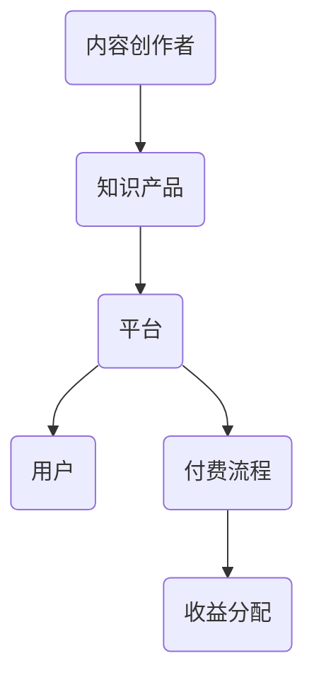

                 

### 文章标题：程序员如何利用知识付费实现财富自由

> **关键词：** 程序员、知识付费、财富自由、学习投资、在线教育、个人品牌、IP运营、社群营销

> **摘要：** 本文将探讨程序员如何通过知识付费这一途径实现财富自由。我们将分析知识付费的原理、成功案例，提供具体的操作步骤和策略，并推荐相关工具和资源，帮助程序员打造个人品牌，实现财富增值。

---

### 1. 背景介绍

在信息爆炸的时代，知识的价值日益凸显。程序员作为IT行业的主要驱动力，不仅需要不断更新技术技能，还需要学会将自身知识转化为商业价值。知识付费作为近年来兴起的一种模式，为程序员提供了新的收入来源和职业发展途径。通过知识付费，程序员可以将自己的专业技能、经验和见解变现，实现财富自由。

然而，知识付费并非一蹴而就，它需要程序员具备一定的市场敏感度、内容创作能力和运营策略。本文将深入探讨程序员如何通过知识付费实现财富自由，提供实用的方法和策略。

### 2. 核心概念与联系

#### 2.1 知识付费的原理

知识付费是一种基于互联网的商业模式，用户为获取有价值的信息或知识而付费。它涉及以下几个核心概念：

- **内容创作者：** 程序员、讲师、专家等。
- **知识产品：** 书籍、课程、在线讲座、专栏、电子书等。
- **平台：** 知识付费平台、电商平台、社交媒体等。
- **用户：** 消费者、学习者、企业等。

知识付费的原理在于，通过平台搭建一个信息流通的桥梁，将创作者的知识产品传递给用户，从而实现知识价值变现。

#### 2.2 核心概念架构图

以下是一个简单的Mermaid流程图，展示了知识付费的核心概念和流程：



### 3. 核心算法原理 & 具体操作步骤

#### 3.1 知识付费的核心算法原理

知识付费的核心算法原理在于如何通过优质的内容、精准的定位和有效的推广，实现用户付费和口碑传播。以下是一个简单的算法模型：

1. **内容创作：** 创作者根据自身专业领域和市场需求，创作高质量的知识产品。
2. **内容发布：** 创作者将知识产品发布到知识付费平台，设定价格和销售策略。
3. **用户定位：** 平台通过数据分析，定位潜在用户群体，推送相关内容。
4. **用户互动：** 创作者与用户互动，收集反馈，优化内容。
5. **用户付费：** 用户为获取知识产品而付费。
6. **口碑传播：** 用户通过分享和推荐，扩大创作者的影响力。

#### 3.2 具体操作步骤

1. **定位自己的专业领域：** 程序员应明确自己的专业方向和擅长的技术领域，如前端开发、后端开发、大数据等。
2. **创作高质量内容：** 根据专业领域，创作具有深度和实用性的知识产品，如技术文章、教程、视频课程等。
3. **选择合适的平台：** 选择适合自己内容的平台，如简书、知乎、Bilibili、网易云课堂等。
4. **设定合理的价格策略：** 根据内容的价值和市场需求，设定合理的价格策略。
5. **持续互动和优化：** 与用户互动，收集反馈，不断优化内容和服务。
6. **推广和宣传：** 通过社交媒体、社群营销等方式，扩大影响力，吸引更多用户。

### 4. 数学模型和公式 & 详细讲解 & 举例说明

#### 4.1 数学模型和公式

知识付费的收益可以通过以下公式计算：

\[ R = P \times S \times R_{\text{率}} \]

其中：
- \( R \) 为总收益；
- \( P \) 为单个产品的售价；
- \( S \) 为产品销售量；
- \( R_{\text{率}} \) 为转化率，表示访问量转化为购买量的比率。

#### 4.2 详细讲解

1. **定价策略：** 定价是知识付费的核心环节。根据市场需求和产品价值，设定合理的价格。一般来说，高价产品往往具有更高的价值感，但用户接受度可能较低；低价产品用户接受度高，但收益可能较低。

2. **推广策略：** 推广是扩大产品影响力的关键。通过社交媒体、广告投放、合作推广等方式，提高产品的曝光度和访问量。

3. **转化率：** 转化率是衡量推广效果的重要指标。提高转化率可以通过优化产品描述、提升内容质量、增加用户互动等方式实现。

#### 4.3 举例说明

假设一个程序员开发的在线编程课程，设定价格为200元，每月销售量为1000份。通过市场调研和数据分析，发现转化率为10%。则该课程每月的总收益为：

\[ R = 200 \times 1000 \times 10\% = 20000 \text{元} \]

### 5. 项目实践：代码实例和详细解释说明

#### 5.1 开发环境搭建

为了实现知识付费，程序员需要搭建一个在线课程平台。以下是开发环境搭建的步骤：

1. **选择编程语言和框架：** Python和Django是一个不错的选择，因为它们具有强大的后端功能和易于扩展的框架。
2. **配置服务器：** 使用虚拟环境，配置Django开发环境。
3. **设计数据库模型：** 设计课程、用户、订单等数据库模型。

#### 5.2 源代码详细实现

以下是一个简单的Django课程管理系统的代码示例：

```python
# models.py

from django.db import models

class Course(models.Model):
    title = models.CharField(max_length=100)
    price = models.DecimalField(max_digits=6, decimal_places=2)
    description = models.TextField()

class User(models.Model):
    username = models.CharField(max_length=100)
    email = models.EmailField()

class Order(models.Model):
    user = models.ForeignKey(User, on_delete=models.CASCADE)
    course = models.ForeignKey(Course, on_delete=models.CASCADE)
    paid = models.BooleanField(default=False)
```

#### 5.3 代码解读与分析

- **Course模型：** 代表课程，包含课程标题、价格和描述。
- **User模型：** 代表用户，包含用户名和邮箱。
- **Order模型：** 代表订单，包含用户、课程和支付状态。

通过这些模型，我们可以实现课程管理、用户注册和订单处理等功能。

#### 5.4 运行结果展示

在开发环境中，运行Django项目，我们可以通过浏览器访问课程管理后台，管理课程和用户订单。

### 6. 实际应用场景

#### 6.1 在线教育平台

程序员可以通过在线教育平台，如网易云课堂、慕课网等，发布自己的课程，实现知识变现。平台提供课程发布、用户管理、订单处理等功能。

#### 6.2 技术博客

程序员可以在技术博客上发布高质量的技术文章，通过广告收入、付费专栏等方式实现知识付费。

#### 6.3 社交媒体

程序员可以通过社交媒体，如微博、知乎等，分享技术见解和经验，吸引用户关注，并通过打赏、付费咨询等方式实现知识变现。

### 7. 工具和资源推荐

#### 7.1 学习资源推荐

- **书籍：** 《代码大全》、《设计模式：可复用面向对象软件的基础》等。
- **论文：** 《深度学习》、《大规模分布式存储系统：原理解析与架构实战》等。
- **博客：** 《码农翻身》、《算法和数据结构笔记》等。
- **网站：** GitHub、Stack Overflow、LeetCode等。

#### 7.2 开发工具框架推荐

- **编程语言：** Python、Java、Go等。
- **框架：** Django、Spring Boot、Vue.js等。
- **数据库：** MySQL、PostgreSQL、MongoDB等。

#### 7.3 相关论文著作推荐

- **论文：** 《知识付费：互联网时代的商业模式转型》等。
- **著作：** 《在线教育技术》、《知识变现》等。

### 8. 总结：未来发展趋势与挑战

#### 8.1 发展趋势

- **个性化推荐：** 通过大数据分析和机器学习，为用户提供更加精准的知识推荐。
- **虚拟现实：** 虚拟现实技术的应用，为用户提供更加沉浸式的学习体验。
- **区块链：** 区块链技术的应用，确保知识付费的透明性和安全性。

#### 8.2 挑战

- **内容质量：** 如何保证知识产品的高质量，是程序员面临的主要挑战。
- **版权保护：** 如何保护知识付费的版权，防止侵权行为。
- **用户信任：** 如何建立用户信任，提升用户体验。

### 9. 附录：常见问题与解答

#### 9.1 常见问题

- **Q：知识付费的收益如何计算？**
  **A：** 知识付费的收益可以通过以下公式计算：\[ R = P \times S \times R_{\text{率}} \]，其中 \( R \) 为总收益，\( P \) 为单个产品售价，\( S \) 为销售量，\( R_{\text{率}} \) 为转化率。

- **Q：如何选择知识付费平台？**
  **A：** 选择知识付费平台应考虑以下因素：平台知名度、用户量、佣金比例、平台政策等。

- **Q：如何保证知识产品的高质量？**
  **A：** 保证知识产品的高质量需要从内容创作、课程设计、用户反馈等多个方面进行优化。

### 10. 扩展阅读 & 参考资料

- **书籍：** 《知识服务：让知识创造财富》、《内容创业：如何打造自己的IP》等。
- **论文：** 《知识付费的现状与未来发展趋势》、《知识付费模式下的版权保护问题研究》等。
- **博客：** 《程序员如何利用知识付费实现财富自由》、《在线教育行业分析报告》等。
- **网站：** 知乎、简书、网易云课堂等。

---

**作者：禅与计算机程序设计艺术 / Zen and the Art of Computer Programming**

