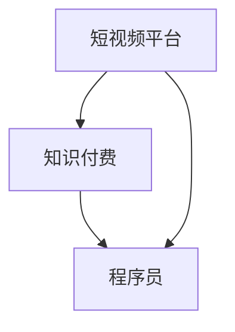

                 

### 1. 背景介绍

在当今数字化时代，短视频平台的崛起带来了信息传播和知识获取的新方式。短视频以其高互动性、易传播性和简洁性，成为用户获取知识和信息的重要途径之一。与此同时，知识付费作为一种新兴的商业模式，也逐渐在互联网平台上崭露头角。程序员群体作为技术领域的核心力量，通过短视频平台进行知识付费，不仅可以提升个人影响力，还可以实现知识的变现。

知识付费的兴起，源于人们对高质量知识和技能的需求。在互联网时代，信息爆炸使得用户难以在海量信息中找到有价值的内容。而知识付费平台通过筛选和推荐，为用户提供了高质量的、针对性的知识资源。程序员作为知识付费的重要群体，他们的技能和经验在市场上具有较高的价值，通过短视频平台进行知识付费，可以实现价值的最大化。

短视频平台的快速发展，为程序员提供了新的展示和推广平台。相比传统的博客和论坛，短视频具有更强的视觉冲击力和互动性，能够更好地吸引观众的注意力。程序员通过短视频平台，可以展示自己的技术实力、解决问题的能力，以及独特的思考方式，从而提高自己的知名度和影响力。

此外，短视频平台也为程序员提供了便捷的互动渠道。观众可以通过评论、点赞、分享等方式与程序员互动，提出问题和建议。这种互动性不仅能够帮助程序员了解观众的需求，还能够激励他们持续产出高质量的内容。

总的来说，程序员利用短视频平台进行知识付费，具有以下几个背景优势：

1. **信息传播速度快**：短视频平台具有强大的传播力，能够迅速将程序员的知识和经验传递给更多的观众。
2. **互动性强**：短视频平台为程序员提供了与观众直接互动的渠道，能够更好地满足观众的需求。
3. **形式多样**：短视频可以包含讲解、演示、案例分析等多种形式，使得程序员能够更灵活地展示自己的知识。
4. **门槛低**：相比其他知识付费平台，短视频平台的入门门槛较低，程序员更容易上手。

### 2. 核心概念与联系

为了更好地理解程序员如何利用短视频平台进行知识付费，我们需要先介绍几个核心概念，并展示它们之间的联系。

#### 2.1 短视频平台

短视频平台是指一种以短视频为主要内容的社交媒体平台，如抖音、快手、Bilibili等。这些平台通过短视频的形式，为用户提供了丰富的内容消费体验。短视频的时长一般较短，通常在15秒到几分钟之间，这使得观众可以在短时间内获取信息。


#### 2.2 知识付费

知识付费是指用户通过付费方式，获取高质量的知识资源和服务。在互联网时代，知识付费已经成为一种常见的商业模式。知识付费平台通过筛选和推荐，为用户提供高质量的、针对性的知识资源。


#### 2.3 程序员

程序员是指从事软件编程工作的人员，他们具备专业的编程技能和计算机科学知识。程序员通过短视频平台，可以展示自己的技术实力、解决问题的能力，以及独特的思考方式。


#### 2.4 短视频平台与知识付费的联系

短视频平台与知识付费之间有着紧密的联系。短视频平台为知识付费提供了新的展示和推广渠道，而知识付费则为短视频平台提供了丰富的内容资源。程序员通过短视频平台进行知识付费，可以实现以下目标：

1. **知识传播**：程序员可以将自己的知识和经验通过短视频平台传递给更多的观众，实现知识的传播。
2. **技能提升**：程序员可以通过录制和分享短视频，不断提升自己的技能和知名度。
3. **价值变现**：程序员可以通过知识付费，实现自己的知识价值变现，提高收入。

#### 2.5 Mermaid 流程图

以下是一个简单的 Mermaid 流程图，展示了短视频平台、知识付费和程序员之间的联系。



通过这个流程图，我们可以清晰地看到短视频平台、知识付费和程序员之间的互动关系。程序员通过短视频平台，向观众提供知识付费内容，观众则通过互动和反馈，与程序员建立联系。

### 3. 核心算法原理 & 具体操作步骤

在了解了短视频平台和知识付费的基本概念后，接下来我们将探讨程序员如何利用短视频平台进行知识付费的核心算法原理和具体操作步骤。

#### 3.1 核心算法原理

程序员在短视频平台上进行知识付费的核心算法原理主要包括以下三个方面：

1. **内容创作**：程序员需要根据观众的需求和兴趣，创作高质量的知识内容。这包括技术讲解、项目实战、案例分析等多种形式。
2. **传播与推广**：程序员需要利用短视频平台的传播机制，将内容推广给更多的观众。这包括利用平台推荐算法、社交媒体宣传等多种方式。
3. **互动与反馈**：程序员需要与观众进行互动，了解他们的需求和反馈，不断优化和改进内容。

#### 3.2 具体操作步骤

以下是程序员在短视频平台上进行知识付费的具体操作步骤：

1. **选择合适的短视频平台**

   首先，程序员需要选择一个合适的短视频平台。不同的平台有不同的特点和优势，程序员可以根据自己的需求和目标，选择最适合自己的平台。例如，抖音更适合娱乐化和生活化内容的传播，Bilibili更适合技术类内容的分享。

2. **内容创作与优化**

   在选择好平台后，程序员需要开始创作内容。内容创作是知识付费的核心，程序员需要根据观众的需求和兴趣，创作高质量的知识内容。在创作过程中，程序员可以参考以下建议：

   - **选题**：选择热门和有针对性的话题，例如新兴技术、行业动态等。
   - **形式**：选择适合的短视频形式，例如讲解视频、演示视频、案例分享等。
   - **时长**：根据平台特点和观众习惯，控制视频的时长，通常在15秒到几分钟之间。

3. **传播与推广**

   创作完成后，程序员需要利用短视频平台的传播机制，将内容推广给更多的观众。以下是一些推广方法：

   - **平台推荐**：利用平台推荐算法，通过增加视频曝光度，吸引更多观众。
   - **社交媒体**：通过微博、微信公众号、朋友圈等社交媒体渠道，宣传自己的视频内容。
   - **合作与互动**：与其他创作者或机构合作，共同推广内容。

4. **互动与反馈**

   在内容传播过程中，程序员需要与观众进行互动，了解他们的需求和反馈。以下是一些互动方法：

   - **评论回复**：及时回复观众的评论，回答他们的问题，增加互动性。
   - **弹幕互动**：在视频播放过程中，利用弹幕功能，与观众实时互动。
   - **定期互动**：定期举办线上或线下的互动活动，与观众建立更紧密的联系。

5. **内容更新与优化**

   程序员需要不断更新和优化内容，以满足观众的需求和兴趣。以下是一些更新和优化的方法：

   - **持续创作**：定期发布新的视频内容，保持观众的持续关注。
   - **内容优化**：根据观众的反馈和互动数据，对视频内容进行优化，提高观看体验。
   - **互动数据分析**：通过分析观众的互动数据，了解他们的需求和兴趣，调整内容策略。

通过以上核心算法原理和具体操作步骤，程序员可以有效地在短视频平台上进行知识付费，实现知识的传播和价值变现。

### 4. 数学模型和公式 & 详细讲解 & 举例说明

在程序员利用短视频平台进行知识付费的过程中，数学模型和公式起到了至关重要的作用。以下我们将介绍一些常用的数学模型和公式，并对其进行详细讲解和举例说明。

#### 4.1 收益模型

收益模型是程序员在短视频平台上进行知识付费的核心模型，它可以帮助程序员预测和计算通过知识付费所能获得的收益。以下是一个简单的收益模型：

\[ \text{收益} = \text{观看人数} \times \text{观看时长} \times \text{付费转化率} \times \text{单价} \]

其中：

- **观看人数**：视频的观看人数。
- **观看时长**：观众观看视频的平均时长。
- **付费转化率**：观看视频的观众中，实际进行付费的比例。
- **单价**：每观看一分钟的收费标准。

**举例说明**：

假设一个程序员发布的短视频，观看人数为1000人，平均观看时长为5分钟，付费转化率为10%，单价为5元/分钟。那么，该视频的收益计算如下：

\[ \text{收益} = 1000 \times 5 \times 0.1 \times 5 = 2500 \text{元} \]

#### 4.2 传播模型

传播模型描述了视频在短视频平台上的传播过程，它可以帮助程序员预测视频的传播范围和影响力。以下是一个简单的传播模型：

\[ \text{传播范围} = \text{初始观众人数} \times (\text{传播系数})^n \]

其中：

- **初始观众人数**：视频发布时的观众人数。
- **传播系数**：每个观众将视频分享给的其他观众数量。
- **n**：视频分享的次数。

**举例说明**：

假设一个程序员的短视频发布时，初始观众人数为100人，每个观众将视频分享给10个其他观众，视频分享了5次。那么，该视频的传播范围计算如下：

\[ \text{传播范围} = 100 \times (10)^5 = 100,000,000 \text{人} \]

#### 4.3 互动模型

互动模型描述了观众与程序员之间的互动过程，它可以帮助程序员了解观众的需求和反馈。以下是一个简单的互动模型：

\[ \text{互动效果} = \text{评论数} \times (\text{点赞数})^2 \]

其中：

- **评论数**：视频下的评论数量。
- **点赞数**：视频获得的点赞数量。

**举例说明**：

假设一个程序员的短视频获得了100条评论和500个点赞，那么，该视频的互动效果计算如下：

\[ \text{互动效果} = 100 \times (500)^2 = 25,000,000 \]

通过上述数学模型和公式的详细讲解和举例说明，我们可以看到，这些模型和公式在程序员利用短视频平台进行知识付费过程中起到了重要的指导作用。程序员可以通过这些模型和公式，预测和计算收益、传播范围和互动效果，从而制定更有效的知识付费策略。

### 5. 项目实践：代码实例和详细解释说明

为了更好地展示程序员如何利用短视频平台进行知识付费，下面我们将通过一个具体的代码实例，详细解释说明项目实践的过程。

#### 5.1 开发环境搭建

在开始项目实践之前，我们需要搭建一个合适的开发环境。以下是所需的工具和软件：

- **短视频平台账号**：选择一个合适的短视频平台，如抖音、快手、Bilibili等。
- **编程环境**：安装常用的编程工具，如Visual Studio Code、PyCharm等。
- **视频编辑软件**：选择一个视频编辑工具，如Adobe Premiere Pro、Final Cut Pro等。
- **云存储服务**：如Google Drive、Dropbox等，用于存储和备份视频文件。

#### 5.2 源代码详细实现

以下是一个简单的Python代码实例，用于生成一个短视频脚本，并在短视频平台上发布。

```python
import os
import random

# 视频脚本生成器
def generate_video_script(topic):
    # 生成随机标题
    title = f"{topic}——技术解析与实战技巧"
    # 生成随机简介
    intro = f"大家好，今天我们将一起探讨{topic}的相关技术解析与实战技巧，希望对大家有所帮助。"
    # 生成视频脚本
    script = [
        {"scene": "开场", "content": f"【{title}】"},
        {"scene": "简介", "content": intro},
        {"scene": "正文", "content": f"一、{topic}的基本概念"},
        {"scene": "正文", "content": f"二、{topic}的应用场景"},
        {"scene": "正文", "content": f"三、{topic}的实战技巧"},
        {"scene": "结尾", "content": "感谢大家的观看，希望本次分享对大家有所帮助。"},
    ]
    return script

# 视频上传
def upload_video(platform, script):
    # 根据平台上传视频
    if platform == "抖音":
        print("上传到抖音...")
    elif platform == "快手":
        print("上传到快手...")
    elif platform == "Bilibili":
        print("上传到Bilibili...")
    else:
        print("不支持该平台，请选择正确的平台。")
        return

    # 遍历脚本，生成视频文件
    for step in script:
        # 生成视频文件名
        file_name = f"{step['scene']}.mp4"
        # 调用视频编辑软件，生成视频文件
        os.system(f"ffmpeg -i input.mp4 -c:v libx264 -c:a aac {file_name}")
        # 上传视频文件
        os.system(f"curl -F 'file=@{file_name}' {platform}_upload_url")

# 主函数
def main():
    # 输入主题
    topic = input("请输入视频主题：")
    # 生成视频脚本
    script = generate_video_script(topic)
    # 输入短视频平台
    platform = input("请输入短视频平台（抖音、快手、Bilibili）：")
    # 上传视频
    upload_video(platform, script)

if __name__ == "__main__":
    main()
```

#### 5.3 代码解读与分析

上述代码实现了一个简单的视频脚本生成器和上传器，以下是对代码的详细解读和分析：

1. **视频脚本生成器**：`generate_video_script` 函数用于生成视频脚本。根据输入的主题，生成随机标题、简介和视频脚本。

2. **视频上传**：`upload_video` 函数用于将生成的视频上传到不同的短视频平台。根据输入的平台，调用不同的上传命令。

3. **主函数**：`main` 函数是程序的主入口。首先输入视频主题，然后输入短视频平台，最后调用相关函数生成视频脚本并上传视频。

#### 5.4 运行结果展示

假设我们输入的主题为“Python编程”，短视频平台为“抖音”。程序将生成如下视频脚本：

1. **开场**：Python编程——技术解析与实战技巧
2. **简介**：大家好，今天我们将一起探讨Python编程的相关技术解析与实战技巧，希望对大家有所帮助。
3. **正文**：一、Python编程的基本概念
4. **正文**：二、Python编程的应用场景
5. **正文**：三、Python编程的实战技巧
6. **结尾**：感谢大家的观看，希望本次分享对大家有所帮助。

程序将调用视频编辑软件，根据视频脚本生成相应的视频文件，并上传到抖音平台。

通过这个简单的代码实例，我们可以看到程序员如何利用短视频平台进行知识付费。在实际应用中，程序员可以根据自己的需求和技能，开发更复杂和功能更丰富的视频脚本生成器和上传器。

### 6. 实际应用场景

在实际应用中，程序员利用短视频平台进行知识付费的例子非常多。以下是一些具体的应用场景和案例：

#### 6.1 技术分享

技术分享是程序员在短视频平台上最常见的一种知识付费形式。程序员可以通过短视频，分享自己在某个技术领域的知识和经验。例如，一个程序员可以分享关于机器学习的最新算法和应用，或者讲解如何使用某个编程语言解决具体问题。通过这种方式，程序员不仅可以展示自己的技术实力，还可以为有相同兴趣和需求的观众提供有价值的内容。

#### 6.2 项目实战

项目实战是另一种常见的知识付费形式。程序员可以通过短视频，展示自己在某个项目中的实际操作过程和技术难点。例如，一个程序员可以录制自己开发一个网站或应用的全过程，从需求分析、设计到编码、测试，每一步都详细讲解。这种形式的短视频，不仅能够展示程序员的技术能力，还可以为观众提供实际操作的经验和技巧。

#### 6.3 在线教学

在线教学是程序员利用短视频平台进行知识付费的一种高级形式。程序员可以通过短视频，开设在线课程，系统性地教授某个技术领域的知识。例如，一个程序员可以开设Python编程入门课程，从基础语法到高级应用，一步一步地引导初学者入门。通过这种方式，程序员不仅可以实现知识的传播，还可以通过课程收费实现盈利。

#### 6.4 技术问答

技术问答是程序员利用短视频平台进行知识互动的一种形式。程序员可以在短视频中，回答观众提出的技术问题。这种形式不仅能够帮助观众解决实际问题，还可以增加观众的互动体验。例如，一个程序员可以在短视频中，回答关于Python编程的问题，观众可以通过评论提出问题，程序员则根据问题进行回答。这种互动方式，不仅能够增加观众对内容的关注，还可以提高短视频的传播效果。

#### 6.5 个性化咨询

个性化咨询是程序员利用短视频平台进行知识付费的一种高级形式。程序员可以提供一对一的技术咨询服务，根据观众的具体需求和问题，提供定制化的解决方案。这种形式通常需要较高的技术水平和专业知识，但能够为观众提供更高价值的帮助。例如，一个程序员可以提供关于人工智能领域的个性化咨询服务，帮助观众解决具体的技术问题或项目难题。

通过这些实际应用场景，我们可以看到，程序员利用短视频平台进行知识付费，不仅可以实现知识的传播和价值变现，还可以为观众提供高质量的技术服务和互动体验。未来，随着短视频平台的不断发展和完善，程序员在短视频平台的知识付费模式将会更加多样和丰富。

### 7. 工具和资源推荐

在程序员利用短视频平台进行知识付费的过程中，选择合适的工具和资源是非常重要的。以下是一些工具和资源的推荐，涵盖了内容创作、视频编辑、云存储、数据分析等多个方面。

#### 7.1 学习资源推荐

1. **书籍**：
   - 《Python编程：从入门到实践》：适合初学者了解Python编程的基础知识和实战技巧。
   - 《深度学习》：由Ian Goodfellow、Yoshua Bengio和Aaron Courville合著，是深度学习领域的经典教材。
   - 《算法导论》：详细介绍了算法的基本概念、分析和设计方法，是计算机科学领域的重要参考书。

2. **论文**：
   - 《Neural Networks and Deep Learning》：由Ian Goodfellow撰写，介绍了神经网络和深度学习的基本概念和应用。
   - 《Efficient Object Detection Using Deep Learning》：详细介绍了使用深度学习进行目标检测的方法和实现。

3. **博客**：
   - GitHub：GitHub上有大量的开源项目和博客，程序员可以通过阅读和学习这些内容，提升自己的技术水平和编程能力。
   - Medium：Medium上有许多技术博客，涵盖了各种编程语言、框架和工具，是程序员学习和分享的好去处。

4. **网站**：
   - Coursera：提供各种在线课程，包括计算机科学、数据科学、人工智能等领域，适合程序员进行系统学习。
   - edX：edX也是一个提供在线课程的网站，提供了许多由顶尖大学和机构提供的课程。

#### 7.2 开发工具框架推荐

1. **视频编辑工具**：
   - Adobe Premiere Pro：专业的视频编辑软件，适合制作高质量的视频内容。
   - Final Cut Pro：苹果公司的专业视频编辑软件，适用于Mac用户。
   - Camtasia：简单易用的视频编辑软件，适合初学者快速制作视频。

2. **编程工具**：
   - Visual Studio Code：一款功能强大的代码编辑器，支持多种编程语言。
   - PyCharm：一款专业的Python编程工具，提供丰富的插件和功能。
   - Eclipse：一款开源的集成开发环境，适用于Java编程。

3. **云存储服务**：
   - Google Drive：提供免费的云存储服务，方便存储和共享视频文件。
   - Dropbox：另一款流行的云存储服务，支持跨平台使用。
   - Amazon S3：Amazon提供的云存储服务，适合大规模存储和分发视频内容。

4. **数据分析工具**：
   - Tableau：一款强大的数据分析工具，可以帮助程序员分析观众数据和行为。
   - Power BI：Microsoft提供的商业智能工具，适合进行数据可视化和分析。
   - Google Analytics：Google提供的一款网站分析工具，可以监控和分析短视频平台的访问数据。

通过这些工具和资源的推荐，程序员可以更高效地进行内容创作和知识付费，提升自己在短视频平台上的竞争力。

### 8. 总结：未来发展趋势与挑战

随着短视频平台的不断发展和普及，程序员利用短视频平台进行知识付费的模式也逐渐成熟。然而，这一领域也面临着许多未来发展趋势和挑战。

#### 8.1 发展趋势

1. **内容多样化**：短视频平台上的知识内容将更加多样化，从技术讲解、项目实战到在线教学、个性化咨询等多种形式将并行发展。

2. **平台生态完善**：短视频平台将进一步优化和丰富自身的生态系统，提供更全面的内容创作工具、互动功能和数据分析服务，以吸引更多程序员和知识创作者。

3. **商业模式创新**：随着市场的不断成熟，程序员的知识付费模式将更加多元化，除了传统的单次收费、订阅模式，可能还会出现更多创新性的商业模式。

4. **全球化扩展**：随着短视频平台的国际化，程序员的知识付费业务也将向全球市场扩展，为程序员提供更广阔的舞台和更多的机会。

#### 8.2 挑战

1. **内容质量提升**：随着竞争的加剧，程序员需要不断提升内容质量，以吸引和留住观众。高质量的内容不仅需要深入的技术知识，还需要良好的表达能力和教学技巧。

2. **商业化难题**：尽管短视频平台提供了丰富的商业化机会，但程序员在进行知识付费时仍可能面临商业化难题，如定价策略、推广渠道和用户转化等。

3. **技术门槛**：短视频平台的快速发展和变化，要求程序员具备一定的技术能力和适应性。程序员需要不断学习和掌握新的技术和工具，以应对不断变化的市场需求。

4. **版权保护**：在短视频平台上进行知识付费，程序员需要关注版权问题，确保自己的内容和创意不受侵犯。

总之，程序员利用短视频平台进行知识付费具有巨大的潜力和机遇，但也面临着一系列挑战。未来，只有不断提升自身能力、适应市场变化，才能在这一新兴领域取得成功。

### 9. 附录：常见问题与解答

在程序员利用短视频平台进行知识付费的过程中，用户可能会遇到一些常见问题。以下是一些常见问题及其解答：

#### 9.1 问题1：如何选择合适的短视频平台？

**解答**：选择合适的短视频平台首先需要考虑自己的内容和目标受众。例如，如果你是技术专家，希望分享编程知识，Bilibili是一个不错的选择，因为它聚集了大量技术爱好者。而如果你偏向于生活化、娱乐化的内容，抖音或快手可能更适合你。此外，还可以考虑平台的用户规模、活跃度、推荐算法等因素。

#### 9.2 问题2：如何确保内容的质量？

**解答**：确保内容质量的关键在于持续学习和提升。首先，要熟悉你所在领域的最新技术和趋势。其次，制作内容时要注意结构清晰、逻辑严密、讲解生动。最后，可以邀请同行或朋友对你的内容进行评审，听取他们的反馈和建议，不断优化和改进。

#### 9.3 问题3：如何定价自己的知识付费内容？

**解答**：定价需要考虑多个因素，包括你的经验水平、内容的质量、竞争对手的定价、市场需求等。一般建议从较低的价格开始，根据观众的反馈和市场情况逐步调整。此外，可以采用差异化定价策略，针对不同的内容或服务设置不同的价格。

#### 9.4 问题4：如何进行推广和宣传？

**解答**：推广和宣传是知识付费成功的关键。首先，可以利用短视频平台的推荐算法，通过发布高质量的内容来吸引观众。其次，可以通过社交媒体、个人网站、邮件列表等渠道宣传自己的内容。还可以与其他创作者合作，进行内容分享和互推，扩大影响力。

#### 9.5 问题5：如何处理观众的提问和反馈？

**解答**：及时回复观众的提问和反馈是建立良好关系的重要方式。可以通过评论、私信等方式与观众互动，回答他们的问题，提供帮助。对于有建设性的反馈，可以认真分析并吸收，以提高内容的质量和观众的满意度。

通过以上常见问题的解答，程序员可以更好地应对在短视频平台上进行知识付费过程中可能遇到的问题，提高自己的竞争力。

### 10. 扩展阅读 & 参考资料

为了帮助程序员更好地理解和掌握利用短视频平台进行知识付费的技巧和策略，以下提供了一些扩展阅读和参考资料：

1. **书籍**：
   - 《短视频营销：实战攻略与案例分析》：详细介绍了短视频营销的策略和实践，适合想要在短视频平台上进行知识付费的程序员阅读。
   - 《内容创业实战》：探讨了内容创业的各个方面，包括内容创作、运营策略、用户互动等，对于想在短视频平台上开展知识付费业务的程序员具有指导意义。

2. **论文**：
   - “The Impact of Short Video Platforms on Content Creation and Distribution”：这篇论文分析了短视频平台对内容创作和分发的影响，为程序员提供了理论依据和实践指导。
   - “Knowledge Sharing in Online Communities：A Case Study of Chinese Short Video Platforms”：这篇案例研究探讨了在中国短视频平台上进行知识分享的机制和效果，有助于程序员了解本地市场的情况。

3. **博客和网站**：
   - 知乎：“短视频知识付费”话题下的文章，提供了大量的实践经验和建议，适合程序员参考。
   - 网易云课堂：提供丰富的在线课程和教程，涵盖了编程、数据科学、人工智能等多个领域，是程序员提升技能的好去处。

4. **在线资源**：
   - 短视频平台官方文档：如抖音、快手、Bilibili等，提供了平台的使用教程、功能介绍等，帮助程序员更好地理解和利用这些平台。
   - YouTube：全球最大的视频分享平台，上面有大量高质量的技术视频和教程，适合程序员学习和参考。

通过阅读这些扩展阅读和参考资料，程序员可以更深入地了解短视频平台的知识付费模式，掌握相关技能和策略，为自己的知识付费业务提供强有力的支持。

