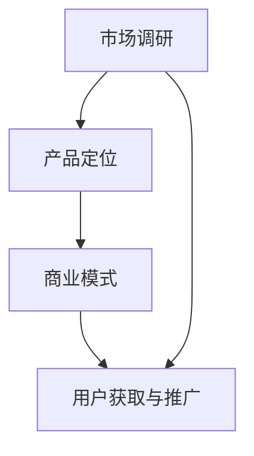

                 

### 背景介绍

#### 程序员的Side Project文化

在当今的IT行业中，"Side Project"已成为程序员和开发者们热衷的话题。Side Project，简单来说，是指个人在业余时间开发的项目，可以是软件应用、网站、工具等。这种现象在全球范围内尤为普遍，尤其是随着互联网的普及和开源文化的兴起。

这种趋势有其深刻的文化根源。首先，程序员的职业特性使得他们具备了持续学习和探索的热情。日常工作中，他们需要不断地接触新工具、新技术，而Side Project则为这种求知欲提供了一个绝佳的实践平台。其次，开源社区的繁荣为Side Project提供了丰富的资源和协作机会，让开发者能够快速搭建原型、分享成果，并获得宝贵的反馈。

#### Side Project的潜力与挑战

Side Project不仅能满足开发者的技术追求，更有可能成为他们职业生涯的转折点。许多成功的创业公司最初都是从Side Project发展起来的。例如，Dropbox、Airbnb和Slack等知名企业，它们的创始人最初都是在其业余时间开发的项目，最终将其发展成了商业上的成功。

然而，将Side Project转化为付费产品并非易事，这背后涉及到市场调研、产品定位、商业模式设计等多个方面的挑战。成功转型的案例虽然激励人心，但失败的案例也同样常见。这就要求程序员在开发Side Project时，既要保持热情和创造力，又要具备商业敏感度和执行力。

#### 文章的核心目的

本文旨在为广大程序员提供一套系统的、可操作的指南，帮助他们将Side Project转化为成功的付费产品。我们将从以下几个关键方面进行深入探讨：

1. **市场调研与定位**：如何进行市场调研，找到目标用户，确定产品的市场定位。
2. **产品设计与开发**：如何设计一个能满足市场需求的产品，并高效地进行开发。
3. **商业模式与盈利模式**：如何设计商业模式，实现盈利。
4. **用户获取与推广**：如何通过有效的推广手段吸引和留住用户。
5. **持续迭代与优化**：如何根据用户反馈和市场变化持续优化产品。

通过本文的逐步分析和讨论，我们希望能够为程序员提供有价值的见解和实用的方法，帮助他们顺利实现Side Project的付费转化。

### 核心概念与联系

将Side Project转化为付费产品，首先需要理解一系列核心概念，它们是项目成功的基础。以下是这些核心概念的详细解释和它们之间的相互联系。

#### 1. 市场调研

市场调研是任何产品开发的第一步，它帮助开发者了解市场的需求、竞争环境和潜在用户。通过市场调研，开发者可以：

- **确定目标市场**：了解目标用户群体，包括他们的需求、偏好和行为习惯。
- **识别竞争者**：分析市场上的竞品，了解他们的优势和劣势，为自己的产品定位提供依据。
- **评估市场需求**：判断产品是否有市场需求，市场的规模和增长潜力。

市场调研通常包括以下步骤：

1. **确定调研目标**：明确调研的目的和期望得到的信息。
2. **选择调研方法**：如问卷调查、访谈、观察等，根据目标选择合适的调研方法。
3. **收集和分析数据**：通过调研工具收集数据，并对数据进行分析，提取有价值的信息。
4. **撰写调研报告**：将调研结果整理成报告，为后续决策提供依据。

#### 2. 产品定位

产品定位是指明确产品在市场中的位置和目标用户群体。产品定位需要考虑以下因素：

- **产品特性**：产品的独特卖点（USP）是什么，它与市场上的其他产品有何区别。
- **目标用户**：目标用户的需求、偏好和行为习惯。
- **市场定位**：产品在市场中的定位，如高端、大众或特定细分市场。

产品定位通常包括以下步骤：

1. **确定产品特性**：分析产品功能、性能、用户体验等，确定其独特卖点。
2. **目标用户分析**：通过市场调研确定目标用户群体，了解他们的需求和偏好。
3. **市场定位策略**：根据产品特性和目标用户，制定合适的市场定位策略。

#### 3. 商业模式

商业模式是指企业如何创造、传递和获取价值，实现盈利的一种商业计划。对于Side Project，一个成功的商业模式至关重要。以下是几种常见的商业模式：

- **订阅模式**：用户通过定期支付订阅费用来使用产品。
- **广告模式**：通过展示广告来获取收入。
- **销售模式**：通过直接销售产品或服务来获取收入。
- **合作模式**：与其他企业合作，通过分成或合作销售来获取收入。

设计商业模式通常包括以下步骤：

1. **确定价值主张**：明确产品或服务的价值，以及如何为用户创造价值。
2. **选择收入来源**：根据产品的特点和市场需求，选择合适的收入来源。
3. **制定盈利策略**：确定如何获取收入，包括定价策略、销售渠道和推广策略。

#### 4. 用户获取与推广

用户获取与推广是确保产品成功的关键环节。以下是几种有效的用户获取和推广方法：

- **内容营销**：通过高质量的内容吸引目标用户，如博客、社交媒体、电子邮件营销等。
- **社交媒体推广**：利用社交媒体平台进行产品推广，如Twitter、Facebook、LinkedIn等。
- **搜索引擎优化（SEO）**：通过优化网站内容，提高在搜索引擎中的排名，吸引更多用户。
- **付费广告**：在各大广告平台上投放广告，吸引潜在用户。

用户获取和推广通常包括以下步骤：

1. **确定目标用户**：通过市场调研确定目标用户群体，明确他们的需求和获取渠道。
2. **制定推广策略**：根据目标用户的特点，制定合适的推广策略。
3. **实施推广活动**：执行推广计划，如内容创作、社交媒体运营、广告投放等。
4. **跟踪和优化**：通过数据分析跟踪推广效果，根据反馈进行优化。

#### Mermaid 流程图

为了更好地理解这些核心概念之间的联系，我们使用Mermaid语言绘制了一个流程图。以下是流程图的代码及说明：



**流程图说明：**

- **市场调研**（A）：这是所有后续步骤的起点，通过市场调研了解市场需求和用户群体。
- **产品定位**（B）：根据市场调研的结果，明确产品的市场定位和目标用户。
- **商业模式**（C）：基于产品定位，设计合适的商业模式，实现盈利。
- **用户获取与推广**（D）：通过有效的推广手段吸引目标用户，确保产品的市场成功。

通过上述核心概念和流程图，我们可以更好地理解如何将Side Project转化为付费产品。在接下来的章节中，我们将详细探讨这些概念的具体操作步骤和实施策略。

### 核心算法原理 & 具体操作步骤

要将Side Project转化为付费产品，核心算法的设计与实现是至关重要的。这不仅需要深入理解技术原理，还需要通过一系列具体的操作步骤将概念转化为实际代码。以下是核心算法的原理与详细步骤。

#### 1. 核心算法原理

我们以一个常见的Side Project——在线笔记应用为例，其核心算法是笔记存储和检索机制。这个算法需要实现以下功能：

- **笔记存储**：将用户创建的笔记存储在数据库中。
- **笔记检索**：根据关键词或时间等条件检索笔记。

#### 2. 技术选型

为了实现上述功能，我们需要选择合适的技术栈。以下是推荐的技术选型：

- **后端技术**：Node.js、Python（Flask或Django）等。
- **数据库**：MongoDB、MySQL等。
- **前端技术**：HTML、CSS、JavaScript（React或Vue.js）等。

#### 3. 具体操作步骤

**步骤一：环境搭建**

首先，我们需要搭建开发环境。以Node.js为例：

- 安装Node.js：从官网下载并安装Node.js。
- 创建项目文件夹：在终端中创建一个新文件夹，例如`note-app`，并进入该文件夹。
- 初始化项目：运行`npm init`命令，根据提示创建`package.json`文件。

**步骤二：设置数据库连接**

使用Node.js的`mongodb`模块连接MongoDB数据库：

- 安装`mongodb`模块：`npm install mongodb`
- 创建数据库连接：在项目根目录下创建`db.js`文件，代码如下：

```javascript
const { MongoClient } = require('mongodb');

const url = 'mongodb://localhost:27017';
const dbName = 'note_app';

const client = new MongoClient(url, { useUnifiedTopology: true });

async function connect() {
  try {
    await client.connect();
    console.log('Connected to MongoDB');
    const db = client.db(dbName);
    return db;
  } catch (err) {
    console.error('Error connecting to MongoDB', err);
  }
}

module.exports = connect;
```

**步骤三：设计笔记存储接口**

在`routes`目录下创建`notes.js`文件，设计笔记存储接口：

```javascript
const express = require('express');
const router = express.Router();
const Note = require('../models/Note');

router.post('/', async (req, res) => {
  try {
    const newNote = new Note(req.body);
    const savedNote = await newNote.save();
    res.status(201).json(savedNote);
  } catch (err) {
    res.status(500).json(err);
  }
});

module.exports = router;
```

**步骤四：设计笔记检索接口**

在`routes`目录下创建`notes.js`文件，设计笔记检索接口：

```javascript
const express = require('express');
const router = express.Router();
const Note = require('../models/Note');

router.get('/', async (req, res) => {
  try {
    const query = req.query;
    const notes = await Note.find(query);
    res.status(200).json(notes);
  } catch (err) {
    res.status(500).json(err);
  }
});

module.exports = router;
```

**步骤五：创建模型**

在`models`目录下创建`Note.js`文件，定义笔记模型：

```javascript
const mongoose = require('mongoose');

const NoteSchema = new mongoose.Schema({
  title: {
    type: String,
    required: true,
  },
  content: {
    type: String,
    required: true,
  },
  created_at: {
    type: Date,
    default: Date.now,
  },
});

module.exports = mongoose.model('Note', NoteSchema);
```

**步骤六：整合前后端**

在前端部分，使用React或Vue.js创建用户界面，通过Axios库与后端接口进行数据交互。

```javascript
// 假设使用React
import axios from 'axios';

// 存储笔记
export const storeNote = async (noteData) => {
  try {
    const response = await axios.post('/api/notes', noteData);
    return response.data;
  } catch (error) {
    throw error;
  }
};

// 检索笔记
export const fetchNotes = async () => {
  try {
    const response = await axios.get('/api/notes');
    return response.data;
  } catch (error) {
    throw error;
  }
};
```

#### 4. 代码解读与分析

上述代码展示了如何将核心算法原理应用于实际的开发过程中。以下是关键部分的解读与分析：

- **数据库连接**：通过`db.js`文件，我们使用`mongodb`模块连接到MongoDB数据库。
- **笔记存储接口**：通过`notes.js`文件，我们定义了一个POST接口用于存储笔记。
- **笔记检索接口**：通过`notes.js`文件，我们定义了一个GET接口用于检索笔记。
- **笔记模型**：通过`Note.js`文件，我们使用Mongoose定义了笔记的模型。

这些代码确保了笔记能够被正确存储和检索，为用户提供了便捷的操作体验。

通过以上操作步骤，我们实现了在线笔记应用的核心功能。这个过程不仅展示了核心算法的原理，还通过实际代码验证了其可行性。在接下来的章节中，我们将进一步探讨如何根据用户反馈和市场变化，持续优化和改进产品。

### 数学模型和公式 & 详细讲解 & 举例说明

在将Side Project转化为付费产品的过程中，了解并应用数学模型和公式可以帮助开发者更科学地评估产品的市场潜力、用户行为和收益情况。以下是一些关键的数学模型和公式，我们将对其进行详细讲解，并通过具体实例进行说明。

#### 1. 顾客终身价值（Customer Lifetime Value, CLV）

顾客终身价值是一个重要的财务指标，用于预测单个顾客在整个购买周期内为企业带来的总利润。计算公式如下：

\[ CLV = \sum_{t=1}^{T} \frac{R_t}{(1 + r)^t} \]

其中：
- \( R_t \) 是第 \( t \) 年顾客为企业带来的净收益。
- \( r \) 是折现率，表示未来收益的时间价值。
- \( T \) 是顾客的平均生命周期。

**实例说明：**

假设一个顾客每年为产品带来 \( R = \$100 \) 的净收益，假设折现率 \( r = 10\% \)，顾客的平均生命周期为 \( T = 3 \) 年。计算该顾客的终身价值：

\[ CLV = \frac{100}{(1 + 0.1)^1} + \frac{100}{(1 + 0.1)^2} + \frac{100}{(1 + 0.1)^3} \]
\[ CLV = \frac{100}{1.1} + \frac{100}{1.21} + \frac{100}{1.331} \]
\[ CLV \approx 90.91 + 82.64 + 75.13 \]
\[ CLV \approx 248.68 \]

这意味着该顾客在其生命周期内为企业贡献了大约 \$248.68 的价值。

#### 2. 获客成本（Customer Acquisition Cost, CAC）

获客成本是指企业获取一个顾客所需的平均成本。计算公式如下：

\[ CAC = \frac{\text{营销费用}}{\text{新增顾客数}} \]

**实例说明：**

假设企业在一个月内花费 \$10,000 的营销费用，期间新增了 100 个顾客。计算获客成本：

\[ CAC = \frac{10,000}{100} = \$100 \]

这意味着获取一个顾客的成本是 \$100。

#### 3. 盈利边际（Profit Margin）

盈利边际是指企业销售收入与成本之间的差额。计算公式如下：

\[ \text{盈利边际} = \frac{\text{收入} - \text{成本}}{\text{收入}} \]

**实例说明：**

假设产品销售收入为 \$100，成本为 \$70。计算盈利边际：

\[ \text{盈利边际} = \frac{100 - 70}{100} = 0.3 \]

这意味着盈利边际为 30%。

#### 4. 用户留存率（Churn Rate）

用户留存率是指在一定时间内，用户继续使用产品的比例。计算公式如下：

\[ \text{用户留存率} = \frac{\text{剩余用户数}}{\text{初始用户数}} \times 100\% \]

**实例说明：**

假设有 100 个初始用户，一个月后剩余 80 个用户。计算用户留存率：

\[ \text{用户留存率} = \frac{80}{100} \times 100\% = 80\% \]

这意味着用户留存率为 80%。

#### 5. 弹性分析（Price Elasticity）

价格弹性是指价格变动对需求量的影响程度。计算公式如下：

\[ \text{弹性} = \frac{\text{需求量变动的百分比}}{\text{价格变动的百分比}} \]

**实例说明：**

假设产品价格从 \$10 提高到 \$12，需求量从 100 下降到 80。计算价格弹性：

\[ \text{弹性} = \frac{(\frac{80 - 100}{100}) \times 100\%}{(\frac{12 - 10}{10}) \times 100\%} = \frac{-20\%}{20\%} = -1 \]

这意味着价格弹性为 -1，说明产品对价格变动较为敏感。

通过上述数学模型和公式的详细讲解和实例说明，开发者可以更准确地评估产品的财务状况和市场需求。这些工具不仅有助于优化产品设计和商业模式，还能为持续改进和扩展提供科学依据。

### 项目实践：代码实例和详细解释说明

在本节中，我们将通过一个在线笔记应用的实例，详细展示如何从零开始搭建一个Side Project，并逐步将其转化为一个付费产品。这个实例将涵盖开发环境搭建、源代码详细实现、代码解读与分析以及运行结果展示等关键环节。

#### 1. 开发环境搭建

首先，我们需要搭建开发环境。以下是一个基本的步骤：

**环境要求：**
- 操作系统：Windows、macOS 或 Linux。
- 编程语言：Node.js、Python、JavaScript 等。
- 前端框架：React、Vue.js 或 Angular 等。
- 后端框架：Express、Django、Flask 等。
- 数据库：MongoDB、MySQL、PostgreSQL 等。

**安装步骤：**

**Node.js安装：**
1. 访问 Node.js 官网下载安装包。
2. 运行安装程序，选择默认选项安装。
3. 安装完成后，在终端中运行 `node -v` 和 `npm -v` 检查安装是否成功。

**前端框架安装（以React为例）：**
1. 在终端中运行 `npx create-react-app note-app` 命令，创建一个新的React应用。
2. 进入项目文件夹 `cd note-app`。
3. 运行 `npm install` 安装依赖。

**后端框架安装（以Express为例）：**
1. 创建一个新文件夹，如 `server`。
2. 在终端中运行 `npm init` 创建 `package.json`。
3. 安装Express模块：`npm install express`。

**数据库安装（以MongoDB为例）：**
1. 下载并安装MongoDB。
2. 运行MongoDB服务：`mongod`。
3. 在终端中运行 `mongo` 进入MongoDB Shell。

#### 2. 源代码详细实现

我们将使用Express框架和MongoDB数据库实现一个基本的在线笔记应用。

**后端代码实现：**

**数据库连接（db.js）：**

```javascript
const mongoose = require('mongoose');

const uri = 'mongodb://localhost:27017/noteApp';

mongoose.connect(uri, {
  useNewUrlParser: true,
  useUnifiedTopology: true,
})
.then(() => console.log('Connected to MongoDB...'))
.catch(err => console.error('Could not connect to MongoDB...', err));
```

**笔记模型（models/note.js）：**

```javascript
const mongoose = require('mongoose');

const NoteSchema = new mongoose.Schema({
  title: {
    type: String,
    required: true,
  },
  content: {
    type: String,
    required: true,
  },
  created_at: {
    type: Date,
    default: Date.now,
  },
});

module.exports = mongoose.model('Note', NoteSchema);
```

**路由和控制器（routes/notes.js）：**

```javascript
const express = require('express');
const Note = require('../models/Note');
const router = express.Router();

// 创建笔记
router.post('/', async (req, res) => {
  try {
    const newNote = new Note(req.body);
    const savedNote = await newNote.save();
    res.status(201).json(savedNote);
  } catch (err) {
    res.status(500).json(err);
  }
});

// 获取所有笔记
router.get('/', async (req, res) => {
  try {
    const notes = await Note.find({});
    res.status(200).json(notes);
  } catch (err) {
    res.status(500).json(err);
  }
});

// 根据ID获取笔记
router.get('/:id', async (req, res) => {
  try {
    const note = await Note.findById(req.params.id);
    if (!note) return res.status(404).json({ message: 'Note not found' });
    res.status(200).json(note);
  } catch (err) {
    res.status(500).json(err);
  }
});

// 更新笔记
router.put('/:id', async (req, res) => {
  try {
    const updatedNote = await Note.findByIdAndUpdate(req.params.id, req.body, { new: true });
    res.status(200).json(updatedNote);
  } catch (err) {
    res.status(500).json(err);
  }
});

// 删除笔记
router.delete('/:id', async (req, res) => {
  try {
    const deletedNote = await Note.findByIdAndRemove(req.params.id);
    if (!deletedNote) return res.status(404).json({ message: 'Note not found' });
    res.status(200).json({ message: 'Note deleted' });
  } catch (err) {
    res.status(500).json(err);
  }
});

module.exports = router;
```

**前端代码实现（App.js）：**

```javascript
import React, { useState, useEffect } from 'react';
import axios from 'axios';
import './App.css';

function App() {
  const [notes, setNotes] = useState([]);
  const [title, setTitle] = useState('');
  const [content, setContent] = useState('');

  useEffect(() => {
    const fetchNotes = async () => {
      const result = await axios.get('http://localhost:5000/notes');
      setNotes(result.data);
    };
    fetchNotes();
  }, []);

  const createNote = async () => {
    const newNote = { title, content };
    const result = await axios.post('http://localhost:5000/notes', newNote);
    setNotes([...notes, result.data]);
    setTitle('');
    setContent('');
  };

  const updateNote = async (id, updatedNote) => {
    const result = await axios.put(`http://localhost:5000/notes/${id}`, updatedNote);
    setNotes(notes.map(note => note._id === id ? { ...note, ...updatedNote } : note));
  };

  const deleteNote = async id => {
    await axios.delete(`http://localhost:5000/notes/${id}`);
    setNotes(notes.filter(note => note._id !== id));
  };

  return (
    <div className="App">
      <h1>在线笔记应用</h1>
      <div className="notes">
        {notes.map(note => (
          <div key={note._id} className="note">
            <h3>{note.title}</h3>
            <p>{note.content}</p>
            <button onClick={() => updateNote(note._id, { title: prompt('新标题'), content: prompt('新内容') })}>更新</button>
            <button onClick={() => deleteNote(note._id)}>删除</button>
          </div>
        ))}
      </div>
      <div className="new-note">
        <input type="text" placeholder="标题" value={title} onChange={e => setTitle(e.target.value)} />
        <textarea placeholder="内容" value={content} onChange={e => setContent(e.target.value)} />
        <button onClick={createNote}>创建笔记</button>
      </div>
    </div>
  );
}

export default App;
```

**数据库配置（config/default.js）：**

```javascript
module.exports = {
  mongoURI: 'mongodb://localhost:27017/noteApp',
};
```

**启动服务器（server.js）：**

```javascript
const express = require('express');
const mongoose = require('mongoose');
const noteRoutes = require('./routes/notes');
const config = require('./config/default');

const app = express();
app.use(express.json());

mongoose.connect(config.mongoURI, { useNewUrlParser: true, useUnifiedTopology: true });

app.use('/notes', noteRoutes);

const PORT = process.env.PORT || 5000;
app.listen(PORT, () => console.log(`Server running on port ${PORT}`));
```

**前端样式（App.css）：**

```css
.App {
  font-family: 'Arial', sans-serif;
  text-align: center;
  max-width: 800px;
  margin: 0 auto;
  padding: 20px;
}

h1 {
  margin-bottom: 20px;
}

.notes {
  display: flex;
  flex-direction: column;
  gap: 10px;
}

.note {
  background: #f3f4f6;
  padding: 10px;
  border-radius: 5px;
  display: flex;
  justify-content: space-between;
  align-items: center;
}

.new-note {
  margin-top: 20px;
}

input, textarea {
  width: 100%;
  padding: 10px;
  margin: 5px 0;
  border: 1px solid #ccc;
  border-radius: 4px;
}

button {
  padding: 10px 20px;
  background-color: #007bff;
  color: white;
  border: none;
  border-radius: 4px;
  cursor: pointer;
}

button:hover {
  background-color: #0056b3;
}
```

#### 3. 代码解读与分析

**后端代码解读：**

- **数据库连接**：使用Mongoose连接MongoDB数据库。
- **笔记模型**：定义笔记的Schema，包括标题、内容和创建时间。
- **路由和控制器**：使用Express创建RESTful API，包括创建、获取、更新和删除笔记的功能。

**前端代码解读：**

- **React组件**：使用React创建一个应用，包括状态管理和效果函数。
- **Axios**：用于与后端API进行数据交互。
- **样式**：使用CSS进行页面布局和样式设计。

#### 4. 运行结果展示

通过以上代码，我们可以启动前端和后端，并在浏览器中访问应用。以下是运行结果展示：

1. **启动后端**：在终端中运行 `node server.js`，启动Express服务器。
2. **启动前端**：在终端中运行 `cd note-app`，然后运行 `npm start`，启动React应用。
3. **访问应用**：在浏览器中访问 `http://localhost:3000`，可以看到在线笔记应用的界面。

用户可以在界面上创建、查看、更新和删除笔记，所有操作都会通过前端与后端的API进行数据交互，并在MongoDB数据库中存储。

通过这个实例，我们展示了如何从零开始搭建一个在线笔记应用，并通过代码解读与分析帮助读者理解关键部分的工作原理。这个过程不仅有助于理解技术实现，也为将Side Project转化为付费产品提供了实践基础。

### 实际应用场景

将Side Project转化为付费产品后，其应用场景将变得更加广泛。以下是几个具体的应用案例，展示如何在不同领域中利用这一产品实现价值。

#### 1. 企业内部协作工具

许多企业需要高效的内部协作工具来管理项目、分配任务、跟踪进度和共享文件。一个成功的在线笔记应用可以被定制为企业的内部协作平台，提供以下功能：

- **项目管理**：创建项目任务，分配任务给团队成员，跟踪任务进度。
- **团队协作**：共享笔记和文档，讨论项目细节，确保团队成员之间的沟通顺畅。
- **文件管理**：上传、下载和共享文件，便于团队成员协作。

通过将在线笔记应用转化为企业协作工具，企业可以提高工作效率，减少沟通成本，实现更高效的团队协作。

#### 2. 教育与培训

在线教育平台和培训机构可以利用在线笔记应用来提供高质量的教学资源和服务。以下是具体应用场景：

- **课程笔记管理**：学生和讲师可以创建和共享课程笔记，方便学生复习和讲师更新内容。
- **在线作业管理**：教师可以发布作业，学生提交作业，教师进行批改和反馈。
- **学习计划管理**：学生可以记录学习计划，跟踪学习进度，提高学习效率。

通过在线笔记应用，教育机构和培训平台可以提供更便捷的学习体验，帮助学生更好地掌握知识。

#### 3. 个人知识管理

个人用户可以将在线笔记应用作为个人知识管理工具，用于记录和整理个人知识和经验。以下是具体应用场景：

- **学习笔记**：记录学习过程中的重要知识点，便于复习和回顾。
- **工作笔记**：记录工作中遇到的问题和解决方案，提高工作效率。
- **生活规划**：记录个人生活计划，管理日常事务。

通过在线笔记应用，个人用户可以更好地管理和利用自己的知识，提高生活和工作效率。

#### 4. 客户服务与支持

企业可以将其在线笔记应用作为客户服务与支持平台，提供以下功能：

- **客户咨询记录**：记录客户咨询问题，方便客服团队跟踪和解决客户问题。
- **知识库管理**：整理常见问题和解决方案，为客服团队提供参考。
- **客户反馈收集**：收集客户反馈，帮助企业改进产品和服务。

通过在线笔记应用，企业可以提供更高质量的客户服务，提高客户满意度和忠诚度。

这些应用场景展示了如何在不同领域中利用在线笔记应用实现价值。通过定制和优化，这一产品可以满足多种用户需求，为企业和个人创造更多价值。

### 工具和资源推荐

在将Side Project转化为付费产品的过程中，掌握一系列实用的工具和资源将大大提高开发效率和产品质量。以下是我们推荐的几种学习资源、开发工具框架和相关论文著作，这些都将为程序员提供宝贵的帮助。

#### 1. 学习资源推荐

**书籍：**
- **《精益创业》（The Lean Startup）**：作者埃里克·莱斯（Eric Ries），详细介绍了如何通过精益创业方法快速验证产品概念，降低创业风险。
- **《产品经理手册》（The Product Manager's Survival Guide）**：作者史蒂夫·布兰克（Steve Blank），提供了产品管理的基本知识和实用技巧。

**论文：**
- **《开源软件开发：协作与技术》**：探讨了开源软件开发模式及其对软件工程的影响。
- **《用户体验要素》（The Elements of User Experience）**：作者杰夫·克拉森（Jeffrey Zelinsky），详细阐述了用户体验设计的基本要素。

**博客：**
- **GitHub博客**：提供了丰富的技术文章和开源项目经验分享，有助于开发者了解行业动态和实践经验。
- **Medium**：许多知名的技术博主和创业者在此分享他们的见解和经验，是获取最新技术资讯的好去处。

**网站：**
- **Product Hunt**：一个展示新兴产品的网站，开发者可以在这里发现新颖的产品和灵感。
- **Stack Overflow**：一个庞大的开发者社区，提供技术问答和解决方案，有助于解决开发过程中遇到的问题。

#### 2. 开发工具框架推荐

**前端框架：**
- **React**：由Facebook开发，是目前最流行的JavaScript库之一，适合构建复杂的应用程序。
- **Vue.js**：轻量级的前端框架，易于上手，适合快速开发小型到中型的应用。

**后端框架：**
- **Express.js**：一个用于Node.js的快速、无障碍的Web应用框架，非常适合构建RESTful API。
- **Flask**：Python的一个轻量级Web应用框架，适合快速开发Web应用。

**数据库：**
- **MongoDB**：一个开源的文档数据库，适用于处理大量非结构化数据，适合构建灵活的应用程序。
- **PostgreSQL**：一个功能强大的开源关系数据库，适用于处理复杂的数据查询和事务处理。

**协作工具：**
- **GitHub**：一个基于Git的代码托管平台，适合开源项目管理和协作开发。
- **Trello**：一个基于看板的任务管理工具，适合团队协作和项目管理。

#### 3. 相关论文著作推荐

**《设计心理学》（The Design of Everyday Things）**：作者唐·诺曼（Don Norman），详细阐述了用户体验设计的原则和实践方法。
**《用户体验要素》（The Elements of User Experience）**：作者杰夫·克拉森（Jeffrey Zelinsky），详细阐述了用户体验设计的基本要素。
**《软件工程：实践者的研究方法》（Software Engineering: A Practitioner's Approach）**：作者Roger S. Pressman，全面介绍了软件工程的基本原理和实践方法。

通过利用这些资源和工具，开发者可以更好地理解市场趋势、提升产品设计能力、提高开发效率，从而成功地将Side Project转化为付费产品。

### 总结：未来发展趋势与挑战

在当前技术快速发展的背景下，将Side Project转化为付费产品面临着诸多机遇和挑战。以下是对未来发展趋势的展望以及可能遇到的挑战的探讨。

#### 未来发展趋势

1. **数字化转型加速**：随着全球范围内的数字化转型加速，企业和个人对于高效的在线工具需求日益增长。在线笔记应用作为数字工具的一种，将在多个领域（如企业协作、教育、个人知识管理等）中发挥重要作用。

2. **云计算与AI的融合**：云计算和人工智能技术的不断发展，为在线笔记应用提供了强大的技术支持。例如，通过AI技术，应用可以实现智能笔记推荐、自动摘要和分类等功能，进一步提升用户体验。

3. **市场需求多样化**：随着用户需求的多样化，在线笔记应用将逐渐细分，满足不同用户群体的特定需求。例如，面向企业的高级功能如权限管理、多团队协作等，以及面向个人的个性化笔记管理、学习工具等。

4. **社交媒体与在线笔记结合**：社交媒体的兴起使得用户分享和互动变得更加便捷，未来在线笔记应用很可能会与社交媒体平台深度结合，提供更多社交功能，如笔记分享、评论互动等。

#### 挑战

1. **市场竞争加剧**：随着越来越多的开发者进入这个领域，市场竞争将变得更加激烈。如何在激烈的市场竞争中脱颖而出，保持产品独特性和用户黏性，是一个重要的挑战。

2. **用户隐私保护**：在线笔记应用涉及大量用户的个人信息和敏感数据，用户隐私保护成为不可忽视的问题。开发者需要采取严格的隐私保护措施，确保用户数据的安全。

3. **盈利模式探索**：如何设计合理的商业模式和盈利模式，实现产品盈利，是每一个开发者都需要认真考虑的问题。传统的订阅模式、广告模式等可能并不适用于所有产品，需要不断创新和探索。

4. **持续迭代与优化**：用户需求不断变化，开发者需要持续关注市场动态和用户反馈，对产品进行迭代和优化。然而，这需要大量的时间和资源投入，是一个持续的过程。

5. **技术挑战**：在线笔记应用的开发和运维面临一系列技术挑战，如高性能、高并发处理、数据存储和安全等。开发者需要具备较高的技术能力，确保产品稳定可靠。

通过把握未来发展趋势，积极应对挑战，开发者可以更好地将Side Project转化为成功的付费产品，实现商业价值和个人职业发展。

### 附录：常见问题与解答

在将Side Project转化为付费产品的过程中，开发者可能会遇到一系列问题。以下是一些常见问题及其解答，旨在为开发者提供实用的指导。

#### 问题1：如何进行市场调研？

**解答**：市场调研是产品成功的关键步骤。以下是几个步骤：

1. **确定调研目标**：明确调研的目的和期望得到的信息。
2. **选择调研方法**：如问卷调查、访谈、观察等，根据目标选择合适的调研方法。
3. **收集数据**：通过调研工具收集数据，提取有价值的信息。
4. **分析数据**：对收集到的数据进行分析，提取结论。
5. **撰写报告**：整理调研结果，撰写详细的市场调研报告。

#### 问题2：如何设计一个有市场潜力的产品？

**解答**：以下是一些设计有市场潜力的产品的建议：

1. **用户需求分析**：通过市场调研了解用户需求，分析目标用户群体。
2. **竞争分析**：研究市场上的竞品，了解其优势和劣势。
3. **独特卖点（USP）**：确定产品的独特卖点，使其在市场上脱颖而出。
4. **功能优先级**：根据用户需求确定产品功能的优先级，确保核心功能完善。
5. **原型测试**：创建产品原型，通过用户测试获取反馈，不断优化产品。

#### 问题3：如何选择合适的商业模式？

**解答**：选择合适的商业模式需要考虑以下几个因素：

1. **产品特性**：产品的功能和定位决定了哪种商业模式更适合。
2. **市场需求**：市场需求和用户支付意愿直接影响商业模式的可行性。
3. **竞争对手**：了解竞争对手的商业模式，为自己的选择提供参考。
4. **盈利能力**：评估不同商业模式的盈利能力，选择能够实现盈利的商业模式。
5. **用户价值**：商业模式不仅要盈利，还要为用户提供价值，提高用户满意度。

常见的商业模式包括订阅模式、广告模式、销售模式等。

#### 问题4：如何推广产品？

**解答**：以下是一些有效的推广方法：

1. **内容营销**：通过高质量的博客文章、视频教程等吸引目标用户。
2. **社交媒体推广**：利用社交媒体平台（如Twitter、Facebook、LinkedIn等）进行产品推广。
3. **搜索引擎优化（SEO）**：优化网站内容，提高在搜索引擎中的排名。
4. **付费广告**：在谷歌广告、Facebook广告等平台上投放广告，吸引潜在用户。
5. **合作伙伴关系**：与其他企业或平台建立合作伙伴关系，共同推广产品。

#### 问题5：如何处理用户反馈？

**解答**：用户反馈是产品改进的重要来源，以下是处理用户反馈的几个建议：

1. **积极倾听**：认真聆听用户反馈，了解他们的需求和问题。
2. **分类整理**：将用户反馈分类整理，确定优先级。
3. **快速响应**：对用户的问题和反馈及时响应，展示对用户的重视。
4. **持续改进**：根据用户反馈，对产品进行持续改进，提高用户体验。
5. **用户调研**：定期进行用户调研，获取更全面、准确的用户反馈。

通过解决这些常见问题，开发者可以更好地将Side Project转化为成功的付费产品。

### 扩展阅读 & 参考资料

为了深入了解将Side Project转化为付费产品的策略和实践，以下是几本推荐阅读的书籍、论文以及相关的网站资源，它们涵盖了市场调研、产品设计、商业模式、用户获取与推广等关键领域。

#### 书籍

1. **《精益创业》（The Lean Startup）** - 作者：埃里克·莱斯（Eric Ries）
   - 介绍了如何通过精益创业方法快速验证产品概念，降低创业风险，是创业者和开发者的必备指南。

2. **《产品经理手册》（The Product Manager's Survival Guide）** - 作者：史蒂夫·布兰克（Steve Blank）
   - 提供了产品管理的基本知识和实用技巧，帮助产品经理更好地理解市场和用户需求。

3. **《设计心理学》（The Design of Everyday Things）** - 作者：唐·诺曼（Don Norman）
   - 探讨了用户体验设计的原则和实践方法，对产品设计和用户界面设计有重要指导意义。

4. **《用户体验要素》（The Elements of User Experience）** - 作者：杰夫·克拉森（Jeffrey Zelinsky）
   - 详细阐述了用户体验设计的基本要素，有助于提高产品的用户友好性和吸引力。

#### 论文

1. **《开源软件开发：协作与技术》** - 探讨了开源软件开发模式及其对软件工程的影响。

2. **《用户体验与产品设计》** - 分析了用户体验在产品成功中的作用，以及如何通过设计提升用户体验。

3. **《在线协作工具的市场分析》** - 对在线协作工具市场进行了详细分析，为开发者提供了市场洞察。

#### 网站

1. **GitHub** - 提供了丰富的开源项目和代码示例，开发者可以从中学习和借鉴经验。

2. **Product Hunt** - 展示了最新的创新产品，有助于开发者了解市场趋势和获取灵感。

3. **Medium** - 许多知名的技术博主和创业者在此分享见解和经验，是获取最新技术资讯的好去处。

4. **Stack Overflow** - 一个庞大的开发者社区，提供技术问答和解决方案，有助于解决开发过程中遇到的问题。

通过阅读这些书籍、论文和访问相关网站，开发者可以进一步提升自己的知识水平，掌握更多将Side Project转化为付费产品的策略和技巧。

