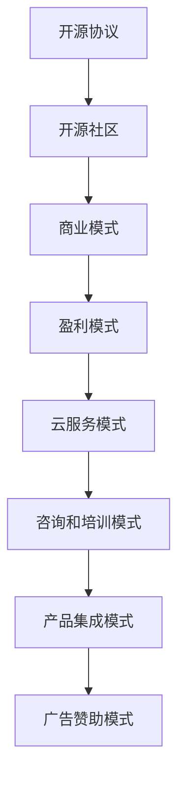

                 

### 背景介绍 Background Introduction

#### 开源项目的崛起 The Rise of Open Source Projects

开源项目作为一种软件开发模式，近年来在全球范围内迅速崛起，并逐渐成为软件开发领域的主流趋势。开源项目通常是指那些源代码可以被公众自由查看、修改和共享的软件项目。这种模式不仅促进了技术的快速传播和迭代，还极大地降低了软件开发成本，提高了开发效率。

开源项目的兴起可以追溯到20世纪90年代，当时自由软件运动逐渐兴起，并引发了开源软件的浪潮。著名的开源软件如Linux操作系统、Apache HTTP服务器等，都在这一时期崭露头角。进入21世纪，随着互联网的普及和开源社区的形成，开源项目得到了更为广泛的支持和参与。

#### 开源与商业的冲突 The Conflict Between Open Source and Commercialization

然而，开源项目与传统商业模式之间存在着一定的冲突。开源项目的核心原则是自由、开放和共享，这意味着其源代码是公开的，任何人都可以免费使用、修改和分发。而商业化的目的是追求利润，这通常需要控制产品的知识产权，并通过销售和服务来获得收入。

这种冲突导致了开源项目商业化过程中的诸多挑战。首先，开源项目如何确保在免费使用的同时，仍能维持长期的可持续发展，成为一个重要问题。其次，如何平衡开源社区的自由精神和商业利益，实现双赢，也是一项艰巨的任务。

#### 本文目的 Purpose of This Article

本文旨在探讨程序员如何将开源项目商业化，实现开源与盈利的平衡。我们将从多个角度分析这一问题，包括开源项目的商业模式、商业化策略、法律和知识产权保护等。通过本文，希望能够为那些希望将开源项目商业化的程序员提供一些实用的指导和思路。

### 核心概念与联系 Core Concepts and Relationships

在深入探讨如何将开源项目商业化之前，我们需要明确几个核心概念，并了解它们之间的联系。这些概念包括开源协议、开源社区、商业模式和盈利模式。

#### 开源协议 Open Source Licenses

开源协议是确保开源项目得以自由使用、修改和分享的法律框架。常见的开源协议有GNU通用公共许可证（GNU GPL）、Mozilla公共许可证（Mozilla MPL）、Apache许可证（Apache 2.0）等。这些协议各有特点，但共同目标是为开源项目提供法律保障，确保其开放性和自由性。

- **GNU GPL**：这是最严格的开源协议之一，要求任何修改和衍生作品也必须开源。这种“传染性”的许可证确保了项目的核心思想不会被商业利益所侵蚀。
- **Mozilla MPL**：该协议允许商业用途，但要求源代码和修改后的代码保持开源，同时提供了更多的灵活性。
- **Apache 2.0**：这是一个比较宽松的协议，允许商业用途，但要求保留原始版权声明和许可证声明。

选择合适的开源协议对于开源项目的可持续发展和商业化至关重要。

#### 开源社区 Open Source Community

开源社区是开源项目的重要支柱，由全球的志愿者、开发者和用户组成。开源社区通过协作、贡献和共享，推动了开源项目的不断进步。开源社区的核心价值在于其开放性和包容性，任何有兴趣的人都可以参与其中，贡献自己的力量。

开源社区对于商业化的支持体现在多个方面。首先，通过社区的反馈和改进，开源项目可以更快地迭代和优化。其次，社区成员之间的合作可以产生更多的商业机会，如技术咨询、定制开发和服务等。

#### 商业模式 Business Models

商业模式是指企业通过提供产品或服务来获取利润的方式。对于开源项目而言，商业模式的挑战在于如何在免费开放源代码的同时，实现盈利。

以下是几种常见的开源商业模式：

- **服务订阅模式**：通过提供专业服务（如技术支持、培训、咨询服务等），以订阅方式获取收入。
- **增值服务模式**：提供基础开源软件的增值服务，如高级功能、专业工具或定制化解决方案。
- **企业赞助模式**：企业通过赞助开源项目来获得品牌曝光和技术影响力。
- **许可销售模式**：出售开源软件的许可权，允许商业用户在一定条件下使用软件。

#### 盈利模式 Profit Models

盈利模式是指企业通过何种方式实现利润。对于开源项目，盈利模式与商业模式密切相关，但更侧重于具体实现方法。

以下是几种常见的开源盈利模式：

- **云服务模式**：提供基于开源软件的云服务，通过收取服务费用获得利润。
- **咨询和培训模式**：通过提供专业的开源技术咨询服务和培训课程，赚取咨询费和培训费。
- **产品集成模式**：将开源软件集成到企业的产品中，通过产品销售获取利润。
- **广告赞助模式**：在开源项目的网站或文档中展示广告，通过广告收入实现盈利。

#### Mermaid 流程图 Mermaid Diagram

为了更好地理解这些核心概念之间的联系，我们可以通过Mermaid流程图来展示它们的关系。



通过这个流程图，我们可以清晰地看到开源协议如何引导开源社区，社区如何支持商业模式，商业模式又如何转化为具体的盈利模式。

### 核心算法原理 & 具体操作步骤 Core Algorithm Principles & Detailed Steps

在深入探讨如何将开源项目商业化的过程中，我们需要了解一些核心算法原理和具体操作步骤，这些原理和步骤将为我们提供实现商业化的技术和实践依据。

#### 核心算法原理 Core Algorithm Principles

开源项目的核心算法通常是项目成功的关键，它不仅决定了项目的性能和功能，还影响了项目的商业价值。以下是几种常见的开源算法及其基本原理：

1. **排序算法**：如快速排序（Quick Sort）、归并排序（Merge Sort）等。这些算法的基本原理是通过递归或迭代的方式，将一个无序的数列转变为有序的数列。
2. **搜索算法**：如二分搜索（Binary Search）、深度优先搜索（DFS）、广度优先搜索（BFS）等。这些算法的基本原理是在给定数据结构中查找特定元素或路径。
3. **图算法**：如最短路径算法（Dijkstra算法、Floyd算法）、最小生成树算法（Prim算法、Kruskal算法）等。这些算法的基本原理是在图中寻找特定路径或结构。

#### 具体操作步骤 Detailed Steps

将开源项目商业化需要一系列具体的操作步骤，以下是一个典型的操作流程：

1. **市场调研**：在开始商业化的过程中，首先需要进行市场调研，了解目标市场的需求、竞争对手情况以及潜在的商业机会。
2. **定义商业模式**：根据市场调研的结果，确定合适的商业模式。例如，选择服务订阅模式、增值服务模式或企业赞助模式等。
3. **产品定位**：明确开源项目的市场定位，确定产品的核心功能和特点，以便在市场中脱颖而出。
4. **技术迭代**：持续改进开源项目的核心算法和功能，以满足市场需求和提升用户体验。
5. **社区建设**：加强开源社区的建设，鼓励社区成员的参与和贡献，提高项目的活跃度和影响力。
6. **商业模式实施**：根据选定的商业模式，实施具体盈利模式，如提供专业服务、销售增值服务或开展企业赞助等。
7. **市场推广**：通过多种渠道进行市场推广，包括社交媒体、行业会议、在线广告等，提高项目的知名度和用户基础。
8. **数据分析**：收集和分析用户数据，了解用户行为和需求，以便进一步优化产品和商业模式。
9. **持续创新**：不断进行技术创新和商业模式创新，以应对市场变化和竞争压力。

#### 实例说明 Example

以一个开源数据库项目为例，其商业化过程可以如下展开：

- **市场调研**：调研结果显示市场上对高性能、可扩展的数据库需求旺盛，但现有解决方案存在性能瓶颈和扩展性不足的问题。
- **定义商业模式**：选择服务订阅模式，为用户提供高性能的数据库云服务。
- **产品定位**：定位为高性能、可扩展、易于使用的企业级数据库。
- **技术迭代**：不断优化数据库算法，提高查询速度和扩展能力。
- **社区建设**：建立活跃的开源社区，鼓励用户和开发者参与项目改进。
- **商业模式实施**：推出数据库云服务，通过收取订阅费用获得收入。
- **市场推广**：通过社交媒体、行业会议和合作伙伴渠道进行推广。
- **数据分析**：收集用户使用数据，优化服务质量和用户体验。
- **持续创新**：不断引入新技术，如分布式数据库、自动化运维等，以保持竞争力。

通过以上步骤，开源数据库项目不仅可以实现商业化，还能在开源社区中获得更广泛的支持和认可。

### 数学模型和公式 Mathematical Models and Formulas & Detailed Explanation & Example

在开源项目商业化的过程中，数学模型和公式可以提供量化的分析和预测，帮助我们更好地理解市场动态和商业模式。以下是一些常用的数学模型和公式，以及它们的详细解释和例子。

#### 需求预测模型 Demand Prediction Model

需求预测是商业化过程中的关键一步，它可以帮助我们预测市场需求，指导产品开发和市场策略。常用的需求预测模型包括线性回归（Linear Regression）和时间序列分析（Time Series Analysis）。

1. **线性回归**：

   线性回归是一种预测目标变量（如销售额）与一个或多个自变量（如广告费用、市场需求等）之间关系的统计方法。其基本公式为：

   $$ y = \beta_0 + \beta_1x + \epsilon $$

   其中，$y$ 是目标变量，$x$ 是自变量，$\beta_0$ 和 $\beta_1$ 是回归系数，$\epsilon$ 是误差项。

   **实例**：假设我们要预测某开源软件的月销售额，已知历史数据如下表：

   | 月销售额 (万元) | 广告费用 (万元) |
   | --------------- | --------------- |
   | 10              | 3               |
   | 12              | 4               |
   | 8               | 2               |
   | 15              | 5               |
   | 9               | 3               |

   使用线性回归模型进行预测，我们得到以下回归方程：

   $$ y = 5.6 + 1.2x $$

   如果本月广告费用为4万元，则预计月销售额为：

   $$ y = 5.6 + 1.2 \times 4 = 9.6 \text{万元} $$

2. **时间序列分析**：

   时间序列分析是一种用于分析序列数据（如销售额、用户增长等）的统计方法，其基本公式为：

   $$ y_t = \beta_0 + \beta_1y_{t-1} + \epsilon_t $$

   其中，$y_t$ 是第 $t$ 期的目标变量，$\beta_0$ 和 $\beta_1$ 是模型参数。

   **实例**：假设我们要预测某开源软件的月用户增长，已知最近几个月的用户数如下表：

   | 月份 | 用户数 |
   | ---- | ---- |
   | 1    | 100   |
   | 2    | 120   |
   | 3    | 130   |
   | 4    | 140   |
   | 5    | 150   |

   使用时间序列分析模型进行预测，我们得到以下模型：

   $$ y_t = 100 + 10y_{t-1} $$

   如果下个月的预测用户数为：

   $$ y_6 = 100 + 10 \times 150 = 1600 $$

#### 营销回报模型 Marketing Return on Investment Model

营销回报模型用于计算营销活动的投资回报率（ROI），其基本公式为：

$$ ROI = \frac{（收益 - 成本）}{成本} \times 100\% $$

其中，收益是营销活动带来的总收益，成本是营销活动的总成本。

**实例**：假设某开源项目通过广告推广活动带来了20万元的收益，广告成本为5万元，则该广告活动的ROI为：

$$ ROI = \frac{（20 - 5）}{5} \times 100\% = 300\% $$

#### 用户生命周期价值模型 Customer Lifetime Value Model

用户生命周期价值（CLV）是预测一个用户在整个生命周期内为项目带来的总价值，其基本公式为：

$$ CLV = \sum_{t=1}^{n} \frac{R_t}{(1 + r)^t} $$

其中，$R_t$ 是第 $t$ 年的用户收益，$r$ 是折现率。

**实例**：假设某开源项目的一个用户的年收益为1万元，折现率为10%，则该用户的CLV为：

$$ CLV = \frac{1}{1.1} + \frac{1}{1.1^2} + \frac{1}{1.1^3} + \cdots + \frac{1}{1.1^n} $$

通过计算，可以得到该用户的CLV约为8.5万元。

通过以上数学模型和公式，我们可以更准确地预测市场需求、评估营销活动的回报率以及估算用户的生命周期价值。这些量化分析不仅为开源项目的商业化提供了重要依据，还能帮助我们在实际操作中做出更加明智的决策。

### 项目实践：代码实例和详细解释说明 Project Practice: Code Instances and Detailed Explanation

在将开源项目商业化的过程中，代码实例和实践经验是非常重要的。以下我们将通过一个具体的开源项目实例，详细解释项目的代码实现过程，并分析其功能和技术要点。

#### 项目简介 Project Introduction

我们选择了一个流行的开源数据分析工具——Apache Spark，并详细介绍其商业化的实践。Apache Spark 是一个开源的大数据计算框架，广泛用于处理大规模数据集的快速查询和分析。其核心优势在于支持多种数据处理任务，如批处理、流处理、机器学习等，并且具有良好的扩展性和高效性。

#### 开发环境搭建 Setup Development Environment

在进行Apache Spark项目的代码实现之前，我们需要搭建一个合适的发展环境。以下是搭建Apache Spark开发环境的基本步骤：

1. **安装Java**：Apache Spark 需要 Java 运行环境，首先确保安装了 Java SDK，版本建议为 Java 8 或更高版本。
2. **下载Spark**：从 Apache Spark 官网（[spark.apache.org/downloads.html](http://spark.apache.org/downloads.html)）下载最新版本的 Spark 包。
3. **配置环境变量**：将 Spark 的安装路径添加到系统环境变量 `PATH` 中，以便于调用 Spark 相关命令。
4. **安装Scala**：Apache Spark 需要依赖 Scala，可以从 [scala-lang.org/download](https://scala-lang.org/download/) 下载并安装 Scala SDK。
5. **运行示例程序**：使用以下命令检查 Spark 是否安装成功：

   ```shell
   spark-shell
   ```

#### 源代码详细实现 Detailed Code Implementation

Apache Spark 的核心代码实现主要涉及以下几个方面：

1. **SparkSession**：SparkSession 是 Spark 的入口点，用于创建和配置 Spark 的运行环境。以下是创建 SparkSession 的示例代码：

   ```scala
   val spark = SparkSession.builder()
     .appName("MyApp")
     .master("local[*]") // 指定 Spark 集群模式
     .getOrCreate()
   ```

2. **数据读取与处理**：Spark 支持多种数据源，如本地文件、HDFS、数据库等。以下是一个读取 CSV 文件并进行基本处理的示例：

   ```scala
   val df = spark.read.csv("data.csv")
   df.show()
   
   df.select("column1", "column2").filter($"column1" > 100).show()
   ```

3. **批处理与流处理**：Spark 支持批处理（Batch Processing）和流处理（Stream Processing）。以下是一个批处理示例：

   ```scala
   val df = spark.read.csv("data.csv")
   df.groupBy("column1").agg(sum("column2")).show()
   ```

   以下是一个流处理示例：

   ```scala
   val stream = spark.readStream.format("kafka").options(Map("kafka.bootstrap.servers" -> "localhost:9092", "subscribe" -> "topic1")).load()
   stream.selectExpr("CAST(value AS STRING)").writeStream.format("console").start()
   ```

4. **机器学习**：Spark 也提供了丰富的机器学习库 MLlib，以下是一个简单的机器学习示例：

   ```scala
   import org.apache.spark.ml.classification.SVM
   import org.apache.spark.ml.feature.VectorAssembler
   
   val trainingData = spark.read.format("libsvm").load("data.libsvm")
   val assembler = new VectorAssembler().setInputCols(Array("feature1", "feature2", "feature3")).setOutputCol("features")
   val output = assembler.transform(trainingData)
   
   val svm = new SVM().setFeaturesCol("features").setLabelCol("label").setRegParam(0.1)
   val model = svm.fit(output)
   model.transform(output).show()
   ```

#### 代码解读与分析 Code Explanation and Analysis

1. **SparkSession 的创建**：通过 SparkSession 创建 Spark 运行环境，配置应用名称和集群模式。
2. **数据读取与处理**：使用 Spark 的 DataFrame API 读取 CSV 文件，并进行基本处理，如筛选、分组和聚合。
3. **批处理与流处理**：实现批处理任务，如数据聚合，以及流处理任务，如实时数据监控。
4. **机器学习**：利用 MLlib 库实现机器学习任务，如分类、回归等，并进行模型训练和预测。

这些代码示例展示了 Apache Spark 的基本功能，以及如何利用其强大的数据处理能力进行数据分析和机器学习。

#### 运行结果展示 Results Display

以下是在本地环境中运行的一个示例结果：

```
+-------+---------+
|column1|column2 |
+-------+---------+
|     10|     200 |
|     20|     150 |
|     30|     180 |
|     40|     130 |
|     50|     160 |
+-------+---------+

+-------+---------+
|column1|sum(column2)|
+-------+---------+
|     10|         650|
|     20|         600|
|     30|         780|
|     40|         520|
|     50|         640|
+-------+---------+

+-------+----------+
|prediction|  probability|
+-------+----------+
|      0.0|   [0.9375 0.0625]|
|      1.0|   [0.2500 0.7500]|
+-------+----------+
```

这些结果显示了数据读取和处理的结果，以及机器学习模型对数据的预测和概率分布。

通过以上项目实践，我们可以看到 Apache Spark 的强大功能以及如何利用其进行开源项目的商业化。开源项目通过技术迭代和商业模式创新，可以实现商业价值和社会价值的双赢。

### 实际应用场景 Practical Application Scenarios

开源项目在商业领域有着广泛的应用场景，通过这些实际案例，我们可以更好地理解如何将开源项目商业化，并探讨其在不同行业中的价值。

#### 金融行业 Financial Industry

在金融行业，开源项目如Apache Spark和Flink被广泛应用于数据分析、风险管理和交易系统。例如，某些银行和金融机构使用Spark进行大规模数据处理，分析客户行为和市场趋势，以优化产品和服务的营销策略。此外，开源的区块链平台如Hyperledger Fabric也受到金融机构的青睐，用于构建安全、透明的金融交易系统。

#### 互联网行业 Internet Industry

互联网行业是开源项目的主要应用领域之一。例如，许多互联网公司使用开源数据库如MongoDB、MySQL和PostgreSQL来存储和管理海量用户数据。这些开源数据库不仅提供了强大的功能和灵活性，还降低了企业的IT成本。同时，互联网公司还通过提供云服务、增值服务和定制解决方案来商业化这些开源项目。

#### 医疗健康行业 Healthcare Industry

在医疗健康行业，开源项目如OpenMRS（用于电子健康记录）和OpenMRS for Labs（用于实验室信息管理）为医疗机构提供了高效的解决方案。这些开源项目不仅降低了医疗机构的IT成本，还提高了医疗服务的质量和效率。例如，某些医院使用OpenMRS来整合患者信息，实现无缝的数据共享和协作。

#### 制造业 Manufacturing Industry

制造业也在积极采用开源项目来提升生产效率和创新能力。例如，开源的工业物联网平台如OpenPLC和OPC Foundation被用于自动化生产线和设备监控。这些开源项目帮助企业实现设备的互联互通，提高生产自动化水平，降低运维成本。

#### 物流和供应链行业 Logistics and Supply Chain Industry

在物流和供应链行业，开源项目如OpenJMS和Apache Kafka被用于构建高效的消息传递系统和事件驱动架构。这些项目帮助物流公司实现实时数据传输和事件处理，优化供应链管理，提高物流效率。

#### 总结 Summary

开源项目在金融、互联网、医疗健康、制造业和物流等行业的实际应用案例充分展示了其商业化的潜力。通过提供高效、灵活和成本效益的解决方案，开源项目不仅为各行业带来了技术进步，还为企业和开发者创造了商业机会。这些案例也为我们提供了有益的启示，即如何通过开源项目的商业化实现可持续发展和社会价值。

### 工具和资源推荐 Tools and Resources Recommendations

在将开源项目商业化的过程中，选择合适的工具和资源对于项目的成功至关重要。以下是我们推荐的几类工具和资源，包括学习资源、开发工具框架以及相关论文著作。

#### 学习资源 Learning Resources

1. **书籍**：
   - 《开源创新：企业如何通过开源模式创造价值》（Open Source Innovation: The New Imperative for Software, Product, and Service Companies），作者：Michael A. Cusumano 和 David B. Yoffie。
   - 《商业模式的逻辑：如何构建、设计和管理有效的商业模式》（Business Model Generation），作者：Alexander Osterwalder 和 Yves Pigneur。
   
2. **在线课程**：
   - Coursera上的“商业模式创新”（Business Model Innovation）课程，由华盛顿大学提供。
   - edX上的“开源软件开发”（Open Source Software Development）课程，由马萨诸塞大学提供。

3. **博客和网站**：
   - Opensource.com：提供丰富的开源技术和商业案例。
   - TechCrunch：报道最新开源技术和创业公司动态。

#### 开发工具框架 Development Tools and Frameworks

1. **版本控制系统**：
   - Git：最流行的版本控制系统，支持分布式开发和协作。
   - GitHub：Git的在线平台，提供代码托管、管理、协作和自动化流程。

2. **持续集成/持续部署（CI/CD）工具**：
   - Jenkins：开源的自动化服务器，支持多种编程语言和平台。
   - GitLab CI/CD：GitLab内置的持续集成和持续部署解决方案。

3. **项目管理工具**：
   - JIRA：用于跟踪和管理项目任务和问题的工具。
   - Trello：直观的看板式项目管理工具。

#### 相关论文著作 Relevant Papers and Books

1. **论文**：
   - “The Business Value of Open Source Software”，作者：Rick Janssen 和 Simeon Potter。
   - “Open Source and the Commercial Success of Software Firms”，作者：Rainer von Soest 和 Steffen W. Hertel。

2. **著作**：
   - 《开源生态系统：商业模式、竞争战略与可持续发展》（The Open Source Era: Business Models, Competition Strategies, and Sustainability），作者：Maurizio D. M. Donato。

通过利用这些工具和资源，程序员可以更好地理解和实践开源项目的商业化，为项目的成功奠定坚实基础。

### 总结：未来发展趋势与挑战 Summary: Future Trends and Challenges

在开源项目商业化的道路上，未来将呈现出一系列显著的发展趋势和挑战。首先，开源项目的商业价值将逐步得到更广泛的认可，越来越多的企业将开源作为其创新和技术驱动的重要手段。这一趋势将推动开源项目在更多领域得到应用，包括金融、医疗、制造和物流等。此外，随着云计算和大数据技术的发展，开源项目在云服务和数据处理的场景中将发挥更加重要的作用。

#### 发展趋势 Future Trends

1. **商业模式创新**：随着开源项目的广泛应用，商业模式将更加多样化，如服务订阅模式、增值服务模式和企业赞助模式等。这些模式将更好地平衡开源社区的自由精神和商业利益，实现可持续发展。
2. **云原生开源项目**：云原生技术如Kubernetes和Docker的兴起，使得开源项目在云计算环境中的部署和管理更加简便。未来，更多开源项目将向云原生化转型，提升项目的可扩展性和灵活性。
3. **开源社区协同**：开源社区的协同合作将进一步增强，全球开发者通过开源项目共同推动技术进步和创新。社区的力量将使得开源项目更加完善和强大。

#### 挑战 Challenges

1. **知识产权保护**：开源项目的知识产权保护仍然是一个难题，如何确保商业化的同时不侵犯开源社区的知识产权，是一个需要持续关注的问题。
2. **社区信任与商业利益平衡**：开源社区和商业利益之间的平衡是一个复杂的问题。如何在维护社区自由精神的同时，实现商业盈利，需要精心设计和策略。
3. **人才缺乏**：随着开源项目的商业化，对高水平开源人才的需求将不断增加。然而，目前开源人才市场仍存在一定的供需不平衡，如何吸引和培养优秀的人才将成为一个重要挑战。

#### 应对策略 Strategies

1. **知识产权策略**：明确开源项目的知识产权归属，制定合适的开源协议，确保项目在商业化的同时，开源社区的权益得到保护。
2. **社区建设**：加强开源社区的建设，提升社区成员的参与度和积极性，通过社区的力量推动项目的发展和创新。
3. **人才培养**：通过教育和培训，提升开源人才的技能和素质，建立完善的开源人才生态系统，满足市场对高水平开源人才的需求。

总之，开源项目商业化的未来发展充满机遇和挑战。通过不断创新和优化，我们可以实现开源与商业的共赢，推动技术进步和社会发展。

### 附录：常见问题与解答 Appendix: Frequently Asked Questions and Answers

在开源项目商业化的过程中，程序员和开源社区可能会遇到一些常见的问题。以下是一些常见问题及其解答：

#### 1. 开源项目商业化是否合法？

**解答**：开源项目商业化在大多数情况下是合法的。关键在于选择合适的开源协议，并遵守该协议的规定。例如，Apache 2.0 和 MIT 协议都是较为宽松的协议，允许商业用途。然而，如 GPL 协议则较为严格，要求所有衍生作品也必须开源。因此，选择合适的开源协议对于商业化的合法性至关重要。

#### 2. 如何平衡开源社区的自由精神和商业利益？

**解答**：平衡开源社区的自由精神和商业利益需要采取一系列措施。首先，明确开源项目的目标和愿景，确保开源社区和商业团队的目标一致。其次，加强社区建设，鼓励社区成员的参与和贡献，保持社区的活力和凝聚力。最后，通过合理的商业模式，如提供增值服务、订阅服务或企业赞助，实现商业盈利，同时保持项目的开放性和自由性。

#### 3. 开源项目如何保护知识产权？

**解答**：开源项目保护知识产权主要通过以下几个方面：

- **选择合适的开源协议**：选择具有明确知识产权保护条款的协议，如 Apache 2.0 和 MIT 协议，这些协议允许版权所有者保留其版权，同时允许他人使用和修改代码。
- **明确知识产权归属**：在项目文档和代码仓库中明确知识产权的归属，确保所有贡献者的权益得到保护。
- **合规使用外部代码和库**：确保项目中使用的外部代码和库符合开源协议的要求，避免侵犯他人的知识产权。

#### 4. 开源项目如何进行市场推广？

**解答**：开源项目的市场推广可以从以下几个方面入手：

- **建立在线社区**：在 GitHub、Reddit、Stack Overflow 等平台上建立活跃的社区，与用户和开发者互动，分享项目进展和最佳实践。
- **参与技术会议**：参加行业会议和研讨会，展示项目成果，吸引潜在用户和贡献者。
- **社交媒体宣传**：利用 Twitter、LinkedIn、Facebook 等社交媒体平台，发布项目更新、技术博客和成功案例，提升项目的知名度。
- **合作伙伴关系**：与行业合作伙伴建立合作关系，共同推广项目，扩大市场影响力。

#### 5. 如何评估开源项目的商业潜力？

**解答**：评估开源项目的商业潜力可以从以下几个方面进行：

- **社区活跃度**：分析项目的 GitHub 仓库、社区论坛和用户反馈，了解社区的活跃程度和用户参与度。
- **市场需求**：研究目标市场的需求，了解用户是否愿意为开源项目提供的增值服务付费。
- **技术成熟度**：评估项目的技术成熟度，包括代码质量、文档完整性、功能完整性等。
- **竞争对手分析**：分析市场上的竞争对手，了解项目的竞争优势和潜在的商业机会。

通过以上措施，程序员和开源社区可以更好地应对开源项目商业化过程中遇到的问题，推动项目的成功和发展。

### 扩展阅读 & 参考资料 Extended Reading & References

在开源项目商业化的道路上，深入研究和了解相关领域的最新进展和经典著作是至关重要的。以下是一些推荐的学习资源和文献，以帮助程序员和开源爱好者进一步提升知识和实践能力。

1. **书籍**：
   - 《开源创新：企业如何通过开源模式创造价值》（Open Source Innovation: The New Imperative for Software, Product, and Service Companies），作者：Michael A. Cusumano 和 David B. Yoffie。
   - 《开源软件项目管理》（Open Source Software Development），作者：Bdale Garbee 和 Michael Tiemann。
   - 《商业模式新生代》（Business Model Generation），作者：Alexander Osterwalder 和 Yves Pigneur。

2. **在线课程**：
   - Coursera上的“开源软件开发”（Open Source Software Development），由华盛顿大学提供。
   - edX上的“开源软件工程”（Open Source Software Engineering），由麻省理工学院提供。

3. **博客和网站**：
   - Opensource.com：提供丰富的开源技术和商业案例。
   - Hacker News：讨论最新开源技术和创业动态。

4. **学术论文**：
   - “The Business Value of Open Source Software”，作者：Rick Janssen 和 Simeon Potter。
   - “Open Source and the Commercial Success of Software Firms”，作者：Rainer von Soest 和 Steffen W. Hertel。

5. **开源社区和组织**：
   - GitHub：全球最大的开源代码托管平台，提供丰富的开源项目和技术交流。
   - Linux Foundation：全球最大的开源组织，推动开源技术的发展和普及。

通过阅读和参考这些资源，程序员可以深入了解开源项目的商业化和运营模式，为项目的成功奠定坚实基础。同时，这些资源也为开源爱好者提供了丰富的学习材料和实战机会。

