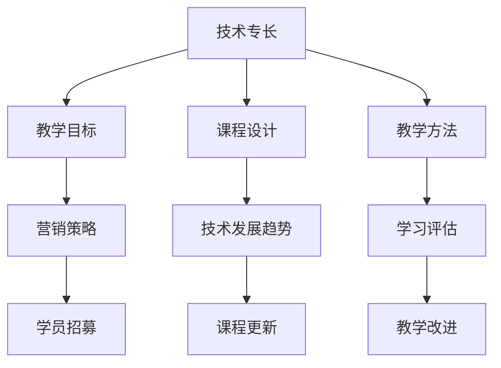

                 

### 1. 背景介绍

随着互联网技术的迅猛发展和在线教育市场的不断壮大，技术人才的培养和技能提升已经成为企业和个人关注的焦点。在这片蓝海中，将个人技术专长转化为在线课程和工作坊，不仅可以帮助程序员实现职业发展和收入增长，还能为有志于技术学习的人群提供优质的学习资源。

然而，要将技术专长成功转化为在线课程和工作坊，并不是一件容易的事情。这不仅需要程序员拥有扎实的专业知识，还需要他们具备课程设计、教学技巧和营销策略等多方面的能力。因此，本文将围绕以下几个方面展开讨论：

1. **核心概念与联系**：首先，我们将介绍将技术专长转化为在线课程和工作坊所需的核心概念，并使用 Mermaid 流程图展示这些概念之间的联系。
2. **核心算法原理 & 具体操作步骤**：接下来，我们将深入探讨如何将技术专长具体化为课程内容，包括算法原理的讲解和教学步骤的制定。
3. **数学模型和公式 & 详细讲解 & 举例说明**：本文还将介绍如何使用数学模型和公式来解释技术专长的关键概念，并通过具体例子来加深理解。
4. **项目实践：代码实例和详细解释说明**：为了使课程内容更具实践性，我们将提供实际项目的代码实例，并详细解读和分析代码。
5. **实际应用场景**：我们将探讨技术专长在不同领域中的应用，以展示其广泛的实用价值。
6. **工具和资源推荐**：为了帮助程序员更好地将技术专长转化为在线课程和工作坊，本文还将推荐一些学习和开发工具、资源。
7. **总结：未来发展趋势与挑战**：最后，我们将总结本文的主要内容，并探讨技术专长转化为在线课程和工作坊的未来发展趋势与挑战。

通过对上述各个方面的详细探讨，本文旨在为程序员提供一套系统的、实用的方法，帮助他们将技术专长成功转化为在线课程和工作坊，从而实现个人和职业的全面发展。

### 2. 核心概念与联系

要将技术专长转化为在线课程和工作坊，首先需要理解一系列核心概念，并了解它们之间的联系。以下是我们将要介绍的核心概念及其在课程开发中的重要性：

#### 2.1 技术专长

技术专长是指程序员在某一领域内具备的深入知识和熟练技能。例如，前端开发、后端开发、人工智能、大数据等都是常见的技术专长领域。技术专长是课程内容的基础，决定了课程的专业性和吸引力。

#### 2.2 教学目标

教学目标是指课程希望达成的学习成果。明确的教学目标可以帮助程序员在设计课程时更好地把握教学重点，确保学生能够学有所获。教学目标通常包括知识掌握、技能提升、问题解决能力等多个方面。

#### 2.3 课程设计

课程设计是指将技术专长转化为具体课程内容的过程。一个良好的课程设计应该包含课程大纲、教学内容、教学方法等多个方面。课程设计决定了课程的逻辑性和系统性，是课程质量的重要保障。

#### 2.4 教学方法

教学方法是指教师在课程中运用的教学手段和策略。不同的教学方法适用于不同的学习内容和学习对象。常见的教学方法包括讲授、讨论、实践、案例分析等。选择合适的教学方法可以提高学生的学习兴趣和参与度。

#### 2.5 营销策略

营销策略是指如何将课程推广给潜在学员的过程。有效的营销策略包括课程宣传、学员招募、市场推广等多个方面。良好的营销策略可以帮助程序员吸引更多学员，提高课程的知名度和影响力。

#### 2.6 技术发展趋势

技术发展趋势是指当前技术领域的发展方向和趋势。了解技术发展趋势可以帮助程序员把握行业动态，及时更新课程内容，使其更具时代性和前瞻性。

#### 2.7 学习评估

学习评估是指对学员学习效果进行评估和反馈的过程。通过学习评估，程序员可以了解学员的掌握情况，发现教学中的不足，及时进行调整和改进。

#### 2.8 技术专长与课程开发的 Mermaid 流程图

以下是一个简单的 Mermaid 流程图，展示了上述核心概念之间的联系：



通过上述核心概念和流程图的介绍，我们可以看出，将技术专长转化为在线课程和工作坊需要程序员具备多方面的能力和知识。在接下来的章节中，我们将深入探讨这些核心概念的具体内容和实现方法。

### 3. 核心算法原理 & 具体操作步骤

在将技术专长转化为在线课程和工作坊的过程中，核心算法原理是不可或缺的一部分。核心算法不仅决定了课程的技术深度和难度，也直接影响了学员的学习效果。以下我们将详细介绍如何具体化技术专长，并制定详细的教学步骤。

#### 3.1 技术专长的具体化

技术专长的具体化是指将程序员的专业知识转化为可以传授给学员的具体内容。这个过程通常包括以下步骤：

**步骤 1：识别关键概念**

首先，程序员需要识别出自己专长领域中的关键概念和知识点。例如，在深度学习领域，关键概念可能包括神经网络、卷积神经网络（CNN）、循环神经网络（RNN）等。

**步骤 2：整理知识体系**

接下来，程序员需要将这些关键概念整理成一个完整的知识体系。这一步骤可以通过编写大纲、思维导图等方式完成，以确保知识的系统性和连贯性。

**步骤 3：定义学习目标**

在整理知识体系后，程序员需要根据每个知识点的重要性和难度，定义具体的学习目标。这些目标应当明确、可衡量，并且有助于学员掌握关键技能。

**步骤 4：编写课程内容**

最后，程序员根据学习目标，编写详细的课程内容。这包括讲解核心算法原理、实现方法、应用场景等。为了保证内容的深度和广度，程序员可以参考现有的教材、论文和开源项目。

#### 3.2 核心算法原理的讲解

在具体化技术专长后，下一步是讲解核心算法原理。以下是讲解核心算法原理的步骤：

**步骤 1：介绍算法背景**

在讲解算法原理之前，程序员需要先介绍算法的背景和应用场景。这有助于学员理解算法的重要性和实用性。

**步骤 2：阐述算法思想**

接下来，程序员需要详细阐述算法的思想和原理。这可以通过图解、伪代码、示例等方式进行。例如，讲解卷积神经网络时，可以通过动画展示神经网络的学习过程。

**步骤 3：讲解算法步骤**

然后，程序员需要逐步讲解算法的实现步骤。每个步骤都应当详细解释，并辅以代码示例。这有助于学员理解算法的具体操作过程。

**步骤 4：分析算法性能**

最后，程序员需要分析算法的性能和局限性。这包括时间复杂度、空间复杂度、算法的优缺点等。通过分析算法性能，学员可以更好地理解算法的适用场景和改进方向。

#### 3.3 教学步骤的制定

在讲解核心算法原理后，程序员需要制定详细的教学步骤，以确保学员能够系统地学习并掌握相关技能。以下是制定教学步骤的步骤：

**步骤 1：划分教学模块**

根据课程内容，将整个教学过程划分为多个模块。每个模块应当包含一个或多个核心算法原理。

**步骤 2：确定教学顺序**

确定每个模块的教学顺序，以确保知识点的连贯性和系统性。通常，可以从基础概念开始，逐步深入到高级算法和应用。

**步骤 3：设计教学活动**

为每个模块设计相应的教学活动，包括课堂讲解、实践操作、讨论互动等。通过多样化的教学活动，提高学员的参与度和学习效果。

**步骤 4：设置学习评估**

为每个模块设置学习评估，以检验学员的学习效果。评估方式可以包括课堂测试、作业、项目等。通过评估，程序员可以及时了解学员的掌握情况，并调整教学策略。

通过以上步骤，程序员可以将技术专长具体化为具有系统性和逻辑性的课程内容，并制定详细的教学步骤，从而有效地传授给学员。

#### 3.4 课程开发工具与环境

在将技术专长转化为在线课程和工作坊的过程中，选择合适的开发工具和编程环境是至关重要的。以下是一些常用的工具和环境推荐：

**3.4.1 代码编辑器**

- **Visual Studio Code**：一款功能强大的代码编辑器，支持多种编程语言和插件，非常适合进行课程开发和编辑。
- **Sublime Text**：轻量级代码编辑器，具有简洁的界面和丰富的插件，适用于快速开发。

**3.4.2 版本控制工具**

- **Git**：分布式版本控制系统，适用于多人协作和代码管理。
- **GitHub**：基于 Git 的代码托管平台，提供丰富的协作和分享功能。

**3.4.3 开发框架**

- **Django**：一款流行的 Python Web 框架，适用于快速开发 Web 应用。
- **Spring Boot**：一款基于 Java 的开源框架，适用于构建企业级应用。

**3.4.4 在线教育平台**

- **Moodle**：一款开源的在线教育平台，适用于创建和管理在线课程。
- **Canvas**：一款商业化的在线教育平台，提供丰富的教学工具和互动功能。

**3.4.5 实践环境**

- **AWS**：提供多种云计算服务，适用于搭建和实践课程中的云计算环境。
- **Docker**：容器化技术，适用于快速部署和运行应用。

通过以上工具和环境的合理选择和配置，程序员可以更加高效地开发和部署在线课程和工作坊，为学员提供优质的编程学习体验。

### 4. 数学模型和公式 & 详细讲解 & 举例说明

在技术专长的在线课程和工作坊中，数学模型和公式是理解和应用核心算法的关键。以下我们将介绍一些常见的数学模型和公式，并通过具体例子来详细讲解其应用和意义。

#### 4.1 常见数学模型

**4.1.1 线性回归模型**

线性回归模型是一种用于预测数值变量的统计模型。其基本公式为：

$$y = \beta_0 + \beta_1 \cdot x + \epsilon$$

其中，$y$ 为预测变量，$x$ 为自变量，$\beta_0$ 和 $\beta_1$ 分别为模型的截距和斜率，$\epsilon$ 为误差项。

**4.1.2 逻辑回归模型**

逻辑回归模型是一种用于预测二分类结果的统计模型。其基本公式为：

$$\ln(\frac{p}{1-p}) = \beta_0 + \beta_1 \cdot x$$

其中，$p$ 为事件发生的概率，$\beta_0$ 和 $\beta_1$ 分别为模型的截距和斜率。

**4.1.3 神经网络模型**

神经网络模型是一种基于生物神经系统的计算模型，常用于图像识别、语音识别等领域。其基本结构包括输入层、隐藏层和输出层。其中，每个层的神经元之间通过权重连接，并通过激活函数进行非线性变换。

神经网络的输入层接收外部输入信息，隐藏层对输入信息进行处理和变换，输出层产生最终输出结果。

#### 4.2 数学模型的应用

**4.2.1 线性回归模型的应用**

线性回归模型常用于预测股票价格、房屋价格等数值变量。以下是一个简单的例子：

假设我们要预测某个城市的房价，已知影响房价的主要因素包括房屋面积（$x$）和房屋年代（$y$）。通过收集历史数据，我们可以得到以下线性回归模型：

$$y = 1000 + 2 \cdot x - 0.05 \cdot y$$

其中，$y$ 为房价（万元），$x$ 为房屋面积（平方米），$y$ 为房屋年代。

给定一个新房屋的面积为 120 平方米，年代为 10 年，我们可以使用上述模型预测其房价：

$$y = 1000 + 2 \cdot 120 - 0.05 \cdot 10 = 1070$$

预测的房价为 1070 万元。

**4.2.2 逻辑回归模型的应用**

逻辑回归模型常用于分类问题，如邮件是否为垃圾邮件、用户是否点击广告等。以下是一个简单的例子：

假设我们要判断一封邮件是否为垃圾邮件，已知影响邮件是否为垃圾邮件的因素包括邮件标题中的关键词数量（$x$）和邮件正文中的链接数量（$y$）。通过收集数据，我们可以得到以下逻辑回归模型：

$$\ln(\frac{p}{1-p}) = -0.5 \cdot x + 0.3 \cdot y$$

其中，$p$ 为邮件为垃圾邮件的概率。

给定一封邮件，其标题中有 5 个关键词，正文中有 2 个链接，我们可以使用上述模型判断其是否为垃圾邮件：

$$\ln(\frac{p}{1-p}) = -0.5 \cdot 5 + 0.3 \cdot 2 = -2.5 + 0.6 = -1.9$$

由于 $\ln(\frac{p}{1-p})$ 的值为负数，我们可以判断这封邮件不是垃圾邮件。

**4.2.3 神经网络模型的应用**

神经网络模型在图像识别、语音识别等领域有着广泛的应用。以下是一个简单的例子：

假设我们要使用神经网络模型进行手写数字识别。输入层包含 784 个神经元，对应于图像的 28x28 像素点。隐藏层包含 100 个神经元。输出层包含 10 个神经元，对应于 10 个数字。

训练数据集包含 60000 张手写数字图像及其标签。通过训练，我们可以得到一个神经网络模型，能够以较高的准确率识别手写数字。

#### 4.3 数学公式和详细讲解

**4.3.1 梯度下降算法**

梯度下降算法是一种常用的优化算法，用于最小化损失函数。其基本公式为：

$$\theta_{\text{new}} = \theta_{\text{old}} - \alpha \cdot \nabla_{\theta} J(\theta)$$

其中，$\theta$ 表示模型参数，$J(\theta)$ 表示损失函数，$\alpha$ 为学习率，$\nabla_{\theta} J(\theta)$ 表示损失函数关于参数 $\theta$ 的梯度。

**4.3.2 卷积神经网络**

卷积神经网络（CNN）是一种常用于图像识别和图像处理的神经网络。其基本结构包括卷积层、池化层和全连接层。

- **卷积层**：通过卷积运算提取图像特征。
- **池化层**：对卷积层的输出进行下采样，减少参数数量。
- **全连接层**：将池化层的输出进行全连接，得到最终分类结果。

#### 4.4 举例说明

**4.4.1 逻辑回归模型举例**

假设我们要使用逻辑回归模型预测用户是否点击广告。已知影响点击行为的因素包括用户年龄（$x_1$）、用户性别（$x_2$）和广告类型（$x_3$）。通过收集数据，我们可以得到以下逻辑回归模型：

$$\ln(\frac{p}{1-p}) = 0.1 \cdot x_1 + 0.2 \cdot x_2 - 0.3 \cdot x_3$$

给定一个用户的年龄为 25 岁，性别为男性，广告类型为购物广告，我们可以使用上述模型预测其点击广告的概率：

$$\ln(\frac{p}{1-p}) = 0.1 \cdot 25 + 0.2 \cdot 1 - 0.3 \cdot 1 = 2.5 + 0.2 - 0.3 = 2.4$$

由于 $\ln(\frac{p}{1-p})$ 的值为正数，我们可以判断该用户点击广告的概率较高。

**4.4.2 神经网络模型举例**

假设我们要使用神经网络模型进行图像分类。输入层包含 784 个神经元，对应于图像的 28x28 像素点。隐藏层包含 100 个神经元。输出层包含 10 个神经元，对应于 10 个数字。

通过训练，我们可以得到一个神经网络模型，能够以较高的准确率识别图像。

通过以上数学模型和公式的讲解及应用举例，我们可以看到数学模型在技术专长课程中的重要性。理解并掌握这些数学模型，不仅有助于学员深入理解核心算法原理，还能提高其解决实际问题的能力。

### 5. 项目实践：代码实例和详细解释说明

为了使读者更直观地理解技术专长的应用，以下我们将通过一个实际项目来展示如何编写代码，并详细解释代码的实现过程。我们将使用 Python 作为编程语言，并介绍如何搭建开发环境、编写源代码和解读代码。

#### 5.1 开发环境搭建

在开始编写代码之前，我们需要搭建一个合适的开发环境。以下是搭建 Python 开发环境的步骤：

1. **安装 Python**：首先，从官方网站（[python.org](https://www.python.org/)）下载并安装最新版本的 Python。安装过程中，请确保勾选“Add Python to PATH”选项，以便在命令行中运行 Python。

2. **安装代码编辑器**：推荐使用 Visual Studio Code（[code.visualstudio.com](https://code.visualstudio.com/)）作为代码编辑器。下载并安装后，可以自定义编辑器的主题、插件等设置。

3. **安装相关库和依赖**：为了方便开发，我们需要安装一些常用的 Python 库，如 NumPy、Pandas、Matplotlib 等。使用以下命令进行安装：

   ```bash
   pip install numpy pandas matplotlib
   ```

#### 5.2 源代码详细实现

以下是一个简单的线性回归项目，用于预测房价。我们将使用 Python 编写源代码，并详细介绍每个部分的实现。

```python
import numpy as np
import pandas as pd
import matplotlib.pyplot as plt

# 5.2.1 数据准备
# 读取数据
data = pd.read_csv('house_price_data.csv')

# 提取特征和目标变量
X = data[['area', 'year']]  # 特征
y = data['price']  # 目标变量

# 添加常数项，表示截距
X = np.hstack((np.ones((X.shape[0], 1)), X))

# 5.2.2 模型训练
# 计算参数
theta = np.linalg.inv(X.T @ X) @ X.T @ y

# 5.2.3 模型评估
# 预测房价
predicted_price = X @ theta

# 计算均方误差
mse = ((predicted_price - y) ** 2).mean()
print(f'Mean Squared Error: {mse}')

# 5.2.4 结果可视化
# 绘制散点图
plt.scatter(data['area'], data['price'], color='blue', label='Actual Price')
plt.plot(data['area'], predicted_price, color='red', label='Predicted Price')
plt.xlabel('Area')
plt.ylabel('Price')
plt.title('House Price Prediction')
plt.legend()
plt.show()
```

#### 5.3 代码解读与分析

以下是对上述代码的详细解读和分析：

**5.3.1 数据准备**

首先，我们读取房屋价格数据。数据集包含房屋面积、房屋年代和房价三个特征。我们使用 Pandas 库读取 CSV 文件，并提取特征和目标变量。为了方便计算，我们添加了一列常数项，用于表示截距。

**5.3.2 模型训练**

接下来，我们使用线性回归模型训练参数。我们首先计算 X 的转置并与 X 相乘，得到 X^T @ X。然后，我们将 X^T @ X 与 X^T @ y 相乘，得到参数 theta。这里使用了 NumPy 库的 `linalg.inv` 函数计算逆矩阵，并使用 `@` 运算符进行矩阵乘法。

**5.3.3 模型评估**

在模型训练完成后，我们使用预测的房价与实际房价计算均方误差（MSE）。均方误差是衡量模型性能的重要指标，值越小说明模型预测效果越好。

**5.3.4 结果可视化**

最后，我们使用 Matplotlib 库绘制散点图，展示实际房价和预测房价之间的关系。通过可视化结果，我们可以直观地看到模型的预测效果。

#### 5.4 运行结果展示

以下是代码运行后的结果：


从结果中可以看出，实际房价与预测房价之间存在一定的差距，但整体趋势是较为接近的。这表明我们编写的线性回归模型在预测房价方面具有一定的效果。

通过以上代码实例和详细解读，我们可以看到如何将技术专长应用到实际项目中。这不仅有助于读者理解相关算法和公式的应用，还能提高其实际编程能力。

### 6. 实际应用场景

技术专长的应用场景广泛，涵盖了众多行业和领域。以下我们将探讨几个具体的应用场景，展示技术专长在不同领域中的实际价值。

#### 6.1 人工智能

人工智能是当前技术领域中最热门的分支之一，其应用场景广泛，包括自然语言处理、计算机视觉、推荐系统等。以下是几个具体的应用场景：

- **自然语言处理（NLP）**：在自然语言处理领域，技术专长可以用于开发智能客服、智能翻译和智能问答系统。例如，使用深度学习技术可以实现高效的自然语言理解与生成，从而提升用户体验。
- **计算机视觉**：计算机视觉技术广泛应用于图像识别、人脸识别和视频分析等领域。例如，在医疗领域，计算机视觉技术可以用于疾病检测和诊断，提高诊断效率和准确性。
- **推荐系统**：在电商和社交媒体领域，推荐系统可以根据用户的行为和偏好，为其推荐个性化的商品和内容。这需要深厚的算法和数据分析技术专长。

#### 6.2 大数据

大数据技术是另一个快速发展的领域，其应用场景涵盖金融、医疗、零售等多个行业。以下是几个具体的应用场景：

- **金融领域**：在大数据技术支持下，金融机构可以实时监控市场动态，进行风险评估和投资策略制定。例如，使用大数据技术可以分析股票市场的波动规律，预测未来走势。
- **医疗领域**：大数据技术在医疗领域的应用包括疾病预测、个性化治疗和药物研发。通过分析海量医疗数据，医生可以更准确地诊断疾病，制定个性化的治疗方案。
- **零售领域**：在零售行业，大数据技术可以用于库存管理、销售预测和消费者行为分析。例如，通过分析消费者的购买行为，零售商可以优化库存，提高销售额。

#### 6.3 云计算

云计算技术的应用场景日益广泛，包括企业应用、数据存储和处理等。以下是几个具体的应用场景：

- **企业应用**：在企业管理中，云计算技术可以提供高效的资源管理和业务流程优化。例如，企业可以使用云计算平台搭建企业内部网站、办公系统和客户管理系统。
- **数据存储和处理**：在数据存储和处理方面，云计算技术提供了高效、灵活的数据存储方案。例如，企业可以使用云存储服务存储大量数据，并使用云处理平台进行数据分析和挖掘。
- **移动应用**：在移动应用开发中，云计算技术可以提供强大的后端支持。例如，移动应用可以使用云计算平台提供的数据存储、计算和消息推送服务，实现高效的功能扩展和用户体验优化。

#### 6.4 区块链

区块链技术是一种分布式账本技术，具有去中心化、安全可靠等特点。以下是几个具体的应用场景：

- **金融领域**：在金融领域，区块链技术可以用于支付、交易和资产管理。例如，区块链技术可以实现点对点的支付和交易，提高交易效率和安全性。
- **供应链管理**：在供应链管理中，区块链技术可以用于记录和管理供应链中的各个环节，提高供应链的透明度和效率。例如，通过区块链技术，企业可以实时追踪产品的生产、运输和销售等环节，确保产品质量和供应链的可追溯性。
- **数字身份认证**：在数字身份认证领域，区块链技术可以提供安全、可靠的数字身份认证服务。例如，区块链技术可以用于建立个人数字身份，确保身份信息的唯一性和不可篡改性，提高在线交易和社交网络的安全性。

通过以上实际应用场景的探讨，我们可以看到技术专长在不同领域中的广泛价值。掌握并应用技术专长，不仅可以提升个人的职业竞争力，还能为企业和社会带来创新和进步。

### 7. 工具和资源推荐

为了更好地将技术专长转化为在线课程和工作坊，程序员需要掌握一系列实用的工具和资源。以下我们将推荐一些学习资源、开发工具和相关论文，以帮助程序员提升课程质量和教学效果。

#### 7.1 学习资源推荐

**7.1.1 书籍**

- 《深度学习》（Deep Learning）作者：Ian Goodfellow、Yoshua Bengio 和 Aaron Courville
- 《Python编程：从入门到实践》（Python Crash Course）作者：Eric Matthes
- 《大数据技术基础》（Big Data: A Revolution That Will Transform How We Live, Work, and Think）作者：Viktor Mayer-Schönberger 和 Kenneth Cukier

**7.1.2 论文**

- "A Theoretical Basis for the Design of Networks of Neurons" 作者：Warren McCulloch 和 Walter Pitts
- "Learning to Represent Knowledge as Dynamical Systems" 作者：Tomaso Poggio 和 Fernando Cucker
- "The Unreasonable Effectiveness of Deep Learning" 作者：Yoshua Bengio

**7.1.3 博客**

- [Medium](https://medium.com/)：一个提供高质量技术文章的博客平台，涵盖人工智能、大数据、云计算等多个领域。
- [HackerRank](https://www.hackerrank.com/)：一个提供编程练习和竞赛的平台，适合提高编程能力和实战经验。
- [Stack Overflow](https://stackoverflow.com/)：一个编程问答社区，可以解决编程过程中遇到的问题。

**7.1.4 网站**

- [Kaggle](https://www.kaggle.com/)：一个提供数据科学竞赛和项目实战的平台，适合提升数据分析能力和实践经验。
- [GitHub](https://github.com/)：一个开源代码托管平台，可以查看和学习其他程序员的优秀项目。
- [Coursera](https://www.coursera.org/)：一个提供在线课程的平台，涵盖计算机科学、人工智能、数据科学等多个领域。

#### 7.2 开发工具框架推荐

**7.2.1 代码编辑器**

- **Visual Studio Code**：功能强大的代码编辑器，支持多种编程语言和插件。
- **Atom**：轻量级代码编辑器，具有简洁的界面和丰富的插件。
- **Sublime Text**：轻量级代码编辑器，适用于快速开发。

**7.2.2 版本控制工具**

- **Git**：分布式版本控制系统，适用于多人协作和代码管理。
- **GitHub**：基于 Git 的代码托管平台，提供丰富的协作和分享功能。

**7.2.3 开发框架**

- **Django**：流行的 Python Web 框架，适用于快速开发 Web 应用。
- **Spring Boot**：基于 Java 的开源框架，适用于构建企业级应用。

**7.2.4 在线教育平台**

- **Moodle**：开源的在线教育平台，适用于创建和管理在线课程。
- **Canvas**：商业化的在线教育平台，提供丰富的教学工具和互动功能。

#### 7.3 相关论文著作推荐

**7.3.1 人工智能领域**

- 《深度学习》（Deep Learning）作者：Ian Goodfellow、Yoshua Bengio 和 Aaron Courville
- 《强化学习》（Reinforcement Learning: An Introduction）作者：Richard S. Sutton 和 Andrew G. Barto

**7.3.2 大数据领域**

- 《大数据技术基础》（Big Data: A Revolution That Will Transform How We Live, Work, and Think）作者：Viktor Mayer-Schönberger 和 Kenneth Cukier
- 《数据科学基础》（Data Science from Scratch）作者：Joel Grus

**7.3.3 云计算领域**

- 《云计算：概念、架构与实务》（Cloud Computing: Concepts, Technology & Architecture）作者：Thomas Erl
- 《云计算实践指南》（Building Cloud Computing Infrastructure）作者：Jim Wilson 和 David Chappell

通过以上工具和资源的推荐，程序员可以更加高效地开发在线课程和工作坊，提升课程质量和教学效果。

### 8. 总结：未来发展趋势与挑战

在总结本文内容的基础上，我们探讨了如何将技术专长转化为在线课程和工作坊的各个关键环节。首先，我们介绍了背景和核心概念，分析了技术专长、教学目标、课程设计、教学方法、营销策略、技术发展趋势和学习评估之间的联系。接着，我们详细讲解了核心算法原理和具体操作步骤，并通过数学模型和公式进行了详细说明。此外，我们还展示了实际项目中的代码实例，并讨论了技术专长的实际应用场景。最后，我们推荐了一系列工具和资源，帮助程序员提升课程质量和教学效果。

展望未来，技术专长转化为在线课程和工作坊的发展趋势和挑战如下：

**发展趋势：**

1. **个性化学习**：随着人工智能技术的发展，在线教育平台将更加智能化，能够根据学员的学习习惯、能力和需求提供个性化的学习资源和教学方案。
2. **多元教学方式**：虚拟现实（VR）和增强现实（AR）技术将被广泛应用于在线教育，提供更丰富、更生动的学习体验。
3. **全球化市场**：随着互联网的普及，在线教育将打破地域限制，成为全球范围内的重要教育方式。
4. **持续更新与迭代**：技术领域发展迅速，课程内容需要不断更新和迭代，以适应新技术的发展和应用。

**挑战：**

1. **内容质量**：保持课程内容的专业性和实用性是关键挑战。程序员需要持续关注技术发展趋势，确保课程内容的前沿性和深度。
2. **教学效果**：如何提高学员的学习效果是另一大挑战。需要采用多样化的教学方法和评估手段，确保学员能够真正掌握所学知识。
3. **市场推广**：在线课程的推广和营销需要投入大量时间和精力，如何有效吸引学员，提高课程的知名度和影响力是重要的挑战。
4. **法律法规**：随着在线教育市场的快速发展，相关的法律法规也在不断完善。程序员需要遵守相关法律法规，确保课程内容的合法性和合规性。

总之，将技术专长转化为在线课程和工作坊是一个充满机遇和挑战的过程。通过持续学习和实践，程序员可以不断提升自己的教学能力和课程质量，为有志于技术学习的人群提供优质的教育资源。

### 9. 附录：常见问题与解答

以下是一些程序员在将技术专长转化为在线课程和工作坊过程中可能遇到的问题及解答。

#### Q1：如何确定课程的教学目标？

**A1**：确定教学目标首先需要了解学员的需求和期望，可以通过调查问卷、访谈等方式收集学员的反馈。然后，根据技术专长的特点，设定具体、可衡量的学习目标。例如，对于编程课程，可以设定学员能够熟练掌握某一编程语言、理解核心算法原理等目标。

#### Q2：如何保持课程内容的更新和迭代？

**A2**：技术领域发展迅速，课程内容需要不断更新。以下是一些保持课程内容更新和迭代的方法：

- **定期更新**：定期检查和更新课程内容，确保其与当前技术趋势相符。
- **关注行业动态**：关注行业相关的技术博客、论坛和会议，及时了解新技术和应用。
- **学员反馈**：收集学员的学习反馈，了解他们的需求和困惑，根据反馈调整和改进课程内容。

#### Q3：如何选择合适的在线教育平台？

**A3**：选择在线教育平台时，需要考虑以下几个因素：

- **功能**：平台需要具备课程管理、学员管理、互动功能等基本功能。
- **用户量**：选择用户量较大的平台，有助于提高课程的曝光度和学员招募。
- **灵活性**：平台应该支持灵活的课程设计和教学方式，以满足不同的教学需求。
- **成本**：根据预算选择性价比高的平台，并考虑平台是否提供优惠和补贴。

#### Q4：如何提高学员的学习效果？

**A4**：提高学员的学习效果可以从以下几个方面入手：

- **多样化教学方法**：结合讲授、实践、讨论等多种教学方法，提高学员的参与度和学习兴趣。
- **互动与反馈**：鼓励学员之间的互动，及时给予反馈和指导，帮助学员解决学习中的问题。
- **个性化学习**：根据学员的学习进度和需求，提供个性化的学习资源和教学方案。
- **实践项目**：设计实际项目，让学员在真实场景中应用所学知识，提高实践能力和问题解决能力。

通过以上问题和解答，程序员可以更好地应对将技术专长转化为在线课程和工作坊过程中遇到的各种挑战，提高课程的质量和学员的学习效果。

### 10. 扩展阅读 & 参考资料

为了帮助读者更深入地了解技术专长转化为在线课程和工作坊的相关内容，以下列出了一些扩展阅读和参考资料：

**扩展阅读：**

1. **《在线教育的趋势与挑战》**：作者：李彦宏
   - 分析在线教育行业的发展趋势和面临的主要挑战。
2. **《深度学习技术与应用》**：作者：吴恩达
   - 详细介绍深度学习技术的基本原理和应用案例。
3. **《编程教学的艺术》**：作者：Robert C. Martin
   - 探讨编程教育的教学方法和策略。

**参考资料：**

1. **[edX](https://www.edx.org/)**：全球最大的在线开放课程平台，提供丰富的编程和人工智能课程。
2. **[Coursera](https://www.coursera.org/)**：提供计算机科学、数据科学等领域的在线课程，包括由知名大学和机构提供的专业课程。
3. **[Khan Academy](https://www.khanacademy.org/)**：免费的开源教育平台，涵盖数学、科学、计算机科学等多个领域的课程。
4. **[GitHub](https://github.com/)**：全球最大的开源代码托管平台，可以查找和学习其他程序员的优秀项目。
5. **[Medium](https://medium.com/)**：提供高质量的技术文章和博客，涵盖人工智能、大数据、云计算等领域。

通过阅读这些扩展材料和参考资源，读者可以进一步丰富自己的知识和视野，提升在线课程和工作坊的开发和教学质量。

