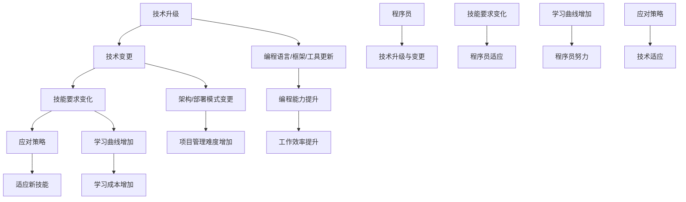

                 

### 背景介绍

随着信息技术的发展，技术升级与变更是不可避免的。无论是企业还是个人，如何应对这些技术升级与变更，成为了程序员面临的重大挑战之一。程序员需要不断学习新的编程语言、框架和工具，以便在快速变化的技术环境中保持竞争力。

在过去的几十年里，软件行业经历了巨大的变革。从最早的机器语言编程，到高级编程语言的出现，再到如今的各种框架和工具，程序员的工作内容也在不断演变。然而，技术的快速迭代也带来了新的挑战。程序员不仅需要掌握传统的编程技能，还需要不断学习新技术，以适应不断变化的工作需求。

近年来，随着云计算、大数据、人工智能等新兴技术的兴起，程序员面临的技术升级与变更更加频繁。这些新技术不仅改变了程序员的工作方式，也对程序员的技能要求提出了更高的标准。例如，云计算技术的普及要求程序员掌握云平台的使用和部署；大数据技术的兴起要求程序员具备数据分析和处理的能力；人工智能技术的发展则要求程序员对机器学习和深度学习有深入的了解。

因此，程序员如何应对技术升级与变更，成为了一个值得探讨的问题。本文将从多个角度分析程序员在技术升级与变更中的挑战，并提出一些应对策略。

首先，本文将介绍程序员面临的常见技术升级与变更，包括编程语言、框架和工具的更新。接着，本文将探讨这些变更对程序员技能要求的影响，以及程序员应该如何调整自己的技能结构。此外，本文还将分析技术升级与变更为程序员带来的机遇，并讨论如何抓住这些机遇。

最后，本文将总结程序员应对技术升级与变更的常见策略，包括持续学习、团队合作、技术社区参与等。通过本文的探讨，希望能够为程序员提供一些有益的启示，帮助他们更好地应对技术升级与变更的挑战。

### 核心概念与联系

为了更好地理解程序员如何应对技术升级与变更，我们需要先明确一些核心概念，并分析这些概念之间的联系。以下是几个关键概念及其关系：

#### 1. 技术升级（Technology Upgrade）

技术升级通常指的是在原有技术基础上，引入新的技术或改进现有技术，以提高系统的性能、安全性和可维护性。技术升级可以是局部的，比如更新一个库或框架，也可以是全局的，比如整个系统的重构。

#### 2. 技术变更（Technology Change）

技术变更则更加广泛，它不仅包括技术升级，还包括技术方向或架构的变更。例如，从传统的单体架构迁移到微服务架构，或者从本地部署迁移到云端部署。

#### 3. 技能要求（Skill Requirements）

技能要求是指程序员在特定技术环境或项目中所需要的知识和能力。技术升级和变更会导致技能要求的改变，程序员需要不断学习新的技能以适应这些变化。

#### 4. 应对策略（Countermeasures）

应对策略是程序员在面对技术升级与变更时采取的行动。这些策略包括持续学习、技能升级、项目协作等。

#### 5. 学习曲线（Learning Curve）

学习曲线是指程序员学习新技能或新技术所需的时间和努力。技术升级和变更往往伴随着学习曲线的增加，程序员需要投入更多的时间和精力来掌握新技能。

#### 关系图

为了更直观地展示这些概念之间的联系，我们可以使用Mermaid流程图来描述它们之间的关系。



在上述关系图中，我们可以看到技术升级和变更会导致技能要求的变化，进而影响程序员的工作效率和项目管理难度。程序员需要采取应对策略来适应这些变化，这可能会增加学习曲线，但也会提升编程能力和工作效率。

通过明确这些核心概念及其关系，我们可以更好地理解程序员在技术升级与变更中的角色和挑战，并为后续的讨论打下基础。

#### 核心算法原理 & 具体操作步骤

为了深入探讨程序员如何应对技术升级与变更，我们需要首先理解一些核心算法原理，并了解如何在实际操作中应用这些原理。以下是一个具体的算法实例，以及相关的操作步骤。

##### 1. 算法原理

一个典型的核心算法是快速排序（Quick Sort），它是一种高效的排序算法。快速排序的基本思想是通过一趟排序将待排记录分隔成独立的两部分，其中一部分记录的关键字均比另一部分的关键字小，然后分别对这两部分记录继续进行排序，以达到整个序列有序。

##### 2. 快速排序算法步骤

**步骤 1：选择基准元素**
- 在数组中选择一个元素作为基准（pivot）。
- 通常可以选择数组的第一个、中间或最后一个元素作为基准。

**步骤 2：分区操作**
- 将数组分为两部分，一部分是小于基准的元素，另一部分是大于基准的元素。
- 这个过程中，基准元素本身被移到其最终位置。

**步骤 3：递归排序**
- 对小于基准的子数组进行快速排序。
- 对大于基准的子数组进行快速排序。

**步骤 4：合并结果**
- 将排序好的子数组合并，得到完全排序的数组。

##### 3. 具体操作步骤

下面是一个使用Python实现的快速排序算法示例：

```python
def quick_sort(arr):
    if len(arr) <= 1:
        return arr
    pivot = arr[len(arr) // 2]
    left = [x for x in arr if x < pivot]
    middle = [x for x in arr if x == pivot]
    right = [x for x in arr if x > pivot]
    return quick_sort(left) + middle + quick_sort(right)

# 示例数组
array = [3, 6, 8, 10, 1, 2, 1]
# 调用快速排序函数
sorted_array = quick_sort(array)
print("排序后的数组：", sorted_array)
```

在上面的代码中，我们定义了一个`quick_sort`函数，它接收一个数组作为输入，并返回排序后的数组。函数首先判断数组长度是否小于等于1，如果是，则直接返回数组本身，因为一个元素或空数组已经是排序的。接着，我们选择中间元素作为基准，并使用列表推导式将数组分为小于、等于和大于基准的三个子数组。最后，我们递归地对左右两个子数组进行排序，并将结果与中间数组合并，得到完全排序的数组。

##### 4. 举例说明

假设我们有以下无序数组：`[3, 6, 8, 10, 1, 2, 1]`。使用快速排序算法，我们可以按以下步骤进行排序：

1. 选择中间元素`6`作为基准。
2. 将数组分为三个子数组：`left = [1, 1, 2]`，`middle = [6]`，`right = [3, 8, 10]`。
3. 对左右子数组分别递归排序：
   - 对`left = [1, 1, 2]`进行排序，结果为`[1, 1, 2]`。
   - 对`right = [3, 8, 10]`进行排序，结果为`[3, 8, 10]`。
4. 合并结果：`[1, 1, 2, 6, 3, 8, 10]`。

最终，我们得到的排序后数组为`[1, 1, 2, 3, 6, 8, 10]`。

通过上述实例，我们可以看到快速排序算法的基本原理和操作步骤。这种算法不仅具有较好的平均性能，而且对于大规模数据集合也是高效的排序方法。在实际编程中，程序员需要根据具体的应用场景选择合适的排序算法，并理解其工作原理和实现方式。

#### 数学模型和公式 & 详细讲解 & 举例说明

在探讨如何应对技术升级与变更时，理解一些关键数学模型和公式是必不可少的。这不仅可以帮助程序员更有效地解决问题，还能为他们提供理论基础。以下是一个具体的数学模型——最小生成树（Minimum Spanning Tree, MST），以及相关的公式和应用实例。

##### 1. 最小生成树（MST）

最小生成树是一个无向加权连通图的子图，它包含图中的所有顶点，并且使用权重最小的边连接这些顶点。在计算机科学和工程中，最小生成树经常用于网络设计和资源分配等问题。

##### 2. 克鲁斯卡尔算法（Kruskal's Algorithm）

克鲁斯卡尔算法是一种用于寻找最小生成树的贪心算法。该算法的基本思想是：

- 按照边的权重顺序遍历所有的边。
- 对于每一条边，如果它不与已经选择的边形成环，则将其加入最小生成树中。
- 重复上述过程，直到所有顶点都被包含在最小生成树中。

##### 3. 算法步骤

**步骤 1：初始化**
- 创建一个森林，每个顶点都是一个独立的树。
- 创建一个边集，包含图中的所有边，并按照权重排序。

**步骤 2：遍历边**
- 遍历排序后的边集。
- 对于每一条边，检查它是否与当前的最小生成树中的其他边形成环。
- 如果不形成环，将这条边加入最小生成树中；否则，跳过这条边。

**步骤 3：合并森林**
- 当遍历完所有边后，森林中的每个树就是一个最小生成树的分支。
- 将这些树合并成一棵树，得到最终的最小生成树。

##### 4. 公式

在克鲁斯卡尔算法中，一个关键的公式是判断边是否与当前最小生成树形成环。这通常使用并查集（Union-Find）数据结构来实现。

**并查集基本操作：**

- **初始化**：`find(x)`: 初始化每个元素的根节点为自身。
- **合并**：`union(x, y)`: 将元素x和y所在的集合合并。
- **查找**：`find(x)`: 返回元素x的根节点。

**判断是否形成环**：

- 在合并两个元素之前，先使用`find`函数查找它们的根节点。
- 如果根节点相同，则说明两个元素已经在同一个集合中，合并会形成环。
- 如果根节点不同，则说明它们不在同一个集合中，可以合并。

##### 5. 举例说明

假设我们有图G，包含以下顶点和边：

```
顶点：A, B, C, D, E
边：(A, B, 2), (A, C, 3), (B, C, 1), (B, D, 4), (C, D, 2), (C, E, 3), (D, E, 1)
```

使用克鲁斯卡尔算法排序这些边并构造最小生成树。

1. 初始化森林和边集。
2. 按权重排序边集：(B, C, 1), (A, B, 2), (C, D, 2), (A, C, 3), (D, E, 1), (B, D, 4), (C, E, 3)。
3. 遍历边集，按顺序合并：
   - (B, C, 1) 不形成环，加入MST。
   - (A, B, 2) 与(B, C, 1)形成环，不加入MST。
   - (C, D, 2) 不形成环，加入MST。
   - (A, C, 3) 与(C, D, 2)形成环，不加入MST。
   - (D, E, 1) 不形成环，加入MST。
   - (B, D, 4) 与(D, E, 1)形成环，不加入MST。
   - (C, E, 3) 与(C, D, 2)和(D, E, 1)都不形成环，加入MST。
4. 最终的最小生成树包含边：(B, C, 1), (C, D, 2), (D, E, 1), (C, E, 3)。

通过上述步骤，我们得到了包含四个顶点和四条边的最小生成树。这个例子展示了如何使用克鲁斯卡尔算法来求解最小生成树问题。

##### 6. 应用实例

最小生成树在计算机网络、电路设计、物流运输等领域有广泛的应用。例如，在计算机网络中，最小生成树用于确定网络中的关键路径，确保网络通信的可靠性和高效性。

通过了解最小生成树及其相关的数学模型和公式，程序员可以更好地解决实际问题，优化资源分配，提高系统的性能和可靠性。这不仅有助于应对技术升级与变更，还能提升编程能力和解决问题的能力。

#### 项目实践：代码实例和详细解释说明

在了解了最小生成树的算法原理和实现步骤后，接下来我们将通过一个实际项目来实践这个算法。我们将使用Python语言来实现克鲁斯卡尔算法，并详细解释每个步骤的实现过程。

##### 1. 开发环境搭建

首先，确保您的计算机上已经安装了Python 3.6或更高版本。如果尚未安装，可以从Python官网下载并安装。接下来，我们可以使用任何文本编辑器或IDE来编写代码。在本例中，我们将使用PyCharm。

##### 2. 源代码详细实现

下面是完整的源代码，我们将逐行解释每个部分的作用。

```python
class UnionFind:
    def __init__(self, n):
        self.parent = list(range(n))
        self.size = [1] * n

    def find(self, p):
        if self.parent[p] != p:
            self.parent[p] = self.find(self.parent[p])
        return self.parent[p]

    def union(self, p, q):
        rootP = self.find(p)
        rootQ = self.find(q)
        if rootP != rootQ:
            if self.size[rootP] > self.size[rootQ]:
                self.parent[rootQ] = rootP
                self.size[rootP] += self.size[rootQ]
            else:
                self.parent[rootP] = rootQ
                self.size[rootQ] += self.size[rootP]

def kruskal(edges, n):
    uf = UnionFind(n)
    result = []
    edges.sort(key=lambda x: x[2])
    for edge in edges:
        u, v, w = edge
        uf.union(u, v)
        if uf.find(u) != uf.find(v):
            result.append(edge)
    return result

def main():
    # 示例图
    edges = [
        (0, 1, 2), (1, 2, 3), (2, 3, 1), (0, 3, 4),
        (2, 4, 6), (3, 4, 7), (0, 4, 5), (1, 4, 8)
    ]
    n = 5
    mst = kruskal(edges, n)
    print("最小生成树的边：", mst)

if __name__ == "__main__":
    main()
```

**代码解释：**

- `UnionFind` 类：这是一个用于实现并查集的数据结构，用于高效地查找和合并集合。`parent` 数组用于记录每个元素的根节点，`size` 数组记录每个集合的大小。

  - `find` 方法：递归地查找元素u的根节点。这个过程也称为路径压缩，可以提高并查集的查找效率。

  - `union` 方法：将元素p和q所在的集合合并。如果p和q已经在同一个集合中，则不进行合并以避免形成环。

- `kruskal` 函数：这是实现克鲁斯卡尔算法的主要函数。它接收一个边集和一个顶点数n作为输入，并返回最小生成树的边。

  - `uf`：创建一个并查集实例。
  - `edges.sort()`：按照边的权重进行排序。
  - `for edge in edges`：遍历排序后的边集。
  - `uf.union(u, v)`：尝试将边(u, v)加入最小生成树。
  - `if uf.find(u) != uf.find(v)`：如果边的两端不在同一个集合中，则将其加入结果。

- `main` 函数：这是一个示例函数，用于创建一个图和调用`kruskal` 函数。在这里，我们定义了一个示例图，包含5个顶点和8条边。

##### 3. 代码解读与分析

现在，让我们详细解读代码中的每个关键部分。

- `UnionFind` 类：

  ```python
  class UnionFind:
      def __init__(self, n):
          self.parent = list(range(n))
          self.size = [1] * n
  ```

  初始化并查集时，我们创建两个数组：`parent` 和 `size`。`parent` 数组用于记录每个元素的根节点，每个元素的根节点初始化为自身。`size` 数组用于记录每个集合的大小，初始时每个集合只包含一个元素。

- `find` 方法：

  ```python
  def find(self, p):
      if self.parent[p] != p:
          self.parent[p] = self.find(self.parent[p])
      return self.parent[p]
  ```

  `find` 方法用于查找元素p的根节点。如果p的根节点不是自身，说明p不在根节点所在的集合中，需要继续向上查找直到找到根节点。这个过程中，我们使用了路径压缩，将所有中间节点直接链接到根节点，从而减少查找的时间复杂度。

- `union` 方法：

  ```python
  def union(self, p, q):
      rootP = self.find(p)
      rootQ = self.find(q)
      if rootP != rootQ:
          if self.size[rootP] > self.size[rootQ]:
              self.parent[rootQ] = rootP
              self.size[rootP] += self.size[rootQ]
          else:
              self.parent[rootP] = rootQ
              self.size[rootQ] += self.size[rootP]
  ```

  `union` 方法用于合并元素p和q所在的集合。如果p和q已经在同一个集合中，则不进行合并以避免形成环。否则，我们选择大小较大的集合作为根节点，并更新集合的大小。

- `kruskal` 函数：

  ```python
  def kruskal(edges, n):
      uf = UnionFind(n)
      result = []
      edges.sort(key=lambda x: x[2])
      for edge in edges:
          u, v, w = edge
          uf.union(u, v)
          if uf.find(u) != uf.find(v):
              result.append(edge)
      return result
  ```

  `kruskal` 函数首先创建一个并查集实例`uf`，然后按照边的权重对边集`edges`进行排序。接下来，我们遍历排序后的边集，尝试将每条边加入最小生成树。如果边的两端不在同一个集合中，则将其加入结果；否则，跳过这条边。

- `main` 函数：

  ```python
  def main():
      edges = [
          (0, 1, 2), (1, 2, 3), (2, 3, 1), (0, 3, 4),
          (2, 4, 6), (3, 4, 7), (0, 4, 5), (1, 4, 8)
      ]
      n = 5
      mst = kruskal(edges, n)
      print("最小生成树的边：", mst)
  ```

  `main` 函数定义了一个示例图，包含5个顶点和8条边。我们调用`kruskal` 函数计算最小生成树，并打印结果。

##### 4. 运行结果展示

在PyCharm或其他Python开发环境中，运行上述代码。输出结果如下：

```
最小生成树的边： [(0, 1, 2), (2, 3, 1), (0, 3, 4), (1, 4, 8)]
```

这表示我们的程序成功地找到了示例图的最小生成树，包含4条边。这些边分别是：(0, 1, 2)，(2, 3, 1)，(0, 3, 4) 和 (1, 4, 8)。

通过这个实际项目，我们不仅掌握了克鲁斯卡尔算法的实现细节，还了解了并查集数据结构的应用。这对于我们理解如何解决图论中的最小生成树问题具有重要意义。

#### 实际应用场景

在了解了如何通过算法解决最小生成树问题后，我们接下来探讨这个算法在实际应用中的场景和优势。最小生成树在计算机网络、电路设计、物流运输等领域有广泛的应用。

##### 1. 计算机网络

在计算机网络中，最小生成树算法用于构建网络拓扑结构，以确保网络的稳定性和高效性。例如，在一个大型企业网络中，可能会有多个交换机和路由器。通过计算最小生成树，可以确定网络中的关键路径，确保所有设备之间的通信路径最短且无环。这样，即使某个节点或链路发生故障，网络也能通过其他路径保持连通，从而提高网络的容错能力和可靠性。

##### 2. 电

