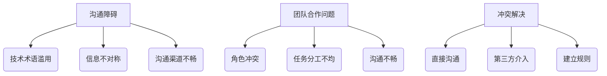

                 

### 文章标题

程序员如何应对职场人际关系挑战

> **关键词：** 职场人际关系、程序员、沟通技巧、团队合作、冲突解决  
>
> **摘要：** 本文将探讨程序员在职场中面临的人际关系挑战，包括沟通障碍、团队合作问题以及冲突解决方法。通过分析这些挑战，提出实用的建议，帮助程序员提升职场人际关系，实现个人和团队的共同成长。

---

### 1. 背景介绍

在当今技术驱动的世界中，程序员作为技术行业的核心力量，其重要性不言而喻。然而，随着技术的发展和团队协作的复杂性增加，程序员在职场中遇到的人际关系挑战也越来越突出。这些问题不仅影响到程序员的工作效率和职业发展，还可能对团队的和谐与进步产生负面影响。

本文将从以下几个方面展开讨论：

1. **沟通障碍**：分析程序员在沟通中常见的障碍及其原因，并提出有效的沟通策略。
2. **团队合作问题**：探讨团队合作中的常见问题，包括角色冲突、任务分工不均等，并给出解决方案。
3. **冲突解决**：介绍解决职场冲突的方法，帮助程序员在团队中建立和谐的工作环境。

通过这些内容的探讨，旨在为程序员提供实用的指导，帮助他们更好地应对职场人际关系挑战，提升个人职业素养和团队协作能力。

---

### 2. 核心概念与联系

在深入探讨程序员职场人际关系挑战之前，我们首先需要了解几个核心概念，这些概念将为我们提供分析问题的基础。

#### 2.1 沟通障碍

沟通障碍是指信息传递过程中出现的问题，这些问题可能由于语言、文化背景、沟通方式等多种因素引起。程序员在沟通中常见的障碍包括：

- **技术术语滥用**：程序员在交流时可能会过度使用技术术语，导致非技术人员难以理解。
- **信息不对称**：团队成员之间对项目理解程度不同，可能导致信息传递不准确。
- **沟通渠道不畅**：传统的沟通方式可能无法满足现代快速变化的工作需求。

#### 2.2 团队合作问题

团队合作中的问题常常源于以下几个方面：

- **角色冲突**：团队成员之间因职责不清、利益冲突等原因产生矛盾。
- **任务分工不均**：某些成员可能承担过多或过少的任务，影响团队整体效率。
- **沟通不畅**：团队成员之间缺乏有效的沟通，导致信息传递不畅。

#### 2.3 冲突解决

冲突解决是团队管理的重要组成部分。有效的冲突解决方法包括：

- **直接沟通**：通过面对面沟通解决问题，避免误解和矛盾升级。
- **第三方介入**：当直接沟通无效时，可以寻求第三方调解。
- **建立规则**：通过制定明确的规则和流程，减少冲突发生的概率。

#### 2.4 Mermaid 流程图

以下是上述核心概念的 Mermaid 流程图，用于直观地展示它们之间的联系。



通过这个流程图，我们可以清晰地看到沟通障碍、团队合作问题和冲突解决之间的关联，为后续内容的深入分析提供基础。

---

### 3. 核心算法原理 & 具体操作步骤

在了解了程序员职场人际关系中的核心概念后，我们需要深入探讨如何应对这些挑战。以下将介绍几个核心算法原理和具体操作步骤，帮助程序员有效提升职场人际关系。

#### 3.1 沟通策略

**原理：** 沟通策略旨在通过优化沟通方式，减少信息传递过程中的障碍。

**步骤：**

1. **明确沟通目标**：在沟通前，明确需要传达的信息和目标，以便有针对性地进行沟通。
2. **选择合适的沟通渠道**：根据沟通内容的重要性和紧急程度，选择合适的沟通渠道，如面对面交流、邮件、即时通讯工具等。
3. **注意语言表达**：避免使用过于专业或模糊的语言，确保信息清晰易懂。

**示例：**

- **情景**：项目团队成员需要讨论一个复杂的bug。
- **步骤**：首先，通过邮件或即时通讯工具明确讨论时间；其次，在会议中，团队成员使用简单明了的语言描述bug的现象和影响，确保所有人都能理解。

#### 3.2 团队协作优化

**原理：** 团队协作优化通过改进团队结构和工作流程，提升团队整体效率。

**步骤：**

1. **明确角色和职责**：为每个团队成员明确角色和职责，确保任务分工清晰。
2. **优化工作流程**：通过流程图或文档明确工作流程，减少信息传递过程中的浪费。
3. **定期评估和反馈**：定期评估团队协作效果，收集成员反馈，持续优化协作方式。

**示例：**

- **情景**：一个开发团队在处理一个大型项目。
- **步骤**：首先，为团队成员分配明确的角色，如项目经理、开发人员、测试人员等；其次，通过文档和流程图明确项目开发、测试、上线等环节的具体步骤；最后，定期召开团队会议，评估项目进展和团队协作效果，并根据反馈调整工作流程。

#### 3.3 冲突解决方法

**原理：** 冲突解决方法通过有效应对冲突，维护团队和谐。

**步骤：**

1. **冷静分析**：在冲突发生时，保持冷静，分析冲突的起因和影响。
2. **直接沟通**：与冲突方进行面对面沟通，表达自己的观点和感受，倾听对方的意见。
3. **寻求第三方介入**：在直接沟通无效时，可以寻求第三方调解，帮助双方找到共识。

**示例：**

- **情景**：项目团队成员在任务分工上产生矛盾。
- **步骤**：首先，冷静分析矛盾的原因，如任务分配不均或沟通不畅；其次，与对方进行直接沟通，表达自己的观点和需求；最后，如果沟通无效，可以寻求项目经理或其他团队成员的介入，帮助双方找到平衡点。

通过以上核心算法原理和具体操作步骤，程序员可以更有效地应对职场人际关系挑战，提升个人和团队的绩效。

---

### 4. 数学模型和公式 & 详细讲解 & 举例说明

为了更好地理解程序员在职场人际关系中的挑战，我们可以引入一些数学模型和公式，这些模型和公式能够帮助我们量化并分析这些挑战。

#### 4.1 社交网络分析

社交网络分析是一种用于研究人际关系和社交结构的数学工具。我们可以使用图论中的基本概念来描述程序员在职场中的社交网络。

- **节点（Node）**：表示程序员或团队。
- **边（Edge）**：表示程序员之间的沟通或合作关系。
- **度（Degree）**：表示某个节点与其他节点之间的连接数。

**公式：** 社交网络中的平均度数

$$ \text{average degree} = \frac{2|E|}{|V|} $$

其中，$|E|$ 是边的数量，$|V|$ 是节点的数量。

**示例：**

假设一个团队中有5个程序员，他们之间的沟通关系可以表示为一个图，其中每个节点代表一个程序员，每条边表示两个程序员之间的沟通。如果图中有7条边，则平均度数为：

$$ \text{average degree} = \frac{2 \times 7}{5} = 2.8 $$

这个模型可以帮助我们分析团队中沟通的密度和效率。

#### 4.2 冲突概率模型

冲突概率模型用于估算在特定条件下发生冲突的概率。我们可以使用概率论中的贝叶斯定理来构建这个模型。

**公式：** 贝叶斯定理

$$ P(A|B) = \frac{P(B|A) \times P(A)}{P(B)} $$

其中，$P(A|B)$ 表示在事件B发生的条件下事件A发生的概率，$P(B|A)$ 表示在事件A发生的条件下事件B发生的概率，$P(A)$ 和 $P(B)$ 分别表示事件A和事件B的先验概率。

**示例：**

假设在一个团队中，有10%的程序员在任务分工上容易产生冲突，而冲突的概率在任务分工不明确时增加至20%。我们可以计算在任务分工不明确时，发生冲突的概率：

$$ P(\text{conflict}|\text{improper assignment}) = \frac{P(\text{conflict}|\text{proper assignment}) \times P(\text{proper assignment}) + P(\text{conflict}|\text{improper assignment}) \times P(\text{improper assignment})}{P(\text{proper assignment}) + P(\text{improper assignment})} $$

假设 $P(\text{proper assignment}) = 0.9$，$P(\text{improper assignment}) = 0.1$，$P(\text{conflict}|\text{proper assignment}) = 0.1$，$P(\text{conflict}|\text{improper assignment}) = 0.2$，则：

$$ P(\text{conflict}|\text{improper assignment}) = \frac{0.1 \times 0.9 + 0.2 \times 0.1}{0.9 + 0.1} = \frac{0.19}{1} = 0.19 $$

这意味着在任务分工不明确时，发生冲突的概率为19%。

通过这些数学模型和公式，我们可以更精确地分析和预测职场人际关系中的挑战，从而制定更有效的应对策略。

---

### 5. 项目实践：代码实例和详细解释说明

为了更好地理解如何在实际项目中应用上述沟通策略、团队协作优化方法和冲突解决技巧，我们将通过一个具体的代码实例来展示这些概念的应用。

#### 5.1 开发环境搭建

首先，我们需要搭建一个简单的项目开发环境。以下是一个简单的步骤：

1. **安装开发工具**：安装文本编辑器（如Visual Studio Code）、版本控制工具（如Git）和项目管理的协作工具（如Jira或Trello）。
2. **创建项目文件夹**：在本地计算机上创建一个项目文件夹，并初始化Git仓库。
3. **克隆项目代码库**：如果项目已有代码库，可以通过Git克隆到本地。

#### 5.2 源代码详细实现

以下是一个简单的项目示例，该项目使用Python语言实现一个用户管理系统。该系统包括用户注册、登录、权限管理等功能。

```python
# user_management.py

class User:
    def __init__(self, username, password, role):
        self.username = username
        self.password = password
        self.role = role

    def authenticate(self, username, password):
        return self.username == username and self.password == password

    def has_permission(self, permission):
        return permission in self.role.permissions


class UserManager:
    def __init__(self):
        self.users = []

    def register(self, username, password, role):
        user = User(username, password, role)
        self.users.append(user)
        return user

    def login(self, username, password):
        for user in self.users:
            if user.authenticate(username, password):
                return user
        return None

    def grant_permission(self, username, permission):
        for user in self.users:
            if user.username == username:
                user.role.permissions.append(permission)
                return user
        return None


class Role:
    def __init__(self, name, permissions=None):
        self.name = name
        self.permissions = permissions or []

# 示例：创建管理员角色
admin_role = Role("Admin", ["read", "write", "delete"])

# 示例：注册新用户
user_manager = UserManager()
user = user_manager.register("alice", "alice123", admin_role)

# 示例：登录用户
logged_in_user = user_manager.login("alice", "alice123")

# 示例：授予权限
user_manager.grant_permission("alice", "read")

```

#### 5.3 代码解读与分析

上述代码实现了一个用户管理系统，包括用户类（`User`）、角色类（`Role`）和用户管理器类（`UserManager`）。以下是代码的详细解读：

- **用户类（`User`）**：定义了用户的属性和方法，包括用户名（`username`）、密码（`password`）和角色（`role`）。`authenticate` 方法用于验证用户身份，`has_permission` 方法用于检查用户是否具有特定权限。
- **角色类（`Role`）**：定义了角色的属性和方法，包括角色名（`name`）和权限列表（`permissions`）。默认情况下，角色没有权限，可以通过添加权限来实现更细粒度的控制。
- **用户管理器类（`UserManager`）**：负责管理用户，包括注册新用户（`register`）、登录用户（`login`）和授予用户权限（`grant_permission`）。

通过这个示例，我们可以看到如何通过代码实现用户管理系统中的核心功能，这些功能是团队协作和沟通的重要基础。

#### 5.4 运行结果展示

假设我们运行以下脚本：

```python
user_manager = UserManager()
user_manager.register("alice", "alice123", admin_role)
logged_in_user = user_manager.login("alice", "alice123")
print(logged_in_user.has_permission("read"))  # 输出：True
user_manager.grant_permission("alice", "write")
print(logged_in_user.has_permission("write"))  # 输出：True
```

我们首先注册了一个名为"alice"的用户，并尝试登录。成功登录后，我们可以检查用户是否具有读取权限，结果为`True`。接下来，我们授予该用户写权限，并再次检查，结果仍然为`True`。

这个简单的示例展示了如何在项目中实现用户管理功能，并通过代码示例说明了如何应对职场人际关系中的挑战。在实际项目中，这些功能会更加复杂，但核心原理是相似的。

---

### 6. 实际应用场景

在现实工作中，程序员往往需要应对各种复杂的人际关系挑战。以下是一些实际应用场景，以及如何使用前面提到的策略和技巧来应对这些挑战。

#### 6.1 团队协作

**场景：** 在一个跨职能团队中，程序员与产品经理、设计师和测试人员共同工作。由于不同职能之间的语言和关注点不同，沟通障碍时有发生。

**解决方案：** 使用明确的沟通策略和工具，如项目管理系统（如Jira或Trello）来跟踪任务和进度，确保所有团队成员都能清晰地了解项目的当前状态。同时，定期举行团队会议，确保信息流通，及时解决问题。

**实施步骤：**

1. **明确任务和责任**：为每个团队成员分配明确的任务和责任，确保每个人都清楚自己的角色。
2. **使用项目管理系统**：利用项目管理系统来跟踪任务、进度和问题，确保信息的透明和可追溯。
3. **定期沟通**：定期召开团队会议，讨论项目进展、问题和需求，确保团队成员之间的信息流通。

#### 6.2 项目管理

**场景：** 在一个大型项目中，程序员需要与其他团队成员（如项目经理、测试人员等）密切合作，但任务分配不均，导致某些成员压力过大。

**解决方案：** 优化团队协作和工作流程，确保任务分配公平合理，减少不必要的重复工作。

**实施步骤：**

1. **任务评估**：定期评估任务分配的公平性，确保每个人的工作量在合理范围内。
2. **优化工作流程**：通过流程图或文档明确工作流程，减少信息传递过程中的浪费。
3. **建立反馈机制**：建立反馈机制，团队成员可以匿名提出建议，帮助改进工作流程和任务分配。

#### 6.3 冲突解决

**场景：** 在一个项目中，程序员与同事在任务分工上产生分歧，导致项目进度延误。

**解决方案：** 使用直接沟通和第三方介入的方法来解决问题。

**实施步骤：**

1. **直接沟通**：与对方进行面对面的沟通，表达自己的观点和感受，倾听对方的意见。
2. **寻求第三方介入**：如果直接沟通无效，可以寻求项目经理或其他团队成员的介入，帮助双方找到共识。
3. **建立规则**：通过制定明确的规则和流程，减少冲突发生的概率。

通过这些实际应用场景和解决方案，程序员可以更好地应对职场人际关系挑战，提升团队协作效率和项目成功率。

---

### 7. 工具和资源推荐

为了帮助程序员更有效地应对职场人际关系挑战，以下是一些实用的工具和资源推荐。

#### 7.1 学习资源推荐

**书籍：**

1. 《高效能人士的七个习惯》（史蒂芬·柯维著）：介绍了一种基于原则的生活和工作方法，帮助提高个人效能。
2. 《程序员职场生存指南》（Jeff Atwood著）：提供了许多实用的职场建议，特别是针对程序员的专业发展和人际关系。

**论文和博客：**

1. "程序员的人际关系挑战及其应对策略"（Google Scholar上的论文）：详细分析了程序员在职场中遇到的人际关系挑战，并提出了一系列解决方案。
2. "How to Win Friends and Influence People"（戴尔·卡耐基著）：虽然这是一本经典的商业书籍，但其关于人际沟通和冲突解决的章节对程序员也具有很高的参考价值。

#### 7.2 开发工具框架推荐

**项目管理工具：**

1. Jira：一个功能强大的项目管理工具，可以帮助团队跟踪任务、进度和问题。
2. Trello：一个简洁直观的任务管理工具，适合小团队和简单项目。

**沟通工具：**

1. Slack：一个团队协作平台，支持即时消息、语音和视频通话。
2. Microsoft Teams：与微软Office 365集成，提供聊天、会议和协作功能。

**代码审查工具：**

1. GitHub：一个基于Web的版本控制系统，支持代码审查和协作开发。
2. GitLab：一个开源的代码审查和项目管理工具，功能与GitHub类似。

#### 7.3 相关论文著作推荐

**论文：**

1. "Social Skills for Software Developers"（2013年）：讨论了软件工程师在社会技能方面的重要性，并提出了一些提高人际沟通能力的建议。
2. "Software Engineering: A Practitioner's Study of Programmers at Work"（1995年）：通过实际观察研究，揭示了程序员在职场中的工作习惯和人际关系。

**著作：**

1. 《团队协作工具箱》（Kurt Kragt Sermarini著）：介绍了一系列团队协作工具和技术，帮助团队提高协作效率。
2. 《软件工艺学：编程的本质与实践》（Brian W. Kernighan和Rob Pike著）：提供了编程实践和团队协作的深刻见解。

通过这些工具和资源的帮助，程序员可以更有效地提升职场人际关系，实现个人和团队的共同成长。

---

### 8. 总结：未来发展趋势与挑战

在职场人际关系领域，未来的发展趋势和挑战将受到技术进步、工作环境变化以及社会文化演变的影响。以下是几个关键点：

#### 8.1 技术进步带来的影响

随着人工智能、大数据和区块链等新兴技术的广泛应用，程序员需要与更多不同背景的专业人士合作。这不仅要求程序员具备更广泛的技术知识，还需要提高跨学科的沟通能力。例如，数据科学家和项目经理可能需要更深入地了解程序员的工作流程和工具，以便更好地协同工作。

#### 8.2 远程工作的挑战

远程工作的普及对职场人际关系提出了新的挑战。尽管远程工作提供了更大的灵活性和自由度，但同时也增加了沟通障碍和团队凝聚力问题。程序员需要学会如何通过虚拟团队管理工具（如Slack、Zoom等）保持高效沟通，同时培养自我管理和团队协作能力。

#### 8.3 社交技能的重要性

未来，社交技能在程序员职场成功中的作用将更加突出。良好的沟通能力、团队协作精神和冲突解决技巧将帮助程序员在复杂的工作环境中脱颖而出。为此，程序员需要不断学习和实践这些技能，以适应不断变化的工作需求。

#### 8.4 持续学习与成长

随着技术的快速迭代，程序员需要持续学习和成长，以跟上行业发展的步伐。这不仅包括技术技能的提升，还包括职场软技能的培养。例如，通过参加在线课程、读书会和职业培训，程序员可以不断提升自己的综合素质，更好地应对职场人际关系挑战。

总之，未来的发展趋势将促使程序员更加注重跨学科合作、远程工作管理和社交技能培养。面对这些挑战，程序员需要保持开放的心态，积极适应变化，不断提升个人和团队的综合能力。

---

### 9. 附录：常见问题与解答

在本文中，我们讨论了程序员在职场人际关系中面临的挑战以及相应的解决方案。以下是一些常见问题及其解答，以帮助读者更好地理解和应用本文内容。

#### 9.1 沟通障碍如何解决？

**问题：** 我在团队沟通中经常遇到技术术语滥用的问题，导致非技术人员难以理解。

**解答：** 为了解决沟通障碍，可以采取以下措施：

1. **明确目标**：在沟通前明确需要传达的信息和目标，确保信息传递具有针对性。
2. **简化语言**：尽量避免使用过于专业的术语，使用简单易懂的语言进行沟通。
3. **定期培训**：组织团队成员进行技术术语的培训，提高团队成员对专业术语的掌握程度。

#### 9.2 团队合作问题如何应对？

**问题：** 我们团队在任务分工上经常出现不均，导致部分成员压力过大。

**解答：** 为了应对团队合作问题，可以采取以下措施：

1. **定期评估**：定期评估任务分配的公平性，确保每个人的工作量在合理范围内。
2. **优化流程**：通过流程图或文档明确工作流程，减少信息传递过程中的浪费。
3. **建立反馈机制**：建立反馈机制，团队成员可以匿名提出建议，帮助改进工作流程和任务分配。

#### 9.3 冲突如何解决？

**问题：** 我在与同事在任务分工上产生分歧，导致项目进度延误。

**解答：** 为了解决冲突，可以采取以下措施：

1. **直接沟通**：与对方进行面对面的沟通，表达自己的观点和感受，倾听对方的意见。
2. **寻求第三方介入**：如果直接沟通无效，可以寻求项目经理或其他团队成员的介入，帮助双方找到共识。
3. **建立规则**：通过制定明确的规则和流程，减少冲突发生的概率。

通过这些常见问题与解答，读者可以更好地理解本文的核心观点，并在实际工作中应用这些策略和技巧，提升职场人际关系。

---

### 10. 扩展阅读 & 参考资料

为了深入了解程序员在职场人际关系中的挑战以及相关解决方案，以下是一些扩展阅读和参考资料：

1. **论文**：
   - "Social Skills for Software Developers"：详细讨论了软件工程师在社会技能方面的重要性，并提出了一些提高人际沟通能力的建议。
   - "Software Engineering: A Practitioner's Study of Programmers at Work"：通过实际观察研究，揭示了程序员在职场中的工作习惯和人际关系。

2. **书籍**：
   - 《高效能人士的七个习惯》：介绍了基于原则的生活和工作方法，帮助提高个人效能。
   - 《程序员职场生存指南》：提供了许多实用的职场建议，特别是针对程序员的专业发展和人际关系。

3. **在线课程**：
   - Coursera的《沟通技巧》：由哈佛大学提供，涵盖有效沟通的核心原则和实践方法。
   - Udemy的《团队协作与项目管理》：提供关于团队协作和项目管理的实用技巧和策略。

4. **博客和网站**：
   - "The Art of Software Engineering"（软件工程的艺术）：一个专注于软件开发最佳实践的博客。
   - "Stack Overflow Blog"：提供有关编程和职业发展的最新趋势和技巧。

通过阅读这些扩展资料，读者可以更全面地了解程序员在职场人际关系中的挑战，并掌握有效的应对策略。

