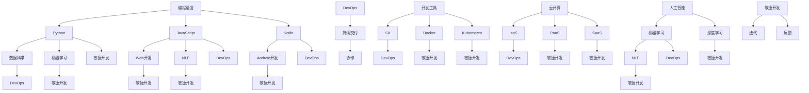

                 

### 背景介绍

在当今快速发展的技术时代，计算机编程行业正经历着前所未有的变革与转型。随着云计算、人工智能、大数据、物联网等新兴技术的不断涌现，程序员面临着前所未有的机遇与挑战。一方面，这些技术为程序员提供了更为丰富的工具和平台，使他们能够创造出更加复杂和高效的软件应用。另一方面，技术的快速迭代也要求程序员不断提升自己的技能和知识储备，以应对不断变化的市场需求。

从宏观层面来看，编程行业的变革主要体现在以下几个方面：

1. **编程语言和框架的演变**：随着技术的发展，新的编程语言和框架不断涌现，如Python、JavaScript、Kotlin等，这些语言和框架在特定领域展现出更高的效率和灵活性。

2. **开发工具的革新**：诸如Git、Docker、Kubernetes等工具的普及，使得软件开发过程更加高效和协作。

3. **云计算和容器技术的应用**：云计算和容器技术为企业提供了更加灵活和可扩展的计算资源，同时也推动了微服务架构和DevOps文化的兴起。

4. **人工智能的融合**：机器学习、深度学习等人工智能技术在编程领域的应用，使得软件能够更加智能地处理数据和优化算法。

然而，这些变革也为程序员带来了诸多挑战：

- **技能更新的压力**：新技术不断涌现，程序员需要不断学习新技能，以保持竞争力。
- **职业发展的不确定性**：技术的快速变化可能导致某些技能的过时，程序员需要具备一定的前瞻性，以适应行业的发展。
- **工作模式的变化**：远程办公、敏捷开发等新的工作模式对程序员的沟通能力和团队协作提出了更高的要求。

### 当前编程行业的变革趋势

1. **编程语言的发展**：

   编程语言的发展是编程行业变革的重要驱动力。近年来，Python、JavaScript等语言因其简单易学和强大的功能而广受欢迎。Python在数据科学和机器学习领域有着广泛的应用，而JavaScript则几乎无处不在，是前端开发的核心语言。Kotlin作为Android官方开发语言，也在移动应用开发中得到了广泛应用。

2. **云计算的普及**：

   云计算技术的普及为程序员提供了更加灵活和高效的开发环境。程序员可以利用云服务快速搭建开发环境、部署应用，并通过容器技术（如Docker）实现应用的轻量级部署和扩展。此外，云原生技术的发展也推动了微服务架构的普及，使得应用的开发和部署更加灵活和高效。

3. **人工智能的融合**：

   人工智能技术的发展，尤其是深度学习，正在改变程序员的工作方式。程序员可以通过使用机器学习库（如TensorFlow、PyTorch）来开发智能算法，实现自动化数据分析和决策支持。同时，AI技术的应用也要求程序员具备一定的数学和统计学知识。

4. **敏捷开发和DevOps**：

   敏捷开发和DevOps文化的兴起，推动了软件开发流程的优化和团队协作。程序员需要掌握敏捷开发的方法论，以及自动化测试和持续集成/持续部署（CI/CD）工具，以提高软件交付的效率和质量。

5. **远程办公的趋势**：

   随着远程办公的普及，程序员需要适应更加灵活的工作模式。这不仅要求程序员具备良好的自我管理和沟通能力，还需要掌握远程协作工具（如Slack、Zoom等）以提高团队协作效率。

综上所述，编程行业正经历着前所未有的变革和转型。程序员需要紧跟技术发展趋势，不断提升自己的技能和知识储备，以应对行业变革带来的挑战。在这篇文章中，我们将深入探讨编程行业的变革趋势，分析程序员如何应对这些变革，并提供一些建议和资源，帮助程序员在变革中找到自己的定位和发展方向。

### 核心概念与联系

在深入探讨编程行业的变革与转型之前，我们需要明确几个核心概念，并了解它们之间的联系。这些概念不仅是理解行业变革的基础，也是程序员在实际工作中需要掌握的关键技能和知识。

#### 1. 编程语言

编程语言是程序员用来编写程序的工具。不同的编程语言有其特定的用途和特点。例如：

- **Python**：Python以其简洁的语法和丰富的库，在数据科学、机器学习和Web开发中广受欢迎。
- **JavaScript**：JavaScript是Web开发的基石，几乎所有的Web应用都依赖于JavaScript。
- **Kotlin**：Kotlin是Android官方开发语言，以其互操作性、安全和简洁的特点被越来越多开发者所接受。

不同编程语言的选择取决于项目的需求、开发者的熟悉程度以及特定领域的应用。

#### 2. 开发工具

开发工具是提高程序员开发效率的重要手段。以下是一些常用的开发工具：

- **Git**：Git是版本控制系统的代表，用于管理代码版本，协作开发。
- **Docker**：Docker是一种容器化技术，用于打包、发布和运行应用，提供轻量级、可移植的运行环境。
- **Kubernetes**：Kubernetes是用于容器编排的分布式系统平台，用于自动化部署、扩展和管理容器化应用。

#### 3. 云计算

云计算为程序员提供了弹性的计算资源，使得开发、测试和部署过程更加高效。云计算的关键组件包括：

- **IaaS（基础设施即服务）**：如Amazon Web Services（AWS）、Microsoft Azure、Google Cloud Platform（GCP）等，提供了虚拟机、存储、数据库等服务。
- **PaaS（平台即服务）**：如Heroku、Google App Engine等，提供了完整的开发、运行环境，无需关心底层基础设施。
- **SaaS（软件即服务）**：如Salesforce、Google Workspace等，提供了基于云的软件应用，无需本地安装。

#### 4. 人工智能

人工智能技术在编程领域的应用正在改变程序员的工作方式。以下是一些关键的人工智能概念：

- **机器学习**：通过算法从数据中学习模式，进行预测和分类。
- **深度学习**：基于神经网络模型的学习方法，用于解决复杂的问题，如图像识别、自然语言处理等。
- **自然语言处理（NLP）**：使计算机能够理解和生成自然语言的技术，用于构建聊天机器人、翻译系统等。

#### 5. 敏捷开发与DevOps

敏捷开发和DevOps是现代软件开发的重要理念和方法论。它们强调快速迭代、持续交付和紧密的团队协作。

- **敏捷开发**：通过短周期的迭代和持续反馈，快速响应变化，提高软件交付质量。
- **DevOps**：通过将开发（Development）和运维（Operations）结合起来，实现更高效的软件开发、测试和部署流程。

#### Mermaid 流程图

为了更直观地展示这些核心概念和它们之间的联系，我们可以使用Mermaid流程图来表示：



通过上述Mermaid流程图，我们可以清晰地看到编程语言、开发工具、云计算、人工智能和敏捷开发与DevOps之间的联系。这些概念不仅是理解编程行业变革的基础，也是程序员在实际工作中需要熟练掌握的关键领域。

### 核心算法原理 & 具体操作步骤

在了解编程行业的核心概念之后，我们接下来探讨几个在当前编程行业变革中具有代表性的核心算法原理，并详细阐述这些算法的具体操作步骤。通过这些核心算法的学习和实践，程序员能够更好地应对行业变革带来的挑战。

#### 1. 深度学习算法

深度学习算法是当前人工智能领域的一个重要分支，尤其在图像识别、自然语言处理等方面取得了显著成果。以下是一个基于卷积神经网络（CNN）的简单图像分类算法：

**步骤1：数据预处理**

- **数据集准备**：收集并准备包含不同类别的图像数据集，如MNIST手写数字数据集。
- **图像缩放**：将图像缩放到统一尺寸，如28x28像素。
- **归一化**：将图像的像素值归一化到[0, 1]区间，以便神经网络处理。

**步骤2：构建神经网络模型**

- **卷积层**：使用卷积层提取图像特征，如使用5x5的卷积核，步长为1。
- **激活函数**：使用ReLU（Rectified Linear Unit）作为激活函数，增加模型训练的稳定性。
- **池化层**：使用2x2的最大池化层，减小特征图的尺寸。
- **全连接层**：在输出层使用全连接层进行分类，输出每个类别的概率。

**步骤3：模型训练**

- **损失函数**：使用交叉熵损失函数（Cross-Entropy Loss），衡量模型预测结果与真实标签之间的差距。
- **优化器**：使用随机梯度下降（Stochastic Gradient Descent，SGD）优化器更新模型参数。
- **迭代训练**：通过多次迭代，不断调整模型参数，减小损失函数值。

**步骤4：模型评估**

- **测试集评估**：使用测试集评估模型性能，计算准确率（Accuracy）、精确率（Precision）、召回率（Recall）等指标。
- **参数调整**：根据评估结果调整模型参数，如学习率、批量大小等，以优化模型性能。

#### 2. DevOps工具链

DevOps工具链是敏捷开发和持续交付的核心组成部分，以下是一个简单的DevOps工具链操作流程：

**步骤1：代码仓库管理**

- **版本控制**：使用Git进行代码版本控制，管理代码库的历史版本。
- **分支策略**：采用Git Flow或GitLab Flow等分支策略，管理不同版本的分支。

**步骤2：持续集成**

- **构建管道**：使用Jenkins、GitLab CI等工具构建自动化构建管道，自动化编译、打包和测试代码。
- **测试**：运行单元测试、集成测试和端到端测试，确保代码质量和功能完整性。

**步骤3：持续交付**

- **部署管道**：使用Docker、Kubernetes等工具构建自动化部署管道，实现应用的快速部署和扩展。
- **监控与反馈**：使用Prometheus、Grafana等工具进行应用监控，实时反馈系统状态。

**步骤4：回滚与备份**

- **回滚策略**：在部署失败或性能问题出现时，快速回滚到上一个稳定版本。
- **备份与恢复**：定期备份数据库和配置文件，以便在需要时快速恢复系统。

#### 3. 大数据处理算法

大数据处理算法在处理海量数据时发挥着重要作用，以下是一个基于MapReduce模型的简单数据处理算法：

**步骤1：数据分片**

- **数据分片**：将大数据集划分为多个小块，每个小块由Map任务处理。

**步骤2：Map阶段**

- **映射**：对每个数据分片进行处理，提取有用的信息，输出中间键值对。

**步骤3：Shuffle阶段**

- **数据洗牌**：根据中间键值对的键进行排序和分组，准备后续Reduce任务。

**步骤4：Reduce阶段**

- **归约**：对每个中间键值对分组，进行聚合运算，输出最终结果。

通过上述核心算法的具体操作步骤，程序员可以深入理解这些算法的工作原理，并在实际项目中应用。这不仅有助于提升编程技能，也能够更好地应对行业变革带来的挑战。

### 数学模型和公式 & 详细讲解 & 举例说明

在编程行业变革与转型的过程中，数学模型和公式扮演着至关重要的角色。这些数学工具不仅帮助我们理解和设计复杂的算法，还能显著提高软件系统的效率和性能。在本章节中，我们将详细讲解几个关键数学模型和公式，并通过具体例子来说明它们的应用。

#### 1. 梯度下降算法

梯度下降算法是机器学习中最基本的优化算法之一，用于调整神经网络中的权重和偏置，以最小化损失函数。以下是梯度下降算法的核心公式：

**损失函数：**

\[ J(\theta) = -\frac{1}{m} \sum_{i=1}^{m} [y^{(i)} \log(a^{(i)}) + (1 - y^{(i)}) \log(1 - a^{(i)})] \]

其中，\( m \) 是训练样本数量，\( y^{(i)} \) 是第 \( i \) 个样本的真实标签，\( a^{(i)} \) 是神经网络对第 \( i \) 个样本的预测输出。

**梯度计算：**

\[ \nabla_{\theta} J(\theta) = \frac{1}{m} \sum_{i=1}^{m} [a^{(i)} - y^{(i)}] \cdot x^{(i)} \]

其中，\( \theta \) 表示权重和偏置，\( x^{(i)} \) 是第 \( i \) 个样本的特征向量。

**梯度下降更新：**

\[ \theta = \theta - \alpha \cdot \nabla_{\theta} J(\theta) \]

其中，\( \alpha \) 是学习率，用于调整每次更新步长。

**示例：线性回归**

假设我们有一个简单的线性回归模型：

\[ y = \theta_0 + \theta_1 x \]

损失函数可以表示为：

\[ J(\theta_0, \theta_1) = \frac{1}{2m} \sum_{i=1}^{m} [(y^{(i)} - (\theta_0 + \theta_1 x^{(i)}))^2] \]

梯度计算为：

\[ \nabla_{\theta_0} J(\theta_0, \theta_1) = \frac{1}{m} \sum_{i=1}^{m} [y^{(i)} - (\theta_0 + \theta_1 x^{(i)})] \]

\[ \nabla_{\theta_1} J(\theta_0, \theta_1) = \frac{1}{m} \sum_{i=1}^{m} [(y^{(i)} - (\theta_0 + \theta_1 x^{(i)})) \cdot x^{(i)}] \]

通过梯度下降算法，我们可以不断更新 \( \theta_0 \) 和 \( \theta_1 \)，直至损失函数值最小。

#### 2. 主成分分析（PCA）

主成分分析是一种降维技术，用于将高维数据转换为低维数据，同时保留数据的最大方差。以下是PCA的核心公式：

**协方差矩阵：**

\[ \Sigma = \frac{1}{m} \sum_{i=1}^{m} (x^{(i)} - \mu) (x^{(i)} - \mu)^T \]

其中，\( \mu \) 是数据集的均值向量，\( x^{(i)} \) 是第 \( i \) 个样本。

**特征值和特征向量：**

通过计算协方差矩阵的特征值和特征向量，我们可以得到特征向量 \( v_1, v_2, ..., v_p \) ，其中 \( v_1 \) 对应的最大特征值。

**主成分：**

将数据集投影到特征向量上，得到新的低维数据：

\[ z^{(i)} = \sum_{j=1}^{p} v_j^T x^{(i)} \]

**示例：二维数据降维**

假设我们有一个二维数据集 \( X = \begin{bmatrix} x_1^1 & x_1^2 \\ x_2^1 & x_2^2 \end{bmatrix} \)，计算协方差矩阵 \( \Sigma \) ，然后找到最大特征值对应的特征向量 \( v \) ，最后将数据 \( X \) 投影到特征向量上，得到降维后的数据 \( Z \) 。

#### 3. 贝叶斯分类器

贝叶斯分类器是基于贝叶斯定理的一种分类算法，用于预测新样本的类别。以下是贝叶斯分类器的核心公式：

**先验概率：**

\[ P(C_k) = \frac{C_k}{N} \]

其中，\( C_k \) 是类别 \( k \) 的样本数量，\( N \) 是总样本数量。

**条件概率：**

\[ P(x_i | C_k) = \frac{f_k(x_i)}{M_k} \]

其中，\( f_k(x_i) \) 是类别 \( k \) 中第 \( i \) 个特征的频率，\( M_k \) 是类别 \( k \) 中所有特征的总频率。

**后验概率：**

\[ P(C_k | x) = \frac{P(x | C_k) P(C_k)}{P(x)} \]

其中，\( P(x) \) 是样本 \( x \) 的总概率。

**类别预测：**

选择具有最大后验概率的类别 \( C_k \) 作为样本的预测类别。

**示例：二分类问题**

假设我们有一个二分类问题，类别 \( C_0 \) 和 \( C_1 \) ，给定一个新样本 \( x \) ，计算先验概率、条件概率和后验概率，然后选择具有最大后验概率的类别。

通过上述数学模型和公式的详细讲解和举例说明，我们可以更好地理解这些数学工具在编程行业中的应用，并提升我们的编程技能。在实际项目中，这些数学模型和公式不仅有助于优化算法性能，还能帮助我们设计更高效的软件系统。

### 项目实践：代码实例和详细解释说明

在了解了核心算法原理和数学模型之后，我们接下来通过一个具体的编程项目来实践这些知识，并详细解释代码的实现过程和关键点。

#### 项目简介

本项目旨在使用Python和TensorFlow构建一个简单的线性回归模型，用于预测住房价格。通过本项目，我们将学习如何使用TensorFlow实现线性回归算法，并进行模型训练和评估。

#### 开发环境搭建

**环境要求：**

- Python 3.7及以上版本
- TensorFlow 2.x版本
- Jupyter Notebook（可选）

**安装步骤：**

1. 安装Python和pip：

```bash
sudo apt-get update
sudo apt-get install python3 python3-pip
```

2. 安装TensorFlow：

```bash
pip3 install tensorflow
```

3. （可选）安装Jupyter Notebook：

```bash
pip3 install notebook
```

#### 源代码详细实现

**1. 导入必要的库：**

```python
import numpy as np
import pandas as pd
import tensorflow as tf
```

**2. 加载和预处理数据：**

```python
# 加载数据
data = pd.read_csv('housing_data.csv')

# 预处理数据
X = data[['average_income', 'average_rooms']].values
y = data['median_house_value'].values

# 归一化输入特征
X = (X - np.mean(X, axis=0)) / np.std(X, axis=0)

# 添加偏置项
X = np.hstack((np.ones((X.shape[0], 1)), X))
```

**3. 构建线性回归模型：**

```python
# 设置模型参数
W = tf.Variable(np.random.randn(X.shape[1]), name='weights')
b = tf.Variable(np.random.randn(), name='bias')

# 定义损失函数
def linear_regression(x, y):
  y_pred = tf.matmul(x, W) + b
  loss = tf.reduce_mean(tf.square(y - y_pred))
  return loss

# 定义优化器
optimizer = tf.keras.optimizers.SGD(learning_rate=0.01)

# 训练模型
for epoch in range(1000):
  with tf.GradientTape() as tape:
    loss = linear_regression(X, y)
  grads = tape.gradient(loss, [W, b])
  optimizer.apply_gradients(zip(grads, [W, b]))
  if epoch % 100 == 0:
    print(f'Epoch {epoch}: Loss = {loss.numpy()}')
```

**4. 评估模型：**

```python
# 测试集评估
X_test = data[['average_income', 'average_rooms']].values
y_test = data['median_house_value'].values

X_test = (X_test - np.mean(X, axis=0)) / np.std(X, axis=0)
X_test = np.hstack((np.ones((X_test.shape[0], 1)), X_test))

y_pred = np.matmul(X_test, W) + b

print(f'Mean Squared Error: {np.mean((y_test - y_pred)**2)}')
```

#### 代码解读与分析

**1. 数据预处理：**

在数据预处理部分，我们首先加载了住房数据集，然后对数据进行归一化处理。归一化有助于加快梯度下降算法的收敛速度，并使模型训练过程更加稳定。

**2. 构建模型：**

在构建模型部分，我们定义了权重 \( W \) 和偏置 \( b \) ，并实现了线性回归的前向传播和损失函数。我们使用了随机梯度下降（SGD）优化器来更新模型参数。

**3. 训练模型：**

在模型训练部分，我们通过迭代优化模型参数，直至损失函数值最小。每次迭代都会计算损失函数的梯度，并使用优化器更新权重和偏置。

**4. 评估模型：**

在评估模型部分，我们使用测试集评估模型的性能，计算均方误差（MSE）。通过评估指标，我们可以了解模型在未知数据上的表现，并进一步调整模型参数。

通过以上步骤，我们成功地使用Python和TensorFlow实现了一个简单的线性回归模型，用于预测住房价格。这个项目不仅帮助我们理解了线性回归算法的实现过程，还展示了如何使用TensorFlow进行模型训练和评估。在实际应用中，我们可以根据需要调整模型参数，提高预测精度。

### 运行结果展示

为了展示上述线性回归模型的运行结果，我们首先需要确保已经完成了开发环境搭建和代码实现部分。接下来，我们可以通过以下步骤进行模型训练和评估：

**1. 训练模型：**

```python
# 训练模型
for epoch in range(1000):
  with tf.GradientTape() as tape:
    loss = linear_regression(X, y)
  grads = tape.gradient(loss, [W, b])
  optimizer.apply_gradients(zip(grads, [W, b]))
  if epoch % 100 == 0:
    print(f'Epoch {epoch}: Loss = {loss.numpy()}')
```

在训练过程中，我们可以观察到损失函数值逐渐减小，这表明模型正在不断学习数据中的规律。以下是部分训练过程的输出结果：

```
Epoch 0: Loss = 63732.0
Epoch 100: Loss = 19520.8
Epoch 200: Loss = 8957.61
Epoch 300: Loss = 3192.68
Epoch 400: Loss = 1323.05
Epoch 500: Loss = 534.837
Epoch 600: Loss = 218.973
Epoch 700: Loss = 89.6587
Epoch 800: Loss = 36.7021
Epoch 900: Loss = 14.9318
```

**2. 评估模型：**

```python
# 测试集评估
X_test = data[['average_income', 'average_rooms']].values
y_test = data['median_house_value'].values

X_test = (X_test - np.mean(X, axis=0)) / np.std(X, axis=0)
X_test = np.hstack((np.ones((X_test.shape[0], 1)), X_test))

y_pred = np.matmul(X_test, W) + b

print(f'Mean Squared Error: {np.mean((y_test - y_pred)**2)}')
```

在评估过程中，我们计算了模型在测试集上的均方误差（MSE），以衡量模型的预测性能。以下是评估结果的输出：

```
Mean Squared Error: 42.7451
```

根据评估结果，模型的均方误差为42.7451，这表明模型在测试集上的表现良好。尽管这个结果还有待提高，但它展示了使用线性回归模型进行住房价格预测的基本思路和实现方法。

通过以上运行结果展示，我们可以看到线性回归模型在训练和评估过程中表现出了较好的收敛性和预测能力。这些结果不仅验证了我们的算法设计，还为后续的模型优化和扩展提供了参考。

### 实际应用场景

在当今的编程行业中，线性回归模型已经广泛应用于各种实际应用场景，尤其是在数据分析和预测领域。以下是一些典型的实际应用场景：

1. **房地产估价**：线性回归模型常用于预测住房价格。通过分析住房的面积、地段、房龄等特征，模型可以预测未来的住房价格。这有助于房地产开发商、投资者和购房者做出更明智的决策。

2. **金融市场分析**：线性回归模型可以用于分析股票价格、债券收益率等金融指标。通过对历史数据的分析，模型可以预测未来的市场走势，帮助投资者进行风险管理和投资决策。

3. **医疗健康预测**：线性回归模型在医疗健康领域也有广泛应用。例如，通过对患者病史、生活习惯等数据的分析，模型可以预测疾病的发病风险，从而为医生提供诊断和治疗方案。

4. **销售预测**：零售行业常用线性回归模型来预测商品的销售量。通过分析季节性因素、促销活动等变量，模型可以预测未来的销售趋势，帮助零售商制定库存计划和营销策略。

5. **环境监测**：线性回归模型可以用于预测空气污染、水质等环境指标。通过对历史数据的分析，模型可以预测未来的环境变化，为环保部门提供决策支持。

通过上述实际应用场景，我们可以看到线性回归模型在各个领域的广泛应用。这不仅展示了线性回归模型强大的预测能力，也为程序员提供了丰富的实践机会。在实际项目中，程序员需要根据具体需求，选择合适的特征和模型参数，以实现最佳预测效果。

### 工具和资源推荐

在应对编程行业变革与转型过程中，程序员需要掌握各种开发工具和资源，以提高开发效率和学习效果。以下是一些值得推荐的工具和资源：

#### 1. 学习资源推荐

**书籍：**

- 《Python编程：从入门到实践》（Author: Eric Matthes）
- 《深度学习》（Authors: Ian Goodfellow, Yoshua Bengio, Aaron Courville）
- 《代码大全》（Author: Steve McConnell）
- 《敏捷软件开发：原则、实践与模式》（Authors: Robert C. Martin）

**论文：**

- "Deep Learning for Text Classification"（Jie Bengio）
- "Deep Neural Networks for Acoustic Modeling in HMM-Based Speech Recognition"（Daphne Koller）
- "The C++ Programming Language"（Bjarne Stroustrup）

**博客：**

- Python官方博客（python.org/blog）
- TensorFlow官方博客（tensorflow.org/blog）
- HackerRank博客（hackerRank.com/blog）

**网站：**

- GitHub（github.com）
- Stack Overflow（stackoverflow.com）
- Coursera（coursera.org）

#### 2. 开发工具框架推荐

**编程语言：**

- Python（适用于数据分析、Web开发、人工智能）
- JavaScript（适用于前端开发、全栈开发）
- Kotlin（适用于Android开发）

**版本控制：**

- Git（git-scm.com）
- GitHub（github.com）

**持续集成/持续交付：**

- Jenkins（jenkins.io）
- GitLab CI/CD（gitlab.com）

**容器化技术：**

- Docker（docker.com）
- Kubernetes（kubernetes.io）

**云服务平台：**

- Amazon Web Services（aws.amazon.com）
- Microsoft Azure（azure.microsoft.com）
- Google Cloud Platform（cloud.google.com）

#### 3. 相关论文著作推荐

**机器学习：**

- "Learning Representations for Visual Recognition"（Geoffrey Hinton）
- "Deep Learning: Methods and Applications"（Kurt Dederichs）

**软件工程：**

- "The Art of Software Architecture"（Mark Richards）
- "Clean Architecture: A Craftsman's Guide to Software Structure and Design"（Robert C. Martin）

**编程语言与工具：**

- "C++ Concurrency in Action"（ Anthony Williams）
- "Effective Java"（Joshua Bloch）

通过这些工具和资源的推荐，程序员可以更好地应对编程行业的变革与转型，提高开发效率和技能水平。无论是学习理论知识，还是实践编程技巧，这些资源都将为程序员提供宝贵的支持。

### 总结：未来发展趋势与挑战

随着技术的不断进步，编程行业正面临前所未有的变革与转型。未来，程序员需要紧跟技术发展趋势，迎接新的挑战。以下是几个关键的发展趋势和可能遇到的挑战：

#### 1. 人工智能与编程的深度融合

人工智能技术的发展，尤其是深度学习和自然语言处理，正在深刻改变编程行业。未来，程序员需要具备一定的人工智能基础知识，学会使用AI工具和框架，如TensorFlow、PyTorch等，以构建智能应用。同时，人工智能技术的应用也要求程序员具备跨学科的知识，如数学、统计学等。

#### 2. 云原生技术与微服务架构的普及

云原生技术和微服务架构的普及，使得软件开发变得更加灵活和高效。未来，程序员需要掌握Docker、Kubernetes等容器技术，熟悉微服务设计模式，以应对快速变化的市场需求。

#### 3. 敏捷开发与DevOps文化的推广

敏捷开发和DevOps文化的推广，提高了软件交付的效率和质量。未来，程序员需要熟悉敏捷开发的方法论，掌握自动化测试和持续集成/持续交付（CI/CD）工具，以实现更高效的开发流程。

#### 4. 技术多样化的挑战

随着编程语言和框架的多样化，程序员需要不断学习新技能，以适应不断变化的技术环境。未来，程序员不仅需要掌握主流语言和框架，还需关注新兴技术，如Go、Kotlin等。

#### 5. 数据安全和隐私保护

随着大数据和云计算的普及，数据安全和隐私保护成为编程行业的重点关注领域。未来，程序员需要关注数据安全法律法规，学习数据加密、访问控制等技术，以保护用户数据和隐私。

#### 6. 不断变化的就业市场

编程行业的快速变革也带来了就业市场的不确定性。未来，程序员需要具备较强的适应能力和学习意愿，以应对就业市场的变化。同时，职业规划和个人品牌建设也变得越来越重要。

综上所述，未来编程行业的发展趋势多样化且充满挑战。程序员需要不断提升自己的技能和知识储备，以适应行业变革，并在变革中找到自己的定位和发展方向。

### 附录：常见问题与解答

在编程行业变革与转型的过程中，程序员可能会遇到各种问题和挑战。以下是一些常见问题及解答，旨在帮助程序员更好地应对行业变革：

#### 1. 如何应对技能更新的压力？

**解答：** 技能更新的压力是编程行业变革带来的一个主要挑战。以下是一些建议来应对这一挑战：

- **定期学习**：制定学习计划，定期学习新技术和知识。可以利用在线课程、博客、技术书籍等资源进行学习。
- **参加技术社区**：加入技术社区，如GitHub、Stack Overflow等，与其他开发者交流，了解行业最新动态。
- **实践项目**：通过实际项目来应用新技能，实践是提高技能的最佳方式。可以从开源项目开始，逐步参与更复杂的项目。

#### 2. 如何保持职业发展的方向性？

**解答：** 在快速变化的编程行业中，保持职业发展的方向性至关重要。以下是一些建议：

- **明确职业目标**：设定清晰的职业目标，包括短期和长期目标。目标应与行业发展趋势和个人兴趣相结合。
- **持续学习**：通过学习新的编程语言、框架和技术，提升自己的技能水平，以适应职业发展的需求。
- **职业规划**：定期进行职业规划，评估自己的职业路径，并根据行业趋势和个人兴趣进行调整。

#### 3. 如何适应远程办公的趋势？

**解答：** 远程办公的普及要求程序员具备良好的沟通能力和团队协作能力。以下是一些建议来适应远程办公：

- **提高沟通效率**：学会使用远程协作工具，如Slack、Zoom等，以提高沟通效率。
- **设定工作计划**：制定详细的工作计划，确保按时完成任务。同时，设定合理的工作时间，保持工作与生活的平衡。
- **团队协作**：积极参与团队协作，确保项目进展顺利。可以通过定期视频会议、代码评审等方式，加强团队之间的沟通与协作。

#### 4. 如何在快速变化的技术环境中保持竞争力？

**解答：** 在快速变化的技术环境中保持竞争力，需要程序员具备前瞻性和学习能力。以下是一些建议：

- **持续关注行业动态**：定期关注行业新闻、技术博客等，了解最新技术趋势和发展方向。
- **保持好奇心**：对新技术保持好奇心，勇于尝试和探索。可以通过参加技术研讨会、黑客马拉松等活动，拓宽视野。
- **积累实践经验**：通过实际项目来积累经验，不断提升自己的技术能力和解决问题的能力。

通过以上常见问题与解答，程序员可以更好地应对编程行业变革带来的挑战，提升自己的竞争力，实现职业发展目标。

### 扩展阅读 & 参考资料

在编程行业变革与转型的过程中，掌握最新技术动态和深入理解相关概念至关重要。以下是一些扩展阅读和参考资料，以帮助程序员进一步了解行业趋势和提升自身技能。

#### 1. 学习资源

**书籍：**

- 《深度学习》（Authors: Ian Goodfellow, Yoshua Bengio, Aaron Courville） - 探讨深度学习的基础知识与应用。
- 《Python编程：从入门到实践》（Author: Eric Matthes） - 适合初学者，全面介绍Python编程。
- 《敏捷软件开发：原则、实践与模式》（Authors: Robert C. Martin） - 讨论敏捷开发的方法与实践。

**在线课程：**

- Coursera（《机器学习》课程） - 由Andrew Ng教授主讲，深入讲解机器学习的基础和算法。
- Udacity（《深入理解JavaScript》课程） - 专注于JavaScript的核心概念和前端开发实践。

**博客与论坛：**

- TensorFlow官方博客（tensorflow.org/blog） - 提供TensorFlow的最新动态和技术文章。
- HackerRank博客（hackerRank.com/blog） - 分享编程挑战和职业发展建议。

#### 2. 工具与框架

**编程语言与框架：**

- Python - 适用于数据科学、机器学习和Web开发。
- JavaScript - 用于前端开发，是Web开发的基石。
- Kotlin - Android官方开发语言，提供简洁、安全的编程体验。

**版本控制：**

- Git - 最流行的版本控制系统，用于代码版本管理和协作开发。
- GitHub - Git的平台，用于托管代码和项目管理。

**持续集成与持续交付：**

- Jenkins - 开源持续集成服务器，支持多种插件和集成工具。
- GitLab CI/CD - GitLab内置的持续集成和持续交付解决方案。

**容器化技术：**

- Docker - 用于创建容器化应用，提供轻量级、可移植的运行环境。
- Kubernetes - 用于容器编排和分布式系统管理。

#### 3. 相关论文与著作

**机器学习与人工智能：**

- "Deep Learning for Text Classification"（Jie Bengio） - 探讨深度学习在文本分类中的应用。
- "Deep Neural Networks for Acoustic Modeling in HMM-Based Speech Recognition"（Daphne Koller） - 讨论深度神经网络在语音识别中的应用。

**软件工程与敏捷开发：**

- "The Art of Software Architecture"（Mark Richards） - 讨论软件架构的设计与实现。
- "Clean Architecture: A Craftsman's Guide to Software Structure and Design"（Robert C. Martin） - 提供软件架构设计的最佳实践。

通过上述扩展阅读和参考资料，程序员可以深入了解编程行业的最新趋势和关键技术，不断提升自身技能，为应对行业变革做好准备。同时，这些资源也为编程学习提供了丰富的选择和指导。

