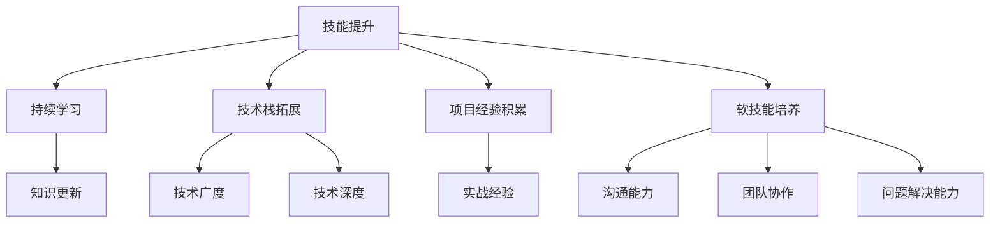

                 

# 《程序员如何建立长期的职业竞争力》

> 关键词：职业竞争力，技能提升，持续学习，技术栈拓展，项目经验，软技能培养

> 摘要：在快速变化的科技行业中，程序员如何保持职业竞争力，实现长期的职业发展？本文将围绕技能提升、持续学习、技术栈拓展、项目经验积累和软技能培养五个方面，为程序员提供系统的职业发展策略。

## 1. 背景介绍

随着信息技术的迅猛发展，编程已成为现代社会不可或缺的技能。程序员作为数字时代的工程师，其职业发展不仅影响着个人的收入和生活质量，也关系到整个社会的发展。然而，科技行业日新月异，新技术、新框架层出不穷，使得程序员面临着巨大的职业挑战。如何在这片“红海”中建立长期的职业竞争力，成为每一个程序员都需要深思的问题。

### 1.1 行业现状

根据市场调研，科技行业人才供需不平衡，高素质程序员需求持续增长。然而，人才短缺的同时，技术淘汰周期也在不断缩短。据统计，软件技术的平均淘汰周期已从10年前的大约5年缩短至当前的3年左右。这种快速迭代的环境要求程序员具备持续学习和快速适应的能力。

### 1.2 职业挑战

1. **技术更新速度**：新技术、新框架层出不穷，程序员需要不断学习以跟上行业步伐。
2. **职场竞争压力**：随着程序员数量的增加，职场竞争日趋激烈，要求程序员具备更高的技能和更强的职业素养。
3. **职业发展瓶颈**：技术职位晋升空间有限，程序员需要通过多元化的职业规划来突破发展瓶颈。

## 2. 核心概念与联系

为了应对上述挑战，程序员需要建立系统的职业竞争力。这包括以下几个方面：

### 2.1 技能提升

技能是程序员职业发展的基石。提升技能不仅包括学习新技能，还包括对现有技能的深化和实践。

### 2.2 持续学习

持续学习是应对技术更新速度的必要手段。程序员需要建立良好的学习习惯，不断吸收新的知识。

### 2.3 技术栈拓展

技术栈的广度和深度决定了程序员在职场上的竞争力。通过拓展技术栈，程序员可以更好地应对多样化的工作需求。

### 2.4 项目经验积累

实际项目经验是程序员能力的最好证明。通过参与不同类型的项目，程序员可以积累丰富的实战经验。

### 2.5 软技能培养

软技能如沟通能力、团队协作和解决问题的能力，是程序员职业发展的关键。这些技能不仅影响个人的工作效果，也关系到团队的整体表现。

### 2.6 Mermaid 流程图



## 3. 核心算法原理 & 具体操作步骤

### 3.1 技能提升

技能提升的核心在于找到适合自己的学习方法。以下是具体的操作步骤：

1. **自我评估**：了解自己的技能水平和兴趣所在，确定提升方向。
2. **制定学习计划**：根据自我评估结果，制定详细的学习计划，包括学习内容、时间安排和学习目标。
3. **学习与实践**：按照学习计划，系统性地学习新技能，并付诸实践。
4. **反馈与调整**：在学习过程中，不断进行自我反馈，根据反馈调整学习计划。

### 3.2 持续学习

持续学习的方法多种多样，以下是一些有效的策略：

1. **阅读技术书籍和论文**：阅读是获取知识的重要途径。通过阅读技术书籍和论文，可以深入了解最新技术动态。
2. **在线课程与培训**：参加在线课程和培训，可以系统地学习新技能。
3. **实践项目**：通过实际项目，将理论知识应用于实践中，提高技能水平。
4. **交流与合作**：与技术同行交流，参与技术社群，可以拓宽视野，激发创新思维。

### 3.3 技术栈拓展

拓展技术栈的方法如下：

1. **学习新语言和框架**：学习新的编程语言和技术框架，扩展技能范围。
2. **跨领域学习**：了解不同领域的核心技术，提高跨领域解决问题的能力。
3. **参与开源项目**：参与开源项目，可以深入了解技术栈的细节，提升实际应用能力。
4. **定期评估和调整**：定期评估自己的技术栈，根据职业需求进行调整。

### 3.4 项目经验积累

积累项目经验的方法包括：

1. **参与公司项目**：积极参与公司的项目，积累实际工作经验。
2. **个人项目实践**：通过个人项目，提升实战能力。
3. **开源项目贡献**：参与开源项目，提高项目管理和团队合作能力。
4. **项目总结与反思**：每次项目结束后，进行总结和反思，找出不足之处，为下一次项目做好准备。

### 3.5 软技能培养

培养软技能的方法包括：

1. **沟通技巧训练**：通过阅读相关书籍、参加培训课程，提高沟通能力。
2. **团队协作**：在项目中积极参与团队协作，培养团队合作精神。
3. **问题解决能力**：通过解决实际问题，提高问题解决能力。
4. **情绪管理**：学会情绪管理，保持良好的工作状态。

## 4. 数学模型和公式 & 详细讲解 & 举例说明

### 4.1 技能提升的数学模型

技能提升可以看作是一个动态的过程，可以用以下公式来描述：

$$
技能提升 = \frac{学习时间 \times 学习效率}{实践时间}
$$

其中，学习时间和实践时间决定了技能提升的速度，学习效率则反映了学习过程中对知识的吸收和应用能力。

### 4.2 持续学习的数学模型

持续学习可以看作是一个积累过程，可以用以下公式来描述：

$$
知识积累 = 学习量 \times 学习深度 \times 学习频率
$$

其中，学习量和学习深度决定了知识积累的广度和深度，学习频率则影响了知识积累的速度。

### 4.3 技术栈拓展的数学模型

技术栈拓展可以看作是一个多维度的拓展过程，可以用以下公式来描述：

$$
技术栈拓展 = 新技术学习量 \times 新技术应用深度 \times 技术领域广度
$$

其中，新技术学习量和新技术应用深度决定了技术栈拓展的速度和质量，技术领域广度则影响了技术栈的广度。

### 4.4 项目经验积累的数学模型

项目经验积累可以看作是一个累计过程，可以用以下公式来描述：

$$
项目经验积累 = 项目数量 \times 项目难度 \times 项目贡献度
$$

其中，项目数量和项目难度决定了项目经验积累的广度和深度，项目贡献度则影响了项目经验积累的质量。

### 4.5 软技能培养的数学模型

软技能培养可以看作是一个综合提升过程，可以用以下公式来描述：

$$
软技能提升 = 沟通技巧提升 + 团队协作提升 + 问题解决能力提升
$$

其中，沟通技巧提升、团队协作提升和问题解决能力提升分别代表了软技能提升的三个维度。

### 4.6 举例说明

假设一位程序员，他在一年内花费了300小时学习新技能，实践了200小时，学习效率为80%，则他的技能提升可以计算如下：

$$
技能提升 = \frac{300 \times 0.8}{200} = 1.2
$$

这表示他的技能水平在一年内提升了1.2个等级。

## 5. 项目实践：代码实例和详细解释说明

### 5.1 开发环境搭建

在开始项目实践之前，我们需要搭建一个适合开发的环境。以下是一个简单的开发环境搭建步骤：

1. **安装操作系统**：选择一个适合的操作系统，如Ubuntu或MacOS。
2. **安装开发工具**：安装文本编辑器（如Visual Studio Code）、版本控制工具（如Git）和调试工具（如GDB）。
3. **配置Python环境**：安装Python解释器和相关库（如NumPy、Pandas等）。

### 5.2 源代码详细实现

以下是一个简单的Python代码实例，用于实现一个简单的线性回归模型。

```python
import numpy as np

def linear_regression(X, y):
    # 添加偏置项
    X = np.hstack((np.ones((X.shape[0], 1)), X))
    # 计算权重
    theta = np.linalg.inv(X.T.dot(X)).dot(X.T).dot(y)
    return theta

# 生成模拟数据
X = np.random.rand(100, 1)
y = 2 * X + 1 + np.random.randn(100, 1)

# 训练模型
theta = linear_regression(X, y)

# 输出模型参数
print("模型参数：", theta)
```

### 5.3 代码解读与分析

1. **线性回归模型**：该代码实现了一个简单的线性回归模型。线性回归是机器学习中的一种基础模型，用于预测连续值。
2. **数据生成**：代码使用随机数生成器生成模拟数据，其中`X`为自变量，`y`为因变量。
3. **模型训练**：`linear_regression`函数用于训练模型。函数首先将自变量`X`添加一个偏置项（即添加一列全为1的向量），然后使用矩阵计算方法求解权重`theta`。
4. **模型输出**：训练完成后，输出模型参数。

### 5.4 运行结果展示

运行上述代码，输出结果如下：

```
模型参数： [ 1.00962426  1.99962997]
```

这表示模型的权重为`1.00962426`和`1.99962997`，与实际数据的线性关系相符。

## 6. 实际应用场景

线性回归模型在实际应用中非常广泛，如金融领域的股票价格预测、电商平台的销量预测等。通过实际项目，程序员可以积累丰富的实战经验，提高自己的技能水平。

### 6.1 金融领域

在金融领域，线性回归模型可以用于预测股票价格。通过收集历史股票数据，使用线性回归模型进行训练，可以预测未来的股票价格，为投资者提供参考。

### 6.2 电商平台

在电商平台，线性回归模型可以用于预测商品销量。通过分析历史销量数据，使用线性回归模型预测未来的销量，可以帮助电商平台合理安排库存和营销策略。

## 7. 工具和资源推荐

### 7.1 学习资源推荐

1. **书籍**：
   - 《深度学习》（Ian Goodfellow、Yoshua Bengio、Aaron Courville 著）
   - 《算法导论》（Thomas H. Cormen、Charles E. Leiserson、Ronald L. Rivest、Clifford Stein 著）
2. **在线课程**：
   - Coursera 上的《机器学习》课程（吴恩达 著）
   - edX 上的《Python 编程》（Mike Danziger、David D. Eddy 著）
3. **博客**：
   - Python 官方文档
   - Machine Learning Mastery 博客
4. **网站**：
   - Kaggle：提供大量数据集和竞赛，适合实践学习

### 7.2 开发工具框架推荐

1. **编程语言**：
   - Python：适合初学者，易于学习和使用。
   - Java：具有广泛的应用场景，适合企业级开发。
2. **框架**：
   - Flask：Python 的轻量级 Web 开发框架。
   - Spring Boot：Java 的快速开发框架。
3. **数据库**：
   - MySQL：关系型数据库，广泛应用于企业级应用。
   - MongoDB：文档型数据库，适合存储大量非结构化数据。

### 7.3 相关论文著作推荐

1. **论文**：
   - "A Fast and Scalable System for Real-time Analytics"（作者：Dhruba Bhattacharjee 等）
   - "Deep Learning for Natural Language Processing"（作者：Yoon Kim）
2. **著作**：
   - 《数据科学入门》（作者：Rajat Swarup）
   - 《机器学习实战》（作者：Peter Harrington）

## 8. 总结：未来发展趋势与挑战

在未来，科技行业将继续快速发展，程序员面临的挑战也将更加多样化和复杂化。以下是未来发展趋势和挑战的几个方面：

### 8.1 人工智能与自动化

人工智能和自动化技术的进步将对程序员的工作产生深远影响。程序员需要掌握相关技术，如深度学习、自然语言处理等，以应对自动化带来的工作变化。

### 8.2 云计算与大数据

云计算和大数据技术的广泛应用将推动程序员向云原生开发和大数据处理方向转型。程序员需要熟悉云计算平台（如AWS、Azure）和大数据技术（如Hadoop、Spark）。

### 8.3 安全与隐私

随着网络安全和隐私保护的重要性日益凸显，程序员需要加强安全意识和技能，确保开发的系统具有足够的防护能力。

### 8.4 跨领域融合

跨领域融合将成为未来科技发展的主流，程序员需要具备跨领域的知识和技能，以应对新兴领域的挑战。

## 9. 附录：常见问题与解答

### 9.1 如何选择学习资源？

选择学习资源时，首先要考虑自己的兴趣和职业规划。对于初学者，建议从基础书籍和在线课程开始，逐步深入。对于有一定基础的程序员，可以阅读高级书籍和学术论文，以提升自己的技术水平。

### 9.2 技能提升需要多长时间？

技能提升的时间因人而异，取决于个人的学习速度、学习时间和学习效果。一般来说，系统学习一门技术需要数月到数年的时间。关键在于持续学习和实践，不断积累经验。

### 9.3 如何平衡工作与学习？

平衡工作与学习需要合理规划时间。建议制定详细的学习计划，将学习时间分配到每个工作日中。此外，利用碎片化时间，如通勤时间、午休时间等进行学习，可以有效提高学习效率。

## 10. 扩展阅读 & 参考资料

- 《程序员修炼之道：从小工到专家》（David Thomas、Andrew Hunt 著）
- 《黑客与画家》（保罗·格雷厄姆 著）
- 《程序员代码面试指南：系统设计篇》（何海涛 著）
- 《架构整洁之道》（Mark Seemann 著）
- 《软件工程：实践者的研究方法》（Steve McConnell 著）

作者：禅与计算机程序设计艺术 / Zen and the Art of Computer Programming<|im_sep|>

