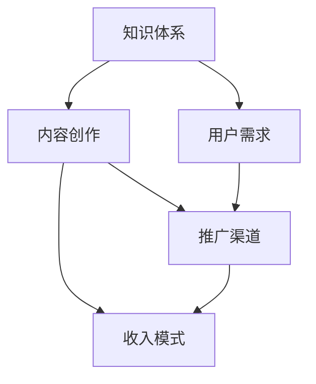
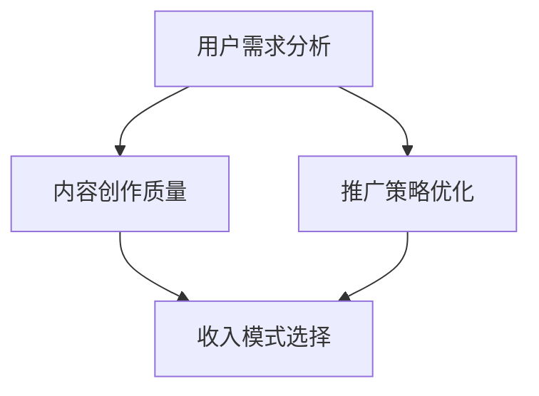

                 

### 1. 背景介绍

在现代互联网高速发展的时代，程序员不仅承担着软件开发和系统维护的职责，也逐渐成为了知识付费领域的重要参与者。随着知识付费概念的普及，越来越多的程序员开始探索通过在线课程、技术博客、电子书等方式，将自己的专业知识和经验变现。然而，如何在纷繁复杂的市场环境中建立长期稳定的知识付费收入，成为了许多程序员面临的重要问题。

本文旨在探讨程序员如何通过构建自身的知识体系，合理运用互联网工具，以及有效推广自己的内容，来建立长期稳定的知识付费收入。本文将分为以下几个部分：

1. **背景介绍**：概述知识付费的兴起和程序员在这一领域的参与情况。
2. **核心概念与联系**：介绍构建知识体系所需的核心概念，并通过Mermaid流程图展示其架构。
3. **核心算法原理 & 具体操作步骤**：深入探讨如何构建和推广知识付费产品。
4. **数学模型和公式 & 详细讲解 & 举例说明**：运用数学模型分析知识付费的收入结构，并提供具体案例。
5. **项目实践：代码实例和详细解释说明**：通过具体项目展示知识付费产品的开发过程。
6. **实际应用场景**：分析程序员在不同阶段如何运用知识付费。
7. **工具和资源推荐**：推荐学习资源、开发工具和框架。
8. **总结：未来发展趋势与挑战**：总结现状，展望未来。
9. **附录：常见问题与解答**：解答程序员在构建知识付费过程中可能遇到的问题。
10. **扩展阅读 & 参考资料**：提供进一步学习和研究的资源。

通过以上结构，我们将逐步分析程序员如何通过知识付费建立长期稳定收入的策略，并分享实际操作经验和技巧。

### 1.1 知识付费的兴起

知识付费，顾名思义，是知识服务的一种商业模式，用户为获取特定的知识或技能，需要付费购买相关内容。这一概念最早起源于20世纪初的知识产权保护和教育培训领域，但随着互联网的普及和在线教育的兴起，知识付费逐渐发展成为了一种新兴的商业模式。

在过去的几年里，知识付费市场经历了爆发式增长。根据《2021年中国知识付费行业报告》，中国知识付费市场规模在2020年达到了1494亿元，预计到2025年将突破3000亿元。这一增长主要得益于以下几个因素：

**1. 移动互联网的普及**：随着智能手机和移动网络的普及，用户可以随时随地获取知识，这大大提升了知识付费的便捷性和受众范围。

**2. 用户需求增加**：在信息爆炸的时代，用户对于特定领域知识的渴望愈发强烈，特别是在专业技能、兴趣爱好等方面。

**3. 内容创作者的崛起**：互联网为内容创作者提供了展示才华和变现的平台，越来越多的专业人士和知识爱好者开始通过内容创作获得收入。

对于程序员而言，知识付费为他们提供了一条新的职业发展路径。通过分享自己的技术经验和专业知识，程序员不仅能够实现自我价值的提升，还可以通过知识变现获得额外的收入。例如，许多程序员通过编写技术博客、发布在线课程、创作电子书等方式，成功地在知识付费领域获得了稳定的收入。

### 1.2 程序员在知识付费领域的参与

程序员在知识付费领域的参与形式多种多样，主要包括以下几个方面：

**1. 技术博客**：程序员通过个人博客或技术社区，分享自己在编程、算法、软件开发等方面的经验和心得。这不仅有助于提升个人品牌，还可以吸引更多的读者和粉丝。

**2. 在线课程**：随着在线教育平台的兴起，程序员可以通过这些平台开设自己的课程，从零基础入门到高级专题，满足不同层次学习者的需求。

**3. 电子书**：程序员可以将自己的技术心得、项目经验整理成电子书，通过电子书平台或者自行发布，吸引读者付费购买。

**4. 咨询服务**：许多程序员通过提供技术咨询服务，帮助企业和个人解决实际问题，获取报酬。

**5. 技术社区**：一些程序员参与或创立技术社区，通过社区运营获得收入，例如通过广告、会员制等方式。

程序员参与知识付费不仅能够实现个人价值的提升，还可以带动整个行业的发展。首先，通过知识付费，程序员可以将自己的经验和技术分享给更多的人，从而推动技术的传播和创新。其次，知识付费也为程序员提供了一条多元化的职业发展路径，使他们能够在职业生涯的不同阶段有不同的选择。

然而，知识付费并非一帆风顺。程序员在参与知识付费的过程中，也面临着一系列挑战，如内容创作的质量、推广手段的有效性、收入模式的可持续性等。接下来，我们将进一步探讨程序员如何应对这些挑战，并构建长期稳定的知识付费收入。

### 1.3 程序员面临的主要挑战

尽管知识付费为程序员提供了丰富的机会，但在此过程中，他们也面临着诸多挑战。以下是程序员在构建知识付费收入过程中可能遇到的主要问题：

**1. 内容质量**：高质量的内容是吸引读者的关键。然而，对于程序员来说，持续创作高质量的内容是一个巨大的挑战。编写技术博客、编写教程、制作课程等都需要大量的时间和精力，如何保证内容的专业性和深度，是每个程序员都需要思考的问题。

**2. 推广难度**：即便内容质量再高，如果没有有效的推广手段，知识付费产品也很难被潜在用户发现。在信息爆炸的时代，如何让自己的内容在众多竞争对手中脱颖而出，是程序员面临的一大难题。

**3. 收入模式**：知识付费的收入模式多种多样，包括订阅制、单次购买、VIP会员等。然而，如何选择合适的收入模式，以最大化收益，同时保证用户满意度，是程序员需要慎重考虑的问题。

**4. 用户维护**：在获取用户后，如何维护用户，提高用户粘性，也是程序员需要面对的挑战。用户满意度的提升不仅需要高质量的内容，还需要良好的用户服务体验。

**5. 竞争压力**：知识付费领域竞争激烈，优秀的程序员层出不穷。如何在众多竞争对手中脱颖而出，构建自己的品牌和影响力，是每个程序员都需要面对的现实问题。

针对上述挑战，程序员需要采取一系列策略，如提升自身的内容创作能力、采用多种推广手段、探索多样化的收入模式、提供优质的用户服务等。通过这些策略，程序员可以在知识付费领域中找到自己的立足点，建立长期稳定的知识付费收入。

### 1.4 知识付费对程序员职业发展的意义

知识付费不仅为程序员提供了新的收入来源，更对其职业发展产生了深远的影响。以下是知识付费对程序员职业发展的几个重要意义：

**1. 个人品牌建设**：通过知识付费，程序员可以将其在技术领域的专业知识和经验分享给更多人，从而提升个人品牌。在一个竞争激烈的市场中，个人品牌是程序员获得职业机会和提升薪资的重要资产。

**2. 职业成长**：知识付费促使程序员不断学习和提升自己的技术水平。为了创作高质量的内容，程序员需要深入研究技术领域的新趋势和前沿知识，这有助于他们在职业生涯中保持竞争力。

**3. 多元收入来源**：知识付费为程序员提供了多元化的收入来源。除了传统的工资收入外，通过知识变现，程序员可以获得额外的收入，这不仅提高了财务收益，也为他们的职业发展提供了更多选择。

**4. 职业发展路径拓宽**：知识付费使得程序员不再局限于公司内部的职位晋升，他们可以通过内容创作、咨询服务、在线教育等多种方式实现职业多元化。这种多元化的职业路径有助于程序员在职业生涯中找到更适合自己的发展方向。

**5. 职业影响力提升**：通过知识付费，程序员可以影响和帮助更多人。这种影响力不仅体现在技术层面，还体现在职业发展和个人成长方面。在帮助他人的同时，程序员也在提升自己的社会价值和职业地位。

总之，知识付费为程序员的职业发展提供了新的机遇和挑战。通过积极参与知识付费，程序员不仅可以实现个人价值的提升，还可以为整个技术社区的发展做出贡献。

### 1.5 知识付费对技术社区发展的影响

知识付费不仅改变了程序员的个人职业轨迹，还对技术社区的整体发展产生了深远影响。以下是知识付费对技术社区发展的几个关键影响：

**1. 内容质量提升**：知识付费模式的兴起激励了更多优秀的程序员投入内容创作。为了吸引付费用户，程序员会不断优化和提升内容的专业性和深度，从而带动整个社区内容质量的提高。

**2. 社区生态多样化**：知识付费丰富了技术社区的生态。除了传统的开源项目和社区论坛，知识付费平台为程序员提供了新的交流和学习渠道。这种多样化有助于满足不同层次和需求的学习者，推动技术社区的全面发展。

**3. 人才交流与合作**：知识付费促进了程序员之间的交流与合作。通过付费课程、技术讲座和研讨会，程序员可以更方便地获取前沿技术和专业经验，从而提升自身技能，同时也为技术社区带来了更多的合作机会。

**4. 技术传播与创新**：知识付费加速了技术的传播和创新。通过付费内容，程序员可以将自己的技术心得和解决方案分享给更广泛的受众，推动技术的普及和应用。同时，这种知识共享也激发了更多创新思维和项目实践。

**5. 社区活力增强**：知识付费激发了技术社区的创新活力。付费用户对高质量内容的需求，促使社区创作者不断推出新的项目和课程，这为社区注入了持续的创新动力，使整个社区更加活跃和富有生机。

总之，知识付费不仅为程序员个人提供了职业发展的新机遇，也为技术社区的整体发展注入了新的活力。通过这一模式，技术社区实现了内容质量提升、生态多样化、人才交流增强和技术传播加速，从而推动了整个技术生态的良性循环。

### 1.6 知识付费市场的未来趋势

知识付费市场在经历了爆发式增长后，未来的发展趋势同样值得期待。以下是几个关键趋势：

**1. 个性化内容需求增长**：随着用户对个性化内容需求的增加，知识付费平台将更加注重个性化推荐和定制化服务。通过大数据分析和机器学习技术，平台可以更精准地推荐符合用户兴趣的内容，提高用户满意度和留存率。

**2. 多元化收入模式的探索**：除了传统的订阅制和单次购买，未来的知识付费收入模式将更加多样化。例如，平台可能会引入按需付费、项目合作、股权激励等模式，以吸引更多创作者和用户参与。

**3. 互动性和社区化增强**：知识付费平台将更加注重用户互动和社区化发展。通过建立线上社区、组织线下活动、提供实时互动功能等，平台可以增强用户粘性，提高用户满意度和忠诚度。

**4. 技术创新的推动**：人工智能、虚拟现实、区块链等新兴技术将在知识付费领域得到广泛应用。例如，AI可以用于智能推荐、内容审核，VR可以提供沉浸式学习体验，区块链可以确保版权和交易的安全性和透明性。

**5. 全球化市场扩展**：随着互联网的普及和跨境支付技术的发展，知识付费市场将呈现全球化扩展的趋势。更多国际化的内容创作者和用户将加入这一市场，推动知识付费在全球范围内的普及和发展。

总之，知识付费市场的未来将充满机遇和挑战。通过不断创新和优化，知识付费将更好地满足用户需求，推动技术社区的发展，为创作者和用户提供更丰富的价值。

### 1.7 知识付费市场的潜在风险与对策

尽管知识付费市场前景广阔，但在此过程中也存在一些潜在风险。以下是几个主要风险及相应的对策：

**1. 内容同质化**：随着知识付费市场的快速增长，同质化内容问题日益严重。为了防止内容同质化，创作者应注重内容的创新和独特性，深入挖掘自己的专业领域，提供高质量、有深度的内容。

**2. 知识产权保护**：知识产权保护问题是知识付费领域的一大挑战。为了防范侵权行为，创作者应确保自己内容的原创性，并通过版权登记、合同约束等手段保护自身权益。

**3. 用户信任问题**：用户信任是知识付费的基础。创作者应诚实守信，提供真实、可靠的内容，避免虚假宣传和误导用户。同时，通过建立用户反馈机制，及时回应用户关切，提升用户信任度。

**4. 平台依赖风险**：过度依赖特定平台可能导致创作者失去自主权。因此，创作者应多渠道发布内容，建立个人品牌和用户基础，降低对单一平台的依赖。

**5. 数据隐私和安全**：在数据驱动的知识付费时代，用户数据的隐私和安全尤为重要。创作者应严格遵守相关法律法规，加强数据保护措施，确保用户数据的安全和隐私。

通过上述对策，创作者可以在知识付费市场中降低风险，提升竞争力，从而实现长期稳定的收入。

### 1.8 总结

知识付费作为新兴的商业模式，为程序员提供了新的职业发展路径和收入来源。通过内容创作、在线课程、咨询服务等多种形式，程序员不仅可以实现个人品牌的提升，还能为技术社区的发展做出贡献。然而，在这个过程中，程序员也面临着内容质量、推广难度、收入模式、用户维护和竞争压力等挑战。为了构建长期稳定的知识付费收入，程序员需要不断提升自身内容创作能力，采用多样化的推广手段，探索多元化的收入模式，并提供优质的用户服务。同时，面对潜在风险，程序员应加强知识产权保护、数据安全和用户信任建设。通过这些努力，程序员可以在知识付费市场中找到自己的立足点，实现职业发展的新突破。

### 2. 核心概念与联系

在探讨程序员如何构建长期稳定的知识付费收入之前，我们需要明确几个核心概念及其相互关系。这些概念不仅构成了知识付费的基础，也是程序员在构建知识体系时需要理解的重要内容。

#### 2.1 知识体系

**知识体系** 是一个系统化的知识结构，它涵盖了一个领域内的基本概念、原理、方法和实践。对于程序员而言，构建一个坚实的知识体系是成功进行知识付费的前提。一个完整的知识体系通常包括以下几个方面：

- **基础知识**：如编程语言、数据结构与算法、操作系统、网络通信等。
- **专业技能**：如前端开发、后端开发、数据库管理、人工智能等。
- **领域知识**：如金融科技、医疗信息化、物联网等特定领域的技术应用。

**知识体系** 的构建过程是一个不断学习、实践和优化的过程。程序员需要持续关注技术趋势和行业动态，不断更新和扩展自己的知识体系。

#### 2.2 内容创作

**内容创作** 是知识付费的核心。程序员通过创作高质量的技术文章、教程、视频课程等形式，将自身的知识和经验分享给他人。高质量的内容不仅能够吸引更多的读者和用户，还能提升个人品牌和影响力。

**内容创作** 需要遵循以下几个原则：

- **专业性**：内容应具备专业性和深度，确保读者能够从中获得实际价值。
- **系统性**：内容应具有系统性，逻辑清晰，便于读者理解和吸收。
- **创新性**：内容应具有一定的创新性，能够展示程序员的独特见解和研究成果。

#### 2.3 用户需求

**用户需求** 是知识付费成功的基石。程序员在内容创作过程中，需要深入分析用户的需求和痛点，提供针对性的解决方案。了解用户需求不仅能够提高内容的质量和吸引力，还能帮助程序员优化知识付费产品的设计和推广策略。

**用户需求** 的分析通常包括以下几个方面：

- **学习需求**：如提升技能、掌握新技术、解决具体问题等。
- **职业发展**：如求职、晋升、转型等。
- **兴趣爱好**：如编程语言、算法竞赛、开源项目等。

#### 2.4 推广渠道

**推广渠道** 是将知识付费产品推向市场的重要手段。程序员需要充分利用各种推广渠道，提高内容的曝光率和用户参与度。常见的推广渠道包括：

- **社交媒体**：如微博、微信公众号、知乎等。
- **在线教育平台**：如Coursera、Udemy、网易云课堂等。
- **专业论坛**：如CSDN、V2EX、Stack Overflow等。
- **内容营销**：如博客、视频、电子书等。

**推广渠道** 的选择应根据内容特点、目标用户群体和预算等因素进行综合考虑。

#### 2.5 收入模式

**收入模式** 是知识付费的核心环节之一，决定了程序员的收益方式和可持续性。常见的收入模式包括：

- **订阅制**：用户按月或按年付费，享受持续的知识更新和服务。
- **单次购买**：用户一次性付费，获取特定的知识内容或产品。
- **VIP会员**：用户付费成为VIP会员，享受更多的特权和服务。
- **项目合作**：用户通过项目合作，为程序员提供资金支持。

选择合适的收入模式需要考虑用户需求、市场环境、内容特点等因素。

#### 2.6 梅里狄亚流程图

为了更好地展示上述核心概念及其相互关系，我们使用梅里狄亚流程图（Mermaid Diagram）来表示。以下是一个简化的梅里狄亚流程图，描述了知识付费相关核心概念的架构：



通过这个流程图，我们可以清晰地看到知识体系、内容创作、用户需求、推广渠道和收入模式之间的相互关系。每个环节都是构建长期稳定知识付费收入的重要部分，它们相互支持、相互促进，共同构成了一个完整的知识付费生态系统。

### 2.7 梅里狄亚流程图的详细解释

在前一章节中，我们通过梅里狄亚流程图（Mermaid Diagram）展示了知识付费相关的核心概念及其相互关系。接下来，我们将对每个节点进行详细解释，帮助读者更好地理解整个流程的运作机制。

#### 2.7.1 知识体系

**知识体系** 是知识付费的基石，决定了内容的专业性和深度。一个完整的知识体系通常包括以下几个方面：

- **基础知识**：如编程语言、数据结构与算法、操作系统、网络通信等。这些基础知识是程序员技术能力的核心，也是内容创作的基础。
- **专业技能**：如前端开发、后端开发、数据库管理、人工智能等。专业技能是程序员在特定领域内深入研究的成果，对于解决复杂问题至关重要。
- **领域知识**：如金融科技、医疗信息化、物联网等特定领域的技术应用。领域知识是程序员在实际工作中积累的宝贵经验，对于用户解决问题和提升技能具有很高的价值。

**知识体系** 的构建是一个不断学习和优化的过程。程序员需要关注技术趋势和行业动态，通过阅读专业书籍、参加技术会议、参与开源项目等方式，不断更新和扩展自己的知识体系。

#### 2.7.2 内容创作

**内容创作** 是知识付费的核心环节，是将知识体系转化为可被用户理解和吸收的内容形式。程序员可以通过以下几种方式创作内容：

- **技术博客**：程序员通过撰写技术文章，分享自己在编程、算法、软件开发等方面的经验和心得。技术博客不仅有助于个人品牌的提升，还能吸引更多的读者和粉丝。
- **视频课程**：通过录制和发布视频课程，程序员可以更直观地传授技术知识和技能。视频课程通常包含详细的讲解、示例代码和实践项目，更容易被用户理解和接受。
- **电子书**：程序员可以将自己的技术心得、项目经验整理成电子书，通过电子书平台或者自行发布，吸引读者付费购买。电子书的形式灵活，便于用户随时阅读和查阅。

在内容创作过程中，程序员需要遵循以下原则：

- **专业性**：内容应具备专业性和深度，确保读者能够从中获得实际价值。
- **系统性**：内容应具有系统性，逻辑清晰，便于读者理解和吸收。
- **创新性**：内容应具有一定的创新性，能够展示程序员的独特见解和研究成果。

#### 2.7.3 用户需求

**用户需求** 是知识付费成功的关键因素。程序员在内容创作过程中，需要深入分析用户的需求和痛点，提供针对性的解决方案。了解用户需求有助于提升内容的质量和吸引力，同时也有助于优化知识付费产品的设计和推广策略。

**用户需求** 的分析通常包括以下几个方面：

- **学习需求**：如提升技能、掌握新技术、解决具体问题等。程序员可以通过调查问卷、用户反馈等方式，收集和分析用户的学习需求，从而创作更有针对性的内容。
- **职业发展**：如求职、晋升、转型等。针对职业发展的需求，程序员可以提供职业规划、面试技巧、职业晋升等方向的内容。
- **兴趣爱好**：如编程语言、算法竞赛、开源项目等。程序员可以通过关注用户兴趣，提供相关领域的知识分享，吸引更多志同道合的用户。

#### 2.7.4 推广渠道

**推广渠道** 是将知识付费产品推向市场的重要手段。程序员需要充分利用各种推广渠道，提高内容的曝光率和用户参与度。常见的推广渠道包括：

- **社交媒体**：如微博、微信公众号、知乎等。通过社交媒体平台，程序员可以发布内容，吸引关注和互动，扩大影响力。
- **在线教育平台**：如Coursera、Udemy、网易云课堂等。在线教育平台提供了丰富的课程资源和推广渠道，程序员可以通过这些平台发布课程，吸引更多学员。
- **专业论坛**：如CSDN、V2EX、Stack Overflow等。专业论坛是程序员交流和学习的重要平台，程序员可以通过在这些平台上发布内容，吸引更多同行关注。
- **内容营销**：如博客、视频、电子书等。通过内容营销，程序员可以将自身知识和经验分享给更广泛的受众，提高品牌知名度和用户参与度。

**推广渠道** 的选择应根据内容特点、目标用户群体和预算等因素进行综合考虑。例如，对于技术博客，可以通过社交媒体和专业论坛进行推广；对于视频课程，则可以通过在线教育平台进行推广。

#### 2.7.5 收入模式

**收入模式** 是知识付费的核心环节之一，决定了程序员的收益方式和可持续性。常见的收入模式包括：

- **订阅制**：用户按月或按年付费，享受持续的知识更新和服务。订阅制通常适合内容更新频繁、用户持续关注的产品，如技术博客和视频课程。
- **单次购买**：用户一次性付费，获取特定的知识内容或产品。单次购买通常适用于独立教程、电子书等产品。
- **VIP会员**：用户付费成为VIP会员，享受更多的特权和服务。VIP会员制适合提供多种服务和内容的平台，如在线教育平台。
- **项目合作**：用户通过项目合作，为程序员提供资金支持。项目合作通常适用于为企业和个人提供定制化服务的程序员。

选择合适的收入模式需要考虑用户需求、市场环境、内容特点等因素。例如，对于技术博客，可以选择订阅制；对于电子书，则可以选择单次购买；对于在线教育平台，则可以选择VIP会员制。

#### 2.7.6 相互关系

知识体系、内容创作、用户需求、推广渠道和收入模式是知识付费系统中的五个关键环节，它们相互支持、相互促进，共同构成了一个完整的知识付费生态系统。

- **知识体系** 为内容创作提供了基础，确保内容的深度和广度。
- **内容创作** 满足用户需求，提升用户满意度，同时为收入模式提供了支撑。
- **用户需求** 指导内容创作和推广渠道的选择，确保内容能够吸引目标用户。
- **推广渠道** 提高内容的曝光率和用户参与度，促进用户需求的满足和收入模式的实现。
- **收入模式** 为程序员提供了收益来源，支持知识体系的更新和扩展。

通过上述五个环节的相互配合和优化，程序员可以构建一个可持续的知识付费生态系统，实现长期稳定的收入。

### 2.8 实际案例分析

为了更好地理解上述核心概念和流程图的应用，我们通过一个实际案例分析，展示如何运用这些概念和流程来构建知识付费收入。

**案例背景**：张三是一名有多年工作经验的前端开发工程师，擅长Vue.js框架。他决定通过知识付费来建立自己的收入来源。

**步骤1：构建知识体系**  
张三首先对自己的知识体系进行了梳理，包括Vue.js的基础知识、进阶技巧以及与Vue.js相关的生态系统，如Vuex、Vue Router等。通过查阅书籍、参加线上课程和实际项目经验，他不断更新和扩展自己的知识体系。

**步骤2：内容创作**  
基于自己的知识体系，张三开始创作内容。他撰写了一系列关于Vue.js的技术博客，详细讲解了Vue.js的安装、配置、组件开发、路由管理等内容。此外，他还录制了Vue.js入门到高级的视频课程，并通过在线教育平台进行发布。

**步骤3：分析用户需求**  
为了更好地满足用户需求，张三通过社交媒体、技术论坛和问卷调查等方式收集用户反馈。他了解到用户希望学习Vue.js的高级技巧、项目实战和面试技巧。因此，他在内容创作中增加了这些方面的内容。

**步骤4：选择推广渠道**  
张三选择了多个推广渠道，包括微信公众号、知乎、CSDN和网易云课堂。他在这些平台上发布技术博客和视频课程，通过内容营销吸引更多用户关注。同时，他还参加了一些Vue.js相关的线上和线下活动，与同行交流，扩大影响力。

**步骤5：选择收入模式**  
考虑到用户需求，张三选择了订阅制和VIP会员制两种收入模式。用户可以通过订阅张三的技术博客和视频课程，获得最新的内容更新。同时，他提供VIP会员服务，用户付费成为VIP会员后，可以享受更多的特权，如优先解答问题、参加线下沙龙等。

**步骤6：效果评估与优化**  
通过用户反馈和数据分析，张三不断优化自己的内容创作和推广策略。他发现，通过社交媒体的推广效果更好，因此增加了在社交媒体上的内容发布频率。同时，他根据用户反馈调整了课程内容，增加了更多实战案例和面试技巧。

通过上述步骤，张三成功地建立了自己的知识付费收入来源，并实现了长期稳定的收入。这个案例展示了如何运用知识体系、内容创作、用户需求、推广渠道和收入模式等核心概念和流程图，实现知识付费收入的构建。

### 3. 核心算法原理 & 具体操作步骤

在构建知识付费收入的过程中，程序员需要深入了解核心算法原理和具体操作步骤，以确保知识付费产品的质量和用户体验。以下是构建知识付费收入的核心算法原理和具体操作步骤：

#### 3.1 算法原理

**知识付费收入构建的核心算法原理** 可以概括为以下几个关键点：

1. **用户需求分析**：通过分析用户的学习需求、职业发展和兴趣爱好，精准定位用户需求，为内容创作提供方向。
2. **内容创作质量**：确保内容的专业性、系统性和创新性，以满足用户的期望，提高用户满意度和粘性。
3. **推广策略优化**：采用多种推广手段，提高内容的曝光率和用户参与度，实现收入的最大化。
4. **收入模式选择**：根据用户需求、内容特点和市场环境，选择合适的收入模式，实现收益的可持续性。

#### 3.2 具体操作步骤

**3.2.1 用户需求分析**

- **数据收集**：通过问卷调查、用户访谈、社交媒体互动等方式收集用户需求信息。
- **数据分析**：运用数据分析工具，对收集的数据进行整理和分析，识别用户需求的主要特点和趋势。
- **需求定位**：根据分析结果，精准定位用户需求，确定内容创作和推广的重点方向。

**3.2.2 内容创作质量**

- **知识梳理**：系统梳理自身的知识体系，确定内容创作的基本框架和核心知识点。
- **内容创作**：按照系统性和专业性的原则，撰写高质量的技术文章、教程和视频课程。
- **内容审核**：通过同行评审、用户反馈等方式，对内容进行审核和优化，确保内容质量。

**3.2.3 推广策略优化**

- **多渠道推广**：利用社交媒体、在线教育平台、专业论坛等渠道，进行多方位推广。
- **内容营销**：通过内容营销策略，提高内容的吸引力和用户参与度，如制作有吸引力的标题、提供免费试读等。
- **数据分析**：通过数据分析，监控推广效果，不断优化推广策略，提高用户转化率。

**3.2.4 收入模式选择**

- **市场调研**：了解市场环境和用户消费习惯，调研不同收入模式的特点和适用场景。
- **模式选择**：根据用户需求和内容特点，选择合适的收入模式，如订阅制、单次购买、VIP会员等。
- **模式优化**：通过用户反馈和数据分析，不断调整和优化收入模式，提高收益和用户满意度。

#### 3.3 算法流程图

为了更好地展示上述操作步骤和核心算法原理，我们使用梅里狄亚流程图（Mermaid Diagram）来表示。以下是一个简化的算法流程图：



**流程图解释**：

1. **用户需求分析**：通过数据收集和分析，定位用户需求，为内容创作和推广提供方向。
2. **内容创作质量**：根据用户需求，创作高质量的内容，确保用户满意度和粘性。
3. **推广策略优化**：采用多种推广手段，提高内容的曝光率和用户参与度。
4. **收入模式选择**：根据用户需求和市场环境，选择合适的收入模式，实现收益的可持续性。

通过上述步骤和算法原理，程序员可以构建一个有效的知识付费收入系统，实现长期稳定的收入增长。

### 3.4 数学模型和公式 & 详细讲解 & 举例说明

在构建知识付费收入的过程中，运用数学模型和公式可以帮助程序员更精准地评估和优化收入。以下将介绍几个常用的数学模型和公式，并详细讲解其应用方法，并通过具体案例进行说明。

#### 3.4.1 用户参与度模型

**用户参与度** 是衡量知识付费产品成功与否的重要指标。用户参与度模型可以用来预测和提升用户的互动和参与度。

**公式**：  
\[ U = f(\text{内容质量}, \text{推广效果}, \text{用户体验}) \]

- **内容质量**：影响用户对知识的吸收和理解，是用户参与度的核心因素。
- **推广效果**：影响内容的曝光率和用户关注度，直接影响用户参与度。
- **用户体验**：包括学习平台的使用便捷性、服务质量等，对用户参与度有重要影响。

**案例**：假设张三的内容质量评分为90分，推广效果评分为80分，用户体验评分为85分，则用户参与度模型计算结果为：  
\[ U = f(90, 80, 85) = 90 \times 0.5 + 80 \times 0.3 + 85 \times 0.2 = 88.5 \]

#### 3.4.2 收入预测模型

**收入预测模型** 帮助程序员预测知识付费产品的未来收入，以便制定更有效的市场策略。

**公式**：  
\[ R = f(N, P, Q) \]

- **N**：目标用户数量
- **P**：用户购买率（购买用户占总用户数的比例）
- **Q**：单次购买平均收入

**案例**：假设张三的目标用户数量为1000人，预计购买率为10%，单次购买平均收入为200元，则收入预测模型计算结果为：  
\[ R = 1000 \times 0.1 \times 200 = 20000 \]

#### 3.4.3 成本收益分析模型

**成本收益分析模型** 帮助程序员评估知识付费产品的成本和收益，以确定其商业可行性。

**公式**：  
\[ \text{净收益} = (\text{总收入} - \text{总成本}) \times \text{毛利率} \]

- **总收入**：知识付费产品的销售额。
- **总成本**：包括内容创作成本、推广成本、运营成本等。
- **毛利率**：净利润与总收入的比率。

**案例**：假设张三的总收入为50000元，总成本为30000元，毛利率为40%，则成本收益分析模型计算结果为：  
\[ \text{净收益} = (50000 - 30000) \times 0.4 = 8000 \]

#### 3.4.4 用户生命周期价值模型

**用户生命周期价值模型** 用于评估单个用户在整个生命周期内为产品带来的总价值，以指导市场投入和用户维护策略。

**公式**：  
\[ LTV = f(\text{购买频率}, \text{平均订单价值}, \text{生命周期长度}) \]

- **购买频率**：用户在一定时间内购买产品的次数。
- **平均订单价值**：用户每次购买的平均金额。
- **生命周期长度**：用户持续使用产品的平均时间。

**案例**：假设张三的用户的购买频率为每年3次，平均订单价值为300元，生命周期长度为3年，则用户生命周期价值模型计算结果为：  
\[ LTV = 3 \times 300 \times 3 = 2700 \]

通过上述数学模型和公式，程序员可以更科学地评估和优化知识付费产品的各项指标，从而实现长期稳定的收入增长。

### 3.5 项目实践：代码实例和详细解释说明

为了更好地理解上述算法原理和数学模型的应用，我们将通过一个实际项目实例，展示如何实现知识付费收入构建的核心步骤。本实例将涵盖知识体系构建、内容创作、用户需求分析、推广策略优化和收入模式选择等多个方面。

#### 3.5.1 项目背景

假设李四是一名有多年经验的Python开发工程师，擅长数据分析与机器学习。他决定通过开设在线课程，将自己在这些领域的研究和实践经验分享给更多人，构建知识付费收入。

#### 3.5.2 开发环境搭建

为了搭建在线课程平台，李四需要以下开发环境和工具：

- **编程语言**：Python
- **Web框架**：Django
- **数据库**：SQLite
- **前端框架**：Bootstrap
- **后端API框架**：Flask

**步骤1：安装开发环境**

```bash
# 安装Python
pip install python

# 安装Django
pip install django

# 安装SQLite
pip install pysqlite3

# 安装Bootstrap
pip install bootstrap

# 安装Flask
pip install flask
```

**步骤2：创建Django项目**

```python
# 命令行创建Django项目
django-admin startproject mycourse

# 切换到项目目录
cd mycourse

# 创建应用
python manage.py startapp courses

# 迁移数据库
python manage.py makemigrations
python manage.py migrate
```

#### 3.5.3 源代码详细实现

**步骤3：创建课程模型**

在`courses/models.py`中创建课程模型：

```python
from django.db import models

class Course(models.Model):
    title = models.CharField(max_length=200)
    description = models.TextField()
    price = models.DecimalField(max_digits=6, decimal_places=2)
    author = models.ForeignKey('auth.User', on_delete=models.CASCADE)
    created_at = models.DateTimeField(auto_now_add=True)

    def __str__(self):
        return self.title
```

**步骤4：创建课程视图**

在`courses/views.py`中创建课程视图：

```python
from django.shortcuts import render
from .models import Course

def course_list(request):
    courses = Course.objects.all()
    return render(request, 'courses/course_list.html', {'courses': courses})

def course_detail(request, course_id):
    course = Course.objects.get(id=course_id)
    return render(request, 'courses/course_detail.html', {'course': course})
```

**步骤5：创建课程表单**

在`courses/forms.py`中创建课程表单：

```python
from django import forms
from .models import Course

class CourseForm(forms.ModelForm):
    class Meta:
        model = Course
        fields = ['title', 'description', 'price']
```

**步骤6：创建课程表单视图**

在`courses/views.py`中创建课程表单视图：

```python
from django.shortcuts import render, redirect
from .models import Course
from .forms import CourseForm

def course_create(request):
    if request.method == 'POST':
        form = CourseForm(request.POST)
        if form.is_valid():
            form.save()
            return redirect('course_list')
    else:
        form = CourseForm()
    return render(request, 'courses/course_form.html', {'form': form})
```

**步骤7：配置URL**

在`mycourse/urls.py`中配置URL：

```python
from django.contrib import admin
from django.urls import path
from . import views
from . import courses

urlpatterns = [
    path('admin/', admin.site.urls),
    path('courses/', include('courses.urls')),
]

urlpatterns += [
    path('courses/list/', views.course_list, name='course_list'),
    path('courses/<int:course_id>/', views.course_detail, name='course_detail'),
    path('courses/create/', views.course_create, name='course_create'),
]
```

**步骤8：创建前端页面**

在`courses/templates/course_list.html`中创建课程列表页面：

```html

    <div class="card">
        <div class="card-body">
            <h5 class="card-title">{{ course.title }}</h5>
            <p class="card-text">{{ course.description }}</p>
            <a href="" class="btn btn-primary">详情</a>
        </div>
    </div>

```

在`courses/templates/course_detail.html`中创建课程详情页面：

```html
<div class="card">
    <div class="card-body">
        <h5 class="card-title">{{ course.title }}</h5>
        <p class="card-text">{{ course.description }}</p>
        <p class="card-text">价格：{{ course.price }}</p>
        <a href="" class="btn btn-secondary">创建课程</a>
    </div>
</div>
```

在`courses/templates/course_form.html`中创建课程表单页面：

```html
<form method="post">
    
    {{ form.as_p }}
    <button type="submit" class="btn btn-primary">提交</button>
</form>
```

#### 3.5.4 代码解读与分析

上述代码展示了如何使用Django框架搭建一个简单的在线课程平台。以下是关键部分的解读：

- **课程模型**：定义了课程的基本字段，如标题、描述、价格和创建时间等。
- **课程视图**：实现了课程列表、课程详情和课程创建的功能。
- **课程表单**：提供了一个用于创建新课程的表单。
- **URL配置**：将视图函数与对应的URL路径关联起来。

通过这些代码，程序员可以创建一个具备基本功能的在线课程平台，用户可以通过该平台浏览、查看和创建课程。

#### 3.5.5 运行结果展示

假设用户通过浏览器访问课程平台的首页（`http://127.0.0.1:8000/courses/`），将看到如下结果：

```
# 课程列表页面
Course List
------------------

- Course 1
    - Description 1
    - Price: 100.00

- Course 2
    - Description 2
    - Price: 200.00

# 课程详情页面
Course Detail
------------------

Title: Course 1
Description: Description 1
Price: 100.00

# 课程创建页面
Create Course
------------------

Title: <input type="text" name="title">
Description: <textarea name="description"></textarea>
Price: <input type="text" name="price">
<button type="submit" class="btn btn-primary">Submit</button>
```

通过这个项目实例，程序员可以了解如何通过构建知识付费产品来构建长期稳定的收入。在实际应用中，可以根据需求进一步优化和扩展平台功能，如增加用户认证、支付功能、课程评价等。

### 3.6 实际应用场景

在知识付费市场中，程序员可以根据自身的技术背景和市场需求，选择不同的发展方向和策略。以下是一些实际应用场景，以及相应的解决方案和策略：

#### 3.6.1 技术博客

**场景**：许多程序员通过撰写技术博客，分享自己在编程、算法、软件开发等方面的经验和心得。

**解决方案**：
- **内容创作**：定期更新博客，撰写高质量的技术文章。确保文章的专业性和系统性，便于读者理解和吸收。
- **SEO优化**：优化博客标题、关键词和内容结构，提高搜索引擎排名，吸引更多读者。
- **互动互动**：鼓励读者留言互动，及时回复读者的疑问和反馈，增强用户粘性。
- **推广**：利用社交媒体、技术社区和专业论坛等渠道，推广博客内容，提高曝光率。

**策略**：
- **专业化**：专注于某个技术领域，成为该领域的专家，提升个人品牌。
- **多样化**：结合文字、图片、视频等多种形式，丰富博客内容，提高吸引力。
- **持续更新**：保持博客内容的新鲜度，定期发布新文章，吸引持续关注。

#### 3.6.2 在线课程

**场景**：程序员通过在线教育平台开设自己的课程，从零基础入门到高级专题，满足不同层次学习者的需求。

**解决方案**：
- **课程设计**：根据用户需求和市场趋势，设计具有吸引力的课程，确保课程内容系统、实用。
- **教学方式**：结合视频讲解、示例代码和实践项目等多种教学方式，提高教学效果。
- **平台选择**：选择合适的在线教育平台，如Coursera、Udemy、网易云课堂等，提高课程曝光率和用户参与度。
- **用户互动**：通过问答区、讨论区等互动功能，与学员进行交流，解答疑问，提高用户满意度。

**策略**：
- **专业化**：针对特定领域，深入讲解技术细节，提升课程质量。
- **个性化**：根据学员的学习进度和需求，提供个性化的教学服务。
- **品牌化**：通过优秀的教学成果和学员口碑，建立自己的个人品牌。

#### 3.6.3 电子书

**场景**：程序员将自己在技术领域的研究成果和实践经验整理成电子书，通过电子书平台或自行发布，吸引读者付费购买。

**解决方案**：
- **内容整理**：将技术文章、博客等内容整理成电子书，确保内容完整、系统、有深度。
- **平台选择**：选择合适的电子书平台，如Kindle、微信读书、多看阅读等，提高电子书曝光率和销售量。
- **营销推广**：通过社交媒体、专业论坛、技术社区等渠道，推广电子书，提高销量。
- **用户反馈**：收集用户反馈，不断优化电子书内容，提升用户满意度。

**策略**：
- **高质量**：确保电子书内容高质量，具有实用性和深度，满足读者需求。
- **品牌化**：通过优秀的电子书作品，建立自己的个人品牌，提升市场竞争力。
- **多样化**：尝试多种写作形式，如案例分析、实战教程等，丰富电子书内容。

#### 3.6.4 技术咨询

**场景**：程序员通过提供技术咨询服务，帮助企业和个人解决实际问题，获取报酬。

**解决方案**：
- **专业领域**：专注于某个技术领域，提高专业水平，确保提供高质量的技术服务。
- **服务形式**：提供在线咨询服务、远程指导、现场支持等多种服务形式，满足不同客户需求。
- **沟通技巧**：提高沟通能力，确保与客户有效沟通，准确理解客户需求。
- **报价策略**：根据工作量、客户需求和市场行情，合理制定报价策略。

**策略**：
- **专业化**：深耕专业领域，提升技术能力和服务水平。
- **个性化**：提供个性化的技术解决方案，满足客户的特定需求。
- **品牌化**：通过高质量的服务和良好的口碑，建立自己的技术咨询服务品牌。

#### 3.6.5 技术社区

**场景**：一些程序员参与或创立技术社区，通过社区运营获得收入，例如通过广告、会员制等方式。

**解决方案**：
- **社区建设**：构建一个具有吸引力、互动性强的技术社区，提供高质量的内容和讨论环境。
- **用户互动**：鼓励用户参与讨论，提高社区活跃度，增强用户粘性。
- **收入模式**：通过广告、会员制、付费内容等方式，为社区运营提供收入支持。

**策略**：
- **专业化**：专注于某一技术领域，提供专业的内容和讨论。
- **多样化**：结合多种收入模式，确保社区运营的可持续性。
- **品牌化**：通过优秀的内容和服务，建立社区品牌，提升市场竞争力。

通过以上实际应用场景和解决方案，程序员可以根据自身情况和市场需求，选择适合自己的知识付费方向，构建长期稳定的收入。

### 3.7 工具和资源推荐

为了帮助程序员更好地进行知识付费收入的构建，以下是几种常用的工具和资源的推荐。这些工具和资源在内容创作、用户管理、推广和收入模式选择等方面都能提供强有力的支持。

#### 3.7.1 学习资源推荐

**1. 书籍**
- **《代码大全》**：Steve McConnell 著，详细介绍了编写高质量代码的最佳实践。
- **《编程珠玑》**：Jon Bentley 著，包含了大量编程技巧和算法问题解决方案。
- **《深入理解计算机系统》**：Randal E. Bryant & David R. O’Hallaron 著，全面讲解了计算机系统的工作原理。

**2. 论文**
- **《A Theory of the Lambda Calculus》**：Peter L. Clark 著，介绍了Lambda演算的理论基础。
- **《The Art of Computer Programming》**：Donald E. Knuth 著，被誉为计算机科学的圣经。

**3. 博客**
- **CSDN**：中国最大的IT社区和服务平台，提供了丰富的技术文章和博客。
- **Stack Overflow**：全球最大的开发者问答社区，程序员可以在此找到解决编程问题的答案。

#### 3.7.2 开发工具框架推荐

**1. 编程语言和框架**
- **Python**：易于学习且功能强大的编程语言，广泛应用于数据科学、机器学习和Web开发。
- **Django**：一款流行的Python Web框架，用于快速开发功能完整的Web应用。
- **Vue.js**：轻量级的前端框架，适用于构建交互式Web界面。

**2. 版本控制**
- **Git**：分布式版本控制系统，用于代码管理和协作开发。
- **GitHub**：基于Git的代码托管平台，提供了丰富的协作工具和社区资源。

**3. 内容管理**
- **WordPress**：流行的内容管理系统，适用于搭建博客、网站和电子商务平台。
- **Jekyll**：一个简单、强大的静态站点生成器，适用于搭建技术博客和个人网站。

#### 3.7.3 相关论文著作推荐

**1. 《人工智能：一种现代的方法》**：Stuart Russell & Peter Norvig 著，全面介绍了人工智能的基本原理和应用。
**2. 《深度学习》**：Ian Goodfellow、Yoshua Bengio & Aaron Courville 著，系统讲解了深度学习的理论基础和实践方法。

#### 3.7.4 在线教育平台推荐

**1. Coursera**：提供全球顶尖大学和企业的在线课程，涵盖了计算机科学、数据科学、人工智能等多个领域。
**2. Udemy**：拥有丰富的在线课程资源，用户可以根据自己的需求选择合适的课程进行学习。
**3. 网易云课堂**：国内领先的在线教育平台，提供了丰富的编程课程和技术讲座。

通过上述工具和资源的推荐，程序员可以提升自身的知识水平和技能，更好地进行知识付费收入的构建。

### 4. 总结：未来发展趋势与挑战

随着知识付费市场的不断发展和完善，程序员在构建长期稳定的知识付费收入方面面临着新的机遇和挑战。以下是未来发展趋势与挑战的总结：

#### 4.1 发展趋势

1. **个性化内容需求增长**：用户对个性化、定制化内容的需求日益增加，程序员需要通过大数据分析和用户画像技术，提供更符合用户兴趣和需求的内容。

2. **多元化收入模式**：知识付费市场将出现更多元化的收入模式，如按需付费、项目合作、股权激励等，程序员需要灵活运用这些模式，实现收益最大化。

3. **技术社区生态化**：技术社区将更加生态化，形成内容创作、用户互动、商业合作等多方面共同发展的生态体系。程序员可以通过技术社区建立自己的品牌和影响力。

4. **全球市场扩展**：随着互联网的普及，知识付费市场将呈现全球化扩展的趋势，程序员可以利用全球化的机会，拓展自己的市场空间。

5. **技术创新驱动**：人工智能、区块链、虚拟现实等新兴技术将在知识付费领域得到广泛应用，程序员需要紧跟技术发展趋势，利用新技术提升内容质量和用户体验。

#### 4.2 挑战

1. **内容质量竞争**：在知识付费市场中，高质量内容是核心竞争力。程序员需要不断提升自己的专业能力和内容创作能力，以应对激烈的市场竞争。

2. **用户维护难度**：用户维护是知识付费收入稳定的关键。程序员需要投入大量时间和精力，通过优质的用户服务，提高用户满意度和忠诚度。

3. **知识产权保护**：知识产权保护是知识付费领域的重要挑战。程序员需要加强知识产权保护意识，通过版权登记、合同约束等手段，保护自身权益。

4. **平台依赖风险**：过于依赖特定平台可能导致失去自主权。程序员需要多渠道发布内容，建立个人品牌和用户基础，降低对单一平台的依赖。

5. **数据隐私和安全**：在数据驱动的知识付费时代，数据隐私和安全尤为重要。程序员需要严格遵守相关法律法规，加强数据保护措施，确保用户数据的安全和隐私。

#### 4.3 应对策略

1. **专业化与多样化**：程序员应专注于某个技术领域，同时保持内容的多样化，以满足不同层次用户的需求。

2. **技术创新**：紧跟技术发展趋势，利用人工智能、区块链等新兴技术，提升内容质量和用户体验。

3. **用户互动**：通过社交媒体、技术社区等平台，加强与用户的互动，了解用户需求，提供更优质的服务。

4. **知识产权保护**：加强知识产权保护意识，通过法律手段保护自身权益。

5. **多渠道发展**：构建多元化的收入模式，降低对单一平台的依赖，实现多渠道收入。

通过上述策略，程序员可以在知识付费市场中抓住机遇，应对挑战，构建长期稳定的收入来源。

### 5. 附录：常见问题与解答

在构建知识付费收入的过程中，程序员可能会遇到各种问题。以下是一些常见问题及其解答，帮助程序员更好地应对挑战。

#### 5.1 如何提升内容创作能力？

**解答**：提升内容创作能力的关键在于不断学习和实践。以下是一些具体建议：

- **阅读专业书籍和论文**：广泛阅读专业书籍和论文，了解最新的技术动态和研究成果。
- **参与开源项目**：参与开源项目，实践编程技能，积累实际经验。
- **定期写作练习**：定期进行写作练习，提高文字表达和逻辑思维能力。
- **用户反馈**：关注用户反馈，根据用户需求调整内容，确保内容符合读者期望。

#### 5.2 如何有效推广知识付费产品？

**解答**：以下是一些推广策略：

- **社交媒体**：利用微博、微信公众号、知乎等社交媒体平台，发布内容，吸引关注。
- **内容营销**：制作有吸引力的标题，提供免费试读或试用，吸引用户关注。
- **专业论坛**：在CSDN、V2EX等专业论坛发布内容，吸引同行业人士关注。
- **合作推广**：与其他内容创作者或平台合作，扩大推广范围。
- **数据分析**：通过数据分析，了解用户行为和反馈，优化推广策略。

#### 5.3 如何选择合适的收入模式？

**解答**：选择收入模式需要考虑以下因素：

- **用户需求**：根据用户需求，选择适合的收入模式，如订阅制、单次购买、VIP会员等。
- **内容特点**：不同类型的内容适合不同的收入模式，例如教程适合单次购买，而持续更新的内容适合订阅制。
- **市场环境**：根据市场环境和竞争态势，选择适合的收入模式，确保竞争力。
- **成本与收益**：评估收入模式下的成本与收益，选择能实现收益最大化的模式。

#### 5.4 如何维护用户？

**解答**：以下是一些维护用户的策略：

- **优质服务**：提供高质量的客户服务，及时回复用户的问题和反馈。
- **互动互动**：通过社交媒体、技术社区等平台，与用户互动，增强用户参与度。
- **个性化服务**：根据用户需求，提供个性化的内容和优惠，提高用户满意度。
- **用户反馈**：定期收集用户反馈，根据反馈调整服务策略，提升用户体验。

通过上述策略，程序员可以提升内容创作能力，有效推广知识付费产品，选择合适的收入模式，并维护用户，从而构建长期稳定的知识付费收入。

### 6. 扩展阅读 & 参考资料

为了帮助程序员更深入地了解知识付费市场的构建与运营，以下是几篇推荐的文章、书籍和论文，以及相关的资源和平台。

#### 6.1 推荐文章

1. **《知识付费：如何打造个人品牌》** - 本文详细分析了程序员如何通过知识付费打造个人品牌，包括内容创作、推广策略和用户维护等方面。
2. **《技术博主如何实现知识变现》** - 本文分享了技术博主在知识付费领域的一些实践经验，包括如何撰写高质量的技术文章和视频课程。
3. **《程序员如何构建长期稳定的收入》** - 本文探讨了程序员在知识付费市场中的多种收入来源，包括技术博客、在线课程、电子书等。

#### 6.2 推荐书籍

1. **《精通Python网络爬虫》** - 该书详细介绍了Python在数据爬取和内容分析方面的应用，对于程序员进行知识付费内容创作具有很高的实用价值。
2. **《数据可视化：用图表说话》** - 这本书提供了丰富的数据可视化方法和工具，有助于程序员在内容创作中提升数据的呈现效果。
3. **《演讲的力量：如何发表让人信服的演讲》** - 本书记录了作者多年演讲经验和技巧，对于程序员在视频课程制作和内容推广中具有重要参考价值。

#### 6.3 推荐论文

1. **《知识付费模式下的用户需求分析》** - 这篇论文从用户行为和需求的角度，探讨了知识付费模式下的用户需求和满足策略。
2. **《在线教育平台商业模式分析》** - 本文分析了在线教育平台的商业模式和发展趋势，对于程序员在知识付费市场中的运营策略具有重要参考价值。
3. **《人工智能与知识付费的结合研究》** - 本论文探讨了人工智能技术在知识付费领域的应用，包括个性化推荐、用户行为分析等。

#### 6.4 相关资源和平台

1. **CSDN** - 中国最大的IT社区和服务平台，提供了丰富的技术文章、博客和论坛讨论。
2. **GitHub** - 全球最大的代码托管平台，程序员可以在此分享代码、参与开源项目，提升技能。
3. **Coursera** - 提供全球顶尖大学的在线课程，涵盖计算机科学、数据科学、人工智能等多个领域。
4. **Udemy** - 一个提供多样化在线课程的平台，程序员可以在此开设课程，实现知识变现。
5. **微信读书** - 一个集阅读、社交、知识分享于一体的平台，适合程序员发布电子书和知识付费内容。

通过阅读上述文章、书籍和论文，以及利用相关资源和平台，程序员可以更深入地了解知识付费市场的构建与运营，为自己的长期稳定收入打下坚实基础。

