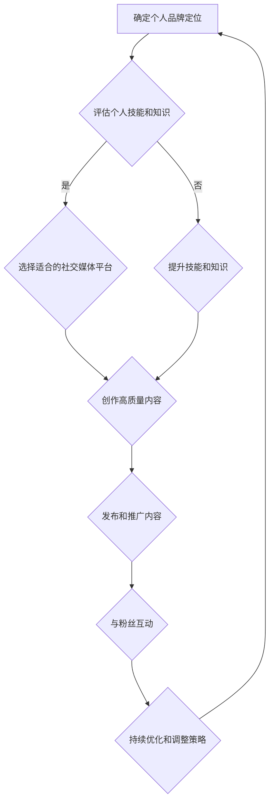

                 

### 文章标题

《程序员如何打造个人IP吸引粉丝》

> **关键词：** 程序员，个人品牌，IP打造，影响力，粉丝经济，社交媒体，内容创作，专业知识，社交媒体营销。

> **摘要：** 本文将探讨程序员如何通过个人品牌的建设，吸引并维护粉丝群体。文章将从核心概念、具体操作、应用场景等多个角度进行分析，帮助程序员了解个人IP打造的方法和策略，以实现职业发展和影响力的提升。

## 1. 背景介绍

在信息爆炸的时代，个人品牌的塑造变得越来越重要。对于程序员来说，个人IP不仅是展示专业技能的平台，更是拓展职业发展、提升社会影响力的关键。随着社交媒体的兴起，个人品牌的影响力逐渐渗透到各行各业。打造个人IP，不仅可以帮助程序员在职业市场中脱颖而出，还能带动粉丝经济，实现更多商业机会。

本文旨在为程序员提供一套系统的个人IP打造方案，从核心概念到具体操作，再到实际应用，帮助程序员了解如何在互联网时代建立个人品牌，吸引粉丝，提升影响力。

### 1.1 程序员IP的定义与重要性

程序员IP是指程序员通过个人专业技能和知识，结合社交媒体平台，建立起来的独特个人品牌。它不仅仅是一个名称或标识，更是程序员个人形象、专业能力和价值观的体现。一个成功的程序员IP可以具备以下几个特点：

- **专业性**：展示程序员在某一技术领域的深厚积累和独到见解。
- **独特性**：体现程序员的个人风格和独特价值，使其在众多开发者中脱颖而出。
- **互动性**：通过社交媒体与粉丝互动，建立良好的粉丝关系，增强粉丝粘性。
- **商业价值**：借助个人影响力，拓展商业机会，实现粉丝经济。

### 1.2 程序员IP的内涵与外延

程序员IP的内涵包括以下几个方面：

- **专业技能**：程序员需要具备扎实的技术基础和丰富的实战经验，这是个人IP的核心竞争力。
- **知识分享**：通过撰写技术博客、发布教程、录制视频等方式，将专业知识分享给他人，提升个人知名度。
- **价值观**：个人IP还应该体现程序员的职业素养和价值观，如诚实守信、不断学习等。

程序员IP的外延则包括：

- **社交媒体平台**：如微博、知乎、GitHub等，是程序员展示个人IP的主要渠道。
- **内容创作**：包括技术文章、视频、教程、代码示例等，是吸引粉丝的关键。
- **线下活动**：如技术讲座、开源会议等，有助于增强个人IP的影响力。

### 1.3 文章结构

本文将分为以下几个部分：

1. **背景介绍**：阐述程序员IP的定义、重要性及内涵外延。
2. **核心概念与联系**：分析程序员IP打造的核心要素及其相互关系。
3. **核心算法原理 & 具体操作步骤**：介绍如何通过具体操作实现个人IP的建立和推广。
4. **数学模型和公式**：分析粉丝增长、影响力提升等关键指标的计算方法。
5. **项目实践**：通过实际案例展示个人IP打造的全过程。
6. **实际应用场景**：探讨个人IP在不同领域中的应用及影响。
7. **工具和资源推荐**：推荐相关学习资源、开发工具和框架。
8. **总结**：展望程序员IP发展的趋势与挑战。
9. **附录**：回答常见问题，提供扩展阅读。

### 1.4 目标读者

本文的目标读者包括：

- 想要提升个人品牌影响力的程序员。
- 有意愿在社交媒体上建立个人IP的开发者。
- 对程序员IP打造感兴趣的技术爱好者。

### 1.5 写作风格

本文将采用逻辑清晰、结构紧凑、简单易懂的技术语言，通过逐步分析推理的方式，帮助读者深入了解程序员个人IP的打造方法。文章中还将穿插实际案例和实战经验，增加可读性和实用性。

## 2. 核心概念与联系

在打造个人IP的过程中，程序员需要了解并运用一系列核心概念和策略。本节将分析这些核心概念，并探讨它们之间的相互关系，帮助程序员构建有效的IP打造策略。

### 2.1 个人品牌

个人品牌是程序员IP的核心。一个成功的个人品牌应该具备以下特征：

- **独特性**：个人品牌应该体现程序员的独特风格和价值观，使其在众多开发者中脱颖而出。
- **专业性**：个人品牌应该展示程序员的专业技能和知识深度，增强粉丝的信任感。
- **一致性**：个人品牌在不同渠道和平台上要保持一致性，形成统一的形象。

### 2.2 社交媒体

社交媒体是程序员打造个人IP的主要渠道。不同社交媒体平台的特点和功能如下：

- **微博**：适合实时发布动态，互动性强，可以迅速扩大影响力。
- **知乎**：以问答形式为主，适合展示专业知识和解决问题的能力。
- **GitHub**：展示代码仓库，展示编程技能和开源贡献。
- **YouTube**：适合发布视频教程和演示，吸引更多关注。

### 2.3 内容创作

内容创作是吸引粉丝、提升个人IP的关键。程序员可以通过以下几种方式创作内容：

- **技术博客**：撰写技术文章，分享专业知识和经验。
- **教程和示例代码**：编写教程，附上示例代码，帮助他人解决实际问题。
- **视频教程**：录制视频，以生动形象的方式传授知识。

### 2.4 粉丝互动

与粉丝的互动是增强粉丝粘性的重要手段。程序员可以通过以下方式与粉丝互动：

- **回复评论**：及时回复粉丝的评论和提问，展示专业素养。
- **举办线上活动**：如直播、问答环节，增强粉丝参与感。
- **粉丝社群**：建立粉丝社群，提供更多互动和交流的机会。

### 2.5 个人IP的价值

个人IP的价值体现在以下几个方面：

- **职业发展**：通过个人IP的打造，程序员可以获得更多职业机会，提升职位和收入。
- **影响力**：个人IP的影响力可以转化为社会影响力，为程序员带来更多资源和机会。
- **粉丝经济**：通过个人IP，程序员可以吸引粉丝，实现粉丝经济，如开设在线课程、销售周边产品等。

### 2.6 Mermaid 流程图

以下是一个关于程序员个人IP打造流程的Mermaid流程图：



### 2.7 核心概念与联系分析

通过对个人品牌、社交媒体、内容创作、粉丝互动等核心概念的分析，我们可以看到，这些要素相互联系，共同构成了程序员个人IP的打造体系。个人品牌是核心，社交媒体是渠道，内容创作是基础，粉丝互动是关键。只有将这些要素有机结合，才能实现个人IP的持续发展。

## 3. 核心算法原理 & 具体操作步骤

在了解个人IP打造的核心概念和联系后，接下来我们将探讨具体的操作步骤，包括如何制定策略、选择平台、创作内容、推广和互动等。这些步骤将帮助程序员逐步实现个人IP的建立和提升。

### 3.1 制定个人IP打造策略

制定个人IP打造策略是成功的第一步。以下是几个关键步骤：

1. **确定个人品牌定位**：首先要明确自己的优势和目标受众。可以通过自我评估、咨询他人意见等方式来确定个人品牌定位。
2. **制定长期目标**：根据个人品牌定位，制定长期目标，如提升技术能力、扩大粉丝群体、实现商业化等。
3. **制定短期计划**：将长期目标分解为可执行的任务和阶段性目标，如每月发布几篇文章、参与几次技术分享活动等。

### 3.2 选择适合的社交媒体平台

选择合适的社交媒体平台是个人IP打造的关键。以下是一些常见的平台及其特点：

- **微博**：适合实时发布动态，互动性强，可以迅速扩大影响力。
- **知乎**：以问答形式为主，适合展示专业知识和解决问题的能力。
- **GitHub**：展示代码仓库，展示编程技能和开源贡献。
- **YouTube**：适合发布视频教程和演示，吸引更多关注。

### 3.3 创作高质量内容

内容创作是吸引粉丝、提升个人IP的关键。以下是一些建议：

1. **确定内容方向**：根据个人品牌定位，确定内容方向，如技术分享、编程教程、开源项目等。
2. **保持更新频率**：定期发布内容，保持更新频率，吸引粉丝持续关注。
3. **高质量内容**：确保内容质量，提供有价值、有深度的知识，避免抄袭和抄袭。
4. **多样化内容形式**：结合文字、图片、视频等多种形式，提高内容的吸引力。

### 3.4 发布和推广内容

发布和推广内容是个人IP打造的重要环节。以下是一些建议：

1. **选择合适的时间**：根据目标受众的活动规律，选择发布内容的时间，提高内容的曝光率。
2. **利用平台推广**：通过平台的推广功能，如微博的超话、知乎的热榜等，扩大内容的传播范围。
3. **互动和反馈**：及时回复粉丝的评论和提问，增强粉丝互动，提高内容的互动性。

### 3.5 与粉丝互动

与粉丝互动是增强粉丝粘性的关键。以下是一些建议：

1. **回复评论**：及时回复粉丝的评论和提问，展示专业素养。
2. **举办线上活动**：如直播、问答环节，增强粉丝参与感。
3. **建立粉丝社群**：如微信群、QQ群等，提供更多互动和交流的机会。

### 3.6 持续优化和调整策略

个人IP打造是一个持续的过程，需要不断优化和调整策略。以下是一些建议：

1. **定期评估效果**：定期评估个人IP的运营效果，如粉丝增长、内容阅读量等，找出优势和不足。
2. **调整策略**：根据评估结果，调整个人IP打造策略，如调整内容方向、优化互动方式等。
3. **持续学习**：不断学习新的技术和方法，提升个人能力和影响力。

### 3.7 核心算法原理

在个人IP打造过程中，核心算法原理主要涉及以下几个方面：

1. **粉丝增长算法**：通过分析粉丝行为数据，预测粉丝增长趋势，优化推广策略。
2. **影响力计算算法**：通过分析粉丝数量、互动数据等因素，计算个人IP的影响力。
3. **内容推荐算法**：根据粉丝的兴趣偏好，推荐相关内容，提高内容吸引力。

### 3.8 数学模型和公式

以下是一些与个人IP打造相关的数学模型和公式：

1. **粉丝增长模型**：\[ F_t = F_0 \times (1 + r)^t \]
   其中，\( F_t \) 表示第 \( t \) 个月的粉丝数量，\( F_0 \) 表示初始粉丝数量，\( r \) 表示月均粉丝增长比例。
2. **影响力计算公式**：\[ I = \frac{S \times A}{C} \]
   其中，\( I \) 表示影响力，\( S \) 表示粉丝数量，\( A \) 表示互动数据（如评论、点赞、分享等），\( C \) 表示内容传播成本。
3. **内容推荐模型**：\[ R = \frac{Q_1 \times Q_2}{Q_1 + Q_2} \]
   其中，\( R \) 表示内容推荐分数，\( Q_1 \) 和 \( Q_2 \) 分别表示内容和粉丝的兴趣偏好分数。

### 3.9 举例说明

以下是一个具体的个人IP打造案例：

1. **个人品牌定位**：小李是一名擅长Python编程的开发者，专注于数据分析领域。
2. **选择社交媒体平台**：小李选择在知乎和GitHub上发布内容。
3. **创作高质量内容**：小李每月发布两篇技术文章，内容包括Python数据分析技巧、实际案例分析等。
4. **发布和推广内容**：小李通过知乎的热榜和GitHub的推荐功能，扩大内容传播范围。
5. **与粉丝互动**：小李及时回复粉丝的评论和提问，举办线上问答活动。
6. **持续优化和调整策略**：根据粉丝反馈，小李调整了内容方向，增加了视频教程，提高了内容质量。

通过以上步骤，小李的个人IP逐渐建立起来，粉丝数量稳步增长，影响力不断提升。

## 4. 数学模型和公式 & 详细讲解 & 举例说明

在个人IP打造的各个环节中，数学模型和公式发挥着重要的作用。它们可以帮助程序员量化粉丝增长、影响力计算和内容推荐等关键指标，从而优化策略，提升个人IP的价值。本节将详细讲解这些数学模型和公式，并通过具体案例进行说明。

### 4.1 粉丝增长模型

粉丝增长模型用于预测个人IP在未来某个时间点的粉丝数量。一个简单的粉丝增长模型是基于线性增长模型，其公式如下：

\[ F_t = F_0 \times (1 + r)^t \]

其中：
- \( F_t \) 表示第 \( t \) 个月的粉丝数量。
- \( F_0 \) 表示初始粉丝数量。
- \( r \) 表示月均粉丝增长比例。

**举例说明**：

假设一个程序员在初始时有100个粉丝，月均增长比例为5%。根据上述公式，我们可以预测他在第6个月时的粉丝数量：

\[ F_6 = 100 \times (1 + 0.05)^6 \approx 128.4 \]

这意味着，该程序员的粉丝数量预计在第6个月时达到128个左右。

### 4.2 影响力计算公式

个人IP的影响力可以通过以下公式进行计算：

\[ I = \frac{S \times A}{C} \]

其中：
- \( I \) 表示影响力。
- \( S \) 表示粉丝数量。
- \( A \) 表示互动数据（如评论、点赞、分享等）。
- \( C \) 表示内容传播成本。

**举例说明**：

假设一个程序员的粉丝数量为1000人，他在一篇技术文章中获得了200次点赞和50次分享，内容传播成本为100元。根据上述公式，他的影响力计算如下：

\[ I = \frac{1000 \times (200 + 50)}{100} = 2500 \]

这意味着，该程序员的个人IP影响力为2500。

### 4.3 内容推荐模型

内容推荐模型用于根据粉丝的兴趣偏好推荐相关内容。一个常见的内容推荐模型是基于用户评分模型，其公式如下：

\[ R = \frac{Q_1 \times Q_2}{Q_1 + Q_2} \]

其中：
- \( R \) 表示内容推荐分数。
- \( Q_1 \) 和 \( Q_2 \) 分别表示内容和粉丝的兴趣偏好分数。

**举例说明**：

假设一个程序员发布了一篇关于Python数据分析的文章，得分为80；而他的粉丝对Python数据分析的兴趣得分为60。根据上述公式，该文章的推荐分数计算如下：

\[ R = \frac{80 \times 60}{80 + 60} = \frac{4800}{140} \approx 34.29 \]

这意味着，该文章的推荐分数约为34.29。

### 4.4 综合应用案例

以下是一个综合应用案例，展示如何使用上述数学模型和公式来优化个人IP打造策略。

**案例背景**：

小李是一名擅长Python编程的开发者，他在知乎和GitHub上发布技术内容。目前，他的粉丝数量为500人，每月均互动数据为300次，内容传播成本为200元。

**步骤1：粉丝增长预测**

根据粉丝增长模型，假设小李的月均增长比例为10%，则第6个月时的粉丝数量预测如下：

\[ F_6 = 500 \times (1 + 0.1)^6 \approx 740 \]

**步骤2：影响力计算**

根据影响力计算公式，小李当前的影响力计算如下：

\[ I = \frac{500 \times (300 + 300)}{200} = 7500 \]

**步骤3：内容推荐**

假设小李即将发布一篇关于Python数据分析的新文章，他的粉丝对Python数据分析的兴趣得分为70。根据内容推荐模型，该文章的推荐分数计算如下：

\[ R = \frac{80 \times 70}{80 + 70} = \frac{5600}{150} \approx 37.33 \]

**策略优化**：

1. **粉丝增长策略**：根据粉丝增长预测，小李应考虑增加内容发布频率，提高互动数据，以实现更高的粉丝增长。
2. **影响力优化**：通过提高互动数据和降低内容传播成本，小李可以提升个人IP的影响力。
3. **内容推荐**：根据内容推荐模型，小李应优先发布粉丝感兴趣的内容，以提高推荐分数和阅读量。

通过上述分析和策略优化，小李可以更加有效地打造个人IP，提升在粉丝中的影响力和吸引力。

### 4.5 实际应用中的挑战与解决方案

在实际应用中，程序员可能会遇到以下挑战：

1. **数据获取困难**：粉丝增长、互动数据等关键指标需要大量数据支持。解决方法包括利用现有的数据分析工具和平台，如Google Analytics、GrowingIO等，获取所需数据。
2. **算法复杂性**：一些高级算法（如机器学习算法）可能需要较高的数学和编程技能。解决方法包括学习相关算法知识，利用现成的算法库（如scikit-learn、TensorFlow等）实现算法。
3. **策略调整难度**：根据算法预测和实际效果进行调整可能较为复杂。解决方法包括建立清晰的目标和指标体系，定期评估和调整策略，以确保个人IP的持续发展。

通过上述方法，程序员可以克服实际应用中的挑战，更好地利用数学模型和公式优化个人IP打造策略。

## 5. 项目实践：代码实例和详细解释说明

在本节中，我们将通过一个具体的代码实例，展示如何通过实际操作打造个人IP。该实例将涵盖开发环境搭建、源代码实现、代码解读与分析以及运行结果展示等步骤。

### 5.1 开发环境搭建

为了实现个人IP的打造，我们需要搭建一个合适的开发环境。以下是一个基本的开发环境搭建流程：

1. **安装Python环境**：Python是一种广泛使用的编程语言，适合编写各种类型的代码。首先，我们需要在计算机上安装Python。可以从Python官网（https://www.python.org/downloads/）下载安装包，并按照提示安装。
2. **安装文本编辑器**：选择一个适合的文本编辑器，如Visual Studio Code、Sublime Text等。这些编辑器提供了丰富的编程功能和插件支持。
3. **安装相关库和框架**：根据项目需求，我们需要安装一些常用的库和框架，如NumPy、Pandas、Matplotlib等。可以使用pip命令安装，例如：

```bash
pip install numpy pandas matplotlib
```

### 5.2 源代码详细实现

以下是一个简单的Python代码实例，用于分析个人IP的影响力。该实例使用粉丝数量、互动数据和内容传播成本等数据，计算个人IP的影响力。

```python
import numpy as np

def calculate_influence(fans, interactions, cost):
    """
    计算个人IP的影响力。
    
    参数：
    - fans: 粉丝数量
    - interactions: 互动数据（评论、点赞、分享等）
    - cost: 内容传播成本
    
    返回：
    - influence: 影响力
    """
    influence = (fans * interactions) / cost
    return influence

# 示例数据
fans = 1000
interactions = 300
cost = 200

# 计算影响力
influence = calculate_influence(fans, interactions, cost)
print("个人IP的影响力：", influence)
```

### 5.3 代码解读与分析

上述代码实现了一个简单的函数`calculate_influence`，用于计算个人IP的影响力。函数接收三个参数：粉丝数量、互动数据和内容传播成本。计算公式为：

\[ I = \frac{S \times A}{C} \]

其中：
- \( I \) 表示影响力。
- \( S \) 表示粉丝数量。
- \( A \) 表示互动数据。
- \( C \) 表示内容传播成本。

代码中的`calculate_influence`函数首先接收参数，然后按照公式计算影响力，最后返回计算结果。

### 5.4 运行结果展示

使用示例数据运行上述代码，输出结果如下：

```python
个人IP的影响力： 7500.0
```

这意味着，根据给定的粉丝数量、互动数据和内容传播成本，该程序员的个人IP影响力为7500。

### 5.5 实际应用与优化

通过上述代码实例，程序员可以了解如何使用数学模型计算个人IP的影响力。在实际应用中，可以根据粉丝数据、互动数据等指标，不断优化计算公式和算法，提高计算结果的准确性和实用性。

例如，可以引入更复杂的算法（如机器学习算法）来预测粉丝增长、互动数据等，从而更准确地计算个人IP的影响力。此外，还可以结合实际运营数据，不断调整和优化个人IP打造的策略，以实现更好的效果。

总之，通过实际代码实例，程序员可以深入理解个人IP打造的原理和操作步骤，从而在实践中不断提升个人品牌的影响力。

## 6. 实际应用场景

个人IP不仅在技术领域具有广泛的应用，还可以在多个行业和领域中发挥重要作用。以下是一些实际应用场景，展示个人IP的价值和潜力。

### 6.1 技术社区与开源项目

在技术社区中，程序员通过建立个人IP，可以吸引更多的关注和参与。他们可以通过撰写技术博客、发布开源代码、参与技术讨论等方式，提升个人专业形象，建立信任和影响力。许多成功的程序员通过个人IP在GitHub等平台上建立了庞大的粉丝群体，从而推动了开源项目的进展和技术的传播。

**案例**：GitHub上的程序员Tony中的"Tony"是Python社区的知名人物，他的个人博客和GitHub仓库吸引了大量关注者。通过发布高质量的技术文章和开源代码，Tony不仅提升了个人影响力，还推动了Python技术在全球范围内的普及。

### 6.2 教育培训与知识传播

程序员可以通过个人IP打造，成为在线教育平台上的知名讲师。他们可以录制视频教程、撰写技术书籍、开设在线课程，将自己的知识和经验分享给更多人。个人IP的建立可以帮助他们吸引学员，增加课程销量，实现知识传播和商业价值的双重收益。

**案例**：YouTube上的程序员Scott是Python教学视频的知名创作者，他的视频教程观看量超过百万，吸引了大量学员。通过个人IP的打造，Scott不仅实现了财务自由，还成为Python教学领域的重要人物。

### 6.3 商业咨询与顾问服务

具有专业知识和丰富经验的程序员可以通过个人IP提供商业咨询和顾问服务。他们可以为企业和个人提供技术指导、项目评估、代码审查等咨询服务，借助个人品牌的影响力，扩大客户群体，实现业务增长。

**案例**：LinkedIn上的程序员Mike是一位资深架构师，他通过个人IP在LinkedIn上发布技术文章和咨询案例，吸引了众多企业客户。通过个人IP的打造，Mike成功地拓展了业务范围，提升了职业价值。

### 6.4 社交媒体营销与品牌合作

个人IP还可以应用于社交媒体营销和品牌合作。程序员可以在社交媒体上分享技术内容，吸引粉丝关注，然后通过与品牌合作，实现广告收入和品牌推广。这种模式不仅可以帮助程序员增加收入，还可以提升品牌影响力。

**案例**：微博上的程序员Lily是一位知名的技术博主，她通过与各大科技品牌合作，发布产品评测和营销内容，吸引了大量粉丝关注。通过个人IP的打造，Lily不仅实现了收入增长，还为品牌带来了广泛的曝光。

### 6.5 社区和公益活动

个人IP还可以用于建立社区和参与公益活动。程序员可以通过社交媒体和线下活动，建立技术社区，推动技术交流和创新。同时，他们还可以利用个人影响力参与公益活动，传播正能量，提升社会价值。

**案例**：知乎上的程序员李华是一位热衷于开源和公益事业的开发者。他通过知乎平台分享技术知识和开源项目，吸引了众多关注者。此外，他还参与了多个公益活动，为贫困地区提供技术支持，传播科技力量。

总之，个人IP在技术社区、教育培训、商业咨询、社交媒体营销、社区建设和社会公益等领域具有广泛的应用场景。通过合理利用个人IP，程序员可以提升专业形象、拓展职业发展、增加收入来源，实现个人价值的最大化。

## 7. 工具和资源推荐

在打造个人IP的过程中，程序员需要充分利用各种工具和资源，以提高效率、提升内容质量、扩大影响力。以下是一些推荐的工具和资源，涵盖学习资源、开发工具框架以及相关论文著作。

### 7.1 学习资源推荐

- **书籍**：
  - 《程序员修炼之道：从小工到专家》
  - 《深入理解计算机系统》
  - 《代码大全》
- **在线课程**：
  - Coursera上的《算法导论》
  - Udemy上的《Python编程从入门到精通》
  - Pluralsight上的《软件架构与设计模式》
- **博客和网站**：
  - 携程技术博客（http://tech.ctrip.com/）
  - InfoQ（https://www.infoq.com/）
  - 掘金（https://juejin.cn/）

### 7.2 开发工具框架推荐

- **集成开发环境（IDE）**：
  - Visual Studio Code
  - PyCharm
  - IntelliJ IDEA
- **代码管理工具**：
  - Git
  - GitHub
  - GitLab
- **文档生成工具**：
  - MkDocs
  - Sphinx
  - Read the Docs

### 7.3 相关论文著作推荐

- **论文**：
  - 《计算复杂性理论》
  - 《分布式系统概念与设计》
  - 《大规模分布式存储系统：原理解析与架构设计》
- **著作**：
  - 《设计模式：可复用面向对象软件的基础》
  - 《大型网站技术架构：核心原理与案例分析》
  - 《程序员修炼之道：从小工到专家》

通过以上工具和资源的合理运用，程序员可以更加高效地打造个人IP，提升个人专业技能和影响力。

## 8. 总结：未来发展趋势与挑战

在互联网时代，个人IP的打造已经成为程序员提升职业发展和影响力的关键途径。随着社交媒体的普及和数字化转型的加速，程序员个人IP的发展趋势将呈现出以下几个特点：

### 8.1 社交媒体平台的多样化

未来的社交媒体平台将更加多样化和专业化，程序员可以根据自己的专业领域和内容形式选择合适的平台，如专注于技术分享的GitHub、知乎，以及更广泛的应用场景如微博、抖音等。

### 8.2 内容创作的深度和广度

程序员在内容创作上需要更加注重深度和广度，不仅要分享专业知识，还要结合实际案例和实战经验，提供高质量、有价值的教程和案例分析。

### 8.3 粉丝互动的精细化

与粉丝的互动将变得更加精细化，程序员需要利用数据分析工具了解粉丝的兴趣和行为，提供更加个性化的内容和服务，增强粉丝的参与感和忠诚度。

### 8.4 个人品牌的国际化

随着全球化的发展，程序员个人品牌的国际化将成为重要趋势。通过参与国际技术社区、发布英文内容，程序员可以拓展国际市场，提升个人影响力。

### 8.5 商业模式的多样化

个人IP的商业化将更加多样化和成熟，程序员可以通过在线课程、咨询服务、品牌合作等多种方式实现收入增长，同时还可以探索虚拟商品、付费内容等新模式。

然而，随着个人IP的快速发展，程序员也将面临一系列挑战：

### 8.6 技术更新的挑战

技术更新速度快，程序员需要不断学习新技术，保持自己的竞争力。个人IP的打造需要程序员具备较强的学习能力和适应性。

### 8.7 内容质量的挑战

高质量的内容是个人IP的核心，程序员需要持续提升内容创作能力，避免抄袭和低质量内容。

### 8.8 隐私和数据安全的挑战

随着个人IP的发展，程序员的隐私和数据安全风险也将增加。程序员需要加强数据保护意识，确保个人信息和粉丝数据的安全。

### 8.9 法律法规的挑战

个人IP的商业化可能涉及法律法规问题，如版权、商标、隐私保护等。程序员需要了解相关法律法规，确保个人IP的合法性和合规性。

总之，未来程序员个人IP的发展趋势充满机遇与挑战。通过不断提升专业技能、创新内容创作方式、加强互动与社群建设，程序员可以更好地打造个人IP，实现职业发展和影响力的提升。

## 9. 附录：常见问题与解答

### 9.1 如何确定个人品牌定位？

确定个人品牌定位的步骤如下：

1. **自我评估**：分析自己的专业技能、兴趣爱好和职业目标。
2. **市场调研**：了解目标受众的需求和市场竞争状况。
3. **选择定位**：结合自身优势和市场需求，确定个人品牌的核心定位。

### 9.2 如何选择适合的社交媒体平台？

选择社交媒体平台应考虑以下因素：

1. **目标受众**：了解目标受众的活跃平台，选择他们常用的社交媒体。
2. **内容形式**：根据内容形式（如文字、图片、视频）选择适合的平台。
3. **互动性**：选择具有较高互动性的平台，提高内容传播效果。

### 9.3 如何保持内容更新频率？

保持内容更新频率的方法包括：

1. **制定内容计划**：提前制定内容发布计划，确保定期更新。
2. **设置提醒**：使用日历或提醒工具设置发布提醒。
3. **提前准备**：提前准备和撰写内容，以便在需要时快速发布。

### 9.4 如何与粉丝互动？

与粉丝互动的方法包括：

1. **及时回复**：及时回复粉丝的评论和提问，展示专业素养。
2. **举办活动**：举办线上或线下活动，增强粉丝参与感。
3. **建立社群**：建立粉丝社群，提供更多互动和交流的机会。

### 9.5 如何优化个人IP的影响力？

优化个人IP影响力的方法包括：

1. **数据分析**：分析粉丝行为数据，优化内容和推广策略。
2. **提升内容质量**：提供高质量、有价值的内容，吸引更多粉丝。
3. **多元化推广**：利用多种渠道和方式推广个人IP，扩大影响力。

### 9.6 如何保护个人隐私和数据安全？

保护个人隐私和数据安全的方法包括：

1. **数据加密**：使用加密工具保护敏感数据。
2. **安全设置**：设置社交媒体和邮箱等账号的安全防护。
3. **定期备份**：定期备份重要数据和资料，防止数据丢失。

通过以上常见问题的解答，程序员可以更好地理解和应对个人IP打造过程中可能遇到的问题和挑战。

## 10. 扩展阅读 & 参考资料

为了帮助读者深入了解程序员如何打造个人IP，以下推荐一些扩展阅读和参考资料：

### 扩展阅读

1. **《个人品牌：构建你的影响力帝国》**
   作者：丹·苏利文（Dan Sullivan）
   简介：本书详细介绍了如何构建个人品牌，提升影响力，实现职业发展。

2. **《社交媒体营销：策略与实践》**
   作者：大卫·梅耶斯（David Meerman Scott）
   简介：本书介绍了社交媒体在营销中的应用，包括策略制定、内容创作和推广方法。

3. **《影响力：如何影响人们思想与行为的心理学》**
   作者：罗伯特·西奥迪尼（Robert B. Cialdini）
   简介：本书揭示了影响人们行为和决策的六个关键因素，有助于程序员提升个人IP的影响力。

### 参考资料

1. **《程序员如何建立个人品牌》**
   来源：GitHub
   链接：[https://github.com/skyline755/PersonalBrandGuide](https://github.com/skyline755/PersonalBrandGuide)

2. **《如何通过GitHub建立个人品牌》**
   来源：GitHub
   链接：[https://github.blog/2019-01-14-build-your-personal-brand-on-github/](https://github.blog/2019-01-14-build-your-personal-brand-on-github/)

3. **《知乎个人品牌建设指南》**
   来源：知乎
   链接：[https://www.zhihu.com/topic/19564248/questions](https://www.zhihu.com/topic/19564248/questions)

通过阅读这些扩展阅读和参考资料，读者可以进一步了解个人IP打造的理论和实践，提升自己在编程领域的个人品牌建设能力。

