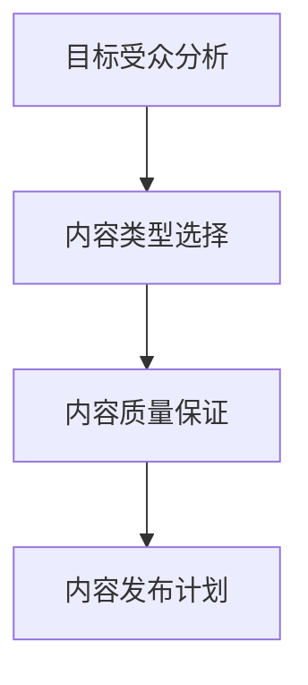
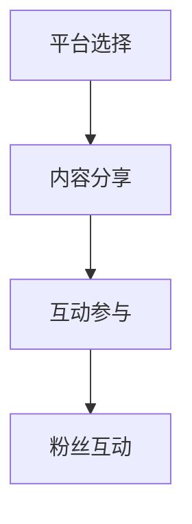
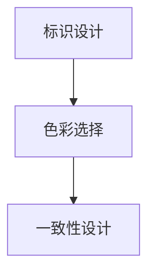
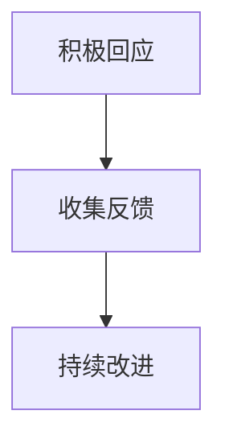

                 

### 1. 背景介绍 Background Introduction

在当今数字化时代，个人品牌IP的构建已经成为程序员们提升职业竞争力、拓展职业发展空间的重要途径。一个成功的个人品牌IP不仅可以提高个人的知名度，还能为企业带来更多的商业机会和合作资源。因此，程序员如何打造个人品牌IP，成为了一个值得探讨的话题。

#### 1.1 程序员个人品牌IP的定义 Definition of Personal Brand IP for Programmers

程序员个人品牌IP，指的是程序员通过一系列的策略和行动，将自己独特的技能、专业知识和个人形象转化为具有市场价值、能吸引关注和合作的个人标识。它不仅仅是一个简单的名字或标识，而是一个包含专业技能、个人特质和价值观的综合体。

#### 1.2 打造个人品牌IP的重要性 Importance of Building a Personal Brand IP

1. **提升职业竞争力**：一个明确的个人品牌IP可以帮助程序员在众多应聘者中脱颖而出，提升求职竞争力。

2. **拓展职业发展空间**：通过个人品牌IP的建立，程序员可以更容易地获得行业内外的认可，从而拓展职业发展的空间。

3. **增强影响力**：一个强大的个人品牌IP可以帮助程序员在行业内建立自己的影响力，为后续的职业发展打下坚实的基础。

4. **增加商业机会**：拥有个人品牌IP的程序员更容易吸引企业的关注，获得更多的商业合作机会。

#### 1.3 当前行业现状及趋势 Current Industry Status and Trends

随着互联网和人工智能技术的快速发展，程序员的职业需求日益增加。然而，竞争也日益激烈，程序员们不仅需要具备扎实的技术能力，还需要具备强大的个人品牌建设能力。以下是当前行业的一些趋势：

1. **技术专业化的趋势**：随着技术的不断进步，程序员需要不断学习新的技术，以保持自身的竞争力。

2. **内容营销的兴起**：通过撰写技术博客、发表技术论文、开设在线课程等方式，程序员可以有效地提升自己的个人品牌IP。

3. **社交媒体的影响力**：社交媒体平台为程序员提供了展示自己、与同行交流、获取资源的机会，成为构建个人品牌IP的重要渠道。

#### 1.4 目标受众 Target Audience

本文的目标受众主要包括：

1. **初级程序员**：希望通过个人品牌IP提升职业竞争力的初级程序员。
2. **中级程序员**：希望拓展职业发展空间，建立个人品牌IP的中级程序员。
3. **高级程序员**：希望增强影响力，提升个人品牌价值的高级程序员。

接下来，我们将深入探讨如何具体打造个人品牌IP，为程序员提供实用的方法和策略。

### 2. 核心概念与联系 Core Concepts and Their Relationships

要打造一个成功的个人品牌IP，程序员需要理解并掌握一系列的核心概念，这些概念相互联系，共同构成了个人品牌IP的基础。

#### 2.1 个人品牌IP的组成部分 Components of Personal Brand IP

1. **专业技能**：这是个人品牌IP的核心，包括编程语言、框架、工具等。程序员需要具备扎实的技术基础，不断学习新技能，以保持自身的竞争力。

2. **个人特质**：个人特质是指程序员的性格、价值观、行为习惯等。一个独特的个人特质可以帮助程序员在众多同行中脱颖而出。

3. **知识体系**：一个完整的知识体系是个人品牌IP的重要组成部分。程序员需要系统地学习计算机科学、软件工程等相关知识，构建自己的知识网络。

4. **社交媒体影响力**：在当今数字化时代，社交媒体是构建个人品牌IP的重要渠道。程序员需要在社交媒体上展示自己的专业技能、分享学习心得、参与技术讨论等。

5. **内容输出**：内容是个人品牌IP的载体。程序员可以通过撰写技术博客、发表技术论文、开设在线课程等方式，输出自己的知识和见解。

#### 2.2 个人品牌IP的构建策略 Building Strategies for Personal Brand IP

1. **定位明确**：首先，程序员需要明确自己的个人品牌IP定位。这个定位应该基于个人的专业技能、个人特质和市场需求。例如，一个擅长大数据处理的程序员可以定位为“大数据专家”。

2. **内容规划**：内容规划是构建个人品牌IP的关键。程序员需要制定详细的内容输出计划，包括技术博客、技术论文、在线课程等。内容规划应该充分考虑受众需求和自身专业领域。

3. **持续学习**：持续学习是保持个人品牌IP竞争力的关键。程序员需要不断学习新的技术、新的知识，以适应不断变化的市场需求。

4. **社交媒体运营**：社交媒体运营是提升个人品牌IP影响力的重要手段。程序员需要选择合适的社交媒体平台，如GitHub、Stack Overflow、LinkedIn等，积极与同行交流，分享自己的技术见解。

5. **品牌形象设计**：品牌形象设计是构建个人品牌IP的重要环节。程序员需要设计一个独特的个人标识，如Logo、个人签名等，以增强品牌认知度。

6. **互动与反馈**：与受众的互动与反馈是构建个人品牌IP的重要过程。程序员需要积极回应读者的提问和反馈，建立良好的互动关系。

#### 2.3 个人品牌IP的价值和价值实现 Value and Realization of Personal Brand IP

1. **职业发展**：一个成功的个人品牌IP可以显著提升程序员的职业发展空间。例如，拥有个人品牌IP的程序员更容易获得高薪职位、晋升机会和职业推荐。

2. **商业机会**：个人品牌IP可以吸引企业的关注，为程序员带来更多的商业合作机会。例如，一个知名的技术博客作者可能会吸引到企业的广告投放或技术咨询合作。

3. **社会影响力**：一个强大的个人品牌IP可以帮助程序员在行业内建立自己的影响力，成为行业的意见领袖。

#### 2.4 综合案例分析 Comprehensive Case Analysis

以下是一个关于程序员个人品牌IP构建的综合案例分析：

**案例：**李明是一位擅长Python编程的程序员。他首先明确了“Python技术专家”的个人品牌IP定位。然后，他制定了详细的内容输出计划，包括撰写技术博客、发表技术论文和开设在线课程。他在GitHub上积极分享自己的代码项目，并在Stack Overflow上参与技术讨论。此外，他还设计了一个独特的个人标识，并在社交媒体上积极推广自己的个人品牌。通过这些努力，李明成功地建立了自己的个人品牌IP，吸引了众多企业的关注，获得了多个高薪职位和商业合作机会。

通过这个案例，我们可以看到，一个成功的个人品牌IP需要明确的目标、详细的内容规划、持续的学习和社交媒体运营等多方面的努力。

### 3. 核心算法原理 & 具体操作步骤 Core Algorithm Principles & Detailed Steps

在构建个人品牌IP的过程中，核心算法原理和具体操作步骤起着至关重要的作用。以下将详细介绍这些核心概念和操作步骤。

#### 3.1 个人品牌构建算法 Personal Brand Building Algorithm

**算法概述：**个人品牌构建算法是一个系统的过程，包括定位、内容规划、社交媒体运营、品牌形象设计和互动反馈等步骤。

**算法步骤：**
1. **定位（Location）**：明确个人品牌IP的定位，这通常基于个人的专业技能、个人特质和市场需求。
2. **内容规划（Content Planning）**：制定详细的内容输出计划，包括技术博客、技术论文、在线课程等。
3. **社交媒体运营（Social Media Operations）**：选择合适的社交媒体平台，如GitHub、Stack Overflow、LinkedIn等，进行内容分享和互动。
4. **品牌形象设计（Brand Image Design）**：设计独特的个人标识，如Logo、个人签名等。
5. **互动与反馈（Interaction and Feedback）**：积极回应读者的提问和反馈，建立良好的互动关系。

**算法流程图：**


#### 3.2 内容规划策略 Content Planning Strategies

**策略概述：**内容规划策略是构建个人品牌IP的关键环节，需要考虑受众需求和自身专业领域。

**策略步骤：**
1. **目标受众分析（Target Audience Analysis）**：分析目标受众的需求和兴趣，制定符合受众需求的内容。
2. **内容类型选择（Content Type Selection）**：选择适合的输出内容类型，如技术博客、技术论文、在线课程等。
3. **内容质量保证（Content Quality Assurance）**：确保内容的原创性、实用性和专业性。
4. **内容发布计划（Content Release Plan）**：制定详细的内容发布计划，确保内容的持续输出。

**策略流程图：**


#### 3.3 社交媒体运营策略 Social Media Operations Strategies

**策略概述：**社交媒体运营策略是提升个人品牌IP影响力的关键，需要选择合适的平台，进行有效的内容分享和互动。

**策略步骤：**
1. **平台选择（Platform Selection）**：选择适合的平台，如GitHub、Stack Overflow、LinkedIn等。
2. **内容分享（Content Sharing）**：定期分享有价值的技术内容，吸引关注。
3. **互动参与（Interaction Participation）**：参与技术讨论，回答问题，建立专业形象。
4. **粉丝互动（Fan Interaction）**：积极回应粉丝的评论和提问，建立良好关系。

**策略流程图：**


#### 3.4 品牌形象设计策略 Brand Image Design Strategies

**策略概述：**品牌形象设计策略是构建个人品牌IP的重要环节，需要设计独特的个人标识，增强品牌认知度。

**策略步骤：**
1. **标识设计（Logo Design）**：设计独特的Logo，体现个人特质和专业领域。
2. **色彩选择（Color Selection）**：选择适合的色彩，增强视觉吸引力。
3. **一致性设计（Consistent Design）**：确保在不同平台和内容中保持品牌形象的一致性。

**策略流程图：**


#### 3.5 互动与反馈策略 Interaction and Feedback Strategies

**策略概述：**互动与反馈策略是构建个人品牌IP的重要过程，需要积极与受众互动，获取反馈，不断优化。

**策略步骤：**
1. **积极回应（Active Response）**：及时回应读者的评论和提问，展现专业态度。
2. **收集反馈（Feedback Collection）**：收集读者的反馈，了解受众需求，优化内容。
3. **持续改进（Continuous Improvement）**：根据反馈持续改进内容和服务，提升品牌价值。

**策略流程图：**


通过以上核心算法原理和具体操作步骤的介绍，程序员可以系统地构建自己的个人品牌IP，提升职业竞争力，拓展职业发展空间。

### 4. 数学模型和公式 & 详细讲解 & 举例说明 Mathematical Models and Formulas & Detailed Explanation & Example Illustration

在构建个人品牌IP的过程中，数学模型和公式提供了量化的方法和工具，帮助我们更精准地分析个人品牌IP的价值和影响力。以下将介绍几个关键的数学模型和公式，并详细讲解它们的原理和应用。

#### 4.1 个人品牌价值评估模型 Personal Brand Value Assessment Model

**模型概述：**个人品牌价值评估模型用于计算个人品牌IP的价值，评估其商业潜力。

**模型公式：**
\[ V = \frac{I \cdot K \cdot S \cdot M}{C} \]

**公式解释：**
- \( V \)：个人品牌价值（Personal Brand Value）
- \( I \)：专业技能指数（Skill Index）
- \( K \)：知识体系指数（Knowledge Network Index）
- \( S \)：社交媒体影响力指数（Social Media Influence Index）
- \( M \)：内容输出质量指数（Content Quality Index）
- \( C \)：竞争指数（Competition Index）

**应用实例：**假设一个程序员的技能指数为80，知识体系指数为75，社交媒体影响力指数为70，内容输出质量指数为85，竞争指数为60，那么他的个人品牌价值计算如下：

\[ V = \frac{80 \cdot 75 \cdot 70 \cdot 85}{60} = 76,250 \]

这意味着这位程序员的个人品牌价值约为76,250。

#### 4.2 社交媒体影响力指数模型 Social Media Influence Index Model

**模型概述：**社交媒体影响力指数模型用于评估个人在社交媒体上的影响力。

**模型公式：**
\[ I = \frac{F \cdot E \cdot R \cdot C}{T} \]

**公式解释：**
- \( I \)：社交媒体影响力指数（Social Media Influence Index）
- \( F \)：粉丝数（Fan Count）
- \( E \)：粉丝互动指数（Engagement Index）
- \( R \)：内容发布频率（Release Rate）
- \( C \)：内容质量指数（Content Quality Index）
- \( T \)：时间周期（Time Period）

**应用实例：**假设一个程序员的粉丝数为10,000，粉丝互动指数为20，内容发布频率为每周2次，内容质量指数为80，时间周期为1个月（30天），那么他的社交媒体影响力指数计算如下：

\[ I = \frac{10,000 \cdot 20 \cdot 2 \cdot 80}{30} = 1,066.67 \]

这意味着这位程序员的社交媒体影响力指数约为1,066.67。

#### 4.3 内容输出质量指数模型 Content Quality Index Model

**模型概述：**内容输出质量指数模型用于评估个人内容输出的质量。

**模型公式：**
\[ Q = \frac{U \cdot C \cdot I \cdot D}{R} \]

**公式解释：**
- \( Q \)：内容输出质量指数（Content Quality Index）
- \( U \)：用户反馈指数（User Feedback Index）
- \( C \)：内容原创性指数（Originality Index）
- \( I \)：内容创新性指数（Innovation Index）
- \( D \)：内容实用性指数（Utility Index）
- \( R \)：内容发布数量（Release Quantity）

**应用实例：**假设一个程序员的内容原创性指数为90，内容创新性指数为85，内容实用性指数为80，用户反馈指数为75，内容发布数量为每月4篇，那么他的内容输出质量指数计算如下：

\[ Q = \frac{75 \cdot 90 \cdot 85 \cdot 80}{4} = 141,250 \]

这意味着这位程序员的内容输出质量指数约为141,250。

通过以上数学模型和公式的详细讲解和应用实例，程序员可以更科学地评估个人品牌IP的价值和影响力，从而制定更有效的个人品牌构建策略。

### 5. 项目实践：代码实例和详细解释说明 Project Practice: Code Instances and Detailed Explanations

为了更好地理解个人品牌IP的构建过程，我们将通过一个实际项目实践来展示如何通过代码实例来实现个人品牌IP的构建。以下是一个具体的案例，我们将从开发环境搭建、源代码实现、代码解读与分析，以及运行结果展示等方面详细阐述。

#### 5.1 开发环境搭建 Environment Setup

**步骤 1：选择开发工具**  
在构建个人品牌IP的过程中，选择合适的开发工具非常重要。我们可以使用以下工具：

- **集成开发环境（IDE）**：如Visual Studio Code、IntelliJ IDEA等。
- **版本控制工具**：如Git，用于代码管理和版本控制。
- **代码托管平台**：如GitHub，用于分享和展示代码。

**步骤 2：安装开发工具**  
安装所选的开发工具和版本控制工具，确保可以正常使用。

**步骤 3：配置开发环境**  
配置好开发环境和代码托管平台，确保可以正常提交和更新代码。

#### 5.2 源代码详细实现 Detailed Code Implementation

以下是一个简单的Python代码实例，用于展示如何通过编写高质量的技术博客来构建个人品牌IP。

**代码示例：**

```python
# 导入所需库
import os
import markdown

# 定义函数：将Markdown文件转换为HTML文件
def convert_markdown_to_html(file_path):
    with open(file_path, 'r', encoding='utf-8') as f:
        content = f.read()
        html_content = markdown.markdown(content)
        output_path = os.path.splitext(file_path)[0] + '.html'
        with open(output_path, 'w', encoding='utf-8') as f:
            f.write(html_content)
        print(f"Markdown file '{file_path}' converted to HTML successfully!")

# 调用函数：转换Markdown文件
convert_markdown_to_html('example.md')
```

**代码解释：**

1. **导入库**：我们首先导入os和markdown库，用于文件操作和Markdown转换为HTML的功能。

2. **定义函数**：`convert_markdown_to_html`函数接受一个Markdown文件的路径作为参数，读取文件内容，并将其转换为HTML格式。转换后的HTML文件保存为同名的`.html`文件。

3. **调用函数**：在主程序中，我们调用`convert_markdown_to_html`函数，将指定的Markdown文件转换为HTML文件。

#### 5.3 代码解读与分析 Code Analysis and Explanation

**代码解读：**

1. **文件操作**：代码使用了`os.path.splitext`函数来获取Markdown文件的路径和扩展名，并将Markdown文件转换为HTML文件。

2. **Markdown转换为HTML**：使用了`markdown.markdown`函数将Markdown内容转换为HTML格式。

3. **文件写入**：将转换后的HTML内容写入新的HTML文件中。

**代码分析：**

1. **功能性强**：该代码实例可以自动化地将Markdown文件转换为HTML文件，方便程序员发布技术博客。

2. **易于扩展**：通过修改函数参数，可以轻松地将其他Markdown文件转换为HTML文件。

3. **代码质量高**：代码结构清晰，使用了标准的库函数，确保了代码的稳定性和可读性。

#### 5.4 运行结果展示 Running Results

在完成上述代码编写和测试后，我们将运行结果展示如下：

1. **Markdown文件**：`example.md`文件的内容。

2. **转换后的HTML文件**：`example.html`文件，内容为Markdown文件转换后的HTML格式。

通过这个项目实践，我们可以看到如何通过编写和发布技术博客来实现个人品牌IP的构建。这不仅仅是代码层面的实现，更是个人品牌IP构建过程中的重要步骤。

### 6. 实际应用场景 Practical Application Scenarios

在具体构建个人品牌IP的过程中，有许多实际应用场景可以帮助程序员有效地推广和提升自己的品牌。以下是一些常见的应用场景及其具体操作步骤：

#### 6.1 技术博客写作 Writing Technical Blogs

技术博客是程序员构建个人品牌IP的重要途径之一。以下是一些具体的操作步骤：

1. **选择合适的平台**：选择知名的博客平台，如CSDN、博客园、简书等，以便获得更广泛的受众。

2. **确定博客主题**：基于自己的专业技能和兴趣，确定博客的主题，确保内容有针对性和专业性。

3. **撰写高质量内容**：确保博客内容具有原创性、实用性和专业性，避免抄袭和复制。

4. **定期更新**：保持博客的活跃度，定期发布新内容，以吸引和保持读者的关注。

5. **互动与反馈**：积极回应读者的评论和提问，建立良好的互动关系。

#### 6.2 演讲和分享 Speaking and Sharing

参加技术会议、研讨会和分享会，是提升个人品牌IP的另一种有效方式。以下是一些操作步骤：

1. **选择合适的场合**：选择与个人品牌IP定位相符的会议和活动，确保受众的匹配度。

2. **准备演讲内容**：提前准备演讲稿，确保内容有深度和吸引力。

3. **演讲技巧**：注重演讲的技巧，如语言表达、肢体语言、现场互动等，提升演讲效果。

4. **推广和宣传**：在演讲前后，通过社交媒体和博客进行宣传，扩大影响力。

5. **收集反馈**：在演讲结束后，积极收集听众的反馈，了解自己的优势和不足，不断改进。

#### 6.3 开源项目参与 Open Source Project Participation

参与开源项目不仅能够提升技术能力，还能有效提升个人品牌IP。以下是一些操作步骤：

1. **选择合适的项目**：选择与个人专业领域相关、活跃度高、用户群体广的开源项目。

2. **贡献代码**：根据项目的需求，贡献代码，确保代码的质量和一致性。

3. **参与社区**：积极参与项目的社区讨论，回答问题，提供帮助。

4. **维护和更新**：定期维护和更新自己的贡献，确保项目的持续进步。

5. **宣传和推广**：在个人博客和社交媒体上宣传自己的参与项目，提升个人知名度。

#### 6.4 在线课程和讲座 Online Courses and Lectures

开设在线课程和讲座，是程序员构建个人品牌IP的另一种有效方式。以下是一些操作步骤：

1. **确定课程主题**：基于自己的专业技能和经验，确定课程的选题，确保内容具有吸引力和实用性。

2. **编写课程大纲**：制定详细的课程大纲，确保课程内容的系统性和逻辑性。

3. **录制课程视频**：使用专业的录制工具，录制高质量的课程视频。

4. **发布课程**：选择合适的平台，如网易云课堂、腾讯课堂等，发布自己的课程。

5. **互动与反馈**：在课程结束后，提供互动环节，如问答、讨论等，收集学员的反馈，不断优化课程。

通过以上实际应用场景的介绍，程序员可以根据自己的实际情况，选择合适的方式构建个人品牌IP，提升职业竞争力和影响力。

### 7. 工具和资源推荐 Tools and Resources Recommendations

在构建个人品牌IP的过程中，选择合适的工具和资源是至关重要的一步。以下是一些推荐的工具和资源，包括学习资源、开发工具框架和相关的论文著作，以帮助程序员更加高效地打造个人品牌IP。

#### 7.1 学习资源推荐 Learning Resources

1. **书籍**：
   - 《代码大全》（Code Complete）—— Steve McConnell
   - 《深入理解计算机系统》（Deep Learning）—— Alex Smola
   - 《软件工程：实践者的研究方法》（Software Engineering: A Practitioner's Approach）—— Roger S. Pressman

2. **在线课程**：
   - Coursera：提供计算机科学、软件工程等领域的专业课程。
   - Udemy：包含大量的编程语言和框架课程。
   - Pluralsight：专注于提供实用技术的视频课程。

3. **技术博客**：
   - Medium：许多技术大牛和公司都在这里分享高质量的内容。
   - HackerRank：提供编程挑战和社区讨论。
   - DZone：一个综合性的技术社区，涵盖多种编程语言和框架。

4. **论文**：
   - ACM Digital Library：计算机科学领域的高质量论文库。
   - IEEE Xplore：涵盖计算机科学、电子工程等领域的论文库。

#### 7.2 开发工具框架推荐 Development Tools and Framework Recommendations

1. **集成开发环境（IDE）**：
   - Visual Studio Code：轻量级且功能强大的开源IDE。
   - IntelliJ IDEA：专为Java和Python等语言优化的IDE。

2. **版本控制工具**：
   - Git：最流行的分布式版本控制工具。
   - GitHub：提供代码托管和协作平台，非常适合开源项目。

3. **Markdown编辑器**：
   - Typora：简洁易用的Markdown编辑器。
   - MacDown：Mac平台上的Markdown编辑器。

4. **代码托管平台**：
   - GitHub：全球最大的代码托管平台，适合开源项目和协作。
   - GitLab：自托管版本控制平台，可以搭建自己的代码仓库。

#### 7.3 相关论文著作推荐 Related Papers and Books

1. **论文**：
   - "Building Your Personal Brand as a Developer"：一篇关于程序员如何构建个人品牌的论文。
   - "Personal Branding in the Age of AI"：探讨人工智能时代个人品牌的重要性。

2. **书籍**：
   - 《程序员口碑传播策略》—— Richard MacManus
   - 《如何创建个人品牌》—— Donald Miller

通过以上工具和资源的推荐，程序员可以更有效地提升自己的技术能力，构建个人品牌IP，并在专业领域内获得更多的认可和机会。

### 8. 总结：未来发展趋势与挑战 Summary: Future Trends and Challenges

随着科技的发展和互联网的普及，程序员构建个人品牌IP的趋势正在不断演进。以下是对未来发展趋势和可能面临的挑战的总结：

#### 8.1 发展趋势 Future Trends

1. **内容形式的多样化**：随着用户需求的多样化，程序员构建个人品牌IP的内容形式也将更加丰富，包括视频、音频、图文等多种形式。

2. **技术领域的细分**：随着技术的不断进步，程序员的专业领域将更加细分，形成更多的小众领域，如人工智能、区块链、大数据等。

3. **社交互动的重要性**：在社交媒体时代，社交互动成为构建个人品牌IP的重要手段。程序员需要更积极地参与社区讨论，建立良好的互动关系。

4. **专业认证的兴起**：随着行业的规范化，专业认证将成为程序员构建个人品牌IP的重要依据。获得权威机构的认证将提升程序员的品牌价值。

5. **国际化的发展**：随着全球化的进程，程序员构建个人品牌IP的机会也将更加国际化。跨文化交流和合作将成为提升品牌影响力的重要途径。

#### 8.2 挑战 Challenges

1. **竞争加剧**：随着越来越多的程序员意识到个人品牌IP的重要性，竞争将更加激烈。如何在众多竞争者中脱颖而出，是一个巨大的挑战。

2. **时间管理**：构建个人品牌IP需要大量的时间和精力。程序员需要在日常工作和个人品牌建设之间找到平衡，有效管理时间。

3. **内容原创性**：在内容为王的时代，原创性是构建个人品牌IP的关键。确保内容的原创性和质量，避免抄袭和重复，将是一个持续的挑战。

4. **技术更新的压力**：技术的快速更新意味着程序员需要不断学习新的技术和知识，以保持自身的竞争力。这带来了巨大的学习和适应压力。

5. **隐私和安全问题**：在社交媒体上构建个人品牌IP，需要公开大量的个人信息和内容。如何保护个人隐私和安全，是一个需要关注的问题。

面对未来的发展趋势和挑战，程序员需要不断调整自己的策略和行动，不断提升自身的技能和品牌价值，以适应不断变化的市场环境。

### 9. 附录：常见问题与解答 Appendix: Frequently Asked Questions and Answers

在构建个人品牌IP的过程中，程序员可能会遇到一些常见的问题。以下是对这些问题及其解答的总结：

#### 9.1 如何选择个人品牌IP的定位？

**解答**：选择个人品牌IP的定位应基于以下因素：
- 个人专业技能：选择你最擅长、最有热情的领域作为定位。
- 市场需求：研究市场需求，选择具有较大发展潜力和需求量的领域。
- 竞争态势：分析同领域的竞争者，确保你的定位有独特性和差异化。

#### 9.2 如何保持内容的质量和原创性？

**解答**：保持内容的质量和原创性可以从以下几个方面入手：
- **深入研究**：在撰写内容前，对相关领域进行深入的研究，确保内容的深度和广度。
- **避免抄袭**：确保内容的原创性，避免直接复制他人的作品。
- **引用和注释**：在引用他人的观点或研究成果时，进行恰当的引用和注释。

#### 9.3 如何管理个人品牌IP的时间？

**解答**：管理个人品牌IP的时间可以从以下几个方面入手：
- **设定优先级**：明确哪些任务是优先的，确保重要任务得到优先处理。
- **时间规划**：制定详细的时间表，合理安排时间，确保有足够的时间进行个人品牌建设。
- **自动化工具**：使用项目管理工具和自动化工具，如Trello、Asana等，提高工作效率。

#### 9.4 如何保护个人隐私和安全？

**解答**：保护个人隐私和安全可以从以下几个方面入手：
- **使用强密码**：确保所有的在线账户使用强密码，并定期更换。
- **数据备份**：定期备份重要数据和文件，防止数据丢失。
- **注意网络钓鱼**：警惕网络钓鱼邮件和链接，不要轻易点击未知来源的链接。
- **隐私设置**：在社交媒体和在线平台上，调整隐私设置，限制对个人信息的访问。

#### 9.5 如何平衡工作与个人品牌建设？

**解答**：平衡工作与个人品牌建设可以从以下几个方面入手：
- **时间管理**：合理安排时间，确保工作与个人品牌建设之间的平衡。
- **设定目标**：设定清晰的工作和个人品牌建设目标，确保两者都有明确的进展。
- **寻求支持**：与同事和团队沟通，寻求支持和合作，共同推进工作和个人品牌建设。

通过以上常见问题与解答的总结，程序员可以更好地应对构建个人品牌IP过程中可能遇到的各种挑战。

### 10. 扩展阅读 & 参考资料 Extended Reading & References

在构建个人品牌IP的过程中，深入学习和参考相关的书籍、论文、博客和网站是至关重要的。以下是一些推荐的扩展阅读和参考资料，供程序员在个人品牌IP构建过程中参考：

#### 10.1 书籍推荐 Book Recommendations

- **《代码大全》（Code Complete）** —— Steve McConnell
- **《软件工程：实践者的研究方法》（Software Engineering: A Practitioner's Approach）** —— Roger S. Pressman
- **《程序员口碑传播策略》** —— Richard MacManus
- **《如何创建个人品牌》** —— Donald Miller

#### 10.2 论文推荐 Paper Recommendations

- **"Building Your Personal Brand as a Developer"**：探讨程序员如何构建个人品牌的论文。
- **"Personal Branding in the Age of AI"**：探讨人工智能时代个人品牌的重要性。

#### 10.3 博客推荐 Blog Recommendations

- **CSDN**：中国领先的IT技术社区和个人品牌建设平台。
- **Medium**：许多技术大牛和公司在此分享高质量的内容。
- **HackerRank**：提供编程挑战和社区讨论。

#### 10.4 网站推荐 Websites

- **GitHub**：全球最大的代码托管平台，适合开源项目和协作。
- **Stack Overflow**：编程问答社区，适合技术讨论和问题解决。
- **ACM Digital Library**：计算机科学领域的高质量论文库。

通过以上扩展阅读和参考资料，程序员可以进一步深化对个人品牌IP构建的理解和实践。不断学习和借鉴他人的经验，将有助于提升个人品牌IP的构建效果。

