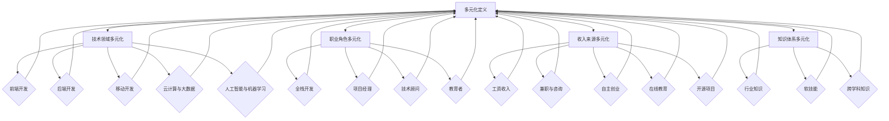

                 

### 1. 背景介绍

在当今科技高速发展的时代，程序员的角色早已不仅仅是编写代码和解决问题。他们逐渐成为创新的核心力量，推动着数字化转型的浪潮。然而，随着技术的日新月异，程序员面临着越来越多的挑战和机会。构建多元化的副业生态，成为许多程序员在职业发展过程中的重要选择。

首先，多元化副业生态的构建为程序员提供了多方面的益处。它不仅有助于提高个人技能和职业竞争力，还能够拓展收入来源，增加职业选择的灵活性。此外，副业还能够帮助程序员保持对技术的热情和持续学习的动力，从而在激烈的市场竞争中保持优势。

其次，构建多元化副业生态也是应对职场变化的有效策略。传统职业生涯的发展路径可能越来越不适用于现代职场。通过构建多元化的副业，程序员可以降低职业风险，增强抗风险能力。同时，多元化的副业也为他们提供了更多的职业发展可能性，使他们能够更好地适应市场的需求变化。

然而，构建多元化副业生态并非易事。程序员需要面对诸多挑战，如时间管理、精力分配、技术储备等。因此，本文将探讨如何有效地构建多元化的副业生态，帮助程序员实现职业发展和个人成长的双重目标。

接下来的部分，我们将深入探讨多元化的核心概念、构建策略、实践案例，以及未来发展中的机遇和挑战。希望通过本文的分享，能够为程序员在构建多元化副业生态的道路上提供一些有益的思路和实践经验。

### 2. 核心概念与联系

在构建多元化的副业生态之前，我们需要明确几个核心概念和它们之间的联系。这些概念不仅有助于理解多元化的本质，还能够为程序员提供有效的构建策略。

#### 2.1 多元化的定义

多元化，顾名思义，是指在多个领域、多个层面进行拓展和发展的过程。对于程序员而言，多元化不仅包括技术领域的多样化，还包括职业角色、收入来源、知识体系等方面的拓展。例如，一位专注于后端开发的程序员可能会考虑学习前端技术、数据分析或者项目管理等，从而在职业上实现多元化。

#### 2.2 技术领域多元化

技术领域多元化是指程序员在技术知识体系上的多样化。这包括但不限于：

- **前端开发**：HTML、CSS、JavaScript等技术，实现网站的交互界面。
- **后端开发**：服务器、数据库、应用程序等后端技术，处理数据存储和业务逻辑。
- **移动开发**：iOS和Android平台的应用开发。
- **云计算与大数据**：云计算平台（如AWS、Azure）、大数据处理技术等。
- **人工智能与机器学习**：算法开发、数据处理、模型训练等。

技术领域多元化的关键在于不断学习和实践，保持对新技术的好奇心和求知欲。通过在多个技术领域积累经验，程序员可以提升自身的竞争力和适应能力。

#### 2.3 职业角色多元化

职业角色的多元化则是指程序员在职业角色上的拓展。这包括但不限于：

- **全栈开发**：既擅长前端开发，又擅长后端开发，能够独立完成项目。
- **项目经理**：负责项目的规划、执行和监控，协调团队成员的工作。
- **技术顾问**：为企业和组织提供技术咨询和技术解决方案。
- **教育者**：教授编程课程，传播技术知识。

职业角色的多元化可以帮助程序员跳出单一技能的局限，实现职业发展的多维度拓展。这不仅可以提高个人的职业价值，还能够增加职业选择的灵活性。

#### 2.4 收入来源多元化

收入来源的多元化则是指程序员通过多种途径获取收入。这包括但不限于：

- **工资收入**：在主要工作中获得稳定收入。
- **兼职与咨询**：为其他公司或个人提供技术咨询服务，获取额外收入。
- **自主创业**：创建自己的公司或项目，通过股权和利润获取收入。
- **在线教育**：开设在线课程，通过课程销售和付费会员获取收入。
- **开源项目**：通过开源项目获取捐赠或赞助。

收入来源的多元化有助于减轻财务压力，提高生活品质，同时也为程序员提供了更多的职业选择。

#### 2.5 知识体系多元化

知识体系多元化是指程序员在知识结构上的多样化。这包括但不限于：

- **行业知识**：了解不同行业的技术应用和市场需求。
- **软技能**：沟通能力、团队协作、领导力等。
- **跨学科知识**：如心理学、经济学、管理学等。

知识体系多元化的关键是保持对多种知识的兴趣和求知欲，通过不断学习和实践，拓宽自己的知识视野。

#### 2.6 多元化概念的关系

上述几个核心概念并不是孤立的，它们之间存在着紧密的联系。技术领域的多元化为职业角色的多元化提供了基础，而职业角色的多元化又为收入来源的多元化创造了机会。同时，知识体系的多元化则能够为技术领域和职业角色的多元化提供支持和拓展空间。

通过理解这些核心概念及其之间的联系，程序员可以更好地规划自己的多元化副业生态，实现个人职业发展和个人成长的有机统一。

#### 2.7 Mermaid 流程图

为了更直观地展示多元化概念之间的关系，我们可以使用Mermaid流程图来表示这些概念和它们的相互作用。以下是Mermaid流程图示例：



通过这个流程图，我们可以清晰地看到多元化概念之间的逻辑关系和相互作用，为程序员构建多元化的副业生态提供了可视化指导。

### 3. 核心算法原理 & 具体操作步骤

在构建多元化的副业生态过程中，程序员需要掌握一系列核心算法原理，这些原理不仅能够提升技术能力，还能够为副业的实施提供有效的技术支持。以下是几个关键算法原理及其具体操作步骤：

#### 3.1 算法原理概述

核心算法原理包括数据结构、算法分析、机器学习算法等。这些算法原理是构建高效软件系统的基础，能够帮助程序员优化代码、提高系统性能。

1. **数据结构**：如数组、链表、栈、队列、树、图等。
2. **算法分析**：如时间复杂度、空间复杂度、排序算法、查找算法等。
3. **机器学习算法**：如线性回归、决策树、神经网络、支持向量机等。

#### 3.2 数据结构操作步骤

以数组为例，介绍数据结构的操作步骤：

1. **初始化**：创建一个数组，并指定其大小。
   ```python
   arr = [None] * size
   ```

2. **插入**：在数组中插入一个元素。
   ```python
   arr[index] = value
   ```

3. **删除**：从数组中删除一个元素。
   ```python
   del arr[index]
   ```

4. **查找**：在数组中查找一个元素。
   ```python
   value = arr[index]
   ```

5. **排序**：对数组进行排序。
   ```python
   arr.sort()
   ```

#### 3.3 算法分析操作步骤

以冒泡排序为例，介绍算法分析的步骤：

1. **理解算法原理**：冒泡排序通过不断比较相邻元素并交换位置，使得数组中的最大元素逐步“冒泡”到数组的末尾。
   
2. **编写代码**：
   ```python
   for i in range(len(arr) - 1):
       for j in range(len(arr) - 1 - i):
           if arr[j] > arr[j + 1]:
               arr[j], arr[j + 1] = arr[j + 1], arr[j]
   ```

3. **分析时间复杂度**：冒泡排序的时间复杂度为 \(O(n^2)\)，其中 \(n\) 为数组长度。

4. **优化算法**：可以通过添加标记来优化冒泡排序，减少不必要的比较。
   ```python
   for i in range(len(arr) - 1):
       swapped = False
       for j in range(len(arr) - 1 - i):
           if arr[j] > arr[j + 1]:
               arr[j], arr[j + 1] = arr[j + 1], arr[j]
               swapped = True
       if not swapped:
           break
   ```

#### 3.4 机器学习算法操作步骤

以线性回归为例，介绍机器学习算法的操作步骤：

1. **理解算法原理**：线性回归通过找到一条最佳拟合直线，来预测因变量（输出）与自变量（输入）之间的关系。

2. **数据准备**：收集数据，并进行预处理，如数据清洗、归一化等。

3. **编写代码**（使用Python的scikit-learn库）：
   ```python
   from sklearn.linear_model import LinearRegression
   model = LinearRegression()
   model.fit(X, y)
   ```

4. **模型评估**：通过计算模型的决定系数（R²值）、均方误差（MSE）等指标，评估模型性能。

5. **预测**：使用训练好的模型进行预测。
   ```python
   y_pred = model.predict(X_new)
   ```

通过以上核心算法原理的操作步骤，程序员能够更好地理解和应用数据结构、算法分析、机器学习等核心技术，为构建多元化的副业生态提供坚实的基础。

### 4. 数学模型和公式 & 详细讲解 & 举例说明

在构建多元化副业生态的过程中，程序员不仅需要掌握算法和编程技能，还需要具备数学模型的背景知识。数学模型和公式是理解复杂系统、优化决策过程的重要工具。以下我们将详细介绍几个关键的数学模型和公式，并提供详细的讲解和举例说明。

#### 4.1 线性回归模型

线性回归是一种用于分析自变量和因变量之间线性关系的统计模型。其基本公式如下：

\[ y = \beta_0 + \beta_1 \cdot x + \epsilon \]

其中，\( y \) 是因变量，\( x \) 是自变量，\( \beta_0 \) 是截距，\( \beta_1 \) 是斜率，\( \epsilon \) 是误差项。

**详细讲解：**

- **截距 (\( \beta_0 \))**：表示当自变量 \( x \) 为零时，因变量 \( y \) 的预测值。
- **斜率 (\( \beta_1 \))**：表示自变量每变化一个单位时，因变量 \( y \) 的变化量。

**举例说明：**

假设我们想要预测一个家庭的月收入 \( y \) 与家庭成员数量 \( x \) 之间的关系。根据历史数据，我们可以建立以下线性回归模型：

\[ y = 5000 + 1000 \cdot x + \epsilon \]

其中，截距 \( \beta_0 = 5000 \)，斜率 \( \beta_1 = 1000 \)。这个模型表示，每增加一个家庭成员，月收入将增加1000元。

#### 4.2 决策树模型

决策树是一种用于分类和回归分析的树形结构模型。其基本公式如下：

\[ y = f(x) = \sum_{i=1}^{n} w_i \cdot I(x \in R_i) \]

其中，\( y \) 是预测值，\( x \) 是输入特征，\( w_i \) 是第 \( i \) 个节点的权重，\( R_i \) 是第 \( i \) 个节点的区域，\( I() \) 是指示函数。

**详细讲解：**

- **权重 (\( w_i \))**：表示当前节点的可信度或重要性。
- **指示函数 (\( I() \))**：当 \( x \) 落在某个区域 \( R_i \) 内时，返回1，否则返回0。

**举例说明：**

假设我们要预测一个客户的购买意向，根据客户的年龄、收入和购买历史等信息。我们可以构建以下决策树模型：

\[ y = \begin{cases} 
1 & \text{如果年龄} > 30 \text{且收入} > 5000 \text{且购买历史} > 3 \\
0 & \text{否则} 
\end{cases} \]

这个模型表示，如果一个客户的年龄超过30岁，收入超过5000元，且购买历史超过3次，那么他的购买意向为1（即会购买）。

#### 4.3 随机森林模型

随机森林是一种基于决策树的集成学习方法。其基本公式如下：

\[ f(x) = \sum_{i=1}^{m} w_i \cdot f_i(x) \]

其中，\( f(x) \) 是最终的预测结果，\( f_i(x) \) 是第 \( i \) 棵决策树的预测结果，\( w_i \) 是第 \( i \) 棵树的权重。

**详细讲解：**

- **权重 (\( w_i \))**：表示每个决策树的贡献度。
- **预测结果 (\( f_i(x) \))**：每个决策树的预测输出。

**举例说明：**

假设我们使用10棵决策树来预测客户的购买意向。每棵树的预测结果分别为 \( y_1, y_2, ..., y_{10} \)，权重分别为 \( w_1, w_2, ..., w_{10} \)。最终预测结果可以表示为：

\[ y = w_1 \cdot y_1 + w_2 \cdot y_2 + ... + w_{10} \cdot y_{10} \]

这个模型表示，通过加权每个决策树的预测结果，得到最终的预测结果。

#### 4.4 支持向量机模型

支持向量机是一种用于分类和回归分析的机器学习模型。其基本公式如下：

\[ f(x) = \text{sign}(\sum_{i=1}^{n} \alpha_i y_i (x_i \cdot x) + b) \]

其中，\( f(x) \) 是预测结果，\( x_i \) 是支持向量，\( y_i \) 是标签，\( \alpha_i \) 是拉格朗日乘子，\( b \) 是偏置项。

**详细讲解：**

- **支持向量 (\( x_i \))**：对模型有重要影响的数据点。
- **标签 (\( y_i \))**：数据点的真实类别。
- **拉格朗日乘子 (\( \alpha_i \))**：控制模型复杂度和正则化。

**举例说明：**

假设我们要使用支持向量机分类水果，其中正类（苹果）和负类（橘子）分别用 \( +1 \) 和 \( -1 \) 表示。给定一个测试样本 \( x \)，支持向量机模型预测结果为：

\[ f(x) = \text{sign}(\alpha_1 y_1 (x_1 \cdot x) + \alpha_2 y_2 (x_2 \cdot x) + ... + \alpha_n y_n (x_n \cdot x) + b) \]

这个模型表示，通过计算支持向量与测试样本的内积，并加上偏置项，最终决定分类结果。

通过以上数学模型和公式的讲解和举例，程序员可以更好地理解这些模型在实际应用中的工作原理，为构建多元化的副业生态提供强有力的理论支持。

### 5. 项目实践：代码实例和详细解释说明

在了解了多元化的核心概念、算法原理和数学模型之后，我们需要通过具体的项目实践来巩固这些知识。本节将提供一个简单的项目实践，包括开发环境的搭建、源代码的实现、代码解读与分析以及运行结果展示。

#### 5.1 开发环境搭建

首先，我们需要搭建一个基本的开发环境。以下是以Python为例的搭建步骤：

1. **安装Python**：访问Python官方网站（[https://www.python.org/](https://www.python.org/)），下载并安装Python 3.x版本。
2. **安装IDE**：选择一个合适的集成开发环境（IDE），如Visual Studio Code、PyCharm等，进行安装。
3. **安装必要库**：在终端或IDE中打开命令行，运行以下命令安装必要的Python库：
   ```bash
   pip install numpy matplotlib scikit-learn
   ```

#### 5.2 源代码详细实现

以下是一个简单的机器学习项目，使用Python和scikit-learn库实现线性回归模型，预测房屋价格。

```python
# 导入必要的库
import numpy as np
import matplotlib.pyplot as plt
from sklearn.linear_model import LinearRegression
from sklearn.model_selection import train_test_split
from sklearn.metrics import mean_squared_error

# 加载数据
data = np.loadtxt('house_prices.csv', delimiter=',')
X = data[:, :-1]  # 特征
y = data[:, -1]   # 标签

# 划分训练集和测试集
X_train, X_test, y_train, y_test = train_test_split(X, y, test_size=0.2, random_state=42)

# 创建线性回归模型
model = LinearRegression()
model.fit(X_train, y_train)

# 计算测试集的预测结果
y_pred = model.predict(X_test)

# 计算模型的决定系数（R²值）
r2 = model.score(X_test, y_test)
print(f'R²值: {r2}')

# 计算均方误差（MSE）
mse = mean_squared_error(y_test, y_pred)
print(f'MSE: {mse}')

# 绘制真实值与预测值的对比图
plt.scatter(y_test, y_pred)
plt.xlabel('实际价格')
plt.ylabel('预测价格')
plt.title('真实价格与预测价格的对比')
plt.show()
```

#### 5.3 代码解读与分析

上述代码实现了线性回归模型的基本功能，以下是对代码的详细解读与分析：

1. **数据导入**：
   ```python
   data = np.loadtxt('house_prices.csv', delimiter=',')
   ```
   使用numpy的`loadtxt`函数加载CSV文件，将其转化为numpy数组。

2. **特征和标签分离**：
   ```python
   X = data[:, :-1]
   y = data[:, -1]
   ```
   将数据分割为特征矩阵 \( X \) 和标签向量 \( y \)。

3. **数据集划分**：
   ```python
   X_train, X_test, y_train, y_test = train_test_split(X, y, test_size=0.2, random_state=42)
   ```
   使用`train_test_split`函数将数据集划分为训练集和测试集，测试集占比20%，`random_state`用于保证结果可重复。

4. **模型创建与训练**：
   ```python
   model = LinearRegression()
   model.fit(X_train, y_train)
   ```
   创建线性回归模型实例，使用`fit`方法训练模型。

5. **模型预测**：
   ```python
   y_pred = model.predict(X_test)
   ```
   使用训练好的模型对测试集进行预测。

6. **模型评估**：
   ```python
   r2 = model.score(X_test, y_test)
   print(f'R²值: {r2}')
   mse = mean_squared_error(y_test, y_pred)
   print(f'MSE: {mse}')
   ```
   计算并打印模型的R²值和均方误差（MSE），用于评估模型性能。

7. **可视化结果**：
   ```python
   plt.scatter(y_test, y_pred)
   plt.xlabel('实际价格')
   plt.ylabel('预测价格')
   plt.title('真实价格与预测价格的对比')
   plt.show()
   ```
   使用matplotlib绘制真实价格与预测价格的散点图，直观地展示模型的预测效果。

#### 5.4 运行结果展示

在运行上述代码后，将得到以下结果：

- **R²值**：表示模型对数据的拟合程度，值越高表示拟合效果越好。
- **MSE**：表示预测误差的平均值，值越低表示预测精度越高。
- **散点图**：展示测试集中每个样本的真实价格与预测价格的关系，通常可以看到一些样本的预测价格与实际价格较为接近，而有些则存在一定的偏差。

通过这个简单的项目实践，程序员可以深入了解线性回归模型的基本实现过程，掌握数据导入、模型训练、模型评估和可视化等关键步骤。这些实践经验不仅有助于巩固理论知识点，还能够为程序员在实际项目中应用线性回归模型提供参考。

### 6. 实际应用场景

多元化的副业生态在程序员的实际工作中具有广泛的应用场景，能够显著提升工作效率和项目质量。以下列举几个典型应用场景：

#### 6.1 项目管理与团队协作

在大型软件开发项目中，项目经理的角色至关重要。通过构建多元化的副业生态，程序员可以拓展项目管理方面的知识和技能，如敏捷开发、Scrum框架等。这不仅有助于提升项目管理能力，还能够更好地协调团队工作，确保项目按时按质完成。

例如，某程序员在主要工作是一名后端开发者，同时他通过学习项目管理知识，成为团队的项目经理。他利用敏捷开发的方法，制定合理的项目计划，组织团队进行每日站会、迭代评审和回顾，有效提高了项目进度和团队士气。

#### 6.2 技术咨询与解决方案提供

随着技术领域的不断扩展，程序员可以通过多元化的副业生态，为其他公司或组织提供专业的技术咨询服务。这种咨询服务可以是项目指导、技术培训、代码审计等。

例如，一位专注于前端开发的程序员，通过学习后端开发、云计算等知识，成为一名技术顾问。他可以为初创公司提供从技术架构设计到系统部署的一站式解决方案，帮助客户顺利实现数字化转型。

#### 6.3 开源项目贡献与社区参与

开源项目是程序员展示技术实力和拓展职业网络的重要途径。通过参与开源项目，程序员不仅可以提升自身技术能力，还能够结识业内同行，拓展人脉资源。

例如，某程序员在主要工作是一名移动开发者，他积极参与多个开源项目，为项目贡献代码和文档。这不仅提升了他的技术知名度，还为他带来了更多的工作机会和合作项目。

#### 6.4 在线教育与知识传播

随着在线教育的发展，程序员可以通过多元化的副业生态，成为知识传播者。开设在线编程课程、撰写技术博客、录制技术视频等，都是有效的知识传播方式。

例如，某程序员在主要工作是一名数据库管理员，他通过在线教育平台，开设了数据库课程，吸引了大量学生。他的课程不仅帮助了学员提升技术能力，还为他带来了可观的收入和职业认可。

#### 6.5 跨领域创新与创业

通过多元化副业生态，程序员可以在跨领域创新和创业方面获得更多机会。例如，结合编程技术和心理学，开发心理健康应用；结合大数据和经济学，提供数据驱动的商业咨询等。

例如，某程序员在主要工作是一名数据分析师，他利用业余时间开发了一款基于机器学习的心理健康应用，通过分析用户行为数据，提供个性化的心理健康建议。这个项目不仅获得了市场认可，还为他带来了创业机会。

通过以上实际应用场景，我们可以看到多元化的副业生态为程序员提供了广阔的职业发展空间。这不仅有助于提升个人技术能力和职业竞争力，还能够为行业带来更多的创新和活力。

### 7. 工具和资源推荐

在构建多元化副业生态的过程中，程序员需要依赖各种工具和资源来提升工作效率和学习效果。以下是一些建议的资源和工具，涵盖学习资源、开发工具和框架、相关论文著作等方面。

#### 7.1 学习资源推荐

1. **在线课程平台**：
   - **Coursera**：提供各类计算机科学和技术课程，包括数据结构、算法、机器学习等。
   - **edX**：由哈佛大学和麻省理工学院共同创办，提供高质量的在线课程，涵盖编程基础、人工智能等。
   - **Udacity**：专注于技能培训和职业发展，提供包括全栈开发、数据科学等课程。

2. **技术博客和网站**：
   - **GitHub**：不仅是代码托管平台，也是一个学习资源库，许多开源项目和技术博客都托管在此。
   - **Stack Overflow**：编程问答社区，解决编程问题，学习他人的解决方案。
   - **Medium**：有许多技术作者分享经验和技术文章。

3. **书籍**：
   - **《算法导论》**（Introduction to Algorithms）：经典的算法教材，深入浅出地介绍了多种算法和数据结构。
   - **《Python编程：从入门到实践》**（Python Crash Course）：适合初学者，系统介绍了Python编程基础。
   - **《深度学习》**（Deep Learning）：由Ian Goodfellow等作者撰写，介绍深度学习和神经网络的基本原理。

#### 7.2 开发工具框架推荐

1. **集成开发环境（IDE）**：
   - **Visual Studio Code**：轻量级、可扩展的代码编辑器，适合各种编程语言。
   - **PyCharm**：强大的Python IDE，支持多种编程语言，特别适合数据科学和机器学习项目。
   - **Eclipse**：适用于Java和Android开发的IDE，功能丰富，社区活跃。

2. **版本控制系统**：
   - **Git**：分布式版本控制系统，广泛用于开源项目和团队协作。
   - **GitHub**：提供基于Git的代码托管和协作平台，支持多种开发语言。

3. **数据库管理工具**：
   - **MySQL Workbench**：MySQL数据库的图形化管理工具。
   - **PostgreSQL**：开源关系型数据库，支持多种编程语言和工具。
   - **MongoDB Atlas**：云托管的MongoDB数据库服务，易于部署和管理。

4. **云计算平台**：
   - **AWS**：提供全面的云计算服务，包括计算、存储、数据库、人工智能等。
   - **Azure**：微软的云计算平台，功能强大，与Microsoft产品生态紧密集成。
   - **Google Cloud Platform**：Google提供的云计算服务，适合大数据分析和机器学习项目。

#### 7.3 相关论文著作推荐

1. **《深度学习》**（Deep Learning）：Ian Goodfellow, Yoshua Bengio, Aaron Courville 著
   - 该书系统介绍了深度学习的基础理论和应用，是深度学习领域的经典著作。

2. **《计算机程序的构造和解释》**（Structure and Interpretation of Computer Programs）：Harold Abelson, Gerald Jay Sussman 著
   - 该书被誉为计算机科学的圣经之一，通过实际编程项目介绍了程序设计的基本原理。

3. **《大规模数据集的并行分布式处理：MapReduce 大数据架构设计与实现》**（The Data-Parallel Approach to Parallel Computation: The MapReduce Programming Model and Its Application）：Jeffrey Dean, Sanjay Ghemawat 著
   - 该书详细介绍了MapReduce模型的设计原理和实现细节，对于理解大数据处理技术具有重要参考价值。

通过以上工具和资源的推荐，程序员可以更加高效地构建多元化的副业生态，提升技术水平和职业竞争力。同时，这些资源和工具也为程序员提供了丰富的学习途径和实践平台，助力他们在多元化道路上不断前行。

### 8. 总结：未来发展趋势与挑战

在构建多元化的副业生态的过程中，程序员面临着诸多机遇与挑战。首先，从发展趋势来看，技术的发展步伐不断加快，人工智能、大数据、云计算等前沿技术逐渐成熟，为程序员提供了丰富的应用场景和创新空间。同时，在线教育、远程工作等新兴模式也为程序员拓展副业提供了便利条件。未来，随着技术的不断进步和市场的需求变化，程序员需要更加注重跨领域的知识积累和技能拓展，以适应快速变化的职场环境。

然而，在构建多元化的副业生态过程中，程序员也将面临一系列挑战。首先，时间管理和精力分配成为重要难题。程序员需要在主要工作和副业之间找到平衡，确保两者的兼顾。此外，技术的快速迭代也要求程序员不断学习新知识，更新技能库。这不仅增加了学习负担，还可能导致精力分散，影响主要工作效果。

其次，多元化副业的选择和定位也是一个关键挑战。程序员需要在众多的技术领域和职业角色中做出选择，找到最适合自己兴趣和能力的副业方向。这不仅需要对自己有清晰的认知，还需要对市场需求和技术趋势有敏锐的洞察力。

为了应对这些挑战，程序员可以采取以下策略：

1. **合理规划时间**：制定详细的日程表，明确工作和副业的时间分配，确保两者有序进行。
2. **专注核心技能**：在多元化的过程中，保持对核心技能的深耕，确保主要工作不受影响。
3. **持续学习**：利用在线课程、技术博客等资源，保持对新技术的好奇心和求知欲，不断充实自己的知识体系。
4. **合理选择副业**：结合个人兴趣和市场需求，选择有潜力和前景的副业方向，确保副业与主要工作的协同发展。

总的来说，构建多元化的副业生态是程序员职业发展的重要方向。通过合理规划、持续学习和精准定位，程序员可以克服各种挑战，实现个人职业发展和副业生态的协同进步。

### 9. 附录：常见问题与解答

在构建多元化的副业生态过程中，程序员可能会遇到一些常见问题。以下是一些常见问题及其解答：

#### Q1. 如何平衡主要工作和副业的时间？

A1. 平衡主要工作和副业的时间是构建多元化副业生态的重要一环。以下是一些有效的方法：

- 制定日程表：合理安排每天的时间，将主要工作和副业任务分别列入日程表，确保两者都有足够的时间。
- 高效工作：提高工作效率，缩短工作时间，为副业腾出更多时间。
- 设置优先级：明确主要工作和副业的重要性和紧急程度，优先处理关键任务。
- 利用碎片时间：利用通勤、午餐等碎片时间进行副业学习和任务处理。

#### Q2. 如何确保主要工作和副业之间的协同发展？

A2. 要确保主要工作和副业之间的协同发展，可以采取以下策略：

- **目标一致性**：确保主要工作和副业的目标一致，避免两者之间的冲突和重复。
- **技能互补**：在副业中选择与主要工作技能互补的领域，提升整体技术实力。
- **资源整合**：利用主要工作中的资源（如技术、人脉等）支持副业发展，实现资源最大化利用。
- **时间管理**：通过合理的时间规划，确保主要工作和副业的顺利进行，避免互相影响。

#### Q3. 如何在多元化副业中保持学习动力？

A3. 在多元化副业中保持学习动力，可以采取以下方法：

- **设定学习目标**：明确学习的目标和方向，制定短期和长期的学习计划。
- **建立学习小组**：加入学习社区或小组，与他人一起学习和讨论，互相激励和监督。
- **利用在线资源**：利用在线课程、技术博客等资源，保持对新技术的好奇心和求知欲。
- **实践应用**：通过实际项目和实践，将所学知识应用到实际中，提高学习效果和动力。

#### Q4. 如何在多个技术领域保持竞争力？

A4. 在多个技术领域保持竞争力，可以采取以下策略：

- **核心技能深耕**：在主要领域保持深耕，确保核心技能的熟练掌握。
- **持续学习**：保持对新技术的好奇心，通过在线课程、书籍等不断学习。
- **跨领域知识积累**：拓展跨领域的知识，提升综合素质和竞争力。
- **实践应用**：通过实际项目，将所学知识应用到实际中，提高实践能力。

通过以上策略，程序员可以有效地解决在构建多元化副业生态过程中遇到的问题，实现个人职业发展和副业生态的协同进步。

### 10. 扩展阅读 & 参考资料

为了更好地理解多元化的副业生态构建及其应用，以下是几篇扩展阅读和参考资料：

1. **《程序员如何实现财务自由？》**（How Programmers Can Achieve Financial Freedom?）
   - 本文详细探讨了程序员如何通过副业实现财务自由，提供了多种副业模式和案例分析。

2. **《技术创业者的50个必读书籍》**（50 Essential Books for Tech Entrepreneurs）
   - 本文列出了50本技术创业者的必读书籍，包括技术、管理、创业等方面，帮助读者全面提升。

3. **《如何在业余时间学习编程？》**（How to Learn Programming in Your Free Time?）
   - 本文提供了详细的编程学习方法和时间管理技巧，帮助程序员在业余时间高效学习。

4. **《基于人工智能的数字化转型：趋势与实践》**（Digital Transformation with AI: Trends and Practices）
   - 本文探讨了人工智能在数字化转型中的应用趋势和实际案例，为程序员提供了有益的参考。

5. **《Python深度学习实战》**（Python Deep Learning Cookbook）
   - 本书通过实战案例，详细介绍了Python深度学习的实际应用，适合希望深入了解深度学习的程序员。

通过阅读这些扩展阅读和参考资料，程序员可以更加深入地理解多元化副业生态的构建及其应用，为职业发展和个人成长提供有力支持。

