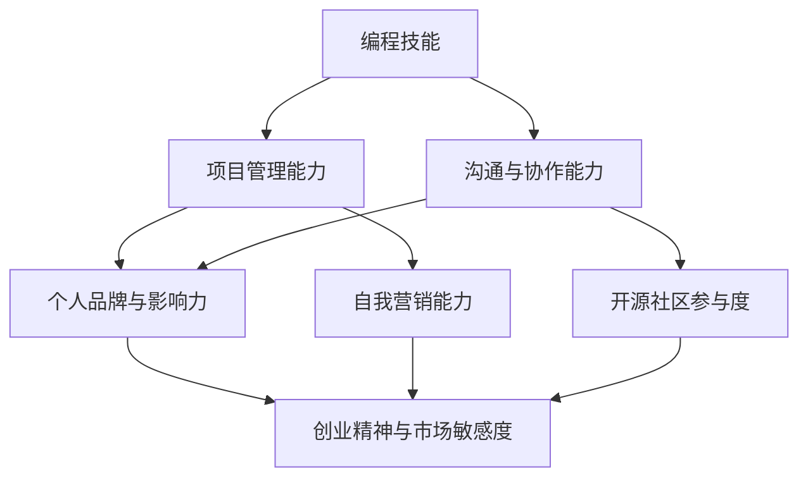

                 

### 1. 背景介绍

在当今数字化时代，程序员作为技术领域的核心力量，其职业发展不仅局限于单一的工资收入。随着技术的不断进步和市场的需求变化，越来越多的程序员开始探索多元化的收入结构，以提升自身竞争力、实现财务自由。本文旨在探讨程序员如何通过多种途径构建多元化的收入结构，从而在职业发展中占据更有利的位置。

首先，我们需要明确多元化收入结构的概念。所谓多元化收入结构，是指程序员在传统工资收入之外，通过其他途径获取额外收入的方式和手段。这些途径可以包括但不限于：

1. 自由职业者：通过在平台如Upwork、Freelancer等上接项目，为不同的客户提供开发服务。
2. 技术咨询服务：为企业提供技术解决方案和咨询服务。
3. 开源项目：参与开源项目，通过捐赠、赞助、赞助商等方式获取收入。
4. 技术培训和教学：通过线上或线下的课程，向学员传授编程知识和技能。
5. 创业：成立自己的技术公司或加入初创企业，分享企业盈利。
6. 技术写作和出版：撰写技术博客、书籍、电子书，通过版税获取收入。

多元化的收入结构不仅有助于程序员在职业发展中提高抗风险能力，还能让他们更好地利用自身技能，探索更多的职业发展机会。然而，实现多元化收入结构并非一蹴而就，需要程序员具备一定的技能、资源、人脉和市场敏感度。

接下来，本文将详细探讨如何通过以下七个步骤来构建多元化的收入结构：

1. **提升个人技能和知识储备**：通过不断学习和实践，提升自己的编程能力、项目管理和沟通技巧，为多元化收入结构的实现打下坚实基础。
2. **建立个人品牌和影响力**：通过技术写作、开源项目、演讲等方式，建立个人品牌和影响力，吸引更多的关注和机会。
3. **拓展职业网络和人脉资源**：积极参与行业活动和社区，建立广泛的人脉网络，为获取项目和合作机会提供支持。
4. **探索自由职业和市场机会**：利用平台和资源，寻找自由职业的机会，拓展市场渠道，增加收入来源。
5. **开发和管理个人项目**：通过独立开发项目，获取项目收益，同时积累实际经验和项目案例。
6. **参与开源项目和社区贡献**：积极参与开源项目，通过捐赠、赞助等方式获取收入，同时提升自身技术能力和知名度。
7. **提供技术培训和教学服务**：通过开设课程、讲座和培训，向学员传授知识和技能，实现知识变现。

通过上述步骤，程序员可以逐步构建多元化的收入结构，实现财务自由和职业发展的双赢。接下来，本文将深入探讨每个步骤的具体实践方法和策略。

### 2. 核心概念与联系

在探讨如何构建多元化的收入结构之前，我们首先需要了解几个核心概念及其相互之间的联系。以下是对这些核心概念的定义和它们在程序员构建收入结构中的作用的简要说明：

**1. 编程技能**：编程技能是程序员的核心竞争力。熟练掌握编程语言、框架和技术栈，能够帮助程序员高效地解决问题，开发高质量的应用程序。不同的编程技能适用于不同的应用场景，如前端开发、后端开发、移动应用开发、大数据处理等。

**2. 项目管理能力**：项目管理能力是程序员在承担大型项目时必不可少的一环。良好的项目管理能力包括时间管理、任务分配、团队协作、风险管理等方面，有助于确保项目的顺利进行和交付。

**3. 沟通与协作能力**：在项目开发过程中，良好的沟通与协作能力至关重要。这不仅包括与团队成员之间的有效沟通，还涉及与客户、合作伙伴的交流。清晰的表达能力和倾听技巧能够减少误解和冲突，提升项目成功率。

**4. 个人品牌与影响力**：个人品牌和影响力是程序员在市场中脱颖而出的关键。通过技术写作、开源项目、演讲等方式，程序员可以建立自己在行业内的知名度和权威性，吸引更多的机会和资源。

**5. 自我营销能力**：自我营销能力是指程序员将自己和自己的技能、项目、服务推销给潜在客户和合作伙伴的能力。有效的自我营销能够增加收入来源，提升职业地位。

**6. 开源社区参与度**：参与开源社区是程序员建立个人品牌、获取技术反馈和扩展职业网络的重要途径。在开源项目中贡献代码，可以提升编程技能，扩大技术视野，同时也有机会获得赞助和捐赠。

**7. 创业精神与市场敏感度**：具备创业精神的程序员往往能够敏锐地捕捉市场机遇，通过创业或加入初创企业，实现财务自由和职业发展的双重目标。

以下是这些核心概念之间的相互联系及作用的Mermaid流程图：



通过上述流程图，我们可以看到，编程技能是构建多元化收入结构的基础，而项目管理能力、沟通与协作能力、个人品牌与影响力、自我营销能力、开源社区参与度以及创业精神与市场敏感度则是在这一基础上进一步拓展和深化的关键要素。

在接下来的章节中，我们将详细讨论如何通过提升这些核心概念来构建多元化的收入结构。首先，我们将探讨如何提升个人技能和知识储备，为构建多元化收入结构打下坚实基础。

### 3. 核心算法原理 & 具体操作步骤

在构建多元化的收入结构过程中，提升个人技能和知识储备是至关重要的。以下将详细阐述如何通过一系列核心算法原理和具体操作步骤来实现这一目标。

#### 3.1 编程技能提升

**1. 学习编程语言和框架**

首先，程序员需要选择一门或几门编程语言进行深入学习。常见的编程语言包括Python、Java、C++、JavaScript等。选择编程语言时，应考虑其应用领域和市场需求。例如，Python在数据科学和人工智能领域有广泛应用，Java在企业级开发中占据重要地位，而C++则在高性能计算和系统编程中表现优异。

**2. 实践项目经验积累**

理论学习是基础，但实践才能检验真伪。程序员应积极参与实际项目，通过解决实际问题来提升编程技能。可以在GitHub等平台上找到开源项目参与，或是在本地搭建自己的项目进行开发。

**3. 技术栈扩展**

随着技术的发展，程序员应不断扩展自己的技术栈，学习新的框架和技术。例如，前端开发人员可以学习React、Vue等框架，后端开发人员可以学习Django、Spring等框架。

#### 3.2 项目管理能力提升

**1. 项目管理知识学习**

程序员可以通过学习项目管理相关的书籍和在线课程，了解项目管理的基本理论和实践方法。常见的项目管理工具包括Jira、Trello、Asana等，这些工具可以帮助程序员更高效地管理项目任务和进度。

**2. 实践项目管理经验**

参与实际项目管理，亲身体验项目从启动到交付的全过程。通过项目管理实践，程序员可以提升时间管理、任务分配、团队协作和风险管理等能力。

**3. 学习敏捷开发方法**

敏捷开发是一种灵活、迭代的项目管理方法，适用于快速变化的项目环境。程序员可以通过学习敏捷开发的原理和实践方法，提升项目交付效率和团队协作能力。

#### 3.3 沟通与协作能力提升

**1. 沟通技巧训练**

有效的沟通是团队合作的基础。程序员可以通过参加沟通技巧培训，学习如何清晰、准确地表达自己的想法，并倾听他人的意见和需求。

**2. 团队协作经验积累**

在项目中，程序员应积极参与团队协作，与团队成员保持良好的沟通和合作。通过实际团队协作经验，提升跨部门沟通和跨文化沟通的能力。

**3. 学习冲突解决策略**

在项目开发和交付过程中，难免会出现冲突。程序员应学习冲突解决的策略和技巧，确保项目顺利进行。

#### 3.4 个人品牌与影响力建设

**1. 技术写作**

技术写作是建立个人品牌的有效途径。程序员可以在个人博客、技术社区（如Stack Overflow、GitHub）等平台发表技术文章，分享自己的知识和经验。

**2. 开源项目贡献**

参与开源项目，通过代码贡献和文档编写，提升个人技术能力和知名度。开源项目不仅有助于积累技术经验，还能吸引潜在客户和合作伙伴的关注。

**3. 演讲与分享**

通过参加技术会议、研讨会和社区活动，进行技术演讲和分享，扩大个人影响力。

#### 3.5 自我营销能力提升

**1. 自我评估与定位**

明确自己的优势和专业领域，进行自我评估和定位。了解自己的长处和短板，有针对性地提升自身能力。

**2. 建立个人网站或博客**

建立个人网站或博客，展示个人技能、项目和经验。通过网站或博客，向潜在客户和合作伙伴展示自己的专业能力。

**3. 社交媒体运营**

利用LinkedIn、Twitter等社交媒体平台，建立和维护个人品牌。定期发布技术文章、项目更新和个人见解，与行业人士建立联系。

#### 3.6 开源社区参与度提升

**1. 贡献开源代码**

积极参与开源项目，为项目贡献代码，提升编程技能和开源经验。

**2. 参与开源社区活动**

参加开源社区的活动，如开源周末、黑客马拉松等，与开源社区成员建立联系。

**3. 开源项目管理和维护**

在开源项目中担任管理角色，负责项目规划、任务分配和代码审查，提升项目管理能力。

#### 3.7 创业精神与市场敏感度提升

**1. 创业知识学习**

学习创业相关的知识，如商业计划书撰写、市场调研、产品定位等。

**2. 市场调研**

通过市场调研，了解行业趋势、竞争对手和潜在客户需求，为创业项目做好准备。

**3. 产品开发与推广**

在创业过程中，学会如何开发产品、制定营销策略和推广产品，吸引客户和投资者。

通过上述核心算法原理和具体操作步骤，程序员可以逐步提升自身技能和知识储备，为构建多元化的收入结构奠定坚实基础。在接下来的章节中，我们将探讨如何通过建立个人品牌和影响力，进一步拓展收入来源。

### 4. 数学模型和公式 & 详细讲解 & 举例说明

在构建多元化的收入结构过程中，理解一些基本的数学模型和公式有助于程序员更好地评估和管理自己的财务状况，制定合理的财务规划。以下是一些关键的数学模型和公式，我们将对其进行详细讲解并给出具体举例。

#### 4.1 利润率公式

利润率是评估企业或个人项目盈利能力的重要指标。其计算公式如下：

\[ \text{利润率} = \frac{\text{净利润}}{\text{销售收入}} \times 100\% \]

其中，净利润是指销售收入减去成本后的余额，销售收入是指产品或服务的总收入。

**举例**：假设某程序员通过自由职业接了一个软件开发项目，项目总金额为10000元，成本（包括人力成本、设备租赁和材料费用）为7000元，那么其利润率为：

\[ \text{利润率} = \frac{10000 - 7000}{10000} \times 100\% = 30\% \]

这意味着该项目每收入100元，有30元是净利润。

#### 4.2 投资回报率公式

投资回报率（ROI）是评估投资收益的重要指标，其计算公式如下：

\[ \text{投资回报率} = \frac{\text{投资收益}}{\text{投资成本}} \times 100\% \]

其中，投资收益是指投资后的净利润，投资成本是指最初的投资金额。

**举例**：假设某程序员投资5000元参与一个开源项目的开发，该项目最终带来了2000元的净利润，那么其投资回报率为：

\[ \text{投资回报率} = \frac{2000}{5000} \times 100\% = 40\% \]

这意味着该投资每投入1元，最终收益为0.4元。

#### 4.3 年化收益率公式

年化收益率是将短期收益换算成年收益率的公式，其计算公式如下：

\[ \text{年化收益率} = \left(1 + \frac{\text{短期收益率}}{\text{投资期限}}\right)^n - 1 \]

其中，短期收益率是指短期内的收益，投资期限是指投资的持续时间，n是指投资期限的倍数。

**举例**：假设某程序员在一个月内通过在线课程获得了1000元的收入，投资期限为1个月，那么其年化收益率为：

\[ \text{年化收益率} = \left(1 + \frac{1000}{1} \times 12\right) - 1 = 12100\% \]

这意味着如果该程序员每月都能获得相同收益，其年化收益率将高达12100%。

#### 4.4 成本效益分析公式

成本效益分析是评估一个项目或决策的成本与收益的相对关系，其计算公式如下：

\[ \text{成本效益分析} = \frac{\text{总收益}}{\text{总成本}} \]

**举例**：假设某程序员计划开展一个线上编程课程，预计课程收入为50000元，总成本（包括课程开发、推广和运营费用）为30000元，那么其成本效益分析为：

\[ \text{成本效益分析} = \frac{50000}{30000} = 1.67 \]

这意味着每投入1元，可以获得1.67元的收益。

通过上述数学模型和公式的理解和应用，程序员可以更好地进行财务规划和收益管理。在实际操作中，程序员应根据自身的收入来源和成本结构，灵活运用这些公式，制定合理的财务策略，实现财务自由和职业发展目标。在接下来的章节中，我们将探讨如何通过开发和管理个人项目来增加收入。

### 5. 项目实践：代码实例和详细解释说明

为了更好地理解如何通过项目实践增加收入，接下来我们将通过一个具体的例子来说明如何从项目构思到实现的各个步骤。这个项目是一个简单的在线课程管理系统，它可以帮助学员管理自己的学习进度，同时为课程提供者提供一个展示和销售的平台。

#### 5.1 开发环境搭建

在开始项目开发之前，首先需要搭建开发环境。以下是一个基本的开发环境配置步骤：

**1. 选择编程语言和框架**

我们选择Python作为主要编程语言，因为它在Web开发中有着广泛的应用，同时拥有丰富的库和框架支持。Django是一个流行的Python Web框架，适合快速开发复杂的应用程序。

**2. 安装Python和Django**

确保系统上安装了Python 3.x版本，然后通过pip安装Django：

```bash
pip install django
```

**3. 创建Django项目**

通过Django命令创建一个新项目：

```bash
django-admin startproject course_management
```

**4. 创建Django应用**

在项目目录中创建一个应用：

```bash
cd course_management
django-admin startapp courses
```

**5. 配置数据库**

Django默认使用SQLite数据库，也可以配置使用其他数据库，如PostgreSQL或MySQL。配置文件在`settings.py`中，如下所示：

```python
DATABASES = {
    'default': {
        'ENGINE': 'django.db.backends.postgresql',
        'NAME': 'course_management',
        'USER': 'yourusername',
        'PASSWORD': 'yourpassword',
        'HOST': 'localhost',
        'PORT': '',
    }
}
```

确保已安装了相应的数据库软件和驱动。

#### 5.2 源代码详细实现

在配置完开发环境后，开始实现项目功能。以下是项目的主要代码片段和功能解释。

**5.2.1 模型定义**

在`courses/models.py`中定义Course和User模型：

```python
from django.db import models
from django.contrib.auth.models import User

class Course(models.Model):
    title = models.CharField(max_length=200)
    description = models.TextField()
    price = models.DecimalField(max_digits=6, decimal_places=2)
    author = models.ForeignKey(User, on_delete=models.CASCADE)

class Module(models.Model):
    course = models.ForeignKey(Course, on_delete=models.CASCADE)
    title = models.CharField(max_length=200)
    content = models.TextField()

class Lesson(models.Model):
    module = models.ForeignKey(Module, on_delete=models.CASCADE)
    title = models.CharField(max_length=200)
    content = models.TextField()
```

这些模型定义了一个课程（Course），其包含多个模块（Module），每个模块又包含多个课程单元（Lesson）。课程由作者（User）关联。

**5.2.2 视图实现**

在`courses/views.py`中实现课程管理的视图：

```python
from django.shortcuts import render, redirect, get_object_or_404
from .models import Course, Module, Lesson
from .forms import CourseCreateForm

def course_list(request):
    courses = Course.objects.all()
    return render(request, 'courses/course_list.html', {'courses': courses})

def course_detail(request, pk):
    course = get_object_or_404(Course, pk=pk)
    return render(request, 'courses/course_detail.html', {'course': course})

def create_course(request):
    if request.method == 'POST':
        form = CourseCreateForm(request.POST)
        if form.is_valid():
            form.save()
            return redirect('course_list')
    else:
        form = CourseCreateForm()
    return render(request, 'courses/course_create.html', {'form': form})
```

这些视图定义了课程的列表展示、详细信息和创建课程的功能。

**5.2.3 表单定义**

在`courses/forms.py`中定义创建课程的表单：

```python
from django import forms
from .models import Course

class CourseCreateForm(forms.ModelForm):
    class Meta:
        model = Course
        fields = ['title', 'description', 'price']
```

**5.2.4 模板设计**

在`courses/templates/`目录下设计HTML模板，用于展示课程列表、课程详情和创建课程页面。例如，`course_list.html`模板：

```html

    <div>
        <h2>{{ course.title }}</h2>
        <p>{{ course.description }}</p>
        <p>Price: {{ course.price }}</p>
        <a href="">Details</a>
    </div>

```

#### 5.3 代码解读与分析

**5.3.1 模型层**

在模型层，我们定义了Course、Module和Lesson三个模型。每个模型都关联了一个外键（ForeignKey），用于关联用户（User）和课程之间的层次关系。这有助于在数据库中维护数据的一致性和完整性。

**5.3.2 视图层**

视图层是Django框架的核心，负责处理HTTP请求并返回相应的响应。`course_list`和`course_detail`视图分别处理课程列表和课程详情的展示请求。`create_course`视图处理创建新课程的表单提交。

**5.3.3 表单层**

表单层负责处理用户输入，并验证输入数据的合法性。`CourseCreateForm`表单定义了创建课程所需的字段，并通过模型绑定确保数据能够正确保存到数据库中。

**5.3.4 模板层**

模板层负责将数据渲染成HTML页面，供用户浏览和操作。通过模板标签和URL反转，模板能够动态地展示课程列表、课程详情和创建课程页面。

#### 5.4 运行结果展示

完成代码实现后，启动Django开发服务器：

```bash
python manage.py runserver
```

在浏览器中访问本地服务器（如`http://127.0.0.1:8000/`），可以看到课程管理的界面。用户可以浏览课程列表、查看课程详情，并创建新课程。

通过上述项目实例，我们展示了如何从零开始构建一个简单的在线课程管理系统。这个项目不仅能够帮助程序员练习和提升编程技能，还可以作为一个实际的产品展示在求职或自由职业市场中，从而增加收入。接下来，我们将讨论如何通过实际应用场景来进一步拓展项目的功能。

### 5.4 实际应用场景

在线课程管理系统虽然是一个基础的项目，但在实际应用中，它可以被扩展和优化，以满足不同用户的需求和商业目标。以下是一些实际应用场景，以及如何通过这些场景来进一步提升项目的功能。

#### 5.4.1 教育培训机构应用

在线课程管理系统非常适合教育培训机构。这些机构可以通过系统管理课程内容、学员信息和课程进度。具体应用场景如下：

**1. 课程内容管理**：培训机构可以在系统中上传课程视频、PPT和其他学习资料，方便学员随时查看。

**2. 学员管理**：系统可以记录学员的基本信息、学习进度和考试成绩，便于培训机构进行学员管理。

**3. 课程报名与收费**：学员可以通过系统报名课程并支付学费，系统自动生成订单和发票。

**4. 考试与评分**：系统可以集成在线考试功能，学员完成考试后，系统自动评分并反馈结果。

**5. 数据分析与报表**：系统可以收集学员学习行为数据，生成报表，帮助培训机构分析学习效果和市场需求。

#### 5.4.2 独立开发者销售个人课程

独立开发者可以借助在线课程管理系统，销售自己的编程课程或技术教程。具体应用场景如下：

**1. 课程发布**：开发者可以在系统中创建和发布自己的课程，包括课程简介、目录、教学视频等。

**2. 订单与支付**：学员可以通过系统购买课程，系统自动处理订单和支付流程。

**3. 用户反馈与评价**：学员可以评价课程，开发者可以根据反馈优化课程内容。

**4. 优惠券与促销**：开发者可以设置优惠券和促销活动，吸引用户购买。

**5. 统计与报表**：开发者可以查看销售数据，分析市场趋势和用户需求，调整课程策略。

#### 5.4.3 企业内部培训系统

企业内部培训系统是另一个重要的应用场景。企业可以通过在线课程管理系统，对员工进行技能培训和知识更新。具体应用场景如下：

**1. 培训内容定制**：企业可以根据培训需求，定制课程内容，确保培训与业务发展相结合。

**2. 培训计划与跟踪**：系统可以制定培训计划，跟踪员工学习进度，确保培训效果。

**3. 考试与评估**：企业可以设置在线考试，评估员工的学习成果。

**4. 培训记录与报告**：系统可以记录员工的学习记录，生成培训报告，为管理层提供决策依据。

**5. 费用报销与审核**：系统可以集成费用报销功能，员工完成培训后，可以申请报销相关费用。

通过上述实际应用场景，我们可以看到，在线课程管理系统不仅适用于教育培训机构和个人开发者，还可以为企业提供有效的培训和管理解决方案。接下来，我们将推荐一些有用的工具和资源，帮助程序员更好地构建和优化自己的项目。

### 6. 工具和资源推荐

在构建多元化收入结构的过程中，程序员需要依赖多种工具和资源来提升工作效率、扩展技能范围以及拓展市场机会。以下是一些推荐的工具和资源，涵盖学习资源、开发工具框架以及相关论文著作。

#### 6.1 学习资源推荐

**1. 书籍**

- 《深入理解计算机系统》（Deep Dive into Systems）：这是一本深入探讨计算机系统原理的著作，适合想要深入了解底层技术的程序员。

- 《算法导论》（Introduction to Algorithms）：该书籍详细介绍了算法的基本原理、设计和分析，是算法学习的经典教材。

- 《Effective Java》：这本书提供了Java编程的最佳实践，适合Java开发者参考。

**2. 论文**

- 《计算机程序的构造和解释》（Structure and Interpretation of Computer Programs）：这是一本关于计算机科学基础和程序设计的经典论文集。

- 《大型分布式系统设计》：该论文集深入探讨了大型分布式系统的设计原则和关键技术。

**3. 博客和网站**

- 《Python编程从入门到实践》：这是一本适合初学者的Python编程书籍，附带丰富的实践项目。

- 《廖雪峰的官方网站》：廖雪峰的网站提供了Python、前端、数据库等技术的详细教程和案例。

- 《GitHub》：GitHub不仅是代码托管平台，也是一个丰富的技术社区，程序员可以在这里找到各种开源项目和资源。

#### 6.2 开发工具框架推荐

**1. Python开发工具**

- **Django**：一个高层次的Python Web框架，适合快速开发和部署Web应用。

- **Flask**：一个轻量级的Web框架，适合小型项目和小团队使用。

- **Pyramid**：一个灵活的Web框架，适用于中大型项目和复杂应用。

**2. JavaScript开发工具**

- **React**：一个用于构建用户界面的JavaScript库，具有高效和组件化的特点。

- **Vue.js**：一个渐进式JavaScript框架，易于上手，适合快速构建Web界面。

- **Angular**：一个由Google维护的前端框架，适合大型和复杂的应用开发。

**3. 前端开发工具**

- **Webpack**：一个模块打包工具，用于优化和管理前端资源。

- **Babel**：一个JavaScript编译器，用于将现代JavaScript代码转换为向后兼容的版本。

- **TypeScript**：一种编程语言，结合了JavaScript的灵活性和静态类型的优势。

#### 6.3 相关论文著作推荐

**1. 《大规模分布式存储系统：原理解析与架构设计》**：这本书深入探讨了分布式存储系统的设计原理和架构，适合需要了解大数据存储和处理的程序员。

**2. 《大规模分布式数据库：设计与实践》**：该书籍详细介绍了分布式数据库的设计原则、架构和实践，是数据库领域的重要参考书。

**3. 《机器学习》：周志华**：这本书是机器学习领域的经典教材，适合希望入门机器学习和深度学习的程序员。

通过以上工具和资源的推荐，程序员可以更有效地提升自己的技术水平和项目开发能力，从而更好地构建多元化的收入结构。

### 7. 总结：未来发展趋势与挑战

在数字化时代，程序员的职业发展面临着前所未有的机遇和挑战。多元化收入结构的构建，不仅为程序员提供了更多的职业选择和收入来源，还提升了他们的抗风险能力和市场竞争力。然而，未来的发展过程中，程序员仍需应对诸多挑战。

首先，技术更新换代的速度不断加快，程序员需要持续学习和掌握最新的编程语言、框架和技术栈，以适应市场需求的变化。此外，人工智能、大数据、云计算等新兴技术领域的快速发展，也为程序员提供了广阔的就业前景和收入机会，但同时也要求程序员具备更高的技术水平和创新能力。

其次，随着远程工作和自由职业的普及，程序员需要具备良好的自我管理和沟通协作能力。如何高效地与团队成员和客户沟通，确保项目顺利进行，是程序员在多元化收入结构中面临的重要挑战。

另外，个人品牌建设和市场推广也是程序员需要重视的方面。在竞争激烈的市场中，建立个人品牌和影响力，有助于程序员吸引更多的项目和机会，实现财务自由和职业发展。

展望未来，程序员的多元化收入结构将呈现以下发展趋势：

1. **技术专业化**：随着技术的不断进步，程序员将更加专注于特定领域的技术开发，如人工智能、大数据、区块链等，从而实现更高的收入和价值。

2. **平台化发展**：程序员将通过参与开源项目、创建技术平台和社区，构建自己的技术生态系统，实现收入多元化。

3. **线上线下结合**：程序员将结合线上自由职业和线下技术咨询服务，拓展收入来源，实现职业发展的多元化。

4. **全球化就业**：随着全球化进程的加快，程序员将拥有更多的跨国就业机会，通过远程工作实现全球范围的收入增长。

然而，实现这些发展趋势也面临诸多挑战：

1. **技术更新压力**：程序员需要不断学习和适应新技术，保持技术领先地位。

2. **市场竞争激烈**：随着越来越多的人才进入技术领域，程序员需要不断提升自身能力和市场竞争力。

3. **法律和税务问题**：自由职业和跨国就业可能涉及复杂的法律和税务问题，需要程序员具备一定的法律知识。

4. **时间管理和工作压力**：自由职业者需要高效地管理时间和任务，确保项目按时完成，同时避免工作压力过大。

总之，未来程序员在构建多元化收入结构的过程中，需要不断学习、提升能力，同时积极应对市场变化和挑战，才能实现职业发展和财务自由的共赢。

### 8. 附录：常见问题与解答

在构建多元化收入结构的过程中，程序员可能会遇到一些常见的问题。以下是对一些常见问题的解答：

**Q1**：如何选择合适的编程语言和框架？

**A1**：选择编程语言和框架时，应考虑项目需求、个人兴趣和市场趋势。对于Web开发，Python的Django和Flask、JavaScript的React和Vue.js都是不错的选择。对于移动开发，可以选择Swift（iOS）或Kotlin（Android）。了解每种语言和框架的优势和适用场景，有助于做出更明智的选择。

**Q2**：如何平衡自由职业和工作项目？

**A2**：平衡自由职业和工作项目，关键在于时间管理和任务规划。建议使用项目管理工具（如Trello、Jira）来跟踪项目进度和任务分配。同时，设定明确的工作时间和休息时间，确保高效工作，避免过度疲劳。

**Q3**：如何建立个人品牌和影响力？

**A3**：建立个人品牌和影响力，可以通过以下途径：撰写技术博客、参与开源项目、在社交媒体上分享知识和经验、参加技术会议和研讨会。此外，提供高质量的技术服务，赢得客户和合作伙伴的信任，也有助于提升个人品牌。

**Q4**：如何进行有效的市场推广？

**A4**：进行有效的市场推广，可以从以下几个方面入手：

1. **了解目标客户**：研究目标客户的需求和痛点，制定相应的营销策略。
2. **内容营销**：通过撰写高质量的技术博客、教程和案例，吸引潜在客户。
3. **社交媒体推广**：利用LinkedIn、Twitter、GitHub等社交媒体平台，扩大影响力。
4. **广告和合作**：在合适的时间和地点投放广告，或与其他企业和个人进行合作推广。

**Q5**：如何处理自由职业中的税务问题？

**A5**：自由职业者在处理税务问题时，应了解所在国家和地区的税务法规，及时申报和缴纳税费。可以使用税务软件（如TurboTax、H&R Block）来简化税务申报过程。同时，保留好所有收入和支出的相关凭证，以备税务审计。

通过上述问题的解答，程序员可以更好地应对构建多元化收入结构过程中遇到的各种挑战，实现职业发展和财务自由的目标。

### 9. 扩展阅读 & 参考资料

为了进一步深入了解程序员的多元化收入结构构建，以下是一些建议的扩展阅读和参考资料，涵盖了相关书籍、学术论文、博客和网站：

**书籍：**

1. 《程序员职业生涯规划》（“Programming Career Success” by John Sonmez）
2. 《侧业赚钱：程序员的额外收入之道》（“Side Hustle Secrets for Developers” by Pat Walls）
3. 《代码之外的技能：程序员的职业进阶之路》（“Soft Skills: The Software Developer's Life Manual” by John Sonmez）

**学术论文：**

1. “The Future of Work: How Automation and Artificial Intelligence Will Change Jobs” by Shoshana Zuboff
2. “The Gig Economy: Impact on Workers and Society” by the Pew Research Center

**博客和网站：**

1. HackerRank（https://www.hackerrank.com/）：提供编程挑战和竞赛，帮助程序员提升技能。
2. Medium（https://medium.com/）：许多技术专家和开发者在此发布高质量的技术文章和教程。
3. GitHub（https://github.com/）：全球最大的代码托管平台，提供丰富的开源项目和学习资源。

**在线课程和教程：**

1. Pluralsight（https://www.pluralsight.com/）：提供各种技术领域的在线课程和教程。
2. Coursera（https://www.coursera.org/）：提供大学级别的在线课程，涵盖计算机科学、人工智能等多个领域。

通过阅读这些书籍、学术论文和博客，程序员可以获取更多关于构建多元化收入结构的策略和技巧，从而更好地规划自己的职业发展道路。此外，参加在线课程和参与开源项目也是提升技能和建立人脉的重要途径。让我们一起不断学习和成长，实现职业和财务的双赢！作者：禅与计算机程序设计艺术 / Zen and the Art of Computer Programming。

