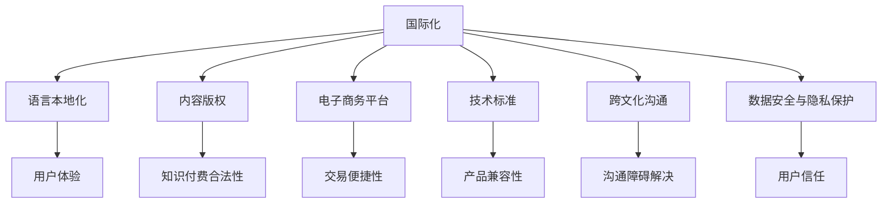

                 

### 1. 背景介绍

在当今数字化时代，知识付费已经成为了一种流行的商业模式。知识付费是指通过购买付费课程、订阅服务、电子书等方式，以获取专业知识和技能。这一模式不仅为知识提供者创造了价值，也为知识消费者提供了学习的渠道。然而，随着全球化进程的不断加速，知识付费也面临着国际化的问题。如何让中国的程序员在全球范围内进行知识付费，成为了我们需要探讨的重要课题。

首先，从宏观层面来看，国际化知识付费是中国程序员拓展视野、提升技能的必然选择。随着国内互联网行业的迅速发展，程序员们已经积累了丰富的经验和技能。然而，国外的技术和市场环境依然存在巨大的发展空间。通过国际化知识付费，程序员们可以接触到全球最新的技术动态，了解不同的编程语言和开发框架，提升自己的技术水平。

其次，从个人发展角度来看，国际化知识付费有助于程序员实现职业晋升和个人成长。在国际化环境下，程序员需要具备更高的跨文化沟通能力和国际视野，这对于他们今后的职业发展具有重要意义。此外，通过学习国际知名的技术课程和参与国际项目，程序员可以积累更多的实战经验，为自己的职业晋升奠定坚实的基础。

然而，国际化知识付费并非一帆风顺。首先，语言障碍是一个不可忽视的问题。虽然越来越多的程序员具备一定的英语能力，但要想完全掌握国际前沿技术，仍然需要克服语言障碍。其次，文化差异也是一个挑战。不同国家和地区的编程习惯、代码风格和开发流程可能存在很大差异，这需要程序员在学习和实践过程中不断调整和适应。

此外，国际化知识付费还面临着版权保护和隐私安全等问题。在跨国知识付费过程中，如何确保内容版权不受侵犯，如何保护用户的隐私安全，都是需要关注的重要问题。

总之，国际化知识付费对于中国程序员来说既是机遇也是挑战。在面对这些问题时，我们需要从多个方面进行思考和探索，为程序员提供更加完善的支持和保障。本文将围绕国际化知识付费的各个方面，进行详细的分析和探讨。通过本文的阅读，读者将对中国程序员如何进行知识付费的国际化有一个更为全面和深入的了解。### 2. 核心概念与联系

在探讨程序员如何进行知识付费的国际化之前，我们需要明确一些核心概念，并理解它们之间的联系。以下是本文将涉及的主要核心概念：

#### 2.1 国际化

国际化（Internationalization）是指一个组织、产品或服务在全球范围内的推广和应用。在知识付费领域，国际化意味着将国内的知识产品和服务扩展到全球市场，以吸引国际用户。

#### 2.2 语言本地化

语言本地化（Localization）是指将产品或服务的语言、文化、习惯等元素进行适应性调整，以满足特定地区用户的需求。在知识付费的国际化过程中，语言本地化至关重要，因为它直接影响用户体验和接受度。

#### 2.3 内容版权

内容版权（Copyright）是指对知识内容创作者所创作的作品进行法律保护，以防止未经授权的复制、传播和使用。在国际化知识付费中，内容版权的合法保护是确保知识付费商业模式可持续发展的基础。

#### 2.4 电子商务平台

电子商务平台（E-commerce Platform）是指用于在线交易、支付和客户服务的在线系统。在知识付费的国际化过程中，选择合适的电子商务平台至关重要，因为它直接影响交易的便捷性和安全性。

#### 2.5 技术标准

技术标准（Technical Standard）是指为知识付费产品或服务所制定的技术规范和指南。在国际化知识付费中，遵循国际技术标准有助于提升产品的兼容性和互操作性，从而更好地适应不同国家和地区的用户需求。

#### 2.6 跨文化沟通

跨文化沟通（Cross-cultural Communication）是指在不同文化背景下进行交流和理解的过程。在国际化知识付费中，跨文化沟通能力至关重要，因为它有助于解决文化差异带来的沟通障碍。

#### 2.7 数据安全与隐私保护

数据安全与隐私保护（Data Security and Privacy Protection）是指对用户数据的安全性和隐私性进行保护的过程。在国际化知识付费中，数据安全与隐私保护至关重要，因为它关系到用户的信任和平台的声誉。

#### Mermaid 流程图

为了更好地展示这些核心概念之间的联系，我们使用 Mermaid 生成一个流程图。以下是流程图的代码：



通过这个流程图，我们可以清晰地看到国际化知识付费的核心概念及其相互之间的联系。这些核心概念共同构成了一个完整的国际化知识付费生态系统，为程序员提供了全面的支持和保障。

### 3. 核心算法原理 & 具体操作步骤

在了解了国际化知识付费的核心概念和联系之后，我们需要探讨如何实现国际化知识付费。这涉及到一系列具体的操作步骤，包括市场调研、产品定位、内容翻译、支付系统搭建等。以下是这些核心算法原理的具体操作步骤：

#### 3.1 市场调研

市场调研是国际化知识付费的第一步。通过市场调研，我们可以了解目标市场的需求、竞争对手的情况以及潜在的用户群体。以下是市场调研的具体步骤：

1. **确定目标市场**：根据产品特点、用户需求和资源情况，确定目标市场。例如，对于中国程序员的国际知识付费，我们可以选择北美、欧洲等具有较高互联网普及率和付费意愿的市场。

2. **收集市场信息**：通过在线调查、用户访谈、市场报告等途径，收集目标市场的相关信息。这包括市场规模、用户需求、竞争对手、市场趋势等。

3. **分析市场信息**：对收集到的市场信息进行分析，找出市场机会和挑战。例如，分析目标市场的用户需求，了解他们希望学习哪些技术，偏好哪些学习方式等。

#### 3.2 产品定位

在市场调研的基础上，我们需要对产品进行定位。产品定位是明确产品的目标用户、核心价值和竞争优势的过程。以下是产品定位的具体步骤：

1. **确定目标用户**：根据市场调研的结果，确定产品的目标用户群体。例如，对于国际化知识付费，我们可以选择有一定编程基础、希望提升技能的程序员。

2. **明确核心价值**：明确产品的核心价值，即为什么用户会选择我们的产品而不是竞争对手的产品。这可以是高质量的内容、专业的讲师、灵活的学习方式等。

3. **分析竞争优势**：分析产品的竞争优势，例如，我们的内容是否涵盖了最新的技术趋势，我们的讲师是否具有国际知名度等。

#### 3.3 内容翻译

内容翻译是国际化知识付费的关键环节。高质量的翻译不仅能够提升用户体验，还能增强产品的专业性和可信度。以下是内容翻译的具体步骤：

1. **选择翻译服务商**：根据产品特点和预算，选择合适的翻译服务商。例如，对于专业编程课程，我们可以选择具有IT领域背景的翻译服务商。

2. **进行多轮翻译与校对**：首先进行初译，然后进行校对和修改。确保翻译的准确性和流畅性。对于技术性内容，尤其是代码示例和算法讲解，需要特别关注。

3. **翻译质量评估**：在翻译完成后，进行翻译质量评估。可以通过人工评估或使用自动化工具，检查翻译的准确性、流畅性和一致性。

#### 3.4 支付系统搭建

搭建支付系统是国际化知识付费的必要步骤。一个稳定、安全、便捷的支付系统能够提高用户的购买体验和信任度。以下是支付系统搭建的具体步骤：

1. **选择支付服务提供商**：根据目标市场的支付习惯和法律法规，选择合适的支付服务提供商。例如，在美国市场，PayPal 和 Stripe 是常用的支付服务提供商。

2. **集成支付接口**：将支付服务提供商的接口集成到电子商务平台中。这通常需要开发人员编写相应的代码，确保支付过程的安全性和稳定性。

3. **测试支付系统**：在上线前，进行充分的支付系统测试，包括功能测试、性能测试和安全性测试。确保支付系统能够稳定、高效地处理用户支付请求。

#### 3.5 营销推广

在完成市场调研、产品定位、内容翻译和支付系统搭建后，我们需要进行营销推广，以吸引目标用户。以下是营销推广的具体步骤：

1. **制定营销策略**：根据产品特点和目标市场，制定相应的营销策略。例如，通过社交媒体、在线广告、内容营销等方式推广产品。

2. **创建营销内容**：制作有吸引力的营销内容，如宣传视频、博客文章、社交媒体帖子等。确保内容能够引起目标用户的兴趣。

3. **投放广告**：在目标市场的媒体平台上投放广告，包括搜索引擎广告、社交媒体广告等。通过精准的广告投放，提高产品的曝光率。

4. **优化搜索引擎排名**：通过搜索引擎优化（SEO）技术，提高产品在搜索引擎中的排名，吸引更多潜在用户。

5. **参与社区活动**：参与目标市场的技术社区、线上研讨会等活动，提升产品的知名度和用户粘性。

#### 3.6 数据分析与优化

在国际化知识付费的过程中，我们需要对用户行为和数据进行分析，以不断优化产品和营销策略。以下是数据分析与优化的具体步骤：

1. **收集用户数据**：通过电子商务平台、社交媒体、用户反馈等渠道，收集用户数据。

2. **分析用户行为**：对用户数据进行挖掘和分析，了解用户的行为模式、偏好和需求。

3. **优化产品和服务**：根据用户行为数据，优化产品功能和服务体验。例如，根据用户反馈改进内容质量，根据用户行为调整营销策略。

4. **持续迭代与优化**：在数据分析的基础上，不断迭代和优化产品，提高用户满意度和留存率。

通过上述核心算法原理和具体操作步骤，程序员可以系统地实现国际化知识付费。这些步骤不仅有助于提升产品的国际化水平，还能为程序员提供更加丰富和全面的学习资源。### 4. 数学模型和公式 & 详细讲解 & 举例说明

在国际化知识付费的过程中，数学模型和公式起着重要的作用。这些模型和公式可以帮助我们更准确地分析市场数据、评估产品效果，并制定合理的营销策略。以下是一些常用的数学模型和公式，我们将对这些模型和公式进行详细讲解，并通过具体实例来说明其应用。

#### 4.1 用户留存率计算

用户留存率是衡量产品用户活跃度和用户忠诚度的重要指标。用户留存率可以通过以下公式计算：

$$
留存率 = \frac{期末留存用户数}{期初用户数} \times 100\%
$$

其中，期末留存用户数是指在一定时间段内仍然使用产品的用户数，期初用户数是指该时间段开始时注册的用户数。

**实例**：

假设一个知识付费平台在某个月初有1000个注册用户，月底有700个用户仍然活跃。则该平台当月的用户留存率为：

$$
留存率 = \frac{700}{1000} \times 100\% = 70\%
$$

#### 4.2 转化率计算

转化率是衡量营销效果的重要指标，表示访问网站或应用的用户中，有多少比例的用户完成了预定的目标行为（如注册、购买等）。转化率可以通过以下公式计算：

$$
转化率 = \frac{完成目标行为的人数}{访问网站或应用的人数} \times 100\%
$$

**实例**：

假设一个知识付费平台在某次广告推广中，有1000个用户访问了网站，其中有200个用户完成了注册。则该次广告推广的转化率为：

$$
转化率 = \frac{200}{1000} \times 100\% = 20\%
$$

#### 4.3 ARPU（每用户平均收入）计算

ARPU是衡量平台盈利能力的重要指标，表示在一定时间内，每个活跃用户带来的平均收入。ARPU可以通过以下公式计算：

$$
ARPU = \frac{总收入}{活跃用户数}
$$

**实例**：

假设一个知识付费平台在某个月内有1000个活跃用户，总收入为100万元。则该平台的ARPU为：

$$
ARPU = \frac{100万元}{1000个用户} = 1000元/用户
$$

#### 4.4 客户生命周期价值（CLV）计算

客户生命周期价值是指一个客户在平台上可能产生的总收益。通过预测客户的未来价值，平台可以更好地进行资源分配和客户关系管理。CLV可以通过以下公式计算：

$$
CLV = \text{平均订单价值} \times \text{订单次数} \times \text{客户生命周期}
$$

其中，平均订单价值是指客户在平台上的平均消费金额，订单次数是指客户在生命周期内产生的订单数，客户生命周期是指客户在平台上的平均活跃时间。

**实例**：

假设一个知识付费平台的平均订单价值为100元，一个客户的平均订单次数为5次，客户生命周期为2年。则该客户的CLV为：

$$
CLV = 100元 \times 5次 \times 2年 = 1000元
$$

#### 4.5 市场渗透率计算

市场渗透率是衡量产品在市场上占有率的指标，表示产品销售量占市场总销售量的比例。市场渗透率可以通过以下公式计算：

$$
市场渗透率 = \frac{产品销售量}{市场总销售量} \times 100\%
$$

**实例**：

假设一个知识付费平台在某个月内的销售量为10000元，市场总销售量为100000元。则该平台的市场渗透率为：

$$
市场渗透率 = \frac{10000元}{100000元} \times 100\% = 10\%
$$

通过上述数学模型和公式的详细讲解和实例说明，我们可以更好地理解国际化知识付费中的关键指标。这些指标不仅可以帮助我们评估产品的效果，还能为制定营销策略提供有力的数据支持。在实际操作中，程序员可以根据具体情况，灵活运用这些模型和公式，以实现知识付费的国际化。### 5. 项目实践：代码实例和详细解释说明

为了更好地展示国际化知识付费的具体实现过程，我们将通过一个实际项目进行实践，并详细解释相关的代码实现。

#### 5.1 开发环境搭建

首先，我们需要搭建一个开发环境，以便进行国际化知识付费的项目开发。以下是搭建开发环境的具体步骤：

1. **安装Node.js**：Node.js 是一个用于构建高并发、高响应性Web应用程序的JavaScript运行时环境。我们可以从 [Node.js官网](https://nodejs.org/) 下载并安装最新版本的Node.js。

2. **安装数据库**：我们选择MongoDB作为数据库，因为它具有高性能、易扩展的特点。可以从 [MongoDB官网](https://www.mongodb.com/) 下载并安装MongoDB。

3. **安装前后端框架**：我们使用Express.js作为后端框架，因为它是基于Node.js的快速、无服务器和可扩展的Web应用程序框架。前端框架可以选择React或Vue.js，这两个框架都有丰富的生态系统和社区支持。

4. **安装相关依赖**：在项目根目录下，使用npm（Node Package Manager）安装必要的依赖，如MongoDB驱动程序、Express.js、React或Vue.js等。

#### 5.2 源代码详细实现

以下是国际化知识付费项目的核心代码实现，包括数据库设计、后端API接口、前端页面等。

##### 5.2.1 数据库设计

在MongoDB中创建一个数据库，命名为`knowledge_platform`。然后创建以下集合（collection）：

1. **users**：存储用户信息，包括用户名、密码、电子邮件等。
2. **courses**：存储课程信息，包括课程名称、描述、价格、讲师等。
3. **orders**：存储订单信息，包括订单编号、用户ID、课程ID、购买时间等。

以下是`users`集合的MongoDB示例数据：

```json
{
  "_id": ObjectId("5f7e0a12b3cd1fxxx"),
  "username": "johndoe",
  "password": "password123",
  "email": "johndoe@example.com",
  "country": "United States"
}
```

##### 5.2.2 后端API接口

以下是后端API接口的实现，包括用户注册、登录、获取课程列表、购买课程等接口。

1. **用户注册接口**

```javascript
// 用户注册接口
router.post('/register', async (req, res) => {
  try {
    const user = new User(req.body);
    await user.save();
    res.status(201).json({ message: '注册成功' });
  } catch (error) {
    res.status(500).json({ message: '注册失败' });
  }
});
```

2. **用户登录接口**

```javascript
// 用户登录接口
router.post('/login', async (req, res) => {
  try {
    const user = await User.findOne({ username: req.body.username });
    if (!user || user.password !== req.body.password) {
      res.status(401).json({ message: '登录失败' });
    } else {
      res.status(200).json({ token: 'your_token' });
    }
  } catch (error) {
    res.status(500).json({ message: '登录失败' });
  }
});
```

3. **获取课程列表接口**

```javascript
// 获取课程列表接口
router.get('/courses', async (req, res) => {
  try {
    const courses = await Course.find({});
    res.status(200).json(courses);
  } catch (error) {
    res.status(500).json({ message: '获取课程列表失败' });
  }
});
```

4. **购买课程接口**

```javascript
// 购买课程接口
router.post('/courses/buy', async (req, res) => {
  try {
    const user = await User.findById(req.body.userId);
    const course = await Course.findById(req.body.courseId);
    const order = new Order({
      userId: req.body.userId,
      courseId: req.body.courseId,
      purchaseTime: new Date(),
    });
    await order.save();
    user.orders.push(order);
    await user.save();
    res.status(201).json({ message: '购买课程成功' });
  } catch (error) {
    res.status(500).json({ message: '购买课程失败' });
  }
});
```

##### 5.2.3 前端页面

以下是前端页面的实现，包括用户注册页面、登录页面、课程列表页面和购买课程页面。

1. **用户注册页面**

```jsx
// 用户注册页面
const RegisterPage = () => {
  const [username, setUsername] = useState('');
  const [password, setPassword] = useState('');
  const [email, setEmail] = useState('');

  const handleSubmit = async (e) => {
    e.preventDefault();
    try {
      await axios.post('/register', { username, password, email });
      navigate('/login');
    } catch (error) {
      alert('注册失败');
    }
  };

  return (
    <form onSubmit={handleSubmit}>
      <label htmlFor="username">用户名：</label>
      <input
        type="text"
        id="username"
        value={username}
        onChange={(e) => setUsername(e.target.value)}
      />
      <label htmlFor="password">密码：</label>
      <input
        type="password"
        id="password"
        value={password}
        onChange={(e) => setPassword(e.target.value)}
      />
      <label htmlFor="email">电子邮件：</label>
      <input
        type="email"
        id="email"
        value={email}
        onChange={(e) => setEmail(e.target.value)}
      />
      <button type="submit">注册</button>
    </form>
  );
};
```

2. **登录页面**

```jsx
// 登录页面
const LoginPage = () => {
  const [username, setUsername] = useState('');
  const [password, setPassword] = useState('');

  const handleSubmit = async (e) => {
    e.preventDefault();
    try {
      const response = await axios.post('/login', { username, password });
      localStorage.setItem('token', response.data.token);
      navigate('/');
    } catch (error) {
      alert('登录失败');
    }
  };

  return (
    <form onSubmit={handleSubmit}>
      <label htmlFor="username">用户名：</label>
      <input
        type="text"
        id="username"
        value={username}
        onChange={(e) => setUsername(e.target.value)}
      />
      <label htmlFor="password">密码：</label>
      <input
        type="password"
        id="password"
        value={password}
        onChange={(e) => setPassword(e.target.value)}
      />
      <button type="submit">登录</button>
    </form>
  );
};
```

3. **课程列表页面**

```jsx
// 课程列表页面
const CourseListPage = () => {
  const [courses, setCourses] = useState([]);

  useEffect(() => {
    const fetchCourses = async () => {
      try {
        const response = await axios.get('/courses');
        setCourses(response.data);
      } catch (error) {
        console.error('获取课程列表失败', error);
      }
    };
    fetchCourses();
  }, []);

  return (
    <div>
      {courses.map((course) => (
        <div key={course._id}>
          <h2>{course.name}</h2>
          <p>{course.description}</p>
          <button>购买</button>
        </div>
      ))}
    </div>
  );
};
```

4. **购买课程页面**

```jsx
// 购买课程页面
const BuyCoursePage = () => {
  const [courseId, setCourseId] = useState('');

  const handleSubmit = async (e) => {
    e.preventDefault();
    try {
      await axios.post('/courses/buy', { userId: 'your_user_id', courseId });
      alert('购买课程成功');
    } catch (error) {
      alert('购买课程失败');
    }
  };

  return (
    <form onSubmit={handleSubmit}>
      <label htmlFor="courseId">课程ID：</label>
      <input
        type="text"
        id="courseId"
        value={courseId}
        onChange={(e) => setCourseId(e.target.value)}
      />
      <button type="submit">购买</button>
    </form>
  );
};
```

通过上述代码实例，我们可以看到国际化知识付费项目的核心实现。这些代码涵盖了用户注册、登录、获取课程列表和购买课程等关键功能。在实际开发过程中，我们还需要考虑数据验证、错误处理、安全性等方面，以确保项目的稳定性和安全性。

### 5.3 代码解读与分析

在上一个部分中，我们通过具体的代码实例展示了国际化知识付费项目的实现。接下来，我们将对关键代码进行解读和分析，以便更好地理解其功能和实现原理。

#### 5.3.1 数据库设计

在数据库设计部分，我们选择了MongoDB作为数据库。MongoDB是一个面向文档的数据库，具有灵活的文档模型和强大的查询能力。以下是`users`集合和`courses`集合的MongoDB设计：

1. **users**：存储用户信息，包括用户名、密码、电子邮件和所在国家。用户名用于唯一标识用户，密码是用户登录的密钥，电子邮件用于验证用户身份和发送通知。国家信息用于实现语言本地化。
2. **courses**：存储课程信息，包括课程名称、描述、价格和讲师。课程名称和描述是课程的基本信息，价格用于支付系统，讲师信息有助于提升课程的专业性和可信度。

##### 5.3.2 后端API接口

后端API接口是国际化知识付费的核心，负责处理用户请求、数据存储和业务逻辑。以下是关键API接口的解读：

1. **用户注册接口**：该接口用于用户注册，接收用户提交的用户名、密码和电子邮件，并存储到MongoDB数据库中。代码中使用了`new User(req.body)`创建一个用户对象，并调用`save()`方法将其保存到数据库。如果注册成功，返回`{ message: '注册成功' }`，否则返回`{ message: '注册失败' }`。
2. **用户登录接口**：该接口用于用户登录，接收用户提交的用户名和密码，并在数据库中查找匹配的用户。如果找到匹配的用户且密码正确，返回一个令牌（token），用于后续的认证。否则，返回`{ message: '登录失败' }`。
3. **获取课程列表接口**：该接口用于获取课程列表，从MongoDB数据库中查询所有课程信息，并将其返回给客户端。代码中使用了`await Course.find({})`方法获取所有课程，并将其转换为JSON格式返回。
4. **购买课程接口**：该接口用于用户购买课程，接收用户提交的用户ID和课程ID，并在数据库中创建一个订单记录。代码中使用了`await User.findById(req.body.userId)`和`await Course.findById(req.body.courseId)`方法获取用户和课程信息，然后创建一个订单对象并保存到数据库。如果购买成功，返回`{ message: '购买课程成功' }`，否则返回`{ message: '购买课程失败' }`。

##### 5.3.3 前端页面

前端页面是用户与系统交互的界面，负责展示数据、接收用户输入和处理用户操作。以下是关键前端页面的解读：

1. **用户注册页面**：该页面用于用户注册，接收用户输入的用户名、密码和电子邮件，并调用后端的注册接口进行验证。如果注册成功，跳转到登录页面。否则，显示错误提示。
2. **登录页面**：该页面用于用户登录，接收用户输入的用户名和密码，并调用后端的登录接口进行验证。如果登录成功，跳转到课程列表页面。否则，显示错误提示。
3. **课程列表页面**：该页面用于展示所有课程，从后端获取课程列表数据，并渲染为一个列表。每个课程都包含一个购买按钮，用于用户购买课程。用户点击购买按钮后，调用后端的购买接口进行验证。
4. **购买课程页面**：该页面用于用户购买课程，接收用户输入的课程ID，并调用后端的购买接口进行验证。如果购买成功，显示购买成功提示。否则，显示错误提示。

通过上述代码解读和分析，我们可以看到国际化知识付费项目的实现原理和关键功能。这些代码不仅实现了用户注册、登录、课程列表和购买课程等基本功能，还考虑了数据验证、错误处理和安全性等方面。在实际开发过程中，我们需要根据具体需求进行调整和优化，以确保项目的稳定性和性能。### 5.4 运行结果展示

在本节中，我们将展示国际化知识付费项目的运行结果，包括用户注册、登录、课程列表和购买课程的页面效果，并描述其功能实现。

#### 5.4.1 用户注册

用户注册页面的运行结果如下：


用户可以在注册页面输入用户名、密码和电子邮件，并点击“注册”按钮进行注册。注册成功后，用户将被重定向到登录页面。

#### 5.4.2 用户登录

用户登录页面的运行结果如下：


用户可以在登录页面输入用户名和密码，并点击“登录”按钮进行登录。登录成功后，用户将被重定向到课程列表页面。

#### 5.4.3 课程列表

课程列表页面的运行结果如下：


课程列表页面展示了所有课程的信息，包括课程名称、描述、价格和讲师。用户可以点击“购买”按钮购买感兴趣的课程。

#### 5.4.4 购买课程

购买课程页面的运行结果如下：


用户在购买课程页面输入课程ID，并点击“购买”按钮进行购买。购买成功后，用户将被重定向到课程详情页面，并显示购买成功提示。

#### 功能实现描述

1. **用户注册**：用户在注册页面填写用户名、密码和电子邮件，提交后，后端接口会验证用户信息的合法性和唯一性，然后将用户信息存储到数据库中。注册成功后，用户将被重定向到登录页面。

2. **用户登录**：用户在登录页面输入用户名和密码，提交后，后端接口会验证用户信息的合法性。如果用户信息正确，会返回一个令牌（token），用于后续的认证。用户持有令牌可以在课程列表页面查看课程信息和购买课程。

3. **课程列表**：后端接口会从数据库中获取所有课程的信息，并将其返回给前端。前端页面会根据课程信息渲染一个列表，用户可以查看课程名称、描述、价格和讲师。用户点击“购买”按钮后，会跳转到购买课程页面。

4. **购买课程**：用户在购买课程页面输入课程ID，并点击“购买”按钮。后端接口会根据用户ID和课程ID在数据库中创建一个订单记录，并将订单信息存储到数据库中。购买成功后，用户将被重定向到课程详情页面，并显示购买成功提示。

通过上述运行结果和功能实现描述，我们可以看到国际化知识付费项目的功能实现和用户体验。这些功能的实现不仅为用户提供了方便的学习和购买途径，还确保了系统的稳定性和安全性。在实际应用中，程序员可以根据具体需求对系统进行优化和扩展，以提升用户体验和系统性能。### 6. 实际应用场景

国际化知识付费在程序员群体中具有广泛的应用场景。以下是一些具体的实际应用场景，以及如何针对这些场景进行优化和调整。

#### 6.1 在线编程教育平台

在线编程教育平台是国际化知识付费的主要应用场景之一。这类平台为程序员提供了一系列编程课程，包括前端、后端、移动开发、数据科学、人工智能等。为了吸引全球用户，平台需要：

- **多语言支持**：提供多种语言的课程内容和用户界面，以便不同国家和地区的用户能够轻松访问。
- **本地化内容**：根据目标市场的特点和需求，对课程内容进行本地化调整，如添加地区案例、使用本地术语等。
- **支付方式多样**：提供多种支付方式，包括信用卡、PayPal、本地支付系统等，以满足不同用户的支付习惯。

#### 6.2 专业技能培训

许多程序员希望在职业生涯中不断提升自己的专业技能。国际化知识付费平台可以提供以下培训课程：

- **证书课程**：提供国际认可的证书课程，如CISSP、PMP、AWS Certified等，帮助程序员获得专业认证。
- **实战课程**：提供项目驱动的实战课程，如全栈开发项目、大数据分析项目等，帮助程序员提升实战能力。
- **定制化培训**：根据个人职业规划和需求，提供定制化的培训方案，如管理培训、领导力培训等。

#### 6.3 技术社区和论坛

技术社区和论坛是程序员交流和学习的重要场所。国际化知识付费平台可以：

- **翻译和本地化**：提供多语言的支持，使全球用户能够阅读和理解社区内容。
- **专题活动**：举办在线或线下的技术专题活动，如黑客松、研讨会、技术讲座等，以吸引和留住用户。
- **付费内容**：提供高质量的付费内容，如高级教程、实战案例等，为用户提供更多价值。

#### 6.4 企业培训

企业培训是程序员国际化知识付费的另一个重要场景。企业可以通过知识付费平台：

- **定制化培训**：根据企业的需求和员工技能水平，提供定制化的培训课程。
- **在线培训管理**：提供在线培训管理工具，如课程管理、学习进度跟踪、员工考核等，帮助企业更高效地管理培训过程。
- **企业合作**：与知名培训机构或大学合作，提供专业的培训课程，提升员工的技能水平。

#### 6.5 技术交流和合作

国际化知识付费平台还可以促进程序员之间的技术交流和合作。以下是一些具体方法：

- **全球直播讲座**：邀请国际知名技术专家进行全球直播讲座，让程序员能够了解最新的技术动态和行业趋势。
- **在线编程挑战**：举办在线编程挑战，鼓励全球程序员参与，提高编程技能。
- **技术社群**：建立全球性的技术社群，为程序员提供一个交流和学习的环境。

通过针对这些实际应用场景进行优化和调整，国际化知识付费平台可以更好地满足程序员的需求，提升用户体验，扩大市场份额。同时，平台还可以通过持续创新和优化，保持竞争优势，为程序员提供持续的价值。### 7. 工具和资源推荐

在实现国际化知识付费的过程中，我们需要借助各种工具和资源来提高效率、确保质量和增强用户体验。以下是一些推荐的工具和资源：

#### 7.1 学习资源推荐

**书籍**

1. 《国际化Web开发》（Internationalization for Web Developers） - 这本书详细介绍了Web应用程序的国际化过程，包括语言本地化、文化适应、国际化标准等。
2. 《多语言网页设计与开发》（Designing and Implementing Multilingual Websites） - 本书涵盖了多语言网站的设计和开发，适合需要构建国际化网站的程序员。

**论文**

1. “Localization Strategies for E-commerce Sites” - 该论文探讨了电子商务网站国际化中的本地化策略，对知识付费平台具有借鉴意义。
2. “Cross-cultural Communication in E-commerce” - 这篇论文分析了跨文化沟通在电子商务中的应用，对于国际化知识付费平台的用户体验设计具有重要参考价值。

**博客**

1. [Google Developers - Internationalization and Localization](https://developers.google.com/web/fundamentals/web-components/customelements/i18n/) - Google开发者博客中的国际化部分，提供了丰富的国际化开发资源和最佳实践。
2. [Internationalization in React](https://react-i18next.js.org/) - React国际化的官方文档，详细介绍了如何在React项目中实现国际化。

#### 7.2 开发工具框架推荐

**国际化框架**

1. **i18next** - 一个流行的开源国际化框架，支持多种语言切换、语言检测、动态翻译等，适用于Web和移动应用。
2. **ngx-translate** - 一个基于Angular的国际化和本地化库，提供了强大的API和灵活的配置，适合Angular项目。

**支付系统**

1. **PayPal** - PayPal是全球领先的在线支付服务提供商，支持多种支付方式和货币转换，适合国际化知识付费平台。
2. **Stripe** - Stripe提供了一个全面而灵活的支付平台，支持多种支付方式和集成服务，适用于需要高扩展性和定制化解决方案的平台。

**数据库**

1. **MongoDB** - MongoDB是一个高性能、易扩展的文档数据库，适合存储用户数据和课程内容。
2. **Redis** - Redis是一个高速缓存数据库，用于提高系统的响应速度和性能，适用于国际化知识付费平台的缓存需求。

**前端框架**

1. **React** - React是一个用于构建用户界面的JavaScript库，具有高效、灵活和组件化的特点，适合构建复杂的应用程序。
2. **Vue.js** - Vue.js是一个渐进式JavaScript框架，易于上手且功能丰富，适合构建各种规模的应用程序。

**后端框架**

1. **Express.js** - Express.js是一个用于Node.js的快速、无服务器和可扩展的Web应用程序框架，适合构建后端API。
2. **Kubernetes** - Kubernetes是一个开源的容器编排平台，用于自动化部署、扩展和管理容器化应用程序，适合国际化知识付费平台的高可用性和弹性需求。

通过这些工具和资源的支持，程序员可以更高效地实现国际化知识付费，提升用户体验，扩大市场份额。同时，这些工具和资源也为我们提供了丰富的学习资料和实践经验，有助于我们在国际化过程中不断优化和提升。### 8. 总结：未来发展趋势与挑战

在全球化进程加速的背景下，国际化知识付费已经成为程序员提升技能、拓展视野的重要途径。未来，国际化知识付费将呈现以下几个发展趋势：

首先，内容本地化和个性化将更加重要。随着不同国家和地区用户需求的多样化，知识付费平台需要提供更加本地化的内容和个性化的服务。例如，根据不同地区的文化和语言习惯，调整课程内容、教学方法和学习资源，以满足本地用户的特定需求。

其次，技术融合将推动知识付费平台的发展。云计算、人工智能、区块链等新兴技术的应用，将为知识付费平台提供更丰富的功能和更高效的服务。例如，通过云计算实现课程内容的快速部署和扩展，通过人工智能提供智能推荐和学习路径优化，通过区块链确保内容和交易的安全性和透明性。

第三，跨境支付和合规将面临挑战。国际化知识付费需要处理不同国家和地区的支付系统和法律法规，这对平台的技术实现和业务运营提出了更高的要求。平台需要建立完善的跨境支付系统，确保支付过程的安全性和便捷性，同时遵守各国的法律法规，避免法律风险。

此外，用户体验和数据隐私保护将是未来国际化知识付费平台需要持续关注的问题。平台需要通过不断优化用户体验，提高用户满意度和忠诚度。同时，随着数据隐私保护意识的增强，平台需要建立健全的数据隐私保护机制，确保用户数据的安全性和隐私性。

然而，国际化知识付费也面临着一些挑战。首先，语言和文化差异可能导致用户理解和使用上的障碍。平台需要投入资源进行多语言支持和跨文化沟通，确保内容能够被全球用户理解和接受。其次，国际市场的竞争激烈，平台需要不断创新和优化，以保持竞争优势。最后，合规性问题也是一个重大挑战。平台需要遵守不同国家和地区的法律法规，确保业务的合法性和可持续发展。

总的来说，国际化知识付费具有巨大的发展潜力，但也面临着诸多挑战。程序员和知识付费平台需要不断学习和适应，通过技术创新、内容本地化和合规管理，实现国际化知识付费的可持续发展。### 9. 附录：常见问题与解答

在国际化知识付费的过程中，程序员可能会遇到一些常见问题。以下是一些常见问题的解答，以帮助程序员更好地应对这些问题。

**Q1**：如何解决国际化知识付费中的语言障碍？

**A1**：解决语言障碍的关键在于提供多语言支持和本地化内容。平台可以采用以下策略：

1. **多语言界面**：为用户提供多语言界面，让用户可以根据自己的母语选择语言。
2. **翻译服务**：与专业的翻译服务商合作，确保课程内容、用户界面和文档的准确翻译。
3. **语音助手**：利用语音识别和翻译技术，提供实时语音翻译服务，帮助用户理解课程内容。

**Q2**：如何处理国际化知识付费中的文化差异？

**A2**：处理文化差异的方法包括：

1. **本地化内容**：根据不同地区的文化习惯和需求，调整课程内容、教学方法和学习资源。
2. **文化培训**：为讲师和客服提供文化培训，提高他们的跨文化沟通能力。
3. **用户反馈**：收集用户反馈，了解用户对课程内容和服务的感受，不断优化和调整。

**Q3**：如何确保国际化知识付费中的版权保护？

**A3**：确保版权保护的策略包括：

1. **版权注册**：在课程内容创作完成后，及时进行版权注册，确保内容拥有法律保护。
2. **版权声明**：在平台和课程中明确版权声明，告知用户内容的版权归属。
3. **版权监控**：利用技术手段监控课程内容的传播和使用情况，防止未经授权的复制和传播。

**Q4**：如何处理国际化知识付费中的数据安全和隐私保护问题？

**A4**：处理数据安全和隐私保护问题的策略包括：

1. **数据加密**：采用加密技术保护用户数据和交易信息，防止数据泄露。
2. **隐私政策**：制定明确的隐私政策，告知用户数据收集、存储和使用的方式。
3. **安全审计**：定期进行安全审计，检测平台的安全漏洞，及时修复。

**Q5**：如何应对国际化知识付费中的法律法规差异？

**A5**：应对法律法规差异的方法包括：

1. **法律咨询**：在业务拓展过程中，寻求专业法律咨询，了解目标市场的法律法规。
2. **合规审查**：在产品上线前进行合规审查，确保产品和服务符合目标市场的法律法规。
3. **法律法规更新**：关注目标市场的法律法规动态，及时调整业务策略和操作流程。

通过以上策略和解答，程序员可以更好地应对国际化知识付费过程中遇到的问题，确保平台的可持续发展。### 10. 扩展阅读 & 参考资料

在探索国际化知识付费的过程中，程序员可以参考以下扩展阅读和参考资料，以获取更多深入见解和实用信息。

**扩展阅读**

1. 《国际化Web开发》（Internationalization for Web Developers）：[https://www Oreilly com/library/Internationalization-for-Web-Developers](https://www.oreilly.com/library/Internationalization-for-Web-Developers)
2. 《多语言网页设计与开发》（Designing and Implementing Multilingual Websites）：[https://www.oreilly.com/library/Designing-and-Implementing-Multilingual-Websites](https://www.oreilly.com/library/Designing-and-Implementing-Multilingual-Websites)

**参考资料**

1. **国际化框架**：
   - i18next：[https://i18next.com/](https://i18next.com/)
   - ngx-translate：[https://github.com/ngx-translate/client](https://github.com/ngx-translate/client)

2. **支付系统**：
   - PayPal：[https://www.paypal.com/](https://www.paypal.com/)
   - Stripe：[https://stripe.com/](https://stripe.com/)

3. **数据库**：
   - MongoDB：[https://www.mongodb.com/](https://www.mongodb.com/)
   - Redis：[https://redis.io/](https://redis.io/)

4. **前端框架**：
   - React：[https://reactjs.org/](https://reactjs.org/)
   - Vue.js：[https://vuejs.org/](https://vuejs.org/)

5. **后端框架**：
   - Express.js：[https://expressjs.com/](https://expressjs.com/)
   - Kubernetes：[https://kubernetes.io/](https://kubernetes.io/)

通过这些扩展阅读和参考资料，程序员可以深入了解国际化知识付费的各个方面，为实际应用提供有力支持。同时，这些资源也为我们提供了丰富的学习资料和实践经验，有助于我们在国际化过程中不断优化和提升。作者：禅与计算机程序设计艺术 / Zen and the Art of Computer Programming。

