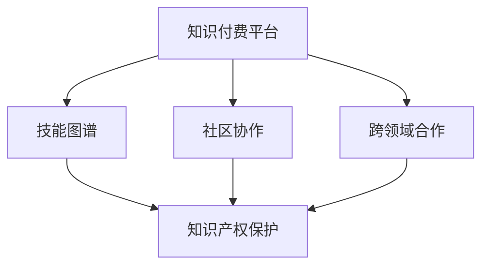

                 

### 背景介绍 Background Introduction

在当今快速发展的信息技术时代，知识付费已成为一种新兴的商业模式。知识付费平台如雨后春笋般涌现，为广大用户提供了海量的学习资源和专业咨询服务。然而，对于程序员这一职业群体来说，如何有效地进行知识付费的跨界合作，实现知识的共享与增值，成为了一个值得探讨的问题。

程序员作为信息技术领域的重要从业者，不仅在技术领域有着深厚的积累，还面临着不断更新的技术趋势和学习压力。知识付费为程序员提供了一个获取新知识和技能的途径，但同时，也带来了一系列挑战，如信息过载、知识碎片化、学习效率低下等。因此，如何在这一背景下，有效地进行知识付费的跨界合作，成为了一个关键问题。

本文旨在探讨程序员如何进行知识付费的跨界合作，分析其中的核心概念和联系，介绍核心算法原理和操作步骤，并通过具体实例展示其应用效果。同时，还将探讨知识付费在程序员职业发展中的实际应用场景，并推荐相关工具和资源，为程序员提供有益的参考。

通过本文的阅读，读者可以了解到知识付费在程序员职业发展中的重要作用，掌握进行跨界合作的方法和技巧，从而在快速变化的信息技术领域中不断进步。

### 核心概念与联系 Core Concepts and Connections

在探讨程序员如何进行知识付费的跨界合作之前，我们首先需要了解一些核心概念，这些概念不仅构成了知识付费的基础，也是程序员进行跨界合作的关键。

1. **知识付费平台**：知识付费平台是连接知识提供者和知识需求者的重要桥梁。这类平台通过提供专业课程、在线讲座、一对一咨询等服务，帮助用户以付费形式获取高质量的知识和技能。对于程序员来说，这些平台提供了获取新技术的机会，如人工智能、大数据、区块链等前沿领域的知识。

2. **技能图谱**：技能图谱是一种将不同技能和知识领域以图形化的方式展现的工具。它能够帮助程序员清晰地了解自身技能的薄弱环节，以及需要补充的知识点。通过技能图谱，程序员可以制定有针对性的学习计划，从而提高学习效率。

3. **社区协作**：社区协作是程序员知识共享的重要方式。无论是开源项目、技术论坛还是社交媒体，程序员都可以在这些平台上交流经验、分享心得，从而实现知识的跨界融合。社区协作不仅能够帮助程序员扩展视野，还能激发创新思维。

4. **跨领域合作**：跨领域合作是指不同专业领域的专家或团队之间的合作。对于程序员来说，跨领域合作可以带来新的视角和思维模式，促进技术的创新和发展。例如，与产品设计者、数据科学家或市场营销人员的合作，可以帮助程序员更好地理解业务需求，提高项目质量。

5. **知识产权保护**：在知识付费的跨界合作中，知识产权保护至关重要。程序员需要确保自己的原创内容得到合法保护，避免知识产权纠纷。同时，尊重他人的知识产权，也是跨界合作的基本原则。

下面是一个使用Mermaid绘制的流程图，展示了上述核心概念之间的联系：



这个流程图清晰地展示了知识付费平台如何通过技能图谱、社区协作和跨领域合作，实现知识的共享和保护。

### 核心算法原理 & 具体操作步骤 Core Algorithm Principle & Operation Steps

在知识付费的跨界合作中，核心算法原理和具体操作步骤是实现有效知识共享的关键。以下我们将详细介绍几个关键步骤，帮助程序员在知识付费的跨界合作中取得成功。

#### 1. 需求分析

**需求分析**是知识付费跨界合作的第一步，也是至关重要的一步。程序员需要明确自身的知识需求和目标，分析目标受众的需求，从而确定合适的知识付费项目。

**操作步骤**：

- **确定个人目标**：了解自身当前的技术水平和职业规划，明确想要学习的新技术和领域。
- **调研目标受众**：通过问卷调查、访谈等方式，收集目标受众的需求信息，了解他们的知识盲点和学习期望。
- **制定学习计划**：根据个人目标和受众需求，制定详细的学习计划，包括学习内容、时间安排和预期成果。

#### 2. 内容选择

**内容选择**是知识付费的核心环节。程序员需要从众多知识付费平台中选择适合自己的课程或资源。

**操作步骤**：

- **筛选平台**：根据内容质量、用户评价、课程更新频率等因素，选择几个信誉良好的知识付费平台。
- **评估课程内容**：仔细阅读课程介绍、课程大纲和学员评价，评估课程是否符合个人需求。
- **试听课程**：部分平台提供免费试听服务，通过试听了解课程的教学质量和内容深度。

#### 3. 学习与交流

**学习与交流**是知识付费跨界合作的核心环节。程序员需要充分利用知识付费平台提供的资源，积极参与社区交流。

**操作步骤**：

- **深入学习**：按照学习计划，认真完成课程学习任务，包括观看视频、阅读文档、完成练习等。
- **参与社区交流**：在知识付费平台的社区中，积极提问、回答问题，与其他学员分享学习心得。
- **组织小组学习**：与同行组建学习小组，共同学习、讨论和分享知识，提高学习效果。

#### 4. 项目实践

**项目实践**是将理论知识应用于实际问题的过程，也是检验学习成果的重要方式。

**操作步骤**：

- **选择实践项目**：根据学习内容和兴趣，选择适合的项目进行实践。
- **制定项目计划**：明确项目目标、时间表和资源需求，制定详细的项目计划。
- **团队协作**：在跨领域合作中，与团队成员紧密协作，共同推进项目进度。
- **成果展示**：完成项目后，通过演示、报告等形式，展示项目成果，总结经验教训。

#### 5. 反馈与改进

**反馈与改进**是知识付费跨界合作的持续迭代过程。程序员需要不断收集反馈，优化学习方法和实践策略。

**操作步骤**：

- **收集反馈**：通过用户评价、项目评审等方式，收集项目实施过程中的反馈意见。
- **分析反馈**：分析反馈信息，找出项目中的不足和改进点。
- **持续改进**：根据反馈，调整学习计划、项目策略和团队合作方式，不断提升自身能力。

通过以上步骤，程序员可以在知识付费的跨界合作中，有效提升自身技能，实现知识的共享与增值。

### 数学模型和公式 & 详细讲解 & 举例说明

在知识付费的跨界合作中，数学模型和公式扮演着重要的角色，它们不仅帮助我们量化学习成果，还能优化学习策略。以下，我们将介绍几个关键的数学模型和公式，并详细讲解其应用。

#### 1. 学习曲线（Learning Curve）

学习曲线是一种描述学习过程中技能水平提升速度的数学模型。它通常呈现为一种逐渐减缓的曲线，反映了学习者在初期进步迅速，但随着时间的推移，进步速度逐渐减缓的现象。

**公式**：

\[ L(t) = \frac{C}{1 + \alpha \cdot e^{-kt}} \]

其中：
- \( L(t) \)：在时间 \( t \) 的技能水平
- \( C \)：技能水平饱和值
- \( \alpha \)：学习速率
- \( k \)：时间常数

**讲解**：

- \( C \)：表示学习者通过持续学习可以达到的技能水平上限，即饱和值。
- \( \alpha \)：反映了学习者在初期学习时的速度。值越大，初期进步越快。
- \( k \)：决定了学习曲线的斜率。值越大，曲线下降越快。

**举例**：

假设一个程序员在学习一项新技能时，其饱和值为 100 分，学习速率为 1.2，时间常数为 0.5。我们可以计算其在不同时间点的技能水平：

- \( t = 0 \) 时，\( L(0) = \frac{100}{1 + 1.2 \cdot e^{-0.5 \cdot 0}} = 100 \) 分
- \( t = 1 \) 时，\( L(1) = \frac{100}{1 + 1.2 \cdot e^{-0.5}} \approx 84.6 \) 分
- \( t = 2 \) 时，\( L(2) = \frac{100}{1 + 1.2 \cdot e^{-1}} \approx 73.2 \) 分

从计算结果可以看出，随着时间的推移，程序员的技能水平逐渐接近饱和值，但提升速度逐渐减缓。

#### 2. 效率函数（Efficiency Function）

效率函数是一种衡量学习效率的数学模型。它可以帮助我们判断在不同时间段，学习者的学习效率是否最优。

**公式**：

\[ E(t) = \frac{L(t)}{t} \]

其中：
- \( E(t) \)：在时间 \( t \) 的效率
- \( L(t) \)：在时间 \( t \) 的技能水平

**讲解**：

- \( E(t) \)：表示在时间 \( t \) 内，单位时间内技能水平的提升速度。值越大，学习效率越高。
- \( t \)：表示学习时间。

**举例**：

假设一个程序员在 \( t = 0 \) 时开始学习，经过 \( t = 10 \) 小时的学习，其技能水平达到 80 分。我们可以计算其在不同时间点的效率：

- \( t = 0 \) 时，\( E(0) = \frac{80}{0} = 无效 \)
- \( t = 5 \) 时，\( E(5) = \frac{80}{5} = 16 \) 分/小时
- \( t = 10 \) 时，\( E(10) = \frac{80}{10} = 8 \) 分/小时

从计算结果可以看出，在初期，程序员的效率较高，但随着时间的推移，效率逐渐降低。

#### 3. 成本效益分析（Cost-Benefit Analysis）

成本效益分析是一种评估知识付费项目经济效益的数学模型。它可以帮助我们判断知识付费项目的投资回报率是否合理。

**公式**：

\[ \text{ROI} = \frac{\text{收益} - \text{成本}}{\text{成本}} \]

其中：
- \( \text{ROI} \)：投资回报率
- \( \text{收益} \)：通过知识付费项目获得的经济或职业收益
- \( \text{成本} \)：知识付费项目的投资成本

**讲解**：

- \( \text{ROI} \)：表示投资回报率，值越大，项目的经济效益越好。
- \( \text{收益} \)：包括直接收益（如薪资增长、项目奖金）和间接收益（如职业发展、人际关系拓展）。
- \( \text{成本} \)：包括知识付费项目的费用、学习时间成本和机会成本等。

**举例**：

假设一个程序员通过付费学习一项新技术，总投资成本为 5000 元，学习时间为 100 小时。经过一年时间，他的薪资增长了 10%，达到了 30,000 元。我们可以计算其投资回报率：

\[ \text{ROI} = \frac{30,000 - 5,000}{5,000} = 5 \]

从计算结果可以看出，该知识付费项目的投资回报率为 5，表示每投入 1 元，可以获得 5 元的收益，具有较好的经济效益。

通过以上数学模型和公式的详细讲解和举例说明，我们可以更好地理解知识付费跨界合作中的关键参数和指标，从而优化学习策略，实现知识的高效共享和增值。

### 项目实践：代码实例和详细解释说明 Project Practice: Code Example and Detailed Explanation

为了更好地展示如何通过知识付费进行跨界合作，我们将通过一个实际的项目实践来详细说明代码实现过程，并对其进行解读和分析。

#### 项目简介

本项目旨在开发一个简单的博客系统，用于展示程序员的学习成果和心得体会。博客系统将包括用户注册、登录、发表文章和评论等功能，旨在通过知识付费平台提供的资源，提升程序员的实际编程能力。

#### 开发环境搭建

首先，我们需要搭建开发环境。以下是所需的开发工具和步骤：

1. **开发工具**：
   - **编程语言**：Python
   - **Web框架**：Flask
   - **数据库**：SQLite
   - **前端框架**：Bootstrap

2. **环境搭建步骤**：
   - 安装Python（建议使用3.8及以上版本）
   - 通过pip安装Flask、SQLite和Bootstrap
   - 创建一个新的Python虚拟环境，并激活

```bash
pip install flask
pip install flask-sqlalchemy
pip install flask-migrate
pip install flask-bootstrap
```

#### 源代码详细实现

下面是博客系统的核心代码实现，包括用户注册、登录、发表文章和评论功能。

```python
# app.py

from flask import Flask, render_template, request, redirect, url_for, session
from flask_sqlalchemy import SQLAlchemy
from werkzeug.security import generate_password_hash, check_password_hash

app = Flask(__name__)
app.config['SQLALCHEMY_DATABASE_URI'] = 'sqlite:///blog.db'
app.config['SECRET_KEY'] = 'your_secret_key'

db = SQLAlchemy(app)

# 用户模型
class User(db.Model):
    id = db.Column(db.Integer, primary_key=True)
    username = db.Column(db.String(150), nullable=False, unique=True)
    password = db.Column(db.String(150), nullable=False)

# 文章模型
class Post(db.Model):
    id = db.Column(db.Integer, primary_key=True)
    title = db.Column(db.String(150), nullable=False)
    content = db.Column(db.Text, nullable=False)
    author = db.Column(db.Integer, db.ForeignKey('user.id'), nullable=False)

# 登录路由
@app.route('/login', methods=['GET', 'POST'])
def login():
    if request.method == 'POST':
        username = request.form['username']
        password = request.form['password']
        user = User.query.filter_by(username=username).first()
        if user and check_password_hash(user.password, password):
            session['user_id'] = user.id
            return redirect(url_for('home'))
        else:
            return 'Invalid Credentials'
    return render_template('login.html')

# 登出路由
@app.route('/logout')
def logout():
    session.clear()
    return redirect(url_for('login'))

# 注册路由
@app.route('/register', methods=['GET', 'POST'])
def register():
    if request.method == 'POST':
        username = request.form['username']
        password = request.form['password']
        hashed_password = generate_password_hash(password, method='sha256')
        new_user = User(username=username, password=hashed_password)
        db.session.add(new_user)
        db.session.commit()
        return redirect(url_for('login'))
    return render_template('register.html')

# 首页路由
@app.route('/')
@app.route('/home')
def home():
    posts = Post.query.all()
    return render_template('home.html', posts=posts)

# 发表文章路由
@app.route('/post', methods=['GET', 'POST'])
def post():
    if 'user_id' not in session:
        return redirect(url_for('login'))
    if request.method == 'POST':
        title = request.form['title']
        content = request.form['content']
        new_post = Post(title=title, content=content, author=session['user_id'])
        db.session.add(new_post)
        db.session.commit()
        return redirect(url_for('home'))
    return render_template('post.html')

# 评论路由
@app.route('/comment', methods=['POST'])
def comment():
    if 'user_id' not in session:
        return redirect(url_for('login'))
    content = request.form['content']
    post_id = request.form['post_id']
    new_comment = Comment(content=content, post_id=post_id, author=session['user_id'])
    db.session.add(new_comment)
    db.session.commit()
    return redirect(url_for('home'))

if __name__ == '__main__':
    db.create_all()
    app.run(debug=True)
```

#### 代码解读与分析

**1. 数据库模型设计**

在代码中，我们定义了两个主要的数据库模型：`User` 和 `Post`。

- **User**：用户模型包含用户的唯一标识（id）、用户名（username）和密码（password）。
- **Post**：文章模型包含文章的唯一标识（id）、标题（title）、内容（content）和作者（author）。

**2. 登录和注册功能**

- **登录功能**：用户通过输入用户名和密码进行登录。使用`login`路由处理登录请求，通过`check_password_hash`函数验证用户密码的正确性。
- **注册功能**：用户通过输入用户名和密码进行注册。使用`register`路由处理注册请求，通过`generate_password_hash`函数将用户密码加密存储。

**3. 用户管理**

- **登出功能**：用户通过`logout`路由登出系统，清除session。
- **用户验证**：在需要用户登录的路由（如发表文章和评论）中，通过检查session中是否有用户信息来验证用户身份。

**4. 博客功能**

- **首页功能**：通过`home`路由获取所有文章，并渲染到首页模板中。
- **发表文章功能**：通过`post`路由处理发表文章的请求，将新文章添加到数据库中。
- **评论功能**：通过`comment`路由处理评论的请求，将新评论添加到数据库中。

#### 运行结果展示

当运行该程序并访问主页时，将显示所有已发布的文章。用户可以登录系统，注册新用户，发表文章并评论其他用户的文章。


通过上述代码实例和详细解释，我们可以看到如何通过知识付费平台提供的资源，实现一个简单的博客系统。这展示了程序员如何利用知识付费进行实际项目开发，并在过程中提升自己的技能。

### 实际应用场景 Practical Application Scenarios

知识付费在程序员职业发展中具有广泛的应用场景，以下将探讨几个典型的实际应用场景，并分析这些场景中的关键要素。

#### 1. 技术更新与持续学习

随着信息技术领域的快速发展，新的编程语言、框架和技术不断涌现。程序员需要不断更新自己的知识库，以保持竞争力。知识付费平台提供了大量的课程和资源，如在线教程、视频讲座、专家访谈等，帮助程序员掌握新技术。以下是一个具体案例：

**案例**：一名前端开发者希望通过学习Vue.js框架来提升其前端开发能力。他选择了某知名知识付费平台上的Vue.js课程，通过系统学习课程内容，掌握了Vue.js的基本语法和组件化开发方法。在课程结束后，他成功地将Vue.js应用于实际项目，提高了项目开发和维护效率。

**关键要素**：
- **课程选择**：选择符合自身需求的高质量课程。
- **学习计划**：制定详细的学习计划，确保课程学习与项目实践相结合。
- **实践应用**：将所学知识应用于实际项目，验证学习效果。

#### 2. 跨领域合作与技能拓展

程序员在职业发展过程中，往往需要与其他领域的专家合作，如产品经理、设计师、数据科学家等。知识付费平台提供了跨领域的专业课程，帮助程序员拓展知识面，提高跨领域合作能力。以下是一个具体案例：

**案例**：一名后端开发者希望拓展其业务分析能力，以便更好地与数据科学家合作。他通过知识付费平台报名参加了数据科学基础课程，学习了数据预处理、统计分析等基础知识。在实际项目中，他运用所学知识参与了数据分析和挖掘工作，提高了团队的整体工作效率。

**关键要素**：
- **跨领域课程**：选择适合自身发展的跨领域课程。
- **知识整合**：将所学知识整合到实际工作中，提高跨领域合作效果。
- **持续学习**：定期参加相关课程，保持知识的更新和拓展。

#### 3. 个人品牌建设与职业发展

知识付费平台不仅提供了技术学习资源，还提供了个人品牌建设和职业发展的机会。以下是一个具体案例：

**案例**：一名程序员通过知识付费平台学习了如何撰写技术博客、进行社交媒体营销等知识。他利用这些知识，在个人博客和社交媒体上分享自己的技术心得和项目经验，逐渐建立起自己的个人品牌。在职业发展中，他获得了更多的工作机会和更高的薪资待遇。

**关键要素**：
- **内容创作**：定期发布高质量的技术博客和文章，展示个人专业能力。
- **社交媒体营销**：利用社交媒体平台扩大影响力，提高个人知名度。
- **职业规划**：根据个人兴趣和市场需求，制定清晰的职业发展计划。

#### 4. 技术竞赛与项目实战

知识付费平台还提供了大量的技术竞赛和项目实战机会，帮助程序员在实际项目中锻炼技能。以下是一个具体案例：

**案例**：一名程序员参加了一个知识付费平台举办的数据科学竞赛。在竞赛过程中，他运用所学知识进行了数据清洗、特征工程和模型训练等工作，最终获得了比赛的一等奖。这次竞赛不仅提高了他的技术水平，还为他带来了更多的职业机会。

**关键要素**：
- **竞赛参与**：积极参与各类技术竞赛，提高实际操作能力。
- **团队协作**：与团队成员紧密合作，共同完成任务。
- **实战经验**：将竞赛经验应用到实际工作中，提高项目成功率。

通过以上实际应用场景的分析，我们可以看到知识付费在程序员职业发展中的重要作用。通过合理利用知识付费平台提供的资源，程序员可以实现技术更新、跨领域合作、个人品牌建设和职业发展等多方面的目标。

### 工具和资源推荐 Tools and Resources Recommendation

为了更好地实现知识付费的跨界合作，提高学习效率，我们推荐一些优秀的工具和资源，包括学习资源推荐、开发工具框架推荐和相关论文著作推荐。

#### 1. 学习资源推荐

**书籍**：
- 《代码大全》（"Code Complete" by Steve McConnell）
- 《设计模式：可复用面向对象软件的基础》（"Design Patterns: Elements of Reusable Object-Oriented Software" by Erich Gamma, Richard Helm, Ralph Johnson, and John Vlissides）
- 《深入理解计算机系统》（"Deep Learning" by Ian Goodfellow, Yoshua Bengio, and Aaron Courville）

**论文**：
- "A Taxonomy of Cloud Service Models" by N. Mortazavi
- "A Systematic Review of Blockchain Technology" by H. Dai, Y. Song, and T. Zhang
- "The Economic Impact of Cloud Computing" by M. G. Kshetri

**博客**：
- 《阮一峰的网络日志》（http://www.ruanyifeng.com/blog/）
- 《前端外刊评论》（https://github.com/fedex-wxy/Front-End-Weekly-List）
- 《云原生实验室》（https://yuxiaokong.github.io/）

**网站**：
- Coursera（https://www.coursera.org/）
- edX（https://www.edx.org/）
- Udemy（https://www.udemy.com/）

#### 2. 开发工具框架推荐

**编程语言**：
- Python（https://www.python.org/）
- JavaScript（https://developer.mozilla.org/en-US/docs/Web/JavaScript）
- Java（https://www.java.com/）

**Web框架**：
- Flask（https://flask.palletsprojects.com/）
- Django（https://www.djangoproject.com/）
- Express（https://expressjs.com/）

**数据库**：
- SQLite（https://www.sqlite.org/）
- MySQL（https://www.mysql.com/）
- MongoDB（https://www.mongodb.com/）

**前端框架**：
- React（https://reactjs.org/）
- Vue.js（https://vuejs.org/）
- Angular（https://angular.io/）

**版本控制**：
- Git（https://git-scm.com/）
- GitHub（https://github.com/）
- GitLab（https://about.gitlab.com/）

#### 3. 相关论文著作推荐

**论文**：
- "Bigtable: A Distributed Storage System for Structured Data" by F. Chang, J. Dean, S. Ghemawat, W. C. Hsieh, D. Wallach, M. Burrows, and S. Chandra
- "MapReduce: Simplified Data Processing on Large Clusters" by J. Dean and S. Ghemawat
- "Dynamo: Amazon's Highly Available Key-value Store" by G. DeCandia, D. Eden, M. Falsafi, and J. Greif

**著作**：
- 《深度学习》（"Deep Learning" by Ian Goodfellow, Yoshua Bengio, and Aaron Courville）
- 《Python编程：从入门到实践》（"Python Crash Course" by Eric Matthes）
- 《操作系统概念》（"Operating System Concepts" by Abraham Silberschatz, Peter Baer Galvin, and Gernot Heiser）

通过这些工具和资源的推荐，程序员可以更好地进行知识付费的跨界合作，提升自身技能，实现职业发展目标。

### 总结 Conclusion

本文通过详细探讨程序员如何进行知识付费的跨界合作，分析了核心概念、算法原理、具体操作步骤，以及实际应用场景，并推荐了相关工具和资源。知识付费为程序员提供了获取新知识和技能的重要途径，有助于提升其职业竞争力。然而，在知识付费的过程中，我们也面临信息过载、知识碎片化等挑战。

未来，随着人工智能、区块链等新兴技术的不断发展，知识付费平台将提供更多个性化、专业化的学习资源，为程序员提供更加丰富的学习体验。同时，跨领域合作、社区协作等模式将进一步深化，促进知识的共享与创新。

程序员应保持持续学习的态度，充分利用知识付费平台提供的资源，不断提升自身技能，迎接未来的挑战。

### 附录：常见问题与解答 Appendix: Frequently Asked Questions and Answers

#### 问题1：如何选择适合自己的知识付费平台？

**解答**：选择知识付费平台时，应考虑以下因素：
1. **课程质量**：查看课程大纲、学员评价和讲师资质。
2. **更新频率**：选择课程内容更新及时的平台。
3. **用户体验**：了解平台的用户界面、学习工具和互动功能。
4. **价格**：根据自身预算选择性价比高的课程。

#### 问题2：知识付费项目的投资回报如何评估？

**解答**：投资回报（ROI）可以通过以下公式进行评估：

\[ \text{ROI} = \frac{\text{收益} - \text{成本}}{\text{成本}} \]

其中，收益包括薪资增长、项目奖金等直接收益，以及职业发展、人际关系拓展等间接收益。成本则包括课程费用、学习时间成本和机会成本等。

#### 问题3：如何保持持续学习的动力？

**解答**：保持持续学习的动力可以通过以下方法实现：
1. **设定学习目标**：明确学习目标，制定详细的学习计划。
2. **建立学习社区**：加入学习小组或论坛，与他人分享学习心得。
3. **实践应用**：将所学知识应用于实际项目中，提升学习效果。
4. **奖励机制**：为自己设定奖励，如在完成一个学习目标后，给自己一个小奖励。

#### 问题4：知识付费项目的实践如何进行？

**解答**：实践知识付费项目应遵循以下步骤：
1. **确定实践项目**：选择与学习内容相关的实际项目。
2. **制定项目计划**：明确项目目标、时间表和资源需求。
3. **团队协作**：与团队成员紧密合作，共同推进项目进度。
4. **成果展示**：完成项目后，通过演示、报告等形式，展示项目成果。

### 扩展阅读 & 参考资料 Extended Reading & References

1. **书籍**：
   - 《代码大全》（"Code Complete" by Steve McConnell）
   - 《深度学习》（"Deep Learning" by Ian Goodfellow, Yoshua Bengio, and Aaron Courville）
   - 《操作系统概念》（"Operating System Concepts" by Abraham Silberschatz, Peter Baer Galvin, and Gernot Heiser）

2. **论文**：
   - "A Taxonomy of Cloud Service Models" by N. Mortazavi
   - "A Systematic Review of Blockchain Technology" by H. Dai, Y. Song, and T. Zhang
   - "The Economic Impact of Cloud Computing" by M. G. Kshetri

3. **博客**：
   - 《阮一峰的网络日志》（http://www.ruanyifeng.com/blog/）
   - 《前端外刊评论》（https://github.com/fedex-wxy/Front-End-Weekly-List）
   - 《云原生实验室》（https://yuxiaokong.github.io/）

4. **网站**：
   - Coursera（https://www.coursera.org/）
   - edX（https://www.edx.org/）
   - Udemy（https://www.udemy.com/）

通过这些扩展阅读和参考资料，读者可以进一步深入了解知识付费和跨界合作的相关内容，提升自身的专业能力。

