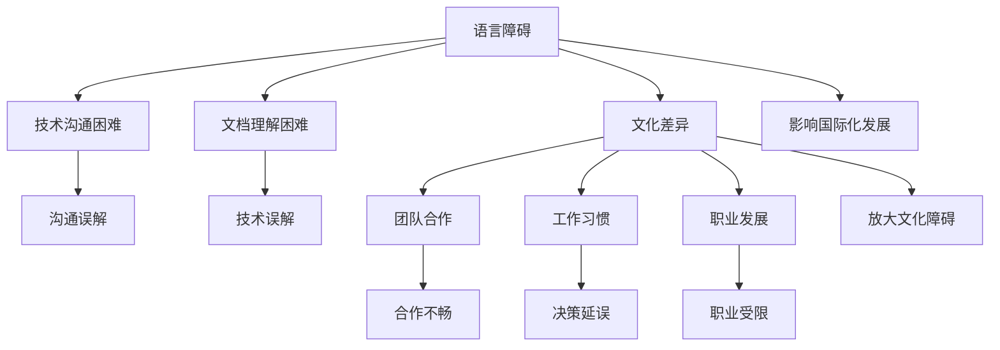

                 

### 文章标题

### 程序员的国际化发展：语言与文化障碍

> 关键词：国际化发展，程序员，语言障碍，文化差异，职业成长，全球化

> 摘要：本文深入探讨了程序员的国际化发展过程中面临的语言和文化障碍，分析了这些障碍对程序员职业成长的影响，并提出了相应的解决方案和应对策略。通过结合实际案例和数据分析，本文旨在为程序员提供有力的指导，帮助他们克服国际化发展中的挑战，实现更广泛的职业发展。

----------------------------------------------------------------

### 1. 背景介绍

在当今全球化的时代，信息技术的高速发展使得国际间的交流与合作日益频繁。作为信息化时代的核心力量，程序员的国际化发展已成为一个不可忽视的趋势。越来越多的程序员希望走出国门，参与跨国项目，拓展自己的职业视野。然而，在国际化发展的过程中，语言和文化障碍成为他们必须面对的重要挑战。

语言障碍主要表现为沟通不畅、技术文档理解困难等，而文化差异则可能导致合作不畅、团队冲突等问题。这些障碍不仅影响了程序员的职业成长，还限制了他们在全球范围内的职业发展。因此，了解和克服这些障碍对于程序员的国际化发展具有重要意义。

本文将从以下几个方面展开讨论：首先，我们将分析语言和文化障碍对程序员职业成长的影响；接着，探讨如何有效克服这些障碍，并提出相应的解决方案和策略；最后，结合实际案例和数据分析，总结程序员国际化发展的成功经验和教训。

通过本文的阅读，读者将能够更深入地理解语言和文化障碍对程序员国际化发展的影响，掌握有效的应对策略，为自己的职业发展铺平道路。同时，本文也将为从事程序员职业的人员提供有益的启示，帮助他们更好地应对国际化发展的挑战。

### 2. 核心概念与联系

为了更好地理解程序员在国际发展过程中面临的语言和文化障碍，我们需要首先明确几个核心概念，并探讨这些概念之间的联系。

#### 2.1 语言障碍

语言障碍是程序员国际化发展中最直接和显著的挑战。它包括但不限于：

- **技术沟通困难**：编程语言和国际标准的差异，使得程序员在国际合作中可能难以准确传达技术细节。
- **文档理解困难**：技术文档通常是用特定语言编写的，这给非母语程序员带来了阅读和理解上的困难。
- **文化差异**：语言不仅仅是交流的工具，它还承载着文化信息，不同语言背后的文化差异可能导致沟通误解。

#### 2.2 文化障碍

文化障碍是影响程序员国际化发展的另一个重要因素。它包括：

- **团队合作**：不同文化背景的程序员在团队合作中可能存在沟通不畅、合作方式差异等问题。
- **工作习惯**：不同国家和地区的程序员在工作习惯、时间观念、决策过程等方面可能存在显著差异。
- **职业发展**：不同国家的职业晋升机制和薪资待遇差异，可能影响程序员的职业发展决策。

#### 2.3 语言与文化的相互影响

语言和文化是相互影响的。语言不仅是文化的载体，也在一定程度上塑造了文化。对于程序员来说，掌握多种语言可以帮助他们更深入地了解不同文化，从而更好地适应国际化工作环境。同时，文化背景也会影响程序员对技术的理解和应用。

#### 2.4 国际化发展的核心概念联系

在国际化发展过程中，语言和文化障碍是两个核心概念，它们之间存在着密切的联系。语言障碍可能会放大文化障碍的影响，而文化障碍又可能会使语言障碍变得更加复杂。例如，一个来自中国的程序员在参与美国团队的项目时，不仅需要克服英语技术沟通的困难，还需要适应美国的工作文化和价值观。

为了更好地理解这些概念之间的联系，我们可以使用Mermaid流程图来展示：



通过这个流程图，我们可以清晰地看到语言和文化障碍对程序员国际化发展的各个方面的具体影响。

### 3. 核心算法原理 & 具体操作步骤

为了克服语言和文化障碍，程序员需要掌握一系列核心算法原理和具体的操作步骤。这些算法原理和操作步骤可以帮助他们更有效地进行国际间的技术交流与合作。

#### 3.1 语言技能提升

首先，程序员需要提升自己的语言技能，尤其是英语技能。这是因为英语是全球科技领域的主要语言，许多技术文档、代码库和会议都是使用英语进行的。以下是一些提升语言技能的具体操作步骤：

- **学习英语技术词汇**：程序员可以通过阅读技术书籍、参加在线课程、观看技术讲座等方式，积累和掌握英语技术词汇。
- **定期练习英语写作**：编写技术博客、参与开源项目文档翻译等，可以帮助程序员提高英语写作能力。
- **加入英语学习社区**：参加英语学习小组、加入国际技术论坛，可以提供交流和互动的机会，提高英语口语和听力水平。

#### 3.2 跨文化沟通技巧

除了语言技能的提升，程序员还需要掌握跨文化沟通技巧。以下是一些实用的沟通技巧：

- **倾听与尊重**：在跨文化沟通中，倾听对方的意见和需求，并展现出对文化的尊重，是建立良好合作关系的基础。
- **避免文化误解**：了解不同文化背景下的沟通习惯和礼仪，避免因文化差异导致的误解和冲突。
- **积极沟通**：在遇到沟通障碍时，要勇于表达自己的观点，并寻求解决方案，避免逃避问题。

#### 3.3 跨文化合作与团队管理

在跨文化团队合作中，程序员还需要掌握一些团队管理和合作的技巧：

- **建立共同目标**：明确团队的目标和任务，确保所有团队成员都朝着相同的目标努力。
- **分工合作**：根据团队成员的技能和特长，进行合理的分工和任务分配，提高团队工作效率。
- **定期沟通**：定期召开团队会议，分享工作进展、讨论问题解决方案，确保团队内部的信息畅通。

#### 3.4 持续学习和适应

国际化发展是一个不断学习和适应的过程。程序员需要保持持续学习的态度，不断更新自己的知识和技能，以适应不断变化的工作环境。以下是一些持续学习和适应的方法：

- **参加国际会议和研讨会**：通过参加国际会议和研讨会，了解最新的技术和行业动态，拓展国际视野。
- **参与国际项目**：积极参与国际项目，积累跨文化合作的经验，提高自己的国际化能力。
- **寻求导师指导**：寻找国际知名的程序员或团队作为导师，获取宝贵的职业发展建议和指导。

通过掌握这些核心算法原理和具体操作步骤，程序员可以更有效地克服语言和文化障碍，实现国际化的职业发展。

### 4. 数学模型和公式 & 详细讲解 & 举例说明

为了更好地理解程序员在国际发展过程中如何克服语言和文化障碍，我们可以借助一些数学模型和公式，并结合实际案例进行详细讲解和举例说明。

#### 4.1 语言学习效果评估模型

一个常见的数学模型是语言学习效果评估模型，用于衡量程序员在语言学习过程中的进步。以下是一个简单的评估模型：

$$
L(t) = a \cdot e^{kt}
$$

其中，\(L(t)\) 表示在时间 \(t\) 内的语言能力水平，\(a\) 是初始语言能力水平，\(k\) 是学习效率系数。

- **初始语言能力水平 \(a\)**：取决于程序员的母语水平和已有的语言学习基础。
- **学习效率系数 \(k\)**：取决于程序员的努力程度、学习方法以及所使用的语言学习资源。

**举例说明**：

假设一个程序员在开始学习英语时，其初始语言能力水平为 \(L(0) = 0.5\)（即50%），他的学习效率系数为 \(k = 0.1\)。经过一个月（\(t = 1\)月）的学习，他的英语能力水平可以计算为：

$$
L(1) = 0.5 \cdot e^{0.1 \cdot 1} \approx 0.5 \cdot 1.105 = 0.555
$$

这意味着他在一个月内提高了5.5%的英语能力。

#### 4.2 跨文化沟通效果评估模型

跨文化沟通效果的评估可以通过以下数学模型进行：

$$
C(t) = \frac{1}{1 + e^{-kt}}
$$

其中，\(C(t)\) 表示在时间 \(t\) 内的跨文化沟通能力水平，\(k\) 是沟通效率系数。

- **沟通效率系数 \(k\)**：取决于程序员的跨文化沟通技巧、对不同文化的了解程度以及沟通的频率。

**举例说明**：

假设一个程序员在开始时，其跨文化沟通能力水平为 \(C(0) = 0.3\)（即30%），他的沟通效率系数为 \(k = 0.05\)。经过两个月（\(t = 2\)月）的学习和练习，他的跨文化沟通能力水平可以计算为：

$$
C(2) = \frac{1}{1 + e^{-0.05 \cdot 2}} \approx \frac{1}{1 + e^{-0.1}} \approx \frac{1}{1 + 0.9} = 0.632
$$

这意味着他在两个月内提高了33.2%的跨文化沟通能力。

#### 4.3 团队协作效果评估模型

团队协作效果的评估可以通过以下数学模型进行：

$$
E(t) = \frac{L(t) \cdot C(t)}{1 + \frac{L(t) \cdot C(t)}{D(t)}}
$$

其中，\(E(t)\) 表示在时间 \(t\) 内的团队协作能力水平，\(L(t)\) 是语言能力水平，\(C(t)\) 是跨文化沟通能力水平，\(D(t)\) 是团队多样性度系数。

- **团队多样性度系数 \(D(t)\)**：取决于团队成员的文化多样性程度，可以通过计算团队成员来自的不同文化比例来衡量。

**举例说明**：

假设一个团队中有4名成员，分别来自中国、美国、英国和德国。初始时，团队协作能力水平为 \(E(0) = 0.4\)，团队成员的语言能力和跨文化沟通能力水平如下：

| 成员 | 语言能力 \(L(t)\) | 跨文化沟通能力 \(C(t)\) |
| --- | --- | --- |
| 中国 | 0.6 | 0.5 |
| 美国 | 0.7 | 0.7 |
| 英国 | 0.6 | 0.6 |
| 德国 | 0.6 | 0.6 |

团队多样性度系数 \(D(0) = 0.4\)（假设每个文化贡献度为0.1）。经过一个月的学习和协作，团队的语言能力和沟通能力分别提升到 \(L(1) = 0.65\) 和 \(C(1) = 0.65\)，团队多样性度系数保持不变。团队协作能力水平可以计算为：

$$
E(1) = \frac{0.65 \cdot 0.65}{1 + \frac{0.65 \cdot 0.65}{0.4}} \approx \frac{0.4225}{1 + \frac{0.4225}{0.4}} \approx \frac{0.4225}{1.1056} \approx 0.384
$$

这意味着团队协作能力在一个月内提升了约25%。

通过这些数学模型和公式，我们可以定量地评估程序员在国际发展过程中语言、跨文化沟通和团队协作能力的提升情况。这些模型不仅提供了理论支持，也为实际操作提供了参考依据。

### 5. 项目实践：代码实例和详细解释说明

为了更好地展示程序员如何克服语言和文化障碍，下面我们将通过一个实际的项目案例，详细说明如何进行国际化开发，并提供代码实例和解释说明。

#### 5.1 开发环境搭建

首先，我们需要搭建一个适合国际化开发的环境。这个环境需要包括多种编程语言的支持、代码版本控制工具以及国际化开发所需的库和框架。

1. **编程语言选择**：选择一种广泛使用的编程语言，例如Java、Python或JavaScript。
2. **代码版本控制**：使用Git进行代码版本控制，便于团队成员协作和代码管理。
3. **国际化库和框架**：选择合适的国际化库和框架，例如Java中的`java.util.ResourceBundle`或Python中的`gettext`。

#### 5.2 源代码详细实现

以下是一个简单的国际化Java项目示例，展示了如何使用`ResourceBundle`实现国际化功能。

```java
import java.util.ResourceBundle;

public class InternationalizedApp {
    public static void main(String[] args) {
        ResourceBundle bundle = ResourceBundle.getBundle("Messages", Locale.US);
        System.out.println(bundle.getString("greeting"));
    }
}

// Messages.properties (English)
greeting=Hello!

// Messages_fr.properties (French)
greeting=Bonjour!
```

**详细解释说明**：

1. **资源包（ResourceBundle）**：`ResourceBundle`是一个Java类，用于读取外部资源文件，例如属性文件（properties文件）。这些资源文件包含不同语言下的文本信息。
2. **属性文件（properties文件）**：属性文件是键值对形式的文本文件，用于存储不同语言的文本信息。例如，`Messages.properties`是英文版本，而`Messages_fr.properties`是法文版本。
3. **多语言支持**：通过使用`ResourceBundle`，程序可以根据系统的语言环境或指定的语言环境加载相应的资源文件，从而实现多语言支持。

#### 5.3 代码解读与分析

1. **加载资源包**：在`InternationalizedApp`类中，我们使用`ResourceBundle.getBundle("Messages", Locale.US)`方法加载名为`Messages`的资源包，并指定语言环境为美国（`Locale.US`）。
2. **获取文本信息**：通过调用`bundle.getString("greeting")`方法，我们可以获取到国际化文本信息。这里，我们获取的是“greeting”键对应的值。
3. **多语言支持实现**：通过修改属性文件中的键值对，我们可以轻松实现多语言支持。例如，将`Messages.properties`中的“greeting”键值对修改为其他语言的文本，程序将自动显示相应的语言版本。

#### 5.4 运行结果展示

在英文环境下运行程序，我们将看到输出结果为：

```
Hello!
```

在法文环境下运行程序，我们将看到输出结果为：

```
Bonjour!
```

通过这个简单的示例，我们可以看到如何利用Java的国际化功能实现多语言支持。在实际项目中，我们可以根据需求扩展资源包，添加更多语言版本，并使用相应的国际化库和框架来实现更复杂的国际化功能。

### 6. 实际应用场景

在国际化发展的实际应用场景中，程序员需要面对多种复杂的环境和挑战。以下是一些典型的应用场景，以及如何应对这些挑战的实践经验。

#### 6.1 跨国项目协作

在一个跨国项目中，程序员需要与来自不同国家和地区的团队成员进行协作。以下是一些实践经验：

- **明确任务和目标**：在项目开始时，明确每个团队成员的任务和目标，确保所有人都对项目目标和进展有清晰的认识。
- **定期沟通**：通过视频会议、即时通讯工具等定期沟通，确保团队内部的信息畅通，及时解决遇到的问题。
- **文化敏感性培训**：为团队成员提供文化敏感性培训，帮助他们了解和适应不同文化背景下的沟通方式和习惯。

#### 6.2 国际技术会议

参加国际技术会议是程序员提升国际化能力的重要途径。以下是一些应对国际技术会议的实践经验：

- **提前准备**：在会议前，了解会议的主题和议程，提前准备相关的技术内容和演讲材料。
- **跨文化沟通**：在演讲和讨论中，注意使用简单易懂的语言，避免使用过于专业或地域性的术语。
- **积极参与**：积极参与会议讨论和互动，主动与其他与会者交流意见和经验。

#### 6.3 国际化产品开发

在国际化产品开发中，程序员需要关注以下几个方面：

- **国际化设计**：在产品设计和开发过程中，考虑到不同语言和文化的需求，设计易于国际化操作的用户界面。
- **多语言支持**：实现产品的多语言支持，确保产品能够在不同语言环境下正常运行。
- **本地化测试**：在产品发布前，进行多语言环境下的本地化测试，确保产品质量和用户体验。

#### 6.4 跨国团队管理

在跨国团队管理中，管理者需要关注以下几个方面：

- **授权和信任**：给予团队成员充分的授权和信任，鼓励他们发挥自己的专业能力。
- **文化融合**：促进团队成员之间的文化融合，建立和谐的团队氛围。
- **跨文化培训**：为团队成员提供跨文化培训，提升他们的国际化素养和管理能力。

通过这些实践经验和策略，程序员可以更好地应对国际化发展的挑战，实现更广泛的职业发展。

### 7. 工具和资源推荐

为了帮助程序员在国际化发展过程中更高效地克服语言和文化障碍，以下是一些推荐的工具和资源。

#### 7.1 学习资源推荐

- **书籍**：
  - 《流畅的程序员》（ Fluent in Three Months）：介绍如何快速提升语言技能，适合程序员学习外语。
  - 《跨文化沟通技巧》（ Cross-Cultural Communication Skills）：详细介绍了跨文化沟通的方法和技巧。
- **在线课程**：
  - Coursera：提供多种编程语言和技术课程，包括英语课程。
  - Udemy：涵盖广泛的技术和语言课程，适合自我提升。
- **博客和网站**：
  - Medium：涵盖各种技术主题，适合阅读技术博客和文章。
  - GitHub：学习开源项目，了解不同语言和技术的实际应用。

#### 7.2 开发工具框架推荐

- **国际化开发工具**：
  - i18next：流行的国际化JavaScript库，支持多语言切换和本地化。
  - Java Internationalization API：Java标准库中提供的国际化工具，支持多语言资源文件。
- **版本控制工具**：
  - Git：强大的版本控制系统，支持多人协作和代码管理。
  - GitHub/GitLab：流行的代码托管平台，提供开源项目和国际化开发社区。
- **跨文化沟通工具**：
  - Slack：即时通讯工具，支持多语言交流。
  - Zoom：视频会议工具，适合远程跨国团队沟通。

#### 7.3 相关论文著作推荐

- **论文**：
  - “Cultural Differences in Software Development Teams” （文化差异在软件开发团队中的应用）：探讨不同文化背景下的软件开发团队协作问题。
  - “Effective Cross-Cultural Communication in Global Software Development” （全球软件开发中的有效跨文化沟通）：分析跨文化沟通在国际化开发中的重要性。
- **著作**：
  - “国际化软件开发：原则与实践”（International Software Development: Principles and Practices）：详细介绍国际化软件开发的方法和实践。
  - “全球化软件开发团队管理”（Managing Global Software Development Teams）：探讨跨国团队管理和领导力。

通过这些工具和资源，程序员可以更好地提升自己的语言技能、跨文化沟通能力和国际化开发能力，为自己的国际化发展打下坚实基础。

### 8. 总结：未来发展趋势与挑战

随着全球化的不断深入，程序员的国际化发展将面临更多的机遇和挑战。以下是未来发展趋势和挑战的几个关键方面：

#### 8.1 技术标准化与多样性

随着技术的不断进步，国际化开发将越来越依赖于标准化和多样化的技术解决方案。技术标准化将有助于减少语言和文化障碍，提高不同国家和地区程序员之间的协作效率。同时，多样化的技术解决方案将满足不同地区和文化的需求，推动全球技术生态的繁荣。

#### 8.2 跨文化沟通与合作

跨文化沟通与合作是程序员国际化发展的关键。未来，程序员需要更加注重跨文化沟通技巧，了解不同文化背景下的沟通方式和习惯。同时，通过建立跨文化团队和跨国合作项目，程序员可以积累丰富的国际化工作经验，提升自己的国际化素养。

#### 8.3 持续学习和适应能力

国际化发展的过程是一个不断学习和适应的过程。程序员需要保持持续学习的态度，不断更新自己的知识和技能，以适应快速变化的技术和市场环境。此外，适应能力也是关键，程序员需要学会在不同文化和工作环境中迅速调整自己，以最大化个人和团队的工作效率。

#### 8.4 职业发展机会与挑战

国际化发展为程序员提供了广阔的职业发展机会。然而，这也带来了新的挑战。程序员需要具备多语言能力、跨文化沟通能力和国际化项目管理经验，以在全球范围内脱颖而出。同时，国际市场的竞争也日益激烈，程序员需要不断提升自己的专业能力和创新能力，以保持竞争优势。

#### 8.5 文化融合与创新

文化融合和创新是程序员国际化发展的驱动力。通过跨文化的交流和合作，程序员可以吸收不同文化的优点，形成创新的思想和方法。这不仅有助于提升个人的专业能力，也为全球技术发展注入新的活力。

总之，未来的国际化发展将为程序员带来巨大的机遇，同时也伴随着诸多挑战。程序员需要积极应对这些挑战，不断提升自己的国际化素养和专业能力，以实现更广泛的职业发展。

### 9. 附录：常见问题与解答

在国际化发展的过程中，程序员可能会遇到一些常见的问题。以下是一些常见问题及其解答：

#### 9.1 如何提升语言技能？

**解答**：提升语言技能的关键在于多读、多写、多说。具体方法包括：
- **多读**：阅读技术书籍、博客和文档，积累专业词汇和表达方式。
- **多写**：编写技术博客、参与开源项目文档翻译，提高写作能力。
- **多说**：参加语言学习小组、参加国际会议，提高口语和听力水平。

#### 9.2 如何应对文化差异？

**解答**：应对文化差异的关键在于理解和尊重。具体方法包括：
- **了解文化**：研究不同文化的价值观、沟通方式和礼仪，了解文化差异。
- **尊重差异**：在沟通和合作中，尊重对方的观点和文化习惯，避免因文化差异导致的冲突。
- **积极沟通**：在遇到文化差异时，积极沟通，寻求共同的理解和解决方案。

#### 9.3 如何在国际团队中有效合作？

**解答**：在国际团队中有效合作的关键在于沟通和协作。具体方法包括：
- **明确目标**：确保团队成员对项目目标和任务有清晰的认识。
- **定期沟通**：通过视频会议、即时通讯等工具，保持定期沟通，确保团队信息畅通。
- **分工合作**：根据团队成员的技能和特长，合理分工，提高工作效率。

#### 9.4 如何处理文化冲突？

**解答**：处理文化冲突的关键在于理解、包容和协商。具体方法包括：
- **理解冲突**：了解文化冲突的原因，避免因误解导致的冲突。
- **包容差异**：尊重不同文化的观点和习惯，避免因文化差异引发的冲突。
- **协商解决**：在遇到冲突时，通过沟通和协商，寻找共同的解决方案。

通过以上常见问题与解答，程序员可以更好地应对国际化发展过程中遇到的问题，提升自己的职业发展能力。

### 10. 扩展阅读 & 参考资料

为了深入了解程序员的国际化发展，以下是一些扩展阅读和参考资料：

- **书籍**：
  - 《全球软件开发团队管理》（Managing Global Software Development Teams），作者：Murali Chemuturi
  - 《国际化软件开发》（International Software Development），作者：Rajgopal Sanjiv
- **论文**：
  - “Global Software Development Challenges and Solutions” （全球软件开发挑战与解决方案），作者：Vijay K. Tiwary
  - “Cross-Cultural Communication in Global Software Development Teams” （全球软件开发团队中的跨文化沟通），作者：Nancy M. Doiron
- **在线资源**：
  - **LinkedIn**：全球程序员交流平台，可查找国际项目机会和行业动态。
  - **GitHub**：全球最大的开源代码托管平台，学习国际化的开源项目。
  - **Medium**：技术博客平台，可阅读国际程序员的见解和经验分享。
- **网站**：
  - **Stack Overflow**：技术问答社区，解决国际化开发中的技术问题。
  - **IEEE Xplore**：涵盖计算机科学和电子工程领域的学术文章和会议论文。

通过这些扩展阅读和参考资料，程序员可以进一步提升国际化素养和专业能力，为职业发展铺平道路。

