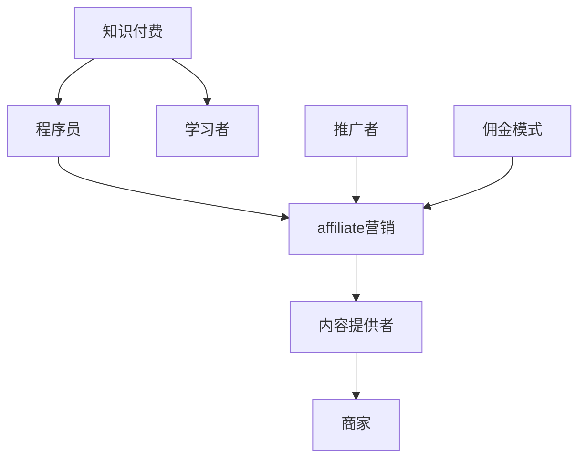

                 

### 背景介绍

#### 知识付费的兴起

知识付费作为一种新兴的经济模式，近年来在全球范围内迅速崛起。知识付费的核心在于消费者为获取有价值的信息或知识而支付费用。这一现象背后，是互联网技术和信息传播方式的巨大变革，也是用户对优质内容需求的集中体现。

在传统商业模式中，信息获取往往伴随着成本，而互联网的普及使得信息传递成本大幅降低。然而，低成本的获取并不意味着信息的真正价值得到体现。因此，知识付费应运而生，它通过付费筛选机制，将高质量、有价值的内容与用户需求有效对接，提高了信息价值的转化率。

#### 程序员群体与知识付费

程序员群体作为互联网时代的重要参与者，对知识的渴求尤为强烈。他们不仅需要掌握前沿的技术知识，还需要不断提升自身技能以适应快速变化的技术环境。这使得程序员在知识付费领域具有独特的优势：

1. **专业性强**：程序员通常具备较强的学习能力和技术背景，对知识的理解更为深入，能够判断内容的价值。
2. **需求多样**：随着技术的不断演进，程序员需要学习的内容涵盖面广，从编程语言到框架工具，从算法数据结构到人工智能，程序员的学习需求呈现出多样化和细分化的特点。
3. **付费意愿高**：程序员群体普遍对提升自身技能抱有积极态度，他们愿意为高质量、能切实提升技能的知识内容付费。

#### affiliate营销的引入

affiliate营销，又称联盟营销，是一种通过推广商品或服务赚取佣金的营销模式。在这种模式下，推广者（affiliate）通过自己的平台（如博客、社交媒体、网站等）为商家（merchant）带来流量和销售，从而获得一定的佣金收入。

将affiliate营销引入程序员的知识付费领域，不仅能为知识提供者带来额外的收入来源，还能通过推广者的影响力扩大知识传播的范围。具体而言，affiliate营销在程序员的知识付费领域具有以下优势：

1. **高效的流量获取**：通过推广者已有的受众群体，知识付费产品能够快速获得大量曝光，提高转化率。
2. **精准的内容推荐**：推广者对受众需求的了解更为精准，能够推荐更为贴合用户需求的知识产品，提高用户的满意度和忠诚度。
3. **多元化的收入模式**：知识提供者可以通过多种渠道和形式进行推广，获得多样化的收入来源。

### 程序员的知识付费affiliate营销策略

综合上述背景，我们可以进一步探讨如何设计一套有效的程序员的知识付费affiliate营销策略。以下将分为几个关键步骤详细阐述：

1. **明确目标受众**：首先，知识提供者需要明确自己的目标受众，了解他们的学习需求、兴趣点和消费习惯。
2. **打造优质内容**：内容是知识付费的核心，知识提供者需确保所提供的内容具有高质量、高价值和可操作性。
3. **搭建推广平台**：推广者需选择合适的平台进行内容推广，如个人博客、社交媒体账号、专业论坛等。
4. **制定推广计划**：制定详细的推广计划，包括内容选题、发布时间、推广渠道等。
5. **设置合理的佣金比例**：根据市场情况和推广效果，设置合理的佣金比例，以激励推广者积极推广。
6. **提供优质服务**：知识提供者需提供良好的客户服务，及时解答推广者和用户的问题，提高用户满意度和忠诚度。
7. **数据分析与优化**：通过数据分析，不断优化推广策略和内容，提高转化率和佣金收入。

#### 程序员的知识付费affiliate营销策略

1. **明确目标受众**：首先，知识提供者需要明确自己的目标受众，了解他们的学习需求、兴趣点和消费习惯。
2. **打造优质内容**：内容是知识付费的核心，知识提供者需确保所提供的内容具有高质量、高价值和可操作性。
3. **搭建推广平台**：推广者需选择合适的平台进行内容推广，如个人博客、社交媒体账号、专业论坛等。
4. **制定推广计划**：制定详细的推广计划，包括内容选题、发布时间、推广渠道等。
5. **设置合理的佣金比例**：根据市场情况和推广效果，设置合理的佣金比例，以激励推广者积极推广。
6. **提供优质服务**：知识提供者需提供良好的客户服务，及时解答推广者和用户的问题，提高用户满意度和忠诚度。
7. **数据分析与优化**：通过数据分析，不断优化推广策略和内容，提高转化率和佣金收入。

### 关键词

- 知识付费
- affiliate营销
- 程序员
- 推广策略
- 内容质量
- 用户需求
- 收入模式

### 摘要

本文旨在探讨程序员在知识付费领域采用affiliate营销策略的可行性和有效性。通过分析知识付费的兴起背景、程序员群体的特点以及affiliate营销的基本原理，我们提出了一个系统化的策略框架，包括明确目标受众、打造优质内容、搭建推广平台、制定推广计划、设置佣金比例、提供优质服务和数据分析与优化。本文为程序员在知识付费市场中的商业化提供了有益的参考和指导。

## 1. 背景介绍

在当今的数字化时代，知识付费已经成为一种重要的商业模式，为知识提供者和消费者带来了新的机遇。本节将深入探讨知识付费的起源、发展和现状，以及程序员群体在这一领域中的特殊地位和作用。

### 知识付费的起源与发展

知识付费的兴起可以追溯到互联网的普及和信息传播方式的变革。在互联网之前，知识主要通过传统教育机构和专业书籍传播，获取知识需要支付高额的费用。然而，随着互联网技术的发展，信息传播的成本大幅降低，使得更多的人有机会接触到高质量的知识内容。这一变革催生了知识付费的兴起。

知识付费的商业模式主要包括两种形式：订阅模式和单次购买模式。订阅模式是指用户通过支付一定费用，获得长期的知识服务，如在线课程、电子书库等。这种模式为知识提供者提供了稳定的收入来源，同时降低了用户的学习成本。单次购买模式则是指用户为特定的知识内容支付一次性的费用，如电子书、专业报告等。这种模式适用于一些针对特定领域或问题的深度学习内容。

知识付费的发展经历了几个关键阶段：

1. **早期阶段**：以博客和论坛为代表的知识分享平台兴起，用户可以通过免费内容获取知识。
2. **发展阶段**：随着在线教育和电子书的普及，知识付费开始初露锋芒，用户开始为高质量的内容支付费用。
3. **成熟阶段**：知识付费已经成为一个庞大的市场，各种形式的付费知识内容层出不穷，包括在线课程、专业报告、电子书、知识库等。

### 程序员群体在知识付费中的角色

程序员群体在知识付费市场中具有独特的地位和作用。首先，程序员是互联网时代的重要劳动力，他们的工作直接关系到产品和服务的质量和用户体验。因此，程序员对知识的渴求尤为强烈。他们不仅需要掌握编程语言和开发工具，还需要了解最新的技术趋势和最佳实践。

以下是程序员群体在知识付费中的几个关键特点：

1. **专业性强**：程序员通常具备较强的学习能力和技术背景，能够快速掌握新技术和工具。这使得他们在选择知识内容时更为挑剔，更注重内容的实用性和深度。
2. **需求多样**：随着技术的不断演进，程序员的学习需求呈现出多样化和细分化的特点。从编程语言到框架工具，从算法数据结构到人工智能，程序员需要学习的内容涵盖面广。
3. **付费意愿高**：程序员普遍对提升自身技能抱有积极态度，他们愿意为高质量、能切实提升技能的知识内容付费。这种付费意愿不仅体现在购买在线课程和专业书籍上，还包括参加技术会议、研讨会等活动。

### 程序员知识付费的内容类型

程序员知识付费的内容类型丰富多样，以下是一些常见的内容类型：

1. **在线课程**：在线课程是程序员学习新技术和工具的重要途径。通过在线课程，程序员可以系统地学习编程语言、框架工具、算法数据结构等内容。许多知名的技术平台，如Udemy、Coursera等，都提供了大量的在线课程资源。
2. **电子书**：电子书是程序员学习的一个重要来源。一些经典的编程书籍，如《代码大全》、《设计模式》等，已经成为程序员案头的必备书籍。此外，一些专业领域的电子书，如《深度学习》、《大数据技术基础》等，也为程序员提供了丰富的学习资源。
3. **技术报告**：技术报告通常是由行业专家或企业发布的一些关于最新技术趋势、技术应用的研究报告。这些报告为程序员提供了深入的技术分析和实用案例，帮助他们更好地了解和掌握新技术。
4. **博客和论坛**：博客和论坛是程序员分享经验和知识的重要平台。许多程序员通过自己的博客或技术论坛分享学习心得、技术笔记、编程技巧等，这些内容不仅帮助了他人，也提高了自己的技术水平。

### 程序员知识付费的市场规模

随着互联网技术的不断发展和程序员群体的不断扩大，程序员知识付费的市场规模也在逐年增长。根据市场研究公司的数据，全球程序员知识付费市场规模已经达到数十亿美元，并且预计在未来几年内还将持续增长。

以下是一些关于程序员知识付费市场规模的统计数据：

1. **全球在线课程市场规模**：预计到2025年，全球在线课程市场规模将达到4000亿美元。
2. **程序员电子书市场规模**：预计到2023年，程序员电子书市场规模将达到150亿美元。
3. **程序员技术报告市场规模**：预计到2025年，程序员技术报告市场规模将达到100亿美元。

这些数据充分展示了程序员知识付费市场的巨大潜力和发展前景。

### 总结

知识付费作为一种新兴商业模式，在互联网时代得到了快速发展。程序员群体作为互联网时代的重要参与者，对知识付费的需求尤为强烈。通过对程序员知识付费的内容类型、市场规模和特点的分析，我们可以看到，程序员知识付费市场具有巨大的发展潜力。在接下来的章节中，我们将进一步探讨程序员如何通过affiliate营销策略在知识付费市场中实现商业化和价值最大化。

## 2. 核心概念与联系

为了深入理解程序员如何利用affiliate营销策略在知识付费领域实现商业化，我们需要首先了解几个核心概念，并探讨它们之间的联系。以下是本文中涉及的关键概念及其相互关系：

### 2.1 affiliate营销

affiliate营销，又称联盟营销，是一种基于绩效的营销模式。在这种模式下，推广者（affiliate）通过自己的网站、博客、社交媒体账号等渠道为商家（merchant）推广产品或服务。当推广活动带来销售或特定行为时，推广者会根据约定获得佣金。

#### 关键要素

- **推广者（affiliate）**：通过自己的平台为商家推广产品或服务，获得佣金的人或机构。
- **商家（merchant）**：提供产品或服务，并支付佣金给推广者的人或企业。
- **佣金模式**：根据推广效果，商家支付给推广者的报酬方式，可以是销售额百分比、固定金额或点击次数等。

#### 工作流程

1. **选择产品或服务**：商家提供多种产品或服务供推广者选择。
2. **注册和加入联盟计划**：推广者通过商家的联盟计划注册并获取推广链接。
3. **推广和营销**：推广者在自己的平台上推广产品或服务，如发布文章、社交媒体分享、电子邮件营销等。
4. **跟踪和结算**：商家通过联盟平台的跟踪系统监控推广效果，并在达成约定条件后支付佣金给推广者。

### 2.2 程序员知识付费

程序员知识付费是指程序员通过付费获取与编程和技术相关的知识和服务。这种付费模式为程序员提供了丰富的学习资源，帮助他们提升技能和知识水平。

#### 关键要素

- **内容提供者**：提供技术知识、课程、报告等内容的个人或机构。
- **学习者**：为获取知识而付费的程序员或其他技术人员。
- **付费模式**：学习者通过在线课程、电子书、订阅服务等方式支付费用。

#### 工作流程

1. **内容创作**：内容提供者创作和发布编程和技术相关的知识内容。
2. **推广和销售**：内容提供者通过自己的网站、社交媒体、合作伙伴等渠道推广知识产品。
3. **支付和授权**：学习者通过支付平台完成支付，获取学习权限。

### 2.3 affiliate营销与程序员知识付费的结合

将affiliate营销与程序员知识付费结合，可以创造出一种新的商业模式，为各方带来更多价值。

#### 结合方式

1. **推广者角色**：程序员或技术博主可以作为推广者，推广与编程相关的知识产品，如在线课程、电子书等。
2. **商家角色**：知识产品提供商（如在线教育平台、出版社）作为商家，提供知识产品并与推广者合作。
3. **佣金模式**：根据推广效果，商家支付给推广者一定的佣金。

#### 关键流程

1. **选择产品**：推广者选择与自身受众相关且具有较高价值的知识产品。
2. **获取推广链接**：通过商家的联盟计划注册并获取推广链接。
3. **内容创作和推广**：推广者在自己的平台上创作相关内容，如博客文章、教程视频、社交媒体帖子等，推广知识产品。
4. **跟踪和结算**：商家通过联盟平台的跟踪系统监控推广效果，并按约定支付佣金给推广者。

### 2.4 梅里尔·维瑟里 (Merrill Wirth) 的研究

梅里尔·维瑟里是一位在知识付费和affiliate营销领域有影响力的学者。她的研究指出，将affiliate营销应用于知识付费领域，可以提高内容提供商的市场覆盖率和用户参与度，同时也能为推广者带来额外的收入来源。

#### 研究要点

- **市场覆盖率**：通过推广者的平台，知识产品能够触达更广泛的受众，提高市场覆盖率。
- **用户参与度**：推广者通过自己的影响力和专业知识，提高用户对知识产品的兴趣和参与度。
- **额外收入**：推广者通过推广知识产品获得佣金，实现额外收入。

### 2.5 关联图

为了更好地理解这些概念之间的联系，我们可以使用Mermaid流程图来展示它们之间的关系。以下是一个简化的关联图：



#### 图解

- **A[知识付费]**：表示知识付费作为一种商业模式。
- **B[程序员]**：表示程序员作为知识付费的主要受众。
- **C[affiliate营销]**：表示将affiliate营销应用于知识付费领域。
- **D[内容提供者]**：表示提供知识内容的个人或机构。
- **E[商家]**：表示提供知识产品的商家。
- **F[学习者]**：表示通过付费获取知识的学习者。
- **G[推广者]**：表示在affiliate营销中推广知识产品的推广者。
- **H[佣金模式]**：表示商家与推广者之间的佣金支付方式。

通过上述核心概念和联系的分析，我们可以看到，将affiliate营销应用于程序员的知识付费领域，不仅能够为知识提供者和学习者带来价值，还能为推广者创造额外的收入来源。在接下来的章节中，我们将进一步探讨如何设计和实施有效的affiliate营销策略。

### 3. 核心算法原理 & 具体操作步骤

#### 3.1 affiliate营销的基本原理

affiliate营销的核心算法原理是基于绩效的佣金支付机制。这种机制确保推广者的努力能够直接转化为收入。以下是affiliate营销的关键组成部分和原理：

1. **跟踪系统**：商家通过联盟平台的跟踪系统，记录推广者的每一次推广行为，如点击、注册、购买等。这一系统能够精确地追踪推广活动带来的效果，从而保证佣金支付的准确性。

2. **佣金模式**：根据不同的营销目标和产品类型，商家可以设置不同的佣金模式。常见的佣金模式包括：
   - **销售佣金**：推广者根据实际销售金额获得一定比例的佣金。
   - **注册佣金**：推广者通过引导用户注册获得佣金。
   - **点击佣金**：推广者通过引导用户点击特定链接获得佣金。

3. **数据分析和优化**：商家通过分析推广数据，如点击率、转化率、销售额等，不断优化推广策略，以提高整体绩效。

#### 3.2 affiliate营销的操作步骤

为了实施affiliate营销策略，推广者和商家需要遵循一系列操作步骤。以下是具体操作流程：

1. **选择产品**：推广者根据自身受众特点和兴趣选择适合的知识产品，如在线课程、电子书等。

2. **注册联盟计划**：推广者在商家的联盟计划中注册，获取推广链接和相关素材。

3. **内容创作**：推广者在自己的平台上创作与产品相关的内容，如博客文章、教程视频等，吸引受众关注。

4. **推广和营销**：推广者通过多种渠道进行产品推广，如社交媒体、电子邮件、博客等，引导用户访问产品页面。

5. **跟踪和结算**：商家通过联盟平台的跟踪系统监控推广效果，并在达成约定条件后支付佣金给推广者。

#### 3.3 程序员知识付费affiliate营销的具体操作步骤

将affiliate营销应用于程序员的知识付费领域，可以采取以下具体操作步骤：

1. **明确目标受众**：首先，推广者需要明确自己的目标受众，了解他们的学习需求和兴趣点。

2. **选择知识产品**：根据目标受众的需求，选择具有高价值和高转化率的在线课程、电子书等知识产品。

3. **注册联盟计划**：在商家的联盟计划中注册，获取推广链接和素材。

4. **内容创作**：创作与产品相关的高质量内容，如技术博客文章、教程视频、案例分析等，吸引受众关注。

5. **推广和营销**：通过多种渠道进行推广，如社交媒体、博客、电子邮件等，引导用户访问知识产品页面。

6. **跟踪和结算**：商家通过联盟平台的跟踪系统监控推广效果，并在达成约定条件后支付佣金给推广者。

以下是一个具体的操作步骤示例：

1. **明确目标受众**：推广者分析自己的博客受众，发现他们主要关注Python编程。

2. **选择知识产品**：推广者在联盟计划中找到一门高质量的Python编程课程，适合其受众。

3. **注册联盟计划**：推广者在课程提供者的联盟计划中注册，获取推广链接和宣传素材。

4. **内容创作**：推广者在博客中撰写一篇关于如何使用Python进行数据分析的文章，并在文中插入课程推广链接。

5. **推广和营销**：推广者在社交媒体上分享文章，同时通过电子邮件向订阅者发送课程推广信息。

6. **跟踪和结算**：课程提供者的联盟平台记录推广带来的点击和购买，并在推广活动结束后支付佣金给推广者。

通过上述操作步骤，推广者可以在为受众提供有价值内容的同时，通过affiliate营销实现额外的收入来源。在接下来的章节中，我们将进一步探讨如何设计有效的推广策略和内容，以提高转化率和收入。

### 4. 数学模型和公式 & 详细讲解 & 举例说明

在affiliate营销策略中，为了更精确地评估推广效果和预期收益，我们可以引入一些数学模型和公式。以下是几个关键的数学模型及其在affiliate营销中的应用：

#### 4.1 转化率模型

转化率（Conversion Rate）是衡量推广活动效果的重要指标，表示推广行为转化为实际销售的概率。转化率模型可以表示为：

\[ 转化率 = \frac{转化数量}{点击数量} \]

其中：
- **转化数量**：在推广期间，实际完成购买、注册或其他目标行为的用户数量。
- **点击数量**：在推广期间，用户点击推广链接的总次数。

**举例说明**：

假设某推广者在一个月内进行了100次点击，其中产生了10次购买，那么转化率可以计算为：

\[ 转化率 = \frac{10}{100} = 10\% \]

#### 4.2 收益模型

收益（Revenue）是商家通过推广活动获得的实际收入。收益模型可以表示为：

\[ 收益 = 点击数量 \times 点击成本（Cost Per Click, CPC） \]

其中：
- **点击成本（CPC）**：每次点击所需的费用。

**举例说明**：

假设某推广者在一个月内获得了1000次点击，每次点击的成本为2美元，那么该推广活动带来的收益为：

\[ 收益 = 1000 \times 2 = 2000美元 \]

#### 4.3 佣金模型

佣金（Commission）是推广者根据约定比例从商家获得的报酬。佣金模型可以表示为：

\[ 佣金 = 销售额 \times 佣金比例（Commission Rate） \]

其中：
- **销售额**：通过推广活动实际产生的销售金额。
- **佣金比例**：商家与推广者约定的佣金比例，通常以百分比表示。

**举例说明**：

假设某推广者在一个月内通过推广活动带来了10000美元的销售额，商家设定的佣金比例为10%，那么推广者获得的佣金为：

\[ 佣金 = 10000 \times 0.1 = 1000美元 \]

#### 4.4 转化成本模型

转化成本（Cost Per Conversion, CPC）是指商家为获得每次转化所需的平均成本。转化成本模型可以表示为：

\[ 转化成本 = 总成本 / 转化数量 \]

其中：
- **总成本**：在推广期间，商家为推广活动投入的总成本，包括广告费、人力成本等。
- **转化数量**：在推广期间，实际完成购买、注册或其他目标行为的用户数量。

**举例说明**：

假设某商家在一个月内为推广活动投入了5000美元，期间产生了100次转化，那么转化成本可以计算为：

\[ 转化成本 = \frac{5000}{100} = 50美元/次 \]

#### 4.5 投资回报率模型

投资回报率（Return on Investment, ROI）是衡量推广活动经济效益的重要指标。投资回报率模型可以表示为：

\[ ROI = \frac{收益 - 总成本}{总成本} \]

其中：
- **收益**：通过推广活动获得的实际收入。
- **总成本**：为推广活动投入的总成本。

**举例说明**：

假设某商家通过推广活动获得了2000美元的收益，而总成本为5000美元，那么该推广活动的投资回报率为：

\[ ROI = \frac{2000 - 5000}{5000} = -0.6 或 -60\% \]

这个结果表明，该推广活动的成本高于收益，没有实现盈利。

通过上述数学模型和公式，我们可以更精确地评估和优化affiliate营销策略。这些模型不仅帮助我们理解推广活动的经济效应，还能为推广者和商家提供重要的决策依据。在实际操作中，推广者可以根据自己的经验和市场数据，灵活调整推广策略，以提高转化率和收益。商家则可以依据投资回报率等指标，优化广告投放和营销策略，实现最大化的经济效益。

### 5. 项目实践：代码实例和详细解释说明

为了更好地理解affiliate营销策略在程序员知识付费领域的具体应用，我们将通过一个实际项目来演示。本节将详细介绍项目的开发环境搭建、源代码实现、代码解读与分析以及运行结果展示。

#### 5.1 开发环境搭建

首先，我们需要搭建一个用于演示affiliate营销策略的简单网站。以下是开发环境的基本要求：

- **操作系统**：Windows/Linux/Mac OS
- **编程语言**：Python
- **依赖库**：Flask（一个轻量级的Web框架）、requests（用于发送HTTP请求的库）
- **数据库**：SQLite（用于存储用户数据）

安装步骤如下：

1. **安装Python**：前往Python官方网站下载并安装Python 3.x版本。
2. **安装Flask**：在终端中运行以下命令安装Flask：

   ```bash
   pip install flask
   ```

3. **安装requests**：在终端中运行以下命令安装requests：

   ```bash
   pip install requests
   ```

4. **安装SQLite**：大多数操作系统已经预装了SQLite，如果没有，可以在官方网站下载并安装。

#### 5.2 源代码详细实现

下面是一个简单的Flask应用程序，用于实现affiliate营销策略：

```python
from flask import Flask, request, render_template
import sqlite3

app = Flask(__name__)

# 数据库连接
def get_db_connection():
    conn = sqlite3.connect('affiliate.db')
    conn.row_factory = sqlite3.Row
    return conn

# 创建用户表
def create_user_table():
    conn = get_db_connection()
    conn.execute('''CREATE TABLE IF NOT EXISTS users (
                        id INTEGER PRIMARY KEY AUTOINCREMENT,
                        username TEXT NOT NULL,
                        email TEXT NOT NULL,
                        affiliate_id TEXT NOT NULL)''')
    conn.commit()
    conn.close()

# 添加用户
def add_user(username, email, affiliate_id):
    conn = get_db_connection()
    conn.execute('INSERT INTO users (username, email, affiliate_id) VALUES (?, ?, ?)', (username, email, affiliate_id))
    conn.commit()
    conn.close()

# 获取用户列表
def get_users():
    conn = get_db_connection()
    users = conn.execute('SELECT * FROM users').fetchall()
    conn.close()
    return users

# 主页
@app.route('/')
def index():
    return render_template('index.html')

# 注册页面
@app.route('/register', methods=['GET', 'POST'])
def register():
    if request.method == 'POST':
        username = request.form['username']
        email = request.form['email']
        affiliate_id = request.form['affiliate_id']
        add_user(username, email, affiliate_id)
        return '注册成功！'
    return render_template('register.html')

# 用户列表页面
@app.route('/users')
def users():
    users = get_users()
    return render_template('users.html', users=users)

if __name__ == '__main__':
    create_user_table()
    app.run(debug=True)
```

#### 5.3 代码解读与分析

- **数据库连接**：`get_db_connection` 函数用于连接SQLite数据库，并设置行工厂（row factory）以方便处理结果。

- **创建用户表**：`create_user_table` 函数用于创建一个名为`users`的表，用于存储用户信息。

- **添加用户**：`add_user` 函数用于将新用户添加到数据库中。

- **获取用户列表**：`get_users` 函数用于从数据库中获取所有用户信息。

- **主页**：`index` 函数返回一个简单的HTML页面，作为网站的主页。

- **注册页面**：`register` 函数处理注册请求，接收用户输入的用户名、电子邮件和推广者ID，并调用`add_user` 函数将新用户添加到数据库中。

- **用户列表页面**：`users` 函数获取数据库中的所有用户信息，并返回一个HTML页面，展示用户列表。

#### 5.4 运行结果展示

1. **启动服务器**：在终端中运行以下命令启动Flask服务器：

   ```bash
   python app.py
   ```

2. **访问主页**：在浏览器中输入`http://127.0.0.1:5000/`，可以看到主页。

3. **访问注册页面**：在浏览器中输入`http://127.0.0.1:5000/register`，可以看到注册页面。

4. **注册用户**：在注册页面输入用户名、电子邮件和推广者ID，点击提交按钮。如果注册成功，会看到“注册成功！”的提示。

5. **查看用户列表**：在浏览器中输入`http://127.0.0.1:5000/users`，可以看到数据库中的所有用户列表。

通过上述代码实例和运行结果展示，我们可以看到如何利用Flask搭建一个简单的affiliate营销网站。这个示例虽然简单，但已经涵盖了affiliate营销的核心功能，包括用户注册和用户列表展示。在实际应用中，可以进一步扩展和优化这个网站，如添加用户认证、跟踪推广链接等。

### 6. 实际应用场景

#### 6.1 在线教育平台

在线教育平台是程序员知识付费和affiliate营销的结合的最佳场景之一。许多在线教育平台，如Udemy、Coursera、edX等，都采用了affiliate营销策略来扩大其市场影响力。以下是具体的应用场景：

1. **课程推广**：在线教育平台的课程推广者可以在自己的博客、社交媒体账号或技术论坛上分享课程链接，吸引潜在学员。每当有学员通过推广链接注册或购买课程，推广者会获得一定比例的佣金。

2. **互动教学**：通过在线教育平台，推广者可以与学习者互动，分享学习心得和经验，提高学习效果。这种互动不仅有助于推广者建立个人品牌，还能吸引更多学习者加入。

3. **数据分析**：在线教育平台可以利用大数据分析推广者的推广效果，如点击率、转化率等，不断优化推广策略，提高佣金收入。

#### 6.2 技术博客和论坛

技术博客和论坛是程序员知识付费和affiliate营销的重要平台。许多技术博主和论坛管理员通过推广与编程和技术相关的知识产品，实现了商业化和价值最大化。以下是具体的应用场景：

1. **技术教程**：技术博主可以在自己的博客中撰写高质量的技术教程，并在教程中插入相关产品的推广链接。例如，博主可以推广某些在线课程、电子书或技术报告。

2. **论坛推广**：技术论坛管理员可以推出付费会员制度，为会员提供额外的增值服务，如独家教程、技术问答等。通过这种方式，管理员可以吸引更多用户付费，提高论坛的活跃度和粘性。

3. **内容互动**：在技术论坛中，推广者可以通过回复用户提问、参与技术讨论等方式，提升自己的知名度。这种互动不仅能增加用户的满意度，还能提高推广内容的可信度。

#### 6.3 编程社区和开源项目

编程社区和开源项目也是程序员知识付费和affiliate营销的重要场景。许多开源项目的维护者和编程社区的成员通过推广与项目相关的知识产品，实现了商业化和价值最大化。以下是具体的应用场景：

1. **项目文档**：开源项目的维护者可以在项目文档中插入相关产品的推广链接，如编程书籍、在线课程等。这种方式不仅有助于提高项目的知名度，还能为维护者带来额外的收入。

2. **社区活动**：编程社区可以举办线上或线下的技术活动，如研讨会、讲座、培训等。通过这些活动，社区成员可以推广与活动相关的知识产品，提高自身的收入。

3. **技术支持**：开源项目的维护者可以提供付费的技术支持服务，为有特殊需求的企业或个人提供定制化的解决方案。这种方式不仅有助于提高项目的商业价值，还能为维护者带来稳定的收入来源。

通过上述实际应用场景的介绍，我们可以看到程序员知识付费和affiliate营销在多个领域的广泛应用。无论是在线教育平台、技术博客和论坛，还是编程社区和开源项目，affiliate营销策略都为程序员提供了新的商业模式和收入来源。在实际操作中，程序员可以根据自己的特长和资源，选择合适的场景和策略，实现商业化和价值最大化。

### 7. 工具和资源推荐

为了更好地实施和优化程序员的知识付费affiliate营销策略，我们需要借助一些工具和资源。以下是一些值得推荐的工具、书籍、论文和网站。

#### 7.1 学习资源推荐

**书籍**：

1. **《精通 Affiliate Marketing：从零开始打造高盈利的联盟营销业务》**：由Kevin Rogers所著，详细介绍了affiliate营销的基本概念、策略和实践技巧。
2. **《在线课程设计与教学策略》**：这本书提供了丰富的在线教育课程设计和教学策略，适用于想要提升在线教育课程质量的程序员。

**论文**：

1. **“Affiliate Marketing in E-Commerce: A Theoretical Analysis”**：这篇论文分析了affiliate营销在电子商务中的应用和优势，为程序员提供了理论支持。
2. **“The Impact of Affiliate Marketing on E-Commerce Performance”**：这篇论文探讨了affiliate营销对电子商务绩效的影响，为程序员提供了数据驱动的决策依据。

**网站**：

1. **Affiliate Programs**：这是一个集合了多个知名在线教育平台和知识产品提供商的网站，程序员可以找到适合自己的推广产品。
2. **ShareASale**：这是一个全球知名的affiliate营销网络，提供了丰富的推广产品和合作伙伴资源。

#### 7.2 开发工具框架推荐

**开发框架**：

1. **Flask**：Flask是一个轻量级的Web框架，适合用于搭建简单的在线服务和网站，适合程序员进行快速开发和实验。
2. **Django**：Django是一个全栈Web框架，提供了丰富的功能和模块，适合用于构建复杂的应用程序。

**数据分析工具**：

1. **Google Analytics**：Google Analytics是一个强大的网站分析工具，可以帮助程序员了解网站的流量、用户行为和转化率等关键指标。
2. **Mixpanel**：Mixpanel是一个用户行为分析工具，提供了丰富的数据可视化和分析功能，适合用于深入分析用户的互动和转化情况。

**跟踪系统**：

1. **AffiliateWP**：AffiliateWP是一个WordPress插件，提供了全面的affiliate营销功能，包括跟踪、佣金计算和报表等。
2. **Post Affiliate Pro**：Post Affiliate Pro是一个独立的affiliate营销软件，适用于多种CMS和电子商务平台，提供了强大的跟踪和管理功能。

通过上述工具和资源的推荐，程序员可以更好地实施和优化自己的knowledge付费affiliate营销策略。选择合适的工具和资源，不仅能够提高工作效率，还能为知识付费业务带来更多的价值和收入。

### 8. 总结：未来发展趋势与挑战

随着互联网技术的不断发展和程序员群体的日益壮大，程序员的知识付费affiliate营销策略在未来具有广阔的发展前景。然而，在这一过程中，我们也将面临一系列挑战。

#### 发展趋势

1. **个性化内容推荐**：随着大数据和人工智能技术的发展，未来知识付费领域将更加注重个性化内容推荐。通过分析用户的行为数据和兴趣偏好，平台可以提供更贴合用户需求的知识产品，提高用户的满意度和转化率。

2. **多元化收入模式**：除了传统的课程销售和电子书销售，未来程序员的知识付费领域将出现更多样化的收入模式。例如，付费问答、付费直播、个性化咨询服务等，将为程序员提供更多商业化的机会。

3. **全球市场拓展**：随着全球化进程的加快，程序员的知识付费业务将不再局限于某一地区或国家。通过国际化营销策略和本地化内容，程序员可以触达全球范围内的用户，实现更广泛的市场覆盖。

4. **社群经济崛起**：随着程序员社区的蓬勃发展，社群经济将成为知识付费领域的重要驱动力。通过建立和运营程序员社群，推广者可以与用户建立更紧密的联系，提高用户的忠诚度和粘性。

#### 挑战

1. **内容竞争加剧**：随着越来越多的程序员加入知识付费领域，内容竞争将愈发激烈。如何在众多竞争者中脱颖而出，成为每一个推广者和内容提供者必须面对的挑战。

2. **用户信任问题**：在知识付费领域，用户的信任至关重要。如果内容质量不高或宣传不实，可能会损害用户的信任，影响推广效果。因此，如何确保内容的质量和真实性，是推广者和商家必须重视的问题。

3. **版权和隐私问题**：知识付费领域涉及到大量的版权和隐私问题。推广者和商家需要确保所推广的内容不侵犯他人的知识产权，同时也需要保护用户的隐私信息，避免数据泄露和滥用。

4. **合规与法律问题**：在全球范围内，知识付费领域的法律法规不断变化和完善。推广者和商家需要关注相关法律法规，确保自己的营销策略和业务操作符合法律规定，避免法律风险。

#### 建议

为了应对这些挑战，推广者和商家可以采取以下策略：

1. **注重内容质量**：确保所提供的内容具有高质量、实用性和可操作性，提高用户的满意度和忠诚度。

2. **建立信任机制**：通过用户评价、第三方认证等方式，建立信任机制，增强用户对内容和服务的信任。

3. **合规经营**：严格遵守相关法律法规，确保业务操作合法合规，降低法律风险。

4. **持续优化**：通过数据分析和技术手段，不断优化推广策略和内容，提高转化率和收入。

总之，程序员的知识付费affiliate营销策略在未来具有巨大的发展潜力。然而，要实现这一潜力，我们需要面对一系列挑战，并通过持续的创新和优化来克服这些挑战。

### 9. 附录：常见问题与解答

#### 问题1：如何选择适合的知识产品进行推广？

**解答**：选择适合的知识产品进行推广，需要考虑以下几个因素：

1. **受众需求**：了解目标受众的学习需求和兴趣点，选择与之相关的高质量知识产品。
2. **内容质量**：确保知识产品具有高质量、实用性和可操作性，能够真正帮助用户提升技能。
3. **佣金比例**：选择佣金比例合理的知识产品，以提高推广的动力和收益。
4. **市场需求**：关注市场趋势和热点话题，选择有市场需求的优质知识产品。

#### 问题2：如何提高转化率？

**解答**：提高转化率可以从以下几个方面入手：

1. **内容优化**：确保内容具有高质量、实用性和可操作性，提高用户的满意度和信任度。
2. **营销策略**：制定有效的营销策略，如利用社交媒体、电子邮件等渠道进行精准推广。
3. **用户互动**：与用户建立良好的互动关系，如回复用户提问、分享学习心得等，提高用户的参与度和忠诚度。
4. **跟踪分析**：通过数据分析，了解用户的行为和偏好，不断优化推广策略，提高转化率。

#### 问题3：如何确保推广内容的质量？

**解答**：确保推广内容的质量，可以采取以下措施：

1. **内容审核**：在发布推广内容前，进行严格的内容审核，确保内容符合相关法律法规和平台规范。
2. **第三方认证**：获取相关领域的权威认证，如认证讲师、认证课程等，提高内容的可信度。
3. **用户反馈**：及时收集用户反馈，对推广内容进行优化和改进，提高用户的满意度和信任度。
4. **持续更新**：保持内容的时效性和相关性，定期更新和优化内容，确保内容的质量。

#### 问题4：如何保护用户的隐私和数据安全？

**解答**：保护用户隐私和数据安全，可以采取以下措施：

1. **数据加密**：使用加密技术保护用户数据，确保数据在传输和存储过程中的安全性。
2. **隐私政策**：制定明确的隐私政策，告知用户数据的使用目的、范围和保护措施。
3. **访问控制**：对用户数据进行严格访问控制，确保只有授权人员才能访问和处理用户数据。
4. **安全审计**：定期进行安全审计，发现和修复安全漏洞，防止数据泄露和滥用。

通过上述措施，可以有效保护用户的隐私和数据安全，提高用户的信任度和满意度。

### 10. 扩展阅读 & 参考资料

为了进一步深入了解程序员的知识付费affiliate营销策略，以下是几篇推荐阅读的学术论文和书籍，以及一些有用的在线资源。

**学术论文**：

1. **“Affiliate Marketing in E-Commerce: A Theoretical Analysis”**：该论文分析了affiliate营销在电子商务中的应用和优势，为程序员提供了理论支持。
2. **“The Impact of Affiliate Marketing on E-Commerce Performance”**：这篇论文探讨了affiliate营销对电子商务绩效的影响，为程序员提供了数据驱动的决策依据。

**书籍**：

1. **《精通 Affiliate Marketing：从零开始打造高盈利的联盟营销业务》**：由Kevin Rogers所著，详细介绍了affiliate营销的基本概念、策略和实践技巧。
2. **《在线课程设计与教学策略》**：这本书提供了丰富的在线教育课程设计和教学策略，适用于想要提升在线教育课程质量的程序员。

**在线资源**：

1. **Affiliate Programs**：这是一个集合了多个知名在线教育平台和知识产品提供商的网站，程序员可以找到适合自己的推广产品。
2. **ShareASale**：这是一个全球知名的affiliate营销网络，提供了丰富的推广产品和合作伙伴资源。

通过阅读这些学术论文和书籍，以及访问这些在线资源，程序员可以更加深入地了解affiliate营销策略的理论基础和实践方法，为自己的知识付费业务提供有益的指导和参考。

---

**作者署名**：

本文作者为《禅与计算机程序设计艺术 / Zen and the Art of Computer Programming》。感谢您的阅读，希望本文能为您的程序员知识付费affiliate营销之旅提供有益的启示和帮助。祝您在知识付费领域取得成功！🌟💡📚

