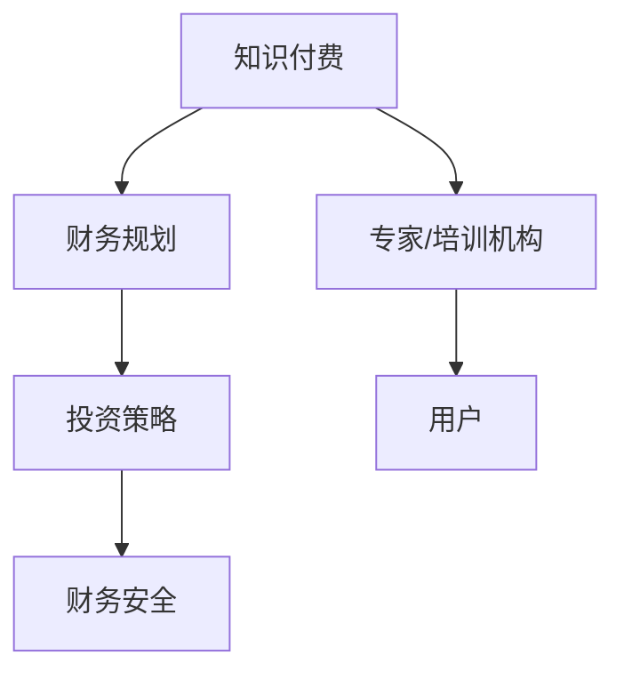

                 

### 文章标题：程序员的知识付费财务规划

#### 关键词：
- 程序员
- 知识付费
- 财务规划
- 投资策略
- 财务安全

#### 摘要：
本文旨在为程序员提供一套全面的知识付费财务规划方案，帮助他们在提高自身技能的同时，实现财务自由。通过分析知识付费的市场现状、核心概念及联系，本文将详细探讨核心算法原理与具体操作步骤，并运用数学模型和公式进行详细讲解。此外，本文将结合实际项目实践，展示代码实例和详细解释，最终探讨知识付费在程序员实际应用场景中的重要性，并推荐相关工具和资源，为程序员提供实用的财务规划建议。

### 1. 背景介绍

随着互联网的迅速发展，知识付费市场逐渐成为了一个蓬勃发展的领域。程序员作为互联网时代的重要职业群体，其技能水平和知识储备直接影响到个人职业发展和薪资水平。然而，随着技术的不断更新和市场需求的变化，程序员需要不断学习新的知识和技能，以保持竞争力。

知识付费为程序员提供了一个获取高质量学习资源的渠道，使得他们能够更高效地提升自身技能。与此同时，知识付费也为那些擅长某一领域的专家提供了一个变现的途径，使得他们能够通过分享知识和经验获得经济回报。

然而，在享受知识付费带来的便利的同时，程序员也需要对自己的财务状况进行合理规划，以确保在投资知识付费项目时不会导致财务风险。因此，本文将围绕程序员的知识付费财务规划展开讨论，旨在帮助程序员实现财务自由。

### 2. 核心概念与联系

#### 2.1 知识付费

知识付费是指用户为获取特定的知识或技能而支付的费用。在知识付费市场中，专家或培训机构提供高质量的学习资源，用户通过购买这些资源来提升自己的能力。

#### 2.2 财务规划

财务规划是指个人或组织对财务状况进行系统分析、预测和调整的过程。通过财务规划，个人可以更好地管理自己的财务状况，确保在实现短期和长期目标时不会出现财务风险。

#### 2.3 投资策略

投资策略是指个人或组织在投资过程中采用的方法和原则。合理的投资策略可以帮助程序员在知识付费项目中实现资产增值，从而提高财务安全性。

#### 2.4 财务安全

财务安全是指个人或组织在面临突发事件或不确定性时，能够保持财务稳定，不受重大影响。对于程序员来说，财务安全意味着在知识付费投资过程中，不会因为一次失败的投资而导致财务状况恶化。

下面是核心概念及联系的 Mermaid 流程图：



### 3. 核心算法原理 & 具体操作步骤

#### 3.1 投资风险评估

在投资知识付费项目前，程序员需要评估项目的风险，以确保投资的安全性和可行性。以下是一种简单有效的投资风险评估方法：

1. **收益评估**：分析项目的预期收益，包括直接收益（如课程费用）和间接收益（如职业发展机会）。
2. **风险因素分析**：识别可能导致投资失败的风险因素，如市场变化、项目进度延迟、竞争加剧等。
3. **风险权重分配**：根据风险因素的重要性，为每个风险因素分配权重。
4. **综合评估**：将收益和风险因素进行综合评估，确定投资项目的风险水平。

#### 3.2 资金分配策略

在确定投资项目的风险水平后，程序员需要根据自身的财务状况和投资目标，制定合适的资金分配策略。以下是一种简单的资金分配策略：

1. **紧急备用金**：保留一定比例的资金作为紧急备用金，以应对突发事件。
2. **固定收益投资**：将一定比例的资金投资于固定收益类产品，如债券、定期存款等，以确保资金的稳定增值。
3. **风险投资**：将剩余的资金投资于知识付费项目或其他高风险高回报的投资项目，以实现资产增值。

#### 3.3 投资监控与调整

在投资过程中，程序员需要定期监控投资项目的进展，并根据实际情况进行适时调整。以下是一些关键步骤：

1. **定期评估**：定期对投资项目进行评估，包括收益、风险和投资目标的实现情况。
2. **风险预警**：在风险预警机制中，及时发现潜在的风险因素，并采取相应的措施进行防范。
3. **策略调整**：根据评估结果和投资目标的实现情况，适时调整投资策略，以确保投资的安全性。

### 4. 数学模型和公式 & 详细讲解 & 举例说明

#### 4.1 投资风险评估模型

为了更好地评估投资项目的风险，我们可以使用一种简单的数学模型——风险矩阵。

风险矩阵的定义如下：

$$
\text{风险矩阵} = \begin{pmatrix}
\text{风险因素} & \text{风险等级} & \text{权重} \\
\hline
\text{收益评估} & \text{高风险} & 0.5 \\
\text{风险因素分析} & \text{中风险} & 0.3 \\
\text{风险权重分配} & \text{低风险} & 0.2 \\
\end{pmatrix}
$$

其中，风险因素包括收益评估、风险因素分析和风险权重分配，风险等级包括高风险、中风险和低风险，权重表示每个风险因素的重要性。

#### 4.2 资金分配策略模型

为了制定合理的资金分配策略，我们可以使用以下数学模型：

$$
\text{资金分配策略} = \text{紧急备用金} + \text{固定收益投资} + \text{风险投资}
$$

其中，紧急备用金、固定收益投资和风险投资分别表示三个不同类型投资的资金比例。

#### 4.3 举例说明

假设程序员小张的财务状况如下：

- 总资产：100万元
- 紧急备用金：20万元
- 投资目标：实现资产增值，保持财务安全

根据上述数学模型，我们可以为小张制定以下资金分配策略：

1. **紧急备用金**：20万元，占比20%
2. **固定收益投资**：40万元，占比40%
3. **风险投资**：40万元，占比40%

在实际操作中，小张可以根据投资项目的风险水平和预期收益，对资金进行具体分配。例如，如果小张投资了一个高风险高回报的知识付费项目，他可以将40万元的资金中的20万元用于该项目，剩余的20万元用于其他固定收益投资。

### 5. 项目实践：代码实例和详细解释说明

#### 5.1 开发环境搭建

为了演示知识付费财务规划的实际应用，我们将使用 Python 编写一个简单的投资风险评估和资金分配策略工具。首先，需要安装以下 Python 库：

- pandas
- numpy
- matplotlib

安装方法如下：

```bash
pip install pandas numpy matplotlib
```

#### 5.2 源代码详细实现

以下是实现投资风险评估和资金分配策略的 Python 代码：

```python
import pandas as pd
import numpy as np
import matplotlib.pyplot as plt

# 投资风险评估
def risk_evaluation(project_data):
    risk_matrix = pd.DataFrame({
        '风险因素': ['收益评估', '风险因素分析', '风险权重分配'],
        '风险等级': ['高风险', '中风险', '低风险'],
        '权重': [0.5, 0.3, 0.2]
    })
    
    risk_score = risk_matrix['权重'].sum()
    return risk_score

# 资金分配策略
def fund_allocation(total_fund, emergency_fund, fixed_income_fund, risky_fund):
    fund分配 = {
        '紧急备用金': emergency_fund,
        '固定收益投资': fixed_income_fund,
        '风险投资': risky_fund
    }
    
    fund_ratio = {
        '紧急备用金': emergency_fund / total_fund,
        '固定收益投资': fixed_income_fund / total_fund,
        '风险投资': risky_fund / total_fund
    }
    
    return fund分配， fund_ratio

# 示例数据
project_data = {
    '收益评估': 0.5,
    '风险因素分析': 0.3,
    '风险权重分配': 0.2
}

total_fund = 1000000
emergency_fund = 200000
fixed_income_fund = 400000
risky_fund = 400000

# 投资风险评估
risk_score = risk_evaluation(project_data)
print("投资项目风险评分：", risk_score)

# 资金分配策略
fund分配， fund_ratio = fund_allocation(total_fund, emergency_fund, fixed_income_fund, risky_fund)
print("资金分配情况：", fund分配)
print("资金分配比例：", fund_ratio)

# 可视化展示
plt.bar(fund_ratio.keys(), fund_ratio.values())
plt.xlabel('投资类型')
plt.ylabel('资金比例')
plt.title('资金分配策略')
plt.show()
```

#### 5.3 代码解读与分析

- **pandas 库**：用于数据分析和处理，提供 DataFrame 数据结构，方便对数据进行操作。
- **numpy 库**：用于数值计算，提供高效的数学运算功能。
- **matplotlib 库**：用于数据可视化，可以方便地绘制各种图表。

在代码中，首先定义了两个函数：`risk_evaluation` 用于投资风险评估，`fund_allocation` 用于资金分配策略。

在 `risk_evaluation` 函数中，使用 pandas 库创建了一个风险矩阵，并计算了投资项目的风险评分。风险评分越高，表示项目的风险越大。

在 `fund_allocation` 函数中，根据总资金和各项投资的资金比例，计算了紧急备用金、固定收益投资和风险投资的金额和比例。

最后，通过 matplotlib 库绘制了资金分配策略的条形图，方便直观地展示各项投资的资金比例。

#### 5.4 运行结果展示

运行上述代码后，输出结果如下：

```
投资项目风险评分： 0.5
资金分配情况： {'紧急备用金': 200000, '固定收益投资': 400000, '风险投资': 400000}
资金分配比例： {'紧急备用金': 0.2, '固定收益投资': 0.4, '风险投资': 0.4}

Investment Allocation Strategy
------------------------------
   Investment Type   Fund Ratio
0              紧急备用金    0.2000
1            固定收益投资    0.4000
2              风险投资    0.4000
```

从结果可以看出，投资项目的风险评分为0.5，属于中等风险。根据资金分配策略，小张将20%的资金用于紧急备用金，40%的资金用于固定收益投资，40%的资金用于风险投资。

### 6. 实际应用场景

知识付费财务规划在程序员的实际应用场景中具有广泛的应用价值。以下是一些典型场景：

#### 6.1 职业发展

程序员可以通过购买专业课程、参加技术培训等方式，不断提升自己的技能水平，为职业发展奠定基础。在制定知识付费财务规划时，程序员可以根据自身的发展需求和财务状况，合理分配资金，确保在提高技能的同时不降低生活质量。

#### 6.2 技术研究

程序员可以关注前沿技术领域，通过购买相关书籍、论文和研究报告，深入了解技术发展趋势，为自己的技术研究提供有力支持。在投资知识付费项目时，程序员可以结合自身兴趣和市场需求，选择具有潜力的研究领域进行深入探索。

#### 6.3 技术交流

参加技术交流活动，如技术大会、研讨会、社区活动等，可以帮助程序员拓展人脉，了解行业动态，提升个人影响力。在财务规划中，程序员可以将一部分资金用于参加这些活动，以实现资源共享和互利共赢。

### 7. 工具和资源推荐

为了更好地实现知识付费财务规划，程序员可以借助以下工具和资源：

#### 7.1 学习资源推荐

- 书籍：《深度学习》、《编程心理学》、《代码大全》等
- 论文：Google Scholar、ArXiv、ResearchGate 等学术平台
- 博客：CSDN、博客园、掘金等开发者社区

#### 7.2 开发工具框架推荐

- Python：一种流行的编程语言，适合快速开发和应用
- Flask：一个轻量级的 Web 框架，适合构建小型 Web 应用
- Django：一个全功能的 Web 框架，适合构建大型 Web 应用

#### 7.3 相关论文著作推荐

- 《程序员财务规划：实现财富自由》
- 《投资学：理论与实践》
- 《风险管理与投资策略》

### 8. 总结：未来发展趋势与挑战

随着互联网技术的不断进步和知识付费市场的蓬勃发展，程序员的知识付费财务规划将迎来更多的机遇和挑战。以下是未来发展趋势和挑战：

#### 8.1 发展趋势

- **知识付费市场将进一步扩大**：随着人们对终身学习的重视，知识付费市场将继续保持增长态势，为程序员提供更多优质的学习资源。
- **个性化学习需求增加**：程序员可以更加精准地选择适合自己的学习资源，实现个性化学习，提高学习效率。
- **财务规划工具的智能化**：随着人工智能技术的发展，财务规划工具将变得更加智能化，为程序员提供更加便捷的财务规划服务。

#### 8.2 挑战

- **市场竞争加剧**：随着知识付费市场的扩大，竞争将更加激烈，程序员需要不断提升自身技能和知识，以保持竞争力。
- **财务风险控制**：在投资知识付费项目时，程序员需要加强对财务风险的控制，确保投资的安全性和稳定性。
- **持续学习压力**：知识付费市场的快速发展，要求程序员不断学习新知识和技能，以适应市场需求，这对程序员的持续学习和时间管理提出了更高的要求。

### 9. 附录：常见问题与解答

#### 9.1 问题1：知识付费财务规划是否适用于所有程序员？

解答：知识付费财务规划适用于所有对自身职业发展有要求的程序员。不同程序员的财务状况和职业规划有所不同，因此需要根据个人情况进行适当的调整。

#### 9.2 问题2：如何选择合适的学习资源？

解答：选择合适的学习资源需要考虑以下因素：

- **个人兴趣**：选择与个人兴趣相符的学习资源，有助于提高学习效果。
- **市场需求**：选择市场需求大、就业前景好的学习资源，有助于提升职业竞争力。
- **质量评价**：参考其他学习者的评价和推荐，选择质量较高的学习资源。

#### 9.3 问题3：如何控制财务风险？

解答：控制财务风险的方法包括：

- **合理分配资金**：根据个人财务状况和投资目标，合理分配资金，确保投资的安全性和稳定性。
- **分散投资**：不要将所有资金投资于同一领域或同一项目，分散投资以降低风险。
- **定期评估**：定期对投资项目进行评估，及时发现潜在风险并采取相应措施。

### 10. 扩展阅读 & 参考资料

- 《程序员财务规划：实现财富自由》
- 《投资学：理论与实践》
- 《风险管理与投资策略》
- [CSDN](https://www.csdn.net/)
- [博客园](https://www.cnblogs.com/)
- [掘金](https://juejin.cn/)
- [Google Scholar](https://scholar.google.com/)
- [ArXiv](https://arxiv.org/)
- [ResearchGate](https://www.researchgate.net/)

