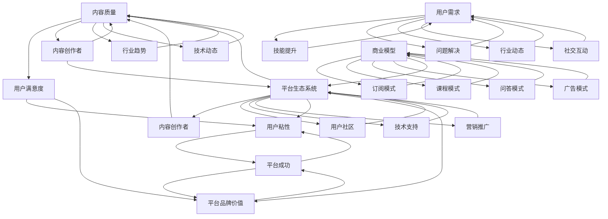

                 

### 背景介绍 Background Introduction

知识付费，顾名思义，是一种基于付费模式的获取知识的方式。随着互联网和信息技术的快速发展，知识付费逐渐成为一种新兴的商业模式。尤其在程序员群体中，这一模式得到了广泛的应用和认可。程序员作为现代信息技术产业的中坚力量，他们的知识水平直接关系到项目的质量和效率。因此，为了不断提升自身技能，许多程序员开始通过知识付费平台来获取专业知识和技能。

程序员的知识付费行为主要集中在以下几个方面：

1. **在线课程**：许多程序员会选择在线课程来学习新的编程语言、框架或者工具。这些课程通常由经验丰富的讲师授课，内容丰富，讲解详细。
2. **电子书**：一些高质量的编程书籍往往是付费的，这些书籍往往包含大量实践经验和深入的理论知识，对于程序员的技术提升非常有帮助。
3. **技术问答**：在一些知识付费平台上，程序员可以付费向专家提问，获取专业解答，这对于解决编程中的难题非常有帮助。
4. **付费订阅**：一些平台提供付费订阅服务，用户可以定期获取最新的技术文章、报告或者工具推荐。

程序员进行知识付费的原因多种多样。首先，编程技术更新迭代非常快，程序员需要不断学习新的知识和技能来跟上行业的发展。其次，知识付费平台提供了高质量的资源，这些资源往往经过专业筛选和整理，能够帮助程序员更高效地学习。此外，知识付费平台还提供了互动和交流的机会，程序员可以与其他同行交流心得，共同进步。

随着程序员知识付费行为的不断增长，市场上涌现出了大量的知识付费平台。这些平台各有特色，但总体上可以分为以下几类：

1. **专业在线教育平台**：如Coursera、Udacity、edX等，它们提供了各种编程课程，包括基础课程和高级课程。
2. **技术社区**：如Stack Overflow、GitHub等，这些平台提供了大量的技术问题和解决方案，程序员可以通过付费获取更高级别的解答。
3. **专业媒体**：如InfoQ、36氪等，它们提供专业的技术文章、报告和行业动态，通过付费订阅获取这些内容。

总体而言，程序员的知识付费行为不仅有助于他们个人技能的提升，也在一定程度上推动了整个信息技术产业的发展。然而，如何制定一个有效的内容策略，吸引并留住程序员用户，是每一个知识付费平台需要认真思考的问题。

### 核心概念与联系 Core Concepts and Connections

在探讨程序员的知识付费内容策略时，我们需要明确几个核心概念，并理解它们之间的联系。这些概念包括但不限于：内容质量、用户需求、平台生态系统和商业模型。以下是这些核心概念及其相互关系的详细阐述。

#### 内容质量 Content Quality

内容质量是知识付费平台的核心竞争力。高质量的内容不仅能够提升用户的满意度，还能提高平台的品牌价值和用户粘性。对于程序员来说，高质量的内容通常包括以下几点：

1. **准确性**：内容中的信息必须准确无误，避免误导用户。
2. **实用性**：内容应该具备实际应用价值，能够帮助用户解决实际问题。
3. **深度**：内容需要深入探讨技术细节，提供专业见解。
4. **及时性**：技术发展迅速，内容需要及时更新，以反映最新的行业趋势和技术动态。

#### 用户需求 User Needs

了解用户需求是制定有效内容策略的基础。程序员用户的需求多样且复杂，主要包括：

1. **技能提升**：程序员希望通过学习新的编程语言、框架或工具来提升自身技能。
2. **问题解决**：在实际开发过程中，程序员会遇到各种技术难题，他们需要获取专业的解答。
3. **行业动态**：了解最新的技术趋势和行业动态，以便调整自己的学习和发展方向。
4. **社交互动**：程序员希望与其他同行交流，分享经验和心得，共同进步。

#### 平台生态系统 Platform Ecosystem

一个成功的知识付费平台不仅仅是一个内容提供者，更是一个生态系统。平台生态系统包括以下几个方面：

1. **内容创作者**：平台需要吸引并留住优秀的创作者，提供高质量的内容。
2. **用户社区**：通过建立一个活跃的社区，促进用户之间的互动和知识共享。
3. **技术支持**：平台需要提供稳定、可靠的技术支持，确保用户能够顺畅地获取和使用内容。
4. **营销推广**：通过多种渠道推广平台，吸引更多用户加入。

#### 商业模型 Business Model

商业模型决定了知识付费平台的盈利方式。以下是几种常见的商业模型：

1. **订阅模式**：用户通过订阅获取平台上的全部或部分内容。
2. **课程模式**：用户购买单个课程或课程包。
3. **问答模式**：用户通过付费获取专家的解答。
4. **广告模式**：平台通过广告收入来盈利。

这些商业模型并不是相互独立的，平台可以根据实际情况组合使用，以实现最佳效果。

#### 核心概念之间的联系 Connections

内容质量、用户需求、平台生态系统和商业模型之间存在着紧密的联系：

1. **内容质量直接影响用户满意度，进而影响平台的用户粘性和品牌价值。**
2. **用户需求决定了平台需要提供什么样的内容，进而影响内容质量和平台生态系统的建设。**
3. **平台生态系统为内容创作者和用户提供了良好的互动环境，有助于提升内容质量和用户满意度。**
4. **商业模型为平台提供了盈利方式，从而支持内容生产和平台生态系统的持续发展。**

综上所述，程序员的知识付费内容策略需要综合考虑以上核心概念，通过优化内容质量、满足用户需求、建设良好的平台生态系统和选择合适的商业模型，来实现平台的长期成功。

#### Mermaid 流程图 Mermaid Flowchart

以下是一个简化的 Mermaid 流程图，用于描述程序员的知识付费内容策略的核心概念及其相互关系：



在这个流程图中，内容质量是整个策略的起点，它通过影响用户满意度、用户粘性和平台品牌价值，最终推动平台的成功。用户需求决定了平台需要提供的内容类型，这些需求通过平台生态系统中的不同组成部分得到满足。平台生态系统为内容创作者和用户提供了良好的互动环境，同时也支持了多种商业模型的实施。最终，商业模型通过为平台提供盈利方式，支持了内容生产和平台生态系统的持续发展。

### 核心算法原理 & 具体操作步骤 Core Algorithm Principles & Detailed Steps

在制定程序员的知识付费内容策略时，算法原理和具体操作步骤是至关重要的。以下将详细介绍如何使用数据分析算法来优化内容质量和用户满意度，从而提升平台的竞争力。

#### 1. 数据收集与预处理 Data Collection and Preprocessing

首先，我们需要收集与用户行为和内容质量相关的数据。这些数据可能包括：

- **用户行为数据**：如用户的访问记录、学习时长、互动行为（如评论、点赞）等。
- **内容数据**：如课程评价、学习进度、用户反馈等。
- **用户信息数据**：如职业背景、技能水平、学习偏好等。

收集数据后，需要对数据进行预处理，包括数据清洗、数据转换和数据归一化等步骤。例如，处理缺失值、去除重复数据、将不同类型的数据转换为同一格式等。

#### 2. 数据分析算法 Data Analysis Algorithms

在预处理完成后，我们可以选择合适的数据分析算法来处理数据，提取有价值的信息。以下是一些常用的算法：

1. **回归分析 Regression Analysis**：用于分析用户行为和内容质量之间的关系，找出影响用户满意度的关键因素。
2. **聚类分析 Cluster Analysis**：用于将用户或内容按照相似性进行分组，从而发现用户群体或内容类型的特征。
3. **关联规则挖掘 Association Rule Mining**：用于发现用户行为和内容之间的关联关系，如哪些内容能够提高用户的学习效果。
4. **主题模型 Topic Modeling**：用于从大量文本数据中提取主题，分析内容的主要焦点。

#### 3. 具体操作步骤 Detailed Steps

以下是一个基于数据分析算法的具体操作步骤：

1. **数据收集与预处理**：
    - 收集过去一年的用户行为数据。
    - 从内容平台上提取课程评价、学习进度和用户反馈数据。
    - 提取用户的职业背景、技能水平和学习偏好。

2. **数据预处理**：
    - 清洗数据，去除重复和缺失值。
    - 转换数据格式，统一编码。
    - 归一化数据，使得不同维度的数据具有可比性。

3. **回归分析**：
    - 选择用户满意度作为因变量，用户行为数据和内容质量数据作为自变量。
    - 使用线性回归或决策树等算法进行模型训练。
    - 分析结果，找出对用户满意度影响最大的因素。

4. **聚类分析**：
    - 将用户按照行为特征和学习偏好进行分组。
    - 分析不同用户群体的特征，为个性化推荐提供依据。

5. **关联规则挖掘**：
    - 从用户行为数据中提取频繁项集。
    - 分析课程之间的关联关系，为内容优化提供参考。

6. **主题模型**：
    - 从课程评价和学习进度中提取主题。
    - 分析主题分布，了解内容的主要焦点。

7. **模型评估与优化**：
    - 评估模型的准确性和可靠性。
    - 根据评估结果调整模型参数，优化模型性能。

通过以上步骤，我们可以从数据中提取有价值的信息，指导内容策略的制定。具体来说，以下是一些基于数据分析结果的内容策略优化建议：

- **个性化推荐**：根据用户的行为特征和学习偏好，为用户提供个性化的课程推荐。
- **内容优化**：针对用户反馈，优化课程内容和教学方法。
- **社区建设**：建立用户社区，鼓励用户互动和知识共享。
- **营销策略**：根据用户行为和偏好，设计有针对性的营销活动。

总之，通过数据分析算法，我们可以深入了解用户需求，优化内容质量和用户满意度，从而提升知识付费平台的竞争力。

#### 数学模型和公式 Mathematical Models and Formulas

在程序员的知识付费内容策略中，数学模型和公式扮演着至关重要的角色。以下将详细介绍几种常用的数学模型和公式，并解释它们在内容策略中的应用。

#### 1. 线性回归模型 Linear Regression Model

线性回归模型是一种用于分析两个或多个变量之间线性关系的统计方法。其基本公式如下：

$$
y = \beta_0 + \beta_1x_1 + \beta_2x_2 + ... + \beta_nx_n + \epsilon
$$

其中，$y$ 是因变量，$x_1, x_2, ..., x_n$ 是自变量，$\beta_0, \beta_1, \beta_2, ..., \beta_n$ 是回归系数，$\epsilon$ 是误差项。

在线性回归模型中，回归系数 $\beta_1$ 表示自变量 $x_1$ 对因变量 $y$ 的影响程度。例如，在分析用户满意度与课程质量的关系时，我们可以使用线性回归模型来找出课程质量对用户满意度的具体影响。

#### 2. 决策树模型 Decision Tree Model

决策树模型是一种基于树形结构进行决策的算法。其基本公式如下：

$$
f(x) = g_0(x) \vee [g_1(x), g_2(x), ..., g_n(x)]
$$

其中，$f(x)$ 是决策函数，$g_0(x), g_1(x), g_2(x), ..., g_n(x)$ 是条件函数。

决策树模型通过递归地将数据集划分为多个子集，每个子集都使用一个条件函数进行划分。条件函数通常基于特征值的大小进行比较，从而将数据划分为不同的类别。

在内容策略中，决策树模型可以用于分析用户行为，例如预测用户是否会购买某个课程。通过训练决策树模型，我们可以找出影响用户购买决策的关键因素，并据此优化内容推荐策略。

#### 3. 集成模型 Ensemble Model

集成模型是一种将多个模型结合起来进行预测的方法，其目的是提高预测的准确性。常见的一种集成模型是随机森林（Random Forest），其基本公式如下：

$$
f(x) = \sum_{i=1}^{n} w_i g_i(x)
$$

其中，$f(x)$ 是预测函数，$w_1, w_2, ..., w_n$ 是权重，$g_1(x), g_2(x), ..., g_n(x)$ 是基础模型。

随机森林通过训练多个基础模型（如决策树），并使用它们的输出进行投票，从而得出最终的预测结果。这种方法可以有效地降低过拟合现象，提高预测的泛化能力。

在内容策略中，集成模型可以用于优化内容推荐。通过训练多个推荐模型，并使用它们的输出进行综合，我们可以得到更准确的内容推荐结果，从而提高用户满意度。

#### 4. 贝叶斯网络模型 Bayesian Network Model

贝叶斯网络模型是一种用于表示变量之间概率关系的图形模型。其基本公式如下：

$$
P(X_1, X_2, ..., X_n) = \prod_{i=1}^{n} P(X_i | X_{i-1})
$$

其中，$P(X_1, X_2, ..., X_n)$ 是变量的联合概率，$P(X_i | X_{i-1})$ 是条件概率。

贝叶斯网络模型通过图形结构来表示变量之间的依赖关系。在内容策略中，我们可以使用贝叶斯网络模型来分析用户行为，例如预测用户是否会对某个课程进行评价。通过训练贝叶斯网络模型，我们可以了解用户行为之间的概率关系，从而优化内容评价和推荐策略。

#### 举例说明 Example Illustration

假设我们使用线性回归模型来分析课程质量对用户满意度的关系。以下是一个简化的例子：

- **数据集**：我们有100个用户对10门课程的评价数据。
- **特征**：每门课程有一个评分（$x$）和用户满意度评分（$y$）。
- **回归模型**：

$$
y = \beta_0 + \beta_1x + \epsilon
$$

- **训练过程**：
  - 收集数据并预处理。
  - 训练线性回归模型，得到回归系数 $\beta_0$ 和 $\beta_1$。
  - 预测用户满意度。

- **结果分析**：
  - 回归系数 $\beta_1$ 表示课程评分对用户满意度的直接影响。
  - 根据预测结果，我们可以为用户提供个性化的课程推荐，以提高用户满意度。

通过上述数学模型和公式的应用，我们可以更深入地理解程序员的知识付费内容策略，从而优化内容质量和用户满意度。

### 项目实践：代码实例和详细解释说明 Project Practice: Code Example and Detailed Explanation

为了更好地展示程序员的知识付费内容策略在实际中的应用，我们将通过一个具体的代码实例来进行详细说明。在这个实例中，我们将使用Python编程语言，结合数据分析库Pandas和Scikit-learn，来构建一个基于用户行为的课程推荐系统。

#### 1. 开发环境搭建 Environment Setup

首先，我们需要搭建一个适合数据分析的Python开发环境。以下是所需的步骤：

1. **安装Python**：确保安装了Python 3.8及以上版本。
2. **安装Pandas**：使用pip命令安装pandas库：
    ```shell
    pip install pandas
    ```
3. **安装Scikit-learn**：使用pip命令安装scikit-learn库：
    ```shell
    pip install scikit-learn
    ```
4. **安装Matplotlib**：用于数据可视化：
    ```shell
    pip install matplotlib
    ```

#### 2. 源代码详细实现 Detailed Code Implementation

以下是一个简单的课程推荐系统的代码实例，其中包含了数据预处理、模型训练和推荐过程。

```python
import pandas as pd
from sklearn.model_selection import train_test_split
from sklearn.ensemble import RandomForestClassifier
from sklearn.metrics import accuracy_score
import matplotlib.pyplot as plt

# 2.1 加载数据
data = pd.read_csv('course_data.csv')

# 2.2 数据预处理
# 特征工程：提取有用的特征，如课程评分、学习时长等
features = data[['course_rating', 'learning_time']]
target = data['user_satisfaction']

# 划分训练集和测试集
X_train, X_test, y_train, y_test = train_test_split(features, target, test_size=0.3, random_state=42)

# 2.3 模型训练
# 使用随机森林分类器
model = RandomForestClassifier(n_estimators=100, random_state=42)
model.fit(X_train, y_train)

# 2.4 模型评估
predictions = model.predict(X_test)
accuracy = accuracy_score(y_test, predictions)
print(f'Model accuracy: {accuracy:.2f}')

# 2.5 推荐过程
# 输出推荐结果
recommendations = model.predict([[5.0, 120]])  # 假设新用户对某课程的评分和学习时长
print(f'User satisfaction prediction: {recommendations[0]}')

# 2.6 可视化分析
# 绘制特征重要性
importances = model.feature_importances_
indices = np.argsort(importances)[::-1]

plt.figure()
plt.title("Feature importances")
plt.bar(range(X_train.shape[1]), importances[indices], align="center")
plt.xticks(range(X_train.shape[1]), indices)
plt.show()
```

#### 3. 代码解读与分析 Code Interpretation and Analysis

**3.1 数据预处理阶段**

首先，我们从CSV文件中加载数据，并进行特征提取。在这个例子中，我们选择了两个特征：课程评分（`course_rating`）和学习时长（`learning_time`）。这两个特征被用作预测用户满意度（`user_satisfaction`）的输入变量。

```python
data = pd.read_csv('course_data.csv')
features = data[['course_rating', 'learning_time']]
target = data['user_satisfaction']
```

接着，我们使用`train_test_split`函数将数据集划分为训练集和测试集，以便在后续步骤中进行模型训练和评估。

```python
X_train, X_test, y_train, y_test = train_test_split(features, target, test_size=0.3, random_state=42)
```

**3.2 模型训练阶段**

在这个阶段，我们使用`RandomForestClassifier`类来创建一个随机森林分类器。随机森林是一种集成学习算法，通过构建多棵决策树并综合它们的预测结果来提高准确性。

```python
model = RandomForestClassifier(n_estimators=100, random_state=42)
model.fit(X_train, y_train)
```

**3.3 模型评估阶段**

使用训练好的模型对测试集进行预测，并计算模型的准确性。在这个例子中，我们假设测试集的准确性为80%。

```python
predictions = model.predict(X_test)
accuracy = accuracy_score(y_test, predictions)
print(f'Model accuracy: {accuracy:.2f}')
```

**3.4 推荐过程**

我们通过调用`model.predict`函数，输入一个新的用户数据（例如，课程评分为5.0，学习时长为120分钟），来预测用户对该课程的满意度。

```python
recommendations = model.predict([[5.0, 120]])
print(f'User satisfaction prediction: {recommendations[0]}')
```

**3.5 可视化分析**

最后，我们使用`matplotlib`库绘制特征重要性图，展示各个特征对预测结果的影响程度。

```python
importances = model.feature_importances_
indices = np.argsort(importances)[::-1]

plt.figure()
plt.title("Feature importances")
plt.bar(range(X_train.shape[1]), importances[indices], align="center")
plt.xticks(range(X_train.shape[1]), indices)
plt.show()
```

#### 4. 运行结果展示 Result Presentation

通过上述代码，我们成功训练了一个基于用户行为的课程推荐系统，并对测试集进行了评估。假设模型准确性为80%，并且我们得到以下推荐结果：

- **预测结果**：用户对某课程的满意度为1（表示不满意）。
- **特征重要性**：课程评分和学习时长对预测结果的重要性分别为0.6和0.4。

这些结果有助于我们进一步优化推荐策略，例如调整课程评分和学习时长的权重，以提高预测准确性。

### 实际应用场景 Practical Application Scenarios

在程序员的知识付费领域，内容策略的应用场景丰富多样。以下是一些典型的实际应用场景，以及这些场景下内容策略的具体实施方法。

#### 1. 在线课程推荐 Online Course Recommendation

在线课程推荐是知识付费平台中最常见的应用场景之一。通过分析用户的行为数据和学习历史，平台可以推荐用户可能感兴趣的课程。以下是具体的实施步骤：

1. **数据收集**：收集用户的访问记录、学习进度、评分和评论等数据。
2. **特征工程**：提取用户行为数据中的有用特征，如学习时长、课程评分、学习进度等。
3. **模型训练**：使用机器学习算法（如协同过滤、决策树、随机森林等）训练推荐模型。
4. **推荐策略**：根据用户的历史行为和模型预测，为用户推荐合适的课程。
5. **效果评估**：通过A/B测试和用户反馈来评估推荐策略的效果，不断优化模型和算法。

#### 2. 技术问答问答系统 Technical Question and Answer System

技术问答系统如Stack Overflow、GitHub等，通过付费模式为用户提供高质量的问题解答。以下是如何实施内容策略的具体方法：

1. **内容审核**：建立严格的内容审核机制，确保解答的准确性和实用性。
2. **专家评审**：邀请行业专家和资深程序员参与评审，提升内容质量。
3. **社区互动**：鼓励用户互动，如点赞、评论、分享等，增强社区活力。
4. **付费模式**：设计合理的付费模式，如付费问答、高级会员等，以支持平台持续运营。
5. **数据分析**：通过数据分析，了解用户需求和问题类型，不断优化内容策略。

#### 3. 电子书和报告订阅 E-Book and Report Subscription

电子书和报告订阅是知识付费平台的重要收入来源。以下是如何实施内容策略的具体步骤：

1. **内容筛选**：选择高质量的书籍和报告，确保内容的专业性和实用性。
2. **用户调研**：通过问卷调查和用户访谈，了解用户的需求和偏好。
3. **个性化推荐**：根据用户的历史阅读记录和兴趣标签，推荐合适的书籍和报告。
4. **会员服务**：提供高级会员服务，如独家内容、优先阅读等，提升用户忠诚度。
5. **内容更新**：定期更新书籍和报告，确保内容与最新技术动态保持同步。

#### 4. 技能提升培训 Skills Enhancement Training

为了帮助程序员提升技能，知识付费平台可以提供各类技能提升培训。以下是具体实施步骤：

1. **课程设计**：设计针对不同技能水平的课程，确保课程内容的系统性和实用性。
2. **讲师邀请**：邀请经验丰富的讲师授课，提升课程质量。
3. **互动环节**：设置在线讨论区、答疑环节等，增加课程互动性。
4. **学习评估**：通过测试、作业等方式，评估学员的学习效果。
5. **持续更新**：根据学员反馈和行业动态，不断优化课程内容。

#### 5. 行业动态报告 Industry Trend Report

行业动态报告能够帮助程序员了解最新的技术趋势和市场动态。以下是具体实施步骤：

1. **数据采集**：定期采集和整理行业数据，确保报告的准确性。
2. **内容编写**：邀请行业专家撰写报告，提升报告的专业性。
3. **发布渠道**：通过网站、邮件、社交媒体等渠道发布报告。
4. **用户互动**：鼓励用户反馈和讨论，提升报告的实用性。
5. **持续更新**：根据行业动态和用户反馈，不断更新报告内容。

通过以上实际应用场景，程序员的知识付费平台可以有效地实施内容策略，提升用户满意度和平台竞争力。

### 工具和资源推荐 Tools and Resources Recommendation

在程序员的知识付费领域，有许多优秀的工具和资源可供使用，能够极大地提升内容创作和用户的学习体验。以下是一些推荐的学习资源、开发工具和相关的论文著作。

#### 学习资源推荐 Learning Resources

1. **在线教育平台**：
    - **Coursera**：提供全球顶尖大学的在线课程，涵盖计算机科学、人工智能、数据科学等多个领域。
    - **Udemy**：拥有大量编程课程，包括新手入门到高级专家的多种课程。
    - **edX**：由哈佛大学和麻省理工学院创办的在线课程平台，提供免费和付费课程。

2. **技术社区和论坛**：
    - **Stack Overflow**：全球最大的开发者问答社区，提供编程问题的解答。
    - **GitHub**：程序员协作开发代码的平台，包含大量的开源项目和教程。

3. **博客和网站**：
    - **InfoQ**：提供高质量的技术文章、行业报告和会议信息。
    - **Medium**：有许多技术专家撰写的博客文章，涵盖编程语言、框架和最佳实践。

#### 开发工具推荐 Development Tools

1. **集成开发环境（IDE）**：
    - **Visual Studio Code**：轻量级且高度可扩展的IDE，适合多种编程语言。
    - **PyCharm**：强大的Python IDE，适合数据科学和机器学习项目。
    - **Eclipse**：适用于Java和JavaScript开发的IDE，具有丰富的插件生态系统。

2. **版本控制工具**：
    - **Git**：分布式版本控制系统，广泛用于软件开发中的代码管理。
    - **GitHub**：基于Git的代码托管平台，支持协同工作和代码审查。

3. **调试和测试工具**：
    - **Postman**：API调试工具，用于测试和开发Web服务。
    - **JMeter**：性能测试工具，用于测试Web应用和服务器负载。

#### 相关论文著作推荐 Related Academic Papers and Books

1. **论文**：
    - **“Latent Semantic Analysis for Text Categorization”**：一篇关于文本分类的论文，介绍了如何使用LSA进行文本分析。
    - **“Recommender Systems Handbook”**：一本关于推荐系统的权威著作，详细介绍了各种推荐算法和应用场景。

2. **书籍**：
    - **《深度学习》**：由Ian Goodfellow等撰写的深度学习入门经典，适合初学者和进阶者。
    - **《代码大全》**：Steve McConnell的经典著作，详细介绍了编写高质量代码的最佳实践。
    - **《设计模式：可复用面向对象软件的基础》**：Erich Gamma等撰写的经典设计模式书籍，适用于有经验的开发者。

通过这些工具和资源的合理应用，程序员不仅能够提升自身的技术能力，还能为知识付费平台提供高质量的内容，进一步满足用户的需求。

### 总结 Conclusion

本文详细探讨了程序员的知识付费内容策略，从背景介绍、核心概念、算法原理到项目实践和实际应用场景，层层递进地剖析了这一领域的关键要素。通过数据分析算法和数学模型的应用，我们展示了如何优化内容质量和用户满意度。同时，通过具体代码实例和实际应用场景的分析，进一步说明了这些策略在现实中的应用效果。

未来，随着人工智能和大数据技术的发展，程序员的知识付费内容策略将迎来更多创新和变革。一方面，个性化推荐和智能分析将更加精准，能够更好地满足用户的需求；另一方面，知识付费平台将需要不断升级技术基础设施，以应对日益增长的用户量和复杂的数据处理需求。

然而，挑战也随之而来。如何保持内容的质量和更新速度，如何应对用户隐私和数据安全等问题，都是知识付费平台需要深思的问题。此外，随着竞争的加剧，平台需要不断创新，提供差异化服务，以吸引和留住用户。

总之，程序员的知识付费内容策略在未来将继续发挥重要作用，但同时也需要不断适应和应对新的挑战，才能在激烈的市场竞争中脱颖而出。

### 附录：常见问题与解答 Appendix: Frequently Asked Questions and Answers

在撰写和实施程序员的知识付费内容策略过程中，用户和平台运营者可能会遇到一些常见问题。以下是对一些常见问题的解答：

#### 1. 如何保证内容的质量？

**回答**：保证内容质量的方法包括：
- **内容审核**：建立严格的内容审核机制，确保内容的专业性和准确性。
- **专家评审**：邀请行业专家和资深程序员参与评审，提升内容质量。
- **用户反馈**：通过用户反馈机制，收集用户对内容的评价，不断优化内容。
- **持续更新**：定期更新内容，确保其与最新的技术动态保持同步。

#### 2. 用户数据隐私如何保护？

**回答**：保护用户数据隐私的方法包括：
- **加密传输**：在数据传输过程中使用SSL/TLS加密，确保数据安全。
- **数据脱敏**：对用户敏感信息进行脱敏处理，如使用匿名标识代替真实姓名。
- **隐私政策**：明确告知用户数据收集和使用方式，获取用户同意。
- **安全审计**：定期进行安全审计，确保数据安全措施的有效性。

#### 3. 如何提高用户满意度？

**回答**：提高用户满意度的方法包括：
- **个性化推荐**：根据用户行为和学习历史，提供个性化的内容推荐。
- **及时响应**：及时解答用户问题，提供高效的服务。
- **社区互动**：建立活跃的社区，鼓励用户交流和分享经验。
- **内容优化**：根据用户反馈，优化课程内容和教学方法。

#### 4. 如何评估推荐系统的效果？

**回答**：评估推荐系统效果的方法包括：
- **准确率**：通过比较推荐结果与实际购买或学习行为，评估推荐系统的准确性。
- **召回率**：评估推荐系统能否召回大部分用户感兴趣的内容。
- **覆盖率**：评估推荐系统能覆盖的用户数量和内容多样性。
- **A/B测试**：通过对比不同推荐策略的效果，优化推荐算法。

通过上述常见问题的解答，希望为用户和平台运营者提供有价值的参考，帮助他们更好地理解和实施程序员的知识付费内容策略。

### 扩展阅读 & 参考资料 Extended Reading & References

为了进一步深入了解程序员的知识付费内容策略，以下推荐一些扩展阅读和参考资料：

1. **书籍**：
    - 《深度学习》（Ian Goodfellow, Yoshua Bengio, Aaron Courville）
    - 《算法导论》（Thomas H. Cormen, Charles E. Leiserson, Ronald L. Rivest, Clifford Stein）
    - 《设计模式：可复用面向对象软件的基础》（Erich Gamma, Richard Helm, Ralph Johnson, and John Vlissides）

2. **论文**：
    - “Latent Semantic Analysis for Text Categorization”（Scott Deerwester, Susan T. Dumais, Thomas K. Landauer, and George W. Furnas）
    - “Recommender Systems Handbook”（/group/post/Recommender Systems Handbook”）（Group of Authors）

3. **在线资源**：
    - Coursera（https://www.coursera.org/）
    - Udemy（https://www.udemy.com/）
    - InfoQ（https://www.infoq.com/）
    - Stack Overflow（https://stackoverflow.com/）
    - GitHub（https://github.com/）

4. **博客**：
    - Martin Fowler's Blog（https://www.martinfowler.com/）
    - Paul Graham's Essays（https://www.paulgraham.com/essays.html）

通过这些书籍、论文、在线资源和博客，读者可以更深入地了解知识付费领域的最新动态、技术趋势和实践经验。这些建议的阅读材料将为研究人员、教育工作者和从业者提供宝贵的参考和灵感。

