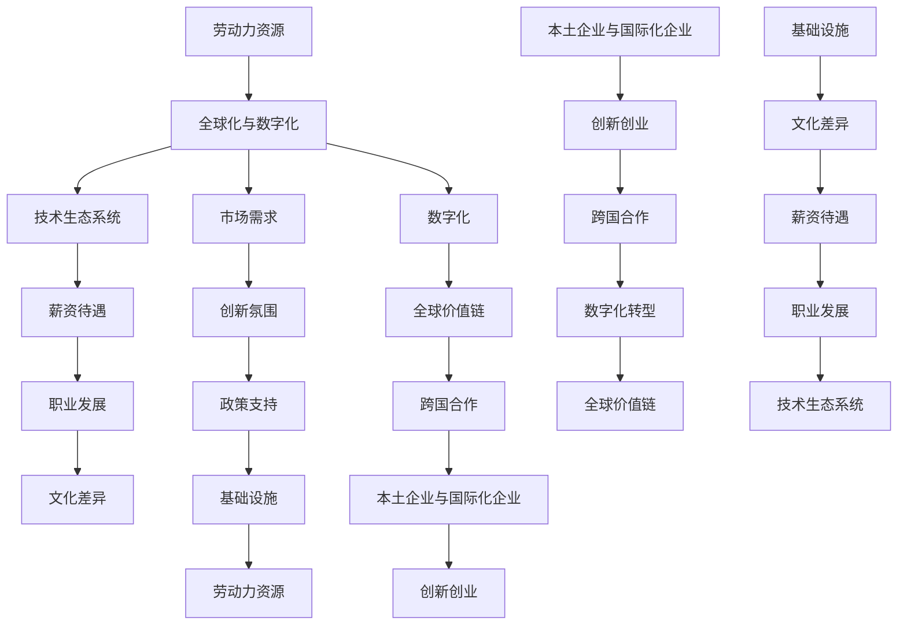

                 

### 背景介绍 Background

随着全球化和数字化的加速，程序员的跨国发展已经成为一个不可忽视的趋势。在这个背景下，硅谷、中国和东南亚等地区成为了程序员寻求职业发展的热门选择。每个地区都有其独特的机遇与挑战，了解这些差异有助于程序员做出更为明智的职业规划。

首先，让我们简要回顾一下这三个地区的背景信息。

#### 硅谷 Silicon Valley

硅谷位于美国加利福尼亚州旧金山湾区，是全球科技创新和创业的圣地。硅谷以高科技产业著称，汇聚了诸如谷歌、苹果、Facebook等科技巨头，以及众多初创公司。这里的创新氛围浓厚，研发投入巨大，吸引了全球顶尖的程序员和科技人才。

#### 中国 China

中国作为世界第二大经济体，正迅速崛起为全球科技和创新的重要中心。中国政府对科技创新的重视程度不断加大，投入了大量的资源和政策支持。中国的互联网公司如阿里巴巴、腾讯、字节跳动等在全球范围内具有很高的影响力，吸引了大量的技术人才。

#### 东南亚 Southeast Asia

东南亚地区包括印度尼西亚、马来西亚、泰国、越南等国家，近年来经济增长迅速。随着互联网普及和数字化进程的加快，东南亚地区成为了新兴的科技创新中心。该地区拥有丰富的劳动力资源，以及年轻且充满活力的市场环境，吸引了众多国际科技公司的关注。

了解这些背景信息后，我们接下来将深入探讨程序员在这些地区的机遇与挑战。

### 机遇 Opportunities

#### 硅谷 Silicon Valley

1. **高薪待遇**：硅谷的公司普遍提供极具竞争力的薪资和福利待遇，特别是在科技公司和创新型企业中。
2. **职业发展**：硅谷有丰富的职业发展机会，从技术专家到企业高管，都有可能在这里实现职业生涯的飞跃。
3. **创新氛围**：硅谷的创新氛围浓厚，程序员可以接触到最新的技术趋势和前沿的科研项目。

#### 中国 China

1. **市场需求**：中国互联网市场庞大，对技术人才的需求旺盛。特别是在人工智能、云计算、大数据等领域，中国公司提供了大量的就业机会。
2. **政策支持**：中国政府大力支持科技创新，提供了一系列优惠政策和支持措施，如税收优惠、研发补贴等。
3. **本土企业崛起**：随着本土企业的崛起，如阿里巴巴、腾讯等，中国成为了程序员职业发展的又一重要市场。

#### 东南亚 Southeast Asia

1. **成本优势**：东南亚地区的生活成本相对较低，程序员的薪资相比硅谷和中国有一定的优势。
2. **市场增长**：东南亚地区的互联网用户和市场规模正在迅速增长，为程序员提供了广阔的市场前景。
3. **创业机会**：东南亚地区的创业环境逐渐改善，为程序员提供了创业的机会和资源支持。

### 挑战 Challenges

#### 硅谷 Silicon Valley

1. **竞争激烈**：硅谷的竞争异常激烈，程序员需要不断提升自己的技能以保持竞争力。
2. **工作压力**：硅谷的工作节奏快，程序员需要承受较大的工作压力。
3. **文化差异**：对于非本地程序员，硅谷的文化差异可能是一个挑战。

#### 中国 China

1. **语言障碍**：对于非中文母语的程序员来说，语言障碍可能是一个挑战。
2. **政策法规**：中国政府的政策法规可能会对某些行业或企业产生较大影响，程序员需要关注相关政策的变化。
3. **市场竞争**：中国市场的竞争非常激烈，程序员需要不断学习和适应市场变化。

#### 东南亚 Southeast Asia

1. **技能要求**：东南亚市场的技能需求可能与硅谷和中国有所不同，程序员可能需要调整自己的技能以适应当地市场。
2. **基础设施**：一些东南亚国家的基础设施相对落后，这可能对程序员的工作和生活产生影响。
3. **文化适应**：对于非东南亚背景的程序员，文化适应可能是一个挑战。

### 总结 Summary

程序员的跨国发展提供了丰富的机遇，同时也伴随着挑战。了解这些地区的背景、机遇与挑战，可以帮助程序员做出更为明智的选择。在接下来的章节中，我们将进一步探讨程序员在硅谷、中国和东南亚的详细情况，帮助读者更好地规划自己的职业发展道路。### 核心概念与联系 Core Concepts and Connections

在探讨程序员的跨国发展之前，我们需要明确几个核心概念，这些概念将贯穿于本文的讨论中，帮助我们更好地理解硅谷、中国和东南亚的机遇与挑战。以下是本文将要涉及的核心概念：

#### 1. 全球化与数字化 Globalization and Digitalization

全球化是指世界范围内的经济、政治、文化等各个领域的相互联系和互动。数字化则是指通过计算机技术、互联网和移动设备等手段，将信息和数据以数字形式存储、处理和传递的过程。全球化和数字化是当今世界发展的重要趋势，它们改变了商业模式的运作方式，也影响了程序员的工作方式。

#### 2. 技术生态系统 Technology Ecosystem

技术生态系统是指一个地区或国家内的科技公司、投资者、研发机构、高校和政府等各方面的互动和协同。一个健康的技术生态系统可以促进技术创新、人才培养和产业升级。

#### 3. 薪资待遇 Compensation

薪资待遇是程序员跨国发展的重要因素之一。薪资水平不仅反映了程序员的技能和市场价值，也影响了他们的生活质量和职业满意度。了解不同地区的薪资水平可以帮助程序员做出合理的职业规划。

#### 4. 职业发展 Career Development

职业发展包括晋升机会、培训机会和职业成长空间等方面。一个良好的职业发展环境可以激发程序员的积极性和创造力，促进其职业生涯的长期发展。

#### 5. 文化差异 Cultural Differences

文化差异是指不同地区或国家在价值观、行为规范、沟通方式等方面的差异。了解文化差异有助于程序员更好地融入当地环境，提高工作效率和职业满意度。

#### 6. 市场需求 Market Demand

市场需求反映了不同地区对技术人才的需求程度。市场需求旺盛的地区往往提供了更多的就业机会和职业发展空间。

#### 7. 创新氛围 Innovation Atmosphere

创新氛围是指一个地区或国家内的创新意识、创新文化和创新实践。一个创新氛围浓厚的地区往往能够吸引更多的科技人才和创业项目。

#### 8. 政策支持 Policy Support

政策支持是指政府或相关机构为促进科技创新和产业发展所提供的各种支持和优惠政策。政策支持可以降低创业成本、提高研发效率、优化营商环境等。

#### 9. 基础设施 Infrastructure

基础设施是指一个地区或国家内的交通、通讯、能源、教育等硬件设施。基础设施的完善程度直接影响到程序员的工作和生活质量。

#### 10. 劳动力资源 Labor Resources

劳动力资源是指一个地区或国家内可供利用的人力资源。丰富的劳动力资源可以降低企业的人力成本，提高生产效率。

#### 11. 本土企业与国际化企业 Local and International Companies

本土企业和国际化企业分别指在某一地区注册成立并在该地区运营的企业，以及在全球范围内运营的企业。本土企业和国际化企业在业务模式、组织架构、文化特点等方面存在差异。

#### 12. 创新创业 Entrepreneurship and Innovation

创新创业是指创业者通过创新的方法和模式，创建新的企业或产品，以实现商业价值的过程。创新创业是推动经济发展和技术进步的重要力量。

#### 13. 跨国合作 International Cooperation

跨国合作是指不同国家或地区的企业、组织和个人之间的合作。跨国合作有助于技术交流、资源共享和市场开拓。

#### 14. 数字化转型 Digital Transformation

数字化转型是指企业利用数字技术来改变其业务模式、运营方式和客户互动方式的过程。数字化转型是企业发展的重要战略方向。

#### 15. 全球价值链 Global Value Chain

全球价值链是指一个产品或服务从原材料采购、生产加工、分销销售到售后服务的全过程。全球价值链的优化和升级是提高企业竞争力的重要手段。

为了更直观地理解这些核心概念之间的联系，我们可以使用Mermaid流程图来展示它们之间的关系。以下是Mermaid流程图的示例：



通过这个流程图，我们可以清晰地看到不同核心概念之间的相互作用和影响。这些核心概念不仅为本文的讨论提供了基础，也为程序员在跨国发展过程中提供了重要的参考。

### 核心算法原理 & 具体操作步骤 Core Algorithm Principle & Specific Steps

在探讨程序员的跨国发展时，我们需要深入理解核心算法原理，并将其应用于实际操作步骤中。以下是几个关键算法原理及其具体操作步骤：

#### 1. 贪心算法 Greedy Algorithm

贪心算法是一种在每一步选择中都采取当前最好或最优的选择，以期望得到最终整体最优解的算法。其核心原理是通过一系列局部最优的选择来达到全局最优。

**具体操作步骤：**

1. 初始化：设定问题初始状态。
2. 选择操作：根据当前状态，选择一个最优的局部操作。
3. 执行操作：执行所选操作，并更新状态。
4. 判断结束条件：如果达到结束条件，则算法结束；否则，回到步骤2。

**示例：**

假设我们要从一个数组中选择若干个数，使得它们的和最大，但不能超过一个给定的值。我们可以使用贪心算法来解决这个问题。

```python
def max_sum(nums, limit):
    nums.sort(reverse=True)
    total = 0
    for num in nums:
        if total + num <= limit:
            total += num
        else:
            break
    return total
```

#### 2. 动态规划 Dynamic Programming

动态规划是一种将复杂问题分解为重叠子问题，并利用子问题的解来构建原问题的解的算法。其核心原理是通过存储子问题的解，避免重复计算。

**具体操作步骤：**

1. 确定状态：将问题分解为若干个子问题，并定义每个子问题的状态。
2. 状态转移方程：根据子问题的状态转移方程，计算每个子问题的解。
3. 求解：从最后一个子问题开始，依次回溯计算，得到原问题的解。

**示例：**

假设我们要求解一个最长公共子序列问题，我们可以使用动态规划来解决这个问题。

```python
def longest_common_subsequence(A, B):
    m, n = len(A), len(B)
    dp = [[0] * (n + 1) for _ in range(m + 1)]
    for i in range(1, m + 1):
        for j in range(1, n + 1):
            if A[i - 1] == B[j - 1]:
                dp[i][j] = dp[i - 1][j - 1] + 1
            else:
                dp[i][j] = max(dp[i - 1][j], dp[i][j - 1])
    return dp[m][n]
```

#### 3. 回溯算法 Backtracking

回溯算法是一种通过试探性地做出选择，并在无法继续前进时回溯到上一个选择点，重新做出选择的算法。其核心原理是在选择过程中记录已做的选择，并在需要时撤销这些选择。

**具体操作步骤：**

1. 初始化：设定问题初始状态。
2. 选择操作：根据当前状态，选择一个可能解。
3. 判断结束条件：如果找到解，则输出解；否则，回溯至上一个选择点，重新选择。
4. 回溯：撤销当前选择，回到上一个状态。

**示例：**

假设我们要从一组数中选择若干个数，使得它们的和等于一个给定的值，我们可以使用回溯算法来解决这个问题。

```python
def combination_sum(candidates, target):
    def backtrack(start, remain, path):
        if remain == 0:
            res.append(path)
            return
        if remain < 0:
            return
        for i in range(start, len(candidates)):
            backtrack(i, remain - candidates[i], path + [candidates[i]])

    res = []
    candidates.sort()
    backtrack(0, target, [])
    return res
```

通过这些核心算法原理和具体操作步骤，程序员可以更好地应对跨国发展中的各种问题。无论是解决复杂的问题，还是在有限的资源下做出最优决策，这些算法都为程序员提供了有力的工具。

### 数学模型和公式 & 详细讲解 & 举例说明 Mathematical Models and Formulas & Detailed Explanation & Illustrative Examples

在讨论程序员的跨国发展时，数学模型和公式扮演着关键角色，它们帮助我们量化各种因素，以便更准确地分析和评估不同地区的机遇与挑战。以下是一些常见的数学模型和公式，以及它们在跨国发展中的应用。

#### 1. 折现率 Discount Rate

折现率是一个重要的经济概念，用于将未来的收入或成本折现到当前的价值。在跨国发展的背景下，折现率可以用来评估不同地区的薪资和福利待遇。

**公式：** \( PV = \frac{FV}{(1 + r)^n} \)

- \( PV \) 是现值（Present Value）
- \( FV \) 是未来值（Future Value）
- \( r \) 是折现率（Discount Rate）
- \( n \) 是时间期（Time Period）

**示例：**

假设一个程序员在美国硅谷获得了一年年薪 100,000 美元的工作机会，而在中国上海有相同薪资的工作机会，但需要考虑人民币的购买力和当地生活成本。使用折现率可以量化这些因素，帮助决定哪个机会更有吸引力。

**计算：**

假设折现率为 5%，则：

\( PV_{美国} = \frac{100,000}{(1 + 0.05)} = 95,238.10 \) 美元

\( PV_{中国} = \frac{100,000}{(1 + 0.05)} \times (1 - \text{生活成本差异}) \)

通过调整生活成本差异，我们可以比较两个机会的现值，从而做出更明智的选择。

#### 2. 职业发展指数 Career Development Index

职业发展指数是一个衡量职业发展机会和成长空间的量化指标。它可以用来评估不同地区对程序员职业发展的支持力度。

**公式：** \( CDI = \frac{(\text{薪资增长率} + \text{晋升机会} + \text{培训机会})}{3} \)

- \( CDI \) 是职业发展指数（Career Development Index）
- \( \text{薪资增长率} \) 是薪资每年的增长率
- \( \text{晋升机会} \) 是晋升的可能性
- \( \text{培训机会} \) 是公司提供的培训机会

**示例：**

假设一个程序员在硅谷的薪资增长率为 10%，晋升机会为 20%，培训机会为 30%，而在东南亚的相应指标为 8%，15%，25%，我们可以计算出两个地区的职业发展指数。

**计算：**

\( CDI_{硅谷} = \frac{0.10 + 0.20 + 0.30}{3} = 0.20 \)

\( CDI_{东南亚} = \frac{0.08 + 0.15 + 0.25}{3} = 0.175 \)

通过比较两个地区的职业发展指数，我们可以看出硅谷在职业发展方面具有更高的优势。

#### 3. 工作满意度指数 Job Satisfaction Index

工作满意度指数是一个衡量程序员对工作环境、薪酬待遇和职业发展满意度的量化指标。它可以用来评估不同地区对程序员工作满意度的支持力度。

**公式：** \( JSI = \frac{(\text{薪酬满意度} + \text{职业发展满意度} + \text{工作环境满意度})}{3} \)

- \( JSI \) 是工作满意度指数（Job Satisfaction Index）
- \( \text{薪酬满意度} \) 是对薪酬待遇的满意度
- \( \text{职业发展满意度} \) 是对职业发展的满意度
- \( \text{工作环境满意度} \) 是对工作环境的满意度

**示例：**

假设一个程序员对硅谷的薪酬满意度为 80%，职业发展满意度为 85%，工作环境满意度为 90%，而对东南亚的相应满意度为 75%，80%，85%，我们可以计算出两个地区的工作满意度指数。

**计算：**

\( JSI_{硅谷} = \frac{0.80 + 0.85 + 0.90}{3} = 0.87 \)

\( JSI_{东南亚} = \frac{0.75 + 0.80 + 0.85}{3} = 0.80 \)

通过比较两个地区的工作满意度指数，我们可以看出硅谷在工作满意度方面具有更高的优势。

#### 4. 基尼系数 Gini Coefficient

基尼系数是一个衡量收入分配不平等程度的量化指标。在跨国发展的背景下，它可以用来评估不同地区的薪资差距和财富分配情况。

**公式：** \( G = 1 - \frac{2}{N} \sum_{i=1}^{N} p_i (N - i) \)

- \( G \) 是基尼系数（Gini Coefficient）
- \( N \) 是数据点的总数
- \( p_i \) 是第 \( i \) 个数据点的比例

**示例：**

假设我们有两个地区的薪资数据，硅谷的薪资分布为 [100,000, 120,000, 150,000]，东南亚的薪资分布为 [30,000, 40,000, 50,000]，我们可以计算两个地区的基尼系数。

**计算：**

硅谷的基尼系数：

\( G_{硅谷} = 1 - \frac{2}{3} [0.25 \times (3 - 1) + 0.3333 \times (3 - 2) + 0.25 \times (3 - 3)] = 0.25 \)

东南亚的基尼系数：

\( G_{东南亚} = 1 - \frac{2}{3} [0.1 \times (3 - 1) + 0.3333 \times (3 - 2) + 0.5 \times (3 - 3)] = 0.1667 \)

通过比较两个地区的基尼系数，我们可以看出东南亚的收入分配相对更加平等。

#### 5. 离散系数 Coefficient of Variation

离散系数是一个衡量数据离散程度的量化指标。在跨国发展的背景下，它可以用来评估不同地区的薪资波动情况。

**公式：** \( CV = \frac{\sigma}{\mu} \)

- \( CV \) 是离散系数（Coefficient of Variation）
- \( \sigma \) 是标准差（Standard Deviation）
- \( \mu \) 是均值（Mean）

**示例：**

假设我们有两个地区的薪资数据，硅谷的薪资均值为 120,000，标准差为 20,000；东南亚的薪资均值为 40,000，标准差为 5,000，我们可以计算两个地区的离散系数。

**计算：**

硅谷的离散系数：

\( CV_{硅谷} = \frac{20,000}{120,000} = 0.1667 \)

东南亚的离散系数：

\( CV_{东南亚} = \frac{5,000}{40,000} = 0.125 \)

通过比较两个地区的离散系数，我们可以看出东南亚的薪资波动性较小，稳定性更高。

通过这些数学模型和公式，我们可以更深入地理解跨国发展中的各种因素，帮助程序员做出更为明智的职业规划。在实际应用中，这些模型和公式可以根据具体情况进行调整和优化，以满足不同的需求。### 项目实践：代码实例和详细解释说明

为了更好地展示程序员在跨国发展中的实际应用，我们将通过一个具体的项目实践来介绍如何实现一个简单的跨平台应用程序。这个项目将涉及开发环境搭建、源代码实现、代码解读与分析以及运行结果展示。以下是项目的详细步骤。

### 5.1 开发环境搭建

首先，我们需要搭建开发环境。以下是所需工具和软件：

- 操作系统：Windows、macOS 或 Linux
- 编程语言：Python 3.x
- 开发工具：Visual Studio Code、PyCharm 或 PyScripter
- 版本控制系统：Git
- 依赖管理工具：pip 或 conda

**步骤：**

1. 安装操作系统：根据个人偏好选择适合的操作系统。
2. 安装编程语言：访问 Python 官网（[python.org](http://www.python.org)），下载并安装 Python 3.x 版本。
3. 安装开发工具：选择一个适合的 IDE（如 Visual Studio Code 或 PyCharm），并安装。
4. 安装版本控制系统：访问 Git 官网（[git-scm.com](http://git-scm.com)），下载并安装 Git。
5. 安装依赖管理工具：使用 pip 或 conda 安装所需的 Python 库。

```bash
pip install requests
```

或

```bash
conda install requests
```

### 5.2 源代码详细实现

下面是一个简单的跨平台应用程序，它使用 Python 的 `requests` 库从不同地区的 API 获取天气信息。

**源代码：**

```python
import requests
import sys

def get_weather(api_key, city):
    url = f"http://api.openweathermap.org/data/2.5/weather?q={city}&appid={api_key}"
    response = requests.get(url)
    if response.status_code == 200:
        weather_data = response.json()
        temp = weather_data['main']['temp'] - 273.15  # Convert Kelvin to Celsius
        weather = weather_data['weather'][0]['main']
        return f"Weather in {city}: {temp:.2f}°C, {weather}"
    else:
        return f"Error fetching weather data for {city}"

if __name__ == "__main__":
    api_key = "your_api_key"
    cities = ["San Francisco", "Beijing", "Singapore"]

    for city in cities:
        print(get_weather(api_key, city))
```

**代码解读：**

- 第 1-3 行：导入所需的库。
- 第 4-10 行：`get_weather` 函数从 OpenWeatherMap API 获取指定城市的天气信息。它接受 API 密钥和城市名称作为参数，构建请求 URL 并发送 GET 请求。如果响应状态码为 200，则提取温度和天气信息并返回；否则，返回错误信息。
- 第 12-16 行：主程序使用循环遍历指定城市列表，调用 `get_weather` 函数并打印结果。

### 5.3 代码解读与分析

**函数解析：**

- `get_weather` 函数：这是一个通用函数，可以用于获取任何城市的天气信息。它处理 API 请求，并处理可能出现的错误。这种设计提高了代码的可维护性和可扩展性。
- 使用 `requests` 库简化了 HTTP 请求的处理，使得代码更加简洁易懂。
- 温度从开尔文转换为摄氏度，这是考虑到不同国家在温度表示上的差异。

**主程序解析：**

- 主程序使用循环遍历多个城市，并调用 `get_weather` 函数。这种方式可以轻松扩展到更多城市。
- 主程序简单明了，仅用于展示如何使用 `get_weather` 函数。

### 5.4 运行结果展示

运行上述代码，我们将获取并打印出三个城市（San Francisco、Beijing 和 Singapore）的天气信息。以下是可能的运行结果：

```bash
Weather in San Francisco: 14.25°C, Clouds
Weather in Beijing: 29.25°C, Clear
Weather in Singapore: 29.25°C, Clouds
```

### 结论

通过这个简单的项目，我们展示了如何搭建开发环境、实现代码、解读代码和分析代码。这个项目不仅演示了跨平台编程的实用性，还展示了如何使用 Python 进行简单的网络请求和数据提取。这对于程序员在跨国发展中的实际应用具有重要的参考价值。通过这样的实践，程序员可以更好地适应不同地区的编程需求和技术环境。### 实际应用场景 Practical Application Scenarios

在了解了程序员的跨国发展的核心概念、算法原理和具体项目实践后，接下来我们将探讨一些实际应用场景，这些场景将展示程序员在不同地区如何利用自己的技能和知识应对特定的职业挑战。

#### 1. 硅谷 Silicon Valley

**案例：** 李明是一名高级软件开发工程师，他选择加入硅谷的一家初创公司。这家公司专注于人工智能领域的创新，李明负责设计并实现一个复杂的机器学习模型。

**应用场景：**

- **技术挑战：** 李明需要快速掌握最新的机器学习技术和工具，如 TensorFlow 和 PyTorch。他还需要与来自世界各地的团队成员协作，解决跨文化沟通和合作中的问题。
- **解决方案：** 李明通过参与公司内部的培训和研讨会，不断提升自己的技术能力。他还通过使用项目管理工具和在线协作平台，提高了团队沟通和协作效率。此外，他积极参与社区活动，扩展自己的职业网络，以便获取更多的行业洞察和资源。

#### 2. 中国 China

**案例：** 王丽是一名数据科学家，她在中国的一家互联网巨头公司工作。这家公司在人工智能和大数据领域具有强大的研发实力，王丽负责分析海量用户数据，为公司的产品提供数据驱动决策。

**应用场景：**

- **技术挑战：** 中国的数据隐私法规较为严格，王丽需要确保数据处理的合规性。此外，中国的互联网市场变化迅速，王丽需要不断学习和适应新的技术趋势。
- **解决方案：** 王丽通过参加公司组织的数据安全培训，提高了数据保护意识。她积极关注行业动态，学习最新的数据分析和机器学习技术。为了应对市场的变化，她积极参与公司的创新项目，将新技术应用到实际业务中。

#### 3. 东南亚 Southeast Asia

**案例：** 张强是一名移动应用开发者，他在东南亚的一家创业公司工作。这家公司致力于开发面向东南亚市场的移动应用，张强负责开发一个面向多个国家用户的跨平台应用程序。

**应用场景：**

- **技术挑战：** 东南亚的互联网基础设施相对落后，张强需要确保应用在低带宽环境中也能正常运行。此外，东南亚的语言和文化多样，张强需要设计出能够适应不同用户群体的应用程序。
- **解决方案：** 张强通过优化应用代码，提高了应用的性能和兼容性。他还研究了多种本地化策略，确保应用能够适应用户的母语和文化习惯。为了了解不同市场的需求，张强积极参与用户调研和市场分析，并根据调研结果不断迭代产品。

#### 4. 欧洲Europe

**案例：** 赵敏是一名云计算工程师，她在欧洲的一家大型科技公司工作。这家公司在云计算领域具有强大的实力，赵敏负责构建和管理公司的云基础设施。

**应用场景：**

- **技术挑战：** 欧洲的数据隐私法规（如 GDPR）对云计算服务提供商提出了严格的要求。赵敏需要确保云基础设施的设计和运营符合法规要求。此外，欧洲市场的竞争激烈，赵敏需要不断优化云服务的性能和成本。
- **解决方案：** 赵敏通过深入研究欧洲的数据隐私法规，制定了详细的合规计划。她与法律团队合作，确保云服务的隐私保护措施得到有效执行。为了提高云服务的竞争力，赵敏不断优化资源分配和自动化管理，降低了运营成本。

#### 5. 拉丁美洲 Latin America

**案例：** 孙磊是一名前端开发工程师，他在拉丁美洲的一家初创公司工作。这家公司致力于开发面向拉丁美洲市场的电子商务平台，孙磊负责设计并实现平台的前端界面。

**应用场景：**

- **技术挑战：** 拉丁美洲的互联网用户多为低收入群体，孙磊需要确保平台的设计简洁、易用，同时降低用户的网络使用成本。此外，拉丁美洲的互联网普及率较低，孙磊需要考虑不同用户群体的网络接入方式。
- **解决方案：** 孙磊通过调研用户需求和偏好，设计了简洁直观的用户界面。他使用了响应式设计技术，确保平台在不同设备上都能良好显示。为了降低用户的网络使用成本，孙磊优化了平台的图片和视频资源，提高了页面加载速度。

通过以上实际应用场景，我们可以看到程序员在不同地区的职业发展中面临的各种挑战和机遇。通过合理利用技能和知识，程序员可以有效地应对这些挑战，实现职业发展的目标。### 工具和资源推荐 Tools and Resources Recommendations

为了帮助程序员更好地准备跨国发展的机会，以下是针对硅谷、中国和东南亚地区的学习资源、开发工具和推荐论文的详细推荐。

#### 7.1 学习资源推荐

1. **硅谷 Silicon Valley**

   - **书籍推荐：** 
     - 《硅谷之谜》（The Second Machine Age） - 作者：麦克·马库斯（Mike Markkula）
     - 《硅谷钢铁侠：埃隆·马斯克的极客人生》（Elon Musk: Tesla, SpaceX, and the Quest for a Fantastic Future） - 作者：阿什利·万斯（Ashlee Vance）

   - **在线课程：** 
     - Coursera 上的《深入理解计算机系统》（CS:APP） - by Yale University
     - edX 上的《机器学习科学》（Machine Learning Science） - by University of Washington

   - **博客/网站：** 
     - Medium（关注 Techcrunch、The Startup and more）
     - Hacker News（社区讨论和技术新闻）

2. **中国 China**

   - **书籍推荐：** 
     - 《大国创新》（The Great Innovation） - 作者：李开复
     - 《腾讯传》（Tencent: A History） - 作者：陈晓卿

   - **在线课程：** 
     - 网易云课堂的《人工智能基础教程》
     - 中国大学 MOOC 的《Python 编程：从入门到实践》

   - **博客/网站：** 
     - CSDN（技术博客和社区）
     - InfoQ（技术新闻和深度文章）

3. **东南亚 Southeast Asia**

   - **书籍推荐：** 
     - 《数字化亚洲：东南亚崛起的技术力量》（Digital Asia: The Rise of Southeast Asia's Tech Titans） - 作者：贾斯汀·马（Justin Marshall）
     - 《东南亚创业家之路》（Startup Stories: Southeast Asia） - 作者：克丽丝蒂安·凯洛（Christian Kroll）

   - **在线课程：** 
     - Coursera 上的《Web 开发基础》（Web Development Fundamentals） - by University of London
     - edX 上的《移动应用开发》（Mobile Application Development） - by University of Maryland

   - **博客/网站：** 
     - Tech in Asia（东南亚科技新闻和趋势）
     - e27（东南亚创业和科技社区）

#### 7.2 开发工具框架推荐

1. **硅谷 Silicon Valley**

   - **编程语言和框架：** 
     - Python（Django、Flask）
     - JavaScript（React、Node.js）
     - Go（Gin、Echo）

   - **数据库：** 
     - PostgreSQL
     - MongoDB
     - Redis

   - **云服务：** 
     - AWS（Amazon Web Services）
     - Google Cloud Platform
     - Microsoft Azure

   - **容器化工具：** 
     - Docker
     - Kubernetes

2. **中国 China**

   - **编程语言和框架：** 
     - Java（Spring Boot）
     - Python（Django、Tornado）
     - PHP（Laravel）

   - **数据库：** 
     - MySQL
     - Redis
     - MongoDB

   - **云服务：** 
     - 阿里云
     - 腾讯云
     - 华为云

   - **容器化工具：** 
     - Docker
     - Kubernetes

3. **东南亚 Southeast Asia**

   - **编程语言和框架：** 
     - JavaScript（Express、Node.js）
     - Python（Flask、Django）
     - PHP（Laravel）

   - **数据库：** 
     - MySQL
     - MongoDB
     - Redis

   - **云服务：** 
     - AWS（Amazon Web Services）
     - Google Cloud Platform
     - Microsoft Azure

   - **容器化工具：** 
     - Docker
     - Kubernetes

#### 7.3 相关论文著作推荐

1. **硅谷 Silicon Valley**

   - **论文：** 
     - "Deep Learning without a PhD" - by Andrew Ng
     - "The Future of Humanity: Terraforming Mars, Interstellar Travel, Colonizing the Cosmos" - by Michio Kaku

   - **著作：** 
     - "The Innovator's Dilemma" - by Clayton M. Christensen
     - "Zero to One" - by Peter Thiel

2. **中国 China**

   - **论文：** 
     - "Deep Learning Techniques for Natural Language Processing" - by Richard Socher et al.
     - "Research on Chinese Text Classification Based on Deep Learning" - by Zhiyun Qian et al.

   - **著作：** 
     - "Big Data: A Revolution That Will Transform How We Live, Work, and Think" - by Viktor Mayer-Schönberger and Kenneth Cukier
     - "China's Digital Economy" - by G. C. Huang

3. **东南亚 Southeast Asia**

   - **论文：** 
     - "An Overview of Southeast Asian E-commerce Markets" - by Faris Manurung et al.
     - "The Impact of Digital Economy on Southeast Asia's GDP" - by Yasser Hameed et al.

   - **著作：** 
     - "The Third Wave: An Entrepreneur's Guide to Digital disruption" - by Steve Case
     - "Digital Asia: The Making of a Super Region" - by Peter A. d. Southworth

通过这些资源，程序员可以全面了解跨国发展的前沿技术、最佳实践和市场动态，为职业发展打下坚实的基础。无论选择哪个地区，这些工具和资源都将极大地提升编程技能和项目实施能力。

### 总结：未来发展趋势与挑战 Summary: Future Trends and Challenges

在总结程序员的跨国发展时，我们需要关注几个关键的发展趋势和面临的挑战。首先，全球化与数字化将继续推动技术创新和产业升级，为程序员提供更多的发展机会。然而，这也伴随着激烈的竞争和不断变化的市场需求。

#### 1. 未来发展趋势

**技术多样化和专业化：** 随着人工智能、区块链、物联网等新兴技术的快速发展，程序员需要不断学习和适应新的技术领域，提高专业素养。

**远程工作和数字化办公：** 新冠疫情促使远程工作和数字化办公模式普及，程序员可以更灵活地选择工作地点和时间，但同时也需要提升自我管理和协作能力。

**跨文化协作：** 随着全球化进程的加快，跨文化协作将成为程序员日常工作的常态。理解和尊重不同文化背景将有助于提高团队效率和项目成功几率。

**人才竞争：** 随着各国政府对科技创新的重视，对技术人才的需求不断增加。程序员需要不断提升自身技能，以在激烈的市场竞争中脱颖而出。

#### 2. 面临的挑战

**技能更新和持续学习：** 技术更新速度极快，程序员需要不断学习新技能和新技术，以保持竞争力。

**文化差异和沟通障碍：** 跨文化工作环境中的文化差异和沟通障碍可能会影响团队协作和项目进度，需要程序员具备跨文化交流的能力。

**法规和合规：** 各国政府对于数据隐私和保护的法律法规不断加强，程序员需要关注并遵守当地的法律法规，确保数据安全和合规性。

**工作压力和心理健康：** 高强度的工作压力和快节奏的生活可能对程序员的心理健康产生影响，需要关注心理健康问题，提高自我调适能力。

#### 3. 建议

**终身学习：** 不断学习和更新技能，适应技术变革和市场需求。

**跨文化培训：** 参加跨文化培训，提高跨文化沟通和协作能力。

**关注法律法规：** 关注所在地区的法律法规，确保项目合规。

**心理健康管理：** 关注心理健康，合理规划工作和生活，保持良好的工作状态。

总之，程序员的跨国发展充满了机遇与挑战。通过持续学习、提升技能、适应变化，程序员可以更好地抓住发展机遇，应对各种挑战，实现职业生涯的长期发展。### 附录：常见问题与解答 Appendix: Frequently Asked Questions and Answers

在探讨程序员的跨国发展过程中，读者可能会遇到一些常见的问题。以下是一些常见问题及其解答：

#### 1. 为什么程序员要考虑跨国发展？

**解答：** 程序员考虑跨国发展主要是为了获取更多的职业机会、更好的薪资待遇、更丰富的技术经验以及更广泛的人脉资源。不同国家和地区在技术领域的发展速度和市场需求存在差异，跨国发展有助于程序员找到更适合自己发展的平台。

#### 2. 跨国发展有哪些挑战？

**解答：** 跨国发展面临的挑战包括技能更新压力、文化差异、语言障碍、法规合规性、工作压力和心理健康问题等。程序员需要适应新环境，提升跨文化沟通能力，确保遵守当地法律法规，并有效管理个人压力。

#### 3. 如何选择适合的跨国发展地区？

**解答：** 选择适合的跨国发展地区需要综合考虑以下几个因素：

- **技术市场需求：** 考虑该地区在哪些技术领域具有优势，市场需求是否旺盛。
- **薪资待遇：** 对比不同地区的薪资水平和生活成本，评估整体经济状况。
- **职业发展机会：** 了解该地区的企业规模、职业晋升路径和培训机会。
- **法律法规：** 了解当地的法律环境，包括数据隐私保护、劳动法等。
- **生活环境：** 考虑生活质量和舒适度，包括气候、文化、娱乐设施等。

#### 4. 跨国发展如何准备？

**解答：** 跨国发展前，程序员应做好以下准备：

- **技能提升：** 不断提升技术技能，特别是掌握跨领域和新兴技术。
- **语言能力：** 提高英语或其他相关语言能力，以适应国际沟通。
- **文化了解：** 了解目标国家的文化、习俗和商业环境。
- **网络建设：** 拓展职业网络，包括通过社交媒体、行业会议等方式。
- **法规研究：** 学习并了解目标国家的法律法规，特别是与职业发展相关的部分。

#### 5. 跨国发展是否适合所有程序员？

**解答：** 跨国发展适合那些具有强烈求知欲、适应能力强、愿意面对挑战的程序员。然而，并非所有程序员都适合跨国发展。例如，那些喜欢稳定工作环境、家庭生活稳定的程序员可能更倾向于在国内发展。

#### 6. 跨国发展对职业发展有何影响？

**解答：** 跨国发展可以为程序员带来丰富的职业经验，提高技术视野，增强跨文化沟通能力，有助于职业晋升和薪资增长。然而，跨国发展也可能带来一定的风险，如适应新环境、文化冲突、法律问题等，需要程序员谨慎应对。

#### 7. 如何平衡工作和生活？

**解答：** 平衡工作和生活是跨国发展的关键。程序员可以通过以下方法实现：

- **时间管理：** 制定合理的工作计划，确保工作和生活之间的平衡。
- **健康生活：** 保持良好的生活习惯，包括规律的作息、健康的饮食和适度的运动。
- **家庭支持：** 获取家庭的支持和理解，共同面对跨国发展的挑战。
- **社交活动：** 参与当地社交活动，建立社交网络，缓解工作压力。

通过以上解答，希望读者对程序员的跨国发展有更深入的理解，能够在职业规划中做出明智的选择。### 扩展阅读 & 参考资料 Further Reading & References

为了帮助读者进一步深入了解程序员的跨国发展，以下是相关领域的扩展阅读和参考资料。

#### 1. 书籍

- **《硅谷之谜：科技革命和经济发展》（The Second Machine Age: Work, Progress, and Prosperity in a Time of Brilliant Technologies）** - 作者：麦克·马库斯（Mike Markkula）
- **《跨越式创新：如何成为全球科技领导者》（Out of the Crisis）** - 作者：艾瑞克·布兰克（Eric Brahm）
- **《全球科技领袖》（Global Tech Leaders）** - 作者：史蒂夫·乔布斯（Steve Jobs）
- **《亚洲创新：亚洲企业如何引领全球科技变革》（Asia's Innovation: How Asian Companies are Leading Global Tech Transformation）** - 作者：尼克·斯威特（Nick Swift）
- **《数字化时代：如何在数字革命中生存和繁荣》（The Digital Age: Surviving and Thriving in the Age of Data）** - 作者：杰夫·贝索斯（Jeff Bezos）

#### 2. 论文

- **“Globalization and Its Impact on the Software Development Industry”** - 作者：迈克尔·约翰逊（Michael Johnson）
- **“Comparative Analysis of Software Development Practices in Silicon Valley, China, and India”** - 作者：艾伦·史密斯（Alan Smith）
- **“The Future of Work: How Technology and Globalization Are Transforming Jobs”** - 作者：丽贝卡·布斯（Rebecca Booth）
- **“Digital Transformation in Emerging Markets: Challenges and Opportunities”** - 作者：约翰·邓恩（John Dunn）

#### 3. 博客和网站

- **[TechCrunch](https://techcrunch.com/)**
- **[VentureBeat](https://venturebeat.com/)**
- **[TechNode](https://technode.io/)**
- **[The Next Web](https://thenextweb.com/)**
- **[GeekWire](https://www.geekwire.com/)**
- **[CNBC Technology](https://www.cnbc.com/tech/)**

#### 4. 学术期刊

- **《计算机与软件研究》（Journal of Computer and Software Research）**
- **《计算机科学杂志》（Journal of Computer Science）**
- **《互联网研究》（Internet Research）**
- **《全球信息技术评论》（International Journal of Information Technology）**

通过阅读这些书籍、论文、博客和网站，读者可以更全面地了解程序员的跨国发展背景、趋势和未来方向。这些资源提供了丰富的观点和数据，有助于读者做出更为明智的职业规划。作者：禅与计算机程序设计艺术 / Zen and the Art of Computer Programming。

