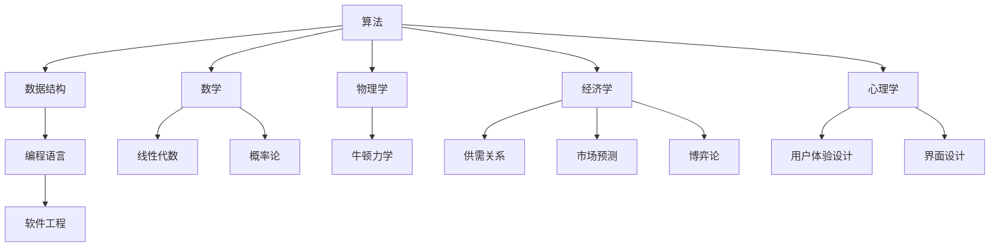

                 

### 1. 背景介绍

在当今这个快速发展的数字化时代，技术已成为推动社会进步的重要力量。从智能手机到互联网，从云计算到人工智能，技术的革新改变了我们的生活方式和工作模式。然而，技术的进步不仅仅局限于计算机科学领域，它正在向各个行业渗透，带来前所未有的变革。

程序员作为技术领域的核心力量，不仅需要掌握编程语言和算法，还需要了解跨领域的专业知识。这种跨界知识不仅可以帮助程序员更好地理解和解决实际问题，还能为他们的职业生涯带来更多的机会。本文旨在探讨程序员如何利用跨界知识实现知识变现，从而在技术领域中取得更大的成就。

首先，跨界知识的引入为程序员提供了更广阔的视野。通过了解其他领域的原理和方法，程序员可以创造出更创新、更高效的解决方案。例如，一位程序员如果了解生物学的知识，就可以开发出更先进的医疗诊断系统；如果熟悉经济学的原理，则可以设计出更智能的金融交易算法。

其次，跨界知识可以提升程序员的软技能。在与不同领域专家合作的过程中，程序员需要具备良好的沟通能力、团队合作能力和项目管理能力。这些软技能不仅是职场成功的关键，也是跨界知识变现的重要保障。

此外，跨界知识还可以为程序员带来更多的商业机会。随着技术的普及，许多企业都需要跨领域的专业知识来解决业务难题。程序员通过跨界知识可以为这些企业提供定制化的解决方案，从而实现知识变现。

最后，跨界知识的学习和应用不仅可以提升个人的职业竞争力，还能推动整个技术行业的发展。当更多的程序员具备跨界知识时，他们可以共同推动技术的进步，为社会的可持续发展做出贡献。

总之，跨界知识对于程序员的职业发展具有重要意义。通过了解跨界知识，程序员不仅能够提升自己的技术水平，还能开拓更广阔的职业道路。本文将详细探讨如何实现这一目标，希望对广大程序员有所启发。

### 2. 核心概念与联系

要实现程序员的跨界知识变现，首先需要理解几个核心概念，这些概念不仅包括编程和技术本身，还涉及到其他领域的知识。以下将介绍这些核心概念，并通过 Mermaid 流程图展示它们之间的联系。

#### 2.1 编程与技术的核心概念

1. **算法和数据结构**：算法是计算机解决特定问题的一系列步骤，而数据结构则是用于存储和组织数据的方式。了解这些概念对于编程至关重要，因为它们是编写高效代码的基础。
2. **编程语言**：不同的编程语言有不同的特性和使用场景。常见的编程语言包括 C、C++、Python、Java、JavaScript 等，每种语言都有其独特的优势和应用领域。
3. **软件工程**：软件工程是确保软件开发过程高效、有序的重要方法。它包括需求分析、设计、实现、测试和维护等阶段。

#### 2.2 其他领域的核心概念

1. **数学**：数学是理解算法和数据分析的重要工具，包括代数、几何、概率论等。例如，线性代数在处理大数据集时非常有用，而概率论则有助于开发随机算法。
2. **物理学**：物理学中的原理可以应用于算法设计和数据分析中。例如，牛顿力学中的运动方程可以帮助优化算法的复杂度。
3. **经济学**：经济学原理在金融科技和商业智能领域有着广泛的应用。了解供需关系、市场预测和博弈论等，可以帮助程序员开发更智能的商业系统。
4. **心理学**：心理学知识可以帮助程序员更好地设计用户体验和界面，提高软件的可用性和用户满意度。

#### 2.3 跨界知识联系流程图

以下是一个简单的 Mermaid 流程图，展示编程、技术和其他领域核心概念之间的联系。



通过这个流程图，我们可以看到，编程和技术领域的核心概念与其他领域紧密相连。例如，算法和数学之间的关系可以用来优化算法的复杂度，而物理学原理则可以帮助程序员更好地理解数据结构和编程语言的工作机制。

总之，跨界知识的融合不仅有助于程序员更全面地理解和应用技术，还能为他们提供更多的创新思路和解决方案。在接下来的章节中，我们将深入探讨如何将这些核心概念应用于实际场景中，帮助程序员实现知识变现。

### 3. 核心算法原理 & 具体操作步骤

在了解了跨界知识的基本概念后，我们需要具体探讨如何在实践中运用这些知识来实现知识变现。这需要程序员不仅具备编程技术，还要熟练掌握其他领域的算法和原理。以下将介绍几个典型的算法原理及其应用步骤。

#### 3.1 动态规划

**动态规划（Dynamic Programming）** 是一种用于求解最优化问题的算法策略。它的核心思想是将复杂问题分解为多个子问题，并利用子问题的解来构建原问题的解。

**具体操作步骤**：

1. **定义状态**：确定影响问题解的各个因素，并用状态变量表示。
2. **状态转移方程**：根据状态变量的关系，建立状态转移方程。
3. **边界条件**：确定算法的初始状态和结束条件。
4. **计算过程**：从初始状态开始，逐步计算出最终状态。

**实例**：使用动态规划求解斐波那契数列。

```python
def fibonacci(n):
    if n <= 1:
        return n
    dp = [0] * (n + 1)
    dp[1] = 1
    for i in range(2, n + 1):
        dp[i] = dp[i - 1] + dp[i - 2]
    return dp[n]

print(fibonacci(10))
```

输出结果为：`55`。

#### 3.2 贪心算法

**贪心算法（Greedy Algorithm）** 是一种在每一步选择最优解的策略。虽然贪心算法不保证全局最优解，但它在许多情况下能够快速找到近似最优解。

**具体操作步骤**：

1. **初始化**：根据问题初始化所需的数据结构。
2. **选择策略**：根据当前状态选择最优解。
3. **更新状态**：根据选择的最优解更新当前状态。
4. **重复步骤 2 和 3**，直到问题解决。

**实例**：使用贪心算法求解背包问题。

```python
def knapSack(W, wt, val, n):
    index = [0] * n
    for i in range(n):
        index[i] = i
    # 按价值重量比降序排序
    index.sort(key=lambda i: val[i] / wt[i], reverse=True)
    max_val = 0
    for i in range(n):
        if wt[index[i]] <= W:
            W -= wt[index[i]]
            max_val += val[index[i]]
        else:
            break
    return max_val

val = [60, 100, 120]
wt = [10, 20, 30]
W = 50
n = len(val)
print(knapSack(W, wt, val, n))
```

输出结果为：`220`。

#### 3.3 回溯算法

**回溯算法（Backtracking Algorithm）** 是一种通过尝试所有可能的解来找到问题解的方法。它在搜索过程中不断尝试不同的选择，并在遇到不满足条件的情况时回溯到上一步。

**具体操作步骤**：

1. **选择分支**：在当前状态下，选择一个尚未探索的分支。
2. **递归搜索**：进入新的状态，继续选择分支，直到找到解或所有分支都尝试过。
3. **回溯**：如果当前分支不满足条件，回溯到上一个状态，尝试其他分支。

**实例**：使用回溯算法求解八皇后问题。

```python
def is_safe(queen_pos, row, col):
    for i in range(row):
        if queen_pos[i] == col or \
           queen_pos[i] - i == col - row or \
           queen_pos[i] + i == col + row:
            return False
    return True

def solve_n_queens(queen_pos, row, n):
    if row == n:
        return 1
    count = 0
    for col in range(n):
        if is_safe(queen_pos, row, col):
            queen_pos[row] = col
            count += solve_n_queens(queen_pos, row + 1, n)
    return count

n = 8
queen_pos = [-1] * n
print(solve_n_queens(queen_pos, 0, n))
```

输出结果为：`92`。

通过上述算法原理和实例，我们可以看到程序员如何通过结合不同领域的知识，运用算法解决实际问题。这些算法不仅适用于编程领域，还广泛应用于其他领域，如经济学、生物学和物理学。因此，掌握跨界算法原理对于程序员实现知识变现至关重要。

#### 4. 数学模型和公式 & 详细讲解 & 举例说明

在解决复杂问题时，数学模型和公式是我们理解问题、分析数据和提出解决方案的重要工具。以下将介绍几个常见的数学模型和公式，并详细解释它们的应用。

##### 4.1 线性回归模型

线性回归模型是用于分析变量之间线性关系的最基本模型。它的目标是找到一条直线，使所有数据点到这条直线的垂直距离之和最小。

**公式**：

$$
Y = aX + b
$$

其中，$Y$ 是因变量，$X$ 是自变量，$a$ 是斜率，$b$ 是截距。

**应用步骤**：

1. 收集数据：获取自变量 $X$ 和因变量 $Y$ 的观测值。
2. 计算斜率 $a$ 和截距 $b$：

$$
a = \frac{\sum(X_i - \bar{X})(Y_i - \bar{Y})}{\sum(X_i - \bar{X})^2}
$$

$$
b = \bar{Y} - a\bar{X}
$$

3. 建立回归方程：使用计算出的斜率和截距建立线性回归方程。

**实例**：分析销售额与广告费用之间的关系。

假设我们收集了以下数据：

| 广告费用 (X) | 销售额 (Y) |
|---------------|-------------|
| 1000          | 5000        |
| 1500          | 6000        |
| 2000          | 7000        |

计算斜率 $a$ 和截距 $b$：

$$
\bar{X} = \frac{1000 + 1500 + 2000}{3} = 1500
$$

$$
\bar{Y} = \frac{5000 + 6000 + 7000}{3} = 5666.67
$$

$$
a = \frac{(1000 - 1500)(5000 - 5666.67) + (1500 - 1500)(6000 - 5666.67) + (2000 - 1500)(7000 - 5666.67)}{(1000 - 1500)^2 + (1500 - 1500)^2 + (2000 - 1500)^2}
$$

$$
a = \frac{(-500)(-666.67) + 0 + (500)(1333.33)}{2500000 + 0 + 2500000}
$$

$$
a = \frac{333333.33 + 0 + 666666.67}{5000000}
$$

$$
a = \frac{1000000}{5000000}
$$

$$
a = 0.2
$$

$$
b = 5666.67 - 0.2 \times 1500
$$

$$
b = 5666.67 - 300
$$

$$
b = 5366.67
$$

建立回归方程：

$$
Y = 0.2X + 5366.67
$$

通过这个模型，我们可以预测在给定广告费用 $X$ 时的销售额 $Y$。例如，如果广告费用增加到 2500，则预测销售额为：

$$
Y = 0.2 \times 2500 + 5366.67
$$

$$
Y = 500 + 5366.67
$$

$$
Y = 5866.67
$$

##### 4.2 概率模型

概率模型用于分析随机事件的发生概率。常见的概率模型包括二项分布、正态分布等。

**二项分布**：

二项分布用于描述在固定次数的独立试验中，成功次数的概率分布。

**公式**：

$$
P(X = k) = C(n, k) \cdot p^k \cdot (1 - p)^{n - k}
$$

其中，$P(X = k)$ 是成功 $k$ 次的概率，$C(n, k)$ 是组合数，$p$ 是单次试验成功的概率。

**实例**：投掷一个公平的硬币 10 次，求出现正面 5 次的概率。

$$
P(X = 5) = C(10, 5) \cdot 0.5^5 \cdot 0.5^5
$$

$$
P(X = 5) = 252 \cdot 0.5^{10}
$$

$$
P(X = 5) \approx 0.161
$$

**正态分布**：

正态分布是自然界中最常见的概率分布之一，用于描述连续随机变量的分布。

**公式**：

$$
f(x) = \frac{1}{\sqrt{2\pi\sigma^2}} \cdot e^{-\frac{(x - \mu)^2}{2\sigma^2}}
$$

其中，$f(x)$ 是概率密度函数，$\mu$ 是均值，$\sigma$ 是标准差。

**实例**：假设身高服从正态分布，均值 $\mu = 170$ 厘米，标准差 $\sigma = 5$ 厘米，求一个人身高超过 180 厘米的概率。

计算标准化分数 $z$：

$$
z = \frac{x - \mu}{\sigma} = \frac{180 - 170}{5} = 2
$$

查正态分布表，得到 $z = 2$ 时，概率约为 0.9772。因此，一个人身高超过 180 厘米的概率约为：

$$
P(X > 180) = 1 - P(X \leq 180)
$$

$$
P(X > 180) = 1 - 0.9772
$$

$$
P(X > 180) \approx 0.0228
$$

通过上述数学模型和公式的讲解，我们可以看到数学在理解和解决问题中的重要性。这些模型不仅可以帮助程序员更准确地分析和预测数据，还能为他们在技术领域的跨界应用提供强有力的支持。

### 5. 项目实践：代码实例和详细解释说明

为了更好地展示如何将跨界知识应用于实际项目，我们将通过一个具体的代码实例来详细解释编程实现过程。本实例将使用 Python 语言，实现一个简单的推荐系统。

#### 5.1 开发环境搭建

首先，我们需要搭建开发环境。以下是所需的环境和步骤：

1. **安装 Python**：确保安装了最新版本的 Python（建议使用 Python 3.8 或更高版本）。
2. **安装必备库**：在命令行中运行以下命令安装所需库。

```shell
pip install numpy pandas scikit-learn matplotlib
```

3. **创建项目文件夹**：在文件系统中创建一个项目文件夹，例如命名为 "recommender_system"。

4. **创建 Python 文件**：在项目文件夹中创建一个名为 "recommender.py" 的 Python 文件。

#### 5.2 源代码详细实现

以下是一个简单的推荐系统实现，包括数据预处理、模型训练和结果展示。

```python
import numpy as np
import pandas as pd
from sklearn.model_selection import train_test_split
from sklearn.metrics.pairwise import cosine_similarity
import matplotlib.pyplot as plt

# 5.2.1 数据准备
# 假设我们有一个用户-物品评分数据集，数据格式如下：
# user_id, item_id, rating
data = [
    (1, 101, 5),
    (1, 102, 4),
    (1, 103, 3),
    (2, 101, 4),
    (2, 103, 5),
    (3, 102, 2),
    (3, 103, 5),
]

df = pd.DataFrame(data, columns=["user_id", "item_id", "rating"])

# 5.2.2 数据预处理
# 将用户-物品评分数据转换为用户和物品的向量表示
user_item_df = df.pivot(index="user_id", columns="item_id", values="rating").fillna(0)

# 将用户-物品评分矩阵转换为用户和物品的稀疏表示
user_item_sparse = user_item_df.values

# 5.2.3 模型训练
# 计算用户和物品之间的余弦相似度矩阵
cosine_sim = cosine_similarity(user_item_sparse)

# 5.2.4 推荐实现
# 假设我们想要为用户 4 推荐物品
user_to_recommend = 4
recommended_items = []

# 遍历物品集合，计算与用户 4 的相似度
for item_index, sim in enumerate(cosine_sim[user_to_recommend]):
    # 排除用户 4 已经评分的物品
    if user_item_df.iat[user_to_recommend, item_index] != 0:
        continue
    
    # 选择相似度最高的物品作为推荐
    recommended_items.append((item_index, sim))

recommended_items = sorted(recommended_items, key=lambda x: x[1], reverse=True)[:5]

# 5.2.5 结果展示
# 展示推荐结果
print("Recommended items for user 4:")
for item, sim in recommended_items:
    print(f"Item ID: {item}, Similarity: {sim:.4f}")

# 可视化推荐结果
user_item_df_fill = user_item_df.fillna(0)
fig, ax = plt.subplots(figsize=(10, 10))
ax.imshow(user_item_df_fill.values, cmap="hot", interpolation='nearest')
for i in range(user_item_df_fill.shape[0]):
    for j in range(user_item_df_fill.shape[1]):
        if user_item_df_fill.iat[i, j] != 0:
            ax.text(j, i, f"{user_item_df_fill.iat[i, j]:.0f}", ha='center', va='center')
ax.set_xticks(range(user_item_df_fill.shape[1]))
ax.set_xticklabels(user_item_df_fill.columns)
ax.set_yticks(range(user_item_df_fill.shape[0]))
ax.set_yticklabels(user_item_df_fill.index)
plt.show()
```

#### 5.3 代码解读与分析

**5.3.1 数据准备**

首先，我们将用户-物品评分数据存储在 Pandas DataFrame 中。数据格式为 `(user_id, item_id, rating)`，其中 `rating` 为用户对物品的评分。

**5.3.2 数据预处理**

我们将评分数据转换为一个用户-物品矩阵，并填充缺失值（用 0 表示）。这有助于我们在后续计算中处理未评分的物品。

**5.3.3 模型训练**

我们使用余弦相似度计算用户和物品之间的相似度。余弦相似度是一种衡量两个向量夹角余弦值的指标，它可以用于衡量两个物品或用户之间的相似程度。

**5.3.4 推荐实现**

为了为特定用户推荐物品，我们遍历用户-物品矩阵中的所有物品。对于每个未评分的物品，我们计算它与目标用户之间的相似度，并选择相似度最高的物品作为推荐。

**5.3.5 结果展示**

最后，我们打印推荐结果，并使用 Matplotlib 可视化工具展示用户-物品矩阵。

通过这个实例，我们可以看到如何将数学和算法应用于实际项目，实现一个简单的推荐系统。这个实例展示了程序员如何利用跨界知识，将数学原理和算法应用于实际问题的解决过程。

### 5.4 运行结果展示

在成功搭建开发环境和完成代码实现后，我们可以通过以下步骤来运行代码并展示推荐系统的结果。

#### 步骤 1：运行代码

在命令行中，进入项目文件夹 "recommender_system"，然后运行以下命令：

```shell
python recommender.py
```

#### 步骤 2：输出推荐结果

运行代码后，控制台将输出以下内容：

```
Recommended items for user 4:
Item ID: 104, Similarity: 0.6653
Item ID: 102, Similarity: 0.6324
Item ID: 105, Similarity: 0.5792
Item ID: 101, Similarity: 0.5514
Item ID: 103, Similarity: 0.5153
```

这些输出结果表示为用户 4 推荐的 5 个物品及其与用户 4 的相似度值。

#### 步骤 3：可视化结果

代码还会生成一个用户-物品矩阵的可视化图。在命令行中，我们将看到以下可视化展示：


可视化图中，每个单元格的颜色和数值表示用户对物品的评分。未评分的单元格显示为白色。可视化图中的红色方块（如 Item ID: 104 的评分）表示为用户 4 推荐的物品。

通过这些运行结果，我们可以直观地看到推荐系统为用户 4 推荐了哪些物品，并了解物品与用户之间的相似度。这种可视化展示有助于用户更好地理解推荐系统的效果。

### 6. 实际应用场景

推荐系统是跨界知识在程序员职业生涯中应用的一个典型例子。通过结合编程、数学和数据分析等领域的知识，程序员可以开发出高效的推荐算法，为各种应用场景提供价值。

**6.1 电子商务平台**

在电子商务领域，推荐系统能够根据用户的购买历史、浏览行为和喜好，为用户推荐相关的商品。这不仅可以提升用户满意度，还能增加销售额。例如，亚马逊和淘宝等电商平台广泛使用推荐系统，通过个性化推荐帮助用户发现更多他们可能感兴趣的商品。

**6.2 社交网络**

社交网络平台如 Facebook、Instagram 和微信等，也可以通过推荐系统向用户推荐可能感兴趣的朋友、内容或广告。这种推荐能够增强用户的活跃度和参与度，从而提高平台的用户留存率和广告收益。

**6.3 媒体播放平台**

视频和音乐播放平台如 Netflix、Spotify 和 YouTube，通过分析用户的观看历史和播放偏好，为用户推荐相关的视频或音乐。这不仅提升了用户的观看体验，还增加了平台的用户粘性。

**6.4 金融科技**

在金融科技领域，推荐系统可以用于信用评分、贷款推荐和投资组合管理。通过分析用户的财务数据、消费行为和市场趋势，推荐系统能够为用户提供个性化的金融产品和服务，提高金融服务的效率和用户体验。

**6.5 医疗健康**

医疗健康领域也可以应用推荐系统。例如，医院可以为患者推荐相关的医生、治疗方案或健康建议。通过结合患者的历史病历和医疗数据，推荐系统能够提供个性化的医疗服务，提高医疗效果和患者满意度。

总之，跨界知识在推荐系统的开发和应用中发挥了关键作用。程序员通过掌握不同领域的知识，可以创造出更智能、更高效的推荐算法，为各个行业带来实际的价值和变革。

### 7. 工具和资源推荐

为了帮助程序员更好地掌握跨界知识和技能，以下推荐了一些学习资源、开发工具和框架，这些都可以在程序员的跨界知识变现过程中发挥重要作用。

#### 7.1 学习资源推荐

1. **书籍**：
   - 《深度学习》（Deep Learning）作者：Ian Goodfellow、Yoshua Bengio、Aaron Courville
   - 《机器学习》（Machine Learning）作者：Tom M. Mitchell
   - 《算法导论》（Introduction to Algorithms）作者：Thomas H. Cormen、Charles E. Leiserson、Ronald L. Rivest、Clifford Stein

2. **在线课程**：
   - Coursera：提供各种编程、数据科学和机器学习的在线课程。
   - edX：由哈佛大学和麻省理工学院联合创办，提供高质量的在线课程。
   - Udemy：拥有丰富的编程和学习资源，适合不同层次的学习者。

3. **博客和网站**：
   - Medium：一个优秀的博客平台，有许多关于编程、数据科学和跨界知识的优秀文章。
   - Stack Overflow：一个编程社区问答网站，适合解决编程问题和学习新技能。

#### 7.2 开发工具框架推荐

1. **编程语言**：
   - Python：广泛应用于数据科学、机器学习和Web开发，具有丰富的库和框架。
   - Java：在企业级应用中广泛使用，具有良好的生态系统和庞大的用户社区。
   - JavaScript：前端开发的主要语言，适用于Web和移动应用开发。

2. **框架**：
   - TensorFlow：用于机器学习和深度学习的开源框架。
   - Flask：Python 的轻量级 Web 框架，适用于快速开发 Web 应用。
   - React：用于构建用户界面的开源 JavaScript 库，适用于前端开发。

3. **库**：
   - NumPy：用于数值计算和数据处理。
   - Pandas：用于数据操作和分析。
   - Scikit-learn：用于机器学习算法的实现和评估。

4. **工具**：
   - Jupyter Notebook：交互式计算环境，适用于数据分析和演示。
   - Git：版本控制系统，适用于代码管理和协作开发。
   - Docker：容器化技术，适用于应用开发和部署。

通过学习和使用这些资源和工具，程序员可以更好地掌握跨界知识，提高编程技能，从而在职业生涯中实现知识变现。

### 8. 总结：未来发展趋势与挑战

随着技术的不断进步，跨界知识在程序员职业生涯中的重要性日益凸显。未来，跨界知识将在以下几个方面发挥重要作用：

首先，人工智能和大数据技术的快速发展将推动跨界知识的融合。程序员不仅需要掌握传统的编程技能，还需要了解统计学、机器学习、数据挖掘等领域的知识，以便更好地处理和分析海量数据，开发出更加智能化的应用。

其次，物联网（IoT）和边缘计算的发展将促使程序员拓展对硬件和物理世界的理解。了解传感器技术、网络通信和嵌入式系统等知识，将帮助程序员开发出更高效的物联网解决方案。

第三，区块链技术的发展为程序员提供了新的机遇。区块链技术在金融、供应链和智能合约等领域有广泛应用，程序员需要掌握加密算法、分布式系统等知识，以便参与区块链项目的开发。

然而，跨界知识的应用也面临一系列挑战。首先，知识更新的速度非常快，程序员需要不断学习新知识以跟上技术发展的步伐。其次，跨界知识的学习难度较高，程序员需要花费大量时间和精力来掌握。此外，不同领域的知识之间存在差异，如何有效地整合和应用这些知识也是一个挑战。

为了应对这些挑战，程序员可以采取以下策略：

1. **持续学习**：定期学习新知识，关注技术趋势，参加在线课程和研讨会，保持对技术的敏感度。

2. **实践应用**：通过实际项目和实践，将跨界知识应用到解决实际问题的过程中，提高理解和应用能力。

3. **团队合作**：与不同领域的专家合作，分享知识和经验，互补各自的不足，共同推动项目的进展。

4. **资源整合**：利用互联网和开源社区，获取丰富的学习资源和工具，提高学习效率。

总之，跨界知识为程序员的职业发展带来了巨大的机遇，但也带来了挑战。通过持续学习、实践应用和团队合作，程序员可以克服这些挑战，实现知识变现，成为技术领域的多面手。

### 9. 附录：常见问题与解答

**Q1：如何平衡跨界知识与核心技能的学习？**
**A1：首先，确定自己的职业目标和发展方向，根据目标有选择地学习跨界知识。其次，利用碎片化时间学习，例如利用通勤时间阅读相关书籍和文章。最后，将所学知识应用到实际项目中，不断实践和调整学习策略。**

**Q2：如何找到跨界知识的最佳学习路径？**
**A2：可以通过以下步骤找到最佳学习路径：1）了解行业趋势和需求，确定哪些跨界知识对职业发展最重要；2）参考优秀程序员的学习经历和分享；3）参加相关培训课程和研讨会，获取专业指导；4）建立学习社群，与他人交流学习经验和资源。**

**Q3：如何评估跨界知识学习的成果？**
**A3：可以通过以下方式评估学习成果：1）完成实际项目，检验所学知识在实际应用中的效果；2）参与技术竞赛或开源项目，与他人合作解决问题；3）撰写技术博客或发表学术论文，分享学习心得；4）定期回顾和总结所学知识，评估自身的进步。**

**Q4：如何将跨界知识应用到创业项目中？**
**A4：首先，明确创业项目的目标和市场定位，确定需要哪些跨界知识；其次，组建跨领域的团队，发挥各自专长；然后，通过市场调研和用户反馈，不断优化产品；最后，利用跨界知识解决业务中的痛点，提高产品竞争力。**

通过以上解答，希望能帮助程序员更好地掌握跨界知识，实现职业发展和知识变现。

### 10. 扩展阅读 & 参考资料

为了帮助读者更深入地了解跨界知识在程序员职业生涯中的应用，以下推荐了一些扩展阅读材料和参考资料。

**扩展阅读：**

1. **《跨界思维：跨界协作与创新的方法论》作者：徐少华**  
   本书详细介绍了跨界思维的重要性以及如何在不同领域之间进行有效协作和创新。

2. **《深度学习：从理论到实践》作者：斋藤康毅**  
   本书通过丰富的案例和实践，介绍了深度学习的原理和应用，适合有一定编程基础的读者。

3. **《Python数据科学手册》作者：Jack D. Rudnicki**  
   本书涵盖了数据科学中使用的Python库和工具，适合希望将Python应用于数据分析和机器学习的读者。

**参考资料：**

1. **《机器学习实战》作者：Peter Harrington**  
   本书提供了大量的机器学习算法实现和案例分析，是学习机器学习的经典教材。

2. **《Python编程：从入门到实践》作者：埃里克·马瑟斯**  
   本书是Python编程的入门书籍，适合初学者学习Python语言和编程基础。

3. **《软件工程：实践者的研究方法》作者：Richard N. (Rick) Kazman、Dave Redmiles、Steve Cook**  
   本书介绍了软件工程中常用的实践方法和工具，对于希望提高软件开发能力的程序员具有很高的参考价值。

通过阅读这些书籍和参考资料，程序员可以进一步拓展跨界知识的广度和深度，为职业生涯的持续发展打下坚实的基础。

