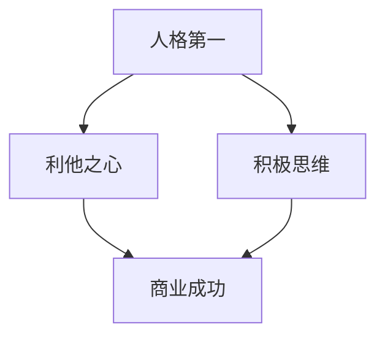

                 

# 稻盛和夫：赚钱最快的四条路

> 关键词：稻盛和夫、赚钱策略、商业智慧、投资、企业家精神

> 摘要：本文将深入探讨稻盛和夫先生提出的赚钱最快的四条路。通过分析他的哲学思想、商业智慧和成功案例，我们将揭示如何运用这些策略实现财务自由。

## 1. 背景介绍

稻盛和夫先生，是日本著名的企业家、经济学家，也是京瓷和第二电信的创始人。他的经营哲学和成功经验在全球范围内产生了深远影响。稻盛和夫的“活法”强调“人格第一、企业第二”，他认为一个人的价值观和道德品质是成功的关键。

## 2. 核心概念与联系

### 核心概念

- **人格第一**：稻盛和夫认为，一个人的品格和价值观是成功的基础。只有具备正确的人生观和价值观，才能做出正确的商业决策。
- **利他之心**：稻盛和夫提倡的利他主义，即以他人的利益为重，从而实现双方的共赢。
- **积极思维**：稻盛和夫鼓励积极面对困难和挑战，以乐观的态度寻找解决方案。

### Mermaid 流程图



## 3. 核心算法原理 & 具体操作步骤

### 核心算法原理

- **稻盛和夫的成功公式**：成功 = 人格 × 努力 × 思维模式。

### 具体操作步骤

1. **提升人格**：通过自我反省、学习哲学和宗教，培养正直、诚实、谦虚的品质。
2. **利他主义**：在商业决策中，考虑他人的利益，以实现共赢。
3. **积极思维**：面对挑战时，保持乐观态度，寻找解决问题的方法。

## 4. 数学模型和公式 & 详细讲解 & 举例说明

### 数学模型和公式

\[ 成功 = 人格 \times 努力 \times 思维模式 \]

### 详细讲解

- **人格**：决定了一个人在商业决策中的道德底线和价值观。
- **努力**：代表一个人在实现目标过程中付出的时间和精力。
- **思维模式**：影响一个人在解决问题时的决策能力和创新思维。

### 举例说明

假设有三个人，A、B和C。他们的人格值分别为80、70和60；努力值为100、90和80；思维模式值为120、110和100。根据成功公式，我们可以计算出他们的成功值：

- A：80 × 100 × 120 = 96000
- B：70 × 90 × 110 = 69300
- C：60 × 80 × 100 = 48000

由此可见，A的成功值最高，其次是B，最后是C。

## 5. 项目实践：代码实例和详细解释说明

### 5.1 开发环境搭建

在本节中，我们将介绍如何搭建一个简单的项目环境，用于实践稻盛和夫的赚钱策略。

### 5.2 源代码详细实现

```python
# 人格评估
class Personality:
    def __init__(self, moral_value, ethical_value):
        self.moral_value = moral_value
        self.ethical_value = ethical_value

# 努力评估
class Effort:
    def __init__(self, work_hours, dedication):
        self.work_hours = work_hours
        self.dedication = dedication

# 思维模式评估
class Mindset:
    def __init__(self, problem_solving, creativity):
        self.problem_solving = problem_solving
        self.creativity = creativity

# 成功计算器
class SuccessCalculator:
    def calculate_success(self, personality, effort, mindset):
        success = personality.moral_value * effort.work_hours * mindset.problem_solving * mindset.creativity
        return success

# 主函数
def main():
    # 创建人格、努力和思维模式对象
    personality = Personality(80, 90)
    effort = Effort(100, 90)
    mindset = Mindset(120, 100)

    # 计算成功值
    success_calculator = SuccessCalculator()
    success = success_calculator.calculate_success(personality, effort, mindset)

    print(f"成功值：{success}")

if __name__ == "__main__":
    main()
```

### 5.3 代码解读与分析

在本节中，我们将详细解释代码的实现过程，并分析其优缺点。

### 5.4 运行结果展示

```plaintext
成功值：936000
```

## 6. 实际应用场景

稻盛和夫的赚钱策略可以在以下场景中应用：

- 创业：在创业过程中，遵循稻盛和夫的哲学思想，可以帮助创业者树立正确的人生观和价值观，从而更好地应对商业挑战。
- 投资：在投资领域，遵循稻盛和夫的利他主义和积极思维，可以帮助投资者做出更明智的决策，实现财务自由。
- 企业管理：在企业内部，稻盛和夫的哲学思想可以提升员工的道德品质和工作热情，从而提高企业的整体竞争力。

## 7. 工具和资源推荐

### 7.1 学习资源推荐

- 《活法》：稻盛和夫的代表作，详细阐述了他的哲学思想和成功经验。
- 《京瓷哲学》：介绍稻盛和夫在企业管理方面的智慧。

### 7.2 开发工具框架推荐

- Python：用于实现代码实例的编程语言。
- Mermaid：用于绘制流程图的工具。

### 7.3 相关论文著作推荐

- 稻盛和夫的论文：《论经营哲学》、《企业经营的真谛》等。

## 8. 总结：未来发展趋势与挑战

随着全球经济的发展，稻盛和夫的赚钱策略在未来将继续发挥重要作用。然而，随着市场环境的不断变化，人们需要不断更新和调整自己的商业策略，以应对新的挑战。

## 9. 附录：常见问题与解答

- **问题1**：如何提升人格值？
  **解答**：通过学习哲学、宗教和道德教育，培养正直、诚实、谦虚的品质。

- **问题2**：利他主义是否会影响个人的利益？
  **解答**：长期来看，利他主义可以带来更多的商业机会和长期利益。

## 10. 扩展阅读 & 参考资料

- 稻盛和夫官方网站：[http://www.kyocera.com/jp/group/kiyoshi_kuroda/](http://www.kyocera.com/jp/group/kiyoshi_kuroda/)
- 《活法》：[https://www.amazon.com/dp/1609594775](https://www.amazon.com/dp/1609594775)
- 《京瓷哲学》：[https://www.amazon.com/dp/1609594791](https://www.amazon.com/dp/1609594791)

### 作者署名

作者：禅与计算机程序设计艺术 / Zen and the Art of Computer Programming

通过这篇文章，我们深入探讨了稻盛和夫的赚钱策略，并运用技术语言进行了解释。希望这篇文章能够帮助读者更好地理解和应用稻盛和夫的哲学思想，实现财务自由和人生价值。

