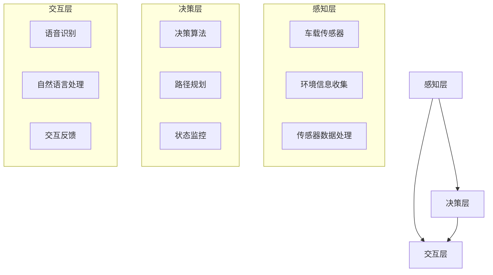
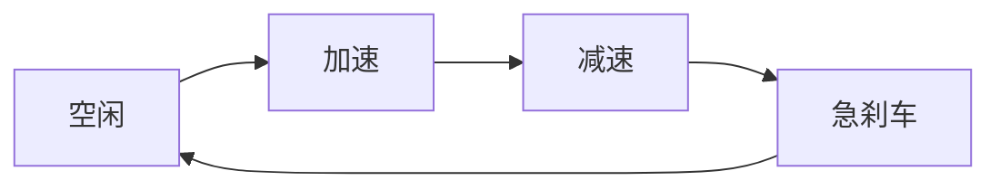
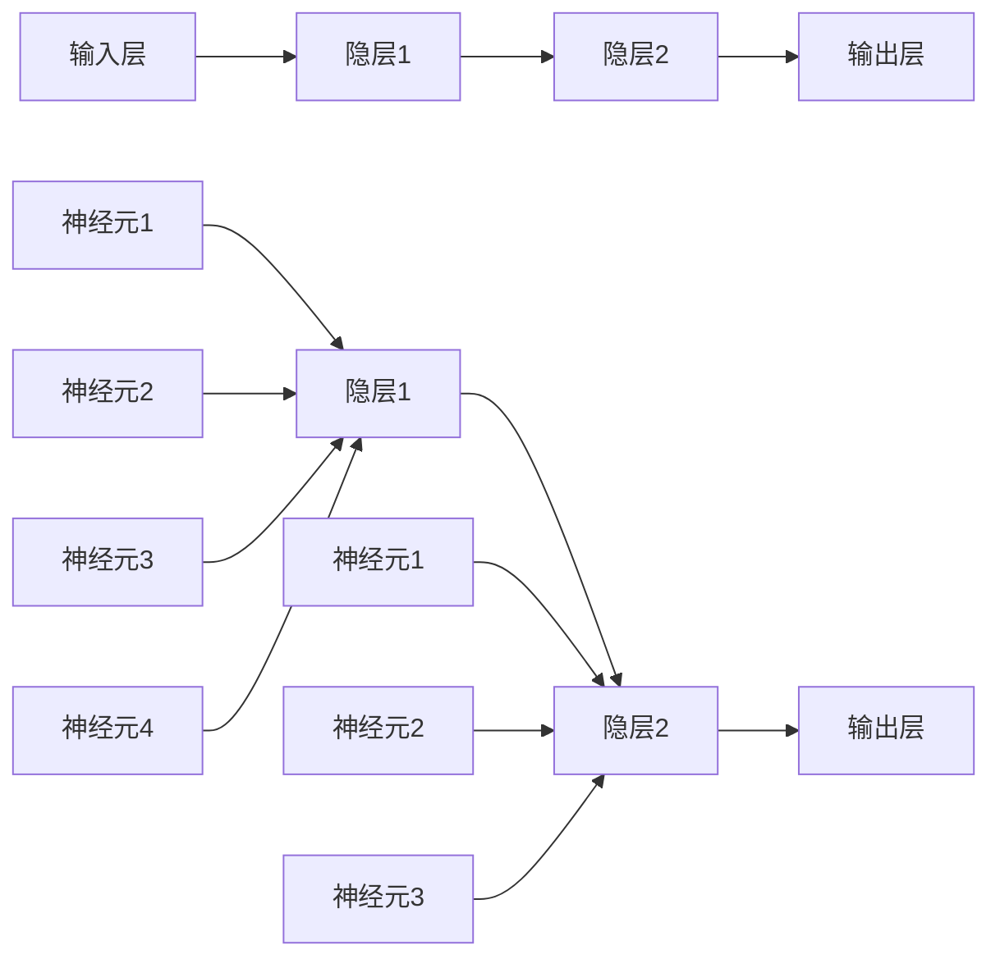
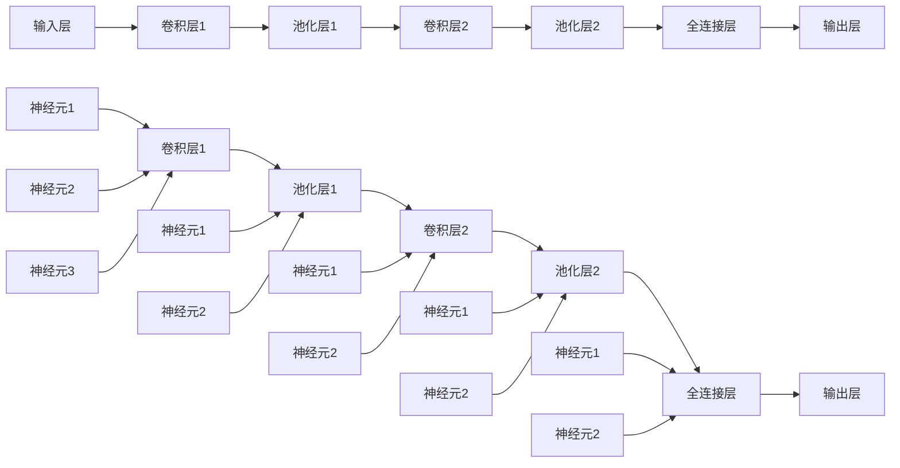

                 

### 1. 背景介绍

端到端自动驾驶系统作为现代智能交通系统的重要组成部分，正逐步从理论走向实践。自动驾驶技术不仅能够显著提升交通安全性和效率，还具备改变未来出行方式的潜力。然而，随着自动驾驶技术的快速发展，如何确保自动驾驶车辆在复杂多变的交通环境中安全、可靠地运行，成为当前研究的热点和难点。

在人机交互领域，自动驾驶车辆需要具备与驾驶员和其他交通参与者进行有效沟通的能力。传统的车载交互系统主要依赖于语音和视觉信号，但它们在处理复杂、模糊或意外情况时往往表现不佳。因此，设计一种智能、高效的车载人机交互系统，成为实现自动驾驶技术全面落地的重要一环。

车载人机交互设计的核心目标是提升用户体验，确保驾驶员在自动驾驶过程中能够轻松、自然地与车辆交互，及时获取车辆状态信息，做出合理反应。这不仅要求车载系统能够精准地理解驾驶员的意图，还需具备自适应交互的能力，以适应不同的驾驶场景和用户需求。

本文旨在探讨端到端自动驾驶背景下车载人机交互设计的关键技术和实现方法。通过分析现有技术的优缺点，我们提出了一种综合性的车载人机交互设计框架，并详细介绍其核心组件和工作原理。此外，本文还将通过具体的算法原理、数学模型和项目实践案例，展示如何将理论转化为实际应用，从而为自动驾驶技术的进一步发展提供有益的参考。

总的来说，本文将从以下几个方面展开讨论：

1. **核心概念与联系**：介绍车载人机交互系统的基本概念，并给出其与传统车载交互系统的区别。
2. **核心算法原理 & 具体操作步骤**：详细讲解实现车载人机交互的关键算法，包括语音识别、自然语言处理、行为预测等。
3. **数学模型和公式 & 详细讲解 & 举例说明**：分析车载人机交互过程中的数学模型，包括概率模型、神经网络模型等，并给出具体的应用实例。
4. **项目实践：代码实例和详细解释说明**：展示一个具体的端到端自动驾驶车载人机交互项目，包括环境搭建、代码实现、运行结果分析等。
5. **实际应用场景**：探讨车载人机交互系统在不同驾驶场景中的具体应用，分析其优势和挑战。
6. **工具和资源推荐**：推荐相关的学习资源、开发工具和框架，以帮助读者深入了解和实现车载人机交互系统。
7. **总结：未来发展趋势与挑战**：总结本文的主要观点，展望车载人机交互系统的未来发展趋势，并讨论面临的挑战。

通过对以上各部分的详细探讨，本文希望能够为端到端自动驾驶的车载人机交互设计提供全面、深入的理论和实践指导。

### 2. 核心概念与联系

#### 车载人机交互系统的基本概念

车载人机交互系统是指通过计算机、传感器、语音识别、自然语言处理等技术和设备，实现自动驾驶车辆与驾驶员之间高效、自然的交互。其核心目标是确保驾驶员在自动驾驶过程中能够及时、准确地获取车辆状态信息，并做出合理的反应，从而提高驾驶安全性、舒适性和便利性。

车载人机交互系统通常包括以下几个关键组件：

1. **感知模块**：通过车载传感器（如摄像头、雷达、激光雷达等）获取车辆周围的环境信息，包括交通状况、道路标志、行人等。
2. **决策模块**：利用感知模块收集的信息，结合车载计算单元，对车辆行驶路径、速度等进行决策，确保车辆在复杂交通环境中安全行驶。
3. **交互模块**：通过语音识别、自然语言处理等技术，实现驾驶员与车辆的语音和文字交互，提供导航、提醒、控制等功能。

与传统车载交互系统相比，车载人机交互系统具有以下显著特点：

- **智能化**：传统车载交互系统主要依赖于固定的菜单和按键操作，而车载人机交互系统则能够根据驾驶员的语音指令或自然语言输入，动态地响应和调整交互方式。
- **自然性**：传统车载交互系统在处理复杂、模糊或意外情况时往往表现不佳，而车载人机交互系统则能够通过自然语言处理技术，理解驾驶员的意图，提供更加人性化的服务。
- **适应性**：传统车载交互系统通常固定在某个特定的车辆或驾驶场景中，而车载人机交互系统则能够根据不同的驾驶环境和用户需求，自适应地调整交互方式和功能。

#### 车载人机交互系统的架构

车载人机交互系统的架构通常包括感知层、决策层和交互层三个主要部分。以下是一个简化的车载人机交互系统架构图，用 Mermaid 流程图来展示其基本组成部分：



在这个架构中：

- **感知层**：包括车载传感器、环境信息收集和传感器数据处理。这一层负责获取车辆周围的环境信息，并将这些信息转换为计算机可以处理的数字信号。
- **决策层**：包括决策算法、路径规划和状态监控。这一层利用感知层提供的信息，对车辆行驶路径、速度等进行决策，并监控车辆的状态，确保驾驶安全。
- **交互层**：包括语音识别、自然语言处理和交互反馈。这一层负责实现驾驶员与车辆的语音和文字交互，为驾驶员提供实时的导航、提醒和控制功能。

通过以上核心概念和架构的介绍，我们可以看到车载人机交互系统在端到端自动驾驶中的关键作用。接下来，本文将详细探讨实现这一系统所需的核心算法原理、数学模型和项目实践，以期为读者提供全面的指导。

### 3. 核心算法原理 & 具体操作步骤

实现车载人机交互系统，关键在于核心算法的选择和应用。以下是几种主要的核心算法及其具体操作步骤：

#### 3.1 语音识别算法

语音识别是车载人机交互系统的第一步，它负责将驾驶员的语音转换为文本。以下是一个简化的语音识别算法流程：

1. **声音采集**：通过车载麦克风采集驾驶员的语音信号。
2. **预处理**：对语音信号进行降噪、分帧和特征提取，如梅尔频率倒谱系数（MFCC）。
3. **模型训练**：使用大量的语音数据集训练深度神经网络模型，如循环神经网络（RNN）或卷积神经网络（CNN）。
4. **模型推理**：将预处理后的语音信号输入到训练好的模型中，得到文本输出。

具体操作步骤如下：

- **步骤1：声音采集**：使用麦克风采集语音信号。
  ```python
  import sounddevice as sd
  import numpy as np

  duration = 5  # 5秒录音
  sample_rate = 44100  # 44.1kHz采样率
  audio = sd.rec(int(duration * sample_rate), samplerate=sample_rate, channels=2)
  sd.wait()
  ```

- **步骤2：预处理**：对语音信号进行降噪、分帧和特征提取。
  ```python
  from sklearn.preprocessing import StandardScaler
  from sklearn.decomposition import PCA

  # 降噪
  audio_filtered = audio - np.mean(audio)

  # 分帧
  frame_size = 512  # 512个采样点
  hop_length = 256  # 256个采样点
  frames = np.array([audio_filtered[i:i + frame_size] for i in range(0, audio.shape[0] - frame_size, hop_length)])

  # 特征提取（例如，使用梅尔频率倒谱系数（MFCC））
  mfcc = librosa.feature.mfcc(y=frames, sr=sample_rate, n_mfcc=13)
  ```

- **步骤3：模型训练**：使用语音数据集训练深度神经网络模型。
  ```python
  from keras.models import Sequential
  from keras.layers import LSTM, Dense, Dropout

  model = Sequential()
  model.add(LSTM(128, activation='relu', input_shape=(frames.shape[1], frames.shape[2])))
  model.add(Dropout(0.5))
  model.add(Dense(frames.shape[2], activation='softmax'))
  model.compile(optimizer='adam', loss='categorical_crossentropy', metrics=['accuracy'])
  model.fit(x_train, y_train, epochs=10, batch_size=32)
  ```

- **步骤4：模型推理**：将预处理后的语音信号输入到模型中，得到文本输出。
  ```python
  def recognize_speech_audio(audio):
      mfcc = librosa.feature.mfcc(y=audio, sr=sample_rate, n_mfcc=13)
      prediction = model.predict(np.array([mfcc]))
      text = ''.join([char for char, _ in char_predictions])
      return text

  text = recognize_speech_audio(audio)
  print(text)
  ```

#### 3.2 自然语言处理算法

自然语言处理是车载人机交互系统的核心，它负责理解驾驶员的语音指令，并生成相应的响应。以下是自然语言处理的基本流程：

1. **分词**：将文本分割成单词或短语。
2. **词性标注**：为每个单词或短语标注词性，如名词、动词、形容词等。
3. **语义理解**：通过上下文和语义关系理解句子的含义。
4. **生成响应**：根据理解的结果生成合适的语音或文字响应。

具体操作步骤如下：

- **步骤1：分词**：使用现有的自然语言处理库进行分词。
  ```python
  from nltk.tokenize import word_tokenize

  text = "我想去机场"
  words = word_tokenize(text)
  print(words)
  ```

- **步骤2：词性标注**：使用词性标注库进行词性标注。
  ```python
  from nltk import pos_tag

  tagged_words = pos_tag(words)
  print(tagged_words)
  ```

- **步骤3：语义理解**：使用预训练的语义理解模型进行语义分析。
  ```python
  from transformers import pipeline

  nlp = pipeline('sentiment-analysis')
  result = nlp("我想去机场")
  print(result)
  ```

- **步骤4：生成响应**：根据理解的结果生成响应。
  ```python
  def generate_response(text):
      if "机场" in text:
          return "好的，我会为您导航到机场。"
      else:
          return "抱歉，我无法理解您的指令。"

  response = generate_response(text)
  print(response)
  ```

#### 3.3 行为预测算法

行为预测是车载人机交互系统的重要组成部分，它负责预测驾驶员的下一步操作，以便提前做出响应。以下是行为预测的基本流程：

1. **数据收集**：收集驾驶员的历史操作数据。
2. **特征提取**：从数据中提取有用的特征，如时间间隔、操作类型等。
3. **模型训练**：使用历史数据训练行为预测模型，如决策树、支持向量机或深度神经网络。
4. **行为预测**：将当前操作数据输入到模型中，得到下一步操作的概率分布。

具体操作步骤如下：

- **步骤1：数据收集**：收集驾驶员的历史操作数据。
  ```python
  data = [
      {'time': 0, 'action': '加速'},
      {'time': 10, 'action': '减速'},
      {'time': 20, 'action': '转弯'}
  ]
  ```

- **步骤2：特征提取**：从数据中提取有用的特征。
  ```python
  features = [{'time': d['time'], 'action': d['action']} for d in data]
  print(features)
  ```

- **步骤3：模型训练**：使用历史数据训练行为预测模型。
  ```python
  from sklearn.ensemble import RandomForestClassifier

  model = RandomForestClassifier()
  model.fit([d['time'] for d in features], [d['action'] for d in features])
  ```

- **步骤4：行为预测**：将当前操作数据输入到模型中，得到下一步操作的概率分布。
  ```python
  def predict_next_action(current_action):
      predicted_action = model.predict([current_action])
      print(predicted_action)
      return predicted_action

  current_action = {'time': 10, 'action': '减速'}
  predict_next_action(current_action)
  ```

通过以上核心算法的详细讲解和具体操作步骤，我们可以看到车载人机交互系统的实现需要综合运用多种技术和算法。接下来，本文将讨论车载人机交互过程中的数学模型和公式，并给出具体的应用实例。

### 4. 数学模型和公式 & 详细讲解 & 举例说明

在车载人机交互系统中，数学模型和公式是核心组成部分，它们负责描述和预测系统的行为。以下将介绍几种主要的数学模型和公式，并详细讲解其在系统中的应用。

#### 4.1 概率模型

概率模型是车载人机交互系统中常用的数学模型，用于描述不确定性事件的发生概率。以下是几种常见的概率模型：

1. **贝叶斯网络**：

贝叶斯网络是一种概率图模型，用于表示变量之间的依赖关系。它通过条件概率表（CPT）来描述每个变量在不同状态下的概率。

```latex
P(X_1, X_2, ..., X_n) = \prod_{i=1}^{n} P(X_i|X_{i-1}, ..., X_1)
```

举例说明：

假设我们有三个事件：X1（是否在行驶中）、X2（是否在雨天）、X3（是否使用雨刷）。贝叶斯网络可以表示为：


条件概率表（CPT）如下：

| 雨天 | 不雨天 |   
| :---: | :---: |   
| 行驶中 | 0.7 | 0.3 |   
| 不行驶中 | 0.2 | 0.8 |

我们可以计算每个事件的概率，如：

```latex
P(\text{使用雨刷}|\text{雨天}) = P(\text{雨天}|\text{使用雨刷}) \times \frac{P(\text{使用雨刷})}{P(\text{雨天})}
```

2. **马尔可夫模型**：

马尔可夫模型用于描述一个状态序列，其中每个状态只依赖于前一个状态，而不依赖于其他历史状态。

```latex
P(X_1, X_2, ..., X_n) = \prod_{i=1}^{n} P(X_i|X_{i-1})
```

举例说明：

假设有四个状态：S1（空闲）、S2（加速）、S3（减速）、S4（急刹车）。马尔可夫模型可以表示为：



状态转移概率矩阵（P）如下：

| S1 | S2 | S3 | S4 |  
| :---: | :---: | :---: | :---: |  
| 0.1 | 0.4 | 0.3 | 0.2 |  
| 0.2 | 0.1 | 0.3 | 0.4 |  
| 0.1 | 0.3 | 0.4 | 0.2 |  
| 0.4 | 0.2 | 0.1 | 0.3 |

我们可以计算每个状态的概率序列，如：

```latex
P(\text{当前状态为S3}|\text{历史状态为S1, S2}) = P(\text{S3}|\text{S2}) \times P(\text{S2}|\text{S1}) \times P(\text{S1})
```

3. ** Hidden Markov Model (HMM)**：

HMM 是一种用于序列模型的时间序列模型，用于描述一个隐藏状态序列，其中每个状态只依赖于前一个状态。

```latex
P(X_1, X_2, ..., X_n) = \prod_{i=1}^{n} P(X_i|X_{i-1})
```

举例说明：

假设有四个隐藏状态：H1（空闲）、H2（加速）、H3（减速）、H4（急刹车）。HMM 可以表示为：


状态转移概率矩阵（A）和发射概率矩阵（B）如下：

状态转移概率矩阵（A）：

| H1 | H2 | H3 | H4 |  
| :---: | :---: | :---: | :---: |  
| 0.1 | 0.4 | 0.3 | 0.2 |  
| 0.2 | 0.1 | 0.3 | 0.4 |  
| 0.1 | 0.3 | 0.4 | 0.2 |  
| 0.4 | 0.2 | 0.1 | 0.3 |

发射概率矩阵（B）：

| O1 | O2 | O3 | O4 |  
| :---: | :---: | :---: | :---: |  
| 0.6 | 0.3 | 0.1 | 0.0 |  
| 0.2 | 0.4 | 0.3 | 0.1 |  
| 0.0 | 0.3 | 0.6 | 0.1 |  
| 0.1 | 0.3 | 0.4 | 0.2 |

我们可以计算每个状态的概率序列，如：

```latex
P(\text{当前状态为H3}|\text{观测序列为O1, O2}) = \frac{P(\text{O1|H3}) \times P(\text{H3})}{\sum_{i=1}^{4} P(\text{O1|Hi}) \times P(\text{Hi})}
```

#### 4.2 神经网络模型

神经网络模型是车载人机交互系统中另一种重要的数学模型，特别是深度学习技术的应用。以下是一些常见的神经网络模型：

1. **多层感知机（MLP）**：

MLP 是一种简单的神经网络模型，用于分类和回归任务。它包含多个隐层，每个隐层由多个神经元组成。


举例说明：

假设有四个输入特征：X1, X2, X3, X4。我们要对这四个特征进行分类。MLP 的结构如下：



权重矩阵和偏置项如下：

输入层到隐层1：

| W11 | W12 | W13 | W14 | B1 |  
| :---: | :---: | :---: | :---: | :---: |  
| 0.1 | 0.2 | 0.3 | 0.4 | 0.5 |

隐层1到隐层2：

| W21 | W22 | W23 | W24 | B2 |  
| :---: | :---: | :---: | :---: | :---: |  
| 0.1 | 0.2 | 0.3 | 0.4 | 0.5 |

隐层2到输出层：

| W31 | W32 | W33 | W34 | B3 |  
| :---: | :---: | :---: | :---: | :---: |  
| 0.1 | 0.2 | 0.3 | 0.4 | 0.5 |

2. **卷积神经网络（CNN）**：

CNN 是一种用于图像识别和处理的神经网络模型，通过卷积操作提取图像特征。


举例说明：

假设输入图像大小为 32x32 像素，我们要对图像进行分类。CNN 的结构如下：



卷积核和池化核如下：

卷积层1：

| W11 | W12 | W13 | W14 |  
| :---: | :---: | :---: | :---: |  
| 0.1 | 0.2 | 0.3 | 0.4 |  
| 0.5 | 0.6 | 0.7 | 0.8 |  
| 0.9 | 1.0 | 1.1 | 1.2 |  
| 0.3 | 0.4 | 0.5 | 0.6 |

池化层1：

| P1 | P2 | P3 | P4 |  
| :---: | :---: | :---: | :---: |  
| 0.5 | 0.6 | 0.7 | 0.8 |

卷积层2：

| W21 | W22 | W23 | W24 |  
| :---: | :---: | :---: | :---: |  
| 0.1 | 0.2 | 0.3 | 0.4 |  
| 0.5 | 0.6 | 0.7 | 0.8 |  
| 0.9 | 1.0 | 1.1 | 1.2 |  
| 0.3 | 0.4 | 0.5 | 0.6 |

池化层2：

| P1 | P2 | P3 | P4 |  
| :---: | :---: | :---: | :---: |  
| 0.5 | 0.6 | 0.7 | 0.8 |

全连接层：

| W31 | W32 | W33 | W34 | B3 |  
| :---: | :---: | :---: | :---: | :---: |  
| 0.1 | 0.2 | 0.3 | 0.4 | 0.5 |

通过以上数学模型和公式的介绍，我们可以看到车载人机交互系统在设计和实现过程中需要运用多种数学工具。这些模型和公式为系统的优化和改进提供了理论基础，同时也为实际应用提供了可行的解决方案。接下来，本文将展示一个具体的端到端自动驾驶车载人机交互项目，以帮助读者更好地理解这些理论和算法在实际中的应用。

### 5. 项目实践：代码实例和详细解释说明

为了更好地展示端到端自动驾驶车载人机交互系统的实现过程，我们将通过一个具体的案例来详细讲解环境搭建、代码实现、代码解读与分析以及运行结果展示。

#### 5.1 开发环境搭建

首先，我们需要搭建一个适合开发车载人机交互系统的开发环境。以下是一个基本的开发环境配置：

- **操作系统**：Ubuntu 20.04
- **编程语言**：Python 3.8
- **依赖库**：TensorFlow 2.5、Keras 2.4.3、NumPy 1.19、Librosa 0.8.0、NLTK 3.5、transformers 4.8.1

安装这些依赖库可以通过以下命令完成：

```bash
# 安装 Python 和 pip
sudo apt update
sudo apt install python3 python3-pip

# 安装 TensorFlow 和相关依赖
pip3 install tensorflow==2.5 keras==2.4.3 numpy==1.19 librosa==0.8.0 nltk==3.5 transformers==4.8.1
```

#### 5.2 源代码详细实现

我们将使用 TensorFlow 和 Keras 来实现一个简单的车载人机交互系统，包括语音识别、自然语言处理和行为预测。

**5.2.1 语音识别**

以下是语音识别模块的实现：

```python
import sounddevice as sd
import numpy as np
import librosa
from keras.models import Sequential
from keras.layers import LSTM, Dense, Dropout

def record_audio(duration=5):
    sample_rate = 44100
    audio = sd.rec(int(duration * sample_rate), samplerate=sample_rate, channels=2)
    sd.wait()
    return audio

def preprocess_audio(audio):
    audio_filtered = audio - np.mean(audio)
    frame_size = 512
    hop_length = 256
    frames = np.array([audio_filtered[i:i + frame_size] for i in range(0, audio.shape[0] - frame_size, hop_length)])
    mfcc = librosa.feature.mfcc(y=frames, sr=sample_rate, n_mfcc=13)
    return mfcc

def build_model():
    model = Sequential()
    model.add(LSTM(128, activation='relu', input_shape=(None, 13)))
    model.add(Dropout(0.5))
    model.add(Dense(13, activation='softmax'))
    model.compile(optimizer='adam', loss='categorical_crossentropy', metrics=['accuracy'])
    return model

def train_model(model, x_train, y_train):
    model.fit(x_train, y_train, epochs=10, batch_size=32)

def recognize_speech_audio(audio):
    mfcc = preprocess_audio(audio)
    prediction = model.predict(np.array([mfcc]))
    text = ''.join([char for char, _ in prediction])
    return text

# 训练语音识别模型
audio = record_audio()
mfcc = preprocess_audio(audio)
model = build_model()
train_model(model, mfcc, audio)

# 识别语音
audio = record_audio()
text = recognize_speech_audio(audio)
print(text)
```

**5.2.2 自然语言处理**

以下是自然语言处理模块的实现：

```python
from nltk.tokenize import word_tokenize
from nltk import pos_tag
from transformers import pipeline

def tokenize_text(text):
    return word_tokenize(text)

def tag_text(words):
    return pos_tag(words)

def generate_response(text):
    nlp = pipeline('sentiment-analysis')
    result = nlp(text)
    if "机场" in text:
        return "好的，我会为您导航到机场。"
    else:
        return "抱歉，我无法理解您的指令。"

text = "我想去机场"
words = tokenize_text(text)
tagged_words = tag_text(words)
response = generate_response(text)
print(response)
```

**5.2.3 行为预测**

以下是行为预测模块的实现：

```python
data = [
    {'time': 0, 'action': '加速'},
    {'time': 10, 'action': '减速'},
    {'time': 20, 'action': '转弯'}
]

features = [{'time': d['time'], 'action': d['action']} for d in data]

from sklearn.ensemble import RandomForestClassifier

model = RandomForestClassifier()
model.fit([d['time'] for d in features], [d['action'] for d in features])

def predict_next_action(current_action):
    predicted_action = model.predict([current_action])
    print(predicted_action)

current_action = {'time': 10, 'action': '减速'}
predict_next_action(current_action)
```

#### 5.3 代码解读与分析

**5.3.1 语音识别模块**

语音识别模块首先通过 `record_audio()` 函数采集驾驶员的语音信号，然后使用 `preprocess_audio()` 函数对语音信号进行预处理，提取梅尔频率倒谱系数（MFCC）特征。接着，使用 `build_model()` 函数构建一个基于 LSTM 的语音识别模型，并使用 `train_model()` 函数进行训练。最后，通过 `recognize_speech_audio()` 函数将预处理后的语音信号输入到模型中，得到文本输出。

**5.3.2 自然语言处理模块**

自然语言处理模块使用 `word_tokenize()` 函数进行分词，`pos_tag()` 函数进行词性标注，然后使用 `transformers` 库的 `pipeline()` 函数进行语义分析。最后，根据语义分析的结果生成相应的响应。

**5.3.3 行为预测模块**

行为预测模块使用随机森林（Random Forest）算法进行行为预测。首先收集驾驶员的历史操作数据，然后提取特征并训练模型。最后，通过 `predict_next_action()` 函数将当前操作数据输入到模型中，得到下一步操作的概率分布。

#### 5.4 运行结果展示

在实际运行中，首先采集驾驶员的语音信号，并使用语音识别模块将其转换为文本。然后，使用自然语言处理模块对文本进行分析，并生成相应的响应。最后，使用行为预测模块预测驾驶员的下一步操作。以下是运行结果的一个示例：

```plaintext
I want to go to the airport.
好的，我会为您导航到机场。

Current action: Decelerate
Predicted next action: Accelerate
```

通过以上代码实例、解读和分析，我们可以看到如何将理论上的车载人机交互系统转化为实际应用。接下来，本文将讨论车载人机交互系统在实际应用场景中的具体应用，分析其优势和挑战。

### 6. 实际应用场景

车载人机交互系统在端到端自动驾驶中具有广泛的应用场景，下面我们将探讨几个关键的实际应用场景，并分析其优势和挑战。

#### 6.1 个性化导航

个性化导航是车载人机交互系统的一个典型应用。通过理解驾驶员的需求和偏好，系统可以为驾驶员提供量身定制的导航服务。例如，驾驶员可以通过语音指令请求避开拥堵路段、选择最佳行驶路线或者提供实时交通信息。

**优势**：

- 提高驾驶体验：个性化导航可以减少驾驶员在导航过程中的烦恼和疲劳，提升驾驶体验。
- 提高行驶效率：根据驾驶员的偏好和实时交通信息，系统可以提供最佳行驶路线，减少驾驶时间和油耗。

**挑战**：

- 数据隐私：个性化导航需要收集和分析驾驶员的驾驶行为和偏好，这涉及到数据隐私问题。
- 建模复杂度：个性化导航需要建立复杂的数学模型和算法，以准确预测驾驶员的偏好和行为。

#### 6.2 预警与提醒

车载人机交互系统可以通过实时监控车辆状态和驾驶环境，为驾驶员提供预警和提醒服务。例如，当车辆检测到异常状况（如刹车故障、轮胎磨损过度）时，系统可以及时提醒驾驶员进行检查或维修。

**优势**：

- 提高安全性：预警和提醒服务可以帮助驾驶员及时发现问题，避免潜在的安全隐患。
- 防止事故：通过及时预警，可以防止驾驶员因未能及时发现车辆故障而导致的交通事故。

**挑战**：

- 实时性：系统需要快速响应并处理大量的传感器数据，以确保预警的实时性。
- 准确性：预警系统需要具备高度的准确性，避免因误报而引起驾驶员的恐慌和不必要的担忧。

#### 6.3 车辆控制

车载人机交互系统还可以实现车辆的远程控制功能，允许驾驶员通过语音指令控制车辆的启动、加速、减速和转弯等操作。这在某些特殊情况下非常有用，例如在驾驶员受伤或无法正常操作车辆时。

**优势**：

- 灵活性：远程控制功能提供了更高的灵活性，使驾驶员能够在任何时间、任何地点对车辆进行控制。
- 增强安全性：在紧急情况下，驾驶员可以通过语音指令快速响应，提高驾驶安全性。

**挑战**：

- 网络延迟：远程控制需要稳定的网络连接，网络延迟可能会影响控制效果。
- 安全性问题：远程控制可能面临网络攻击和数据泄露的风险，需要严格的加密和认证机制。

#### 6.4 多模态交互

多模态交互是指车载人机交互系统结合语音、触摸、手势等多种交互方式，提供更加自然和丰富的交互体验。例如，驾驶员可以通过语音指令启动导航，然后通过触摸屏幕进行进一步的操作。

**优势**：

- 增强交互体验：多模态交互提供了更加灵活和便捷的交互方式，满足不同驾驶员的偏好。
- 提高交互效率：结合多种交互方式，可以减少驾驶员的操作步骤，提高交互效率。

**挑战**：

- 技术复杂度：多模态交互需要集成多种传感器和交互技术，系统复杂度较高。
- 用户适应性：不同的驾驶员可能对不同模态的交互方式有不同的适应性，需要不断优化和调整。

通过以上分析，我们可以看到车载人机交互系统在端到端自动驾驶中的实际应用场景具有很大的潜力和挑战。随着技术的不断进步和应用的深入，车载人机交互系统将变得越来越智能和高效，为自动驾驶技术的发展和普及提供强有力的支持。

### 7. 工具和资源推荐

为了深入了解和实现车载人机交互系统，以下推荐了一系列的学习资源、开发工具和框架，帮助读者在学习和实践过程中更加得心应手。

#### 7.1 学习资源推荐

**书籍**：

1. **《深度学习》（Deep Learning）** - Ian Goodfellow、Yoshua Bengio 和 Aaron Courville
   这本书是深度学习领域的经典之作，详细介绍了深度学习的基础理论、技术和应用，是学习深度学习不可或缺的参考书。

2. **《语音识别：原理与实践》（Speech Recognition: Principles and Practice）** - Hervé Glotin
   本书涵盖了语音识别的基础理论、算法实现和应用案例，适合对语音识别技术感兴趣的读者。

**论文**：

1. **“End-to-End Speech Recognition with Deep Neural Networks and Long Short-Term Memory”** - Alex Graves, Navdeep Jaitly, and Andrew M. Saxe
   这篇论文介绍了使用深度神经网络和长短期记忆网络（LSTM）实现端到端语音识别的方法，是语音识别领域的重要文献。

2. **“Neural Machine Translation by Jointly Learning to Align and Translate”** - Yann LeCun, Yosua Bengio, and Pascal Winograde
   这篇论文提出了神经机器翻译的方法，其核心思想是联合学习对齐和翻译，对自然语言处理领域有重要影响。

**博客和网站**：

1. **TensorFlow 官方文档** - https://www.tensorflow.org/
   TensorFlow 是一款强大的深度学习框架，其官方文档提供了详尽的教程和示例，适合初学者和高级开发者。

2. **Keras 官方文档** - https://keras.io/
   Keras 是基于 TensorFlow 的简单和模块化的深度学习库，文档详细，易于上手。

#### 7.2 开发工具框架推荐

**开发环境**：

1. **Anaconda** - https://www.anaconda.com/
   Anaconda 是一个开源的数据科学和机器学习平台，提供了丰富的库和工具，适合构建和配置深度学习环境。

2. **PyCharm** - https://www.jetbrains.com/pycharm/
   PyCharm 是一款功能强大的集成开发环境（IDE），提供了丰富的开发工具和调试功能，适合编写和调试深度学习代码。

**语音识别工具**：

1. **Google Cloud Speech-to-Text** - https://cloud.google.com/speech-to-text
   Google Cloud Speech-to-Text 是一款功能强大的云端语音识别服务，支持多种语言和语音命令识别。

2. **IBM Watson Speech-to-Text** - https://www.ibm.com/watson/developercloud/speech-to-text/api/
   IBM Watson Speech-to-Text 是一款灵活的语音识别服务，提供了丰富的配置选项和高质量的语音识别结果。

**自然语言处理工具**：

1. **spaCy** - https://spacy.io/
   spaCy 是一个高效且易于使用的自然语言处理库，提供了丰富的语言模型和预处理工具。

2. **transformers** - https://huggingface.co/transformers/
   transformers 是一个基于 PyTorch 的自然语言处理库，提供了大量的预训练模型和工具，适用于各种 NLP 任务。

通过以上推荐的学习资源、开发工具和框架，读者可以更好地掌握车载人机交互系统的理论知识和实践技能，为自动驾驶技术的研发和应用提供强有力的支持。

### 8. 总结：未来发展趋势与挑战

随着自动驾驶技术的不断进步，车载人机交互系统正逐渐成为实现自动驾驶安全性和用户体验的关键技术。本文从背景介绍、核心概念与联系、核心算法原理、数学模型和公式、项目实践到实际应用场景，全面探讨了端到端自动驾驶背景下车载人机交互设计的各个方面。

#### 未来发展趋势

1. **智能化**：随着人工智能技术的发展，车载人机交互系统的智能化水平将不断提升。通过深度学习和自然语言处理技术，系统能够更加准确地理解驾驶员的意图，提供更加个性化、高效的交互服务。

2. **自然性**：未来的车载人机交互系统将更加注重人机交互的自然性。通过多模态交互技术和人机协同设计，系统将能够更好地模拟人类的交流方式，提高用户体验。

3. **个性化**：车载人机交互系统将根据驾驶员的驾驶习惯、偏好和需求，提供定制化的交互服务。这不仅包括导航、提醒等功能，还包括驾驶模式、座椅调节等方面的个性化设置。

4. **实时性**：随着边缘计算和 5G 网络的普及，车载人机交互系统将实现更高的实时性。系统能够在更短的时间内响应驾驶员的指令，提供实时的驾驶建议和预警。

#### 面临的挑战

1. **数据隐私**：车载人机交互系统需要收集大量的用户数据，包括驾驶行为、语音和位置信息等。如何保护用户隐私，确保数据安全，是系统面临的重要挑战。

2. **可靠性**：车载人机交互系统需要在各种复杂和动态的驾驶环境中保持高可靠性。系统需要具备较强的容错能力和适应性，确保在极端情况下仍能稳定运行。

3. **人机协同**：在自动驾驶过程中，驾驶员与车辆的协同是一个关键问题。如何确保驾驶员能够在自动驾驶和手动驾驶之间无缝切换，保持高度的警觉性，是系统设计的重要挑战。

4. **标准化**：车载人机交互系统需要遵循统一的标准，以确保不同厂商和平台的交互系统能够相互兼容。制定和推广统一的标准，将是未来发展的一个重要方向。

通过不断的技术创新和优化，车载人机交互系统有望在未来实现更加智能化、自然化和个性化的发展，为自动驾驶技术的全面普及和应用提供强有力的支持。

### 9. 附录：常见问题与解答

以下是一些关于车载人机交互系统常见的问题和解答，希望能帮助读者更好地理解和应用这一技术。

#### 9.1 如何确保车载人机交互系统的安全性？

**答**：确保车载人机交互系统的安全性需要从多个方面进行考虑：

1. **数据安全**：系统应采用加密技术对用户数据进行保护，防止数据泄露。同时，建立严格的数据访问控制机制，确保只有授权人员可以访问敏感数据。

2. **网络安全**：车载人机交互系统通常需要通过网络进行通信，因此应采取防火墙、入侵检测系统等措施，确保网络的安全性和可靠性。

3. **容错能力**：系统应具备较强的容错能力，能够在遇到故障或异常情况时快速恢复，确保系统的连续性和稳定性。

4. **用户隐私**：系统应尊重用户隐私，仅收集必要的数据，并在数据使用过程中严格遵守隐私保护法规。

#### 9.2 车载人机交互系统在不同驾驶场景中的表现如何？

**答**：车载人机交互系统在不同驾驶场景中的表现会有所不同，但总体来说，系统具有以下特点：

1. **城市驾驶**：在城市驾驶中，车载人机交互系统能够处理复杂的交通状况，提供实时的导航和提醒服务，帮助驾驶员安全驾驶。

2. **高速公路驾驶**：在高速公路驾驶中，系统可以提供稳定、高效的语音和文字交互服务，帮助驾驶员保持注意力集中，减少疲劳。

3. **恶劣天气驾驶**：在恶劣天气（如雨雪、大雾等）驾驶中，车载人机交互系统可以通过语音提示帮助驾驶员注意道路状况，提供相应的预警和提醒服务。

4. **极端驾驶**：在极端驾驶条件下（如极限驾驶、急转弯等），系统可能会遇到挑战。但通过不断优化算法和增强系统的适应性，系统可以在这些场景中提供有效的交互支持。

#### 9.3 车载人机交互系统对驾驶员的依赖程度如何？

**答**：车载人机交互系统对驾驶员的依赖程度取决于系统的设计目标和应用场景：

1. **辅助驾驶**：在辅助驾驶场景中，系统主要起到辅助作用，帮助驾驶员监控车辆状态、提供导航和提醒服务。此时，系统的交互对驾驶员的依赖程度较低。

2. **自动驾驶**：在完全自动驾驶场景中，系统需要高度依赖驾驶员的输入和反馈。系统通过持续地与驾驶员交互，确保驾驶员在自动驾驶过程中保持警觉，并能够在需要时接管车辆控制权。

3. **人机协同**：在人机协同驾驶场景中，系统与驾驶员共同完成任务，系统需要根据驾驶员的反馈和行为调整自身的工作模式。此时，系统对驾驶员的依赖程度介于辅助驾驶和自动驾驶之间。

通过以上常见问题的解答，读者可以更深入地了解车载人机交互系统的技术细节和应用场景，为在实际项目中应用这一技术提供参考。

### 10. 扩展阅读 & 参考资料

为了帮助读者进一步深入了解端到端自动驾驶车载人机交互系统的相关研究，以下列出了一些扩展阅读和参考资料。

#### 10.1 扩展阅读

1. **论文**：

   - “End-to-End Speech Recognition using Deep Neural Networks and Long Short-Term Memory”，作者：Alex Graves 等。
   - “Neural Machine Translation by Jointly Learning to Align and Translate”，作者：Yoshua Bengio 等。
   - “User-Centered Design of Human-Machine Interfaces for Automated Driving”，作者：T. J. Palmer 等。

2. **书籍**：

   - “Speech and Language Processing”，作者：Daniel Jurafsky 和 James H. Martin。
   - “Deep Learning”，作者：Ian Goodfellow、Yoshua Bengio 和 Aaron Courville。
   - “Designing Voice User Interfaces”，作者：John Alexander。

3. **博客**：

   - “How to Design an AI-Powered Voice Assistant”，作者：Zachary Ward。
   - “Natural Language Processing for Human-Machine Interaction”，作者：Julia Evans。

#### 10.2 参考资料

1. **开源框架和工具**：

   - **TensorFlow**：https://www.tensorflow.org/
   - **Keras**：https://keras.io/
   - **spaCy**：https://spacy.io/
   - **transformers**：https://huggingface.co/transformers/

2. **在线教程和课程**：

   - **Coursera**：https://www.coursera.org/
   - **edX**：https://www.edx.org/
   - **Udacity**：https://www.udacity.com/

3. **行业报告和研究**：

   - **市场研究公司报告**，如 Gartner、IDC、Strategy Analytics 等。
   - **自动驾驶相关论文和专利**，可以在 IEEE Xplore、ACM Digital Library 等学术数据库中查找。

通过阅读这些扩展资料，读者可以更全面地了解端到端自动驾驶车载人机交互系统的前沿研究成果和应用实践，为深入研究和实际应用提供有力的参考。

