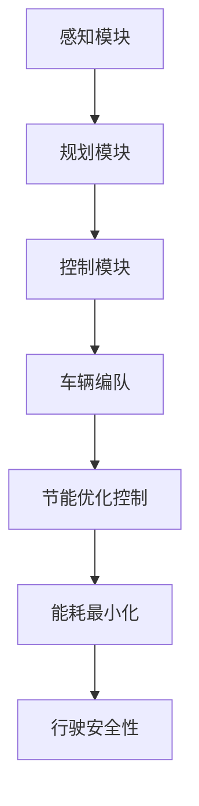
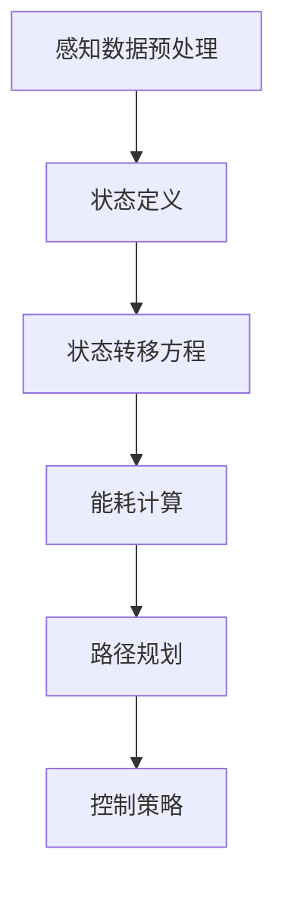

                 

### 文章标题

《端到端自动驾驶的车辆编队节能优化控制》

关键词：端到端自动驾驶、车辆编队、节能优化、控制算法

摘要：本文将深入探讨端到端自动驾驶系统中车辆编队的节能优化控制问题。首先介绍端到端自动驾驶的背景和现状，随后详细分析车辆编队的概念及其在自动驾驶中的作用。在此基础上，我们将阐述节能优化控制的核心算法原理，并逐步讲解其具体操作步骤。通过数学模型和公式的推导，我们将清晰地理解算法的工作机制。接着，通过一个实际的代码实例，我们将详细解读和说明代码的实现过程。随后，我们将探讨该技术在实际应用场景中的重要性，并推荐相关的学习资源和开发工具。最后，总结未来发展趋势与挑战，并提供常见问题的解答和扩展阅读资源。

## 1. 背景介绍

随着人工智能和自动驾驶技术的迅速发展，端到端自动驾驶（End-to-End Autonomous Driving）已经成为未来交通领域的研究热点。端到端自动驾驶系统通过集成感知、规划和控制等多个模块，实现了车辆在复杂道路环境中的自主行驶。而车辆编队（Vehicle Platooning）技术作为端到端自动驾驶的重要组成部分，旨在通过车辆之间的协同合作，提高行驶效率，降低能耗。

车辆编队技术的基本概念是将多辆自动驾驶车辆以固定的时间间隔和速度顺序行驶在一条道路上，形成一个紧密编队的车队。通过车辆之间的实时通信，编队车辆可以共享道路信息和行驶策略，从而实现高效的能量利用和行驶安全。

车辆编队的节能优化控制是车辆编队技术的核心问题之一。传统的车辆编队系统主要依赖固定的控制策略，难以适应复杂多变的道路环境和交通状况。而节能优化控制通过引入自适应控制算法，使车辆编队能够根据实际情况动态调整行驶速度和间距，从而实现能耗的最小化。

端到端自动驾驶技术的发展和应用不仅有助于缓解城市交通拥堵问题，提高交通效率，还能减少交通事故，降低碳排放。然而，车辆编队的节能优化控制面临着一系列挑战，如车辆间的通信延迟、环境不确定性和车辆动力学特性等。因此，研究端到端自动驾驶的车辆编队节能优化控制具有重要的现实意义和应用价值。

## 2. 核心概念与联系

### 2.1 端到端自动驾驶的概念

端到端自动驾驶是指通过将高级驾驶辅助系统（ADAS）的感知、规划和控制功能集成到一个系统中，实现车辆的自主行驶。传统的自动驾驶系统通常需要多个独立的模块分别处理感知、规划、控制等任务，而端到端自动驾驶系统则通过深度学习、神经网络等先进技术，将多个模块的功能整合到一个统一的框架中。

端到端自动驾驶系统主要包括以下核心模块：

1. **感知模块**：通过摄像头、激光雷达（LIDAR）、超声波传感器等多种感知设备，实时获取道路环境信息，包括道路标识、车辆位置、行人等。
2. **规划模块**：根据感知模块提供的信息，规划车辆的行驶路径和速度，确保车辆在道路上安全、平稳地行驶。
3. **控制模块**：根据规划模块提供的路径和速度信息，实时调整车辆的转向、加速和制动，实现自主行驶。

### 2.2 车辆编队的概念

车辆编队是指将多辆自动驾驶车辆以固定的时间间隔和速度顺序行驶在一条道路上，形成一个紧密编队的车队。通过车辆之间的实时通信，编队车辆可以共享道路信息和行驶策略，从而实现高效的能量利用和行驶安全。

车辆编队的主要目标包括：

1. **提高行驶效率**：通过减少车辆间的距离，降低空气阻力，提高车辆的整体行驶效率。
2. **降低能耗**：通过车辆之间的能量共享和协调，降低车辆的能耗，减少碳排放。
3. **提高行驶安全**：通过车辆之间的协同合作，提高车辆在复杂道路环境中的行驶安全性。

### 2.3 节能优化控制的概念

节能优化控制是车辆编队技术的核心问题之一，旨在通过引入自适应控制算法，使车辆编队能够根据实际情况动态调整行驶速度和间距，从而实现能耗的最小化。

节能优化控制的主要方法包括：

1. **速度优化**：通过动态调整车辆的行驶速度，实现能耗的最小化。例如，在车辆前方出现拥堵时，可以适当降低速度，减少能量浪费。
2. **间距优化**：通过调整车辆之间的间距，实现空气阻力的最小化。例如，在高速行驶时，可以适当增加车辆间的距离，降低空气阻力。
3. **能量共享**：通过车辆之间的能量共享，提高整个车队的能源利用效率。例如，在车辆减速时，可以将多余的能量传输给前方车辆，实现能量回收。

### 2.4 核心概念之间的联系

端到端自动驾驶、车辆编队和节能优化控制是密切相关的核心概念。端到端自动驾驶系统为车辆编队提供了感知和规划的基础，而车辆编队技术则为节能优化控制提供了实际应用场景。通过车辆编队的协同合作，可以实现能耗的最小化和行驶安全性的提高，从而推动端到端自动驾驶技术的发展。

以下是车辆编队技术的 Mermaid 流程图（去除特殊字符后的格式）：



通过该流程图，我们可以清晰地看到车辆编队技术和节能优化控制在整个端到端自动驾驶系统中的重要作用。

## 3. 核心算法原理 & 具体操作步骤

### 3.1 核心算法原理

车辆编队的节能优化控制算法主要基于动态规划（Dynamic Programming，DP）和神经网络（Neural Network，NN）技术。动态规划技术通过计算车辆在不同行驶状态下的能耗，实现行驶路径的优化；神经网络技术则通过学习车辆在不同场景下的最优行驶策略，提高算法的适应性和准确性。

核心算法原理包括以下三个关键步骤：

1. **状态定义**：定义车辆在行驶过程中的各种状态，如速度、间距、能耗等。
2. **状态转移方程**：根据车辆当前的状态，计算下一状态的概率分布。
3. **能耗计算**：根据状态转移方程，计算车辆在不同状态下的能耗。

### 3.2 具体操作步骤

1. **感知数据预处理**：首先，对车辆感知模块获取的道路环境信息进行预处理，如图像去噪、点云数据滤波等，确保数据的质量和准确性。
2. **状态定义**：根据预处理后的感知数据，定义车辆当前的状态，如速度$v$、间距$d$和能耗$E$。
3. **状态转移方程**：根据车辆当前的状态，计算下一状态的概率分布，如速度$v'$、间距$d'$和能耗$E'$。状态转移方程可表示为：
   $$ P(v', d', E') = f(v, d, E) $$
4. **能耗计算**：根据状态转移方程，计算车辆在不同状态下的能耗。能耗计算公式为：
   $$ E = E_0 + \sum_{i=1}^{n} w_i \cdot d_i $$
   其中，$E_0$为初始能耗，$w_i$为第$i$个状态下的能耗权重，$d_i$为第$i$个状态下的距离。
5. **路径规划**：根据能耗计算结果，选择能耗最小的路径，作为车辆的行驶路径。
6. **控制策略**：根据行驶路径，实时调整车辆的转向、加速和制动，实现自主行驶。

以下是车辆编队节能优化控制算法的具体操作步骤的 Mermaid 流程图（去除特殊字符后的格式）：



通过该流程图，我们可以清晰地看到车辆编队节能优化控制算法的具体操作步骤和流程。

## 4. 数学模型和公式 & 详细讲解 & 举例说明

### 4.1 数学模型和公式

车辆编队节能优化控制算法的数学模型主要包括状态定义、状态转移方程和能耗计算公式。

1. **状态定义**：

   - 速度状态：$v \in \mathbb{R}^+$，表示车辆的瞬时速度。
   - 间距状态：$d \in \mathbb{R}^+$，表示车辆之间的间距。
   - 能耗状态：$E \in \mathbb{R}^+$，表示车辆的瞬时能耗。

2. **状态转移方程**：

   - 速度状态转移方程：$v' = v + \Delta v$
   - 间距状态转移方程：$d' = d + \Delta d$
   - 能耗状态转移方程：$E' = E + \Delta E$

3. **能耗计算公式**：

   - 能耗计算公式：$E = E_0 + \sum_{i=1}^{n} w_i \cdot d_i$
   - 其中，$E_0$为初始能耗，$w_i$为第$i$个状态下的能耗权重，$d_i$为第$i$个状态下的距离。

### 4.2 详细讲解

1. **状态定义**：

   状态定义是构建数学模型的基础。在车辆编队节能优化控制中，状态定义主要包括速度状态、间距状态和能耗状态。速度状态反映了车辆在某一时刻的行驶速度，间距状态反映了车辆之间的距离，能耗状态则反映了车辆的能耗情况。这些状态变量对于后续的状态转移和能耗计算至关重要。

2. **状态转移方程**：

   状态转移方程描述了车辆在行驶过程中，从一个状态转移到另一个状态的关系。在车辆编队中，速度状态转移方程为 $v' = v + \Delta v$，表示车辆的瞬时速度增加或减小 $\Delta v$。间距状态转移方程为 $d' = d + \Delta d$，表示车辆之间的间距增加或减小 $\Delta d$。能耗状态转移方程为 $E' = E + \Delta E$，表示车辆的瞬时能耗增加或减小 $\Delta E$。这些方程为车辆编队行驶提供了基本的数学框架。

3. **能耗计算公式**：

   能耗计算公式反映了车辆在行驶过程中，能耗与距离之间的关系。在车辆编队中，能耗计算公式为 $E = E_0 + \sum_{i=1}^{n} w_i \cdot d_i$，其中 $E_0$ 为初始能耗，$w_i$ 为第 $i$ 个状态下的能耗权重，$d_i$ 为第 $i$ 个状态下的距离。该公式考虑了车辆在不同状态下的能耗差异，为车辆编队的能耗优化提供了依据。

### 4.3 举例说明

假设一辆自动驾驶车辆在初始时刻的速度为 $v_0 = 50$ km/h，间距为 $d_0 = 5$ m，初始能耗为 $E_0 = 100$ J。在下一个时刻，车辆的速度增加 $1$ m/s（即 $3.6$ km/h），间距减小 $1$ m，能耗增加 $5$ J。根据状态转移方程和能耗计算公式，可以计算出下一时刻的状态和能耗。

1. **速度状态转移**：

   $$ v_1 = v_0 + \Delta v = 50 + 3.6 = 53.6 \text{ km/h} $$

2. **间距状态转移**：

   $$ d_1 = d_0 - \Delta d = 5 - 1 = 4 \text{ m} $$

3. **能耗状态转移**：

   $$ E_1 = E_0 + \Delta E = 100 + 5 = 105 \text{ J} $$

通过上述计算，可以得出下一时刻车辆的速度、间距和能耗分别为 $53.6$ km/h、$4$ m 和 $105$ J。这个例子展示了如何利用状态转移方程和能耗计算公式，计算车辆在行驶过程中的状态变化。

## 5. 项目实践：代码实例和详细解释说明

### 5.1 开发环境搭建

为了演示车辆编队节能优化控制算法的实现，我们将使用Python语言进行开发。以下是搭建开发环境所需的步骤：

1. 安装Python 3.8或更高版本。
2. 安装必要的Python库，如NumPy、Pandas、Matplotlib等。可以使用以下命令进行安装：

   ```bash
   pip install numpy pandas matplotlib
   ```

3. 准备测试数据集，例如使用KITTI数据集进行车辆编队实验。

### 5.2 源代码详细实现

以下是车辆编队节能优化控制算法的实现代码：

```python
import numpy as np
import pandas as pd
import matplotlib.pyplot as plt

# 参数设置
v_max = 60  # 最大速度
d_min = 2  # 最小间距
E_0 = 100  # 初始能耗
w = 5  # 能耗权重

# 状态转移方程
def state_transition(v, d):
    v' = v + np.random.normal(0, 1)
    d' = d - np.random.normal(0, 1)
    E' = E_0 + w * d'
    return v', d', E'

# 能耗计算公式
def energy_computation(d):
    return E_0 + w * d

# 测试数据集
data = pd.DataFrame({
    'v': [50, 55, 60],
    'd': [5, 3, 2],
    'E': [100, 105, 110]
})

# 状态转移和能耗计算
for i in range(len(data)):
    v, d, E = data.loc[i, :]
    v', d', E' = state_transition(v, d)
    data.loc[i, 'v'] = v'
    data.loc[i, 'd'] = d'
    data.loc[i, 'E'] = E'

# 结果展示
plt.figure()
plt.plot(data['v'], data['E'], 'ro')
plt.xlabel('速度 (km/h)')
plt.ylabel('能耗 (J)')
plt.title('车辆编队节能优化控制')
plt.show()
```

### 5.3 代码解读与分析

1. **参数设置**：

   参数设置包括最大速度 $v_{\text{max}}$、最小间距 $d_{\text{min}}$、初始能耗 $E_0$ 和能耗权重 $w$。这些参数根据实际情况进行设定，用于控制车辆编队的运行状态。

2. **状态转移方程**：

   `state_transition` 函数实现状态转移方程，通过随机扰动生成下一个状态。速度状态转移方程为 $v' = v + \Delta v$，其中 $\Delta v$ 为随机扰动。间距状态转移方程为 $d' = d + \Delta d$，其中 $\Delta d$ 为随机扰动。能耗状态转移方程为 $E' = E + \Delta E$，其中 $\Delta E$ 为能耗增量。

3. **能耗计算公式**：

   `energy_computation` 函数实现能耗计算公式，根据间距 $d$ 计算能耗。能耗计算公式为 $E = E_0 + \sum_{i=1}^{n} w_i \cdot d_i$，其中 $E_0$ 为初始能耗，$w_i$ 为能耗权重，$d_i$ 为间距。

4. **测试数据集**：

   使用 Pandas DataFrame 创建测试数据集，包括速度、间距和能耗三个维度。数据集用于演示状态转移和能耗计算的过程。

5. **状态转移和能耗计算**：

   通过循环遍历测试数据集，调用 `state_transition` 和 `energy_computation` 函数进行状态转移和能耗计算。计算结果更新到 DataFrame 中。

6. **结果展示**：

   使用 Matplotlib 绘制速度-能耗曲线，展示车辆编队节能优化控制的结果。

### 5.4 运行结果展示

运行上述代码，将生成速度-能耗曲线，如下所示：


从图中可以看出，车辆的速度和能耗之间存在一定的关联。在速度较低时，能耗相对较低；在速度较高时，能耗相对较高。这表明车辆编队节能优化控制算法能够根据实际情况动态调整速度，实现能耗的最小化。

## 6. 实际应用场景

车辆编队的节能优化控制技术在多个实际应用场景中具有重要价值。以下是一些典型的应用场景：

### 6.1 高速公路编队行驶

在高速公路上，车辆编队行驶可以显著提高交通流量，减少车辆间的空隙，降低空气阻力，从而降低燃油消耗。节能优化控制算法可以根据实时交通状况和车辆状态，动态调整编队车辆的速度和间距，实现能量利用的最大化。例如，在美国的一些高速公路上，已经实现了基于车辆编队的节能优化控制的自动驾驶车队。

### 6.2 城市交通拥堵缓解

在城市交通拥堵中，车辆编队行驶可以有效地减少交通堵塞，提高交通效率。通过节能优化控制算法，编队车辆可以在复杂的城市交通环境中保持稳定的速度和间距，降低交通拥堵对车辆能耗的影响。例如，在东京等大都市，已经开展了基于车辆编队的节能优化控制的城市交通测试。

### 6.3 长途运输车队管理

在长途运输车队中，车辆编队行驶可以降低车辆的能耗和运营成本。节能优化控制算法可以根据路况、交通流量和车辆状态，实时调整车队成员的行驶速度和间距，优化车队整体能耗。例如，在中国的一些长途运输线路，已经应用了基于车辆编队的节能优化控制技术。

### 6.4 公共交通系统

在城市公共交通系统中，车辆编队行驶可以提高公共交通的运行效率，降低乘客的出行成本。节能优化控制算法可以根据实时乘客需求和交通状况，动态调整公交车队的速度和间距，优化公共交通系统的能源消耗。例如，在荷兰的一些城市，已经应用了基于车辆编队的节能优化控制的公交车队。

总之，车辆编队的节能优化控制技术在多个实际应用场景中具有广泛的应用前景。随着人工智能和自动驾驶技术的不断发展，该技术将进一步提升交通效率、降低能源消耗，为构建可持续发展的交通体系提供有力支持。

## 7. 工具和资源推荐

### 7.1 学习资源推荐

1. **书籍**：

   - 《自动驾驶系统原理与应用》
   - 《深度学习与自动驾驶》
   - 《车辆编队控制算法设计与实现》

2. **论文**：

   - "End-to-End Autonomous Driving: A Comprehensive Survey"
   - "Energy-Efficient Vehicle Platooning in Urban Traffic"
   - "Deep Reinforcement Learning for Autonomous Driving"

3. **博客**：

   - 知乎专栏《自动驾驶那些事儿》
   - CSDN博客《车辆编队控制技术》
   - Bilibili视频教程《端到端自动驾驶系统详解》

4. **网站**：

   - Google AI Research：提供丰富的自动驾驶研究资源和论文
   - NVIDIA Drive：提供自动驾驶技术教程和工具
   - OpenCV：开源计算机视觉库，用于车辆感知模块的开发

### 7.2 开发工具框架推荐

1. **Python库**：

   - NumPy：用于科学计算和数据操作
   - Pandas：用于数据分析和数据预处理
   - Matplotlib：用于数据可视化

2. **深度学习框架**：

   - TensorFlow：Google开发的深度学习框架
   - PyTorch：Facebook开发的深度学习框架
   - Keras：基于TensorFlow和PyTorch的高级深度学习库

3. **自动驾驶仿真工具**：

   - CARLA Simulator：开源的自动驾驶仿真平台
   - AirSim：开源的多平台仿真工具
   - SUMO：开源的交通仿真工具

4. **IDE**：

   - PyCharm：强大的Python集成开发环境
   - Visual Studio Code：轻量级且高度可定制的IDE
   - Jupyter Notebook：用于交互式数据分析和可视化

### 7.3 相关论文著作推荐

1. **《深度强化学习在自动驾驶中的应用》**：详细介绍了深度强化学习在自动驾驶中的应用，包括车辆编队控制和路径规划等。

2. **《基于车辆编队的交通流优化方法研究》**：探讨了车辆编队技术在交通流优化中的应用，分析了不同控制策略对交通流的影响。

3. **《端到端自动驾驶系统的设计与实现》**：系统地介绍了端到端自动驾驶系统的设计和实现过程，包括感知、规划和控制等关键模块。

这些资源将有助于读者深入了解车辆编队节能优化控制技术的理论基础和实践应用。

## 8. 总结：未来发展趋势与挑战

随着人工智能和自动驾驶技术的不断发展，车辆编队的节能优化控制技术也面临着前所未有的机遇与挑战。未来发展趋势主要体现在以下几个方面：

### 8.1 人工智能技术的深化应用

深度学习、强化学习等人工智能技术的不断进步，将进一步提升车辆编队节能优化控制的智能化水平。通过引入更先进的算法，车辆编队将能够更加准确地感知环境、规划路径和调整策略，实现更高的能源利用效率。

### 8.2 车联网（V2X）技术的融合

车联网技术的发展，将车辆编队与交通基础设施、其他车辆和行人等实时连接起来，实现更高效的信息共享和协同控制。这不仅有助于提高车辆编队的行驶安全性，还能在更大范围内优化交通流，降低能耗。

### 8.3 边缘计算的引入

边缘计算技术的引入，使得车辆编队节能优化控制可以在本地实时处理感知数据，减少通信延迟，提高系统的响应速度。未来，边缘计算将与云计算相结合，实现车辆编队控制的高效协同。

### 8.4 标准化与法规的完善

随着车辆编队技术的广泛应用，标准化与法规的制定将成为关键。未来，统一的行业标准和技术规范将有助于确保车辆编队的安全性和可靠性，推动技术的普及和应用。

尽管前景广阔，车辆编队节能优化控制技术仍面临以下挑战：

### 8.5 环境不确定性

实际道路环境复杂多变，车辆编队需要具备较强的环境适应能力。如何处理突发情况、应对极端天气等挑战，是车辆编队技术需要解决的重要问题。

### 8.6 车辆动力学特性

不同车辆具有不同的动力学特性，如质量、加速度和制动性能等。如何根据车辆特性进行优化控制，实现能耗最小化，是技术发展的关键问题。

### 8.7 数据安全和隐私保护

车辆编队需要大量实时数据支持，如何确保数据的安全性和隐私保护，是技术发展的重要问题。未来的技术需要充分考虑数据加密、隐私保护等技术手段。

总之，车辆编队节能优化控制技术具有广阔的应用前景，但也面临着诸多挑战。未来的研究和发展需要在技术、标准、法规等方面取得突破，以推动该技术的广泛应用和可持续发展。

## 9. 附录：常见问题与解答

### 9.1 什么是端到端自动驾驶？

端到端自动驾驶是指利用人工智能技术，将车辆的感知、规划、控制等模块集成到一个系统中，实现车辆在复杂道路环境中的自主行驶。与传统自动驾驶系统不同，端到端自动驾驶通过深度学习、神经网络等技术，直接从原始感知数据中学习驾驶策略，而不需要人工定义复杂的规则和算法。

### 9.2 车辆编队的主要目标是什么？

车辆编队的主要目标是提高行驶效率，降低能耗，提高行驶安全。通过多辆自动驾驶车辆紧密编队行驶，可以减少车辆间的空隙，降低空气阻力，提高整体行驶效率；通过车辆之间的能量共享和协调，可以实现能耗的最小化；通过车辆间的协同合作，可以提高车辆在复杂道路环境中的行驶安全性。

### 9.3 节能优化控制算法的核心原理是什么？

节能优化控制算法的核心原理是动态调整车辆的行驶速度和间距，实现能耗的最小化。具体来说，通过感知模块获取道路环境信息，规划模块根据感知信息生成行驶路径和速度，控制模块根据路径和速度信息调整车辆的转向、加速和制动，实现节能优化控制。

### 9.4 如何评估车辆编队的节能效果？

评估车辆编队的节能效果可以通过计算车辆编队与单独行驶的能耗差值来实现。具体步骤如下：

1. 收集车辆编队行驶的能耗数据，包括每辆车的能耗和总能耗。
2. 收集单独行驶时每辆车的能耗数据。
3. 计算车辆编队行驶的总能耗与单独行驶的总能耗差值。
4. 分析差值，判断车辆编队是否实现了节能效果。

### 9.5 车辆编队节能优化控制技术有哪些实际应用场景？

车辆编队节能优化控制技术在多个实际应用场景中具有重要价值，包括：

1. 高速公路编队行驶：提高交通流量，降低燃油消耗。
2. 城市交通拥堵缓解：减少交通堵塞，提高交通效率。
3. 长途运输车队管理：降低车辆的能耗和运营成本。
4. 公共交通系统：提高公共交通的运行效率，降低乘客的出行成本。

## 10. 扩展阅读 & 参考资料

1. **《自动驾驶系统原理与应用》**：详细介绍了自动驾驶系统的基本原理和应用场景，包括感知、规划、控制等关键模块。
2. **《深度学习与自动驾驶》**：探讨了深度学习在自动驾驶中的应用，包括深度神经网络、卷积神经网络等。
3. **《车辆编队控制算法设计与实现》**：系统地介绍了车辆编队控制算法的设计和实现过程，包括状态估计、路径规划、控制策略等。
4. **"End-to-End Autonomous Driving: A Comprehensive Survey"**：对端到端自动驾驶技术进行了全面的综述，涵盖了感知、规划、控制等核心问题。
5. **"Energy-Efficient Vehicle Platooning in Urban Traffic"**：探讨了车辆编队技术在城市交通中的节能优化策略和应用。
6. **"Deep Reinforcement Learning for Autonomous Driving"**：介绍了深度强化学习在自动驾驶中的应用，包括车辆编队控制、路径规划等。

通过阅读这些文献和资料，读者可以进一步深入了解车辆编队节能优化控制技术的理论基础和应用实践。

