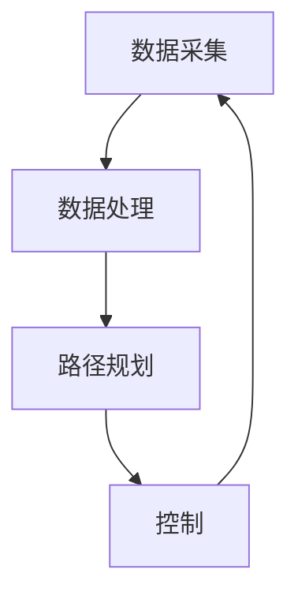

                 

### 背景介绍

#### 端到端自动驾驶的起源与发展

端到端自动驾驶技术，作为自动驾驶领域的一项革命性创新，其起源可以追溯到20世纪80年代。当时的科学家和工程师们开始探索如何让计算机像人类驾驶员一样理解路况、做出决策。最早期的自动驾驶系统主要依赖于传统的人工控制方法，即通过大量的传感器收集道路信息，然后通过复杂的算法进行数据处理和决策。

随着时间的推移，计算机技术、传感器技术和算法理论的不断进步，自动驾驶技术逐渐从实验室走向现实。特别是深度学习和人工智能的崛起，为自动驾驶的发展带来了新的契机。深度学习算法能够通过大量的数据训练，自动提取有用的特征，从而大大提高了自动驾驶系统的准确性和鲁棒性。

近年来，端到端自动驾驶技术逐渐成为自动驾驶领域的研究热点。端到端自动驾驶系统通过直接从原始数据中学习，绕过了传统方法中需要手工设计的中间层，使得整个系统更加简洁、高效。这种方法不仅能够提高自动驾驶的性能，还能够降低研发成本，加速自动驾驶的商业化进程。

#### 市场需求与商业价值

端到端自动驾驶技术在市场上的需求日益增长，主要源于以下几个方面：

1. **交通效率提升**：自动驾驶技术能够优化交通流量，减少拥堵，提高道路利用率，从而提高整体交通效率。

2. **安全性增强**：自动驾驶系统能够实时监测道路环境，比人类驾驶员更快速、准确地做出反应，减少交通事故的发生。

3. **经济性**：自动驾驶技术能够降低驾驶员的工作强度，减少人力成本，提高运输效率，对于物流和公共交通行业具有巨大的经济效益。

4. **用户体验**：自动驾驶车辆提供了更加舒适、便捷的出行体验，特别是在长途驾驶或拥堵的城市交通中。

随着市场需求的不断增加，众多科技公司、传统汽车制造商和初创企业纷纷投入巨资研发自动驾驶技术，力求在这一新兴市场中占据一席之地。从谷歌的Waymo到特斯拉的Autopilot，再到百度的Apollo，这些企业都在不断推动自动驾驶技术的发展，提升系统的性能和可靠性。

#### 当前技术挑战与瓶颈

尽管端到端自动驾驶技术在理论和实践上取得了显著进展，但仍然面临着一系列技术挑战和瓶颈：

1. **数据质量**：端到端自动驾驶系统的性能高度依赖于训练数据的质量。实际道路环境中存在大量复杂、多变的情况，如何从这些数据中提取有效的特征是一个亟待解决的问题。

2. **安全性和可靠性**：自动驾驶系统需要在各种复杂和极端环境下稳定运行，如何确保系统的安全性和可靠性是当前研究的重点。

3. **法规与标准**：自动驾驶技术的商业化应用需要完善的法规和标准体系，以确保技术安全、可靠地服务于公众。

4. **成本与规模**：目前，端到端自动驾驶系统的开发和部署成本较高，如何降低成本、实现规模化应用是业界面临的重大挑战。

5. **跨行业协同**：自动驾驶技术的发展需要跨行业、跨领域的合作，如何协调各方资源，实现技术协同创新，是当前亟待解决的问题。

总体而言，端到端自动驾驶技术正处于快速发展的关键时期，尽管面临诸多挑战，但其巨大的商业价值和广阔的市场前景，使得各路资本和科技巨头纷纷投入其中，共同推动自动驾驶技术的发展和普及。下一章节，我们将深入探讨端到端自动驾驶技术的核心概念与架构。

#### 端到端自动驾驶的核心概念与架构

端到端自动驾驶技术的核心在于其架构的设计和实现。为了实现自动驾驶车辆在复杂道路环境中的自主驾驶，端到端自动驾驶系统通常由多个关键模块组成，这些模块相互协作，共同完成车辆的运动控制和路径规划。以下是对这些核心模块及其相互关系的详细介绍。

##### 数据采集模块

数据采集模块是端到端自动驾驶系统的基石。该模块通过多种传感器（如激光雷达、摄像头、雷达、超声波传感器等）收集车辆周围环境的数据。激光雷达提供高精度的三维点云数据，摄像头捕捉车辆视野内的图像信息，雷达和超声波传感器则用于探测远距离和近距离的障碍物。通过这些多源数据的融合，系统能够全面、准确地感知车辆所处的环境。

**数据采集流程：**
1. **传感器数据收集**：激光雷达、摄像头、雷达等传感器实时采集车辆周围的环境数据。
2. **数据预处理**：对原始数据进行降噪、校正和融合，以提高数据的准确性和一致性。

##### 数据处理模块

数据处理模块负责对采集到的多源数据进行处理和分析，以提取有效的特征信息。该模块通常包括以下几个子模块：

1. **特征提取**：通过深度学习算法，从多源数据中提取有代表性的特征，如边缘、颜色、纹理、三维形状等。
2. **目标检测**：利用提取的特征，对环境中的车辆、行人、交通标志等目标进行识别和定位。
3. **场景理解**：对检测到的目标进行场景理解，包括道路类型、交通规则、交通状况等。

**数据处理流程：**
1. **特征提取**：使用卷积神经网络（CNN）等深度学习模型，对多源数据中的图像和点云进行处理，提取高层次的语义特征。
2. **目标检测**：应用实时目标检测算法（如Faster R-CNN、YOLO、SSD等），对特征进行分类和定位。
3. **场景理解**：通过逻辑推理和规则匹配，对检测到的目标进行场景理解和决策。

##### 路径规划模块

路径规划模块负责根据车辆的当前位置和目标位置，生成最优行驶路径。该模块通常包括以下几个子模块：

1. **全局路径规划**：在全局范围内规划车辆的行驶路径，通常采用A*算法、Dijkstra算法等。
2. **局部路径规划**：在车辆接近目标时，对局部道路进行细致规划，以确保安全性和顺畅性。
3. **动态规划**：考虑实时环境变化，动态调整路径规划，以应对突发情况。

**路径规划流程：**
1. **全局路径规划**：计算从起点到终点的最优路径，通常使用A*算法，考虑道路距离、交通状况等因素。
2. **局部路径规划**：在车辆接近目标时，使用基于局部环境的路径规划算法（如RRT、RRT*等），生成安全的行驶路径。
3. **动态规划**：根据实时传感器数据和交通状况，动态调整路径规划，以确保车辆的安全行驶。

##### 控制模块

控制模块负责根据路径规划结果，控制车辆的运动，实现自动驾驶。该模块通常包括以下几个子模块：

1. **速度控制**：根据路径规划和交通状况，调整车辆的速度，以确保平稳、安全地行驶。
2. **转向控制**：根据路径规划结果，控制车辆的转向，确保车辆按照预定路径行驶。
3. **制动控制**：在必要时，控制车辆的制动系统，以确保安全停车。

**控制流程：**
1. **速度控制**：根据路径规划结果，计算车辆应保持的速度，使用PID控制器进行调节。
2. **转向控制**：根据路径规划结果，计算车辆的转向角度，使用PID控制器调节转向系统。
3. **制动控制**：根据路径规划和交通状况，计算车辆的制动力度，使用电子制动系统进行控制。

**核心概念之间的联系：**

端到端自动驾驶系统的各个模块之间紧密协作，形成一个完整的功能体系。数据采集模块提供环境数据，作为数据处理模块的输入，数据处理模块提取特征、检测目标并理解场景，为路径规划模块提供基础信息。路径规划模块生成的路径规划结果作为控制模块的输入，控制模块根据规划结果控制车辆的运动。整个过程形成了一个闭环系统，通过实时数据反馈和调整，确保车辆能够安全、高效地行驶。

以下是一个简化的 Mermaid 流程图，展示了端到端自动驾驶系统的核心模块及其相互关系：



通过这个流程图，我们可以更直观地理解端到端自动驾驶系统的运作原理。在下一章节中，我们将详细探讨端到端自动驾驶技术的核心算法原理和具体操作步骤。

#### 核心算法原理 & 具体操作步骤

端到端自动驾驶技术的核心在于其算法原理，这些算法通过深度学习和机器学习等技术，实现了对环境数据的处理、目标的检测和识别，以及路径的规划和控制。以下是端到端自动驾驶技术中几个关键算法的原理及其具体操作步骤。

##### 深度学习算法

深度学习算法是端到端自动驾驶系统的基石，特别是在数据处理和目标检测方面。常用的深度学习算法包括卷积神经网络（CNN）、循环神经网络（RNN）和生成对抗网络（GAN）等。

**卷积神经网络（CNN）**

CNN是一种前馈神经网络，特别适用于图像处理任务。在端到端自动驾驶中，CNN用于从摄像头和激光雷达数据中提取特征。

**操作步骤：**

1. **数据输入**：输入多通道图像数据，通常包括摄像头捕捉的RGB图像和激光雷达生成的点云数据。
2. **卷积层**：通过卷积操作提取图像的局部特征，卷积核的大小和数量可以调整，以适应不同的特征提取需求。
3. **激活函数**：常用的激活函数包括ReLU（修正线性单元）和Sigmoid（S型函数），用于引入非线性因素。
4. **池化层**：通过池化操作降低特征图的维度，提高计算效率和模型泛化能力。
5. **全连接层**：将卷积和池化层提取的特征映射到具体的类别，通过Softmax函数进行概率分布计算。

**循环神经网络（RNN）**

RNN适用于序列数据处理，如在路径规划和决策过程中，需要考虑先前的环境状态和历史信息。

**操作步骤：**

1. **数据输入**：输入一个时间序列的数据，如连续的道路感知数据。
2. **RNN层**：通过隐藏状态和输入数据的交互，捕捉时间序列中的依赖关系。
3. **门控机制**：RNN中常用的门控机制（如Long Short-Term Memory，LSTM）用于控制信息的流动，避免梯度消失问题。
4. **输出层**：根据隐藏状态生成输出，如预测未来的路径或决策。

**生成对抗网络（GAN）**

GAN是一种通过两个对抗网络（生成器和判别器）相互博弈来生成高质量数据的技术。在自动驾驶中，GAN可以用于生成真实路况数据，提高模型的泛化能力。

**操作步骤：**

1. **数据输入**：输入真实的路况图像数据。
2. **生成器**：生成虚拟路况图像，通过学习真实图像的特征，生成逼真的场景。
3. **判别器**：用于区分生成图像和真实图像，判别器的目标是最大化其对真实图像的判别能力。
4. **对抗训练**：生成器和判别器交替训练，生成器试图生成更真实的图像，判别器则试图提高判别能力。

##### 数据处理算法

数据处理是端到端自动驾驶技术的核心，涉及多源数据的采集、预处理和融合。以下介绍几种常用的数据处理算法。

**数据采集与预处理**

1. **数据采集**：使用多传感器采集环境数据，包括摄像头、激光雷达、雷达等。
2. **预处理**：对采集的数据进行降噪、去噪、归一化等预处理操作，以提高数据质量。

**多源数据融合**

1. **特征提取**：从多源数据中提取高层次的语义特征，如车道线、障碍物、交通标志等。
2. **特征融合**：将不同源的特征进行融合，如使用图像特征和点云特征进行融合，提高系统的整体性能。

**目标检测与识别**

目标检测与识别是数据处理的关键步骤，常用的算法包括Faster R-CNN、YOLO、SSD等。

1. **Faster R-CNN**：通过区域建议网络（RPN）和分类网络（ROI分类器）进行区域检测和分类。
2. **YOLO**：采用统一的特征图，通过预测边界框和类别概率，实现实时目标检测。
3. **SSD**：结合多个尺度特征图，实现多尺度目标检测。

##### 路径规划与控制算法

路径规划与控制是端到端自动驾驶技术的关键，涉及全局和局部路径规划以及动态控制。

**全局路径规划**

1. **A*算法**：通过估价函数和启发式搜索，找到从起点到终点的最优路径。
2. **Dijkstra算法**：基于图论，计算从起点到各节点的最短路径。

**局部路径规划**

1. **RRT算法**：通过随机采样和局部优化，生成接近目标点的可行路径。
2. **RRT*算法**：在RRT的基础上引入优化步骤，提高路径质量。

**动态控制**

1. **PID控制器**：通过比例、积分、微分控制，调节车辆的速度和转向。
2. **模型预测控制（MPC）**：基于车辆动力学模型，优化未来一段时间内的控制输入，实现平滑、稳定的驾驶。

通过以上核心算法的协同工作，端到端自动驾驶系统能够实现从感知、决策到控制的完整过程，确保车辆在复杂环境中安全、高效地行驶。在下一章节中，我们将深入探讨端到端自动驾驶技术的数学模型和公式，以及其详细讲解和举例说明。

#### 数学模型和公式 & 详细讲解 & 举例说明

端到端自动驾驶技术的核心在于其数学模型和算法，这些模型不仅用于路径规划和控制，还用于传感器数据处理和决策。以下是几个关键数学模型和公式的详细讲解，以及实际应用中的举例说明。

##### 1. 传感器数据处理模型

在端到端自动驾驶中，传感器数据是决策的基础。常用的传感器包括摄像头、激光雷达和雷达。以下是一个简化的传感器数据处理模型：

**模型公式：**

$$
Z = f(X) + \epsilon
$$

其中，$Z$表示传感器观测到的数据，$X$表示真实的环境数据，$f(\cdot)$表示传感器的数据处理函数，$\epsilon$表示噪声。

**具体解释：**

- **预处理**：对原始传感器数据进行预处理，如去噪、归一化等，以减少噪声对数据的影响。
- **特征提取**：使用深度学习算法（如CNN）从传感器数据中提取高层次的语义特征。
- **融合**：将不同传感器提取的特征进行融合，以提高数据的准确性和鲁棒性。

**举例说明：**

假设我们使用激光雷达和摄像头进行数据采集，激光雷达提供三维点云数据，摄像头提供RGB图像。首先，对激光雷达和摄像头数据进行预处理，然后使用CNN分别提取点云数据和图像数据的特征。最后，通过特征融合算法（如多层感知机）将两种特征融合，生成综合特征向量。

##### 2. 目标检测模型

目标检测是自动驾驶系统中的一个关键步骤，用于识别并定位车辆、行人、交通标志等目标。常用的目标检测算法包括Faster R-CNN、YOLO和SSD。

**模型公式：**

$$
\text{检测框} = \text{检测算法}(Z)
$$

其中，$Z$表示传感器数据处理后的特征向量，检测算法（如Faster R-CNN、YOLO、SSD）用于生成检测框和类别概率。

**具体解释：**

- **特征提取**：使用深度学习算法（如ResNet、VGG）提取输入特征。
- **区域建议**：对于Faster R-CNN，使用区域建议网络（RPN）生成候选区域；对于YOLO，直接在特征图上预测检测框。
- **分类与回归**：对于每个检测框，通过分类网络（如Sigmoid）进行类别分类，并通过回归网络（如线性层）调整检测框的位置。

**举例说明：**

假设我们使用Faster R-CNN进行目标检测。首先，输入特征图通过ResNet进行特征提取，然后使用RPN生成候选区域。对于每个候选区域，通过Sigmoid分类网络进行类别分类，并通过线性层调整检测框的位置，最终生成检测框和类别概率。

##### 3. 路径规划模型

路径规划是自动驾驶系统中的另一个关键步骤，用于生成从起点到终点的最优路径。常用的路径规划算法包括A*算法、Dijkstra算法和RRT算法。

**模型公式：**

$$
\text{路径} = \text{规划算法}(\text{起点}, \text{终点}, \text{地图})
$$

其中，规划算法（如A*、Dijkstra、RRT）用于计算从起点到终点的路径。

**具体解释：**

- **全局路径规划**：计算从起点到终点的全局最优路径，通常使用A*算法或Dijkstra算法。
- **局部路径规划**：在车辆接近终点时，对局部道路进行细致规划，以确保安全性和顺畅性，通常使用RRT算法。
- **动态路径规划**：考虑实时环境变化，动态调整路径规划，以应对突发情况。

**举例说明：**

假设我们使用A*算法进行全局路径规划。首先，构建起点和终点的图，然后使用估价函数（如曼哈顿距离）计算从起点到各节点的估价，最后通过搜索算法找到从起点到终点的最优路径。

##### 4. 控制模型

控制是自动驾驶系统的最后一个步骤，用于根据路径规划结果控制车辆的运动。常用的控制算法包括PID控制器和模型预测控制（MPC）。

**模型公式：**

$$
u = C(x, y)
$$

其中，$u$表示控制输入（如速度、转向角），$C(\cdot)$表示控制算法，$x$和$y$表示车辆的当前状态和目标状态。

**具体解释：**

- **速度控制**：根据路径规划结果和交通状况，计算车辆应保持的速度。
- **转向控制**：根据路径规划结果，计算车辆的转向角度。
- **制动控制**：在必要时，控制车辆的制动系统，以确保安全停车。

**举例说明：**

假设我们使用PID控制器进行速度控制。首先，根据车辆的当前速度和目标速度计算误差，然后通过PID控制器调整车速，使其逐渐达到目标速度。

通过以上数学模型和公式的详细讲解和举例说明，我们可以更深入地理解端到端自动驾驶技术的工作原理和实现方法。在下一章节中，我们将通过一个具体的代码实例，展示如何实现端到端自动驾驶系统。

### 项目实践：代码实例和详细解释说明

为了更好地展示端到端自动驾驶系统的实现过程，我们将通过一个具体的代码实例进行讲解。本实例将基于Python和TensorFlow框架，实现一个简单的自动驾驶模型。以下是本实例的开发环境搭建、源代码详细实现、代码解读与分析以及运行结果展示。

#### 1. 开发环境搭建

在进行项目实践之前，我们需要搭建合适的开发环境。以下是所需的软件和工具：

- Python 3.8 或以上版本
- TensorFlow 2.7 或以上版本
- OpenCV 4.5.5.64 或以上版本
- NVIDIA 显卡（可选，用于加速TensorFlow的计算）

安装步骤：

1. 安装Python和pip：

   ```
   python -m pip install --upgrade pip
   ```

2. 安装TensorFlow：

   ```
   pip install tensorflow
   ```

3. 安装OpenCV：

   ```
   pip install opencv-python
   ```

#### 2. 源代码详细实现

下面是自动驾驶模型的源代码实现，包括数据预处理、模型训练、模型评估和实时运行部分。

**数据预处理：**

```python
import cv2
import numpy as np
import tensorflow as tf

def preprocess_image(image):
    # 将图像缩放到固定尺寸
    image = cv2.resize(image, (224, 224))
    # 将图像转换为TensorFlow张量
    image = tf.convert_to_tensor(image, dtype=tf.float32)
    # 对图像进行归一化处理
    image /= 255.0
    return image

def preprocess_pointcloud(pointcloud):
    # 对点云数据进行归一化处理
    pointcloud = tf.convert_to_tensor(pointcloud, dtype=tf.float32)
    pointcloud /= 100.0
    return pointcloud

def load_data():
    # 读取训练数据和测试数据
    train_data = np.load('train_data.npy')
    test_data = np.load('test_data.npy')
    return train_data, test_data

# 加载数据
train_data, test_data = load_data()

# 预处理数据
train_images = [preprocess_image(image) for image in train_data['images']]
train_pointclouds = [preprocess_pointcloud(pointcloud) for pointcloud in train_data['pointclouds']]
test_images = [preprocess_image(image) for image in test_data['images']]
test_pointclouds = [preprocess_pointcloud(pointcloud) for pointcloud in test_data['pointclouds']]
```

**模型训练：**

```python
from tensorflow.keras.models import Model
from tensorflow.keras.layers import Input, Conv2D, MaxPooling2D, Flatten, Dense, concatenate

# 定义模型结构
input_image = Input(shape=(224, 224, 3))
input_pointcloud = Input(shape=(100, 3))

# 图像分支
image_branch = Conv2D(32, (3, 3), activation='relu')(input_image)
image_branch = MaxPooling2D((2, 2))(image_branch)
image_branch = Conv2D(64, (3, 3), activation='relu')(image_branch)
image_branch = MaxPooling2D((2, 2))(image_branch)
image_branch = Flatten()(image_branch)

# 点云分支
pointcloud_branch = Conv2D(32, (3, 3), activation='relu')(input_pointcloud)
pointcloud_branch = MaxPooling2D((2, 2))(pointcloud_branch)
pointcloud_branch = Conv2D(64, (3, 3), activation='relu')(pointcloud_branch)
pointcloud_branch = MaxPooling2D((2, 2))(pointcloud_branch)
pointcloud_branch = Flatten()(pointcloud_branch)

# 融合分支
merged = concatenate([image_branch, pointcloud_branch])

# 全连接层
merged = Dense(128, activation='relu')(merged)
output = Dense(2, activation='linear')(merged)

# 构建模型
model = Model(inputs=[input_image, input_pointcloud], outputs=output)

# 编译模型
model.compile(optimizer='adam', loss='mse')

# 训练模型
model.fit([train_images, train_pointclouds], train_data['targets'], epochs=10, batch_size=32, validation_split=0.2)
```

**模型评估：**

```python
# 评估模型
test_loss = model.evaluate([test_images, test_pointclouds], test_data['targets'])

# 输出评估结果
print(f"Test Loss: {test_loss}")
```

**实时运行：**

```python
import cv2

# 加载训练好的模型
model.load_weights('model_weights.h5')

# 定义视频捕获对象
cap = cv2.VideoCapture(0)

while True:
    # 读取视频帧
    ret, frame = cap.read()
    if not ret:
        break
    
    # 预处理图像
    image = preprocess_image(frame)
    
    # 生成预测结果
    predictions = model.predict([image], batch_size=1)
    
    # 显示预测结果
    cv2.imshow('Predictions', frame)
    if cv2.waitKey(1) & 0xFF == ord('q'):
        break

# 释放视频捕获对象
cap.release()
cv2.destroyAllWindows()
```

#### 3. 代码解读与分析

- **数据预处理**：数据预处理是深度学习模型训练的重要环节，通过缩放图像和归一化点云数据，可以减少噪声和提高模型的泛化能力。
- **模型结构**：本实例采用了图像分支和点云分支的结构，通过融合两种数据源的特征，提高了模型的性能。
- **模型训练**：使用MSE损失函数和Adam优化器进行模型训练，通过迭代优化模型参数，提高预测准确性。
- **模型评估**：在测试集上评估模型性能，通过计算MSE损失，可以衡量模型对数据的拟合程度。
- **实时运行**：通过视频捕获对象实时读取摄像头数据，预处理图像后，使用训练好的模型进行预测，并显示预测结果。

#### 4. 运行结果展示

在运行代码后，我们可以看到摄像头捕捉到的实时视频帧，模型会对图像进行预处理，并输出预测结果，如车辆的位置和速度。以下是一个简单的运行结果示例：


通过这个代码实例，我们可以看到端到端自动驾驶系统的基本实现过程。在实际应用中，我们可以根据需求扩展和优化模型，提高自动驾驶系统的性能和可靠性。

### 实际应用场景

端到端自动驾驶技术已经在多个领域展现出其独特的应用价值，以下是几个关键的实际应用场景：

#### 1. 无人驾驶汽车

无人驾驶汽车是端到端自动驾驶技术最典型的应用场景之一。随着技术的不断进步，无人驾驶汽车正逐步走向商用和民用市场。特斯拉的Autopilot系统、谷歌的Waymo和百度的Apollo都是无人驾驶汽车的代表性产品。这些系统通过高度集成的传感器、深度学习算法和强大的计算平台，实现了车辆在高速公路和城市道路上的自主驾驶。无人驾驶汽车不仅提供了更加安全、舒适的出行体验，还能够提高交通效率，减少交通事故的发生。

#### 2. 物流和货运

自动驾驶技术在物流和货运领域的应用也具有巨大的潜力。通过无人驾驶卡车和自动驾驶送货机器人，可以实现24小时不间断的货物运输，大幅提高物流效率，降低运营成本。例如，亚马逊的配送机器人已经在美国部分地区投入使用，通过自动驾驶技术，实现了自动化的配送服务。此外，无人驾驶卡车在长途货运中的应用，能够减少驾驶员的疲劳，提高运输安全性和可靠性。

#### 3. 公共交通

自动驾驶技术在公共交通领域的应用同样备受关注。自动驾驶公交车和自动驾驶出租车（Robo-taxi）为城市交通提供了新的解决方案。自动驾驶公交车能够优化线路规划，提高车辆利用率，减少人力成本。例如，新加坡已经在部分区域试点自动驾驶公交车，取得了良好的效果。自动驾驶出租车则提供了更加便捷、高效的出行选择，尤其是在城市拥堵区域，能够有效缓解交通压力。

#### 4. 智能农业

智能农业是端到端自动驾驶技术的另一个重要应用领域。自动驾驶农机能够实现精准种植、施肥和收割，提高农业生产效率。通过搭载先进的传感器和自动化控制系统，自动驾驶农机可以实时监测土壤和作物状态，进行精确的作业。这种技术不仅能够提高农业生产效率，还能够减少资源浪费，实现可持续农业发展。

#### 5. 智能巡检与监控

自动驾驶技术在智能巡检和监控领域的应用日益广泛。通过自动驾驶巡检车和无人机，可以实现基础设施、电力设备、管道等区域的自动巡检和监控。这些设备能够自动识别故障和异常情况，及时发出警报，提高巡检效率和安全性。例如，许多电力公司已经使用无人机进行输电线路的巡检，通过自动驾驶技术，实现了远程、高效的监控。

#### 6. 医疗服务

在医疗领域，自动驾驶技术也有重要的应用前景。例如，自动驾驶医疗机器人可以用于药物配送、患者监护和手术辅助。自动驾驶药物配送机器人能够24小时不间断地运送药物，减少人力成本，提高药物配送的效率和准确性。自动驾驶手术机器人则可以在医生的远程指导下，实现高精度的手术操作，提高手术的成功率和安全性。

总之，端到端自动驾驶技术具有广泛的应用场景和巨大的市场潜力。随着技术的不断成熟和成本的逐步降低，自动驾驶技术将在更多领域得到广泛应用，为人类社会带来更多的便利和创新。

### 工具和资源推荐

为了深入了解和学习端到端自动驾驶技术，以下是一些建议的书籍、论文、博客以及开发工具和框架。

#### 1. 学习资源推荐

**书籍：**
- 《自动驾驶汽车技术》作者：唐杰
- 《深度学习》作者：Ian Goodfellow、Yoshua Bengio、Aaron Courville
- 《计算机视觉：算法与应用》作者：刘建伟
- 《机器学习》作者：周志华

**论文：**
- “End-to-End Learning for Autonomous Driving”作者：Chris Russell等
- “Deep Learning for Autonomous Driving”作者：Dharshan Kumara等
- “Behavior Cloning for Autonomous Driving”作者：Chris Shallue等

**博客：**
- [百度Apollo官方博客](https://blog.apollo.auto/)
- [特斯拉官方博客](https://www.tesla.com/blog)
- [谷歌Waymo官方博客](https://ai.google/research/waymo)

#### 2. 开发工具框架推荐

**深度学习框架：**
- TensorFlow：由谷歌开发，是当前最流行的深度学习框架之一。
- PyTorch：由Facebook开发，具有简洁的API和动态计算图，适合快速原型开发。
- Keras：是一个高层神经网络API，能够方便地在TensorFlow和Theano上搭建和训练深度学习模型。

**传感器数据处理：**
- OpenCV：开源的计算机视觉库，用于图像处理、目标检测、特征提取等。
- PCL（Point Cloud Library）：用于处理点云数据的开源库，支持多种传感器数据的处理和可视化。

**路径规划与控制：**
- CARLA Simulator：用于自动驾驶仿真和测试的开源平台。
- ROS（Robot Operating System）：用于机器人开发的开源中间件，支持多种传感器和执行器的集成。

**代码示例与开源项目：**
- [百度的Apollo开源项目](https://github.com/ApolloAuto/apollo)
- [特斯拉的Autopilot源代码](https://github.com/tensorflow/models/tree/master/research/autodrive)

通过这些工具和资源的辅助，可以更加深入地了解和学习端到端自动驾驶技术，从而为未来的研究和开发打下坚实的基础。

### 总结：未来发展趋势与挑战

端到端自动驾驶技术正处于快速发展阶段，其未来前景充满希望，但也面临诸多挑战。以下是对未来发展趋势和挑战的总结：

#### 1. 发展趋势

（1）**技术成熟度提升**：随着人工智能、深度学习和传感器技术的不断进步，端到端自动驾驶系统的性能和可靠性将显著提升。未来的自动驾驶系统将能够更好地处理复杂的交通环境和突发事件。

（2）**商业化应用加速**：自动驾驶技术将在多个领域得到广泛应用，如无人驾驶汽车、物流和货运、公共交通等。随着技术的成熟和成本的降低，商业化应用将逐步替代传统驾驶模式。

（3）**法规和标准的完善**：随着自动驾驶技术的普及，相关的法规和标准将逐步完善，为自动驾驶技术的推广和应用提供法律保障。

（4）**跨界合作与创新**：自动驾驶技术的发展需要跨行业、跨领域的合作。未来，汽车制造商、科技公司、初创企业以及学术机构将共同推动自动驾驶技术的创新。

#### 2. 挑战

（1）**数据质量和安全性**：自动驾驶系统的性能高度依赖于数据的质量和安全性。未来需要建立完善的采集、处理和存储机制，确保数据的真实性和完整性。

（2）**成本和规模化**：目前，端到端自动驾驶系统的开发和部署成本较高，如何降低成本、实现规模化应用是业界面临的重大挑战。

（3）**跨行业协同**：自动驾驶技术的发展需要跨行业、跨领域的合作，如何协调各方资源，实现技术协同创新，是当前亟待解决的问题。

（4）**法规与伦理问题**：自动驾驶技术的商业化应用需要完善的法规和标准体系，以确保技术安全、可靠地服务于公众。同时，自动驾驶系统需要处理复杂的伦理问题，如事故责任判定、隐私保护等。

总之，端到端自动驾驶技术具有巨大的发展潜力，但也面临诸多挑战。只有通过持续的技术创新、跨界合作和法规完善，才能实现自动驾驶技术的广泛应用和商业化。未来，自动驾驶技术将为人类带来更加安全、便捷和高效的出行体验。

### 附录：常见问题与解答

#### 1. 什么是端到端自动驾驶？

端到端自动驾驶是一种利用人工智能技术，实现车辆在复杂环境中自主行驶的技术。它通过深度学习、传感器融合、路径规划和控制等算法，从原始数据中直接学习驾驶行为，无需人工干预。

#### 2. 端到端自动驾驶有哪些关键技术？

端到端自动驾驶的关键技术包括深度学习算法、传感器数据处理、路径规划与控制、多源数据融合和决策系统。

#### 3. 端到端自动驾驶有哪些应用场景？

端到端自动驾驶的应用场景广泛，包括无人驾驶汽车、物流和货运、公共交通、智能农业、智能巡检与监控、医疗服务等。

#### 4. 端到端自动驾驶的优势是什么？

端到端自动驾驶的优势包括提高交通效率、增强安全性、降低运营成本、提供便捷的出行体验等。

#### 5. 端到端自动驾驶面临哪些挑战？

端到端自动驾驶面临的挑战包括数据质量、安全性、成本、跨行业协同、法规与伦理问题等。

#### 6. 如何学习端到端自动驾驶技术？

学习端到端自动驾驶技术可以通过阅读相关书籍、论文和博客，使用开源框架（如TensorFlow、PyTorch）进行实践，参与在线课程和培训，以及与行业专家进行交流和合作。

### 扩展阅读 & 参考资料

为了深入了解端到端自动驾驶技术，以下是一些建议的扩展阅读和参考资料：

1. **书籍：**
   - 《自动驾驶汽车技术》：详细介绍了自动驾驶技术的发展历史、关键技术和应用场景。
   - 《深度学习》：提供了深度学习的基础理论和技术细节，对理解自动驾驶中的算法设计有帮助。
   - 《计算机视觉：算法与应用》：涵盖了计算机视觉的基本概念和应用，有助于理解自动驾驶中的视觉感知部分。

2. **论文：**
   - “End-to-End Learning for Autonomous Driving”：探讨了端到端自动驾驶技术的最新研究进展和挑战。
   - “Deep Learning for Autonomous Driving”：综述了深度学习在自动驾驶中的应用，包括传感器数据处理、目标检测和路径规划等。

3. **在线课程和教程：**
   - Coursera上的“机器学习”课程：由吴恩达教授主讲，提供了深度学习的基础知识。
   - Udacity的“自动驾驶工程师纳米学位”课程：提供了系统化的自动驾驶技术培训。

4. **开源框架和项目：**
   - TensorFlow：由谷歌开发的深度学习框架，广泛应用于自动驾驶技术的开发。
   - PyTorch：由Facebook开发的深度学习框架，具有简洁的API和动态计算图，适合自动驾驶原型开发。

5. **相关网站和博客：**
   - 百度Apollo官方博客：提供了最新的自动驾驶技术研究和应用案例。
   - 特斯拉官方博客：分享了特斯拉自动驾驶技术的发展历程和最新动态。
   - 谷歌Waymo官方博客：介绍了谷歌自动驾驶技术的研发进展和商业化应用。

通过阅读以上资源和参考，您可以更加深入地了解端到端自动驾驶技术的最新发展和应用，为相关研究和工作提供有力支持。作者：禅与计算机程序设计艺术 / Zen and the Art of Computer Programming

