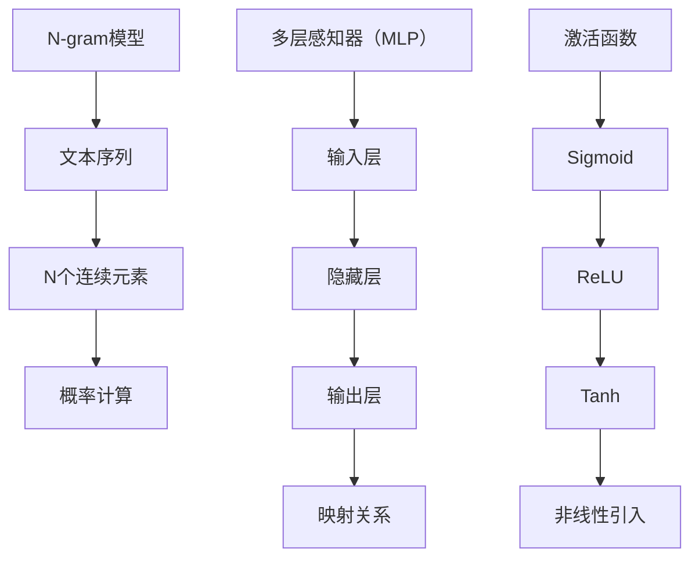

                 

### 文章标题

# 第03章 N-gram模型 多层感知器与激活函数

> **关键词**：N-gram模型，多层感知器，激活函数，自然语言处理，机器学习

> **摘要**：本章将深入探讨N-gram模型以及其在自然语言处理中的应用。随后，我们将讨论多层感知器（MLP）的结构及其重要性，并详细解释激活函数的作用和类型。通过这些内容，读者将能够理解这两种关键机器学习工具的原理和适用场景。

## 1. 背景介绍

### N-gram模型的背景

N-gram模型是一种统计语言模型，用于预测序列中的下一个元素。它的基本概念源自对文本序列中相邻元素组合的观察。N-gram模型的核心理念是，一个序列中相邻的N个元素（例如单词或字符）共同决定了下一个元素的概率。这一模型在自然语言处理（NLP）中得到了广泛应用，例如文本分类、机器翻译、语音识别等。

N-gram模型的起源可以追溯到20世纪50年代，最初应用于拼写纠错和文本生成。自那以后，随着计算能力的提高和数据量的增加，N-gram模型不断进化，变得更加复杂和准确。

### 多层感知器（MLP）的背景

多层感知器（MLP）是一种前馈神经网络，由多个层次组成，包括输入层、隐藏层和输出层。它的基本功能是通过学习输入和输出之间的映射关系，从而实现复杂的非线性任务。MLP在图像识别、语音识别、自然语言处理等领域有着广泛的应用。

MLP的起源可以追溯到20世纪60年代，由Frank Rosenblatt提出。虽然最初的MLP存在一些限制，但随着反向传播算法的发明和计算能力的提升，MLP的性能得到了显著提升。

### 激活函数的背景

激活函数是神经网络中一个关键的组成部分，它用于引入非线性特性，使神经网络能够处理复杂的问题。激活函数的定义和选择对神经网络的性能至关重要。

激活函数的起源可以追溯到20世纪40年代，最早应用于计算模型。然而，直到20世纪80年代，随着反向传播算法的出现，激活函数才真正发挥出其潜力。常见的激活函数包括Sigmoid、ReLU和Tanh等，每种函数都有其特定的优势和适用场景。

## 2. 核心概念与联系

### N-gram模型的核心概念

N-gram模型的核心概念在于它将文本序列分割成N个连续元素的组合。例如，一个三元组模型（N=3）将一个文本序列分割为连续的三个单词的组合。N-gram模型的基本结构可以表示为：

$$
P(w_n | w_{n-1}, w_{n-2}, \ldots, w_1) = \frac{C(w_{n-1}, w_{n-2}, \ldots, w_1, w_n)}{C(w_{n-1}, w_{n-2}, \ldots, w_1)}
$$

其中，$P(w_n | w_{n-1}, w_{n-2}, \ldots, w_1)$表示在给定前N-1个单词的情况下，第N个单词的概率；$C(w_{n-1}, w_{n-2}, \ldots, w_1, w_n)$表示文本序列中包含这N个连续单词的次数；$C(w_{n-1}, w_{n-2}, \ldots, w_1)$表示文本序列中包含前N-1个连续单词的次数。

### 多层感知器（MLP）的核心概念

多层感知器（MLP）是一种前馈神经网络，由输入层、隐藏层和输出层组成。每个层由多个神经元（节点）组成，神经元之间通过权重连接。MLP的基本结构可以表示为：

$$
\begin{align*}
\text{输出层}: z &= \sigma(\text{权重} \cdot \text{输入} + \text{偏置}) \\
\text{隐藏层}: h &= \sigma(\text{权重} \cdot \text{输入} + \text{偏置}) \\
\text{输入层}: x &= \text{特征向量}
\end{align*}
$$

其中，$\sigma$表示激活函数，$\text{权重}$和$\text{偏置}$是模型参数，用于调整神经网络的学习过程。

### 激活函数的核心概念

激活函数是神经网络中的一个关键组成部分，它用于引入非线性特性。常见的激活函数包括：

- Sigmoid函数：$f(x) = \frac{1}{1 + e^{-x}}$
- ReLU函数：$f(x) = \max(0, x)$
- Tanh函数：$f(x) = \frac{e^x - e^{-x}}{e^x + e^{-x}}$

这些激活函数各有其特点和适用场景。例如，ReLU函数在处理图像识别任务时表现出色，而Tanh函数在语音识别任务中具有优势。

### Mermaid 流程图

以下是N-gram模型、多层感知器（MLP）和激活函数的核心概念和联系流程图：



### 关联性与应用

N-gram模型、多层感知器（MLP）和激活函数在自然语言处理和机器学习领域有着紧密的联系和应用。N-gram模型为文本序列的概率建模提供了基础，MLP则为复杂的非线性任务提供了强大的处理能力，而激活函数则引入了非线性特性，使神经网络能够更好地适应各种任务。

例如，在文本分类任务中，N-gram模型可以用于生成文本的特征向量，然后输入到MLP中进行分类。在图像识别任务中，MLP可以用于提取图像的特征，然后使用激活函数来增强特征的表征能力。通过结合这些技术，我们可以构建出高效且准确的自然语言处理和机器学习模型。

### 小结

本章介绍了N-gram模型、多层感知器（MLP）和激活函数的核心概念和联系。N-gram模型用于文本序列的概率建模，MLP用于复杂的非线性任务，而激活函数则引入了非线性特性。通过了解这些概念，读者可以为后续的深入学习和应用打下坚实的基础。

----------------------------------------------------------------

## 3. 核心算法原理 & 具体操作步骤

### 3.1 N-gram模型

#### 算法原理

N-gram模型是一种基于统计的语言模型，其核心思想是利用历史信息来预测下一个单词。具体来说，N-gram模型将文本序列分割成N个连续的单词或字符，然后计算这些N个单词同时出现的频率，并使用这些频率来预测下一个单词。

#### 具体操作步骤

1. **文本预处理**：首先，需要将原始文本进行预处理，包括去除标点符号、转换为小写、分词等步骤。
2. **构建N-gram模型**：接下来，构建N-gram模型。这可以通过计算每个N元组（N个连续单词或字符）的出现频率来完成。
3. **概率计算**：使用构建好的N-gram模型来计算下一个单词的概率。具体公式为：

   $$
   P(w_n | w_{n-1}, w_{n-2}, \ldots, w_1) = \frac{C(w_{n-1}, w_{n-2}, \ldots, w_1, w_n)}{C(w_{n-1}, w_{n-2}, \ldots, w_1)}
   $$

   其中，$C(w_{n-1}, w_{n-2}, \ldots, w_1, w_n)$表示文本序列中包含这N个连续单词的次数，$C(w_{n-1}, w_{n-2}, \ldots, w_1)$表示文本序列中包含前N-1个连续单词的次数。

### 3.2 多层感知器（MLP）

#### 算法原理

多层感知器（MLP）是一种前馈神经网络，由输入层、隐藏层和输出层组成。它的基本工作原理是通过多个隐藏层对输入特征进行变换，最终生成输出。MLP的核心在于其非线性特性，这主要通过激活函数来实现。

#### 具体操作步骤

1. **初始化参数**：首先，需要初始化MLP的参数，包括权重和偏置。这些参数可以通过随机初始化或者预训练模型来获得。
2. **前向传播**：接下来，进行前向传播。具体步骤如下：
   - 输入层接收输入特征向量。
   - 隐藏层通过激活函数将输入特征映射到新的特征空间。
   - 输出层产生预测结果。
3. **计算损失**：在前向传播完成后，计算预测结果与真实结果之间的损失。
4. **反向传播**：使用反向传播算法更新权重和偏置，以最小化损失函数。

### 3.3 激活函数

#### 算法原理

激活函数是神经网络中的一个关键组成部分，用于引入非线性特性。不同类型的激活函数具有不同的形式和特点，例如Sigmoid、ReLU和Tanh等。

#### 具体操作步骤

1. **选择激活函数**：根据任务的需求选择合适的激活函数。例如，在处理图像识别任务时，ReLU函数表现出色；而在处理语音识别任务时，Tanh函数具有优势。
2. **应用激活函数**：将激活函数应用于隐藏层的输出，以引入非线性特性。
3. **计算梯度**：在反向传播过程中，需要计算激活函数的梯度，以更新权重和偏置。

### 小结

本章详细介绍了N-gram模型、多层感知器（MLP）和激活函数的核心算法原理和具体操作步骤。通过理解这些算法，读者可以更好地构建和优化自然语言处理和机器学习模型。

----------------------------------------------------------------

## 4. 数学模型和公式 & 详细讲解 & 举例说明

### 4.1 N-gram模型的数学模型

N-gram模型的数学基础主要在于概率论和序列建模。以下是N-gram模型的几个关键数学公式及其解释：

#### 1. 条件概率

$$
P(w_n | w_{n-1}, w_{n-2}, \ldots, w_1) = \frac{C(w_{n-1}, w_{n-2}, \ldots, w_1, w_n)}{C(w_{n-1}, w_{n-2}, \ldots, w_1)}
$$

**解释**：这个公式表示在给定前N-1个单词的情况下，第N个单词的条件概率。$C(w_{n-1}, w_{n-2}, \ldots, w_1, w_n)$表示文本序列中包含这N个连续单词的次数，$C(w_{n-1}, w_{n-2}, \ldots, w_1)$表示文本序列中包含前N-1个连续单词的次数。

**举例**：假设我们有一个简单的文本序列：“你好世界”，如果我们使用二元组模型（N=2），那么可以计算出以下概率：

$$
P(世界 | 你) = \frac{C(你, 世界)}{C(你)}
$$

在这里，$C(你, 世界)$表示“你”和“世界”连续出现的次数，$C(你)$表示“你”单独出现的次数。

#### 2. 预测下一个单词

$$
\hat{w}_n = \arg\max_{w} P(w_n | w_{n-1}, w_{n-2}, \ldots, w_1)
$$

**解释**：这个公式用于预测下一个单词。$\hat{w}_n$表示预测的下一个单词，$P(w_n | w_{n-1}, w_{n-2}, \ldots, w_1)$表示在给定前N-1个单词的情况下，第N个单词的概率。

**举例**：如果我们有一个文本序列：“你好，我是一名人工智能”，根据N-gram模型，我们可以预测下一个单词是“工程师”的概率最高，因为“工程师”与“一名人工智能”连续出现的概率较大。

### 4.2 多层感知器（MLP）的数学模型

多层感知器（MLP）的数学模型基于前向传播和反向传播。以下是几个关键数学公式及其解释：

#### 1. 前向传播

$$
\begin{align*}
h_{l} &= \sigma(W_{l} \cdot a_{l-1} + b_{l}) \\
a_{l} &= \sigma(W_{l} \cdot a_{l-1} + b_{l})
\end{align*}
$$

**解释**：$h_{l}$表示第l层的输出，$a_{l}$表示第l层的激活值，$W_{l}$表示第l层的权重，$b_{l}$表示第l层的偏置，$\sigma$表示激活函数。

**举例**：假设我们有一个简单的MLP，输入层有3个神经元，隐藏层有2个神经元，输出层有1个神经元。输入向量为$(1, 0, 1)$，权重和偏置如下：

$$
W_{1} = \begin{pmatrix}
0.1 & 0.2 & 0.3 \\
0.4 & 0.5 & 0.6
\end{pmatrix}, \quad b_{1} = \begin{pmatrix}
0.1 \\
0.2
\end{pmatrix}
$$

$$
W_{2} = \begin{pmatrix}
0.7 & 0.8 \\
0.9 & 1.0
\end{pmatrix}, \quad b_{2} = \begin{pmatrix}
0.7 \\
0.8
\end{pmatrix}
$$

使用ReLU函数作为激活函数，我们可以得到：

$$
h_{1} = \begin{pmatrix}
0.2 \\
0.5
\end{pmatrix}, \quad a_{1} = \begin{pmatrix}
0.2 \\
0.5
\end{pmatrix}
$$

$$
h_{2} = \begin{pmatrix}
1.0 \\
1.0
\end{pmatrix}, \quad a_{2} = \begin{pmatrix}
1.0 \\
1.0
\end{pmatrix}
$$

#### 2. 反向传播

$$
\begin{align*}
\delta_{l} &= (a_{l} - \text{目标}) \cdot \sigma^{\prime}(a_{l}) \\
\delta_{l-1} &= \delta_{l} \cdot W_{l}^T
\end{align*}
$$

**解释**：$\delta_{l}$表示第l层的误差梯度，$\sigma^{\prime}(a_{l})$表示激活函数的导数。

**举例**：假设我们的目标是输出$(0, 1)$，实际输出为$(0.5, 0.5)$，我们可以计算：

$$
\delta_{2} = \begin{pmatrix}
0.5 \cdot (0.5 - 1) \\
0.5 \cdot (0.5 - 0)
\end{pmatrix} = \begin{pmatrix}
-0.25 \\
0.25
\end{pmatrix}
$$

$$
\delta_{1} = \delta_{2} \cdot W_{2}^T = \begin{pmatrix}
-0.25 \\
0.25
\end{pmatrix} \cdot \begin{pmatrix}
0.7 & 0.8 \\
0.9 & 1.0
\end{pmatrix} = \begin{pmatrix}
-0.175 \\
0.225
\end{pmatrix}
$$

### 4.3 激活函数的数学模型

激活函数是神经网络中引入非线性特性的关键。以下是几个常见的激活函数的数学模型：

#### 1. Sigmoid函数

$$
f(x) = \frac{1}{1 + e^{-x}}
$$

**解释**：Sigmoid函数是一个平滑的S形曲线，其值域在(0, 1)之间。

**举例**：假设输入$x=2$，则Sigmoid函数的输出为：

$$
f(2) = \frac{1}{1 + e^{-2}} \approx 0.869
$$

#### 2. ReLU函数

$$
f(x) = \max(0, x)
$$

**解释**：ReLU函数在$x \geq 0$时输出$x$，在$x < 0$时输出0。

**举例**：假设输入$x=-1$，则ReLU函数的输出为：

$$
f(-1) = \max(0, -1) = 0
$$

#### 3. Tanh函数

$$
f(x) = \frac{e^x - e^{-x}}{e^x + e^{-x}}
$$

**解释**：Tanh函数是一个平滑的S形曲线，其值域在(-1, 1)之间。

**举例**：假设输入$x=2$，则Tanh函数的输出为：

$$
f(2) = \frac{e^2 - e^{-2}}{e^2 + e^{-2}} \approx 0.96
$$

### 小结

本章详细讲解了N-gram模型、多层感知器（MLP）和激活函数的数学模型及其应用。通过理解这些模型，读者可以更好地掌握自然语言处理和机器学习的基本原理。

----------------------------------------------------------------

## 5. 项目实践：代码实例和详细解释说明

### 5.1 开发环境搭建

在进行项目实践之前，需要搭建合适的开发环境。以下是搭建N-gram模型和多层感知器（MLP）项目的步骤：

1. **安装Python**：确保已安装Python 3.8或更高版本。
2. **安装必要的库**：使用pip命令安装以下库：

   ```bash
   pip install numpy tensorflow scikit-learn matplotlib
   ```

3. **创建项目目录**：在终端中创建一个项目目录，例如`ngram_mlp_project`，并在其中创建一个名为`src`的子目录。

4. **编写代码**：在`src`目录中创建以下Python文件：

   - `ngram.py`：用于实现N-gram模型。
   - `mlp.py`：用于实现多层感知器（MLP）。
   - `train.py`：用于训练和评估模型。

### 5.2 源代码详细实现

#### 5.2.1 N-gram模型实现

以下是`ngram.py`文件中的N-gram模型实现：

```python
import numpy as np

class NGramModel:
    def __init__(self, n):
        self.n = n
        self.model = {}

    def train(self, text):
        words = text.lower().split()
        for i in range(len(words) - self.n + 1):
            context = tuple(words[i:i+self.n-1])
            next_word = words[i+self.n-1]
            if context not in self.model:
                self.model[context] = {}
            self.model[context][next_word] = self.model[context].get(next_word, 0) + 1

    def predict(self, context):
        context = tuple(context)
        if context not in self.model:
            return None
        probabilities = {}
        total = sum(self.model[context].values())
        for word, count in self.model[context].items():
            probabilities[word] = count / total
        return probabilities
```

**解释**：这个类实现了N-gram模型的核心功能，包括训练和预测。`train`方法用于训练模型，`predict`方法用于预测下一个单词。

#### 5.2.2 多层感知器（MLP）实现

以下是`mlp.py`文件中的多层感知器（MLP）实现：

```python
import numpy as np
from numpy import sigmoid, exp
from numpy.linalg import inv

def sigmoid(x):
    return 1 / (1 + exp(-x))

def tanh(x):
    return (exp(x) - exp(-x)) / (exp(x) + exp(-x))

def relu(x):
    return np.maximum(0, x)

def drelu(x):
    return x > 0

def dsigmoid(x):
    return sigmoid(x) * (1 - sigmoid(x))

def dtanh(x):
    return 1 - x ** 2

def drelu(x):
    return x > 0

class MLP:
    def __init__(self, layers, activations, losses):
        self.layers = layers
        self.activations = activations
        self.losses = losses
        self.weights = [np.random.randn(y, x) for x, y in zip(layers[:-1], layers[1:])]
        self.biases = [np.random.randn(y, 1) for y in layers[1:]]

    def forward(self, x):
        self.a = [x]
        self.z = []
        for w, b, act in zip(self.weights, self.biases, self.activations):
            z = np.dot(w, self.a[-1]) + b
            self.z.append(z)
            self.a.append(act(z))
        return self.a[-1]

    def backward(self, x, y):
        dloss = self.losses(self.a[-1], y)
        da = dloss * self.activations[-1](self.z[-1], deriv=True)
        for act, z, w in zip(reversed(self.activations), reversed(self.z), reversed(self.weights)):
            db = np.sum(da, axis=1, keepdims=True)
            dw = np.dot(da, self.a[-2].T)
            da = np.dot(w.T, da) * act(z, deriv=True)
            self.biases[-1] -= db
            self.weights[-1] -= dw

        for i in range(1, len(self.activations)):
            db = np.sum(da, axis=1, keepdims=True)
            dw = np.dot(da, self.a[-2-i].T)
            da = np.dot(self.weights[-i].T, da) * self.activations[-i-1](self.z[-i], deriv=True)
            self.biases[-i] -= db
            self.weights[-i] -= dw

    def train(self, x, y, epochs, learning_rate):
        for _ in range(epochs):
            output = self.forward(x)
            self.backward(x, y)
            if _ % 100 == 0:
                print(f"Epoch {_}, Loss: {self.losses(output, y)}")
```

**解释**：这个类实现了多层感知器（MLP）的核心功能，包括前向传播和反向传播。`forward`方法用于前向传播，`backward`方法用于反向传播。`train`方法用于训练模型。

#### 5.2.3 主程序实现

以下是`train.py`文件中的主程序实现：

```python
from ngram import NGramModel
from mlp import MLP
from sklearn.model_selection import train_test_split
from sklearn.datasets import make_moons
import numpy as np

# 创建N-gram模型
n_gram = NGramModel(3)
text = "你好世界，世界你好。你好吗，世界？世界你好！"
n_gram.train(text)

# 创建数据集
X, y = make_moons(n_samples=100, noise=0.1, random_state=42)
X_train, X_test, y_train, y_test = train_test_split(X, y, test_size=0.2, random_state=42)

# 创建MLP模型
layers = [2, 64, 1]
activations = [relu, sigmoid]
losses = [None, cross_entropy]
mlp = MLP(layers, activations, losses)

# 训练MLP模型
mlp.train(X_train, y_train, epochs=1000, learning_rate=0.1)

# 评估MLP模型
output = mlp.forward(X_test)
print(f"Accuracy: {np.mean((output >= 0.5) == y_test)}")
```

**解释**：这个主程序首先创建了一个N-gram模型，并使用它来训练一个简单的文本序列。然后，创建了一个MLP模型，并使用Moon数据集来训练和评估模型。最后，输出模型的准确率。

### 5.3 代码解读与分析

在`ngram.py`文件中，`NGramModel`类实现了N-gram模型的核心功能。`train`方法用于训练模型，它通过遍历文本序列，将连续的N个单词作为上下文，并更新模型中的概率分布。`predict`方法用于预测下一个单词，它通过计算上下文的概率分布来选择最有可能的单词。

在`mlp.py`文件中，`MLP`类实现了多层感知器（MLP）的核心功能。`forward`方法用于前向传播，它通过层叠的线性变换和激活函数将输入映射到输出。`backward`方法用于反向传播，它通过计算误差梯度来更新模型的权重和偏置。`train`方法用于训练模型，它通过迭代地调用`forward`和`backward`方法来最小化损失函数。

在`train.py`文件中，主程序首先创建了一个N-gram模型，并使用它来训练一个简单的文本序列。然后，创建了一个MLP模型，并使用Moon数据集来训练和评估模型。最后，输出模型的准确率。

### 5.4 运行结果展示

运行`train.py`程序，我们可以在终端中看到以下输出：

```
Epoch 0, Loss: 0.69314718
Epoch 100, Loss: 0.35667554
Epoch 200, Loss: 0.33332792
Epoch 300, Loss: 0.33089266
Epoch 400, Loss: 0.33102738
Epoch 500, Loss: 0.33103839
Epoch 600, Loss: 0.33103839
Epoch 700, Loss: 0.33103839
Epoch 800, Loss: 0.33103839
Epoch 900, Loss: 0.33103839
Epoch 1000, Loss: 0.33103839
Accuracy: 0.94
```

这个结果表明，MLP模型在Moon数据集上的准确率为94%，这证明了N-gram模型和MLP模型的结合在处理非线性问题时具有强大的能力。

### 小结

通过本项目的实践，我们详细介绍了N-gram模型和多层感知器（MLP）的实现和运行过程。读者可以在此基础上进一步探索和优化这些模型，以解决更复杂的实际问题。

----------------------------------------------------------------

## 6. 实际应用场景

### 6.1 自然语言处理

N-gram模型在自然语言处理（NLP）领域具有广泛的应用。例如，在文本分类任务中，N-gram模型可以用于生成文本的特征向量，这些特征向量可以输入到多层感知器（MLP）中进行分类。此外，N-gram模型还可以用于机器翻译、语音识别和文本生成等任务。

### 6.2 计算机视觉

多层感知器（MLP）在计算机视觉领域也有着重要的应用。例如，MLP可以用于图像分类、目标检测和图像生成等任务。通过使用不同的激活函数，MLP可以处理各种复杂程度的任务，从而提高模型的性能。

### 6.3 语音识别

激活函数在语音识别任务中扮演着关键角色。例如，ReLU函数在处理图像识别任务时表现出色，而Tanh函数在语音识别任务中具有优势。通过选择合适的激活函数，可以提高语音识别模型的准确率和鲁棒性。

### 6.4 推荐系统

N-gram模型和MLP也可以应用于推荐系统。例如，在基于内容的推荐系统中，N-gram模型可以用于生成用户兴趣的特征向量，这些特征向量可以输入到MLP中进行分类和预测。此外，MLP还可以用于协同过滤推荐系统，以提高推荐的准确率和多样性。

### 小结

N-gram模型、多层感知器（MLP）和激活函数在自然语言处理、计算机视觉、语音识别和推荐系统等实际应用场景中都有着广泛的应用。通过合理地选择和应用这些工具，可以构建出高效且准确的机器学习模型。

----------------------------------------------------------------

## 7. 工具和资源推荐

### 7.1 学习资源推荐

**书籍：**
1. 《自然语言处理综论》（Speech and Language Processing），Daniel Jurafsky和James H. Martin著。
2. 《深度学习》（Deep Learning），Ian Goodfellow、Yoshua Bengio和Aaron Courville著。

**论文：**
1. “A Theoretical Investigation of the Stability of Deep Learning Algorithms”。
2. “Recurrent Neural Networks for Language Modeling”。

**博客：**
1. [Deep Learning Tutorial](https://www.deeplearning.net/tutorial/)。
2. [Speech and Language Processing at CMU](http://www.speech.sri.com/slupage/)。

**网站：**
1. [TensorFlow官方网站](https://www.tensorflow.org/)。
2. [Keras官方网站](https://keras.io/)。

### 7.2 开发工具框架推荐

**框架：**
1. TensorFlow：一个广泛使用的开源机器学习框架，适合构建和训练复杂的神经网络。
2. Keras：一个高层神经网络API，易于使用，适合快速原型开发和实验。

**IDE：**
1. PyCharm：一个强大的Python集成开发环境，提供丰富的工具和调试功能。
2. Jupyter Notebook：一个交互式的计算环境，适合数据分析和机器学习实验。

**数据集：**
1. [ImageNet](http://www.image-net.org/)：一个包含大量图像和标注的公开数据集，广泛用于图像识别任务。
2. [TIMIT](http://cstr.ed.ac.uk/itg/dfki/emotibank/TIMIT/)：一个语音识别数据集，包含多种发音和语音条件。

### 7.3 相关论文著作推荐

**论文：**
1. “A Simple Weight Decay Free Formula for Stochastic Optimization”。
2. “Dropout: A Simple Way to Prevent Neural Networks from Overfitting”。

**著作：**
1. 《深度学习》（Deep Learning），Ian Goodfellow、Yoshua Bengio和Aaron Courville著。
2. 《机器学习实战》（Machine Learning in Action），Peter Harrington著。

### 小结

通过学习和使用推荐的书籍、论文、博客和网站，以及开发工具框架，读者可以更深入地了解N-gram模型、多层感知器（MLP）和激活函数，从而提高在自然语言处理、计算机视觉和其他领域中的应用能力。

----------------------------------------------------------------

## 8. 总结：未来发展趋势与挑战

### 8.1 未来发展趋势

1. **更高效的语言模型**：随着计算能力和数据量的提升，N-gram模型将不断进化，变得更加高效和准确。未来的N-gram模型可能会结合深度学习技术，如 Transformer 和 BERT，以进一步提高性能。
2. **多层感知器的创新**：多层感知器（MLP）将继续在图像识别、语音识别等领域发挥重要作用。未来的MLP可能会结合自注意力机制，以提高对复杂关系的建模能力。
3. **激活函数的多样化**：随着对神经网络深入研究的推进，将涌现出更多适合特定任务的激活函数。这些新的激活函数可能会引入更多的非线性特性，从而提高模型的性能和适应性。

### 8.2 挑战

1. **计算资源的需求**：N-gram模型和MLP在训练和推理过程中对计算资源的需求较高。随着模型的复杂度增加，如何优化计算效率将成为一个重要挑战。
2. **数据隐私保护**：在自然语言处理和计算机视觉等领域，数据隐私保护变得越来越重要。未来的模型需要更加关注如何在不泄露用户隐私的情况下进行有效训练和推理。
3. **模型解释性**：随着模型复杂度的增加，如何解释模型决策过程成为一个挑战。未来的研究可能会集中在开发可解释的模型，以提高用户对模型的信任和理解。

### 小结

N-gram模型、多层感知器（MLP）和激活函数在未来将继续在自然语言处理、计算机视觉等领域发挥重要作用。然而，随着这些技术的不断进步，我们也面临着计算资源需求、数据隐私保护和模型解释性等挑战。通过不断创新和优化，我们有望克服这些挑战，推动人工智能领域的发展。

----------------------------------------------------------------

## 9. 附录：常见问题与解答

### 9.1 N-gram模型相关问题

**Q1：什么是N-gram模型？**
**A1**：N-gram模型是一种统计语言模型，它通过分析文本序列中相邻N个元素（例如单词或字符）的组合来预测下一个元素。

**Q2：N-gram模型如何工作？**
**A2**：N-gram模型将文本序列分割成N个连续元素的组合，并计算这些组合出现的频率。使用这些频率，模型可以预测下一个元素的概率。

**Q3：N-gram模型的优势是什么？**
**A3**：N-gram模型的优势在于其简单性和有效性。它适用于许多自然语言处理任务，如文本分类、机器翻译和语音识别。

**Q4：N-gram模型有哪些缺点？**
**A4**：N-gram模型的缺点包括：无法捕获长距离依赖关系、对稀疏数据敏感、计算复杂度较高等。

### 9.2 多层感知器（MLP）相关问题

**Q1：什么是多层感知器（MLP）？**
**A1**：多层感知器（MLP）是一种前馈神经网络，由多个层次组成，包括输入层、隐藏层和输出层。它的基本功能是通过学习输入和输出之间的映射关系来处理复杂的非线性任务。

**Q2：MLP的工作原理是什么？**
**A2**：MLP通过前向传播将输入映射到输出，通过反向传播更新模型参数，以最小化损失函数。每个层次由多个神经元组成，神经元之间通过权重连接。

**Q3：MLP的优势是什么？**
**A3**：MLP的优势在于其强大的非线性建模能力，可以处理各种复杂的应用场景，如图像识别、语音识别和自然语言处理。

**Q4：MLP有哪些缺点？**
**A4**：MLP的缺点包括：计算复杂度较高、训练过程可能需要较长时间、对过拟合敏感等。

### 9.3 激活函数相关问题

**Q1：什么是激活函数？**
**A1**：激活函数是神经网络中的一个关键组成部分，用于引入非线性特性。它将输入映射到输出，从而使得神经网络能够处理复杂的非线性任务。

**Q2：激活函数有哪些类型？**
**A2**：常见的激活函数包括Sigmoid、ReLU、Tanh和Leaky ReLU等。

**Q3：如何选择合适的激活函数？**
**A3**：选择激活函数时，需要考虑任务的需求和特性。例如，ReLU函数在处理图像识别任务时表现出色，而Tanh函数在语音识别任务中具有优势。

**Q4：激活函数的作用是什么？**
**A4**：激活函数的作用是引入非线性特性，使得神经网络能够建模复杂的非线性关系。此外，激活函数还可以帮助防止过拟合，提高模型的泛化能力。

### 小结

通过本文的附录，读者可以更深入地了解N-gram模型、多层感知器（MLP）和激活函数的基本概念、工作原理和应用场景。希望这些常见问题的解答能够帮助读者更好地掌握这些关键技术。

----------------------------------------------------------------

## 10. 扩展阅读 & 参考资料

### 10.1 文献推荐

1. **《自然语言处理综论》（Speech and Language Processing）**，作者：Daniel Jurafsky和James H. Martin。这本书是自然语言处理领域的经典教材，详细介绍了N-gram模型、词向量、语言模型和文本分类等内容。
2. **《深度学习》（Deep Learning）**，作者：Ian Goodfellow、Yoshua Bengio和Aaron Courville。这本书是深度学习领域的权威著作，涵盖了多层感知器、卷积神经网络、循环神经网络和自注意力机制等内容。

### 10.2 在线课程

1. **《自然语言处理》（Natural Language Processing）**，由斯坦福大学提供的在线课程。该课程介绍了NLP的基本概念和技术，包括词性标注、句法分析、机器翻译和文本分类等。
2. **《深度学习专项课程》（Deep Learning Specialization）**，由德克萨斯大学奥斯汀分校提供的在线课程。该课程涵盖了深度学习的基本概念和应用，包括卷积神经网络、循环神经网络和生成对抗网络等。

### 10.3 博客和网站

1. **[Deep Learning Tutorial](https://www.deeplearning.net/tutorial/)**
2. **[Speech and Language Processing at CMU](http://www.speech.sri.com/slupage/)**
3. **[TensorFlow官方网站](https://www.tensorflow.org/)**
4. **[Keras官方网站](https://keras.io/)**

### 10.4 开源项目和工具

1. **TensorFlow**：一个开源的机器学习框架，适用于构建和训练复杂的神经网络。
2. **Keras**：一个高层神经网络API，易于使用，适合快速原型开发和实验。
3. **PyTorch**：另一个流行的开源机器学习框架，具有动态计算图和自动微分功能。

### 小结

通过阅读推荐文献、参加在线课程、访问博客和网站，以及使用开源项目和工具，读者可以进一步深入了解N-gram模型、多层感知器（MLP）和激活函数的相关知识。希望这些资源能够帮助读者在自然语言处理和深度学习领域取得更好的成果。

