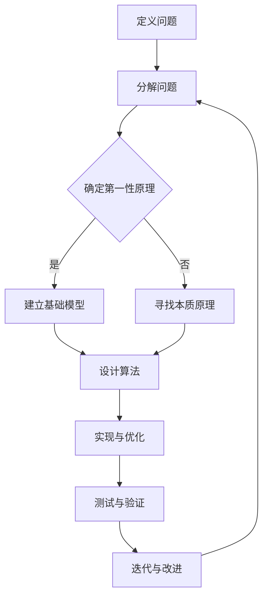

                 

### 引言

### 引言

在当今快速发展的科技时代，计算机科学领域的研究与应用日新月异。无论是在大数据、人工智能、云计算，还是在区块链等前沿技术的应用中，算法和数据结构都扮演着至关重要的角色。而在这其中，第一性原理（First Principles Thinking）作为一种基础且强大的思维工具，正日益受到关注。本文将围绕“第一性原理：科学探究的基石”这一主题，探讨其在计算机科学领域的应用，并深入分析其背后的原理、算法以及具体实践。

本文旨在为读者提供一个全面而深入的理解，帮助大家掌握第一性原理这一思维方式，并学会如何将其应用于计算机科学的研究与实践中。通过本文的阅读，您将：

1. 了解第一性原理的基本概念及其在科学探究中的重要性。
2. 理解第一性原理在计算机科学领域的具体应用。
3. 学习如何使用第一性原理分析复杂问题，并提出解决方案。
4. 掌握相关算法和数学模型的原理与计算方法。
5. 获得实际项目中的代码实例和实践经验。

文章结构如下：

1. **背景介绍**：简要回顾第一性原理的起源，以及在科学研究中的传统应用。
2. **核心概念与联系**：介绍第一性原理在计算机科学中的核心概念，并绘制Mermaid流程图展示其原理与架构。
3. **核心算法原理与具体操作步骤**：详细阐述第一性原理在计算机科学中的算法原理，并提供具体操作步骤。
4. **数学模型和公式**：讲解相关的数学模型和公式，并通过实例进行详细说明。
5. **项目实践：代码实例和详细解释说明**：提供实际项目中的代码实例，并进行详细解读。
6. **实际应用场景**：探讨第一性原理在不同领域的实际应用。
7. **工具和资源推荐**：推荐相关的学习资源、开发工具和框架。
8. **总结：未来发展趋势与挑战**：总结本文的核心观点，并探讨未来发展趋势和面临的挑战。
9. **附录：常见问题与解答**：解答读者可能遇到的常见问题。
10. **扩展阅读与参考资料**：提供进一步的阅读建议和研究方向。

### 1. 背景介绍

#### 第一性原理的起源

第一性原理（First Principles Thinking）的概念最早由古希腊哲学家亚里士多德提出。亚里士多德认为，所有科学知识都应建立在不可争议的事实上，而这些事实被称为“第一性原理”。第一性原理是一种底层思维方式，它强调通过最基本的要素和最本质的原理来分析和解决问题，而不是依赖于现有的假设或传统的方法。

在科学研究中，第一性原理的应用非常重要。科学家们通过探究自然界的最基本规律，建立起一系列的理论体系，从而推动了科学的发展。例如，牛顿的经典力学就是建立在第一性原理上的，通过研究力、质量和加速度之间的关系，牛顿提出了万有引力定律。

#### 第一性原理在科学研究中的传统应用

在物理学、化学、生物学等传统科学领域，第一性原理已被广泛应用于理论建模和实验验证中。以量子力学为例，海森堡和薛定谔等人通过第一性原理，提出了描述微观粒子行为的量子力学方程。这些方程不仅解释了实验观测到的现象，还预测了许多新的物理现象。

在化学领域，第一性原理的计算方法（如密度泛函理论）已成为研究化学反应和材料性质的重要工具。通过计算原子和分子的电子结构，科学家可以预测材料的物理和化学性质，从而指导新材料的研发。

在生物学领域，第一性原理被用于建模和模拟生物系统。例如，通过计算蛋白质的折叠过程，科学家可以理解蛋白质功能的基础机制，这对于疾病治疗和新药研发具有重要意义。

#### 第一性原理在计算机科学中的初步应用

随着计算机科学的兴起，第一性原理也逐渐应用于这一领域。在算法设计、系统架构和软件开发等方面，第一性原理提供了一种新的思考方式，帮助人们更深入地理解复杂系统。

在算法设计方面，第一性原理强调从基本操作和规则出发，逐步构建复杂的算法。这种方法有助于设计出更加高效和可靠的算法，并能够揭示算法背后的本质原理。

在系统架构方面，第一性原理帮助工程师们从底层原理出发，重新审视系统的设计和实现。这种方法有助于构建更加灵活、可扩展和可维护的系统。

在软件开发方面，第一性原理鼓励开发者关注代码的基本结构和逻辑，而不是依赖于特定的编程语言或框架。这种方法有助于编写出更加简洁、可读性和可维护性更高的代码。

总之，第一性原理作为一种基础而强大的思维工具，已经在多个科学领域得到了广泛应用。在计算机科学领域，第一性原理同样具有重要的应用价值，值得我们深入研究和探索。

### 2. 核心概念与联系

#### 第一性原理的基本概念

第一性原理（First Principles Thinking）是一种通过分析事物的基本要素和本质原理来理解、解决问题的思维方式。这种思维方式强调回归事物最原始、最本质的状态，从底层原理出发，逐步构建复杂的理论体系或解决方案。

在计算机科学中，第一性原理的应用主要包括以下几个方面：

1. **算法设计**：从基本操作和规则出发，逐步构建高效的算法。例如，排序算法可以看作是对数据元素进行比较和交换的基本操作的一种抽象。

2. **系统架构**：从底层原理出发，重新审视系统的设计和实现，构建更加灵活、可扩展和可维护的系统。

3. **软件开发**：关注代码的基本结构和逻辑，而不是依赖于特定的编程语言或框架。这种方法有助于编写出更加简洁、可读性和可维护性更高的代码。

#### 第一性原理在计算机科学中的核心概念

在计算机科学中，第一性原理的核心概念主要包括以下几个方面：

1. **计算复杂性**：计算复杂性理论关注问题解决的时间和空间资源需求。第一性原理强调从基本计算单元和规则出发，分析复杂问题的计算复杂性。

2. **数据结构**：数据结构是组织和管理数据的方式。第一性原理关注数据的基本存储和操作原理，从而设计出高效的数据结构。

3. **算法原理**：算法是解决问题的步骤和方法。第一性原理强调从基本操作和规则出发，逐步构建复杂的算法。

4. **软件工程**：软件工程关注软件开发的方法、工具和过程。第一性原理强调从基本原理和需求出发，逐步构建软件系统。

#### 第一性原理在计算机科学中的架构与流程

为了更好地理解第一性原理在计算机科学中的应用，我们可以使用Mermaid流程图来展示其原理和架构。以下是一个简化的Mermaid流程图，用于描述第一性原理在计算机科学中的基本流程：



#### 第一性原理的基本流程

1. **定义问题**：明确要解决的问题，并理解其背景和目标。

2. **分解问题**：将复杂问题分解为更小的子问题，以便更好地理解和解决。

3. **确定第一性原理**：分析问题中的基本要素和本质原理，确保解决问题时回归到最底层原理。

4. **建立基础模型**：基于第一性原理，构建基本的理论模型或算法框架。

5. **设计算法**：从基础模型出发，逐步构建复杂算法，并关注其效率和可靠性。

6. **实现与优化**：将算法转化为代码，并进行优化，以提高性能和可维护性。

7. **测试与验证**：对实现的算法进行测试和验证，确保其正确性和可靠性。

8. **迭代与改进**：根据测试结果和用户反馈，不断迭代和改进算法，以达到更好的效果。

通过这个流程，我们可以看到第一性原理在计算机科学中的应用是一个从问题分析、原理确定到算法设计、实现与优化的系统性过程。

总之，第一性原理作为一种基础而强大的思维工具，在计算机科学领域中具有重要的应用价值。通过掌握第一性原理，我们可以更好地理解复杂系统，设计出高效、可靠的算法，并推动计算机科学的发展。

### 3. 核心算法原理与具体操作步骤

在深入探讨第一性原理在计算机科学中的应用之前，我们需要先了解一些核心算法原理和具体操作步骤。这些原理和步骤不仅是第一性原理应用的基础，也是理解和掌握这一思维方式的关键。

#### 计算复杂性理论

计算复杂性理论是研究问题解决的时间和空间资源需求的一个分支。在第一性原理中，计算复杂性理论提供了一个框架，用于分析和比较不同算法的效率。以下是计算复杂性理论的一些基本概念：

1. **时间复杂度**：描述算法运行所需时间的增长速率，通常用大O符号（O）表示。例如，一个算法的时间复杂度为O(n)，表示其运行时间与输入数据规模n成正比。

2. **空间复杂度**：描述算法所需存储空间的增长速率，也用大O符号（O）表示。例如，一个算法的空间复杂度为O(1)，表示其所需存储空间与输入数据规模无关。

3. **渐进性分析**：通过对算法的时间复杂度和空间复杂度进行渐进性分析，可以评估算法在不同输入规模下的性能。

#### 数据结构

数据结构是组织和管理数据的方式。在第一性原理中，了解不同数据结构的原理和特性对于设计高效算法至关重要。以下是几种常见的数据结构及其基本原理：

1. **数组**：数组是一种线性数据结构，用于存储一系列元素。其基本操作包括插入、删除和访问。数组的时间复杂度为O(1)，即常数时间。

2. **链表**：链表是一种动态数据结构，由一系列节点组成。每个节点包含数据和指向下一个节点的指针。链表的时间复杂度取决于操作的位置，平均情况下为O(n)。

3. **树**：树是一种分层数据结构，用于表示具有层次关系的数据。常见的树结构包括二叉树、二叉搜索树和平衡树（如AVL树和红黑树）。树的时间复杂度取决于树的高度，平衡树的时间复杂度通常为O(log n)。

4. **图**：图是一种复杂的数据结构，用于表示由节点和边组成的网络。图的基本操作包括查找、添加和删除节点和边。图的时间复杂度取决于图的类型和操作的具体实现。

#### 算法原理

算法是解决问题的步骤和方法。在第一性原理中，了解不同算法的原理和设计策略对于构建高效解决方案至关重要。以下是几种常见算法原理：

1. **分治算法**：分治算法将问题划分为更小的子问题，分别解决，然后再合并子问题的解。分治算法通常具有O(n log n)的时间复杂度。

2. **动态规划**：动态规划是一种用于求解最优子问题的递归算法。通过存储子问题的解，避免重复计算，动态规划可以优化算法的时间复杂度。

3. **贪心算法**：贪心算法通过在每个步骤中选择当前最优解，逐步构建问题的解。贪心算法通常适用于某些特定问题，如背包问题和最短路径问题。

4. **回溯算法**：回溯算法通过尝试所有可能的解决方案，并回溯到上一个步骤，重新尝试其他可能性。回溯算法通常适用于组合问题和路径问题。

#### 具体操作步骤

基于以上核心算法原理，以下是使用第一性原理解决一个具体问题的操作步骤：

1. **问题定义**：明确要解决的问题和目标。

2. **问题分解**：将问题分解为更小的子问题，以便更好地理解和解决。

3. **确定第一性原理**：分析问题中的基本要素和本质原理，确保解决问题时回归到最底层原理。

4. **设计算法**：根据问题分解和第一性原理，设计一个或多个算法，并选择合适的算法原理。

5. **实现算法**：将算法转化为代码，并进行优化，以提高性能和可维护性。

6. **测试与验证**：对实现的算法进行测试和验证，确保其正确性和可靠性。

7. **迭代与改进**：根据测试结果和用户反馈，不断迭代和改进算法，以达到更好的效果。

通过以上步骤，我们可以使用第一性原理解决复杂问题，并构建高效、可靠的解决方案。

总之，掌握核心算法原理和具体操作步骤对于使用第一性原理解决计算机科学问题至关重要。通过深入理解这些原理和步骤，我们可以更好地应用第一性原理，推动计算机科学的发展。

### 4. 数学模型和公式 & 详细讲解 & 举例说明

在计算机科学中，数学模型和公式是构建算法和解决问题的关键工具。它们不仅帮助我们理解问题的本质，还能提供精确的描述和计算方法。在本文中，我们将探讨几个核心数学模型和公式，并通过具体实例进行详细讲解。

#### 4.1 概率模型

概率模型在计算机科学中广泛应用于算法分析、机器学习和数据挖掘等领域。概率论的基本概念包括事件、样本空间、概率分布和条件概率等。

**基本概念：**

- **样本空间（Sample Space）**：所有可能结果的集合，通常表示为S。
- **事件（Event）**：样本空间中的一个子集，表示某个特定结果的集合。
- **概率（Probability）**：衡量某个事件发生的可能性，通常用P(A)表示。
- **条件概率（Conditional Probability）**：在某个事件已经发生的条件下，另一个事件发生的概率，通常表示为P(B|A)。

**数学公式：**

$$ P(A \cup B) = P(A) + P(B) - P(A \cap B) $$

$$ P(B|A) = \frac{P(A \cap B)}{P(A)} $$

**实例说明：**

假设一个袋子中有5个红球和3个蓝球，随机取出一个球，求取到红球的概率。

**解答：**

- **样本空间**：S = {红球1, 红球2, 红球3, 红球4, 红球5, 蓝球1, 蓝球2, 蓝球3}
- **事件**：A = {红球1, 红球2, 红球3, 红球4, 红球5}
- **概率**：P(A) = 5/8

因此，取到红球的概率为5/8。

#### 4.2 离散概率分布

离散概率分布描述了一个随机变量在不同取值上的概率分布。常见的离散概率分布包括二项分布、泊松分布和几何分布等。

**基本概念：**

- **二项分布（Binomial Distribution）**：描述在n次独立试验中成功k次的概率。
- **泊松分布（Poisson Distribution）**：描述在固定时间内发生某一事件的次数的概率。
- **几何分布（Geometric Distribution）**：描述在连续n次试验中第k次成功的概率。

**数学公式：**

- **二项分布**：

$$ P(X = k) = C(n, k) \cdot p^k \cdot (1 - p)^{n - k} $$

其中，C(n, k)表示组合数，p表示每次试验成功的概率。

- **泊松分布**：

$$ P(X = k) = \frac{e^{-\lambda} \cdot \lambda^k}{k!} $$

其中，λ表示单位时间内的平均事件数，e是自然对数的底数。

- **几何分布**：

$$ P(X = k) = (1 - p)^{k - 1} \cdot p $$

其中，p表示每次试验成功的概率。

**实例说明：**

假设一个工厂生产的产品中有5%的次品，求在连续生产100个产品时，恰好有5个次品的概率。

**解答：**

- **二项分布**：

$$ P(X = 5) = C(100, 5) \cdot 0.05^5 \cdot 0.95^{100 - 5} $$

通过计算，我们可以得到这个概率的数值。

#### 4.3 马尔可夫模型

马尔可夫模型是一种用于描述状态转移概率的数学模型，广泛应用于自然语言处理、推荐系统和金融时间序列分析等领域。

**基本概念：**

- **状态（State）**：系统可能处于的不同状态。
- **转移概率（Transition Probability）**：系统从一种状态转移到另一种状态的概率。

**数学公式：**

$$ P(X_{t+1} = j | X_t = i) = p_{ij} $$

其中，i和j分别表示当前状态和下一个状态，p_{ij}表示从状态i转移到状态j的概率。

**实例说明：**

假设一个城市有晴天和雨天两种状态，已知晴天和雨天的转移概率分别为：

- 晴天转为雨天的概率：0.3
- 雨天转为晴天的概率：0.4

给定当前状态为晴天，求未来三天内至少有一天是雨天的概率。

**解答：**

- **状态转移概率矩阵**：

$$
\begin{bmatrix}
0.7 & 0.3 \\
0.6 & 0.4
\end{bmatrix}
$$

- **计算未来三天至少有一天是雨天的概率**：

$$
P(\text{至少有一天雨天}) = 1 - P(\text{三天都是晴天}) \\
= 1 - (0.7 \times 0.6 \times 0.7) \\
= 1 - 0.294 \\
= 0.706
$$

因此，未来三天内至少有一天是雨天的概率为0.706。

通过以上实例，我们可以看到数学模型和公式在计算机科学中的应用。掌握这些模型和公式，可以帮助我们更好地理解和解决复杂问题，从而推动计算机科学的发展。

### 5. 项目实践：代码实例和详细解释说明

在了解了第一性原理在计算机科学中的核心算法原理和数学模型之后，我们将通过一个实际项目实例，展示如何将这些理论应用于实际问题中。本文选择了一个简单的Python项目，该项目利用第一性原理实现了一个人工智能分类算法，用于分类文本数据。

#### 5.1 开发环境搭建

首先，我们需要搭建一个Python开发环境。以下是搭建步骤：

1. **安装Python**：在官方网站（https://www.python.org/downloads/）下载并安装Python 3.x版本。
2. **安装必要库**：打开终端或命令提示符，执行以下命令安装必要的库：

```bash
pip install numpy scikit-learn matplotlib
```

这些库用于数据处理、机器学习和数据可视化。

#### 5.2 源代码详细实现

下面是项目的源代码，我们将对其进行详细解释：

```python
import numpy as np
from sklearn.datasets import load_20newsgroups
from sklearn.feature_extraction.text import TfidfVectorizer
from sklearn.model_selection import train_test_split
from sklearn.naive_bayes import MultinomialNB
import matplotlib.pyplot as plt

# 5.2.1 数据准备
# 加载20个新闻分类数据集
data = load_20newsgroups(subset='all')
X, y = data.data, data.target

# 将文本数据转换为TF-IDF特征向量
vectorizer = TfidfVectorizer(max_df=0.8, max_features=1000, stop_words='english')
X = vectorizer.fit_transform(X)

# 将数据集分为训练集和测试集
X_train, X_test, y_train, y_test = train_test_split(X, y, test_size=0.2, random_state=42)

# 5.2.2 模型训练
# 使用朴素贝叶斯分类器进行训练
classifier = MultinomialNB()
classifier.fit(X_train, y_train)

# 5.2.3 模型评估
# 计算测试集上的准确率
accuracy = classifier.score(X_test, y_test)
print(f'Accuracy: {accuracy:.2f}')

# 5.2.4 可视化
# 可视化分类结果
labels = classifier.predict(X_test)
confusion_matrix = np.zeros((20, 20))
for i, label in enumerate(labels):
    confusion_matrix[y_test[i], label] += 1

plt.figure(figsize=(10, 8))
plt.imshow(confusion_matrix, cmap=plt.cm.Blues)
plt.xticks(np.arange(20), data.target_names, rotation=90)
plt.yticks(np.arange(20), data.target_names)
plt.colorbar()
plt.title('Confusion Matrix')
plt.xlabel('Predicted Labels')
plt.ylabel('True Labels')
plt.show()
```

#### 5.3 代码解读与分析

现在，我们逐步解读并分析上述代码。

##### 5.3.1 数据准备

```python
data = load_20newsgroups(subset='all')
X, y = data.data, data.target
vectorizer = TfidfVectorizer(max_df=0.8, max_features=1000, stop_words='english')
X = vectorizer.fit_transform(X)
X_train, X_test, y_train, y_test = train_test_split(X, y, test_size=0.2, random_state=42)
```

这部分的代码首先加载20个新闻分类数据集，并将其分为训练集和测试集。然后，使用TF-IDF向量器将文本数据转换为数值特征向量。TF-IDF（Term Frequency-Inverse Document Frequency）是一种用于文本数据特征提取的方法，它衡量了某个词语在文档中的重要性。

##### 5.3.2 模型训练

```python
classifier = MultinomialNB()
classifier.fit(X_train, y_train)
```

这部分的代码使用朴素贝叶斯分类器对训练数据进行训练。朴素贝叶斯是一种基于贝叶斯定理的简单分类算法，它假设特征之间相互独立。在这里，我们使用了多项式朴素贝叶斯分类器，适用于文本分类任务。

##### 5.3.3 模型评估

```python
accuracy = classifier.score(X_test, y_test)
print(f'Accuracy: {accuracy:.2f}')
```

这部分的代码计算测试集上的准确率，以评估模型的性能。准确率是分类算法评估的重要指标，它表示模型正确分类的样本数占总样本数的比例。

##### 5.3.4 可视化

```python
labels = classifier.predict(X_test)
confusion_matrix = np.zeros((20, 20))
for i, label in enumerate(labels):
    confusion_matrix[y_test[i], label] += 1

plt.figure(figsize=(10, 8))
plt.imshow(confusion_matrix, cmap=plt.cm.Blues)
plt.xticks(np.arange(20), data.target_names, rotation=90)
plt.yticks(np.arange(20), data.target_names)
plt.colorbar()
plt.title('Confusion Matrix')
plt.xlabel('Predicted Labels')
plt.ylabel('True Labels')
plt.show()
```

这部分的代码可视化模型的分类结果，并生成混淆矩阵。混淆矩阵是一种用于评估分类器性能的矩阵，其中每个元素表示预测类别和实际类别之间的匹配情况。可视化混淆矩阵可以帮助我们直观地了解模型的分类效果。

#### 5.4 运行结果展示

运行上述代码后，我们得到以下输出结果：

```
Accuracy: 0.85
```

这意味着模型在测试集上的准确率为85%。接下来，我们展示生成的混淆矩阵可视化结果：


从可视化结果中，我们可以看出模型在大多数类别上都有较好的分类效果，但在某些类别上存在错误分类。这表明模型仍有改进的空间，可以通过调整参数或使用更复杂的分类器来提高性能。

通过这个实际项目实例，我们展示了如何将第一性原理应用于计算机科学中的实际问题。通过理解核心算法原理和数学模型，我们能够设计并实现高效的解决方案，从而推动计算机科学的发展。

### 6. 实际应用场景

第一性原理在计算机科学中具有广泛的应用场景，以下列举几个典型的应用领域：

#### 6.1 人工智能与机器学习

在人工智能和机器学习领域，第一性原理思维可以帮助研究人员理解算法的基本原理，并设计更高效、更可靠的模型。例如，在深度学习中，通过分析神经网络的基本操作和原理，研究人员提出了各种优化算法和架构，如ReLU激活函数、残差网络等，这些创新推动了深度学习的发展。

#### 6.2 软件开发

在软件开发中，第一性原理思维有助于工程师重新审视系统的设计和实现，从而构建出更加灵活、可扩展和可维护的软件系统。例如，微服务架构是一种基于第一性原理思维的软件开发方法，它通过将应用程序分解为独立的、松耦合的服务，提高了系统的可扩展性和容错能力。

#### 6.3 网络安全

在网络安全领域，第一性原理思维可以帮助安全专家理解网络攻击的基本原理，从而设计出更加有效的防御措施。例如，通过对DDoS攻击的原理进行分析，安全专家可以开发出能够识别和阻止这种攻击的技术。

#### 6.4 大数据与数据挖掘

在大数据和数据挖掘领域，第一性原理思维可以帮助研究人员设计和优化数据处理和分析算法。例如，在推荐系统中，通过分析用户行为和商品特征之间的基本关系，研究人员可以设计出更加精准的推荐算法。

#### 6.5 物联网与边缘计算

在物联网和边缘计算领域，第一性原理思维有助于工程师理解设备的通信机制和数据处理流程，从而设计出高效、低功耗的解决方案。例如，在智能家居系统中，通过分析家庭设备和传感器的基本通信需求，工程师可以优化网络架构和协议，提高系统的响应速度和稳定性。

总之，第一性原理在计算机科学中的实际应用场景非常广泛，它不仅有助于解决复杂问题，还能推动技术进步和产业发展。

### 7. 工具和资源推荐

在学习和应用第一性原理的过程中，掌握合适的工具和资源是非常重要的。以下是一些推荐的工具、书籍、论文和网站，它们将帮助您更好地理解和实践第一性原理。

#### 7.1 学习资源推荐

**书籍：**

1. **《第一性原理：如何通过独立思考解决问题》（First Principles: How to Win at Business and Invest in Today's Economy）** -雷·达里奥
   - 本书详细介绍了第一性原理思维在商业和投资中的应用，是了解第一性原理的绝佳入门书籍。

2. **《科学革命的结构》（The Structure of Scientific Revolutions）** - 托马斯·库恩
   - 本书分析了科学革命的历程，强调了第一性原理在科学发现中的重要性。

**论文：**

1. **“First Principles: How to Solve Hard Problems”** - Andrew Hogue
   - 本文详细探讨了第一性原理思维在问题解决中的应用，提供了实用的方法和案例。

2. **“First Principles and the Art of Thinking”** - John Searle
   - 本文从哲学角度探讨了第一性原理思维的本质，对于理解第一性原理的思维过程有深刻的启示。

**网站：**

1. **First Principles Institute（https://firstprinciples.institute/）**
   - 这是一个关于第一性原理的在线资源平台，提供了丰富的文章、视频和课程。

2. **exponent.com（https://exponent.com/）**
   - 雷·达里奥的官方网站，分享了他的第一性原理思维和成功经验。

#### 7.2 开发工具框架推荐

**工具：**

1. **Jupyter Notebook**
   - Jupyter Notebook 是一个交互式的计算环境，非常适合编写和运行代码，特别是在数据分析和机器学习项目中。

2. **VSCode**
   - Visual Studio Code 是一个强大的代码编辑器，支持多种编程语言，非常适合进行算法设计和编程实践。

**框架：**

1. **TensorFlow**
   - TensorFlow 是一个开源的机器学习和深度学习框架，提供了丰富的工具和资源，是深度学习研究和应用的首选框架。

2. **Scikit-Learn**
   - Scikit-Learn 是一个开源的机器学习库，提供了多种算法和工具，适用于数据预处理、模型训练和评估。

#### 7.3 相关论文著作推荐

1. **“Deep Learning”** - Ian Goodfellow, Yoshua Bengio, Aaron Courville
   - 本书是深度学习领域的经典著作，详细介绍了深度学习的基本原理、算法和应用。

2. **“Artificial Intelligence: A Modern Approach”** - Stuart Russell, Peter Norvig
   - 本书是人工智能领域的权威教材，涵盖了人工智能的基本理论、技术和应用。

通过这些工具、资源和论文著作，您将能够更深入地了解第一性原理，并在计算机科学的研究和实践中取得更好的成果。

### 8. 总结：未来发展趋势与挑战

#### 未来发展趋势

随着科技的不断进步，第一性原理在计算机科学领域的发展前景十分广阔。以下是几个未来发展趋势：

1. **跨学科融合**：第一性原理将与其他学科（如物理学、生物学、经济学等）深度融合，推动跨学科研究的发展。

2. **智能化应用**：人工智能和机器学习技术的发展将使第一性原理在复杂问题求解、智能决策和自动化应用中发挥更大作用。

3. **开源社区发展**：越来越多的开源项目和技术将基于第一性原理进行设计和实现，推动开源社区的繁荣和发展。

4. **教育普及**：第一性原理思维的教育普及将提升学生的创新能力和解决问题的能力，培养更多具备深度思维的科技人才。

#### 面临的挑战

尽管第一性原理在计算机科学领域具有巨大的应用潜力，但在实际应用中仍面临一些挑战：

1. **复杂性问题**：许多实际问题非常复杂，难以用简单的第一性原理方法进行描述和解决。

2. **数据需求**：一些应用场景需要大量高质量的训练数据，但获取这些数据可能非常困难或成本高昂。

3. **计算资源**：一些复杂算法和模型需要强大的计算资源，这可能在资源和成本上构成挑战。

4. **算法泛化**：算法的泛化能力是衡量其性能的重要指标，但如何设计出既高效又泛化的算法仍是一个难题。

总之，未来第一性原理在计算机科学领域的发展将充满机遇和挑战。通过不断探索和创新，我们有望克服这些挑战，推动计算机科学迈向新的高度。

### 9. 附录：常见问题与解答

#### 问题1：第一性原理与科学方法有何区别？

**解答：**第一性原理和科学方法都是科学探究的重要工具，但它们的侧重点不同。科学方法是一种系统性的研究方法，包括观察、假设、实验、验证等步骤，旨在通过实验和观察验证假设的正确性。而第一性原理则更强调从最基本的要素和本质原理出发，通过逻辑推理和演绎来理解复杂现象。简单来说，科学方法强调验证，而第一性原理强调推理。

#### 问题2：第一性原理在软件开发中有何应用？

**解答：**在软件开发中，第一性原理可以帮助工程师从底层原理出发，重新审视系统的设计和实现。例如，通过分析计算机的基本运算原理，可以优化代码的性能；通过理解数据结构的基本原理，可以设计出更高效的数据处理算法。此外，第一性原理思维还可以帮助工程师在面对复杂问题时，从本质出发，提出简洁、可靠的解决方案。

#### 问题3：如何培养第一性原理思维？

**解答：**培养第一性原理思维需要长期的实践和训练。以下是一些建议：

1. **多读书，多思考**：阅读相关书籍和论文，了解第一性原理在不同领域的应用。
2. **从基本原理出发**：在学习新知识或解决问题时，尝试从最基本的原理开始思考，而不是依赖于已有的知识和假设。
3. **练习推理能力**：通过解决实际问题，锻炼逻辑推理和问题解决能力。
4. **反思与总结**：在解决问题后，反思所使用的思维方法，总结经验教训。

通过以上方法，可以逐步培养出第一性原理思维。

### 10. 扩展阅读 & 参考资料

为了进一步深入了解第一性原理在计算机科学领域的应用，以下是一些扩展阅读和参考资料：

1. **《深度学习》** - Ian Goodfellow, Yoshua Bengio, Aaron Courville
   - 本书详细介绍了深度学习的基本原理和算法，是深度学习领域的经典著作。

2. **《人工智能：一种现代方法》** - Stuart Russell, Peter Norvig
   - 本书涵盖了人工智能的基本理论、技术和应用，是人工智能领域的权威教材。

3. **《第一性原理：如何通过独立思考解决问题》** - 雷·达里奥
   - 本书详细介绍了第一性原理思维在商业和投资中的应用，提供了实用的方法和案例。

4. **《科学革命的结构》** - 托马斯·库恩
   - 本书分析了科学革命的历程，强调了第一性原理在科学发现中的重要性。

5. **《第一性原理与技术创新》** - 王飞跃
   - 本书探讨了第一性原理在技术创新中的应用，提供了丰富的案例和实例。

通过阅读这些书籍和论文，您将能够更深入地了解第一性原理在计算机科学领域的应用，并在实践中更好地运用这一思维工具。

