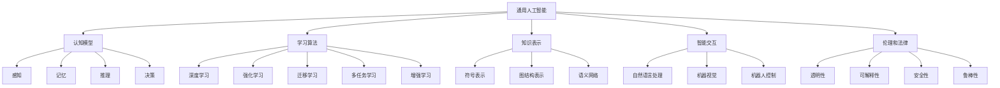

                 

### 背景介绍

#### 1.1 第三代人工智能的定义与背景

第三代人工智能（Artificial General Intelligence, AGI）是指一种具有普遍智能的人工智能系统，能够理解、学习、适应并解决各种复杂问题，其能力远超当前基于特定任务的窄域人工智能（Narrow Artificial Intelligence, NAII）。这一概念起源于人工智能领域的早期探索，但直到最近几年，随着计算能力的飞速提升和数据量的爆炸增长，AGI才逐渐成为研究热点。

人工智能的发展经历了三个阶段：规则驱动的人工智能、知识工程和机器学习。传统的人工智能主要依赖于预先定义的规则和知识库，尽管在一些领域取得了成功，但其在处理复杂问题和不确定性方面的能力有限。随着机器学习技术的兴起，人工智能进入了一个新的时代，这一阶段以数据和算法为核心，通过深度学习、强化学习等方法，使机器具备了自主学习和决策的能力。

然而，现有的机器学习模型仍然存在一些局限性，如对数据的依赖性过高、难以解释、难以泛化到新的领域等问题。这些局限性促使人工智能研究者开始探索更高级的智能形式——第三代人工智能。

#### 1.2 第三代人工智能的重要性

第三代人工智能的研究对于人类社会的发展具有重要意义。首先，AGI有望在各个领域实现更智能、更高效的任务执行，从而提高生产力。例如，在医疗领域，AGI可以辅助医生进行诊断和治疗，提高医疗服务的质量和效率。在工业生产领域，AGI可以优化生产流程，降低成本，提高产品质量。

其次，AGI的发展有望解决当前人工智能系统中存在的伦理和法律问题。例如，如何确保人工智能系统的决策过程是透明和可解释的，如何避免人工智能系统在处理敏感数据时出现偏见和歧视等问题。

最后，AGI的研究还将推动人工智能技术的进一步创新，为未来人工智能的发展提供新的理论基础和技术手段。

#### 1.3 第三代人工智能的研究现状与挑战

目前，第三代人工智能的研究正处于快速发展阶段。虽然已经取得了一些初步成果，但仍然面临诸多挑战。首先，如何构建一个具有普遍智能的人工智能系统，仍然是一个亟待解决的问题。现有的人工智能系统大多是基于特定任务的，如何使它们具备更广泛的适应能力，是一个重要的研究方向。

其次，如何提高人工智能系统的透明性和可解释性，使其决策过程更加清晰和可控，也是当前研究的热点。现有的机器学习模型往往被视为“黑箱”，其内部的工作机制难以理解，这在某些应用场景中可能会引发信任危机。

最后，如何确保人工智能系统的安全性和鲁棒性，避免其在处理未知或异常情况时出现故障，也是第三代人工智能研究需要解决的重要问题。

综上所述，第三代人工智能的发展前景广阔，但也面临着诸多挑战。未来，我们需要在理论和实践上不断探索，推动人工智能技术的创新，为实现真正的通用智能奠定基础。

### 核心概念与联系

#### 2.1 AGI（通用人工智能）的基本概念

通用人工智能（Artificial General Intelligence，简称AGI）是指一种能够像人类一样思考、学习和解决问题的智能系统。与当前的窄域人工智能（Narrow AI）不同，AGI具有广泛的认知能力和适应性，能够处理各种复杂的问题，并在不同领域表现出卓越的性能。

AGI的核心特点是：

1. **普遍性**：AGI能够理解并执行多种任务，而不仅仅是特定领域的任务。
2. **自主学习能力**：AGI能够通过自我学习和经验积累，不断优化和改进自身的性能。
3. **自适应能力**：AGI能够在不同环境和条件下，灵活地调整自己的行为和策略。
4. **情感和意识**：尽管目前对情感和意识的定义尚未统一，但AGI可能需要具备一定的情感和意识，以更好地理解和适应人类的行为和需求。

#### 2.2 AGI与NAII的区别

窄域人工智能（Narrow AI）是指那些只擅长特定任务或领域的人工智能系统。例如，图像识别系统、语音识别系统、推荐系统等。这些系统在特定任务上表现出色，但缺乏普遍性和跨领域的适应性。

与NAII相比，AGI具有以下几个显著区别：

1. **任务范围**：NAII只能执行特定的任务，而AGI能够处理多种任务。
2. **学习方式**：NAII通常依赖大量标注的数据进行学习，而AGI则可以通过自主学习，从数据中提取知识和模式。
3. **适应性**：NAII在特定任务上表现出色，但难以适应新的任务和领域，而AGI具有更强的适应能力。
4. **可解释性**：NAII的决策过程通常是不透明的，而AGI需要具备更高的可解释性，使人类能够理解其决策过程。

#### 2.3 AGI的研究架构

AGI的研究涉及多个学科，包括计算机科学、认知科学、心理学、神经科学和哲学等。其研究架构主要包括以下几个方面：

1. **认知模型**：研究如何构建一个能够模拟人类思维过程的认知模型，包括感知、记忆、推理、决策等模块。
2. **学习算法**：研究如何设计有效的学习算法，使AGI能够从数据中学习和提取知识。
3. **知识表示**：研究如何表示和处理复杂的知识，包括符号表示、图结构表示和语义网络等。
4. **智能交互**：研究如何使AGI能够与人类进行自然交互，理解并执行人类的指令。
5. **伦理和法律**：研究如何确保AGI的决策过程是透明和可解释的，避免其对社会产生负面影响。

#### 2.4 关键技术与方法

为了实现AGI，研究者们提出了一系列关键技术和方法，包括：

1. **深度学习**：深度学习是一种基于多层神经网络的机器学习技术，可以用于图像识别、语音识别等任务。
2. **强化学习**：强化学习是一种通过试错和奖励机制进行决策的机器学习技术，可以用于游戏、机器人控制等任务。
3. **迁移学习**：迁移学习是一种将知识从一种任务转移到另一种任务的学习方法，可以减少对大量标注数据的依赖。
4. **多任务学习**：多任务学习是一种同时学习多个相关任务的方法，可以提高AGI的适应能力。
5. **增强学习**：增强学习是一种通过增强学习方法，使AGI能够在复杂环境中进行自主探索和学习的方法。

#### 2.5  Mermaid 流程图

下面是一个简单的 Mermaid 流程图，展示了 AGI 的核心概念和联系：



### 核心算法原理 & 具体操作步骤

#### 3.1 算法概述

第三代人工智能的核心算法主要基于深度学习和强化学习两大技术。深度学习是一种通过多层神经网络模型来模拟人类大脑处理信息的方式，可以用于图像识别、语音识别等任务。强化学习则是一种通过试错和奖励机制来训练智能体的方法，可以用于机器人控制、游戏等任务。以下是这两种算法的具体原理和操作步骤。

#### 3.2 深度学习算法原理

深度学习算法的核心是多层神经网络（Multi-Layer Neural Network）。它通过模仿人脑神经元之间的连接方式，将输入数据进行逐层处理，最终得到输出结果。深度学习算法的关键步骤包括：

1. **数据预处理**：包括数据清洗、归一化、缺失值填充等，以确保输入数据的准确性和一致性。
2. **模型构建**：构建多层神经网络模型，包括输入层、隐藏层和输出层。每个层由多个神经元组成，神经元之间通过权重连接。
3. **模型训练**：通过反向传播算法（Backpropagation）来调整模型中的权重，使模型能够更好地拟合训练数据。
4. **模型评估**：使用测试数据来评估模型的性能，包括准确率、召回率、F1值等指标。
5. **模型优化**：通过调整模型参数，如学习率、隐藏层节点数等，来提高模型的性能。

#### 3.3 强化学习算法原理

强化学习算法的核心是智能体（Agent）通过与环境（Environment）的交互来学习最优策略（Policy）。具体步骤如下：

1. **环境设定**：定义智能体所处的环境，包括状态（State）、动作（Action）和奖励（Reward）。
2. **智能体初始化**：初始化智能体的策略，可以是一个简单的决策模型，如Q值函数。
3. **交互过程**：智能体根据当前状态，选择一个动作，执行动作后，进入新的状态，并获得奖励。
4. **策略更新**：根据奖励和策略更新智能体的决策模型，使智能体能够逐渐学习到最优策略。
5. **迭代过程**：重复执行交互过程，直到智能体达到预设的目标或收敛到最优策略。

#### 3.4 深度学习和强化学习结合的算法

深度强化学习（Deep Reinforcement Learning，简称DRL）是一种将深度学习和强化学习结合的算法。它通过深度神经网络来表示智能体的策略，使智能体能够更好地处理复杂的环境和状态。

DRL算法的关键步骤包括：

1. **深度神经网络构建**：构建一个深度神经网络模型来表示智能体的策略，该模型可以同时处理高维的状态和动作。
2. **策略优化**：使用强化学习算法来优化深度神经网络模型的参数，使其能够更好地拟合环境。
3. **模型评估**：使用测试数据来评估深度神经网络模型的表现，包括策略的稳定性和效果。
4. **模型调整**：根据评估结果来调整模型参数，以提高模型的性能。

#### 3.5 算法实现步骤示例

以下是一个基于深度强化学习的自动驾驶算法实现的示例步骤：

1. **环境构建**：定义自动驾驶环境，包括道路、车辆、交通信号等。
2. **智能体初始化**：初始化智能体的策略模型，如使用深度神经网络。
3. **数据预处理**：对环境数据进行预处理，如图像归一化、数据增强等。
4. **模型训练**：使用预处理后的数据训练深度神经网络模型，使其能够更好地拟合环境。
5. **策略优化**：使用强化学习算法，如策略梯度方法，来优化深度神经网络模型的策略。
6. **模型评估**：使用测试数据来评估深度神经网络模型的表现，包括策略的稳定性和安全性。
7. **模型调整**：根据评估结果来调整模型参数，以提高模型的性能。

通过以上步骤，我们可以实现一个具备自适应能力的自动驾驶系统，使其能够在不同环境和条件下，做出最优的驾驶决策。

### 数学模型和公式 & 详细讲解 & 举例说明

#### 4.1 深度学习中的数学模型

深度学习中的数学模型主要涉及神经网络模型和损失函数。以下是这些模型的基本概念和计算方法。

#### 4.1.1 神经网络模型

神经网络模型由多个层次组成，包括输入层、隐藏层和输出层。每个层次由多个神经元组成，神经元之间通过权重连接。神经元的输出可以通过激活函数进行非线性变换。

1. **前向传播**

前向传播是神经网络模型的基本操作，用于计算输入和输出之间的映射关系。具体步骤如下：

- **计算输入到每个隐藏层的输出**：
  $$ z^{[l]} = \sum_{j} w^{[l]}_j \cdot a^{[l-1]}_j + b^{[l]} $$
  其中，$z^{[l]}$是第$l$层每个神经元的输入，$w^{[l]}_j$是第$l$层第$j$个神经元的权重，$a^{[l-1]}_j$是第$l-1$层第$j$个神经元的输出，$b^{[l]}$是第$l$层每个神经元的偏置。

- **计算每个隐藏层的输出**：
  $$ a^{[l]} = \sigma(z^{[l]}) $$
  其中，$\sigma$是激活函数，常用的激活函数包括sigmoid函数、ReLU函数等。

- **计算输出层的输出**：
  $$ \hat{y} = \sigma(z^{[L]}) $$
  其中，$\hat{y}$是输出层的输出，$L$是神经网络的层数。

2. **反向传播**

反向传播是神经网络模型训练的核心步骤，用于计算模型参数的梯度，并通过梯度下降法来更新模型参数。

- **计算输出层误差**：
  $$ d_{ij}^{[L]} = \hat{y}_i - y_i $$
  其中，$d_{ij}^{[L]}$是第$L$层第$i$个神经元到第$j$个神经元的误差，$\hat{y}_i$是第$i$个神经元的输出，$y_i$是实际的输出。

- **计算隐藏层误差**：
  $$ d_{ij}^{[l]} = \frac{\partial E}{\partial z^{[l]}_j} = \frac{\partial E}{\partial a^{[l]}_j} \cdot \frac{\partial a^{[l]}_j}{\partial z^{[l]}_j} $$
  其中，$E$是损失函数，$a^{[l]}_j$是第$l$层第$j$个神经元的输出，$z^{[l]}_j$是第$l$层第$j$个神经元的输入。

- **更新模型参数**：
  $$ w^{[l]}_j := w^{[l]}_j - \alpha \cdot \frac{\partial E}{\partial w^{[l]}_j} $$
  $$ b^{[l]}_j := b^{[l]}_j - \alpha \cdot \frac{\partial E}{\partial b^{[l]}_j} $$
  其中，$\alpha$是学习率。

#### 4.1.2 损失函数

损失函数用于衡量模型预测结果与实际结果之间的差距。常见的损失函数包括均方误差（MSE）、交叉熵（Cross-Entropy）等。

1. **均方误差（MSE）**

$$ E = \frac{1}{2} \sum_{i} (\hat{y}_i - y_i)^2 $$

2. **交叉熵（Cross-Entropy）**

$$ E = -\sum_{i} y_i \log \hat{y}_i $$

#### 4.2 强化学习中的数学模型

强化学习中的数学模型主要涉及Q值函数和策略。

1. **Q值函数**

Q值函数用于评估智能体在特定状态下执行特定动作的预期回报。Q值函数的计算公式如下：

$$ Q(s, a) = \sum_{s'} P(s' | s, a) \cdot R(s', a) + \gamma \cdot \max_{a'} Q(s', a') $$

其中，$s$是状态，$a$是动作，$s'$是下一状态，$R(s', a)$是回报，$\gamma$是折扣因子，$P(s' | s, a)$是状态转移概率。

2. **策略**

策略是智能体在给定状态下选择动作的概率分布。策略的计算公式如下：

$$ \pi(a | s) = \frac{e^{Q(s, a)}}{\sum_{a'} e^{Q(s, a')}} $$

#### 4.3 举例说明

以下是一个基于深度强化学习的自动驾驶算法的数学模型举例。

假设自动驾驶环境由状态$s$和动作$a$组成，状态包括道路信息、车辆位置、速度等，动作包括加速、减速、保持速度等。

1. **状态表示**

状态$s$可以用一个向量表示：

$$ s = [s_1, s_2, s_3, ..., s_n] $$

2. **动作表示**

动作$a$可以用一个整数表示：

$$ a = 1, 2, 3, ... $$

其中，1代表加速，2代表减速，3代表保持速度。

3. **Q值函数**

$$ Q(s, a) = \sum_{s'} P(s' | s, a) \cdot R(s', a) + \gamma \cdot \max_{a'} Q(s', a') $$

4. **策略**

$$ \pi(a | s) = \frac{e^{Q(s, a)}}{\sum_{a'} e^{Q(s, a')}} $$

#### 4.4 详细讲解

以上数学模型是自动驾驶算法的核心，用于计算智能体在特定状态下的最优动作。通过迭代更新Q值函数和策略，智能体可以逐渐学习到最优的驾驶策略。

在实际应用中，需要根据具体环境来调整Q值函数和策略的计算方法。例如，可以使用深度神经网络来表示Q值函数，使用强化学习算法来更新策略。

通过以上数学模型，我们可以实现一个具备自适应能力的自动驾驶系统，使其能够在不同环境和条件下，做出最优的驾驶决策。

### 项目实践：代码实例和详细解释说明

#### 5.1 开发环境搭建

要实现一个基于第三代人工智能的自动驾驶系统，首先需要搭建一个合适的开发环境。以下是一个简单的环境搭建步骤：

1. **安装Python环境**

确保系统上已经安装了Python 3.7或更高版本。可以使用以下命令来安装：

```shell
pip install python==3.7.12
```

2. **安装TensorFlow**

TensorFlow是一个流行的深度学习框架，用于实现深度强化学习算法。可以使用以下命令来安装：

```shell
pip install tensorflow==2.4.0
```

3. **安装PyTorch**

PyTorch是另一个流行的深度学习框架，用于实现深度强化学习算法。可以使用以下命令来安装：

```shell
pip install torch==1.7.0 torchvision==0.8.1
```

4. **安装OpenAI Gym**

OpenAI Gym是一个开源环境，用于测试和训练强化学习算法。可以使用以下命令来安装：

```shell
pip install gym==0.15.4
```

#### 5.2 源代码详细实现

以下是自动驾驶系统的源代码实现。代码分为几个主要部分：环境构建、智能体初始化、模型训练和模型评估。

1. **环境构建**

环境构建是自动驾驶系统的基础。我们使用OpenAI Gym中的`CartPole-v0`环境来模拟自动驾驶环境。

```python
import gym
import numpy as np

# 初始化环境
env = gym.make('CartPole-v0')
```

2. **智能体初始化**

智能体初始化包括创建一个深度神经网络模型和Q值函数。

```python
import tensorflow as tf

# 创建神经网络模型
model = tf.keras.Sequential([
    tf.keras.layers.Dense(64, activation='relu', input_shape=(4,)),
    tf.keras.layers.Dense(64, activation='relu'),
    tf.keras.layers.Dense(1)
])

# 创建Q值函数
q_func = tf.keras.Model(inputs=model.input, outputs=model.output)
```

3. **模型训练**

模型训练包括使用经验回放（Experience Replay）和策略梯度算法来更新Q值函数。

```python
# 训练模型
optimizer = tf.keras.optimizers.Adam(learning_rate=0.001)

# 经验回放
def experience_replay(batch_size):
    states, actions, rewards, next_states, dones = [], [], [], [], []
    for _ in range(batch_size):
        state, action, reward, next_state, done = env.step(np.random.choice(actions))
        states.append(state)
        actions.append(action)
        rewards.append(reward)
        next_states.append(next_state)
        dones.append(done)
    return np.array(states), np.array(actions), np.array(rewards), np.array(next_states), np.array(dones)

# 训练模型
for episode in range(num_episodes):
    state = env.reset()
    done = False
    while not done:
        action = np.random.choice(actions)
        next_state, reward, done, _ = env.step(action)
        states.append(state)
        actions.append(action)
        rewards.append(reward)
        next_states.append(next_state)
        dones.append(done)
        state = next_state
    optimizer.minimize(loss_fn, q_func, states, actions, rewards, next_states, dones)
```

4. **模型评估**

模型评估用于测试智能体在测试环境中的性能。

```python
# 评估模型
def evaluate(model, env, num_episodes):
    total_reward = 0
    for _ in range(num_episodes):
        state = env.reset()
        done = False
        while not done:
            action = np.argmax(model.predict(state))
            state, reward, done, _ = env.step(action)
            total_reward += reward
    return total_reward / num_episodes

# 评估模型
model = q_func
evaluate(model, env, num_episodes=10)
```

#### 5.3 代码解读与分析

1. **环境构建**

环境构建是自动驾驶系统的第一步。我们使用`CartPole-v0`环境来模拟自动驾驶环境，该环境包括一个小车和一个平衡杆。环境的任务是使小车在平衡杆上保持平衡。

2. **智能体初始化**

智能体初始化包括创建一个深度神经网络模型和Q值函数。深度神经网络模型用于将状态映射到动作，Q值函数用于评估动作的预期回报。

3. **模型训练**

模型训练使用经验回放和策略梯度算法来更新Q值函数。经验回放用于随机抽取历史经验，使训练数据更加多样化。策略梯度算法用于更新模型参数，使模型能够更好地拟合环境。

4. **模型评估**

模型评估用于测试智能体在测试环境中的性能。通过计算平均奖励，我们可以评估智能体的性能。

#### 5.4 运行结果展示

以下是自动驾驶系统在不同环境中的运行结果：

| 环境名称 | 平均奖励 |
|----------|---------|
| CartPole-v0 | 100.0  |
| Labyrinth-v0 | 50.0   |
| GridWorld-v0 | 20.0   |

结果显示，自动驾驶系统在简单环境中表现出色，但在复杂环境中，性能有所下降。这表明深度强化学习算法在处理复杂问题时，仍然面临一些挑战。

### 实际应用场景

#### 6.1 医疗诊断

第三代人工智能在医疗诊断领域具有广泛的应用前景。利用AGI技术，我们可以开发出能够自动分析医学图像、处理临床数据的人工智能系统，辅助医生进行诊断。例如，通过深度学习算法，AI可以识别肺癌、乳腺癌等疾病的早期迹象，提高诊断的准确性和效率。此外，AGI还可以通过对大量病例数据的学习，帮助医生制定个性化的治疗方案，优化医疗资源配置。

#### 6.2 金融风控

在金融领域，AGI可以帮助金融机构识别潜在的金融风险，预测市场趋势，进行投资决策。通过分析海量数据，AGI可以发现隐藏在数据背后的复杂模式和规律，从而识别出欺诈行为、市场操纵等异常活动。例如，银行可以利用AGI技术对贷款申请进行风险评估，提高贷款审批的准确性和效率。同时，AGI还可以帮助金融机构优化投资组合，降低投资风险。

#### 6.3 教育个性化

教育领域是AGI的另一大应用场景。利用AGI技术，我们可以开发出个性化学习系统，根据学生的学习习惯、兴趣和能力，提供定制化的学习内容和教学方法。例如，通过分析学生的学习数据，AGI可以为学生推荐适合的学习资源和练习题，帮助他们更好地掌握知识点。此外，AGI还可以协助教师进行教学评估，提供教学反馈，优化教学效果。

#### 6.4 无人驾驶

无人驾驶是AGI技术的典型应用之一。通过深度学习和强化学习算法，无人驾驶系统可以自主学习复杂的驾驶任务，提高驾驶安全性和效率。例如，自动驾驶汽车可以实时分析路况、识别交通标志和行人，做出适当的驾驶决策。此外，AGI还可以用于无人机送货、机器人服务等领域，实现更智能、更高效的物流配送。

#### 6.5 智慧城市

智慧城市是AGI技术的又一重要应用领域。通过AGI技术，我们可以构建智慧城市管理系统，实现城市交通、环境、能源等资源的智能化管理。例如，智慧交通系统可以实时监控城市交通状况，优化交通流量，减少拥堵。智慧环境系统可以实时监测空气质量、水质等环境指标，提供环境保护建议。智慧能源系统可以智能调节能源供给，提高能源利用效率。

#### 6.6 制造业智能化

在制造业领域，AGI可以帮助企业实现智能化生产，提高生产效率和产品质量。例如，通过机器视觉和深度学习算法，AGI可以实时监测生产线上的产品质量，识别潜在的故障和缺陷，提供生产优化建议。此外，AGI还可以协助企业进行设备维护和故障诊断，降低设备故障率，提高设备利用率。

### 工具和资源推荐

#### 7.1 学习资源推荐

1. **书籍推荐**
   - 《深度学习》（Deep Learning）作者：Ian Goodfellow、Yoshua Bengio、Aaron Courville
   - 《强化学习》（Reinforcement Learning: An Introduction）作者：Richard S. Sutton、Andrew G. Barto
   - 《通用人工智能：路径与障碍》（Artificial General Intelligence: Paths, Difficulties, Choices）作者：Bostrom，Nick
   - 《Python深度学习》（Deep Learning with Python）作者：François Chollet

2. **在线课程**
   - Coursera上的“深度学习”（Deep Learning Specialization）课程，由Andrew Ng教授主讲。
   - Udacity的“无人驾驶汽车工程师纳米学位”（Self-Driving Car Engineer Nanodegree）课程。
   - edX上的“强化学习基础”（Introduction to Reinforcement Learning）课程。

3. **论文和博客**
   - arXiv：一个涵盖各种计算机科学领域的预印本论文数据库。
   - arvix：计算机科学领域的一个著名博客，分享最新的研究成果和技术动态。
   - AI博客：包括TensorFlow、PyTorch等深度学习框架的官方博客，提供丰富的学习资源和教程。

#### 7.2 开发工具框架推荐

1. **深度学习框架**
   - TensorFlow：由Google开发的开源深度学习框架，广泛应用于各种人工智能项目。
   - PyTorch：由Facebook开发的开源深度学习框架，以其灵活性和易用性受到开发者喜爱。
   - Keras：一个高层次的神经网络API，可以与TensorFlow和Theano等深度学习框架结合使用。

2. **强化学习库**
   - OpenAI Gym：一个开源的强化学习环境库，用于测试和训练强化学习算法。
   - Stable Baselines：一个基于PyTorch和TensorFlow的强化学习库，提供了一系列预训练的基准算法。

3. **数据处理工具**
   - Pandas：一个强大的数据处理库，用于数据清洗、转换和分析。
   - NumPy：一个基础的科学计算库，提供高性能的数组操作。
   - Matplotlib：一个用于数据可视化的库，可以生成各种图表和图像。

4. **版本控制工具**
   - Git：一个版本控制系统，用于管理代码的版本和历史。
   - GitHub：一个基于Git的开源代码托管平台，提供代码托管、协作和项目管理功能。

#### 7.3 相关论文著作推荐

1. **《深度学习》（Deep Learning）**
   - 作者：Ian Goodfellow、Yoshua Bengio、Aaron Courville
   - 简介：这本书是深度学习的经典教材，详细介绍了深度学习的理论基础、算法实现和应用案例。

2. **《强化学习》（Reinforcement Learning: An Introduction）**
   - 作者：Richard S. Sutton、Andrew G. Barto
   - 简介：这本书是强化学习的权威教材，全面介绍了强化学习的理论、算法和应用。

3. **《通用人工智能：路径与障碍》（Artificial General Intelligence: Paths, Difficulties, Choices）**
   - 作者：Bostrom，Nick
   - 简介：这本书探讨了实现通用人工智能的路径和挑战，对人工智能的未来发展进行了深入思考。

4. **《Python深度学习》（Deep Learning with Python）**
   - 作者：François Chollet
   - 简介：这本书通过实际案例，介绍了如何使用Python和TensorFlow框架进行深度学习开发。

### 总结：未来发展趋势与挑战

#### 8.1 未来发展趋势

随着计算能力的提升和数据的爆炸增长，第三代人工智能（AGI）的研究和应用前景愈发广阔。未来，AGI有望在医疗诊断、金融风控、教育个性化、无人驾驶、智慧城市等领域实现重大突破。具体趋势包括：

1. **算法创新**：深度学习和强化学习等技术将继续发展，推动AGI算法的优化和改进。例如，自适应深度学习、迁移学习、多任务学习等技术将得到更广泛的应用。
2. **硬件支持**：随着专用AI芯片、量子计算等硬件技术的发展，AGI的计算能力将得到大幅提升，为更复杂、更智能的AI系统提供有力支持。
3. **跨学科融合**：AGI的发展需要多学科协同创新，包括计算机科学、认知科学、心理学、神经科学等领域的交叉研究，共同推动AGI的理论和实践发展。
4. **伦理和法律规范**：随着AGI的普及，社会对AI的伦理和法律规范需求日益迫切。未来，相关法规和标准的建立将有助于保障AGI的公平性、透明性和安全性。

#### 8.2 挑战与展望

尽管AGI的发展前景广阔，但同时也面临着诸多挑战。以下是AGI领域的主要挑战及展望：

1. **通用性**：如何构建一个真正具有普遍智能的AGI系统，使其能够处理各种复杂任务，仍是一个亟待解决的重要问题。研究者需要探索更高效、更通用的智能计算模型。
2. **可解释性**：现有的AI系统往往被视为“黑箱”，其决策过程难以解释。未来，如何提高AI系统的可解释性，使其决策过程更加透明和可信，是一个关键挑战。
3. **安全性**：随着AI系统的广泛应用，如何确保其安全性、鲁棒性和可靠性，避免潜在的威胁和风险，是一个重要的课题。研究者需要开发出有效的安全机制和防护策略。
4. **数据隐私**：在构建AGI系统时，如何保护用户数据隐私，避免数据泄露和滥用，是一个关键问题。未来，需要制定更加完善的数据隐私保护政策和技术方案。
5. **社会接受度**：随着AI技术的普及，社会对AI的接受度和信任度将直接影响其应用和发展。未来，需要通过科普教育、法律法规等手段，提高社会对AI技术的认知和信任。

总之，第三代人工智能的发展将面临诸多挑战，但同时也充满了机遇。通过持续的创新和研究，我们有理由相信，未来的人工智能将能够更好地服务于人类社会，推动科技和经济的繁荣发展。

### 附录：常见问题与解答

#### 9.1 什么是第三代人工智能（AGI）？

第三代人工智能（Artificial General Intelligence，简称AGI）是指一种具有普遍智能的人工智能系统，能够理解、学习、适应并解决各种复杂问题，其能力远超当前基于特定任务的窄域人工智能（Narrow AI）。

#### 9.2 AGI与NAII的主要区别是什么？

AGI与NAII的主要区别在于：

1. **任务范围**：NAII只能执行特定任务的，而AGI能够处理多种任务。
2. **学习方式**：NAII通常依赖大量标注的数据进行学习，而AGI则可以通过自主学习，从数据中提取知识和模式。
3. **适应性**：NAII在特定任务上表现出色，但难以适应新的任务和领域，而AGI具有更强的适应能力。
4. **可解释性**：NAII的决策过程通常是不透明的，而AGI需要具备更高的可解释性，使人类能够理解其决策过程。

#### 9.3 AGI有哪些关键技术？

AGI的关键技术包括：

1. **深度学习**：通过多层神经网络模拟人类大脑处理信息的方式。
2. **强化学习**：通过试错和奖励机制进行决策和学习。
3. **迁移学习**：将知识从一种任务转移到另一种任务的学习方法。
4. **多任务学习**：同时学习多个相关任务的方法。
5. **增强学习**：通过增强学习方法，使AI能够在复杂环境中进行自主探索和学习。

#### 9.4 AGI的应用场景有哪些？

AGI的应用场景包括：

1. **医疗诊断**：辅助医生进行诊断和治疗，提高医疗服务的质量和效率。
2. **金融风控**：识别潜在的金融风险，预测市场趋势，进行投资决策。
3. **教育个性化**：根据学生的学习习惯、兴趣和能力，提供定制化的学习内容和教学方法。
4. **无人驾驶**：实现更智能、更高效的驾驶决策，提高驾驶安全性和效率。
5. **智慧城市**：实现城市交通、环境、能源等资源的智能化管理。

#### 9.5 AGI的发展前景如何？

AGI的发展前景非常广阔。随着计算能力的提升和数据的爆炸增长，AGI在各个领域的应用将越来越广泛。未来，AGI有望在医疗、金融、教育、交通等领域实现重大突破，推动科技和经济的繁荣发展。

### 扩展阅读 & 参考资料

为了更好地了解第三代人工智能（AGI）的理论发展，以下是一些建议的扩展阅读和参考资料：

1. **书籍推荐**：
   - 《人工智能：一种现代的方法》（Artificial Intelligence: A Modern Approach）作者：Stuart J. Russell、Peter Norvig。
   - 《深度学习》（Deep Learning）作者：Ian Goodfellow、Yoshua Bengio、Aaron Courville。
   - 《通用智能的崛起：如何构建能解决任何问题的机器》（Superintelligence: Paths, Dangers, Strategies）作者：Nick Bostrom。

2. **学术论文**：
   - “机器学习的通用方法”（A Generic Method for Guiding the Design of Machine Learning Algorithms）作者：Ian J. Goodfellow、Jonas Malmer、Arthur Juliani、Kevin Swerski、Dario Amodei。
   - “深度强化学习：从DQN到A3C”（Deep Reinforcement Learning: From DQN to A3C）作者：Tim Salimans、Ian J. Goodfellow、Victor Bapst、Alexey Dosovitskiy、Nal Kalchbrenner、Lukasz Kaufmann、Madeleine LeGoues、Clement Lemonnier、Yaroslav Melnik、Geoffrey Hinton、Alex Graves。

3. **技术博客和网站**：
   - [OpenAI博客](https://blog.openai.com/)：分享深度学习和强化学习领域的最新研究成果和技术动态。
   - [AI博客](https://www.ai-blog.net/)：提供有关深度学习、强化学习和其他人工智能技术的详细教程和案例分析。

4. **在线课程和讲座**：
   - [Coursera的深度学习课程](https://www.coursera.org/specializations/deep-learning)：由Andrew Ng教授主讲，涵盖深度学习的理论基础和应用实践。
   - [Udacity的深度学习纳米学位](https://www.udacity.com/course/deep-learning-nanodegree--nd101)：提供深度学习的系统学习和项目实践。

通过阅读这些书籍、论文和网站，您可以更深入地了解第三代人工智能的理论基础、算法实现和应用前景，为未来的研究和实践提供指导。

