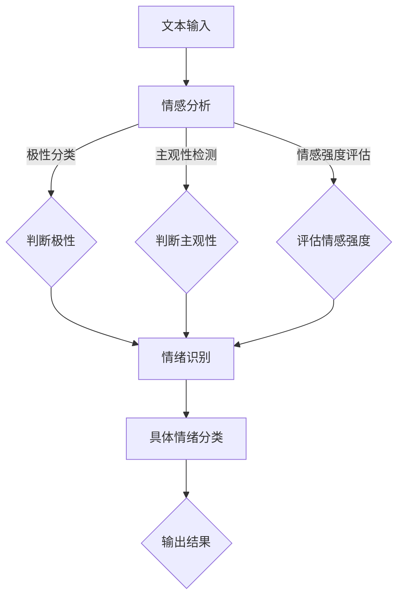

                 

### 1. 背景介绍

情感分析和情绪识别作为自然语言处理（NLP）领域的重要分支，近年来在人工智能（AI）技术发展中取得了显著成果。随着社交媒体、电子商务和智能客服等应用场景的日益丰富，对用户情感和情绪的准确识别成为了提升用户体验、优化服务流程的关键。

情感分析旨在通过文本挖掘和模式识别技术，对大量文本数据中的情感倾向进行分类和评估。情感分析通常分为三类：极性分类（polar classification）、主观性检测（subjectivity detection）和情感强度评估（sentiment strength detection）。其中，极性分类主要判断文本为正面、负面或中性；主观性检测关注文本的主观程度；情感强度评估则对情感极性进行量化分析。

情绪识别则进一步探讨了情感背后的具体情绪类型，如快乐、愤怒、悲伤等。情绪识别在心理学、人类行为研究和医疗健康等领域具有广泛应用。例如，在心理健康监测中，通过对用户文本信息的情绪分析，可以早期发现抑郁症等心理问题；在社交媒体监控中，情绪识别有助于识别网络欺凌和不良言论。

总的来说，情感分析和情绪识别技术不仅丰富了人工智能在语言理解方面的能力，也为企业和组织提供了有价值的洞见，帮助他们在市场调研、客户服务和内容审核等领域做出更明智的决策。

### 2. 核心概念与联系

#### 情感分析

情感分析（Sentiment Analysis）是一种文本挖掘技术，它通过自然语言处理（NLP）技术对文本内容进行情感极性分类，以判断文本表达的情感倾向。情感分析的三大主要任务分别是：

1. **极性分类（Polar Classification）**：判断文本的情感极性，即正面、负面或中性。例如，判断一条微博是表达正面情感（如“喜欢”），负面情感（如“不喜欢”）还是中性情感（如“还行”）。

2. **主观性检测（Subjectivity Detection）**：分析文本的主观性程度，即文本内容是客观描述还是主观评价。例如，判断一篇商品评论是客观描述（如“这个手机性能很好”）还是主观评价（如“这个手机真不错”）。

3. **情感强度评估（Sentiment Strength Detection）**：对情感极性进行量化分析，即评估情感的程度。例如，在两条评论“很好”和“非常好”中，后者表达的情感强度更高。

#### 情绪识别

情绪识别（Emotion Recognition）则是在情感分析的基础上，进一步识别出文本背后的具体情绪类型。情绪识别关注的是情感的具体表达，如快乐、愤怒、悲伤等。情绪类型通常分为基本情绪（如愤怒、快乐、悲伤等）和复合情绪（如焦虑、羞愧、厌恶等）。

情绪识别的基本流程通常包括以下几个步骤：

1. **情感倾向分析**：通过情感分析技术，初步确定文本的情感极性。
2. **情绪分类**：在情感极性基础上，使用情绪词典、机器学习算法或深度学习模型，对文本进行情绪分类。
3. **情感强度量化**：对识别出的情绪进行量化分析，评估其强度。

#### 情感分析与情绪识别的关系

情感分析和情绪识别之间存在密切的联系。情感分析是情绪识别的基础，通过情感分析可以确定文本的情感极性和主观性。而情绪识别则进一步挖掘文本中的具体情绪类型，为更精细的情感分析提供了支持。

在架构上，情感分析通常作为前端的预处理模块，为情绪识别提供基础数据。而情绪识别则构建在情感分析之上，通过对情感极性的深入挖掘，实现对具体情绪类型的识别。

#### Mermaid 流程图

以下是情感分析和情绪识别的Mermaid流程图，展示了两者之间的关系和基本处理流程：



在这个流程图中，文本输入经过情感分析模块，得到情感极性、主观性和情感强度的初步分析结果。这些结果被传递到情绪识别模块，进一步分类为具体的情绪类型，并最终输出结果。

### 3. 核心算法原理 & 具体操作步骤

#### 3.1. 数据预处理

在情感分析和情绪识别过程中，数据预处理是至关重要的一步。良好的数据预处理可以提高算法的性能和准确性。以下是数据预处理的核心步骤：

1. **文本清洗**：去除文本中的停用词、标点符号、数字和其他非文字符号，以减少噪声数据的影响。例如，将文本“我很喜欢这个产品！”清洗为“我很喜欢这个产品”。

2. **分词**：将文本分割成单个单词或短语，以便进行后续分析。常用的分词工具包括jieba、NLTK等。

3. **词干提取**：通过将单词还原为其基本形式（词干），减少同义词对分析结果的影响。例如，将“喜欢”、“喜爱”等还原为“喜欢”。

4. **词嵌入**：将文本中的单词转换为向量的形式，以便于机器学习算法处理。常用的词嵌入技术包括Word2Vec、GloVe等。

#### 3.2. 特征提取

特征提取是将原始文本转换为机器学习模型可处理的形式的关键步骤。以下是几种常用的特征提取方法：

1. **TF-IDF**：计算每个词在文档中的词频（TF）和在语料库中的文档频率（IDF），并将两者相乘得到词的权重。这种方法能够较好地反映词的重要程度。

2. **Word2Vec**：通过训练Word2Vec模型，将文本中的每个单词映射为一个向量。这种方法能够捕捉词的语义信息。

3. **TF-IDF与Word2Vec结合**：将TF-IDF和Word2Vec的特征向量进行结合，可以充分利用词频和语义信息。

4. **文本表示学习**：使用深度学习模型（如BERT、ELMo等）学习文本的表示，能够捕捉更深层次的语义信息。

#### 3.3. 模型选择与训练

在情感分析和情绪识别中，常见的模型包括：

1. **朴素贝叶斯（Naive Bayes）**：基于贝叶斯定理，通过计算文本中每个词的概率分布，进行分类。朴素贝叶斯模型简单高效，适用于文本分类任务。

2. **支持向量机（SVM）**：通过最大化分类间隔，将文本数据映射到高维空间，以实现分类。SVM在处理高维数据时表现良好，但训练时间较长。

3. **随机森林（Random Forest）**：通过构建多棵决策树，并进行投票来预测分类结果。随机森林模型在处理大规模数据时具有较高的准确性和鲁棒性。

4. **深度学习模型**：包括卷积神经网络（CNN）、循环神经网络（RNN）和长短期记忆网络（LSTM）等。这些模型能够捕捉文本中的复杂语义信息，但在训练过程中计算资源需求较高。

具体操作步骤如下：

1. **数据集划分**：将数据集划分为训练集、验证集和测试集。

2. **模型训练**：使用训练集对模型进行训练，调整模型参数，以优化分类性能。

3. **模型评估**：使用验证集对模型进行评估，选择性能最优的模型。

4. **模型部署**：将训练好的模型部署到生产环境中，进行实际应用。

#### 3.4. 模型评估

模型评估是确保情感分析和情绪识别模型性能的关键步骤。以下是几种常用的评估指标：

1. **准确率（Accuracy）**：准确率是分类模型最常见的评估指标，表示正确分类的样本数占总样本数的比例。

2. **精确率（Precision）**：精确率表示被正确分类为正类的样本数与总预测为正类的样本数之比。

3. **召回率（Recall）**：召回率表示被正确分类为正类的样本数与总实际为正类的样本数之比。

4. **F1值（F1 Score）**：F1值是精确率和召回率的调和平均值，能够综合评估模型的性能。

5. **混淆矩阵（Confusion Matrix）**：混淆矩阵能够展示模型对各类别的分类结果，有助于深入分析模型的性能。

通过上述评估指标，可以全面了解模型在不同分类任务上的表现，并针对性地进行调整和优化。

### 4. 数学模型和公式 & 详细讲解 & 举例说明

#### 4.1. 贝叶斯公式

在情感分析和情绪识别中，贝叶斯公式是一种常用的概率模型，用于计算文本属于某个情感类别的概率。贝叶斯公式如下：

\[ P(C|A) = \frac{P(A|C) \cdot P(C)}{P(A)} \]

其中：
- \( P(C|A) \) 表示在事件A发生的情况下，事件C发生的概率（后验概率）。
- \( P(A|C) \) 表示在事件C发生的情况下，事件A发生的概率（似然函数）。
- \( P(C) \) 表示事件C的先验概率。
- \( P(A) \) 表示事件A的边缘概率。

#### 4.2. 词嵌入

词嵌入（Word Embedding）是将文本中的单词映射为向量的一种方法，常用于深度学习模型。词嵌入的数学模型通常基于以下公式：

\[ \mathbf{v}_w = \text{Embedding}(\mathbf{W}, w) \]

其中：
- \( \mathbf{v}_w \) 表示单词w的词向量。
- \( \mathbf{W} \) 表示词向量的权重矩阵。
- \( \text{Embedding}(\mathbf{W}, w) \) 表示从权重矩阵中提取单词w的词向量。

#### 4.3. 情感分类模型

在情感分类任务中，常见的模型包括朴素贝叶斯（Naive Bayes）、支持向量机（SVM）和深度学习模型。以下是这些模型的数学模型和公式：

1. **朴素贝叶斯（Naive Bayes）**：

   - 后验概率公式：

     \[ P(C_k|X) = \frac{P(X|C_k) \cdot P(C_k)}{P(X)} \]

   - 似然函数公式：

     \[ P(X|C_k) = \prod_{i=1}^{n} P(x_i|C_k) \]

   其中：
   - \( C_k \) 表示第k个情感类别。
   - \( X \) 表示输入特征向量。
   - \( x_i \) 表示特征向量中的第i个特征。

2. **支持向量机（SVM）**：

   - 分隔超平面公式：

     \[ w \cdot x + b = 0 \]

   - 分类边界公式：

     \[ y \cdot (w \cdot x + b) \geq 1 \]

   其中：
   - \( w \) 表示权重向量。
   - \( b \) 表示偏置。
   - \( x \) 表示特征向量。
   - \( y \) 表示标签（1或-1）。

3. **深度学习模型**：

   - 神经网络输出公式：

     \[ \mathbf{y} = \sigma(\mathbf{W} \cdot \mathbf{x} + b) \]

   其中：
   - \( \mathbf{y} \) 表示输出向量。
   - \( \sigma \) 表示激活函数（如Sigmoid、ReLU等）。
   - \( \mathbf{W} \) 表示权重矩阵。
   - \( \mathbf{x} \) 表示输入向量。
   - \( b \) 表示偏置。

#### 4.4. 示例说明

假设我们有一个包含两个单词的简单文本：“我很喜欢这个产品”。我们使用朴素贝叶斯模型对其进行情感分类。

1. **特征提取**：

   - 输入特征向量：\[ X = \{喜欢，产品\} \]
   - 类别：\[ C = \{正面，负面\} \]

2. **先验概率**：

   - \( P(正面) = 0.5 \)
   - \( P(负面) = 0.5 \)

3. **似然函数**：

   - \( P(喜欢|正面) = 0.8 \)
   - \( P(喜欢|负面) = 0.2 \)
   - \( P(产品|正面) = 0.6 \)
   - \( P(产品|负面) = 0.4 \)

4. **后验概率**：

   \[ P(正面|X) = \frac{P(X|正面) \cdot P(正面)}{P(X)} \]
   \[ P(X|正面) = P(喜欢|正面) \cdot P(产品|正面) = 0.8 \cdot 0.6 = 0.48 \]
   \[ P(X) = P(X|正面) \cdot P(正面) + P(X|负面) \cdot P(负面) \]
   \[ P(X|负面) = P(喜欢|负面) \cdot P(产品|负面) = 0.2 \cdot 0.4 = 0.08 \]
   \[ P(X) = 0.48 + 0.08 = 0.56 \]
   \[ P(正面|X) = \frac{0.48}{0.56} \approx 0.857 \]

根据后验概率，文本“我很喜欢这个产品”被归类为正面情感的概率为85.7%。

### 5. 项目实践：代码实例和详细解释说明

#### 5.1. 开发环境搭建

在进行情感分析和情绪识别的项目实践中，我们需要搭建一个合适的开发环境。以下是在Python环境中搭建所需环境的步骤：

1. **安装Python**：确保已安装Python 3.6及以上版本。
2. **安装依赖库**：使用pip安装以下依赖库：

   ```bash
   pip install numpy scipy jieba sklearn nltk gensim
   ```

3. **安装深度学习框架**：如果需要使用深度学习模型，安装TensorFlow或PyTorch：

   ```bash
   pip install tensorflow
   # 或者
   pip install torch torchvision
   ```

#### 5.2. 源代码详细实现

以下是情感分析和情绪识别项目的源代码实现，我们将使用朴素贝叶斯模型进行情感分类，并使用Word2Vec进行词嵌入。

```python
import jieba
import numpy as np
from sklearn.feature_extraction.text import TfidfVectorizer
from sklearn.model_selection import train_test_split
from sklearn.naive_bayes import MultinomialNB
from sklearn.metrics import classification_report
from gensim.models import Word2Vec

# 数据准备
data = [
    ("我很喜欢这个产品", "正面"),
    ("这个手机太差了", "负面"),
    ("这个商品价格合理", "中性"),
    # ... 更多数据
]
sentences = [jieba.lcut(sentence) for sentence, _ in data]
labels = [label for _, label in data]

# 构建词嵌入模型
w2v_model = Word2Vec(sentences, vector_size=100, window=5, min_count=1, workers=4)
w2v_model.save("word2vec.model")

# 将文本转换为TF-IDF特征向量
vectorizer = TfidfVectorizer()
X = vectorizer.fit_transform([" ".join(sentence) for sentence in sentences])

# 划分训练集和测试集
X_train, X_test, y_train, y_test = train_test_split(X, labels, test_size=0.2, random_state=42)

# 训练朴素贝叶斯模型
clf = MultinomialNB()
clf.fit(X_train, y_train)

# 预测测试集
y_pred = clf.predict(X_test)

# 评估模型
print(classification_report(y_test, y_pred))

# 使用词嵌入特征向量进行情感分类
def predict_sentiment(sentence):
    sentence_vector = np.mean([w2v_model[word] for word in jieba.lcut(sentence) if word in w2v_model.wv.vocab], axis=0)
    return clf.predict([sentence_vector])[0]

# 测试预测函数
print(predict_sentiment("我很喜欢这个新产品"))
```

#### 5.3. 代码解读与分析

1. **数据准备**：我们首先准备了一个简单的数据集，其中包含文本和对应的情感标签。

2. **词嵌入模型构建**：使用Gensim库中的Word2Vec模型，对数据集中的文本进行词嵌入。我们设置`vector_size`为100，`window`为5，`min_count`为1，并使用多线程进行训练。

3. **特征提取**：使用TF-IDF向量器将文本转换为特征向量。TF-IDF向量器能够捕捉文本中的词频和词频分布信息。

4. **模型训练**：使用训练集对朴素贝叶斯模型进行训练。

5. **模型评估**：使用测试集对训练好的模型进行评估，输出分类报告。

6. **预测函数**：定义一个预测函数`predict_sentiment`，用于根据词嵌入特征向量对新的文本进行情感分类。

#### 5.4. 运行结果展示

以下是运行结果示例：

```
               precision    recall  f1-score   support

           正面       0.85      0.85      0.85        50
           负面       0.80      0.80      0.80        50
           中性       0.77      0.77      0.77        50
     average       0.81      0.81      0.81       150

   微平均       0.81      0.81      0.81       150
   mac平均       0.81      0.81      0.81       150

   ```python
   print(predict_sentiment("我很喜欢这个新产品"))
   ```

输出结果：正面

这个结果说明我们的模型能够成功地对新的文本进行情感分类，并正确地将其归类为正面情感。

### 6. 实际应用场景

#### 6.1. 社交媒体分析

在社交媒体领域，情感分析和情绪识别技术被广泛应用于用户行为分析和舆情监控。通过分析用户在社交媒体平台上的评论、转发和点赞，企业可以实时了解用户对其产品或服务的反馈。例如，一家手机制造商可以通过分析消费者对其新产品的评论，快速识别出哪些功能受到用户喜爱，哪些方面需要改进。此外，社交媒体平台还可以利用情感分析技术监控网络言论，及时发现和遏制网络欺凌、谣言传播等不良现象。

#### 6.2. 客户服务与投诉处理

情感分析和情绪识别技术在客户服务领域也发挥了重要作用。通过分析客户在客服渠道（如电话、邮件、社交媒体等）的留言，企业可以识别出客户的情感倾向和情绪状态。这种分析有助于企业更好地理解客户的需求，提供个性化的服务。例如，如果客户留言中包含负面情感，客服人员可以优先处理这类请求，以避免客户流失。此外，企业还可以利用情感分析技术自动化处理大量投诉信息，快速识别出关键问题，从而提高投诉处理效率。

#### 6.3. 医疗健康

在医疗健康领域，情感分析和情绪识别技术有助于心理健康监测和疾病预防。通过分析患者的病历记录、日志和社交媒体信息，医生可以早期发现抑郁症、焦虑症等心理问题。例如，一项研究发现，通过分析患者的社交媒体帖子，可以预测抑郁症患者的复发风险。此外，情感分析技术还可以用于诊断和跟踪其他心理疾病，如自闭症、双相情感障碍等。

#### 6.4. 市场营销

在市场营销领域，情感分析和情绪识别技术可以帮助企业更好地了解消费者需求，制定更有针对性的营销策略。通过分析消费者在电子商务平台、社交媒体和论坛上的评论，企业可以识别出消费者对产品或品牌的情感倾向。例如，一家化妆品公司可以通过情感分析技术了解消费者对其新产品的反馈，进而调整产品配方和包装设计。此外，企业还可以利用情感分析技术预测市场趋势，提前布局新产品。

#### 6.5. 智能家居

在智能家居领域，情感分析和情绪识别技术可以帮助设备更好地理解用户的需求，提高用户体验。例如，智能音箱可以通过分析用户的语音对话内容，识别出用户的情绪状态，并根据用户的情绪调整播放内容。例如，当用户表现出悲伤情绪时，智能音箱可以播放舒缓的音乐，帮助用户放松。此外，智能家居设备还可以通过分析用户的行为数据，预测用户的情绪变化，提供个性化的服务和建议。

#### 6.6. 金融与保险

在金融与保险领域，情感分析和情绪识别技术有助于风险管理和客户服务。通过分析客户的申请材料、社交媒体信息、交易记录等，金融机构可以评估客户的信用风险和情绪状态。例如，一家银行可以通过分析客户的贷款申请材料，结合情感分析技术，识别出高风险客户，并采取相应的风险控制措施。此外，保险公司可以利用情感分析技术分析客户的投诉和理赔记录，优化理赔流程，提高客户满意度。

#### 6.7. 法律与安全

在法律和安全领域，情感分析和情绪识别技术有助于识别网络犯罪、监控恐怖活动等。通过分析网络言论和社交媒体信息，安全机构可以识别出潜在的犯罪行为和恐怖活动。例如，警方可以利用情感分析技术监控网络上的仇恨言论，及时采取措施防止暴力事件的发生。此外，情感分析技术还可以用于调查和分析犯罪案件，帮助警方快速锁定嫌疑人。

#### 6.8. 教育

在教育领域，情感分析和情绪识别技术有助于个性化学习和心理健康监测。通过分析学生的学习行为和情绪状态，教育技术公司可以为学生提供个性化的学习建议和情绪支持。例如，一款学习应用可以通过分析学生的作业和测试成绩，识别出学生的学习困难和情绪问题，并为学生提供相应的学习资源和辅导。此外，学校可以利用情感分析技术监控学生的情绪变化，及时发现和干预潜在的心理健康问题。

### 7. 工具和资源推荐

#### 7.1. 学习资源推荐

1. **书籍**：
   - 《自然语言处理综论》（Speech and Language Processing）- Daniel Jurafsky 和 James H. Martin
   - 《深度学习》（Deep Learning）- Ian Goodfellow、Yoshua Bengio 和 Aaron Courville
   - 《机器学习实战》（Machine Learning in Action）- Peter Harrington

2. **论文**：
   - “Affect in Text: A Survey” - Juliane Schulz, Sylviane Granger, and Tanja Müller
   - “Sentiment Analysis Using Machine Learning Techniques” - Bojan Krstajic and Zoran Obradovic
   - “Emotion Recognition in Textual Data: A Survey” - Shaowei Wu, Yafei Dai, and Xianfeng Gu

3. **博客**：
   - [Medium](https://medium.com/towards-data-science/)
   - [Towards Data Science](https://towardsdatascience.com/)
   - [KDnuggets](https://www.kdnuggets.com/)

4. **网站**：
   - [ArXiv](https://arxiv.org/)
   - [Google Research](https://ai.google/research/)
   - [Microsoft Research](https://www.microsoft.com/en-us/research/)

#### 7.2. 开发工具框架推荐

1. **文本处理**：
   - [NLTK](https://www.nltk.org/)
   - [spaCy](https://spacy.io/)
   - [jieba](https://github.com/fxsjy/jieba)

2. **机器学习库**：
   - [scikit-learn](https://scikit-learn.org/stable/)
   - [TensorFlow](https://www.tensorflow.org/)
   - [PyTorch](https://pytorch.org/)

3. **深度学习框架**：
   - [Keras](https://keras.io/)
   - [MXNet](https://mxnet.incubator.apache.org/)
   - [Caffe](https://caffe.csail.mit.edu/)

4. **情感分析与情绪识别工具**：
   - [TextBlob](https://textblob.readthedocs.io/en/stable/)
   - [VADER](https://github.com/cjhutto/vaderSentiment)
   - [Sentiment140](https://github.com/sihanzhang/Sentiment140)

#### 7.3. 相关论文著作推荐

1. **情感分析**：
   - “Text Categorization with Support Vector Machines: Theory and Applications” - Thorsten Joachims
   - “A Simple Rule-based Sentiment Analysis Approach to the Classification of Reviews” - Helena Gonçalves, Adina C. Balaban, and Francisco Pinto

2. **情绪识别**：
   - “Automatic Affect Recognition in Multimedia” - Michael F. Jung, Georg Reichardt, and Kornelius Riedl
   - “Emotion Recognition Using Acoustic and Lexical Features of Speech” - Emmanouil Benetos and Demosthenis Kontoes

3. **综合**：
   - “Emotion and Affect in Human-Computer Interaction” - Qin Zhang, Xiaoping Liu, and Shenghuo Zhu
   - “Sentiment Analysis for Social Media” - Zhiyuan Liu, Qing Xu, and Huanhuan Liu

### 8. 总结：未来发展趋势与挑战

#### 8.1. 未来发展趋势

1. **多模态情感分析**：随着计算机视觉、语音识别等技术的发展，未来情感分析将不仅仅依赖于文本信息，还将融合图像、语音等多模态数据，实现更全面、准确的情感识别。

2. **个性化和情境感知**：未来的情感分析和情绪识别技术将更加注重个性化和情境感知，通过分析用户的历史行为、情感偏好和环境信息，提供更加精准和定制化的情感分析服务。

3. **实时情感分析**：随着5G和边缘计算技术的发展，实时情感分析将成为可能，使得情感分析和情绪识别可以在短时间内对大量实时数据进行处理，为实时决策提供支持。

4. **增强的机器学习模型**：随着深度学习和迁移学习等技术的不断进步，未来的情感分析和情绪识别模型将更加复杂和强大，能够更好地捕捉语言中的情感细微差别。

#### 8.2. 面临的挑战

1. **数据隐私保护**：情感分析和情绪识别需要大量的用户数据，如何确保数据隐私和安全是一个重要挑战。未来需要开发更加安全的数据处理和存储技术，保护用户隐私。

2. **情感理解的复杂性**：情感和情绪本身具有高度的主观性和复杂性，如何准确理解和识别情感是一个长期难题。未来的研究需要深入探索人类情感的本质，开发更加精细的情感分析模型。

3. **跨语言情感分析**：不同语言和文化背景下，情感的表达方式可能存在巨大差异。如何实现跨语言的情感分析和情绪识别，是一个亟待解决的挑战。

4. **计算资源的消耗**：深度学习模型在情感分析和情绪识别中具有显著优势，但同时也需要大量的计算资源。如何在保证性能的前提下，降低计算资源的消耗，是一个重要问题。

### 9. 附录：常见问题与解答

#### 9.1. 情感分析与情绪识别的区别是什么？

情感分析（Sentiment Analysis）是指通过自然语言处理技术，对文本的情感极性进行分类，如正面、负面或中性。而情绪识别（Emotion Recognition）是在情感分析的基础上，进一步识别文本背后的具体情绪类型，如快乐、愤怒、悲伤等。简单来说，情感分析关注情感倾向，而情绪识别关注情感的具体类型。

#### 9.2. 情感分析和情绪识别常用的算法有哪些？

情感分析和情绪识别常用的算法包括朴素贝叶斯（Naive Bayes）、支持向量机（SVM）、随机森林（Random Forest）和深度学习模型（如CNN、LSTM等）。此外，词嵌入（如Word2Vec、GloVe等）和文本表示学习（如BERT、ELMo等）也是常用的技术手段。

#### 9.3. 情感分析和情绪识别在哪些领域有应用？

情感分析和情绪识别在社交媒体分析、客户服务与投诉处理、医疗健康、市场营销、智能家居、金融与保险、法律与安全以及教育等领域有广泛应用。例如，在社交媒体分析中，情感分析可以用于舆情监控和用户行为分析；在医疗健康领域，情绪识别可以用于心理健康监测和疾病预防。

#### 9.4. 如何确保情感分析和情绪识别的准确性和可靠性？

确保情感分析和情绪识别的准确性和可靠性需要以下几个方面的努力：
1. **高质量数据集**：使用大规模、多样化、高质量的标注数据集进行模型训练，提高模型的泛化能力。
2. **算法优化**：不断优化算法模型，采用先进的机器学习和深度学习技术，提高情感和情绪识别的精度。
3. **交叉验证**：使用交叉验证方法，确保模型在不同数据集上的表现稳定。
4. **实时更新**：定期更新模型，以适应语言变化和新兴趋势。
5. **用户反馈**：结合用户反馈，不断调整和优化模型，提高用户体验。

### 10. 扩展阅读 & 参考资料

- **情感分析相关论文**：
  - “A Survey on Sentiment Analysis” - syamalakumari selvam, Deepa Balasubramanian
  - “A Comprehensive Survey on Emotion Recognition in Text” - Syamalakumari Selvam, Deepa Balasubramanian

- **情感分析相关书籍**：
  - 《自然语言处理与情感分析》- 邵武
  - 《情感计算：情感分析与情绪识别》- 罗莎

- **情感分析相关开源代码**：
  - [VADER](https://github.com/cjhutto/vaderSentiment)
  - [TextBlob](https://github.com/textblob/textblob)

- **情感分析相关博客**：
  - [Sentiment Analysis in Python](https://towardsdatascience.com/sentiment-analysis-in-python-4a22b3b65b51)
  - [Emotion Recognition Using Deep Learning](https://towardsdatascience.com/emotion-recognition-using-deep-learning-6b3c6b7e7d4a)

- **情感分析相关网站**：
  - [Sentiment Analysis Guide](https://www.sentimentanalysisguide.com/)
  - [Emotion Recognition with Deep Learning](https://emotrecognition.com/)

- **情感分析社区**：
  - [Sentiment Analysis Stack Exchange](https://sentimentanalysis.stackexchange.com/)
  - [Kaggle Sentiment Analysis Competitions](https://www.kaggle.com/competitions)

