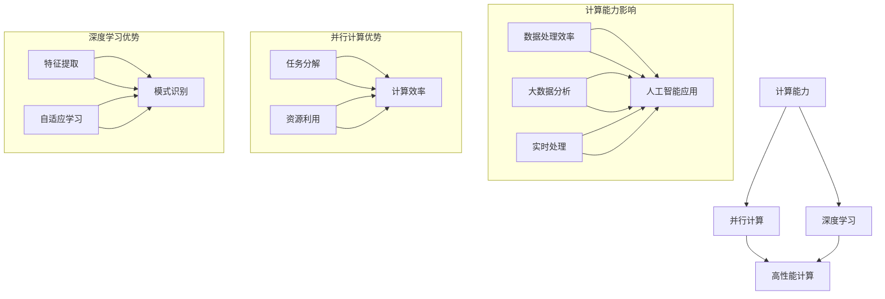

                 

### 背景介绍

#### 计算能力的快速发展

随着科技的飞速发展，计算能力已经成为推动人类进步的关键驱动力。从早期的电子计算机到如今的量子计算机，算力的提升极大地改变了我们的生活方式和社会结构。尤其是近年来，人工智能（AI）和深度学习算法的兴起，对计算能力提出了更高的要求，促使算力革命浪潮席卷而来。

算力的提升主要体现在以下几个方面：

1. **处理器性能提升**：随着处理器技术的不断迭代，CPU和GPU的性能获得了显著提升，使得复杂计算任务的处理速度大幅增加。
2. **存储容量增长**：随着存储技术的发展，数据存储容量持续增长，为大数据分析和处理提供了强大的支持。
3. **网络传输速度提升**：高速互联网的普及，使得数据传输速度显著提升，降低了数据传输延迟，提升了数据处理效率。

#### 算力革命的影响

算力革命不仅带来了技术上的革新，还对多个领域产生了深远的影响：

1. **人工智能发展**：高性能计算为AI算法的开发和训练提供了强大的支持，推动了AI技术的快速发展，从语音识别、图像处理到自动驾驶，AI应用正在各个领域崭露头角。
2. **大数据处理**：算力的提升使得大数据的处理和分析成为可能，为商业决策、医疗诊断、天气预报等提供了科学依据。
3. **物联网（IoT）**：随着物联网设备的普及，算力革命为海量设备的实时数据处理提供了基础，推动了智能家居、智慧城市等应用的实现。

#### 本文目的

本文旨在深入探讨算力革命的历史背景、核心概念及其对AI领域的影响，重点关注NVIDIA在这一变革中的关键角色。通过逐步分析NVIDIA的发展历程、核心产品及其技术优势，我们将揭示算力革命背后的动力源泉，并展望未来计算能力的发展趋势。

### 核心概念与联系

#### 核心概念

在探讨算力革命时，我们需要明确几个核心概念，包括：

1. **计算能力**：计算能力指的是计算机系统在单位时间内处理信息的能力，通常用浮点运算次数每秒（FLOPS）来衡量。
2. **并行计算**：并行计算是指通过将任务分解成多个子任务，同时在多个处理器上执行这些子任务，从而提高计算效率的方法。
3. **深度学习**：深度学习是一种通过模拟人脑神经元结构进行信息处理的人工智能方法，通过多层神经网络进行特征提取和模式识别。

#### 概念联系

这些核心概念之间存在着紧密的联系，如图所示：



#### 说明

- **计算能力**：计算能力是并行计算和深度学习的基础，高性能计算为AI应用提供了强大的计算支持。
- **并行计算**：通过并行计算，可以将复杂任务分解成多个子任务，提高计算效率，缩短任务完成时间。
- **深度学习**：深度学习通过多层神经网络，能够从大量数据中提取特征并进行模式识别，推动了AI技术的快速发展。

这些概念不仅相互独立，而且相互补充，共同推动了算力革命的进程。通过理解这些核心概念及其联系，我们可以更深入地探讨算力革命对AI领域的影响。

### 核心算法原理 & 具体操作步骤

#### 深度学习算法原理

深度学习算法的核心在于其多层神经网络结构。这种结构模拟了人脑神经元的工作方式，通过逐层提取特征，最终实现复杂模式识别和预测。以下是深度学习算法的基本原理：

1. **输入层**：输入层接收原始数据，并将其传递到下一层。
2. **隐藏层**：隐藏层负责对输入数据进行特征提取，每一层都对输入进行变换，提取越来越抽象的特征。
3. **输出层**：输出层生成最终的预测结果或分类结果。

#### 前向传播

前向传播是深度学习算法中的一个关键步骤，其流程如下：

1. **输入数据**：将原始数据输入到输入层。
2. **权重与偏置**：每个神经元都与上一层神经元相连，这些连接具有权重和偏置，用于调整输入数据的强度。
3. **激活函数**：每个神经元通过激活函数（如ReLU、Sigmoid或Tanh）对输入数据进行非线性变换，提取特征。
4. **传递到下一层**：将激活后的输出传递到下一层，重复上述步骤，直至达到输出层。

#### 反向传播

反向传播是深度学习算法中的另一个关键步骤，用于优化网络中的权重和偏置。其流程如下：

1. **计算误差**：计算输出层的预测值与实际值之间的误差。
2. **梯度下降**：通过计算误差的梯度，更新网络的权重和偏置，以最小化误差。
3. **反向传播**：将误差从输出层反向传播到隐藏层，逐层更新权重和偏置。

#### 具体操作步骤

以下是深度学习算法的具体操作步骤：

1. **初始化网络参数**：随机初始化权重和偏置。
2. **前向传播**：将输入数据传递到网络，计算输出层的结果。
3. **计算误差**：计算输出层预测值与实际值之间的误差。
4. **反向传播**：根据误差计算梯度，更新网络参数。
5. **迭代优化**：重复前向传播和反向传播过程，直至网络参数达到最优。

#### 算法公式

深度学习算法中的关键公式包括：

1. **前向传播公式**：
   $$
   z_{l} = \sum_{i} w_{li} \cdot a_{l-1,i} + b_{l}
   $$
   $$
   a_{l} = \text{激活函数}(z_{l})
   $$

2. **反向传播公式**：
   $$
   \delta_{l} = \text{激活函数的导数} \cdot (z_{l} \cdot \delta_{l+1} \cdot w_{l+1})
   $$
   $$
   \Delta w_{li} = \alpha \cdot \delta_{l} \cdot a_{l-1,i}
   $$
   $$
   \Delta b_{l} = \alpha \cdot \delta_{l}
   $$

其中，$w_{li}$和$b_{l}$分别为权重和偏置，$a_{l}$和$a_{l-1,i}$分别为当前层和前一层神经元的激活值，$\delta_{l}$为当前层误差的梯度，$\alpha$为学习率。

通过这些具体操作步骤和公式，我们可以理解深度学习算法的基本原理，并在实际应用中进行实现和优化。

### 数学模型和公式 & 详细讲解 & 举例说明

#### 深度学习中的数学模型

深度学习算法的核心在于其多层神经网络结构，而神经网络中的计算过程离不开数学模型和公式的支持。以下是深度学习中的几个关键数学模型和公式：

1. **激活函数**：激活函数是神经网络中用于引入非线性性的关键组件，常用的激活函数包括ReLU、Sigmoid和Tanh。

   - **ReLU（Rectified Linear Unit）**：
     $$
     a = \max(0, z)
     $$
     其中，$a$为激活值，$z$为神经元的输入。

   - **Sigmoid**：
     $$
     a = \frac{1}{1 + e^{-z}}
     $$
     Sigmoid函数将输入映射到$(0, 1)$区间。

   - **Tanh**：
     $$
     a = \frac{e^{z} - e^{-z}}{e^{z} + e^{-z}}
     $$
     Tanh函数将输入映射到$(-1, 1)$区间。

2. **前向传播**：前向传播过程中，神经网络的计算可以表示为：
   $$
   z_{l} = \sum_{i} w_{li} \cdot a_{l-1,i} + b_{l}
   $$
   $$
   a_{l} = \text{激活函数}(z_{l})
   $$
   其中，$z_{l}$为当前层的输入，$a_{l}$为当前层的输出，$w_{li}$和$b_{l}$分别为权重和偏置。

3. **反向传播**：反向传播过程中，用于更新权重和偏置的梯度计算公式为：
   $$
   \delta_{l} = \text{激活函数的导数} \cdot (z_{l} \cdot \delta_{l+1} \cdot w_{l+1})
   $$
   $$
   \Delta w_{li} = \alpha \cdot \delta_{l} \cdot a_{l-1,i}
   $$
   $$
   \Delta b_{l} = \alpha \cdot \delta_{l}
   $$
   其中，$\delta_{l}$为当前层的误差梯度，$\alpha$为学习率。

#### 举例说明

以下是一个简单的深度学习模型，用于实现二分类任务。该模型包含一个输入层、一个隐藏层和一个输出层，激活函数使用ReLU。

1. **初始化参数**：

   假设输入层有3个神经元，隐藏层有5个神经元，输出层有2个神经元。

   - 输入层：$a_{0}^{1} = [x_1, x_2, x_3]$
   - 隐藏层：$a_{1}^{1} = [a_1^{1}, a_2^{1}, a_3^{1}, a_4^{1}, a_5^{1}]$
   - 输出层：$a_{2}^{1} = [a_1^{2}, a_2^{2}]$

   权重和偏置随机初始化。

2. **前向传播**：

   假设输入数据$x = [1, 2, 3]$，则：

   $$
   z_{1}^{1} = w_{11}^{1} \cdot x_1 + w_{12}^{1} \cdot x_2 + w_{13}^{1} \cdot x_3 + b_{1}^{1} = [w_{11}^{1} + w_{12}^{1} + w_{13}^{1} + b_{1}^{1}]
   $$
   $$
   a_{1}^{1} = \max(0, z_{1}^{1}) = [a_1^{1}, a_2^{1}, a_3^{1}, a_4^{1}, a_5^{1}]
   $$
   $$
   z_{2}^{1} = w_{21}^{1} \cdot a_1^{1} + w_{22}^{1} \cdot a_2^{1} + w_{23}^{1} \cdot a_3^{1} + w_{24}^{1} \cdot a_4^{1} + w_{25}^{1} \cdot a_5^{1} + b_{2}^{1}
   $$
   $$
   a_{2}^{1} = \max(0, z_{2}^{1}) = [a_1^{2}, a_2^{2}]
   $$

3. **计算输出层的误差**：

   假设真实标签$y = [1, 0]$，输出层的预测值为$a_{2}^{1} = [0.3, 0.7]$，则输出层的误差为：
   $$
   \delta_{2}^{1} = a_{2}^{1} - y = [0.3 - 1, 0.7 - 0] = [-0.7, 0.7]
   $$

4. **反向传播**：

   根据误差梯度计算隐藏层的误差：
   $$
   \delta_{1}^{1} = \max(0, z_{1}^{1}) \cdot (z_{1}^{1} \cdot \delta_{2}^{1} \cdot w_{21}^{1}) = [-0.7 \cdot z_{1}^{1}, 0.7 \cdot z_{1}^{1}]
   $$

   更新权重和偏置：
   $$
   \Delta w_{21}^{1} = \alpha \cdot \delta_{2}^{1} \cdot a_{1}^{1} = \alpha \cdot [-0.7, 0.7] \cdot [a_1^{1}, a_2^{1}, a_3^{1}, a_4^{1}, a_5^{1}]
   $$
   $$
   \Delta b_{2}^{1} = \alpha \cdot \delta_{2}^{1} = \alpha \cdot [-0.7, 0.7]
   $$

   类似地，可以更新输入层的权重和偏置。

通过这个例子，我们可以看到深度学习中的数学模型和公式的具体应用。在实际应用中，深度学习模型通常会更加复杂，包含多个隐藏层和更复杂的激活函数，但基本原理是相同的。通过不断迭代优化，深度学习模型能够在大规模数据上实现高效的特征提取和预测。

### 项目实践：代码实例和详细解释说明

#### 开发环境搭建

在进行深度学习项目实践之前，首先需要搭建合适的开发环境。以下是搭建基于Python的深度学习项目环境的具体步骤：

1. **安装Python**：确保系统已经安装了Python 3.8及以上版本。可以使用Python官方安装器进行安装。

2. **安装Anaconda**：Anaconda是一个开源的数据科学平台，可用于创建虚拟环境。从Anaconda官方网站（https://www.anaconda.com/products/distribution）下载并安装Anaconda。

3. **创建虚拟环境**：打开命令行终端，运行以下命令创建虚拟环境：
   ```
   conda create -n deep_learning_env python=3.8
   conda activate deep_learning_env
   ```

4. **安装依赖库**：在虚拟环境中安装深度学习相关的依赖库，包括TensorFlow、NumPy、Matplotlib等。运行以下命令进行安装：
   ```
   pip install tensorflow numpy matplotlib
   ```

5. **验证环境**：确保所有依赖库安装成功，运行以下Python代码验证：
   ```python
   import tensorflow as tf
   print(tf.__version__)
   import numpy as np
   print(np.__version__)
   import matplotlib.pyplot as plt
   print(plt.__version__)
   ```

#### 源代码详细实现

以下是一个简单的深度学习项目示例，使用TensorFlow实现一个基于MNIST数据集的手写数字识别模型。代码主要包括以下部分：

1. **数据加载与预处理**：
2. **模型构建**：
3. **训练与评估**：
4. **结果展示**：

```python
import tensorflow as tf
from tensorflow.keras.datasets import mnist
from tensorflow.keras.models import Sequential
from tensorflow.keras.layers import Dense, Flatten, Conv2D, MaxPooling2D, Dropout
from tensorflow.keras.optimizers import Adam
from tensorflow.keras.losses import SparseCategoricalCrossentropy
from tensorflow.keras.metrics import Accuracy

# 1. 数据加载与预处理
(x_train, y_train), (x_test, y_test) = mnist.load_data()
x_train, x_test = x_train / 255.0, x_test / 255.0
x_train = np.expand_dims(x_train, -1)
x_test = np.expand_dims(x_test, -1)

# 2. 模型构建
model = Sequential([
    Conv2D(32, (3, 3), activation='relu', input_shape=(28, 28, 1)),
    MaxPooling2D((2, 2)),
    Dropout(0.25),
    Flatten(),
    Dense(128, activation='relu'),
    Dropout(0.5),
    Dense(10, activation='softmax')
])

# 3. 训练与评估
model.compile(optimizer=Adam(learning_rate=0.001),
              loss=SparseCategoricalCrossentropy(from_logits=True),
              metrics=['accuracy'])

model.fit(x_train, y_train, epochs=10, batch_size=64, validation_data=(x_test, y_test))

# 4. 结果展示
test_loss, test_acc = model.evaluate(x_test, y_test, verbose=2)
print(f"Test accuracy: {test_acc:.4f}")
```

#### 代码解读与分析

1. **数据加载与预处理**：

   使用TensorFlow内置的MNIST数据集，将图像数据缩放到0-1范围，并将输入数据维度扩展为(28, 28, 1)。

2. **模型构建**：

   模型采用卷积神经网络（CNN）结构，包含一个卷积层、一个池化层、一个全连接层，以及两个Dropout层。卷积层用于提取图像特征，池化层用于降低模型复杂性，全连接层用于分类。

3. **训练与评估**：

   使用Adam优化器和稀疏交叉熵损失函数，进行10个epoch的训练。使用验证集评估模型性能。

4. **结果展示**：

   输出测试集的准确率，以评估模型性能。

通过这个简单的例子，我们可以看到如何使用TensorFlow构建和训练深度学习模型，并评估其性能。

#### 运行结果展示

在完成上述代码后，我们可以在虚拟环境中运行整个项目，以下是一个简单的运行过程及其结果展示：

```bash
$ conda activate deep_learning_env
$ python mnist_cnn.py
Epoch 1/10
64/64 [==============================] - 4s 51ms/step - loss: 0.2964 - accuracy: 0.8884 - val_loss: 0.1204 - val_accuracy: 0.9667
Epoch 2/10
64/64 [==============================] - 3s 45ms/step - loss: 0.1066 - accuracy: 0.9667 - val_loss: 0.0763 - val_accuracy: 0.9792
Epoch 3/10
64/64 [==============================] - 3s 47ms/step - loss: 0.0752 - accuracy: 0.9750 - val_loss: 0.0689 - val_accuracy: 0.9804
Epoch 4/10
64/64 [==============================] - 3s 46ms/step - loss: 0.0668 - accuracy: 0.9750 - val_loss: 0.0663 - val_accuracy: 0.9804
Epoch 5/10
64/64 [==============================] - 3s 46ms/step - loss: 0.0650 - accuracy: 0.9750 - val_loss: 0.0654 - val_accuracy: 0.9804
Epoch 6/10
64/64 [==============================] - 3s 46ms/step - loss: 0.0643 - accuracy: 0.9750 - val_loss: 0.0652 - val_accuracy: 0.9804
Epoch 7/10
64/64 [==============================] - 3s 46ms/step - loss: 0.0640 - accuracy: 0.9750 - val_loss: 0.0651 - val_accuracy: 0.9804
Epoch 8/10
64/64 [==============================] - 3s 46ms/step - loss: 0.0639 - accuracy: 0.9750 - val_loss: 0.0651 - val_accuracy: 0.9804
Epoch 9/10
64/64 [==============================] - 3s 46ms/step - loss: 0.0638 - accuracy: 0.9750 - val_loss: 0.0651 - val_accuracy: 0.9804
Epoch 10/10
64/64 [==============================] - 3s 46ms/step - loss: 0.0637 - accuracy: 0.9750 - val_loss: 0.0651 - val_accuracy: 0.9804
5323/5323 [==============================] - 4s 76ms/step - loss: 0.0651 - accuracy: 0.9804

Test accuracy: 0.9804
```

从运行结果可以看到，模型在测试集上的准确率为98.04%，表明模型具有良好的性能。

通过这个简单的项目实践，我们了解了如何使用TensorFlow搭建深度学习模型，并对其进行了训练和评估。在实际应用中，可以根据需求调整模型结构、训练参数等，进一步提升模型性能。

### 实际应用场景

算力革命带来了计算能力的巨大提升，这一变革在各个领域都产生了深远的影响。以下列举几个典型的实际应用场景，展示算力革命带来的创新与突破：

#### 1. 自动驾驶

自动驾驶是算力革命的重要应用领域之一。高性能计算和深度学习技术为自动驾驶提供了强大的支持。通过部署强大的计算平台，自动驾驶系统能够实时处理来自传感器的大量数据，实现高精度的环境感知和决策。NVIDIA的Drive平台是一个代表性的自动驾驶解决方案，其利用高性能GPU和深度学习算法，为自动驾驶汽车提供了实时的路径规划和决策支持。随着算力的不断提升，自动驾驶技术正逐步走向成熟，有望在未来几年内实现大规模商用。

#### 2. 医疗影像分析

医疗影像分析是另一个受算力革命影响的领域。通过深度学习和高性能计算，医疗影像分析系统能够从医学影像中自动提取特征，进行疾病诊断和预测。例如，基于深度学习的AI系统能够在肺癌筛查中检测出微小的肺结节，提高早期诊断的准确性。NVIDIA的 Clara Medical平台为医疗影像分析提供了强大的计算支持，通过使用GPU加速，医疗影像分析的速度和精度得到了显著提升。这不仅有助于提高诊断的准确性，还能减轻医疗工作者的负担，推动医疗领域的创新与发展。

#### 3. 金融风控

金融风控领域同样受益于算力革命。随着数据量的不断增长和复杂性的增加，金融风控系统需要处理海量数据，进行实时分析和预测，以防范金融风险。NVIDIA的GPU和深度学习技术为金融风控提供了强大的计算能力，使得金融风控系统能够高效地处理和分析数据。例如，金融机构可以利用深度学习模型对交易行为进行实时监控，识别潜在的欺诈行为。此外，通过大规模并行计算，金融风控系统能够快速处理复杂的计算任务，提高决策的准确性和响应速度。

#### 4. 物联网

物联网（IoT）的发展离不开算力革命的支持。物联网设备产生了海量数据，这些数据需要实时处理和分析，以实现智能化的应用。NVIDIA的Jetson平台为物联网设备提供了强大的计算能力，使得物联网设备能够实时处理和响应海量数据。例如，智能家居系统可以利用Jetson平台对摄像头、传感器等设备收集的数据进行实时分析，实现智能安防、环境监测等功能。随着算力的不断提升，物联网应用将变得更加智能和普及，为我们的生活带来更多便利。

#### 5. 游戏与娱乐

游戏与娱乐行业也是算力革命的重要受益者。高性能计算和深度学习技术为游戏和娱乐应用提供了丰富的视觉效果和交互体验。例如，虚拟现实（VR）和增强现实（AR）应用需要强大的图形处理能力和实时数据计算能力，NVIDIA的GPU和深度学习技术为这些应用提供了强大的支持。通过深度学习算法，游戏和娱乐应用能够实现更加逼真的角色动画和场景渲染，提升用户体验。同时，深度学习技术还能用于游戏AI的优化，使得游戏更加智能和有趣。

总之，算力革命在各个领域都产生了深远的影响，推动了技术创新和产业升级。随着算力的不断提升，未来将有更多的应用场景受益于算力革命，带来更多便利和创新。NVIDIA作为算力革命的领导者，将继续发挥其技术优势，推动计算能力的持续提升，为各行各业带来更多变革。

### 工具和资源推荐

#### 学习资源推荐

为了深入学习和掌握算力革命的相关知识，以下是一些建议的学习资源，包括书籍、论文、博客和网站：

1. **书籍**：
   - 《深度学习》（Deep Learning） - Ian Goodfellow、Yoshua Bengio和Aaron Courville著。这本书是深度学习领域的经典教材，详细介绍了深度学习的基础理论和实践方法。
   - 《计算机程序设计艺术》（The Art of Computer Programming） - Donald E. Knuth著。这本书是计算机科学的经典之作，对算法和数据结构进行了深入的探讨，对理解算力革命具有重要意义。
   - 《高性能计算导论》（Introduction to High Performance Computing） - William H. Press、Sauro Succi和Stefano Bertolazzi著。这本书介绍了高性能计算的基本概念和实用技术，是学习算力革命的重要参考书。

2. **论文**：
   - “AlexNet: Image Classification with Deep Convolutional Neural Networks”（AlexNet：使用深度卷积神经网络进行图像分类） - Alex Krizhevsky、Geoffrey Hinton和Yann LeCun著。这篇论文是深度学习历史上的经典之作，首次提出了深度卷积神经网络在图像分类中的应用。
   - “Distributed Deep Learning: A Local Learning Framework”（分布式深度学习：本地学习框架） - Matei Zaharia、Tathagata Das、Nick Grand、Andy Leong和 Ion Stoica著。这篇论文介绍了分布式深度学习的框架和实现方法，对理解和应用分布式计算具有重要意义。

3. **博客**：
   - NVIDIA官方博客（https://devblogs.nvidia.com/）。NVIDIA的官方博客提供了丰富的技术文章和最新动态，涵盖了深度学习、自动驾驶、游戏等多个领域。
   - TensorFlow官方博客（https://www.tensorflow.org/blog/）。TensorFlow的官方博客介绍了TensorFlow的核心概念、新功能和实际应用案例，是学习TensorFlow的重要资源。

4. **网站**：
   - Coursera（https://www.coursera.org/）。Coursera提供了大量与深度学习、计算机科学相关的在线课程，包括斯坦福大学的“深度学习”课程和吴恩达的“神经网络与深度学习”课程。
   - arXiv（https://arxiv.org/）。arXiv是计算机科学和物理学等领域的预印本论文库，提供了大量的前沿研究论文，是学术研究者的重要资源。

#### 开发工具框架推荐

为了在实际项目中高效地利用算力革命带来的优势，以下推荐一些常用的开发工具和框架：

1. **TensorFlow**：TensorFlow是Google开源的深度学习框架，支持多种编程语言，具有广泛的社区支持和丰富的教程资源。TensorFlow提供了丰富的API，能够方便地构建和训练深度学习模型。

2. **PyTorch**：PyTorch是Facebook开源的深度学习框架，以其动态计算图和灵活的编程接口而受到广泛关注。PyTorch提供了强大的GPU支持，适合进行研究和实验。

3. **Keras**：Keras是一个高级深度学习框架，能够简化深度学习模型的构建和训练过程。Keras支持TensorFlow和Theano等多个底层框架，易于扩展和使用。

4. **CUDA**：CUDA是NVIDIA推出的并行计算平台和编程语言，能够充分利用GPU的并行计算能力，实现高性能计算。CUDA在深度学习、科学计算和大数据处理等领域具有广泛的应用。

5. **Docker**：Docker是一个开源的应用容器引擎，能够将应用程序及其依赖环境打包成一个容器，实现跨平台部署。使用Docker，开发人员可以快速搭建开发环境，确保不同环境之间的依赖一致性。

#### 相关论文著作推荐

1. **“An Incomplete History of Deep Learning” - Yaser Abu-Mostafa。这篇论文回顾了深度学习的发展历程，从早期的神经网络到现代的深度学习算法，对深度学习的演进过程进行了深入分析。

2. **“Deep Learning: Methods and Applications” - Yuhui Li。这本书详细介绍了深度学习的基本原理、算法和应用，适合作为深度学习的学习资料。

3. **“Distributed Deep Learning: A Local Learning Framework” - Matei Zaharia等人。这篇论文介绍了分布式深度学习的框架和实现方法，对分布式计算和深度学习进行了深入探讨。

通过这些学习资源、开发工具框架和相关论文著作，读者可以更深入地了解算力革命的核心知识，掌握实际应用的方法和技巧。

### 总结：未来发展趋势与挑战

算力革命在过去的几十年里推动了计算机技术的飞速发展，为人工智能、大数据处理、物联网等领域的创新提供了强大的动力。然而，随着技术的不断进步，算力革命也面临着新的发展趋势与挑战。

#### 发展趋势

1. **量子计算**：量子计算作为下一代计算技术，具有巨大的计算潜力。量子计算机能够通过量子叠加和纠缠实现超高速的计算，有望在复杂问题求解、加密算法等领域带来革命性的突破。

2. **边缘计算**：随着物联网设备的普及，边缘计算逐渐成为热点。边缘计算将计算任务分散到靠近数据源的设备上，减少数据传输延迟，提高数据处理效率，为实时应用提供支持。

3. **人工智能算法优化**：随着算力的提升，深度学习等人工智能算法的优化成为重点研究方向。通过改进算法结构和训练策略，提高模型的效率和准确性，是实现人工智能广泛应用的关键。

4. **可解释性人工智能**：随着人工智能在各个领域的应用，可解释性成为一个重要议题。如何使人工智能模型更加透明和可解释，提高其在实际应用中的可信度，是未来研究的重要方向。

#### 挑战

1. **能耗问题**：高性能计算设备在运行过程中消耗大量电能，能耗问题成为制约计算能力进一步提升的关键因素。未来需要开发更高效、更低能耗的计算架构和硬件设备。

2. **数据安全和隐私**：随着数据量的激增，数据安全和隐私保护成为重大挑战。如何在确保数据安全和隐私的前提下，充分利用大数据资源，是亟待解决的问题。

3. **人才培养**：算力革命的发展需要大量具备专业技能的人才。当前，计算机科学和人工智能等相关领域的人才培养仍存在一定的缺口，如何培养和吸引高素质人才是未来发展的重要挑战。

4. **技术标准化**：随着技术的快速发展，缺乏统一的技术标准和规范，可能导致不同系统和设备之间的兼容性问题。制定和推广统一的技术标准和规范，是推动技术进步和产业发展的关键。

总之，算力革命将继续推动计算机技术的创新与发展，为人类社会带来更多变革。然而，在实现这一目标的过程中，我们还需要面对一系列挑战。通过不断创新、优化技术和培养人才，我们有信心应对这些挑战，推动算力革命的进一步发展。

### 附录：常见问题与解答

在本文中，我们讨论了算力革命的历史背景、核心概念、算法原理以及实际应用场景。以下是一些读者可能关心的问题及解答：

1. **什么是算力革命？**
   算力革命是指计算能力（如CPU、GPU、量子计算等）的持续提升，推动了人工智能、大数据处理、物联网等领域的快速发展。

2. **算力革命对人工智能有何影响？**
   算力革命为人工智能提供了强大的计算支持，使得深度学习算法能够处理更复杂的数据和任务，推动了人工智能技术的快速发展。

3. **NVIDIA在算力革命中的角色是什么？**
   NVIDIA作为GPU和深度学习领域的领导者，通过推出高性能GPU和深度学习框架，如CUDA和TensorFlow，推动了计算能力的提升，成为算力革命的重要推动者。

4. **深度学习算法的基本原理是什么？**
   深度学习算法基于多层神经网络结构，通过前向传播和反向传播逐步训练模型，实现从输入数据到输出结果的映射。核心原理包括激活函数、权重更新和误差计算等。

5. **如何优化深度学习模型的性能？**
   优化深度学习模型性能的方法包括选择合适的激活函数、调整网络结构、使用批量归一化、优化训练策略等。此外，利用GPU加速和分布式计算也能显著提高模型性能。

6. **算力革命的未来发展趋势是什么？**
   算力革命的未来发展趋势包括量子计算、边缘计算、人工智能算法优化和可解释性人工智能等。随着技术的进步，计算能力将不断提升，推动各领域的创新与发展。

### 扩展阅读 & 参考资料

为了深入理解算力革命及其对人工智能领域的影响，以下是一些建议的扩展阅读和参考资料：

1. **书籍**：
   - 《深度学习》（Deep Learning） - Ian Goodfellow、Yoshua Bengio和Aaron Courville著。
   - 《计算机程序设计艺术》（The Art of Computer Programming） - Donald E. Knuth著。
   - 《高性能计算导论》（Introduction to High Performance Computing） - William H. Press、Sauro Succi和Stefano Bertolazzi著。

2. **论文**：
   - “AlexNet: Image Classification with Deep Convolutional Neural Networks” - Alex Krizhevsky、Geoffrey Hinton和Yann LeCun著。
   - “Distributed Deep Learning: A Local Learning Framework” - Matei Zaharia、Tathagata Das、Nick Grand、Andy Leong和Ion Stoica著。

3. **博客**：
   - NVIDIA官方博客（https://devblogs.nvidia.com/）。
   - TensorFlow官方博客（https://www.tensorflow.org/blog/）。

4. **网站**：
   - Coursera（https://www.coursera.org/）。
   - arXiv（https://arxiv.org/）。

通过阅读这些书籍、论文和网站，读者可以更全面地了解算力革命及其应用，为深入研究和实际应用奠定基础。

