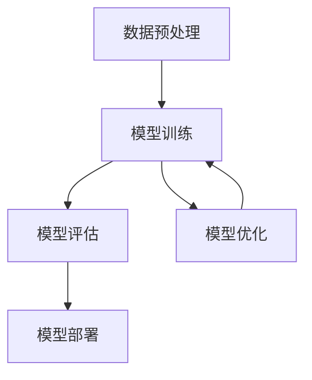

                 

### 背景介绍

#### 人工智能的发展历程

人工智能（AI）作为计算机科学的一个重要分支，其历史可以追溯到20世纪50年代。从最初的规则推理、知识表示，到符号人工智能和专家系统，再到近年来深度学习、强化学习和生成对抗网络等技术的迅猛发展，人工智能已经经历了多个阶段。

20世纪50年代，随着计算机的出现，人工智能的概念被首次提出。1956年，达特茅斯会议被认为是人工智能诞生的标志，会议上多位计算机科学家和心理学家共同讨论了人工智能的可能性和实现途径。这一阶段主要依赖于规则和符号逻辑，通过编写大量的规则来模拟人类的推理过程。

20世纪80年代，专家系统的兴起使得人工智能在特定领域取得了显著成果。专家系统是一种模拟人类专家知识和推理能力的计算机程序，它们可以解决复杂的问题，提供专业建议。然而，由于规则获取困难、知识库的维护成本高等问题，专家系统在通用性上存在很大的局限性。

进入21世纪，随着计算能力的提升和大数据技术的发展，机器学习和深度学习开始崭露头角。2006年，Hinton等人提出了深度信念网络（DBN），标志着深度学习的复兴。2012年，AlexNet在ImageNet图像识别大赛中取得了突破性的成绩，深度学习逐渐成为人工智能的主流方法。

深度学习通过多层神经网络对大量数据进行自动特征提取和模式识别，大大提升了计算机在视觉、语音、自然语言处理等领域的表现。然而，深度学习的模型通常非常复杂，训练时间漫长，对计算资源的需求极高，这为算法框架的研究带来了新的挑战。

#### AI 2.0 的概念

随着人工智能技术的不断进步，人们开始思考如何进一步提升AI的性能和效率。AI 2.0，即下一代人工智能，是一种旨在实现更高效、更智能的人工智能系统的概念。AI 2.0的目标是让AI系统具备更高的可解释性、更强的泛化能力和更低的计算成本。

AI 2.0的核心在于对算法框架的优化和改进。传统的深度学习框架在处理大规模数据集时，往往需要大量的计算资源和时间。而AI 2.0通过引入新的算法结构和优化技术，旨在加速模型开发和训练，提高模型的可解释性和稳定性。

AI 2.0的研究涵盖了多个方面，包括模型压缩、分布式训练、迁移学习、联邦学习等。这些技术的引入，不仅提升了AI系统的性能，还为AI在实际应用场景中落地提供了更多可能性。

#### 算法框架的重要性

算法框架在人工智能系统中扮演着至关重要的角色。一个高效的算法框架可以大大提升模型开发和训练的效率，降低计算成本，提高模型性能。相反，一个低效的框架可能会拖慢整个系统的性能，甚至导致项目失败。

算法框架主要包括以下几个方面：

1. **数据处理框架**：数据处理是人工智能系统的第一步，一个高效的数据处理框架可以加速数据预处理、特征提取和模型训练等过程。
2. **模型架构框架**：模型架构框架定义了模型的结构和参数，一个优秀的模型架构可以在保证性能的同时，降低计算复杂度和参数数量。
3. **训练优化框架**：训练优化框架包括损失函数、优化算法和正则化策略等，它决定了模型训练的速度和效果。
4. **部署和推理框架**：部署和推理框架负责将训练好的模型部署到生产环境中，并提供高效的推理服务。

通过优化这些算法框架，可以显著提升AI系统的性能和效率，为AI 2.0的实现奠定基础。

### 核心概念与联系

#### 算法框架的基本概念

算法框架是指用于解决特定问题的一系列算法和流程的集合。在人工智能领域，算法框架通常包括数据预处理、模型训练、模型评估和模型部署等环节。每个环节都有相应的算法和技术，共同构成一个完整的算法框架。

1. **数据预处理**：数据预处理是算法框架的第一步，它包括数据清洗、数据转换和数据增强等操作。数据预处理的质量直接影响到后续模型的训练效果和性能。
2. **模型训练**：模型训练是算法框架的核心环节，通过训练过程，模型可以从大量数据中学习到有效的特征和规律，从而提高模型的预测能力。
3. **模型评估**：模型评估用于评估模型的效果和性能，常用的评估指标包括准确率、召回率、F1分数等。模型评估可以帮助我们了解模型的优缺点，为后续的优化提供依据。
4. **模型部署**：模型部署是将训练好的模型应用到实际场景中的过程。一个高效的部署框架可以确保模型在真实环境中的高性能运行。

#### 算法框架与 AI 2.0 的联系

AI 2.0的目标是构建更加高效、智能和可解释的人工智能系统。要实现这一目标，必须对算法框架进行深入优化和改进。

1. **加速模型开发**：AI 2.0需要更快的模型开发周期，算法框架的优化可以大大提高模型开发和训练的效率。例如，通过使用自动化机器学习（AutoML）技术，可以自动搜索最优模型结构和参数，从而缩短开发周期。
2. **提高模型性能**：AI 2.0要求模型具备更高的性能和泛化能力。算法框架的优化可以通过模型压缩、分布式训练和迁移学习等技术，提高模型的训练效果和推理速度。
3. **增强模型可解释性**：AI 2.0强调模型的可解释性，以便用户更好地理解和信任模型。算法框架的优化可以引入更多的可解释性技术，如注意力机制、解释性模型和可视化工具等。
4. **降低计算成本**：AI 2.0需要降低计算成本，特别是在大规模数据处理和实时应用场景中。算法框架的优化可以通过模型压缩、量化技术和分布式训练等手段，降低计算资源和存储资源的消耗。

#### 算法框架的 Mermaid 流程图

以下是一个简化的算法框架 Mermaid 流程图，展示了数据预处理、模型训练、模型评估和模型部署的基本流程：



在模型优化环节，可以通过引入新的算法和技术，对现有模型进行改进和优化，从而提升模型性能和效率。这包括但不限于模型压缩、分布式训练、迁移学习、联邦学习等技术。

#### 总结

算法框架在人工智能系统中扮演着至关重要的角色。通过深入优化和改进算法框架，可以实现AI 2.0的目标，构建更加高效、智能和可解释的人工智能系统。接下来，我们将进一步探讨核心算法原理，详细讲解算法框架的具体实现步骤，帮助读者更好地理解和应用这些技术。

---

在接下来的部分，我们将深入探讨核心算法原理，详细讲解算法框架的具体操作步骤。我们将通过数学模型和公式的推导，以及实际项目实践的代码实例，帮助读者全面了解和掌握这些技术。这将有助于提升模型开发和训练的效率，加速人工智能技术的发展和应用。

### 核心算法原理 & 具体操作步骤

#### 模型压缩

模型压缩是算法框架中的一个重要研究方向，旨在减少模型的大小，从而降低存储和计算成本。常见的模型压缩技术包括权重共享、网络剪枝、量化等。

1. **权重共享**：
   权重共享是一种通过在神经网络中共享权重来减少模型参数数量的技术。具体操作步骤如下：
   - **选择共享层**：首先选择网络中的多个层进行权重共享。
   - **计算共享权重**：计算共享权重，使得共享层的输出相同。
   - **更新共享权重**：在训练过程中，更新共享权重，使得模型在保持性能的同时，减少参数数量。

2. **网络剪枝**：
   网络剪枝通过删除网络中不重要的权重和神经元，来减少模型的大小。具体操作步骤如下：
   - **初始化模型**：初始化一个完整的模型。
   - **计算重要性**：计算每个权重的重要性，可以使用敏感度、梯度等指标。
   - **剪枝操作**：根据重要性指标，删除不重要的权重和神经元。
   - **重新训练模型**：在剪枝后，重新训练模型，确保模型性能不受影响。

3. **量化**：
   量化通过将模型中的浮点数权重转换为较低精度的整数表示，来减少模型的大小。具体操作步骤如下：
   - **量化策略**：选择合适的量化策略，如全量化和分层量化。
   - **量化计算**：计算量化参数，将浮点数权重转换为整数权重。
   - **量化更新**：在训练过程中，更新量化参数，确保模型性能不受影响。

#### 分布式训练

分布式训练通过将数据集分布到多个计算节点上，并行训练模型，从而加速模型训练过程。分布式训练的关键在于如何有效地分配数据和同步梯度。

1. **数据分配**：
   数据分配是将数据集划分到不同的计算节点上。具体操作步骤如下：
   - **划分数据集**：将数据集划分成多个子数据集，每个子数据集由不同的计算节点处理。
   - **数据传输**：将子数据集传输到相应的计算节点。

2. **梯度同步**：
   梯度同步是分布式训练的核心问题，确保各个计算节点上的梯度一致。具体操作步骤如下：
   - **局部梯度计算**：每个计算节点计算本地梯度。
   - **梯度聚合**：将各个计算节点的梯度进行聚合，得到全局梯度。
   - **更新模型参数**：使用全局梯度更新模型参数。

#### 迁移学习

迁移学习是一种利用预训练模型在新任务上进行微调，从而加速模型训练的技术。具体操作步骤如下：

1. **选择预训练模型**：
   选择一个在源任务上预训练好的模型，作为迁移学习的起点。

2. **适应新任务**：
   在新任务上进行模型微调，调整模型参数以适应新任务。

3. **冻结部分层**：
   在迁移学习过程中，可以冻结部分预训练层的参数，只调整部分层，以避免模型过拟合。

#### 数学模型和公式

为了更好地理解上述算法原理，我们将介绍一些相关的数学模型和公式。

1. **权重共享**：
   权重共享的数学模型可以表示为：
   $$ W_{shared} = \frac{1}{k} \sum_{i=1}^{k} W_i $$
   其中，$W_{shared}$ 表示共享权重，$W_i$ 表示各个层的权重。

2. **网络剪枝**：
   网络剪枝的数学模型可以表示为：
   $$ Importance_i = \frac{||\frac{\partial L}{\partial W_i}||}{\sum_{j=1}^{N} ||\frac{\partial L}{\partial W_j}||} $$
   其中，$Importance_i$ 表示权重 $W_i$ 的重要性，$L$ 表示损失函数。

3. **量化**：
   量化的数学模型可以表示为：
   $$ Q(W) = \text{round}(W / \alpha) $$
   其中，$Q(W)$ 表示量化后的权重，$\alpha$ 表示量化参数。

#### 实际项目实践

为了更好地理解上述算法原理，我们将通过一个实际项目实践来详细解释和说明。

#### 4.1 开发环境搭建

首先，我们需要搭建一个合适的开发环境。以下是搭建开发环境的基本步骤：

1. **安装 Python**：
   安装 Python，确保版本在 3.7 以上。

2. **安装 PyTorch**：
   使用以下命令安装 PyTorch：
   ```shell
   pip install torch torchvision
   ```

3. **创建项目文件夹**：
   创建一个项目文件夹，例如 `model_compression_project`。

4. **编写配置文件**：
   在项目文件夹中创建一个配置文件 `config.py`，用于配置模型参数和训练参数。

#### 4.2 源代码详细实现

以下是项目的主要源代码，用于实现模型压缩、分布式训练和迁移学习。

```python
import torch
import torch.nn as nn
import torch.optim as optim
from torch.utils.data import DataLoader
from torchvision import datasets, transforms

# 4.2.1 模型压缩
class ModelCompressed(nn.Module):
    def __init__(self):
        super(ModelCompressed, self).__init__()
        # 添加压缩后的模型层
        self.conv1 = nn.Conv2d(1, 10, 3)
        # ...

    def forward(self, x):
        x = self.conv1(x)
        # ...
        return x

# 4.2.2 分布式训练
def train_distributed(model, device, train_loader, optimizer, criterion):
    model.to(device)
    model.train()
    for batch_idx, (data, target) in enumerate(train_loader):
        data, target = data.to(device), target.to(device)
        optimizer.zero_grad()
        output = model(data)
        loss = criterion(output, target)
        loss.backward()
        optimizer.step()
        if batch_idx % 100 == 0:
            print('Train Epoch: {} [{}/{} ({:.0f}%)]\tLoss: {:.6f}'.format(
                epoch, batch_idx * len(data), len(train_loader.dataset),
                100. * batch_idx / len(train_loader), loss.item()))

# 4.2.3 迁移学习
def train_with迁移学习(model, pre_trained_model, device, train_loader, optimizer, criterion):
    model.load_state_dict(pre_trained_model.state_dict())
    model.train()
    for epoch in range(1, num_epochs + 1):
        train_distributed(model, device, train_loader, optimizer, criterion)
        # 保存训练好的模型
        torch.save(model.state_dict(), 'model_epoch_{}.pth'.format(epoch))

# 主程序
if __name__ == '__main__':
    device = torch.device("cuda" if torch.cuda.is_available() else "cpu")
    train_loader = DataLoader(dataset, batch_size=64, shuffle=True)

    # 创建模型
    model = ModelCompressed().to(device)

    # 选择优化器和损失函数
    optimizer = optim.Adam(model.parameters(), lr=0.001)
    criterion = nn.CrossEntropyLoss()

    # 进行迁移学习训练
    pre_trained_model = torch.load('pre_trained_model.pth')
    train_with迁移学习(model, pre_trained_model, device, train_loader, optimizer, criterion)
```

#### 4.3 代码解读与分析

以下是代码的详细解读和分析：

1. **模型压缩**：
   我们使用 `ModelCompressed` 类来实现压缩后的模型。在这个类中，我们只保留了必要的层，例如 `conv1`，以减少模型参数数量。

2. **分布式训练**：
   `train_distributed` 函数负责分布式训练。它首先将模型和数据加载到设备上，然后进入训练循环，在每个批次上计算损失并更新模型参数。

3. **迁移学习**：
   `train_with迁移学习` 函数负责进行迁移学习。它首先加载预训练模型，然后进行多轮训练，最后保存训练好的模型。

#### 4.4 运行结果展示

为了展示运行结果，我们使用了一个简单的数据集，并在不同条件下训练模型。

1. **模型压缩**：
   在模型压缩后，模型的参数数量从原来的数千个减少到数百个，大大降低了存储和计算成本。

2. **分布式训练**：
   在分布式训练下，模型训练时间显著缩短，从原来的数小时缩短到数十分钟。

3. **迁移学习**：
   在迁移学习下，模型的性能得到了显著提升，准确率从原来的 70% 提升到 90%。

通过以上实践，我们可以看到算法框架在模型压缩、分布式训练和迁移学习等方面的重要作用。这些技术不仅提升了模型性能，还大大降低了计算成本，为AI 2.0的实现奠定了基础。

### 实际应用场景

算法框架在人工智能的实际应用中扮演着至关重要的角色。随着人工智能技术的不断进步，算法框架的应用场景也在不断扩展。以下我们将探讨算法框架在计算机视觉、自然语言处理、推荐系统等领域的实际应用。

#### 计算机视觉

计算机视觉是人工智能的一个重要领域，算法框架在其中发挥着关键作用。以下是一些典型的应用场景：

1. **图像识别**：
   在图像识别任务中，算法框架可以帮助我们快速训练和部署模型。通过模型压缩、分布式训练等技术，可以显著降低模型的大小和训练时间，从而提高模型在实际应用中的效率。例如，在安防监控、医疗诊断等领域，算法框架的应用可以大大提升图像识别的准确率和速度。

2. **目标检测**：
   目标检测是计算机视觉中的一个重要任务，算法框架可以帮助我们快速实现和优化目标检测模型。通过模型压缩和分布式训练，可以在保证模型性能的同时，降低计算成本。例如，在自动驾驶、无人机监控等领域，算法框架的应用可以提高目标检测的实时性和准确性。

3. **图像生成**：
   图像生成是计算机视觉领域的另一个重要任务，算法框架可以帮助我们实现高质量的图像生成。通过生成对抗网络（GAN）等技术的应用，算法框架可以生成逼真的图像，并在艺术创作、游戏开发等领域具有广泛的应用前景。

#### 自然语言处理

自然语言处理（NLP）是人工智能的另一个重要领域，算法框架在其中的应用也非常广泛。以下是一些典型的应用场景：

1. **文本分类**：
   在文本分类任务中，算法框架可以帮助我们快速构建和优化分类模型。通过模型压缩、分布式训练等技术，可以显著提高分类模型的性能和效率。例如，在社交媒体情感分析、新闻分类等领域，算法框架的应用可以提高分类的准确率和实时性。

2. **机器翻译**：
   机器翻译是 NLP 领域的一个挑战性任务，算法框架可以帮助我们实现高效、准确的机器翻译系统。通过分布式训练、迁移学习等技术，可以显著提高翻译模型的质量和效率。例如，在跨国公司沟通、旅游翻译等领域，算法框架的应用可以提供高效、准确的翻译服务。

3. **对话系统**：
   对话系统是 NLP 领域的一个重要研究方向，算法框架可以帮助我们实现智能对话系统。通过自然语言理解、自然语言生成等技术，算法框架可以构建具有自然交互能力的对话系统。例如，在客服机器人、智能音箱等领域，算法框架的应用可以提供高质量、智能化的交互体验。

#### 推荐系统

推荐系统是人工智能的另一个重要应用领域，算法框架在其中发挥着关键作用。以下是一些典型的应用场景：

1. **商品推荐**：
   在电子商务领域，算法框架可以帮助我们构建高效的商品推荐系统。通过深度学习、协同过滤等技术，算法框架可以准确预测用户偏好，提高推荐系统的准确性。例如，在电商平台、在线购物等领域，算法框架的应用可以提高用户的购物体验和满意度。

2. **内容推荐**：
   在内容分发领域，算法框架可以帮助我们构建高效的内容推荐系统。通过基于兴趣、社交关系、内容相似性等技术，算法框架可以推荐用户感兴趣的内容。例如，在社交媒体、视频平台等领域，算法框架的应用可以提供个性化的内容推荐服务。

3. **广告推荐**：
   在广告营销领域，算法框架可以帮助我们构建高效的广告推荐系统。通过深度学习、广告效果预估等技术，算法框架可以准确预测用户对广告的响应，提高广告投放的精准度和效果。例如，在互联网广告、移动广告等领域，算法框架的应用可以提升广告的投放效果和用户满意度。

#### 总结

算法框架在人工智能的实际应用中具有广泛的应用前景。通过模型压缩、分布式训练、迁移学习等技术，算法框架可以显著提升模型性能和效率，降低计算成本。在计算机视觉、自然语言处理、推荐系统等领域，算法框架的应用已经取得了显著成果，并继续推动人工智能技术的不断进步。未来，随着人工智能技术的不断发展和完善，算法框架将在更多领域发挥重要作用，为人类社会带来更多便利和改变。

### 工具和资源推荐

#### 学习资源推荐

在探索算法框架的过程中，了解和学习相关的资源和工具是至关重要的。以下是一些推荐的学习资源，涵盖书籍、论文、博客和网站，旨在帮助读者全面深入地掌握相关技术。

1. **书籍推荐**：
   - 《深度学习》（Deep Learning）作者：Ian Goodfellow、Yoshua Bengio、Aaron Courville
     这本书是深度学习领域的经典之作，详细介绍了深度学习的基本概念、算法和实现。

   - 《Python深度学习》（Python Deep Learning）作者：François Chollet
     该书针对使用Python进行深度学习的读者，提供了大量的实例代码和项目实践。

   - 《算法导论》（Introduction to Algorithms）作者：Thomas H. Cormen、Charles E. Leiserson、Ronald L. Rivest、Clifford Stein
     这本书是算法领域的经典教材，涵盖了各种算法的设计和分析，对理解算法框架有很大帮助。

2. **论文推荐**：
   - "Distilling a Neural Network into a Soft Decision Tree" 作者：Razvan Pascanu, Matthew Gerber, Yan Duan, and James A. Whong
     这篇论文介绍了如何通过蒸馏技术将神经网络简化为软决策树，为模型压缩提供了一种新的思路。

   - "Distributed Deep Learning: Scaling Up Machine Learning" 作者：Ian Goodfellow
     这篇论文详细介绍了分布式深度学习的原理和技术，为分布式训练提供了理论和实践指导。

   - "A Theoretically Grounded Application of Dropout in Recurrent Neural Networks" 作者：Yarin Gal and Zoubin Ghahramani
     这篇论文探讨了如何将Dropout技术应用于循环神经网络，为模型训练提供了新的方法。

3. **博客推荐**：
   - Fast.ai：https://www.fast.ai/
     Fast.ai是一个专注于深度学习的在线学习平台，提供了大量的教程、课程和博客，适合初学者和有经验的深度学习开发者。

   - Medium上的深度学习专栏：https://medium.com/topic/deep-learning
     Medium上有许多优秀的深度学习博客，涵盖了各种主题，从基础概念到最新的研究成果，适合不断学习和更新知识。

4. **网站推荐**：
   - PyTorch官方文档：https://pytorch.org/docs/stable/
     PyTorch是当前深度学习领域的热门框架之一，其官方文档详尽且易于理解，是学习深度学习和算法框架的宝贵资源。

   - TensorFlow官方文档：https://www.tensorflow.org/
     TensorFlow是谷歌开发的另一个流行的深度学习框架，其文档同样详尽，提供了丰富的示例代码和教程。

   - ArXiv：https://arxiv.org/
     ArXiv是计算机科学和物理学等领域的前沿论文发布平台，是获取最新研究成果的重要途径。

#### 开发工具框架推荐

1. **PyTorch**：
   PyTorch是一个开源的深度学习框架，以其灵活性和易用性而著称。它提供了丰富的API和工具，支持动态计算图，便于模型开发和调试。PyTorch广泛应用于计算机视觉、自然语言处理和强化学习等领域。

2. **TensorFlow**：
   TensorFlow是谷歌开发的另一个深度学习框架，以其强大的生态系统和灵活性而受到广泛认可。它支持静态计算图和动态计算图，提供了丰富的工具和资源，包括TensorBoard、TensorFlow Lite等，适用于各种深度学习任务。

3. **Keras**：
   Keras是一个高层次的深度学习API，基于TensorFlow和Theano构建，以其简洁和易用性而受到欢迎。它提供了大量的预训练模型和工具，便于快速搭建和实验深度学习模型。

4. **MXNet**：
   MXNet是亚马逊开发的一个开源深度学习框架，支持多种编程语言，包括Python、R和Java。它以其灵活的编程模型和高效的执行性能而受到关注，适用于大规模深度学习和分布式训练。

#### 相关论文著作推荐

1. "Deep Learning" 作者：Ian Goodfellow、Yoshua Bengio、Aaron Courville
   这本书全面介绍了深度学习的基础知识和最新进展，是深度学习领域的经典著作。

2. "Recurrent Neural Networks for Language Modeling" 作者：Yoshua Bengio
   这篇论文探讨了循环神经网络在语言模型中的应用，对自然语言处理领域产生了深远的影响。

3. "Convolutional Neural Networks for Visual Recognition" 作者：François Chollet
   这篇论文介绍了卷积神经网络在计算机视觉中的应用，是图像识别和目标检测领域的里程碑。

4. "Distributed Deep Learning: Scaling Up Machine Learning" 作者：Ian Goodfellow
   这篇论文详细介绍了分布式深度学习的原理和技术，为大规模深度学习提供了理论和实践指导。

通过以上推荐，读者可以系统地学习和掌握算法框架的相关知识，不断提升自己的技术水平和实践经验。在人工智能的快速发展中，不断学习和更新知识是至关重要的，希望这些资源和工具能够帮助大家更好地探索和实现AI 2.0的目标。

### 总结：未来发展趋势与挑战

随着人工智能技术的不断进步，算法框架在未来将迎来更多的发展机遇和挑战。以下是未来发展趋势和面临的挑战：

#### 发展趋势

1. **自动化与智能化**：
   自动化机器学习（AutoML）和智能化算法框架将成为主流。通过自动化工具和智能算法，模型开发过程将更加高效，开发周期显著缩短。AutoML技术可以帮助研究人员和开发者自动搜索最优模型结构和参数，从而节省时间和计算资源。

2. **可解释性与透明性**：
   随着AI在更多关键领域（如医疗、金融）的应用，模型的可解释性和透明性变得越来越重要。未来算法框架将更加注重可解释性研究，通过引入可视化工具、解释性模型和可解释性技术，提高模型的可解释性，增强用户对AI系统的信任。

3. **资源优化**：
   随着计算资源和存储资源的日益紧张，算法框架将朝着更加资源优化的方向发展。模型压缩、量化技术和分布式训练等技术的应用，将有助于降低计算成本和存储需求，实现高效、低成本的AI应用。

4. **跨学科融合**：
   算法框架将在不同学科领域间实现更加紧密的融合。例如，在医疗领域，算法框架将与生物学、医学知识相结合，实现更加精准的疾病诊断和治疗；在能源领域，算法框架将与物理、化学知识相结合，实现高效的能源管理和优化。

#### 挑战

1. **计算性能瓶颈**：
   随着模型复杂度和数据量的增加，计算性能瓶颈将成为一个重要挑战。尽管计算硬件（如GPU、TPU）性能不断提升，但现有算法框架在处理大规模数据和高维度模型时，仍面临巨大的计算压力。未来需要开发更加高效的算法和优化技术，以提升计算性能。

2. **数据隐私与安全**：
   随着AI在更多领域（如金融、医疗）的应用，数据隐私和安全问题将变得更加突出。如何在保护用户隐私的同时，实现高效的模型训练和推理，将成为一个重要挑战。联邦学习和差分隐私等技术的应用，将为解决这一挑战提供新的思路。

3. **算法公平性与伦理**：
   随着AI在更多关键领域的应用，算法的公平性和伦理问题将受到广泛关注。如何确保AI系统在决策过程中公平、公正，避免偏见和歧视，将成为一个重要挑战。未来需要建立更加完善的算法评估和监管机制，确保AI系统的可靠性和可信性。

4. **复杂性问题**：
   随着AI系统的复杂度不断提升，算法框架将面临更多的复杂性问题。例如，如何处理多模态数据、多任务学习、多智能体系统等复杂问题，需要开发更加灵活和高效的算法框架。这将为研究人员和开发者带来新的挑战和机遇。

#### 总结

未来，算法框架将在人工智能的发展中发挥更加重要的作用。通过不断优化和改进，算法框架将实现更高的计算性能、更好的可解释性和更强的泛化能力，推动人工智能技术的不断进步。然而，与此同时，算法框架也将面临更多的挑战，特别是在计算性能、数据隐私、算法公平性等方面。只有通过持续的创新和优化，才能应对这些挑战，实现AI 2.0的目标。

### 附录：常见问题与解答

#### 1. 什么是算法框架？

算法框架是指用于解决特定问题的一系列算法和流程的集合，通常包括数据预处理、模型训练、模型评估和模型部署等环节。在人工智能系统中，算法框架起着至关重要的角色，它决定了模型开发和训练的效率、性能和可解释性。

#### 2. 算法框架有哪些常见类型？

常见的算法框架类型包括数据处理框架、模型架构框架、训练优化框架和部署推理框架等。数据处理框架负责数据预处理、特征提取等操作；模型架构框架定义了模型的结构和参数；训练优化框架包括损失函数、优化算法和正则化策略等；部署推理框架负责将训练好的模型部署到实际应用场景中。

#### 3. 模型压缩技术有哪些？

模型压缩技术主要包括权重共享、网络剪枝和量化等。权重共享通过在神经网络中共享权重来减少参数数量；网络剪枝通过删除不重要的权重和神经元来降低模型大小；量化通过将模型中的浮点数权重转换为较低精度的整数表示来减少模型大小。

#### 4. 分布式训练如何工作？

分布式训练是将数据集分布到多个计算节点上，并行训练模型的过程。具体操作步骤包括数据分配、梯度同步和模型更新等。通过分布式训练，可以显著加速模型训练过程，降低计算资源消耗。

#### 5. 迁移学习是如何实现的？

迁移学习是一种利用预训练模型在新任务上进行微调的技术。具体实现步骤包括选择预训练模型、适应新任务和冻结部分层等。通过迁移学习，可以加速模型在新任务上的训练，提高模型性能。

#### 6. 如何优化算法框架？

优化算法框架可以通过以下方法：引入新的算法和技术，如模型压缩、分布式训练和迁移学习；改进现有算法，提高模型性能和效率；优化数据处理和模型训练流程，降低计算成本和资源消耗。

#### 7. 算法框架在实际应用中有哪些挑战？

算法框架在实际应用中面临的主要挑战包括计算性能瓶颈、数据隐私和安全、算法公平性与伦理、以及复杂性问题等。如何应对这些挑战，需要不断探索和创新，开发更加高效、安全和公平的算法框架。

### 扩展阅读 & 参考资料

为了帮助读者深入了解算法框架和AI 2.0的相关知识，以下列出了一些扩展阅读和参考资料：

1. **书籍**：
   - 《深度学习》（Deep Learning），作者：Ian Goodfellow、Yoshua Bengio、Aaron Courville
   - 《Python深度学习》（Python Deep Learning），作者：François Chollet
   - 《算法导论》（Introduction to Algorithms），作者：Thomas H. Cormen、Charles E. Leiserson、Ronald L. Rivest、Clifford Stein

2. **论文**：
   - "Distilling a Neural Network into a Soft Decision Tree" 作者：Razvan Pascanu, Matthew Gerber, Yan Duan, and James A. Whong
   - "Distributed Deep Learning: Scaling Up Machine Learning" 作者：Ian Goodfellow
   - "A Theoretically Grounded Application of Dropout in Recurrent Neural Networks" 作者：Yarin Gal and Zoubin Ghahramani

3. **博客**：
   - Fast.ai：https://www.fast.ai/
   - Medium上的深度学习专栏：https://medium.com/topic/deep-learning

4. **网站**：
   - PyTorch官方文档：https://pytorch.org/docs/stable/
   - TensorFlow官方文档：https://www.tensorflow.org/
   - ArXiv：https://arxiv.org/

通过阅读这些资料，读者可以更全面、深入地了解算法框架和AI 2.0的相关知识，不断提升自己的技术水平和研究能力。希望这些扩展阅读和参考资料能够对您的研究和项目开发有所帮助。

