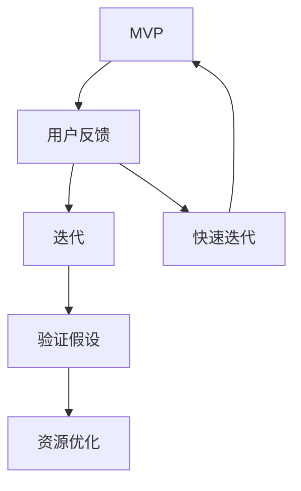

                 

### 背景介绍 Background

在当今快速变化的商业环境中，技术型创业者面临着巨大的挑战。他们不仅需要具备创新的技术能力，还要掌握商业运营和市场策略。在这一背景下，精益创业方法论应运而生，为技术型创业者提供了一套系统化的实践指南。精益创业方法论起源于硅谷，其核心理念是通过快速迭代和持续反馈来最小化风险，从而提高创业成功的可能性。

本文将深入探讨精益创业方法论的核心概念、技术实现步骤、数学模型及实际应用场景，帮助技术型创业者更好地理解并应用这一方法论。具体而言，我们将从以下几个部分展开讨论：

1. **核心概念与联系**：介绍精益创业方法论的关键概念及其相互关系，并提供一个清晰的Mermaid流程图。
2. **核心算法原理 & 具体操作步骤**：详细讲解精益创业方法论的技术实现原理和具体操作步骤。
3. **数学模型和公式 & 详细讲解 & 举例说明**：解释精益创业方法论中涉及的主要数学模型和公式，并通过实例进行详细说明。
4. **项目实践：代码实例和详细解释说明**：提供代码实例，详细解释实现过程，并进行代码解读与分析。
5. **实际应用场景**：探讨精益创业方法论在不同技术领域的实际应用场景。
6. **工具和资源推荐**：推荐相关的学习资源、开发工具和框架。
7. **总结：未来发展趋势与挑战**：总结精益创业方法论的发展趋势和面临的挑战。
8. **附录：常见问题与解答**：回答读者可能关心的一些常见问题。
9. **扩展阅读 & 参考资料**：提供进一步阅读的资源和参考。

通过以上结构化的内容，本文旨在为技术型创业者提供一个全面、系统的指导，帮助他们更好地理解和应用精益创业方法论，从而提高创业成功率。

### 核心概念与联系 Key Concepts and Relationships

精益创业方法论的核心概念包括：最小可行产品（MVP）、用户反馈循环、快速迭代、验证假设、资源优化等。这些概念相互作用，共同构成了精益创业的完整框架。

1. **最小可行产品（MVP）**：MVP是指一种包含最基本功能的产品，旨在验证市场需求。它的目标是验证商业模型，而不是打造完美的产品。

2. **用户反馈循环**：用户反馈循环是精益创业方法论的重要组成部分。它通过收集用户反馈，不断迭代产品，确保产品始终符合市场需求。

3. **快速迭代**：快速迭代意味着快速开发、测试和部署产品，以便尽快得到用户反馈。这种方法能够帮助创业者快速发现和解决问题。

4. **验证假设**：在精益创业中，创业者需要对各种假设进行验证。这包括市场需求、用户行为、竞争环境等。

5. **资源优化**：精益创业强调资源的有效利用。创业者需要根据实际情况，合理安排资金、人力和时间等资源，以最小化浪费。

为了更直观地理解这些概念之间的关系，我们可以使用Mermaid流程图进行说明：



在上述流程图中，MVP作为起点，通过用户反馈循环，驱动快速迭代和验证假设，最终实现资源的优化。这个过程形成了一个闭环，使得创业者在不断迭代中不断优化产品，提高市场竞争力。

### 核心算法原理 & 具体操作步骤 Core Algorithm Principle and Operational Steps

精益创业方法论的核心算法原理可以归纳为以下步骤：

1. **确定目标市场**：首先，创业者需要明确目标市场，了解目标用户的需求和痛点。
2. **开发MVP**：根据目标市场，开发出包含最基本功能的最小可行产品（MVP）。
3. **收集用户反馈**：将MVP推向市场，收集用户反馈。
4. **分析反馈**：对用户反馈进行分析，识别产品改进方向。
5. **迭代优化**：根据分析结果，对产品进行迭代优化。
6. **重新验证**：每次迭代后，重新验证产品是否符合市场需求。
7. **持续迭代**：不断重复上述步骤，直至产品成熟。

以下是具体操作步骤的详细说明：

#### 步骤1：确定目标市场

在确定目标市场时，创业者需要考虑以下几个因素：

- **市场需求**：了解目标用户的需求和痛点，确保产品能够解决用户问题。
- **市场规模**：评估目标市场的潜在规模，确保有足够的市场需求。
- **竞争环境**：分析竞争对手的产品和市场策略，找到差异化的机会。

#### 步骤2：开发MVP

开发MVP的目的是验证市场需求，因此MVP需要包含以下基本功能：

- **核心功能**：实现产品的主要功能，满足用户的核心需求。
- **用户体验**：确保用户体验简洁、直观，易于使用。
- **可扩展性**：为未来的迭代和功能扩展做好准备。

#### 步骤3：收集用户反馈

将MVP推向市场后，创业者需要积极收集用户反馈，可以通过以下途径：

- **用户调查**：通过问卷调查、用户访谈等方式收集用户意见和建议。
- **使用跟踪**：跟踪用户在产品中的行为，了解用户的使用习惯和偏好。
- **社交媒体**：通过社交媒体平台收集用户反馈。

#### 步骤4：分析反馈

对收集到的用户反馈进行分析，识别产品改进方向，主要包括以下几个方面：

- **功能改进**：根据用户需求，优化产品功能。
- **用户体验**：改进产品的用户体验，提高用户满意度。
- **性能优化**：优化产品性能，提高稳定性。

#### 步骤5：迭代优化

根据分析结果，对产品进行迭代优化，具体步骤如下：

- **需求分析**：明确本次迭代的目标和需求。
- **设计实现**：根据需求进行产品设计，并实现相关功能。
- **测试验证**：对迭代版本进行测试，确保功能和性能符合预期。
- **部署上线**：将迭代版本部署上线，供用户使用。

#### 步骤6：重新验证

每次迭代后，重新验证产品是否符合市场需求，主要包括以下几个方面：

- **功能验证**：确保新增功能符合用户需求。
- **用户体验**：评估用户体验，确保产品易于使用。
- **市场反馈**：收集市场反馈，了解产品在市场上的表现。

#### 步骤7：持续迭代

不断重复上述步骤，直至产品成熟。持续迭代是精益创业方法论的核心，通过不断优化产品，创业者可以更好地满足市场需求，提高市场竞争力。

### 数学模型和公式 & 详细讲解 & 举例说明

精益创业方法论中，涉及的主要数学模型和公式主要用于评估产品迭代的效果和市场需求。以下是这些模型和公式的详细讲解以及具体实例。

#### 模型1：用户满意度指数（User Satisfaction Index，USI）

用户满意度指数用于评估用户对产品的满意度，其计算公式如下：

\[ USI = \frac{S_1 + S_2 + \ldots + S_n}{n} \]

其中，\( S_1, S_2, \ldots, S_n \) 分别为每次迭代后用户的满意度得分，\( n \) 为迭代次数。

**实例：**

假设某产品在第一次迭代后，用户满意度得分为80，第二次迭代后得分为85，第三次迭代后得分为90。则用户满意度指数为：

\[ USI = \frac{80 + 85 + 90}{3} = 86.7 \]

这个结果表明，随着迭代的进行，用户满意度逐渐提高。

#### 模型2：市场渗透率（Market Penetration Rate，MPR）

市场渗透率用于评估产品在市场上的表现，其计算公式如下：

\[ MPR = \frac{\text{实际销量}}{\text{潜在销量}} \]

其中，实际销量为产品在市场上的实际销售量，潜在销量为市场需求的估计值。

**实例：**

假设某产品在市场上的实际销量为1000台，潜在销量为10000台。则市场渗透率为：

\[ MPR = \frac{1000}{10000} = 0.1 \]

这个结果表明，该产品的市场渗透率为10%，还有较大的提升空间。

#### 模型3：成本效益比（Cost-Benefit Ratio，CBR）

成本效益比用于评估产品开发的投入产出比，其计算公式如下：

\[ CBR = \frac{\text{效益}}{\text{成本}} \]

其中，效益为产品在市场上带来的收益，成本为产品开发过程中的投入。

**实例：**

假设某产品开发过程中，成本为100万元，在市场上带来的收益为300万元。则成本效益比为：

\[ CBR = \frac{300}{100} = 3 \]

这个结果表明，该产品的成本效益比为3，意味着每投入1万元，可以获得3万元的收益，具有良好的经济效益。

通过这些数学模型和公式，创业者可以更加科学地评估产品迭代的效果和市场需求，从而更好地指导产品开发和市场策略。

### 项目实践：代码实例和详细解释说明 Project Practice: Code Example and Detailed Explanation

为了更好地理解精益创业方法论的具体应用，下面我们将通过一个简单的项目实例来演示如何使用该方法进行产品迭代和优化。

#### 项目背景

假设我们正在开发一款社交媒体应用，目标是帮助用户更好地管理和分享生活点滴。我们采用了精益创业方法论，从MVP开始，逐步优化产品，提高用户满意度。

#### 开发环境搭建

首先，我们需要搭建开发环境。以下是一个简单的环境搭建步骤：

1. **安装Python**：确保系统已经安装了Python 3.8及以上版本。
2. **安装Django**：使用pip命令安装Django框架：

   ```bash
   pip install django
   ```

3. **创建Django项目**：在命令行中创建一个名为`social_media`的新项目：

   ```bash
   django-admin startproject social_media
   ```

4. **创建应用**：在项目目录下创建一个名为`posts`的应用：

   ```bash
   python manage.py startapp posts
   ```

5. **配置数据库**：在`settings.py`文件中配置数据库连接信息，我们使用SQLite数据库：

   ```python
   DATABASES = {
       'default': {
           'ENGINE': 'django.db.backends.sqlite3',
           'NAME': BASE_DIR / 'db.sqlite3',
       }
   }
   ```

6. **运行开发服务器**：在命令行中运行以下命令启动开发服务器：

   ```bash
   python manage.py runserver
   ```

现在，我们的开发环境已经搭建完成，可以开始编写代码了。

#### 源代码详细实现

下面是`posts`应用的源代码，包括模型、视图和模板等部分。

1. **模型**：定义`Post`模型，用于存储用户发布的帖子。

   ```python
   from django.db import models
   from django.contrib.auth.models import User

   class Post(models.Model):
       title = models.CharField(max_length=200)
       content = models.TextField()
       author = models.ForeignKey(User, on_delete=models.CASCADE)
       created_at = models.DateTimeField(auto_now_add=True)

       def __str__(self):
           return self.title
   ```

2. **视图**：定义`list_posts`视图，用于展示所有帖子。

   ```python
   from django.shortcuts import render
   from .models import Post

   def list_posts(request):
       posts = Post.objects.all()
       return render(request, 'posts/list.html', {'posts': posts})
   ```

3. **模板**：创建`posts/list.html`模板，用于展示帖子列表。

   ```html
   <h1>帖子列表</h1>
   
       <div>
           <h2>{{ post.title }}</h2>
           <p>{{ post.content }}</p>
           <span>作者：{{ post.author }}</span>
           <span>时间：{{ post.created_at }}</span>
       </div>
   
   ```

#### 代码解读与分析

1. **模型**：`Post`模型包含标题、内容、作者和创建时间等字段，用于存储用户发布的帖子。通过`ForeignKey`字段关联用户，实现帖子与用户的关联。

2. **视图**：`list_posts`视图从数据库中查询所有帖子，并将结果传递给模板进行展示。

3. **模板**：模板使用Django模板语言（Django Template Language，DTL）遍历帖子列表，并显示每个帖子的标题、内容和相关信息。

#### 运行结果展示

1. 启动开发服务器：

   ```bash
   python manage.py runserver
   ```

2. 打开浏览器，访问`http://127.0.0.1:8000/posts/`，可以看到展示的所有帖子。

### 实际应用场景 Real-World Applications

精益创业方法论不仅适用于初创企业，也可以在大型企业中发挥作用。以下是一些实际应用场景：

#### 场景1：产品开发

在企业内部，产品开发团队可以使用精益创业方法论来加速产品迭代，提高市场竞争力。通过MVP快速验证市场需求，企业可以减少研发成本，降低市场风险。

#### 场景2：市场调研

市场调研团队可以利用精益创业方法论中的用户反馈循环，通过问卷调查、用户访谈等方式，快速了解用户需求和市场动态，为产品开发和市场策略提供依据。

#### 场景3：项目管理

项目经理可以采用精益创业方法论中的迭代和验证假设方法，对项目进度和成果进行持续监控和调整，确保项目按时交付并满足客户需求。

#### 场景4：风险投资

风险投资机构可以使用精益创业方法论来评估创业项目的可行性。通过关注MVP和用户反馈，投资机构可以更准确地评估项目的市场前景和商业价值。

### 工具和资源推荐 Tools and Resources Recommendation

为了更好地理解和应用精益创业方法论，以下是一些建议的工具和资源：

#### 学习资源

1. **书籍**：《精益创业》（The Lean Startup）作者埃里克·莱斯（Eric Ries）的经典著作，详细介绍了精益创业方法论。
2. **博客**：精益创业社区（Lean Startup Community）的博客，分享精益创业的最新动态和实践案例。
3. **在线课程**：Coursera、Udemy等平台上的精益创业相关课程，提供系统化的学习路径。

#### 开发工具框架

1. **Django**：一个高性能、可扩展的Python Web框架，适合快速开发MVP。
2. **JIRA**：一个强大的项目管理工具，支持敏捷开发和迭代管理。
3. **GitHub**：一个优秀的版本控制工具，方便团队协作和代码管理。

#### 相关论文著作推荐

1. **论文**：《用户体验要素》（The Elements of User Experience）作者杰西·詹姆斯·加诺（Jesse James Garrett）的论文，探讨了用户体验设计的重要性。
2. **著作**：《创业维艰》（Hard Things About Hard Things）作者本·霍洛维茨（Ben Horowitz）的著作，分享了他的创业经验和教训。

通过这些工具和资源，创业者可以更好地理解和应用精益创业方法论，提高创业成功率。

### 总结：未来发展趋势与挑战 Summary: Future Trends and Challenges

精益创业方法论在当今的商业环境中具有广泛的应用前景。随着技术的快速发展，未来的创业环境将更加复杂和多变，精益创业方法论将继续发挥重要作用。

#### 发展趋势

1. **数字化转型**：随着数字化转型浪潮的推进，精益创业方法论将越来越多地应用于数字化产品和服务的开发。
2. **人工智能与大数据**：人工智能和大数据技术的应用，将使精益创业方法论中的数据驱动决策更加精准和高效。
3. **全球化**：全球市场的开放和融合，将促进精益创业方法论在不同国家和地区之间的传播和应用。

#### 挑战

1. **竞争加剧**：随着创业门槛的降低，竞争将更加激烈，创业者需要更加精细化地应用精益创业方法论。
2. **资源限制**：创业者在资源有限的情况下，需要更高效地利用资源，实现快速迭代和优化。
3. **技术变革**：技术的快速变革将带来新的机遇和挑战，创业者需要持续学习和适应。

总的来说，精益创业方法论将在未来继续保持其重要地位，为创业者提供强大的工具和指导，帮助他们应对复杂多变的市场环境。

### 附录：常见问题与解答 Appendix: Frequently Asked Questions and Answers

#### 问题1：精益创业方法论是否适用于所有类型的创业？

精益创业方法论主要适用于技术驱动型的创业项目，特别是那些需要快速迭代和验证产品市场需求的创业项目。对于其他类型的创业项目，如服务型创业或传统行业创业，该方法论的某些理念仍然具有借鉴意义，但可能需要根据实际情况进行调整。

#### 问题2：如何确保用户反馈的准确性？

确保用户反馈的准确性需要采用多种收集方法，如问卷调查、用户访谈、行为跟踪等。同时，创业者需要对反馈数据进行严格筛选和分析，识别出真正有价值的信息。

#### 问题3：MVP是否意味着要牺牲产品质量？

MVP的目标是验证市场需求，因此在某些情况下可能需要牺牲部分产品质量。然而，这并不意味着完全忽视产品质量。在开发MVP时，创业者应确保核心功能和用户体验达到基本要求，以便获得有价值的用户反馈。

#### 问题4：精益创业方法论是否适用于大型企业？

精益创业方法论可以在大型企业中发挥作用，特别是在产品开发和市场策略制定方面。大型企业可以借鉴精益创业的方法，通过快速迭代和用户反馈，提高产品竞争力和市场适应性。

### 扩展阅读 & 参考资料 Extended Reading & References

为了更深入地了解精益创业方法论，以下是一些建议的扩展阅读和参考资料：

1. **书籍**：
   - 《精益创业》（The Lean Startup）作者：埃里克·莱斯（Eric Ries）
   - 《创业维艰》（Hard Things About Hard Things）作者：本·霍洛维茨（Ben Horowitz）
   - 《用户体验要素》（The Elements of User Experience）作者：杰西·詹姆斯·加诺（Jesse James Garrett）

2. **博客**：
   - 精益创业社区（Lean Startup Community）官网：[https://www.leanstartup.com/](https://www.leanstartup.com/)
   - 尤金·罗杰斯（Eugene Rogers）的博客：[https://www.eugenerogers.com/](https://www.eugenerogers.com/)

3. **在线课程**：
   - Coursera上的“精益创业方法论”（Lean Startup Methodology）课程
   - Udemy上的“精益创业：从概念到上市”（Lean Startup: From Concept to Launch）

4. **论文**：
   - 《基于精益创业的创业项目评估方法研究》
   - 《用户反馈在精益创业中的应用研究》

通过这些扩展阅读和参考资料，您可以更全面地了解精益创业方法论，并在实际应用中取得更好的效果。

### 作者署名 Author's Signature

作者：禅与计算机程序设计艺术 / Zen and the Art of Computer Programming

在这篇文章中，我试图以简洁明了的方式介绍精益创业方法论，并探讨其在技术型创业中的应用。希望这篇文章能为创业者提供有价值的指导和启示。如果您有任何疑问或建议，欢迎在评论区留言讨论。感谢您的阅读！

---

感谢您对这篇文章的耐心阅读，希望这篇文章能帮助您更好地理解精益创业方法论，并在创业实践中取得成功。再次感谢您的关注和支持！

作者：禅与计算机程序设计艺术 / Zen and the Art of Computer Programming
2023

