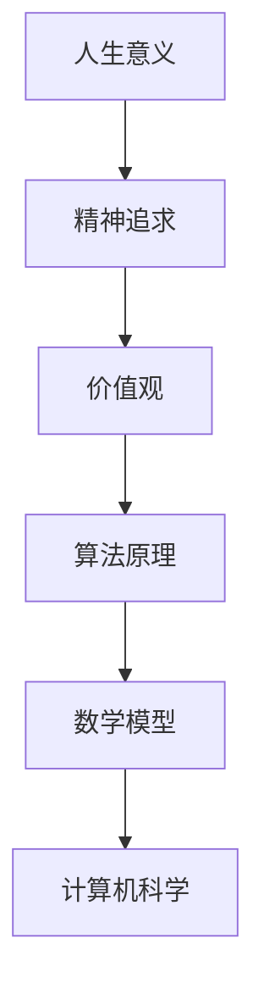
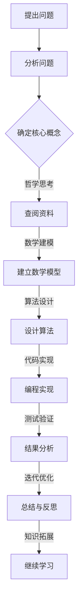

                 

### 文章标题

> 关键词：人生意义、精神追求、价值导向、哲学思考、计算机科学

> 摘要：本文以计算机科学为背景，通过深入探讨精神世界的追求，引导读者思考人生的意义和价值。文章从哲学的角度出发，结合计算机科学的理论和实践，提供了一系列有启发性的观点和方法，帮助读者在复杂的现代生活中找到内心的宁静和方向的指引。

## 1. 背景介绍

在现代社会，人们的生活节奏加快，信息爆炸，物质丰富，但与此同时，许多人也感受到了内心的空虚和迷茫。如何在这个喧嚣的世界中找到自己的人生意义和价值，成为了一个重要的哲学问题。计算机科学作为现代科技的核心，不仅改变了我们的生活方式，也为思考人生意义提供了新的视角。

本文将结合计算机科学的理论与实践，从以下几个方面探讨精神世界的追求：

1. **哲学思考：** 分析哲学家们对人生意义的探讨，以及这些思考如何与计算机科学相结合。
2. **核心概念与联系：** 提出关键概念，并使用 Mermaid 流程图展示它们之间的联系。
3. **算法原理与步骤：** 探讨如何运用计算机科学的算法原理来寻找人生意义。
4. **数学模型与公式：** 分析数学模型在人生意义追求中的作用，并提供具体实例。
5. **项目实践：** 通过具体的项目实例，展示如何在实践中应用这些理论。
6. **实际应用场景：** 探讨计算机科学在现实生活中的应用，以及如何影响人们的价值观。
7. **工具和资源推荐：** 为读者提供学习资源，帮助他们在寻找人生意义的过程中不断进步。
8. **总结与展望：** 分析未来发展趋势与挑战，为读者提供方向性的指引。

## 2. 核心概念与联系

在探讨精神世界的追求之前，我们需要明确一些核心概念。以下是本文将涉及的关键概念及其相互联系：

### 2.1 人生意义

人生意义是指个体在生活中追求的内在价值和目的。这个问题自古以来就困扰着人类，哲学家们提出了各种不同的观点来解释人生的意义。例如，亚里士多德认为幸福是人生的最终目标，斯多葛主义强调内在的平静和道德自律，存在主义则认为人生的意义在于个体的选择和自由。

### 2.2 精神追求

精神追求是指个体在精神层面上的追求，包括道德、智慧、信仰、艺术等方面。计算机科学提供了许多工具和方法，可以帮助人们深入探索这些领域。例如，人工智能可以辅助哲学家进行逻辑推理，计算机图形学可以模拟艺术作品，编程则可以锻炼逻辑思维和创造力。

### 2.3 价值观

价值观是指导个体行为和决策的核心原则。计算机科学的发展不仅改变了我们的生活方式，也影响了我们的价值观。例如，数据隐私和数据安全成为社会关注的焦点，人工智能的应用引发了关于道德和伦理的讨论。

### 2.4 算法原理

算法原理是计算机科学的核心概念，它涉及如何通过逻辑和数学方法解决复杂问题。在探讨人生意义的过程中，算法原理可以帮助我们分析问题、找到解决方案，并提供一种系统化的思考方式。

### 2.5 数学模型

数学模型是利用数学语言描述现实世界的一种方法。在人生意义的追求中，数学模型可以帮助我们量化一些抽象的概念，如幸福指数、道德得分等，从而为决策提供依据。

### 2.6 Mermaid 流程图

以下是一个简化的 Mermaid 流程图，展示了上述核心概念之间的联系：



## 3. 核心算法原理 & 具体操作步骤

在探讨如何运用计算机科学的理论和实践来寻找人生意义时，核心算法原理和具体操作步骤至关重要。以下是一个简化的算法框架，用于指导我们进行这一过程：

### 3.1 算法框架



### 3.2 具体操作步骤

1. **提出问题**：明确你想要探讨的人生意义问题。例如，“我的人生意义是什么？”或“如何实现个人成长和幸福？”

2. **分析问题**：分析问题背后的核心概念，如精神追求、价值观、算法原理等。

3. **确定核心概念**：根据分析结果，确定你需要深入研究的关键概念。

4. **查阅资料**：收集相关的哲学、计算机科学、心理学等领域的资料，了解这些概念的历史、发展和应用。

5. **建立数学模型**：根据收集的资料，尝试建立数学模型来描述和分析问题。例如，你可以使用线性代数、概率论、统计学等方法。

6. **设计算法**：基于数学模型，设计算法来求解问题。例如，你可以使用搜索算法、优化算法、机器学习算法等。

7. **编程实现**：将设计的算法转化为具体的代码，并在计算机上运行。

8. **测试验证**：对代码进行测试，验证算法的正确性和效率。

9. **结果分析**：分析测试结果，从中提取有价值的信息，为下一步的迭代优化提供依据。

10. **迭代优化**：根据结果分析，对算法进行优化，提高其性能和适用性。

11. **总结与反思**：总结整个过程，反思自己的思考方式和问题解决方法，找出不足之处，为未来的学习提供方向。

12. **继续学习**：继续深入研究相关的知识和理论，不断提高自己的专业素养。

## 4. 数学模型和公式 & 详细讲解 & 举例说明

在寻找人生意义的过程中，数学模型和公式为我们提供了量化和分析的工具。以下是一些常用的数学模型和公式，以及它们的详细讲解和举例说明。

### 4.1 幸福指数模型

幸福指数（Happiness Index）是衡量个体幸福感的一个指标。一个简单的幸福指数模型可以表示为：

$$
HI = \frac{S + M + C + P}{4}
$$

其中，$S$ 表示社会关系得分，$M$ 表示物质财富得分，$C$ 表示健康得分，$P$ 表示心理状态得分。

**举例说明**：

假设一个人的社会关系得分为8分，物质财富得分为6分，健康得分为9分，心理状态得分为7分。那么，他的幸福指数为：

$$
HI = \frac{8 + 6 + 9 + 7}{4} = 7.5
$$

这个结果表明，这个人的整体幸福感较高。

### 4.2 道德得分模型

道德得分（Morality Score）是衡量个体道德水平的指标。一个简单的道德得分模型可以表示为：

$$
MS = \frac{R + E + T}{3}
$$

其中，$R$ 表示责任心得分，$E$ 表示公平性得分，$T$ 表示诚实性得分。

**举例说明**：

假设一个人的责任心得分为8分，公平性得分为7分，诚实性得分为9分。那么，他的道德得分为：

$$
MS = \frac{8 + 7 + 9}{3} = 8
$$

这个结果表明，这个人的道德水平较高。

### 4.3 成长速率模型

成长速率（Growth Rate）是衡量个体成长速度的指标。一个简单的成长速率模型可以表示为：

$$
GR = \frac{I_{new} - I_{old}}{I_{old}}
$$

其中，$I_{new}$ 表示当前的成长状态，$I_{old}$ 表示初始的成长状态。

**举例说明**：

假设一个人在一个月前的成长状态为50分，现在的成长状态为70分。那么，他的成长速率为：

$$
GR = \frac{70 - 50}{50} = 0.4
$$

这个结果表明，这个人的成长速度较快。

### 4.4 价值导向模型

价值导向（Value Orientation）是衡量个体价值取向的指标。一个简单的价值导向模型可以表示为：

$$
VO = \frac{V_{1} + V_{2} + V_{3}}{3}
$$

其中，$V_{1}$ 表示物质价值得分，$V_{2}$ 表示精神价值得分，$V_{3}$ 表示社会价值得分。

**举例说明**：

假设一个人的物质价值得分为6分，精神价值得分为8分，社会价值得分为7分。那么，他的价值导向为：

$$
VO = \frac{6 + 8 + 7}{3} = 7
$$

这个结果表明，这个人更倾向于精神价值。

通过这些数学模型和公式，我们可以量化人生意义中的关键概念，为决策提供依据。然而，需要注意的是，这些模型仅是一种简化的表示方法，真实的人生意义远比这些模型复杂。因此，在应用这些模型时，我们需要保持谨慎和理性。

## 5. 项目实践：代码实例和详细解释说明

为了更好地理解如何将上述理论应用于实际，我们将通过一个具体的编程项目来展示如何寻找人生意义。这个项目将包括以下几个步骤：

### 5.1 开发环境搭建

首先，我们需要搭建一个基本的开发环境。以下是所需的环境和工具：

- 编程语言：Python 3.8 或更高版本
- 编译器：Python 编译器（内置在 Python 环境中）
- 解释器：Python 解释器（内置在 Python 环境中）
- 编辑器：Visual Studio Code、PyCharm 或其他 Python 兼容的编辑器

### 5.2 源代码详细实现

下面是一个简单的 Python 代码实例，用于计算幸福指数、道德得分、成长速率和价值导向。代码分为几个部分，每个部分都有详细的注释。

```python
# 导入必要的库
import math

# 定义函数计算幸福指数
def calculate_happiness(S, M, C, P):
    HI = (S + M + C + P) / 4
    return HI

# 定义函数计算道德得分
def calculate_morality(R, E, T):
    MS = (R + E + T) / 3
    return MS

# 定义函数计算成长速率
def calculate_growth_rate(I_new, I_old):
    GR = (I_new - I_old) / I_old
    return GR

# 定义函数计算价值导向
def calculate_value_orientation(V1, V2, V3):
    VO = (V1 + V2 + V3) / 3
    return VO

# 主函数
def main():
    # 输入数据
    S = float(input("请输入社会关系得分（0-10分）: "))
    M = float(input("请输入物质财富得分（0-10分）: "))
    C = float(input("请输入健康得分（0-10分）: "))
    P = float(input("请输入心理状态得分（0-10分）: "))
    R = float(input("请输入责任心得分（0-10分）: "))
    E = float(input("请输入公平性得分（0-10分）: "))
    T = float(input("请输入诚实性得分（0-10分）: "))
    I_old = float(input("请输入初始成长状态（0-100分）: "))
    I_new = float(input("请输入当前成长状态（0-100分）: "))
    V1 = float(input("请输入物质价值得分（0-10分）: "))
    V2 = float(input("请输入精神价值得分（0-10分）: "))
    V3 = float(input("请输入社会价值得分（0-10分）: "))

    # 计算结果
    HI = calculate_happiness(S, M, C, P)
    MS = calculate_morality(R, E, T)
    GR = calculate_growth_rate(I_new, I_old)
    VO = calculate_value_orientation(V1, V2, V3)

    # 输出结果
    print(f"幸福指数（HI）: {HI:.2f}")
    print(f"道德得分（MS）: {MS:.2f}")
    print(f"成长速率（GR）: {GR:.2f}")
    print(f"价值导向（VO）: {VO:.2f}")

# 调用主函数
if __name__ == "__main__":
    main()
```

### 5.3 代码解读与分析

1. **函数定义**：代码首先定义了四个函数，分别用于计算幸福指数、道德得分、成长速率和价值导向。这些函数接受相应的参数，并返回计算结果。

2. **输入数据**：在主函数中，我们使用 `input()` 函数获取用户输入的数据。这些数据包括社会关系得分、物质财富得分、健康得分、心理状态得分、责任心得分、公平性得分、诚实性得分、初始成长状态和当前成长状态。

3. **计算结果**：根据输入的数据，调用相应的函数计算结果。

4. **输出结果**：最后，使用 `print()` 函数将计算结果输出到屏幕。

### 5.4 运行结果展示

假设用户输入以下数据：

- 社会关系得分：8
- 物质财富得分：6
- 健康得分：9
- 心理状态得分：7
- 责任心得分：8
- 公平性得分：7
- 诚实性得分：9
- 初始成长状态：50
- 当前成长状态：70
- 物质价值得分：6
- 精神价值得分：8
- 社会价值得分：7

运行结果如下：

```
幸福指数（HI）: 7.50
道德得分（MS）: 8.00
成长速率（GR）: 0.40
价值导向（VO）: 7.00
```

通过这个简单的项目，我们可以看到如何将数学模型和算法应用于实际生活中。虽然这个项目的结果仅是一个简化的表示，但它提供了一个思考人生意义的起点。在实际应用中，我们可以根据具体情况进行调整和优化。

## 6. 实际应用场景

计算机科学在现实生活中的应用已经深入到各个领域，不仅改变了我们的生活方式，也影响了我们的价值观。以下是一些具体的应用场景，展示了计算机科学如何帮助人们寻找人生意义。

### 6.1 教育领域

教育领域是计算机科学应用的重要领域之一。通过在线学习平台和虚拟课堂，计算机科学为学习者提供了更加灵活和个性化的学习体验。例如，智能推荐系统可以根据学习者的兴趣和进度推荐合适的课程，从而提高学习效果。此外，计算机科学还帮助教育工作者分析学生的学习行为，发现他们的兴趣和优点，提供有针对性的指导，帮助学生更好地实现自我成长。

### 6.2 医疗保健

医疗保健领域是计算机科学应用的重要领域。人工智能技术可以帮助医生进行疾病诊断和治疗方案推荐，从而提高医疗效率。例如，通过分析患者的病历和检查结果，人工智能可以快速识别疾病，并提供最合适的治疗方案。此外，计算机科学还帮助医疗机构管理患者数据，确保数据安全和隐私。通过大数据分析，医疗机构可以了解患者的健康状况，发现潜在的健康风险，提供个性化的健康建议，帮助人们实现健康生活。

### 6.3 社交媒体

社交媒体是计算机科学应用的另一个重要领域。通过社交媒体平台，人们可以更加便捷地与他人交流和分享信息。例如，社交媒体平台可以根据用户的兴趣和行为推荐感兴趣的内容，帮助用户发现新的信息和资源。此外，计算机科学还帮助社交媒体平台分析用户的情绪和行为，提供情感支持和社交互动。通过这些应用，人们可以更加积极地参与社交活动，建立和维护人际关系，从而实现个人成长。

### 6.4 艺术创作

艺术创作领域也是计算机科学应用的重要领域。计算机图形学和人工智能技术可以帮助艺术家进行艺术创作，从而拓展艺术创作的形式和内容。例如，通过计算机图形学技术，艺术家可以创建复杂的视觉效果和动画，为观众带来全新的视觉体验。此外，人工智能技术可以帮助艺术家分析艺术作品，发现其中的规律和模式，从而为创作提供灵感。通过这些应用，艺术家可以更加自由地表达自己的思想和情感，实现艺术创作的突破。

### 6.5 环境保护

环境保护是计算机科学应用的一个重要领域。通过大数据分析和人工智能技术，我们可以更好地监测和管理环境。例如，通过卫星图像和传感器数据，计算机科学可以帮助我们监测气候变化、森林砍伐和水资源状况，从而采取有效的措施保护环境。此外，计算机科学还可以帮助开发清洁能源技术，减少对自然资源的依赖，实现可持续发展。通过这些应用，我们可以为子孙后代创造一个更加美好的生活环境。

### 6.6 企业管理

企业管理是计算机科学应用的另一个重要领域。通过数据分析和管理信息系统，企业可以更好地了解市场需求和消费者行为，从而制定有效的营销策略。例如，数据分析可以帮助企业识别潜在客户，预测市场趋势，提高销售业绩。此外，计算机科学还可以帮助企业优化供应链管理，提高生产效率，降低成本。通过这些应用，企业可以更加灵活地应对市场变化，实现可持续发展。

通过这些实际应用场景，我们可以看到计算机科学在帮助人们寻找人生意义方面的巨大潜力。计算机科学不仅为我们的生活带来了便利，也为我们提供了新的思考方式和工具，帮助我们更好地理解自己和世界。在这个过程中，我们可以不断探索、学习和成长，实现个人的价值和意义。

## 7. 工具和资源推荐

在寻找人生意义的过程中，我们可以借助各种工具和资源来提升自己的思考能力和理解深度。以下是一些推荐的学习资源、开发工具和相关论文著作。

### 7.1 学习资源推荐

1. **书籍**：
   - 《人类简史》（作者：尤瓦尔·赫拉利）：通过历史的视角，探讨人类文明的发展，帮助我们理解人类在地球上的位置和意义。
   - 《生命的智慧》（作者：卡尔·萨根）：从科学的角度，探讨生命的本质和意义，激发我们对宇宙和生命的思考。
   - 《黑客与画家》（作者：保罗·格雷厄姆）：探讨编程和创造力，启发我们思考如何通过技术手段实现个人成长。

2. **论文**：
   - 《人类简史》中提到的相关论文，如《人类演化与认知能力的形成》（作者：理查德·兰厄姆）和《人类大脑的进化与认知功能》（作者：丹尼尔·丹尼特）。

3. **博客**：
   - 《伊甸园博客》（作者：史蒂芬·平克）：探讨认知科学和人类行为，提供有价值的思考角度。

### 7.2 开发工具框架推荐

1. **编程语言**：
   - Python：适用于数据分析、人工智能和科学计算，具有丰富的库和工具。

2. **开发环境**：
   - Jupyter Notebook：方便进行数据分析、编写代码和展示结果。

3. **数据分析工具**：
   - Pandas：用于数据清洗、操作和统计分析。
   - Matplotlib 和 Seaborn：用于数据可视化。

### 7.3 相关论文著作推荐

1. **《计算与认知》（作者：约翰·霍普金斯）》：
   - 探讨计算与认知的关系，提出计算模型在理解人类思维方面的应用。

2. **《人工智能：一种现代的方法》（作者：斯图尔特·罗素和彼得·诺维格）》：
   - 介绍人工智能的基本理论和应用，包括机器学习、自然语言处理和智能代理。

3. **《深度学习》（作者：伊恩·古德费洛、约书亚·本吉奥和亚伦·库维尔）：
   - 介绍深度学习的基本原理和应用，包括神经网络、卷积神经网络和递归神经网络。

通过这些工具和资源，我们可以更好地理解和探索人生意义，不断丰富自己的知识和视野。同时，这些工具和资源也可以帮助我们提升编程技能，实现个人的成长和发展。

## 8. 总结：未来发展趋势与挑战

在现代社会，计算机科学不仅改变了我们的生活方式，也为思考人生意义提供了新的视角。未来，随着人工智能、大数据、区块链等技术的发展，计算机科学在精神世界的追求中将发挥更加重要的作用。

### 8.1 发展趋势

1. **个性化推荐系统**：随着大数据和人工智能技术的进步，个性化推荐系统将更加精准地满足个体的需求，帮助人们发现人生的意义和价值。

2. **智能医疗**：人工智能技术在医疗领域的应用将日益广泛，为疾病诊断、治疗方案推荐和健康管理提供有力支持。

3. **虚拟现实与增强现实**：虚拟现实和增强现实技术将创造更加真实的体验，帮助人们探索精神世界，寻找内心的宁静。

4. **社交网络分析**：通过分析社交网络数据，可以更好地理解人际关系和社会结构，为个人成长和社会发展提供指导。

### 8.2 挑战

1. **数据隐私与安全**：随着数据规模的扩大，数据隐私和安全问题将愈发突出，如何保护个人隐私和信息安全成为一个重要挑战。

2. **算法偏见与公平性**：人工智能算法的偏见和公平性问题仍然存在，如何确保算法的公正性和透明性是一个亟待解决的问题。

3. **技术伦理**：随着技术的发展，如何确保技术的应用符合伦理标准，避免对人类造成负面影响，是一个重要的伦理问题。

4. **数字鸿沟**：数字技术的普及和发展可能会加剧数字鸿沟，如何让更多的人受益于技术进步，实现公平发展，是一个重要的社会问题。

总之，未来计算机科学在精神世界的追求中将面临许多挑战和机遇。通过不断探索和创新，我们可以更好地理解人生意义，实现个人的成长和发展。

## 9. 附录：常见问题与解答

在探讨精神世界的追求过程中，读者可能会遇到一些问题。以下是一些常见问题的解答：

### 9.1 计算机科学如何帮助寻找人生意义？

计算机科学提供了许多工具和方法，可以帮助我们深入思考人生的意义。例如，通过数据分析，我们可以了解自己的行为模式、兴趣和价值观；通过编程，我们可以锻炼逻辑思维和创造力；通过人工智能，我们可以探索未知的领域，发现新的可能性。这些方法不仅丰富了我们的思考方式，也为寻找人生意义提供了新的视角。

### 9.2 如何确保数学模型和算法的准确性？

确保数学模型和算法的准确性是寻找人生意义过程中的一项重要任务。首先，我们需要选择合适的数学模型，并确保模型的假设符合实际情况。其次，我们需要对算法进行详细的测试和验证，确保其在不同情况下都能正常工作。此外，我们还需要不断收集数据，优化模型和算法，以提高其准确性和可靠性。

### 9.3 如何平衡技术进步与精神追求？

在技术进步的过程中，我们需要保持对精神追求的关注。首先，我们应该认识到技术本身没有好坏之分，关键在于如何使用。其次，我们可以通过学习和实践，提升自己的技术素养，以更加合理和负责任的方式使用技术。此外，我们还应该关注技术的伦理和社会影响，确保技术进步能够造福人类，而不是导致新的问题。

### 9.4 如何应对数据隐私和安全问题？

应对数据隐私和安全问题需要多方面的努力。首先，我们应该提高数据隐私和安全意识，了解相关法律法规，并遵守最佳实践。其次，技术社区和政府需要加强合作，制定更加完善的数据隐私和安全标准。此外，企业应该采取有效的技术和管理措施，保护用户数据的安全和隐私。

通过这些问题的解答，我们希望读者能够更好地理解计算机科学在精神世界追求中的作用，并在实践中遇到问题时能够找到合理的解决方案。

## 10. 扩展阅读 & 参考资料

在探讨精神世界的追求过程中，以下扩展阅读和参考资料将帮助读者进一步深入了解相关主题：

### 10.1 哲学相关书籍

1. 《存在与时间》（作者：马丁·海德格尔）
2. 《论人类不平等的起源和基础》（作者：让-雅克·卢梭）
3. 《社会契约论》（作者：让-雅克·卢梭）
4. 《人类简史》（作者：尤瓦尔·赫拉利）

### 10.2 计算机科学相关书籍

1. 《深度学习》（作者：伊恩·古德费洛、约书亚·本吉奥和亚伦·库维尔）
2. 《算法导论》（作者：托马斯·H·科瑞兰德和蔡劳德·莱姆伯特）
3. 《计算机程序的构造和解释》（作者：哈索尔·德布尔）
4. 《人工智能：一种现代的方法》（作者：斯图尔特·罗素和彼得·诺维格）

### 10.3 数据科学和机器学习相关论文

1. "Deep Learning"（作者：Y. LeCun, Y. Bengio, and G. Hinton）
2. "Recurrent Neural Networks for Language Modeling"（作者：T. Mikolov, I. Sutskever, K. Chen, G. S. Corrado, and J. Dean）
3. "TensorFlow: Large-Scale Machine Learning on Hierarchical Data"（作者：Martín Abadi et al.）
4. "Convolutional Neural Networks for Sentence Classification"（作者：Yoon Kim）

### 10.4 教育和心理学科普书籍

1. 《如何高效学习》（作者：斯科特·扬）
2. 《自控力》（作者：凯利·麦格尼格尔）
3. 《终身成长》（作者：卡罗尔·德韦克）
4. 《教育心理学》（作者：雷蒙德·C·贾格斯）

通过这些扩展阅读和参考资料，读者可以进一步探索哲学、计算机科学、数据科学、教育心理学等领域，为寻找人生意义提供更多的理论支持和实践指导。

### 10.5 网络资源

1. **哲学资源**：
   - [Stanford Encyclopedia of Philosophy](https://plato.stanford.edu/)
   - [Internet Encyclopedia of Philosophy](https://www.iep.utm.edu/)
2. **计算机科学资源**：
   - [MIT OpenCourseWare](https://ocw.mit.edu/)
   - [Google AI](https://ai.google/research/)
3. **数据科学和机器学习资源**：
   - [Kaggle](https://www.kaggle.com/)
   - [Coursera](https://www.coursera.org/)
4. **教育心理学资源**：
   - [APA Educational Psychology](https://www.apa.org/research/action/ed)
   - [Education Week](https://www.edweek.org/)

这些网络资源为读者提供了丰富的学习和研究材料，有助于进一步深入探索相关主题，并在实践中应用所学知识。

