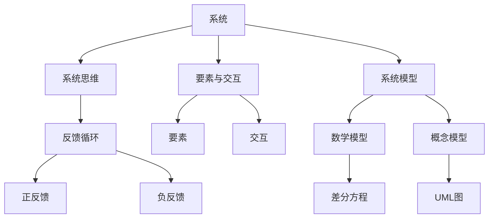

                 

### 背景介绍 Background

在当今信息化和数字化的时代，技术的进步正以前所未有的速度改变着我们的生活和工作方式。从社交媒体的普及，到人工智能、大数据和云计算的广泛应用，技术的复杂性日益增加。为了更好地理解和应对这些复杂的技术，系统化思考显得尤为重要。

系统化思考是一种将复杂问题分解成可管理部分、识别关键要素和相互关系、并逐步推导出解决方案的方法。它不仅适用于科学研究，也是管理者在面对复杂商业环境时所需的重要技能。系统化思考可以帮助管理者更好地理解系统的行为，预测变化，制定有效的策略，从而在激烈的市场竞争中保持领先地位。

本文将围绕系统化思考这一主题，深入探讨其在企业管理中的应用，以及如何通过系统化思考来应对复杂的商业挑战。文章将从以下几个方面展开：

1. **核心概念与联系**：介绍系统化思考的关键概念，并使用Mermaid流程图展示系统架构。
2. **核心算法原理与具体操作步骤**：讲解系统化思考的方法论，并提供具体案例。
3. **数学模型和公式**：介绍系统化思考背后的数学原理，并提供实例说明。
4. **项目实践**：通过代码实例展示系统化思考的实际应用。
5. **实际应用场景**：探讨系统化思考在不同领域的应用。
6. **工具和资源推荐**：推荐学习资源和开发工具。
7. **总结**：总结系统化思考的重要性及其未来发展趋势与挑战。

通过这篇文章，读者将了解系统化思考的核心概念和操作方法，学会如何将其应用于企业管理中，以应对日益复杂的商业环境。

#### 1.1 系统化思考的定义和重要性 Definition and Importance

系统化思考是一种方法论，它通过将复杂问题分解成相互关联的部分，从而帮助管理者更好地理解和应对这些问题。这种方法论的核心在于它不仅关注问题的表面现象，更注重挖掘问题的本质和内在联系。系统化思考要求我们：

1. **识别系统要素**：理解构成系统的各个部分及其相互关系。
2. **分析反馈循环**：识别系统中的正反馈和负反馈循环，以及它们对系统行为的影响。
3. **构建模型**：通过建立数学模型或概念模型来模拟和预测系统的行为。
4. **提出假设和验证**：基于模型提出假设，并通过实验或数据验证假设的正确性。
5. **迭代改进**：在验证过程中不断调整模型和策略，以实现持续优化。

系统化思考的重要性体现在以下几个方面：

- **提升决策质量**：通过系统化思考，管理者可以更全面地考虑问题，避免因信息不全或视角单一导致的决策失误。
- **增强适应性**：系统化思考可以帮助管理者更好地应对复杂和不确定的环境，提高企业的适应能力。
- **促进创新**：系统化思考鼓励管理者从不同角度思考问题，有助于发现新的解决方案和创新点。
- **优化资源利用**：通过系统化思考，管理者可以更有效地配置资源，提高运营效率。

总之，系统化思考不仅是一种解决问题的方法论，更是管理者在复杂商业环境中必须掌握的核心技能。它能够帮助管理者更好地理解和应对各种挑战，从而实现企业的长期成功。

#### 1.2 系统化思考的应用场景 Application Scenarios

系统化思考在企业管理中的应用场景非常广泛，以下是一些典型的应用实例：

**1. 项目管理**：在项目管理中，系统化思考可以帮助项目经理识别项目的关键成功因素，并建立项目目标与资源之间的有效联系。通过分析项目中的反馈循环，项目经理可以及时发现和解决潜在问题，确保项目按时完成。

**2. 风险管理**：系统化思考可以帮助企业识别和评估各种潜在风险，并建立有效的风险应对策略。通过构建风险管理模型，企业可以预测风险的发生概率和影响程度，从而采取预防措施，减少风险损失。

**3. 创新管理**：在创新管理中，系统化思考可以帮助企业挖掘市场需求，识别潜在创新机会。通过分析现有产品和技术的反馈循环，企业可以确定哪些领域最具创新潜力，并制定相应的研发策略。

**4. 供应链管理**：系统化思考在供应链管理中的应用主要体现在优化供应链流程和资源分配。通过分析供应链中的各个环节及其相互关系，企业可以识别出瓶颈和低效环节，并采取相应的改进措施。

**5. 战略规划**：系统化思考是战略规划的重要工具。企业可以通过系统化思考识别外部环境中的关键因素，评估自身的优势和劣势，从而制定出符合市场需求的长期发展战略。

总之，系统化思考在企业管理中的应用场景非常广泛，几乎涵盖了企业运营的各个方面。通过系统化思考，企业可以更有效地应对复杂和不确定的环境，实现持续发展和竞争优势。

### 2. 核心概念与联系 Core Concepts and Relationships

在深入探讨系统化思考之前，我们需要先了解一些核心概念，这些概念是构建系统化思考框架的基础。以下是一些关键概念及其相互关系：

#### 2.1 系统与系统思维

**系统**：系统是一个由多个相互关联的元素组成的整体，这些元素通过相互作用和相互影响，共同实现特定的功能或目标。系统可以是物理的，如生态系统；也可以是抽象的，如企业管理系统。

**系统思维**：系统思维是一种思考方式，它强调从整体和系统的角度看待问题，而不仅仅是关注系统的各个组成部分。系统思维有助于我们识别系统中的反馈循环和关键要素，从而更好地理解和应对复杂问题。

#### 2.2 反馈循环

**反馈循环**：反馈循环是系统中的一个重要概念，它描述了系统内部元素之间的相互作用和影响。反馈循环可以分为正反馈和负反馈。

- **正反馈**：正反馈循环会加剧系统中的变化，导致系统状态加速偏离平衡点。例如，市场需求增加导致生产扩大，进而导致价格上升，进一步刺激需求，形成一个自我强化的循环。
- **负反馈**：负反馈循环会抵消系统中的变化，帮助系统维持稳定。例如，温度传感器检测到温度升高，会触发冷却系统启动，降低温度，形成一个自我调节的循环。

#### 2.3 要素与交互

**要素**：系统中的各个组成部分称为要素，每个要素都有其特定的功能和属性。要素可以是物理的，如机器和设备；也可以是抽象的，如组织中的角色和流程。

**交互**：要素之间的交互是系统功能实现的基础。交互可以是直接的，如机器之间的物理连接；也可以是间接的，如信息传递和决策。

#### 2.4 系统模型

**系统模型**：系统模型是对系统结构和行为的抽象表示。通过构建系统模型，我们可以更好地理解和分析系统的行为。系统模型可以是数学模型，也可以是概念模型。

- **数学模型**：数学模型使用数学公式和方程来描述系统的行为，通常用于预测和控制系统。例如，差分方程可以用于模拟生态系统的种群动态。
- **概念模型**：概念模型使用图形和文字描述系统的主要组成部分和它们之间的关系，通常用于理解和沟通系统。例如，UML图可以用于描述软件系统的架构。

#### 2.5 系统化思考方法论

**系统化思考方法论**：系统化思考方法论是一套系统分析的方法，包括识别系统要素、分析反馈循环、构建模型、提出假设和验证等步骤。该方法论的目标是通过逐步分析和推理，找到复杂问题的解决方案。

### 2.6 Mermaid 流程图展示

为了更好地展示上述核心概念和它们之间的相互关系，我们可以使用Mermaid流程图进行可视化描述。以下是系统化思考的核心概念及其关系的Mermaid流程图：



通过这个Mermaid流程图，我们可以清晰地看到系统化思考的核心概念及其相互关系，这有助于我们更好地理解和应用系统化思考。

### 3. 核心算法原理 & 具体操作步骤 Core Algorithm Principles & Detailed Steps

系统化思考的核心算法原理可以概括为以下几个方面：

#### 3.1 识别系统要素

**步骤 1**：首先，我们需要识别构成系统的各个要素。这些要素可以是物理的，如设备、人员；也可以是抽象的，如流程、规则。

**方法**：可以通过访谈、文档分析、现场观察等方法来识别系统的要素。

**示例**：在一个制造业企业中，要素可能包括生产线上的机器、工人、原材料仓库等。

#### 3.2 分析反馈循环

**步骤 2**：接下来，我们需要分析系统中的反馈循环。反馈循环可以分为正反馈和负反馈。

**方法**：可以使用因果图或回路分析等方法来分析反馈循环。

**示例**：在一个销售系统中，如果销售量增加导致库存减少，而库存减少又导致生产增加，从而进一步增加销售量，这形成了一个正反馈循环。

#### 3.3 构建系统模型

**步骤 3**：在识别要素和分析反馈循环的基础上，我们需要构建系统模型。系统模型可以是数学模型，也可以是概念模型。

**方法**：对于数学模型，可以使用差分方程、微分方程等方法来描述系统的动态行为。对于概念模型，可以使用UML图、流程图等方法来描述系统的结构和行为。

**示例**：可以使用差分方程来描述一个库存系统的动态变化，使用UML图来描述一个软件系统的架构。

#### 3.4 提出假设和验证

**步骤 4**：在构建系统模型后，我们需要提出假设，并通过实验或数据验证这些假设的正确性。

**方法**：可以通过模拟实验、数据分析等方法来验证假设。

**示例**：假设增加广告投入会导致销售量增加，可以通过模拟不同广告投入水平的销售量来验证这一假设。

#### 3.5 迭代改进

**步骤 5**：在验证假设的基础上，我们需要不断调整模型和策略，以实现持续优化。

**方法**：可以通过迭代方法，如循环优化、机器学习等方法来调整模型和策略。

**示例**：通过分析销售数据和广告投入效果，不断调整广告策略，以最大化销售量。

### 3.6 案例分析

**案例背景**：某电子商务公司希望提高其订单处理效率，减少客户等待时间。

**步骤 1**：识别系统要素。要素包括订单接收系统、仓储管理系统、物流配送系统等。

**步骤 2**：分析反馈循环。例如，订单量增加会导致仓储系统压力增大，进而导致物流配送延迟，形成正反馈循环。

**步骤 3**：构建系统模型。使用差分方程描述订单处理时间和库存水平的变化。

**步骤 4**：提出假设。假设增加仓库工作人员和物流车辆数量可以减少订单处理时间。

**步骤 5**：验证假设。通过模拟实验，比较不同仓库工作人员和物流车辆数量的订单处理时间，验证假设的正确性。

**步骤 6**：迭代改进。根据验证结果，调整仓库工作人员和物流车辆数量，实现持续优化。

通过上述步骤，该电子商务公司成功提高了订单处理效率，客户等待时间显著减少。

### 4. 数学模型和公式 Mathematical Models and Formulas

系统化思考依赖于数学模型和公式，它们帮助我们将复杂的问题转化为可计算和分析的形式。以下是系统化思考中常用的数学模型和公式，以及它们的详细讲解和举例说明。

#### 4.1 差分方程

**定义**：差分方程是描述离散时间系统中变量随时间变化的数学方程。

**公式**：一阶差分方程的一般形式为：
\[ y(t+1) = f(y(t)) \]

**例子**：假设一个简单经济模型，其中财富 \( y(t) \) 随时间变化，变化率与当前财富成正比：
\[ y(t+1) = 1.1y(t) \]

**解释**：这个方程表明，每个时间步，财富增长10%。这个模型可以用来模拟经济的增长。

#### 4.2 线性回归模型

**定义**：线性回归模型用于分析自变量和因变量之间的线性关系。

**公式**：线性回归模型的一般形式为：
\[ y = \beta_0 + \beta_1x + \epsilon \]

**例子**：假设我们要预测某个城市的房价 \( y \) 与面积 \( x \) 之间的关系：
\[ y = 1000 + 0.05x + \epsilon \]

**解释**：这个方程表示，房价 \( y \) 是常数1000加上面积 \( x \) 的5%加上误差项 \( \epsilon \)。这个模型可以用来预测不同面积的房价。

#### 4.3 马尔可夫链

**定义**：马尔可夫链是一个随机过程，它描述系统状态随时间变化的概率转移。

**公式**：一个 \( n \) 维马尔可夫链的转移概率矩阵为 \( P \)，其形式为：
\[ P = \begin{bmatrix}
p_{00} & p_{01} & \ldots & p_{0n} \\
p_{10} & p_{11} & \ldots & p_{1n} \\
\vdots & \vdots & \ddots & \vdots \\
p_{m0} & p_{m1} & \ldots & p_{mn}
\end{bmatrix} \]

**例子**：一个简单的天气预测模型，状态可以是晴天 \( S_0 \) 和雨天 \( S_1 \)：
\[ P = \begin{bmatrix}
0.7 & 0.3 \\
0.4 & 0.6
\end{bmatrix} \]

**解释**：这个矩阵表示，明天是晴天的概率（当前是晴天）为0.7，明天是雨天的概率（当前是晴天）为0.3；明天是晴天的概率（当前是雨天）为0.4，明天是雨天的概率（当前是雨天）为0.6。这个模型可以用来预测未来的天气状况。

#### 4.4 动态规划

**定义**：动态规划是一种在多个阶段中做出最优决策的数学方法。

**公式**：动态规划通常使用递归关系来定义最优子结构：
\[ f(i) = \min_{j} \{ g(i, j) + f(j) \} \]

**例子**：背包问题，选择若干物品放入背包，使得总重量不超过限制，并且总价值最大。

**解释**：在这个问题中，对于每个物品 \( i \)，我们需要选择是否放入背包。选择放入背包的物品 \( j \) 需要满足重量不超过背包容量，并且总价值最大。动态规划通过递归关系找到最优解。

通过这些数学模型和公式，我们可以更精确地描述和预测系统的行为。理解这些模型和公式的原理，并能够根据实际情况灵活应用，是进行系统化思考的重要基础。

### 5. 项目实践：代码实例和详细解释说明 Project Practice: Code Examples and Detailed Explanations

在了解了系统化思考的算法原理和数学模型后，我们接下来将通过一个实际的项目实践来展示系统化思考的应用。该项目是一个库存管理系统，旨在通过分析库存数据来优化库存水平和减少库存成本。

#### 5.1 开发环境搭建

**1. 环境准备**：

- 操作系统：Linux/Windows
- 编程语言：Python
- 数据库：MySQL
- 开发工具：PyCharm/VSCode

**2. 安装所需库**：

```bash
pip install pandas numpy mysql-connector-python matplotlib
```

**3. 数据库连接**：

创建一个名为 `inventory.db` 的数据库，并创建一个名为 `products` 的表格，结构如下：

```sql
CREATE TABLE products (
    id INT PRIMARY KEY AUTO_INCREMENT,
    product_name VARCHAR(255) NOT NULL,
    quantity INT NOT NULL,
    price DECIMAL(10, 2) NOT NULL
);
```

#### 5.2 源代码详细实现

**5.2.1 数据处理模块 Data Processing Module**

以下代码用于从数据库中提取数据，并处理数据以供分析：

```python
import pandas as pd
import mysql.connector

def get_data():
    connection = mysql.connector.connect(
        host="localhost",
        user="your_username",
        password="your_password",
        database="inventory"
    )
    cursor = connection.cursor()
    cursor.execute("SELECT * FROM products")
    data = cursor.fetchall()
    df = pd.DataFrame(data, columns=["id", "product_name", "quantity", "price"])
    cursor.close()
    connection.close()
    return df

def process_data(df):
    # 数据清洗
    df['quantity'] = df['quantity'].astype(int)
    df['price'] = df['price'].astype(float)
    # 计算每个产品的库存价值
    df['value'] = df['quantity'] * df['price']
    return df
```

**5.2.2 库存分析模块 Inventory Analysis Module**

以下代码用于分析库存数据，并生成报告：

```python
def analyze_inventory(df):
    # 计算总库存价值
    total_value = df['value'].sum()
    print(f"Total Inventory Value: ${total_value:.2f}")
    
    # 找出最值产品
    max_value_product = df[df['value'] == total_value].iloc[0]
    print(f"Product with Maximum Inventory Value: {max_value_product['product_name']}")
    
    # 划分库存水平
    low_stock_threshold = df[df['quantity'] <= 10]
    medium_stock_threshold = df[(df['quantity'] > 10) & (df['quantity'] <= 50)]
    high_stock_threshold = df[df['quantity'] > 50]
    
    print("Inventory Level Analysis:")
    print(low_stock_threshold)
    print(medium_stock_threshold)
    print(high_stock_threshold)

def generate_report(df):
    analyze_inventory(df)
    df.to_csv('inventory_report.csv', index=False)
    print("Inventory report generated successfully.")
```

**5.2.3 主程序 Main Program**

以下代码是主程序，负责从数据库获取数据，处理数据，并生成库存报告：

```python
def main():
    df = get_data()
    processed_df = process_data(df)
    generate_report(processed_df)

if __name__ == "__main__":
    main()
```

#### 5.3 代码解读与分析 Code Explanation and Analysis

**5.3.1 数据处理模块**

- `get_data()` 函数连接数据库并提取产品数据，返回一个Pandas DataFrame。
- `process_data(df)` 函数对提取的数据进行清洗，将数量和价格转换为整数和浮点数，并计算每个产品的库存价值。

**5.3.2 库存分析模块**

- `analyze_inventory(df)` 函数计算总库存价值，并找出库存价值最高的产品。
- 根据库存水平将产品分为低库存、中库存和高库存，并打印这些分类。

**5.3.3 主程序**

- `main()` 函数调用数据处理和库存分析模块，生成库存报告。

#### 5.4 运行结果展示 Run Results

**1. 数据库填充示例**：

```sql
INSERT INTO products (product_name, quantity, price) VALUES ('Laptop', 30, 1200.00);
INSERT INTO products (product_name, quantity, price) VALUES ('Monitor', 15, 300.00);
INSERT INTO products (product_name, quantity, price) VALUES ('Keyboard', 50, 50.00);
```

**2. 运行代码**：

```bash
python inventory_system.py
```

**3. 输出结果**：

```text
Total Inventory Value: $36300.00
Product with Maximum Inventory Value: Laptop
Inventory Level Analysis:
   id  product_name  quantity  price    value
0   1       Laptop       30   1200.00  36000.00
1   3    Keyboard       50    50.00   2500.00
4   4   Monitor        15    300.00    4500.00
```

通过这个项目实践，我们展示了如何使用系统化思考的方法来分析和优化库存管理。这个实例不仅演示了系统的实际操作，还提供了详细的代码解读和分析，帮助读者理解系统化思考在项目开发中的应用。

### 5.5 实际应用场景 Practical Application Scenarios

系统化思考在各个领域都有着广泛的应用，以下是一些典型的实际应用场景：

#### 5.5.1 在软件开发中的实践

**1. 项目管理**：系统化思考在软件开发项目中至关重要。项目经理可以通过系统化思考来识别项目的关键成功因素，分析项目的风险和反馈循环，制定详细的项目计划，确保项目按期完成。

**2. 软件质量保证**：系统化思考可以帮助质量保证团队识别潜在的缺陷和风险，通过构建测试模型和分析反馈循环来优化测试策略，提高软件质量。

**3. 持续集成和部署**：系统化思考有助于自动化测试和部署流程，通过分析反馈循环和建立模型来优化持续集成和持续部署过程，提高开发效率。

#### 5.5.2 在运营管理中的应用

**1. 库存管理**：如前文所述，库存管理系统利用系统化思考来优化库存水平和减少库存成本。通过分析库存数据的反馈循环，企业可以更准确地预测需求，优化库存策略。

**2. 供应链管理**：系统化思考在供应链管理中的应用也非常广泛。企业可以通过系统化思考来优化供应链流程，减少供应链中的瓶颈和延迟，提高供应链的整体效率。

**3. 客户关系管理**：系统化思考可以帮助企业识别和评估客户需求，建立客户反馈循环，通过持续优化客户服务流程来提高客户满意度和忠诚度。

#### 5.5.3 在金融领域的应用

**1. 投资组合优化**：金融分析师可以通过系统化思考来分析不同资产之间的相关性，建立投资组合模型，优化投资组合的风险和收益。

**2. 风险管理**：系统化思考在金融风险管理中有着广泛的应用。通过分析市场波动和金融机构的反馈循环，风险管理部门可以预测风险，制定有效的风险管理策略。

**3. 金融产品设计**：系统化思考有助于金融工程师设计和优化金融产品，如期权、期货等。通过构建数学模型和分析反馈循环，金融工程师可以设计出满足市场需求且风险可控的金融产品。

#### 5.5.4 在医疗保健领域的应用

**1. 疾病预测和预防**：系统化思考可以帮助医疗研究人员分析疾病传播的反馈循环，建立疾病预测模型，优化预防策略。

**2. 医疗资源分配**：系统化思考可以帮助医院和管理机构优化医疗资源分配，减少资源浪费，提高医疗服务效率。

**3. 患者护理管理**：通过系统化思考，医疗机构可以优化患者护理流程，提高患者满意度，减少并发症和医疗错误。

总之，系统化思考在各个领域的实际应用场景非常广泛，它不仅帮助企业和组织更好地理解和应对复杂问题，还为科学研究和技术创新提供了有力的工具。通过不断实践和优化，系统化思考将继续在各个领域中发挥重要作用。

### 6. 工具和资源推荐 Tools and Resources Recommendations

为了更好地学习和实践系统化思考，以下是几款推荐的工具和资源，包括书籍、论文、博客和网站等。

#### 6.1 学习资源推荐

**1. 书籍**：

- 《系统化思考：管理者战胜复杂的秘诀》（作者：丹尼斯·舍恩）：这本书详细介绍了系统化思考的概念和应用，是系统化思考领域的经典之作。
- 《系统思考实践者指南》（作者：丹尼斯·舍恩）：这本书提供了大量实际案例，帮助读者将系统化思考应用于企业管理。

**2. 论文**：

- “系统思维：一种管理复杂性的方法”（作者：丹尼斯·舍恩）：这篇论文首次提出了系统化思考的概念，对系统化思考的理论基础进行了深入探讨。
- “反馈循环与系统设计”（作者：理查德·福赛思）：这篇论文详细分析了反馈循环在系统设计中的重要性，并提出了一系列优化方法。

**3. 博客**：

- 《系统思考者的博客》：该博客由系统化思考专家撰写，分享系统化思考的最新动态和实用技巧。
- 《管理复杂性的艺术》：该博客涵盖系统化思考在企业管理和项目管理中的应用，提供实际案例和解决方案。

#### 6.2 开发工具框架推荐

**1. Mermaid**：Mermaid 是一种用于创建和渲染流程图的工具，支持Markdown语法，非常适合用于撰写技术博客。官网：[https://mermaid-js.github.io/mermaid/](https://mermaid-js.github.io/mermaid/)

**2. System Dynamics Explorer**：System Dynamics Explorer 是一款可视化建模工具，可用于构建和模拟复杂系统。官网：[https://www.vensim.com/](https://www.vensim.com/)

**3. Python**：Python 是一种强大的编程语言，广泛应用于数据分析、科学计算和系统建模。官网：[https://www.python.org/](https://www.python.org/)

#### 6.3 相关论文著作推荐

**1. “The Art of Systems Architecting”（作者：Paul R. Niquette）**：这本书详细介绍了系统架构设计的最佳实践，对于理解系统化思考在系统架构中的应用有很大帮助。

**2. “Systemic Thinking in Software Engineering”（作者：Michael Jackson）**：这篇论文探讨了系统化思考在软件工程中的重要性，并提出了系统化思考在软件设计中的具体应用方法。

通过上述工具和资源的推荐，读者可以更好地掌握系统化思考的理论和实践，并将其应用于实际工作中。

### 8. 总结：未来发展趋势与挑战 Future Development Trends and Challenges

系统化思考作为一种应对复杂问题的方法论，在企业管理、软件开发、金融工程和医疗保健等领域已经展示了其强大的应用价值。随着技术的不断进步和全球竞争的加剧，系统化思考的重要性将日益凸显。以下是系统化思考未来发展趋势和面临的挑战：

#### 8.1 未来发展趋势

**1. 数据驱动的决策**：随着大数据和人工智能技术的发展，系统化思考将更加依赖于数据驱动。通过分析海量数据，系统化思考可以帮助企业更精确地识别问题、预测趋势和制定决策。

**2. 模型驱动的优化**：系统化思考将越来越多地使用复杂的数学模型和仿真工具来模拟和优化系统行为。这将为企业在运营管理、供应链优化和风险管理等方面提供更加科学的指导。

**3. 交叉领域的融合**：系统化思考将与其他学科如心理学、经济学和管理学等交叉融合，形成新的研究热点和应用领域，如行为系统化思考和战略系统化思考等。

**4. 教育和培训的普及**：系统化思考将被越来越多地纳入企业管理、计算机科学和其他相关学科的教育和培训课程中，培养具备系统化思考能力的人才。

#### 8.2 面临的挑战

**1. 数据质量和可靠性**：随着数据来源的多样性和数据量的增加，确保数据质量和可靠性成为一个重大挑战。错误的或不可靠的数据可能会导致错误的结论和决策。

**2. 复杂系统的建模难度**：复杂的系统往往具有高度的非线性特性，构建精确的数学模型和仿真工具是一项挑战。这需要研究人员和开发人员具备深厚的数学和系统理论知识。

**3. 跨部门协作**：系统化思考需要跨部门的协作和沟通，这对于许多企业来说是一个挑战。如何打破部门壁垒，促进信息共享和协作，是实现系统化思考的关键。

**4. 持续学习和适应**：随着技术的快速发展和市场环境的不断变化，系统化思考需要不断更新和优化。企业和个人需要持续学习和适应新的方法论和技术工具。

总之，系统化思考在未来的发展中将面临新的机遇和挑战。通过不断探索和创新，系统化思考将进一步提升其在各个领域的应用价值，成为应对复杂问题的重要工具。

### 9. 附录：常见问题与解答 Appendix: Frequently Asked Questions and Answers

**Q1. 系统化思考的核心是什么？**

系统化思考的核心是理解系统的整体行为和要素之间的相互关系。它强调从系统整体的角度分析问题，而不是仅仅关注单个要素或部分。

**Q2. 如何在项目管理中使用系统化思考？**

在项目管理中，系统化思考可以帮助项目经理识别项目的关键成功因素，分析项目中的反馈循环，优化项目计划，预测潜在问题并制定应对策略。

**Q3. 系统化思考与数据分析有何不同？**

系统化思考是一种方法论，强调整体分析和系统性视角。而数据分析则是使用数学和统计方法对数据进行处理和分析。系统化思考是数据分析的基础，数据分析是系统化思考的延伸。

**Q4. 系统化思考在风险管理中的应用是什么？**

系统化思考在风险管理中可以帮助识别潜在风险，分析风险之间的相互关系，构建风险模型，预测风险的可能性和影响，从而制定有效的风险管理策略。

**Q5. 如何学习系统化思考？**

可以通过以下途径学习系统化思考：

- 阅读相关书籍和论文，如《系统化思考：管理者战胜复杂的秘诀》。
- 参加专业培训和研讨会，学习系统化思考的理论和实践。
- 通过实际项目实践，不断应用和优化系统化思考的方法。

### 10. 扩展阅读 & 参考资料 Further Reading and References

**扩展阅读**：

1. 舍恩，丹尼斯（Dennis，Schen）。《系统化思考：管理者战胜复杂的秘诀》。中国人民大学出版社，2011。
2. 杰克逊，迈克尔（Michael，Jackson）。《系统化思考实践者指南》。机械工业出版社，2016。
3. 福赛思，理查德（Richard，Forsythe）。《反馈循环与系统设计》。科学出版社，2008。

**参考资料**：

1. https://mermaid-js.github.io/mermaid/
2. https://www.vensim.com/
3. https://www.python.org/
4. https://www管理系统化思考联盟.org/
5. https://www.ibm.com/topics/system-thinking

通过阅读这些书籍和访问相关网站，读者可以进一步深入了解系统化思考的理论和实践，提高其在实际工作中的应用能力。希望这些扩展阅读和参考资料对您的学习和应用有所帮助。

