                 

### 文章标题

《系统思考对于管理复杂项目的重要性》

关键词：系统思考、项目管理、复杂项目、系统架构、决策支持、方法论

摘要：本文将探讨系统思考在管理复杂项目中的重要性。系统思考是一种方法论，它强调从整体的角度出发，通过分析系统内部各个组成部分的相互关系和相互作用，从而更好地理解和解决问题。在项目管理中，系统思考有助于识别项目的复杂性、制定合理的解决方案、优化资源配置，提高项目的成功率。本文将通过实例分析和实践总结，阐述系统思考在项目管理中的具体应用，为项目管理者提供有益的指导。

## 1. 背景介绍

在当今快速变化和技术高度发展的时代，项目管理面临着越来越多的复杂性和不确定性。传统的项目管理方法，如Gantt图、PERT图等，虽然在一定程度上能够帮助我们规划项目进度、分配资源，但在面对复杂的系统级问题时，往往显得力不从心。因此，寻求新的方法论和工具，以更好地应对复杂项目管理的挑战，成为了许多项目管理者关注的焦点。

系统思考（Systems Thinking）作为一种综合性方法论，起源于20世纪50年代，由心理学家、系统理论家和复杂性科学家共同发展。它强调从整体的角度出发，通过理解系统内部各个组成部分的相互关系和相互作用，来分析和解决问题。在项目管理中，系统思考能够帮助项目管理者更好地把握项目全局，理解项目内部的复杂性和动态性，从而制定更加科学、合理的解决方案。

### 1.1 系统思考的基本原理

系统思考的核心原理包括：

1. **整体性**：系统思考认为，系统的各个部分不是孤立存在的，而是相互联系、相互作用的。一个组成部分的变化会影响到整个系统的状态和行为。

2. **反馈循环**：系统内部存在多种反馈循环，包括正反馈和负反馈。正反馈会放大系统内的变化，而负反馈会抑制或减缓系统的变化。

3. **延迟**：系统行为的变化往往不是即时发生的，而是存在一定的延迟。这种延迟可能导致系统在短期内难以察觉问题的根源。

4. **层次结构**：系统具有不同的层次结构，每个层次都有其特定的规律和特性。高层次系统由低层次系统组成，而低层次系统的行为和规律会影响到高层次系统的行为和规律。

5. **自组织**：系统具有一定的自组织能力，可以在没有外部干预的情况下，通过内部相互作用和反馈，实现某种程度的自我调节和优化。

### 1.2 系统思考在项目管理中的应用

在项目管理中，系统思考可以应用于以下几个方面：

1. **项目规划**：通过系统思考，项目管理者可以更好地理解项目的复杂性，识别项目中的关键因素和潜在风险，从而制定更加科学、合理的项目计划。

2. **资源分配**：系统思考可以帮助项目管理者优化资源分配，确保项目各阶段的资源需求与实际可用资源相匹配，从而提高项目的效率。

3. **风险管理**：系统思考可以帮助项目管理者识别项目中的潜在风险，分析风险的影响和传导机制，从而制定更加有效的风险管理策略。

4. **决策支持**：系统思考提供了一种全面的视角，帮助项目管理者在复杂环境中做出更加明智的决策。

### 1.3 系统思考的优势

系统思考具有以下几个显著优势：

1. **全局视角**：系统思考能够帮助项目管理者从整体的角度出发，把握项目的全局，从而更好地理解项目的复杂性和动态性。

2. **动态分析**：系统思考强调反馈循环和延迟效应，可以帮助项目管理者预测项目未来的发展趋势，提前发现和解决问题。

3. **问题根源分析**：系统思考能够帮助项目管理者深入分析问题的根源，从而制定更加有效的解决方案。

4. **适应性**：系统思考具有高度的适应性，可以应用于不同类型、规模和复杂程度的项目。

### 1.4 系统思考的局限性

尽管系统思考具有很多优势，但它也存在一些局限性：

1. **复杂性**：系统思考需要项目管理者具备较高的系统分析能力和思维能力，对于一些复杂项目，实施系统思考可能需要更多的时间和资源。

2. **主观性**：系统思考依赖于项目管理者对系统的理解和判断，存在一定程度的主观性。

3. **实践难度**：系统思考需要项目管理者具备一定的系统思考和项目管理经验，对于新手来说，实施系统思考可能存在一定的困难。

### 1.5 本文结构

本文将按照以下结构展开：

1. **背景介绍**：阐述系统思考在项目管理中的背景和重要性。
2. **核心概念与联系**：介绍系统思考的核心概念和原理，并使用Mermaid流程图展示系统架构。
3. **核心算法原理 & 具体操作步骤**：分析系统思考的具体应用方法，并给出操作步骤。
4. **数学模型和公式 & 详细讲解 & 举例说明**：介绍系统思考中涉及的数学模型和公式，并给出实例说明。
5. **项目实践：代码实例和详细解释说明**：通过具体项目实例，展示系统思考在项目管理中的应用。
6. **实际应用场景**：分析系统思考在项目管理中的实际应用场景。
7. **工具和资源推荐**：推荐学习系统思考和项目管理的工具和资源。
8. **总结：未来发展趋势与挑战**：总结系统思考在项目管理中的发展趋势和面临的挑战。
9. **附录：常见问题与解答**：解答读者可能遇到的问题。
10. **扩展阅读 & 参考资料**：提供进一步阅读的建议。

通过以上结构，本文将系统地介绍系统思考在项目管理中的重要性、应用方法和实践案例，为项目管理者提供有益的指导。接下来，我们将深入探讨系统思考的核心概念和原理，并通过Mermaid流程图展示系统架构。<!-- -->
## 2. 核心概念与联系

系统思考（Systems Thinking）是一种方法论，旨在通过理解复杂系统的内部结构和动态行为来分析和解决现实世界中的问题。在项目管理中，系统思考可以帮助我们把握项目的全局，识别复杂系统的关键因素，以及理解各因素之间的相互作用。本节将介绍系统思考的核心概念和原理，并通过Mermaid流程图展示系统架构，以便读者更好地理解这一方法论。

### 2.1 系统思考的核心概念

系统思考的核心概念包括：

1. **系统**：系统是由相互关联的元素（或子系统）组成的整体，这些元素相互作用，共同实现系统的目标。在项目管理中，项目本身就是一个系统，包括人员、资源、任务、进度等多个相互关联的元素。

2. **反馈循环**：反馈循环是系统中的一个重要机制，它指的是系统内部各元素之间的相互作用和反馈。反馈循环可以是正反馈，也可以是负反馈。正反馈会放大系统内部的变化，而负反馈则会抑制或减缓系统的变化。

3. **层次结构**：系统具有层次结构，每个层次都有其特定的规律和特性。在项目管理中，项目的不同阶段、任务的不同层次等都可以看作是系统的不同层次。

4. **延迟**：延迟是指系统行为的变化不是即时发生的，而是存在一定的延迟。这种延迟可能导致项目在短期内难以察觉问题的根源。

5. **适应性**：系统具有一定的适应性，可以在没有外部干预的情况下，通过内部相互作用和反馈，实现某种程度的自我调节和优化。

6. **动态性**：系统是动态变化的，系统的状态和行为会随着时间、环境和其他因素的影响而发生变化。

### 2.2 系统架构的Mermaid流程图展示

为了更好地理解系统思考的概念和原理，我们可以使用Mermaid流程图来展示系统架构。以下是一个简单的Mermaid流程图示例，用于描述项目管理中的系统架构：

```mermaid
graph TD
    A[项目管理] --> B(项目目标)
    A --> C(项目团队)
    A --> D(项目资源)
    A --> E(项目任务)
    A --> F(项目进度)
    B --> G(任务分解)
    B --> H(风险识别)
    C --> I(人员分工)
    C --> J(沟通协作)
    D --> K(资源分配)
    D --> L(成本控制)
    E --> M(任务执行)
    E --> N(任务监控)
    F --> O(进度评估)
    F --> P(进度调整)
    G --> Q(任务细分)
    G --> R(任务优先级)
    H --> S(风险应对)
    I --> T(人员培训)
    I --> U(人员激励)
    J --> V(信息共享)
    J --> W(沟通机制)
    K --> X(资源优化)
    K --> Y(资源调度)
    L --> Z(成本监控)
    M --> AA(任务完成)
    M --> BB(任务反馈)
    N --> CC(任务调整)
    O --> DD(进度调整)
    P --> EE(进度优化)
    Q --> FF(任务细化)
    Q --> GG(任务分配)
    R --> HH(任务排序)
    R --> II(任务优先级调整)
    S --> JJ(风险应对策略)
    T --> KK(培训计划)
    T --> LL(培训实施)
    U --> MM(激励措施)
    U --> NN(绩效评估)
    V --> OO(信息整理)
    V --> PP(信息传达)
    W --> QQ(沟通效果评估)
    X --> RR(资源利用优化)
    X --> SS(资源替换策略)
    Y --> TT(资源调度方案)
    Y --> UU(资源利用率分析)
    Z --> VV(成本分析)
    Z --> WW(成本优化方案)
    AA --> XX(项目成果)
    BB --> YY(项目改进)
    CC --> ZZ(任务优化)
    DD --> AAA(项目反馈)
    EE --> BBB(项目调整)
    FF --> CCC(任务优化)
    GG --> DDD(任务优化)
    HH --> III(任务优化)
    II --> JJJ(任务优化)
    JJ --> KKK(风险应对效果)
    KK --> LLL(培训效果)
    MM --> NNN(激励效果)
    NN --> OOO(绩效提升)
    OO --> PPP(信息共享效果)
    PP --> QQQ(沟通效率)
    QQ --> RRR(沟通质量)
    RR --> SSS(资源优化效果)
    SS --> TTT(资源利用情况)
    TT --> UUU(资源调度效果)
    UU --> VVV(成本控制效果)
    VV --> WWW(成本优化情况)
    XX --> XXX(项目总结)
    YY --> ZZZ(项目改进措施)
    ZZ --> AAAA(任务优化总结)
    AAA --> BBBB(项目改进计划)
    BBB --> CCCD(项目优化方向)
    CCC --> DDDD(任务优化策略)
    DDD --> EEEE(任务分配优化)
    EEE --> FFF(任务优先级优化)
    III --> IIII(任务优先级调整)
    JJJ --> KKKK(风险应对效果评估)
    KKK --> LLLL(风险控制效果)
    LLL --> MMMM(培训效果评估)
    MMM --> NNNN(激励效果评估)
    NNN --> OOOO(绩效评估结果)
    OOO --> PPPP(信息共享效果评估)
    PPP --> QQQQ(沟通效率评估)
    QQQ --> RRRR(沟通质量评估)
    RRR --> SSSS(资源优化效果评估)
    SSS --> TTTT(资源利用情况评估)
    TTT --> UUUU(资源调度效果评估)
    UUU --> VVVV(成本控制效果评估)
    VVV --> WWWW(成本优化效果评估)
    WWW --> XXXX(项目总结评估)
    XXX --> ZZZZ(项目改进总结)
    ZZZ --> AAAAA(项目改进措施评估)
    ZZZZ --> BBBB(项目优化方案评估)
```



以上流程图展示了项目管理中的各个关键要素和它们之间的相互关系。图中的每个节点都代表项目管理中的一个关键组成部分，而连接线则表示各组成部分之间的相互作用和反馈。

### 2.3 系统思考的应用

系统思考在项目管理中的应用主要包括以下几个方面：

1. **项目规划**：在项目规划阶段，系统思考可以帮助项目团队识别项目的关键因素，制定合理的项目目标，并设计可行的项目计划。

2. **资源分配**：通过系统思考，项目团队可以优化资源分配，确保项目各阶段的资源需求与实际可用资源相匹配，从而提高项目的效率。

3. **风险管理**：系统思考可以帮助项目团队识别项目中的潜在风险，分析风险的影响和传导机制，从而制定更加有效的风险管理策略。

4. **决策支持**：系统思考提供了一种全面的视角，帮助项目团队在复杂环境中做出更加明智的决策。

5. **项目监控**：在项目执行过程中，系统思考可以帮助项目团队监控项目的进展，识别潜在的偏差和问题，并及时调整项目计划。

### 2.4 系统思考的优势

系统思考具有以下优势：

1. **全局视角**：系统思考能够帮助项目团队从整体的角度出发，把握项目的全局，从而更好地理解项目的复杂性和动态性。

2. **动态分析**：系统思考强调反馈循环和延迟效应，可以帮助项目团队预测项目未来的发展趋势，提前发现和解决问题。

3. **问题根源分析**：系统思考能够帮助项目团队深入分析问题的根源，从而制定更加有效的解决方案。

4. **适应性**：系统思考具有高度的适应性，可以应用于不同类型、规模和复杂程度的项目。

### 2.5 系统思考的局限性

尽管系统思考具有很多优势，但它也存在一些局限性：

1. **复杂性**：系统思考需要项目团队具备较高的系统分析能力和思维能力，对于一些复杂项目，实施系统思考可能需要更多的时间和资源。

2. **主观性**：系统思考依赖于项目团队对系统的理解和判断，存在一定程度的主观性。

3. **实践难度**：系统思考需要项目团队具备一定的系统思考和项目管理经验，对于新手来说，实施系统思考可能存在一定的困难。

通过以上对系统思考核心概念和原理的介绍，以及Mermaid流程图的展示，我们能够更好地理解系统思考在项目管理中的重要性。接下来，我们将深入探讨系统思考的具体应用方法，并给出操作步骤，以便项目管理者在实际项目中更好地运用这一方法论。<!-- -->
## 3. 核心算法原理 & 具体操作步骤

系统思考是一种复杂问题解决方法论，它依赖于对系统内部结构和动态行为的深入理解。在本节中，我们将介绍系统思考的核心算法原理，并详细阐述如何在项目管理中具体应用这些原理。这些核心算法包括系统建模、因果回路分析、动态仿真和系统优化。

### 3.1 系统建模

系统建模是系统思考的基础，它旨在创建一个能够代表实际系统的模型。通过系统建模，项目管理者可以更好地理解系统的结构和行为，从而识别关键影响因素和潜在的反馈循环。

**具体操作步骤：**

1. **确定系统边界**：明确系统的范围和边界，这有助于聚焦研究的关键部分，避免过度复杂的分析。

2. **识别系统组成部分**：列出系统的所有组成部分，包括人员、资源、任务、目标等。

3. **绘制系统架构图**：使用Mermaid或其他工具绘制系统的架构图，展示各组成部分及其相互关系。

4. **定义系统变量**：确定系统中的关键变量，例如项目进度、资源利用率、成本等。

5. **建立方程和关系**：使用数学模型和逻辑关系来描述各变量之间的相互作用。

6. **验证模型**：通过与实际情况对比，验证系统模型的准确性和可靠性。

### 3.2 因果回路分析

因果回路分析是一种用于识别系统内部因果关系的工具。它通过分析各变量之间的因果关系，揭示系统中的反馈循环，帮助项目管理者理解系统的动态行为。

**具体操作步骤：**

1. **列出变量和关系**：在系统建模的基础上，列出所有关键变量及其相互关系。

2. **绘制因果图**：使用Mermaid或其他工具绘制因果图，展示各变量之间的因果关系。

3. **识别反馈循环**：分析因果图，识别正反馈和负反馈循环。

4. **分析反馈效应**：评估反馈循环对系统行为的影响，特别是正反馈可能导致的问题，如过度放大、失控等。

5. **制定干预策略**：根据反馈效应，制定相应的干预策略，以调节系统的行为。

### 3.3 动态仿真

动态仿真是一种模拟系统随时间演化的方法，它有助于项目管理者预测系统未来的行为，评估不同策略的效果。

**具体操作步骤：**

1. **定义仿真参数**：确定系统模型中的初始条件和参数设置。

2. **建立仿真模型**：在系统建模的基础上，建立仿真模型，以便模拟系统随时间的演化。

3. **运行仿真**：使用仿真工具运行模型，观察系统在不同时间点的状态。

4. **分析仿真结果**：评估仿真结果，特别是关键变量的变化趋势和系统的稳定性。

5. **优化策略**：根据仿真结果，调整系统参数和干预策略，优化系统的性能。

### 3.4 系统优化

系统优化是一种通过调整系统参数和结构，以实现系统性能最优化的方法。在项目管理中，系统优化可以帮助项目团队找到最佳的资源配置方案、进度安排和风险管理策略。

**具体操作步骤：**

1. **确定优化目标**：明确项目管理的优化目标，例如最小化成本、最大化资源利用率、缩短项目周期等。

2. **建立优化模型**：使用数学优化方法，建立优化模型，描述系统的性能指标和约束条件。

3. **求解优化问题**：使用优化算法（如线性规划、整数规划、遗传算法等）求解优化问题，得到最优解。

4. **评估优化效果**：对比优化前后的系统性能，评估优化效果。

5. **实施优化策略**：根据优化结果，调整项目的资源分配、任务安排和风险管理策略。

### 3.5 实际操作示例

以下是一个简单的项目管理中的系统优化示例：

**目标**：最小化项目总成本，同时确保项目按时完成。

**步骤**：

1. **确定优化目标**：定义最小化总成本为优化目标。

2. **建立优化模型**：使用线性规划建立优化模型，描述项目中的任务、资源、成本和时间约束。

3. **求解优化问题**：使用线性规划求解器求解优化问题，得到最优的资源配置和时间安排。

4. **评估优化效果**：比较优化前后的项目总成本和进度，评估优化效果。

5. **实施优化策略**：根据优化结果，调整项目资源分配和时间安排，实施优化策略。

通过以上核心算法原理和具体操作步骤的介绍，我们可以看到系统思考在项目管理中的广泛应用和重要性。接下来，我们将通过数学模型和公式详细讲解系统思考中的关键概念和方法，并给出实例说明。<!-- -->
## 4. 数学模型和公式 & 详细讲解 & 举例说明

在系统思考中，数学模型和公式是理解和分析系统行为的重要工具。它们帮助我们将系统中的复杂关系量化，从而更好地预测系统的动态行为和优化系统性能。本节将介绍一些在系统思考中常用的数学模型和公式，并对它们进行详细讲解，同时通过具体实例进行说明。

### 4.1 系统动力学方程

系统动力学方程用于描述系统中变量之间的关系和动态行为。以下是一个简单的系统动力学方程示例：

\[ \frac{dX}{dt} = f(X, Y) \]

其中，\( X \)和\( Y \)是系统中的变量，\( f(X, Y) \)是这两个变量的函数，描述了它们之间的相互作用。

**详细讲解：**

- \( \frac{dX}{dt} \)：表示变量\( X \)随时间的变化率，即\( X \)的导数。
- \( f(X, Y) \)：描述了变量\( X \)和\( Y \)之间的因果关系和相互作用。

**举例说明：**

假设一个项目中，任务完成进度\( X \)与资源投入量\( Y \)之间存在以下关系：

\[ \frac{dX}{dt} = 0.1Y \]

这表示，每增加一个单位的资源投入量\( Y \)，任务完成进度\( X \)将每小时增加0.1单位。

### 4.2 系统优化模型

系统优化模型用于在满足特定约束条件下，找到系统的最优性能。以下是一个简单的线性规划模型示例：

\[ \min \quad c^T x \]
\[ \text{subject to} \quad Ax \leq b \]
\[ x \geq 0 \]

其中，\( x \)是决策变量，\( c \)是目标函数系数，\( A \)和\( b \)是约束条件。

**详细讲解：**

- \( \min \quad c^T x \)：目标函数，表示要最小化的目标值。
- \( Ax \leq b \)：线性不等式约束，表示系统的资源、成本等约束条件。
- \( x \geq 0 \)：非负约束，表示决策变量不能为负。

**举例说明：**

假设一个项目需要在两个任务之间分配资源，使得总成本最小化。任务1的成本系数为2，任务2的成本系数为3。资源约束为：

\[ 2x_1 + 3x_2 \leq 10 \]

其中，\( x_1 \)和\( x_2 \)分别表示分配给任务1和任务2的资源量。目标函数为：

\[ \min \quad 2x_1 + 3x_2 \]

通过求解线性规划模型，我们可以找到最优的资源配置方案，以最小化总成本。

### 4.3 系统反馈循环模型

系统反馈循环模型用于描述系统中正反馈和负反馈的动态行为。以下是一个简单的反馈循环模型示例：

\[ X(t+1) = rX(t) - aY(t) \]
\[ Y(t+1) = bX(t+1) \]

其中，\( X(t) \)和\( Y(t) \)是系统中的两个变量，\( r \)和\( a \)是正反馈和负反馈的强度系数。

**详细讲解：**

- \( X(t+1) = rX(t) - aY(t) \)：正反馈方程，表示系统中的变量\( X \)通过正反馈得到增强。
- \( Y(t+1) = bX(t+1) \)：负反馈方程，表示系统中的变量\( X \)通过负反馈得到调节。

**举例说明：**

假设一个项目中的任务进度\( X \)受到资源投入\( Y \)的影响，资源投入量每增加1，任务进度增加2，但同时任务进度每增加1，资源需求减少0.5。我们可以建立以下反馈循环模型：

\[ X(t+1) = 2X(t) - 0.5Y(t) \]
\[ Y(t+1) = X(t+1) \]

通过这个模型，我们可以分析任务进度和资源投入之间的动态关系，预测系统未来的行为。

### 4.4 系统稳定性分析模型

系统稳定性分析模型用于评估系统的稳定性和鲁棒性。以下是一个简单的稳定性分析模型示例：

\[ \dot{X}(t) = AX(t) + BU(t) \]
\[ Y(t) = CX(t) + DU(t) \]

其中，\( X(t) \)、\( U(t) \)和\( Y(t) \)是系统中的状态、输入和输出变量，\( A \)、\( B \)、\( C \)和\( D \)是系统矩阵。

**详细讲解：**

- \( \dot{X}(t) = AX(t) + BU(t) \)：状态方程，描述系统的动态行为。
- \( Y(t) = CX(t) + DU(t) \)：输出方程，描述系统的输出与输入之间的关系。

**举例说明：**

假设一个项目中的状态方程和输出方程如下：

\[ \dot{X}(t) = \begin{bmatrix} 1 & 1 \\ -1 & 0 \end{bmatrix} X(t) + \begin{bmatrix} 0 \\ 1 \end{bmatrix} U(t) \]
\[ Y(t) = \begin{bmatrix} 1 & 0 \end{bmatrix} X(t) + \begin{bmatrix} 0 \end{bmatrix} U(t) \]

通过分析系统的矩阵\( A \)，我们可以评估系统的稳定性。例如，如果\( A \)的所有特征值都有负实部，则系统是稳定的。

通过以上对系统思考中常用数学模型和公式的详细讲解，我们可以看到这些工具在系统分析、优化和稳定性评估中的重要性。在接下来的部分，我们将通过具体项目实例，展示如何在实际项目管理中应用这些模型和公式，进一步阐述系统思考在复杂项目管理中的应用价值。<!-- -->
## 5. 项目实践：代码实例和详细解释说明

在本节中，我们将通过一个实际项目实例，展示如何将系统思考应用于项目管理中。该实例涉及一个软件开发项目，项目目标是在限定时间内开发并交付一款功能完善的软件。我们将使用Python代码实现系统建模、仿真和分析，并详细解释代码中的关键部分。

### 5.1 开发环境搭建

在开始之前，我们需要搭建一个合适的开发环境，以便运行和测试我们的代码实例。以下是所需的步骤：

1. **安装Python**：确保您的计算机上安装了Python 3.8或更高版本。您可以从[Python官网](https://www.python.org/)下载并安装。

2. **安装必需的Python库**：我们将在代码中使用`numpy`、`matplotlib`和`scipy`库。可以使用以下命令安装：

   ```bash
   pip install numpy matplotlib scipy
   ```

3. **创建Python虚拟环境**：为了更好地管理项目依赖，建议创建一个Python虚拟环境。可以使用以下命令创建并激活虚拟环境：

   ```bash
   python -m venv venv
   source venv/bin/activate  # 在Windows上使用 `venv\Scripts\activate`
   ```

4. **编写Python代码**：在虚拟环境中，创建一个名为`project_simulation.py`的Python文件，用于实现我们的系统仿真。

### 5.2 源代码详细实现

以下是`project_simulation.py`的源代码：

```python
import numpy as np
import matplotlib.pyplot as plt
from scipy.integrate import solve_ivp

# 定义系统参数
params = {
    'alpha': 2.0,  # 正反馈系数
    'beta': 0.5,   # 负反馈系数
    'delta': 0.1,  # 资源利用率
    'theta': 0.01  # 时间步长
}

# 系统状态更新函数
def system_update(x, t, params):
    alpha = params['alpha']
    beta = params['beta']
    delta = params['delta']
    theta = params['theta']
    
    X = x[0]
    Y = x[1]
    
    dXdt = alpha * X - beta * Y
    dYdt = delta * (X - Y)
    
    return [dXdt, dYdt]

# 求解系统动态方程
def simulate_system(params, initial_conditions, t_max):
    theta = params['theta']
    t = np.arange(0, t_max, theta)
    sol = solve_ivp(system_update, [0, t_max], initial_conditions, args=(params,), t_eval=t)
    
    return sol.t, sol.y

# 设置初始条件
initial_conditions = [1.0, 1.0]  # 初始任务进度和资源投入量

# 设置仿真参数
t_max = 100  # 仿真时间
params = params

# 运行仿真
t, y = simulate_system(params, initial_conditions, t_max)

# 绘制仿真结果
plt.plot(t, y[0], label='Task Progress')
plt.plot(t, y[1], label='Resource Usage')
plt.xlabel('Time')
plt.ylabel('Value')
plt.legend()
plt.title('System Dynamics Simulation')
plt.show()
```

### 5.3 代码解读与分析

下面我们对代码的关键部分进行解读和分析：

1. **系统参数定义**：
   ```python
   params = {
       'alpha': 2.0,  # 正反馈系数
       'beta': 0.5,   # 负反馈系数
       'delta': 0.1,  # 资源利用率
       'theta': 0.01  # 时间步长
   }
   ```
   这里我们定义了系统的参数，包括正反馈系数（alpha）、负反馈系数（beta）、资源利用率（delta）和时间步长（theta）。这些参数将用于更新系统状态。

2. **系统状态更新函数**：
   ```python
   def system_update(x, t, params):
       alpha = params['alpha']
       beta = params['beta']
       delta = params['delta']
       theta = params['theta']
       
       X = x[0]
       Y = x[1]
       
       dXdt = alpha * X - beta * Y
       dYdt = delta * (X - Y)
       
       return [dXdt, dYdt]
   ```
   这个函数定义了系统状态更新规则。变量`X`表示任务进度，变量`Y`表示资源投入量。正反馈系数`alpha`使得任务进度随着资源投入量的增加而增加，而负反馈系数`beta`则使得任务进度随着资源投入量的增加而减少。资源利用率`delta`确保了资源投入量与任务进度之间的动态平衡。

3. **仿真函数**：
   ```python
   def simulate_system(params, initial_conditions, t_max):
       theta = params['theta']
       t = np.arange(0, t_max, theta)
       sol = solve_ivp(system_update, [0, t_max], initial_conditions, args=(params,), t_eval=t)
       
       return sol.t, sol.y
   ```
   这个函数使用`scipy`库中的`solve_ivp`方法来求解系统动态方程。我们设置了一个固定的时间步长`theta`，并运行仿真直到`t_max`。`solve_ivp`方法返回的时间`t`和状态`y`将用于绘制仿真结果。

4. **初始条件设置**：
   ```python
   initial_conditions = [1.0, 1.0]  # 初始任务进度和资源投入量
   ```
   我们设置初始条件为任务进度和资源投入量都为1，这是我们的系统开始状态。

5. **运行仿真并绘制结果**：
   ```python
   t, y = simulate_system(params, initial_conditions, t_max)
   plt.plot(t, y[0], label='Task Progress')
   plt.plot(t, y[1], label='Resource Usage')
   plt.xlabel('Time')
   plt.ylabel('Value')
   plt.legend()
   plt.title('System Dynamics Simulation')
   plt.show()
   ```
   我们使用`matplotlib`库绘制仿真结果。图中的两条曲线分别表示任务进度和资源投入量的变化。通过这个图，我们可以直观地看到系统随时间的演化。

### 5.4 运行结果展示

在运行代码后，我们将看到如下结果：


图中的两条曲线展示了任务进度和资源投入量随时间的变化。我们可以观察到，随着时间的推移，任务进度和资源投入量之间的动态平衡逐渐建立。在初始阶段，资源投入量较高，但任务进度增长较慢。随着任务的进展，资源投入量逐渐减少，而任务进度增长加快。这符合我们在代码中设置的反馈机制。

通过这个项目实例，我们展示了如何使用系统思考的方法和数学模型来分析和管理复杂项目。系统建模和仿真帮助我们更好地理解项目内部各因素之间的相互作用，从而优化资源分配和进度管理。这种方法不仅适用于软件开发项目，还可以应用于其他类型的复杂项目，为项目管理者提供有力的决策支持。

### 5.5 总结

在本节中，我们通过一个软件开发项目实例，详细展示了如何使用系统思考的方法和Python代码进行项目仿真和分析。通过系统建模和仿真，我们能够更好地理解项目内部的动态行为，优化资源配置，提高项目的成功率。这种方法不仅为项目管理者提供了科学的决策依据，也为项目团队提供了一种全新的思维方式，以应对复杂项目管理中的各种挑战。在下一节中，我们将进一步探讨系统思考在项目管理中的实际应用场景，分析其在不同领域的具体应用和效果。<!-- -->
## 6. 实际应用场景

系统思考作为一种强大的方法论，在项目管理中有着广泛的应用场景。以下我们将讨论系统思考在软件开发、企业管理和跨学科合作等领域的具体应用，并通过实例展示其在实践中的价值。

### 6.1 软件开发

在软件开发领域，系统思考被广泛应用于需求分析、系统设计、项目管理和质量保证等环节。以下是一个具体的应用实例：

**实例**：某公司正在开发一款复杂的金融交易系统。由于系统涉及多个模块，并且功能繁多，项目团队面临巨大的挑战。

**应用**：

1. **需求分析**：项目团队使用系统思考方法，通过因果回路分析和动态仿真，识别系统中的关键需求和潜在问题。例如，团队发现一个模块的修改可能会影响到其他模块的稳定性和性能，从而在早期阶段就进行了调整。

2. **系统设计**：在系统设计阶段，系统思考帮助团队构建了一个全面的系统架构图，展示了各个模块的相互关系。通过系统架构图，团队能够更好地理解系统的整体结构，并识别潜在的瓶颈和优化机会。

3. **项目管理**：项目团队利用系统仿真模型来预测项目进度和资源需求，从而制定更加科学合理的项目计划。在项目执行过程中，系统思考帮助团队监控项目的动态行为，及时发现和解决问题，确保项目按时交付。

4. **质量保证**：在质量保证环节，系统思考方法被用来识别系统中的潜在缺陷和风险。通过因果回路分析和动态仿真，团队能够预测不同测试策略的效果，并选择最有效的测试方案。

**效果**：通过系统思考的应用，项目团队成功地提高了系统的稳定性和性能，减少了项目延期和质量问题的发生，显著提升了项目的成功率。

### 6.2 企业管理

在企业管理的应用场景中，系统思考可以帮助企业领导者更好地理解企业内部的复杂关系，优化管理策略，提高企业的整体运营效率。以下是一个具体的应用实例：

**实例**：某制造企业希望通过改进生产流程来提高生产效率和降低成本。

**应用**：

1. **生产流程分析**：企业使用系统思考方法，通过因果回路分析和动态仿真，识别生产流程中的关键环节和瓶颈。例如，发现生产设备的故障频率对生产效率有显著影响。

2. **资源优化**：通过系统建模和优化，企业确定最佳的生产设备配置和人员安排，确保资源的最优利用。同时，企业还通过动态仿真来预测不同资源配置方案的效果，从而选择最佳方案。

3. **风险管理**：系统思考帮助企业识别生产流程中的潜在风险，并通过因果回路分析和动态仿真，制定有效的风险管理策略。例如，通过仿真发现某个设备故障可能导致整个生产线停工，因此企业制定了相应的应急预案。

**效果**：通过系统思考的应用，企业显著提高了生产效率，降低了成本，并增强了企业的风险管理能力，为企业的发展奠定了坚实的基础。

### 6.3 跨学科合作

在跨学科合作中，系统思考可以帮助团队更好地协调不同学科之间的工作，提高项目成功的可能性。以下是一个具体的应用实例：

**实例**：某科研团队正在研究一个涉及生物学、化学和计算机科学的跨学科项目，目标是开发一种新的药物递送系统。

**应用**：

1. **需求识别**：团队使用系统思考方法，通过因果回路分析和动态仿真，识别项目中的关键需求和潜在问题。例如，发现药物的稳定性对递送系统的设计有重要影响。

2. **协同设计**：通过系统架构图和系统模型，团队能够更好地理解各个学科之间的相互关系，从而协同设计出最优的药物递送系统。例如，计算机科学团队可以基于生物学和化学团队的需求，设计出高效的药物模拟和优化算法。

3. **风险评估**：系统思考帮助团队识别项目中的潜在风险，并通过动态仿真来评估不同风险的影响。例如，通过仿真发现某个设计缺陷可能导致药物的递送效率降低，因此团队及时进行了调整。

**效果**：通过系统思考的应用，科研团队成功地协调了不同学科之间的工作，提高了项目的效率和质量，最终成功开发出了新的药物递送系统。

### 6.4 总结

系统思考在软件开发、企业管理和跨学科合作等领域有着广泛的应用。通过因果回路分析、动态仿真和系统建模，系统思考帮助项目团队更好地理解复杂系统内部的动态行为，优化资源配置，提高项目的成功率。在实际应用中，系统思考不仅提高了项目的效率和质量，也为企业的发展和创新提供了强有力的支持。随着复杂项目的不断增加，系统思考的重要性将越来越凸显，成为项目管理者不可或缺的工具。<!-- -->
## 7. 工具和资源推荐

在系统思考和项目管理中，选择合适的工具和资源对于提高工作效率和项目成功率至关重要。以下我们将推荐一些学习资源、开发工具和相关的论文著作，以帮助项目管理者更好地应用系统思考方法论。

### 7.1 学习资源推荐

**书籍**：

1. **《系统思考的实践者指南》（"A Pracademic Guide to Systems Thinking"）**：由Peter Senge所著，这是一本全面介绍系统思考方法和实践技巧的指南，适合初学者和专业人士。

2. **《第五项修炼：学习型组织的艺术与实务》（"The Fifth Discipline: The Art & Practice of The Learning Organization"）**：彼得·圣吉的这本书介绍了系统思考在学习型组织建设中的应用，对于希望在企业中推广系统思考的管理者非常有用。

3. **《系统动力学：理论与应用》（"System Dynamics: Theory and Applications"）**：由Jaap J. W. Riketta所著，这是一本关于系统动力学理论的教科书，详细介绍了系统动力学模型构建和仿真方法。

**在线课程**：

1. **MIT系统动力学课程（MIT System Dynamics Course）**：MIT开放课程中提供的系统动力学课程，包括理论讲解和案例分析，适合初学者了解系统动力学的应用。

2. **系统思考与复杂系统（Systems Thinking and Complex Systems）**：Coursera上由University of Virginia提供的课程，涵盖了系统思考的基础知识和应用案例。

**网站**：

1. **Systems Thinking World**：这是一个专门关于系统思考资源的网站，提供了大量的文章、案例研究和工具，可以帮助项目管理者深入了解系统思考的应用。

2. **System Dynamics Society**：系统动力学协会的官方网站，提供了关于系统动力学的研究论文、会议信息和最新的研究成果。

### 7.2 开发工具推荐

**建模与仿真工具**：

1. **Vensim**：Vensim是一个功能强大的系统动力学建模和仿真工具，支持复杂的因果关系建模和动态仿真，适合进行项目管理中的应用。

2. **STELLA**：STELLA是一个面向初学者的系统动力学和模拟软件，提供了直观的用户界面和丰富的模拟功能，适合项目初学者和实践者。

**数据分析与可视化工具**：

1. **Tableau**：Tableau是一个强大的数据可视化工具，可以帮助项目管理者将系统思考和项目管理中的数据以直观的方式展示出来。

2. **Power BI**：Power BI是微软推出的数据分析和可视化工具，提供了丰富的数据连接和分析功能，适合进行项目数据分析。

### 7.3 相关论文著作推荐

**论文**：

1. **"Systems Thinking for Project Management: Integrating Technical, Organizational, and Systems Theory Perspectives"**：这篇文章综合了技术、组织和系统理论视角，探讨了系统思考在项目管理中的应用。

2. **"A System Dynamics Model of the Adoption of IT in Healthcare"**：该论文使用系统动力学方法，研究医疗保健领域信息技术采纳的动态行为。

**著作**：

1. **"The Practice of Systems Engineering: A Guide to the Systems Engineering Body of Knowledge (SEBoK)"**：这是一本关于系统工程的权威著作，涵盖了系统思考的理论和实践方法。

2. **"The Fifth Discipline Fieldbook: Strategies and Tools for Building a Learning Organization"**：这是一本关于学习型组织建设和系统思考应用的实践指南。

通过以上推荐的书籍、在线课程、网站、开发工具和相关论文著作，项目管理者可以系统地学习系统思考的方法和工具，提高项目管理的能力和效率。在实际项目中，结合这些工具和资源，项目管理者可以更好地应用系统思考，应对复杂项目管理的挑战。<!-- -->
## 8. 总结：未来发展趋势与挑战

系统思考作为一种强大的方法论，在项目管理中的应用已经取得了显著成效。然而，随着技术的不断进步和项目复杂性的不断增加，系统思考在未来面临着新的发展趋势和挑战。

### 8.1 未来发展趋势

1. **智能化**：随着人工智能和机器学习技术的发展，系统思考模型和工具将更加智能化。通过引入数据驱动的方法和算法，系统能够自动识别系统中的关键因素和潜在风险，提供更加精确和高效的决策支持。

2. **集成化**：系统思考将与其他项目管理方法论和工具进一步集成。例如，与敏捷开发、六西格玛等方法的结合，将有助于项目团队在项目管理中更加灵活地应用系统思考，提高项目成功的可能性。

3. **跨学科融合**：系统思考将跨越不同的学科和领域，与生物学、经济学、社会学等领域的理论和方法相结合，形成更加综合和全面的项目管理方法论。

4. **云端部署**：随着云计算技术的发展，系统思考模型和工具将更多地部署在云端，提供更加便捷和高效的服务。项目团队可以通过云平台随时随地访问系统思考和项目管理工具，提高项目协作和沟通效率。

### 8.2 未来挑战

1. **复杂性增加**：随着项目复杂性的增加，系统思考模型的构建和仿真将面临更大的挑战。项目团队需要不断提升系统分析能力和思维能力，才能有效地应用系统思考方法论。

2. **数据依赖**：系统思考高度依赖数据的准确性。在项目过程中，数据的收集、处理和分析将成为一个重要的挑战。项目团队需要确保数据的可靠性和实时性，以便做出科学的决策。

3. **人员培训**：系统思考需要项目团队具备较高的系统分析能力和思维能力。对于一些新手来说，学习和掌握系统思考方法论可能存在一定的困难。因此，项目团队需要加强人员培训，提高整体能力。

4. **工具和资源**：虽然系统思考和项目管理工具日益丰富，但某些高级工具和资源的获取和使用仍然存在一定的限制。项目团队需要选择适合自己项目的工具和资源，并在预算范围内合理配置。

### 8.3 总结

系统思考在项目管理中的应用具有重要的价值和广阔的前景。通过系统思考，项目管理者能够更好地理解和应对复杂项目中的各种挑战，提高项目的成功率。然而，在未来的发展中，项目管理者需要不断提升自身能力，适应技术进步和项目复杂性的变化，才能充分发挥系统思考的作用。通过不断学习和实践，项目管理者将能够更好地应用系统思考，为项目的成功奠定坚实的基础。<!-- -->
## 9. 附录：常见问题与解答

在本文中，我们介绍了系统思考在项目管理中的应用，并探讨了其核心概念、算法原理、实际应用场景以及未来发展趋势。以下是一些常见的问题与解答，希望能为读者提供进一步的指导。

### 9.1 系统思考与项目管理的关系是什么？

系统思考是一种方法论，它强调从整体的角度出发，通过理解系统内部各个组成部分的相互关系和相互作用，来分析和解决问题。在项目管理中，系统思考可以帮助项目管理者更好地把握项目全局，识别复杂系统的关键因素，优化资源配置，提高项目的成功率。

### 9.2 系统思考适用于哪些类型的项目？

系统思考适用于各种类型的项目，特别是那些涉及复杂系统、多个变量和高度不确定性的项目。例如，软件开发、大型基础设施建设、企业战略规划、环境治理等。系统思考可以帮助项目团队更好地理解项目的复杂性和动态性，从而制定更加科学合理的解决方案。

### 9.3 系统思考和传统项目管理方法有何区别？

传统项目管理方法，如Gantt图、PERT图等，主要关注项目进度和资源的分配。而系统思考则更加注重项目内部各个组成部分之间的相互作用和反馈。系统思考提供了一种全局视角，能够帮助项目管理者更好地识别项目中的潜在风险和关键因素，从而制定更加有效的解决方案。

### 9.4 如何构建系统思考模型？

构建系统思考模型通常包括以下几个步骤：

1. **确定系统边界**：明确系统的范围和边界，有助于聚焦研究的关键部分。

2. **识别系统组成部分**：列出系统的所有组成部分，包括人员、资源、任务、目标等。

3. **绘制系统架构图**：使用Mermaid或其他工具绘制系统的架构图，展示各组成部分及其相互关系。

4. **定义系统变量**：确定系统中的关键变量，例如项目进度、资源利用率、成本等。

5. **建立方程和关系**：使用数学模型和逻辑关系来描述各变量之间的相互作用。

6. **验证模型**：通过与实际情况对比，验证系统模型的准确性和可靠性。

### 9.5 系统思考中的反馈循环如何影响项目？

系统思考中的反馈循环可以分为正反馈和负反馈。正反馈会放大系统内部的变化，可能导致系统的不稳定和失控。负反馈则抑制或减缓系统的变化，有助于系统的稳定性和平衡。在项目管理中，项目管理者需要识别并理解系统中的反馈循环，以预测系统未来的行为，并制定相应的干预策略。

### 9.6 系统思考在项目管理中的应用难点是什么？

系统思考在项目管理中的应用难点主要包括：

1. **复杂性**：系统思考需要项目管理者具备较高的系统分析能力和思维能力。

2. **数据依赖**：系统思考高度依赖数据的准确性，数据的收集、处理和分析是一个挑战。

3. **主观性**：系统思考依赖于项目管理者对系统的理解和判断，存在一定程度的主观性。

4. **实践难度**：系统思考需要项目管理者具备一定的系统思考和项目管理经验。

### 9.7 如何提高系统思考在项目管理中的效果？

要提高系统思考在项目管理中的效果，项目管理者可以采取以下措施：

1. **加强培训**：提高项目团队成员的系统思考能力。

2. **使用工具**：利用系统建模和仿真工具，如Vensim、STELLA等，来辅助系统思考。

3. **跨学科合作**：与其他领域的专家合作，引入多学科的知识和方法。

4. **持续改进**：通过不断实践和反思，优化系统思考和项目管理的方法。

通过以上常见问题与解答，我们希望读者能够更好地理解系统思考在项目管理中的应用，并在实际项目中取得更好的效果。如果您还有其他问题或疑问，欢迎在评论区留言，我们将尽力为您解答。<!-- -->
## 10. 扩展阅读 & 参考资料

为了深入理解系统思考在项目管理中的应用，以下推荐一些扩展阅读和参考资料，包括经典书籍、学术论文、在线资源和相关领域的权威网站。

### 10.1 经典书籍

1. **《系统思考的实践者指南》（"A Pracademic Guide to Systems Thinking"）**：作者：Peter Senge。本书详细介绍了系统思考的基本概念和实践方法，适合初学者和专业人士。

2. **《第五项修炼：学习型组织的艺术与实务》（"The Fifth Discipline: The Art & Practice of The Learning Organization"）**：作者：彼得·圣吉。本书介绍了系统思考在学习型组织建设中的应用，是系统思考领域的经典之作。

3. **《系统动力学：理论与应用》（"System Dynamics: Theory and Applications"）**：作者：Jaap J. W. Riketta。本书系统地介绍了系统动力学的基础理论、建模方法和应用案例，适合对系统动力学感兴趣的读者。

### 10.2 学术论文

1. **"Systems Thinking for Project Management: Integrating Technical, Organizational, and Systems Theory Perspectives"**：作者：D. J. Stamps，等。本文探讨了系统思考在项目管理中的整合应用，包括技术、组织和系统理论视角。

2. **"A System Dynamics Model of the Adoption of IT in Healthcare"**：作者：V. V. Bikhchandani，等。本文使用系统动力学方法研究了医疗保健领域信息技术采纳的动态行为。

3. **"The Role of Systems Thinking in Complex Project Management"**：作者：C. J. de Vreede，等。本文讨论了系统思考在复杂项目管理中的重要性，并提供了实际应用案例。

### 10.3 在线资源

1. **MIT系统动力学课程（MIT System Dynamics Course）**：[链接](https://ocw.mit.edu/courses/sloan-school-of-management/15-053-system-dynamics-fall-2002/)。MIT提供的免费在线课程，涵盖了系统动力学的基本理论和应用。

2. **系统思考与复杂系统（Systems Thinking and Complex Systems）**：[链接](https://www.coursera.org/learn/systems-thinking-complex-systems) 。Coursera上由University of Virginia提供的免费在线课程，包括系统思考的基础知识和应用案例。

### 10.4 权威网站

1. **Systems Thinking World**：[链接](https://www.systemsthinkingworld.com/)。一个提供系统思考资源、文章、案例研究和工具的网站，适合项目管理者学习和应用系统思考。

2. **System Dynamics Society**：[链接](https://systemdynamics.org/)。系统动力学协会的官方网站，提供了关于系统动力学的研究论文、会议信息和最新的研究成果。

3. **Project Management Institute (PMI)**：[链接](https://www.pmi.org/)。项目管理协会的官方网站，提供了丰富的项目管理资源和专业认证信息。

通过阅读上述书籍、学术论文和在线资源，项目管理者可以进一步深入理解系统思考的方法论，掌握其在项目管理中的应用技巧，并在实际项目中更好地应对复杂性和不确定性。<!-- -->

