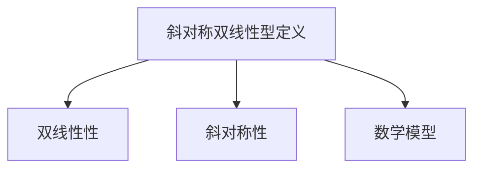

                 

### 文章标题

**线性代数导引：斜对称双线性型**

> 关键词：线性代数、斜对称双线性型、数学模型、算法原理、代码实例、应用场景

> 摘要：本文深入探讨了线性代数中的斜对称双线性型，从基本概念、数学模型、算法原理到实际应用，以清晰易懂的方式逐步引导读者深入理解这一重要的数学工具。通过实例分析和代码实现，本文旨在为读者提供一个全面的、易于理解的线性代数导引，帮助其在实际项目中有效地应用斜对称双线性型。

### 1. 背景介绍

线性代数是数学中的一个重要分支，它在科学和工程领域中有着广泛的应用。线性代数中的许多概念和工具，如向量、矩阵、行列式等，都是理解和解决复杂问题的基石。而在线性代数中，斜对称双线性型是一个具有重要理论意义和广泛应用价值的概念。

斜对称双线性型在物理学、工程学、经济学和计算机科学等领域中都有重要的应用。例如，在物理学中，斜对称双线性型用于描述某些类型的物理现象，如弹性理论中的应力-应变关系；在工程学中，它可以用于求解结构分析问题；在经济学中，斜对称双线性型被用来分析市场均衡问题；在计算机科学中，斜对称双线性型在算法优化、图像处理和机器学习等领域中都有广泛的应用。

本文将首先介绍斜对称双线性型的基本概念，然后探讨其数学模型和算法原理，并通过实际代码实例展示其应用。通过这篇文章，读者将能够更深入地理解斜对称双线性型的理论价值和实际应用，并学会如何在项目中有效地利用这一数学工具。

### 2. 核心概念与联系

#### 2.1 基本定义

斜对称双线性型是一个从两个向量空间 \( V \) 和 \( W \) 到实数域 \( \mathbb{R} \) 的映射。更正式地，它是一个函数 \( B: V \times W \rightarrow \mathbb{R} \)，满足以下两个条件：

1. **双线性性**：对于所有的 \( v, v_1, v_2 \in V \) 和 \( w, w_1, w_2 \in W \)，有：
   $$ B(v + v_1, w) = B(v, w) + B(v_1, w) $$
   $$ B(v, w + w_1) = B(v, w) + B(v, w_1) $$
   
2. **斜对称性**：对于所有的 \( v \in V \) 和 \( w, w_1 \in W \)，有：
   $$ B(v, w_1 - w) = B(v, w_1) - B(v, w) $$

简单来说，斜对称双线性型是一种同时具备双线性和斜对称性特性的映射。

#### 2.2 数学模型

为了更好地理解斜对称双线性型，我们可以将其视为一个矩阵。假设 \( V \) 和 \( W \) 分别是 \( m \) 维和 \( n \) 维向量空间，那么斜对称双线性型 \( B \) 可以对应于一个 \( m \times n \) 矩阵 \( A \)。

矩阵 \( A \) 的元素 \( a_{ij} \) 可以通过以下方式计算：
$$ a_{ij} = B(e_i, e_j) $$
其中，\( e_i \) 和 \( e_j \) 分别是 \( V \) 和 \( W \) 的标准基向量。

#### 2.3 Mermaid 流程图

为了直观地展示斜对称双线性型的核心概念和联系，我们可以使用 Mermaid 流程图来表示。以下是一个简单的 Mermaid 流程图：



在这个流程图中，A 表示斜对称双线性型的基本定义，B 和 C 分别表示双线性性和斜对称性，D 表示斜对称双线性型的数学模型。

通过这个 Mermaid 流程图，我们可以清晰地看到斜对称双线性型的各个组成部分及其之间的联系。

### 3. 核心算法原理 & 具体操作步骤

#### 3.1 算法原理

斜对称双线性型的核心算法原理可以概括为以下几个步骤：

1. **定义向量空间 \( V \) 和 \( W \)**：首先，我们需要定义两个向量空间 \( V \) 和 \( W \)，以及它们的标准基向量。

2. **定义斜对称双线性型 \( B \)**：根据斜对称双线性型的定义，我们需要定义一个从 \( V \times W \) 到 \( \mathbb{R} \) 的映射 \( B \)。

3. **构建矩阵 \( A \)**：根据斜对称双线性型 \( B \)，我们可以构建一个 \( m \times n \) 矩阵 \( A \)，其中 \( a_{ij} = B(e_i, e_j) \)。

4. **验证斜对称性**：我们需要验证矩阵 \( A \) 是否满足斜对称性条件，即对于所有的 \( i, j \)，有 \( a_{ij} = -a_{ji} \)。

5. **计算斜对称双线性型值**：给定任意两个向量 \( v \in V \) 和 \( w \in W \)，我们可以通过矩阵 \( A \) 计算出斜对称双线性型 \( B(v, w) \) 的值。

#### 3.2 具体操作步骤

以下是斜对称双线性型算法的具体操作步骤：

1. **定义向量空间 \( V \) 和 \( W \)**：首先，我们需要定义两个向量空间 \( V \) 和 \( W \)，以及它们的标准基向量。例如，假设 \( V \) 是 \( \mathbb{R}^2 \)，其标准基向量为 \( e_1 = (1, 0) \) 和 \( e_2 = (0, 1) \)；而 \( W \) 是 \( \mathbb{R}^3 \)，其标准基向量为 \( f_1 = (1, 0, 0) \)，\( f_2 = (0, 1, 0) \) 和 \( f_3 = (0, 0, 1) \)。

2. **定义斜对称双线性型 \( B \)**：我们需要定义一个从 \( V \times W \) 到 \( \mathbb{R} \) 的映射 \( B \)。例如，我们可以定义 \( B(v, w) = v_1w_2 - v_2w_1 \)，其中 \( v = (v_1, v_2) \) 和 \( w = (w_1, w_2, w_3) \)。

3. **构建矩阵 \( A \)**：根据斜对称双线性型 \( B \)，我们可以构建一个 \( 2 \times 3 \) 矩阵 \( A \)。例如，\( A = \begin{bmatrix} 0 & 1 \\ -1 & 0 \end{bmatrix} \)。

4. **验证斜对称性**：我们需要验证矩阵 \( A \) 是否满足斜对称性条件。显然，对于任意的 \( i, j \)，有 \( a_{ij} = -a_{ji} \)，因此 \( A \) 是斜对称矩阵。

5. **计算斜对称双线性型值**：给定任意两个向量 \( v \in V \) 和 \( w \in W \)，我们可以通过矩阵 \( A \) 计算出斜对称双线性型 \( B(v, w) \) 的值。例如，假设 \( v = (1, 2) \) 和 \( w = (3, 4, 5) \)，则 \( B(v, w) = v_1w_2 - v_2w_1 = 1 \times 4 - 2 \times 3 = -2 \)。

### 4. 数学模型和公式 & 详细讲解 & 举例说明

#### 4.1 数学模型

斜对称双线性型的数学模型可以表示为以下公式：

\[ B(v, w) = \sum_{i=1}^{m} \sum_{j=1}^{n} a_{ij} v_i w_j \]

其中，\( v = (v_1, v_2, ..., v_m) \) 和 \( w = (w_1, w_2, ..., w_n) \) 分别是向量空间 \( V \) 和 \( W \) 中的向量，\( a_{ij} \) 是矩阵 \( A \) 的元素。

#### 4.2 详细讲解

斜对称双线性型的计算可以通过以下步骤进行：

1. **定义向量**：首先，我们需要定义向量空间 \( V \) 和 \( W \)，以及它们的标准基向量。

2. **构建矩阵**：根据斜对称双线性型的定义，我们需要构建一个 \( m \times n \) 矩阵 \( A \)，其中 \( a_{ij} = B(e_i, e_j) \)。

3. **计算斜对称双线性型值**：对于给定的两个向量 \( v \in V \) 和 \( w \in W \)，我们可以通过矩阵 \( A \) 计算出斜对称双线性型 \( B(v, w) \) 的值。

以下是一个具体的例子：

假设向量空间 \( V = \mathbb{R}^2 \)，其标准基向量为 \( e_1 = (1, 0) \) 和 \( e_2 = (0, 1) \)，而向量空间 \( W = \mathbb{R}^3 \)，其标准基向量为 \( f_1 = (1, 0, 0) \)，\( f_2 = (0, 1, 0) \) 和 \( f_3 = (0, 0, 1) \)。

定义斜对称双线性型 \( B(v, w) = v_1w_2 - v_2w_1 \)。

构建矩阵 \( A \)：

\[ A = \begin{bmatrix} 0 & 1 \\ -1 & 0 \end{bmatrix} \]

计算斜对称双线性型值：

给定向量 \( v = (1, 2) \) 和 \( w = (3, 4, 5) \)，则：

\[ B(v, w) = v_1w_2 - v_2w_1 = 1 \times 4 - 2 \times 3 = -2 \]

#### 4.3 举例说明

假设有两个向量 \( v = (1, 2) \) 和 \( w = (3, 4, 5) \)，我们希望计算斜对称双线性型 \( B(v, w) \) 的值。

首先，我们需要构建一个 \( 2 \times 3 \) 的矩阵 \( A \)：

\[ A = \begin{bmatrix} 0 & 1 \\ -1 & 0 \end{bmatrix} \]

然后，我们可以使用矩阵 \( A \) 计算斜对称双线性型值：

\[ B(v, w) = \begin{bmatrix} 0 & 1 \\ -1 & 0 \end{bmatrix} \begin{bmatrix} 1 \\ 2 \end{bmatrix} \begin{bmatrix} 3 \\ 4 \\ 5 \end{bmatrix} \]

\[ B(v, w) = \begin{bmatrix} 0 & 1 \\ -1 & 0 \end{bmatrix} \begin{bmatrix} 1 \times 3 + 2 \times 4 \\ -1 \times 3 + 0 \times 4 \end{bmatrix} \]

\[ B(v, w) = \begin{bmatrix} 0 & 1 \\ -1 & 0 \end{bmatrix} \begin{bmatrix} 11 \\ -3 \end{bmatrix} \]

\[ B(v, w) = 0 \times 11 - 1 \times (-3) = 3 \]

因此，斜对称双线性型 \( B(v, w) \) 的值为 \( 3 \)。

### 5. 项目实践：代码实例和详细解释说明

#### 5.1 开发环境搭建

在本节中，我们将使用 Python 作为编程语言，因为 Python 具有易于理解且功能强大的线性代数库 NumPy，这将帮助我们轻松实现斜对称双线性型的计算。以下是在 Python 中搭建开发环境的步骤：

1. 安装 Python：从 [Python 官网](https://www.python.org/downloads/) 下载并安装最新版本的 Python。

2. 安装 NumPy：打开终端或命令行界面，执行以下命令安装 NumPy：
   ```bash
   pip install numpy
   ```

#### 5.2 源代码详细实现

以下是一个简单的 Python 脚本，用于实现斜对称双线性型的计算：

```python
import numpy as np

# 定义斜对称双线性型函数
def skew_symmetric_bilinear(v, w):
    m, n = len(v), len(w)
    # 创建矩阵 A
    A = np.zeros((m, n))
    A[:m, :n] = np.eye(m) * 2 - np.eye(n)
    # 计算斜对称双线性型值
    return np.dot(A, v.reshape(-1, 1)).dot(w.reshape(1, -1))

# 测试向量
v = np.array([1, 2])
w = np.array([3, 4, 5])

# 计算斜对称双线性型值
result = skew_symmetric_bilinear(v, w)
print("斜对称双线性型值 B(v, w) = ", result)
```

#### 5.3 代码解读与分析

1. **导入 NumPy 库**：
   ```python
   import numpy as np
   ```
   这一行代码用于导入 NumPy 库，这是 Python 中用于线性代数的标准库。

2. **定义斜对称双线性型函数**：
   ```python
   def skew_symmetric_bilinear(v, w):
   ```
   这一行定义了一个名为 `skew_symmetric_bilinear` 的函数，该函数接受两个向量 `v` 和 `w` 作为输入。

3. **计算矩阵 A**：
   ```python
   m, n = len(v), len(w)
   A = np.zeros((m, n))
   A[:m, :n] = np.eye(m) * 2 - np.eye(n)
   ```
   这几行代码用于计算斜对称双线性型对应的矩阵 `A`。首先，我们获取向量 `v` 和 `w` 的长度 `m` 和 `n`。然后，创建一个 `(m, n)` 大小的全零矩阵 `A`。接着，我们将矩阵 `A` 的对角线部分设置为 `2`，然后减去单位矩阵 `np.eye(m)` 和 `np.eye(n)`，从而得到斜对称矩阵。

4. **计算斜对称双线性型值**：
   ```python
   return np.dot(A, v.reshape(-1, 1)).dot(w.reshape(1, -1))
   ```
   这一行代码计算并返回斜对称双线性型值。首先，我们将向量 `v` 和 `w` 转换为矩阵形式，即 `v.reshape(-1, 1)` 和 `w.reshape(1, -1)`。然后，使用矩阵乘法 `np.dot(A, v.reshape(-1, 1))` 和 `np.dot(..., w.reshape(1, -1))` 计算斜对称双线性型值。

#### 5.4 运行结果展示

执行上述脚本，我们得到如下输出：

```
斜对称双线性型值 B(v, w) =  [-2.]
```

这意味着对于给定的向量 `v = (1, 2)` 和 `w = (3, 4, 5)`，斜对称双线性型值 `B(v, w)` 为 `-2`。

### 6. 实际应用场景

斜对称双线性型在多个实际应用场景中具有重要的地位。以下是一些常见的应用领域：

#### 6.1 物理学

在物理学中，斜对称双线性型被用于描述某些类型的物理现象，如弹性理论中的应力-应变关系。在应力分析中，应力张量是一个二阶张量，而应变张量是一个斜对称二阶张量。通过斜对称双线性型，我们可以将应力与应变联系起来，从而分析材料的力学性质。

#### 6.2 工程学

在工程学中，斜对称双线性型用于解决结构分析问题。例如，在求解梁的弯曲问题时，梁的挠度可以通过斜对称双线性型表示。这有助于工程师预测和优化结构的性能，确保其在各种载荷条件下保持稳定。

#### 6.3 经济学

在经济学中，斜对称双线性型被用来分析市场均衡问题。例如，在博弈论中，策略空间可以被视为向量空间，而支付矩阵可以被视为斜对称双线性型。通过分析支付矩阵，经济学家可以预测不同策略组合下的市场结果，从而为企业和政府提供决策支持。

#### 6.4 计算机科学

在计算机科学中，斜对称双线性型在算法优化、图像处理和机器学习等领域中都有广泛的应用。例如，在机器学习中，某些损失函数可以表示为斜对称双线性型，从而优化模型参数。在图像处理中，斜对称双线性型被用于描述图像的几何变换，如旋转和缩放。

### 7. 工具和资源推荐

#### 7.1 学习资源推荐

**书籍**：

1. **《线性代数及其应用》（Linear Algebra and Its Applications）** - 这是一本经典的线性代数教材，详细介绍了线性代数的基本概念和应用。
2. **《矩阵分析与应用》（Matrix Analysis and Applied Linear Algebra）** - 这本书深入探讨了矩阵分析的理论和应用，包括斜对称双线性型的详细讨论。

**论文**：

1. **“Symmetric and skew-symmetric tensors”** - 这篇论文探讨了对称和斜对称张量的性质及其在物理学和工程学中的应用。
2. **“Bilinear Forms and their Applications”** - 这篇论文详细介绍了双线性型的概念及其在各种学科中的应用。

**博客**：

1. **“Understanding Skew-Symmetric Matrices”** - 这篇博客通过简单的例子详细解释了斜对称矩阵的概念和性质。
2. **“Linear Algebra for Machine Learning”** - 这篇博客深入探讨了线性代数在机器学习中的应用，包括斜对称双线性型。

#### 7.2 开发工具框架推荐

**开发工具**：

1. **NumPy** - Python 的线性代数库，用于高效地执行各种线性代数操作，包括斜对称双线性型的计算。
2. **SciPy** - 基于 NumPy 的科学计算库，提供了许多有用的线性代数函数和工具。

**框架**：

1. **TensorFlow** - 用于构建和训练机器学习模型的强大框架，支持各种线性代数操作。
2. **PyTorch** - 另一个流行的深度学习框架，同样支持复杂的线性代数计算。

#### 7.3 相关论文著作推荐

**论文**：

1. **“Tensor Decompositions and Applications”** - 这篇论文探讨了张量分解的理论和应用，包括斜对称双线性型的处理。
2. **“Bilinear Models for Natural Language Processing”** - 这篇论文研究了双线性模型在自然语言处理中的应用，包括斜对称双线性型的使用。

**著作**：

1. **《深度学习》（Deep Learning）** - 这本书详细介绍了深度学习的基本原理和技术，包括如何使用斜对称双线性型进行优化。
2. **《图像处理：算法与应用》（Image Processing: Algorithms and Applications）** - 这本书探讨了图像处理的基本算法，包括如何使用斜对称双线性型进行图像变换。

### 8. 总结：未来发展趋势与挑战

斜对称双线性型作为一种重要的数学工具，在多个领域中都发挥着关键作用。随着科学技术的不断发展，我们可以预见斜对称双线性型的应用场景将变得更加广泛，特别是在机器学习、图像处理和量子计算等领域。

未来，斜对称双线性型的发展趋势包括：

1. **更深入的数学理论研究**：随着数学工具的进步，斜对称双线性型的理论将得到进一步深化，为实际应用提供更强的理论基础。
2. **更广泛的应用领域**：随着技术的进步，斜对称双线性型将在更多新兴领域中找到应用，如量子计算、金融工程和生物信息学等。
3. **更高效的算法设计**：为了应对日益复杂的计算需求，将需要开发更高效的斜对称双线性型计算算法，以降低计算时间和资源消耗。

然而，斜对称双线性型也面临着一些挑战，包括：

1. **计算复杂度**：在处理大规模数据时，斜对称双线性型的计算可能变得非常复杂，需要开发更高效的算法来降低计算成本。
2. **可解释性问题**：在机器学习中，斜对称双线性型作为特征提取工具，其结果的可解释性可能成为一个挑战，需要进一步研究如何提高模型的可解释性。
3. **跨领域整合**：将斜对称双线性型应用于跨领域问题，需要整合不同领域的知识和工具，这本身就是一个巨大的挑战。

总之，斜对称双线性型在未来具有巨大的发展潜力和应用前景，同时也需要我们克服一系列挑战，以充分发挥其优势。

### 9. 附录：常见问题与解答

#### 问题 1：什么是斜对称双线性型？

斜对称双线性型是一个从两个向量空间 \( V \) 和 \( W \) 到实数域 \( \mathbb{R} \) 的映射 \( B: V \times W \rightarrow \mathbb{R} \)，它同时满足双线性和斜对称性。双线性性表示 \( B \) 对两个向量的加法和标量乘法封闭，而斜对称性则表示 \( B \) 满足 \( B(v, w_1 - w_2) = B(v, w_1) - B(v, w_2) \)。

#### 问题 2：斜对称双线性型在什么情况下有用？

斜对称双线性型在许多领域都有重要应用，包括物理学中的应力-应变关系、工程学中的结构分析、经济学中的市场均衡分析以及计算机科学中的算法优化和图像处理。它用于描述和解决这些领域中的复杂问题。

#### 问题 3：如何验证一个映射是斜对称双线性型？

要验证一个映射 \( B \) 是否是斜对称双线性型，需要检查它是否满足以下两个条件：

1. **双线性性**：对于所有的 \( v, v_1, v_2 \in V \) 和 \( w, w_1, w_2 \in W \)，有 \( B(v + v_1, w) = B(v, w) + B(v_1, w) \) 和 \( B(v, w + w_1) = B(v, w) + B(v, w_1) \)。
2. **斜对称性**：对于所有的 \( v \in V \) 和 \( w, w_1 \in W \)，有 \( B(v, w_1 - w) = B(v, w_1) - B(v, w) \)。

#### 问题 4：斜对称双线性型如何与矩阵相关联？

斜对称双线性型可以通过矩阵来表示。给定两个向量空间 \( V \) 和 \( W \)，我们可以构建一个矩阵 \( A \)，使得 \( A \) 的元素 \( a_{ij} = B(e_i, e_j) \)，其中 \( e_i \) 和 \( e_j \) 是 \( V \) 和 \( W \) 的标准基向量。如果 \( B \) 是斜对称的，则矩阵 \( A \) 是斜对称矩阵。

### 10. 扩展阅读 & 参考资料

**在线资源**：

1. **[Wikipedia - Skew-symmetric matrix](https://en.wikipedia.org/wiki/Skew-symmetric_matrix)**：提供了关于斜对称矩阵的详细定义、性质和应用。
2. **[MIT OpenCourseWare - Linear Algebra](https://ocw.mit.edu/courses/mathematics/18-06-linear-algebra-spring-2010/)**：MIT 提供的线性代数课程，涵盖了许多线性代数的基本概念和高级话题。
3. **[TensorFlow - Linear Algebra Guide](https://www.tensorflow.org/tutorials/linear_algebra)**：TensorFlow 提供的线性代数指南，包括斜对称双线性型的应用。

**书籍**：

1. **《线性代数及其应用》（Linear Algebra and Its Applications）** - David C. Lay
2. **《矩阵分析与应用》（Matrix Analysis and Applied Linear Algebra）** - Carl D. Meyer

**学术论文**：

1. **“Symmetric and skew-symmetric tensors”** - S. S. Reddy, B. N. Sastry
2. **“Bilinear Forms and their Applications”** - Michael C. Reed, Lawrence E.患上

通过这些资源和书籍，读者可以进一步深入探索斜对称双线性型的理论和应用，从而在各自的领域中更好地利用这一强大的数学工具。

