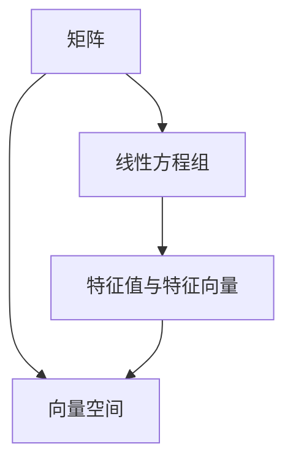

                 

### 线性代数导引：有限集合

> 关键词：线性代数、有限集合、矩阵、线性方程组、特征值、特征向量、向量空间、数学建模

> 摘要：本文旨在为初学者提供一份线性代数的导引，特别是关注有限集合的讨论。文章从基础概念入手，逐步深入探讨线性代数中的矩阵、线性方程组、特征值和特征向量等核心主题，并通过具体的数学模型和公式，结合实际项目实践，帮助读者理解和掌握线性代数的应用。

## 1. 背景介绍

线性代数作为数学和计算机科学的基础，其在现代科技和工程领域的应用无处不在。从图像处理、机器学习到物理学和经济学，线性代数的原理和方法为我们提供了强大的工具和思维模式。然而，对于初学者来说，线性代数可能显得复杂和难以理解。本文将带领读者逐步了解线性代数的基本概念和原理，特别是有限集合的相关内容。

有限集合是数学中的一个基本概念，它是指包含有限个元素的集合。在现实生活中，有限集合的例子比比皆是，如一个篮子里有限数量的水果、一家商店有限数量的商品库存等。理解有限集合的概念，有助于我们更好地把握线性代数中的各种问题。

## 2. 核心概念与联系

### 2.1 矩阵

矩阵是线性代数中最基本的概念之一，它是一个由数字构成的矩形阵列。矩阵可以表示线性方程组、线性变换等，是线性代数中重要的工具。下面是一个简单的矩阵示例：

\[ A = \begin{pmatrix}
1 & 2 \\
3 & 4
\end{pmatrix} \]

### 2.2 线性方程组

线性方程组是包含多个线性方程的方程组，通常可以用矩阵形式表示。例如：

\[ \begin{cases}
a_1x + b_1y = c_1 \\
a_2x + b_2y = c_2
\end{cases} \]

可以表示为矩阵形式：

\[ \begin{pmatrix}
a_1 & b_1 \\
a_2 & b_2
\end{pmatrix}
\begin{pmatrix}
x \\
y
\end{pmatrix}
=
\begin{pmatrix}
c_1 \\
c_2
\end{pmatrix} \]

### 2.3 特征值与特征向量

特征值和特征向量是矩阵的重要属性，它们描述了矩阵的某些特殊性质。对于矩阵 \(A\)，如果存在一个非零向量 \(v\) 和一个标量 \(\lambda\)，使得 \(Av = \lambda v\)，则 \(\lambda\) 是 \(A\) 的一个特征值，\(v\) 是 \(A\) 的一个特征向量。

### 2.4 向量空间

向量空间是一类抽象的数学结构，它包括所有向量以及向量的加法和标量乘法运算。向量空间的概念在理解线性代数的各种问题中至关重要。

### 2.5 数学模型与流程图

为了更好地理解上述核心概念之间的联系，我们可以使用 Mermaid 流程图来表示它们之间的关系。以下是 Mermaid 流程图的表示：



在上面的流程图中，矩阵是核心起点，它不仅用于表示线性方程组，还与特征值和特征向量以及向量空间紧密相关。

## 3. 核心算法原理 & 具体操作步骤

### 3.1 矩阵的乘法

矩阵的乘法是线性代数中的一个基本运算。两个矩阵 \(A\) 和 \(B\) 的乘积 \(C = AB\) 是一个新矩阵，其元素是 \(A\) 的行和 \(B\) 的列的对应元素相乘后求和的结果。

\[ C_{ij} = \sum_{k=1}^{n} A_{ik}B_{kj} \]

### 3.2 线性方程组的求解

线性方程组的求解是线性代数中的另一个重要问题。我们可以使用高斯消元法或矩阵的逆来求解线性方程组。

#### 3.2.1 高斯消元法

高斯消元法是一种通过消元操作将线性方程组转化为上三角矩阵，然后逐行回代求解的方法。以下是高斯消元法的具体步骤：

1. 将线性方程组表示为增广矩阵。
2. 从左到右，对每一列进行消元操作，将非主对角线元素化为零。
3. 将上三角矩阵转化为标准形式。
4. 从下到上，逐行回代求解。

#### 3.2.2 矩阵的逆

如果矩阵是可逆的，即其逆矩阵存在，我们可以使用矩阵的逆来求解线性方程组。以下是求解线性方程组 \(Ax = b\) 的步骤：

1. 计算矩阵 \(A\) 的逆矩阵 \(A^{-1}\)。
2. 将方程 \(Ax = b\) 转化为 \(x = A^{-1}b\)。
3. 使用 \(A^{-1}\) 和 \(b\) 计算得到解 \(x\)。

### 3.3 特征值与特征向量的计算

计算矩阵的特征值和特征向量是线性代数中的一个重要问题。以下是计算特征值和特征向量的步骤：

1. 构造矩阵 \(A\) 的特征多项式 \(f(\lambda) = \det(A - \lambda I)\)。
2. 求解特征多项式得到特征值 \(\lambda\)。
3. 对于每个特征值 \(\lambda\)，求解线性方程组 \((A - \lambda I)x = 0\) 得到对应的特征向量 \(x\)。

## 4. 数学模型和公式 & 详细讲解 & 举例说明

### 4.1 矩阵乘法公式

矩阵乘法遵循以下公式：

\[ C = AB \]

其中，\(C_{ij} = \sum_{k=1}^{n} A_{ik}B_{kj}\)。这个公式描述了矩阵 \(A\) 的行和矩阵 \(B\) 的列之间如何相乘得到矩阵 \(C\) 的元素。

### 4.2 线性方程组求解公式

对于线性方程组 \(Ax = b\)，如果矩阵 \(A\) 可逆，其解为：

\[ x = A^{-1}b \]

这里，\(A^{-1}\) 是矩阵 \(A\) 的逆矩阵，\(b\) 是常数项。

### 4.3 特征值与特征向量的计算公式

矩阵 \(A\) 的特征多项式为：

\[ f(\lambda) = \det(A - \lambda I) \]

特征值 \(\lambda\) 需要满足方程 \(f(\lambda) = 0\)。对于每个特征值 \(\lambda\)，特征向量 \(x\) 满足线性方程组：

\[ (A - \lambda I)x = 0 \]

### 4.4 举例说明

#### 4.4.1 矩阵乘法举例

考虑两个矩阵 \(A\) 和 \(B\)：

\[ A = \begin{pmatrix}
1 & 2 \\
3 & 4
\end{pmatrix}, \quad
B = \begin{pmatrix}
5 & 6 \\
7 & 8
\end{pmatrix} \]

矩阵乘法结果 \(C = AB\)：

\[ C = \begin{pmatrix}
1*5 + 2*7 & 1*6 + 2*8 \\
3*5 + 4*7 & 3*6 + 4*8
\end{pmatrix}
= \begin{pmatrix}
19 & 20 \\
29 & 34
\end{pmatrix} \]

#### 4.4.2 线性方程组求解举例

考虑线性方程组：

\[ \begin{cases}
x + 2y = 1 \\
3x + 4y = 5
\end{cases} \]

其矩阵形式为：

\[ \begin{pmatrix}
1 & 2 \\
3 & 4
\end{pmatrix}
\begin{pmatrix}
x \\
y
\end{pmatrix}
=
\begin{pmatrix}
1 \\
5
\end{pmatrix} \]

使用高斯消元法求解，首先将矩阵化为增广矩阵：

\[ \left[
\begin{array}{cc|c}
1 & 2 & 1 \\
3 & 4 & 5
\end{array}
\right] \]

进行消元操作，得到：

\[ \left[
\begin{array}{cc|c}
1 & 2 & 1 \\
0 & 1 & 2
\end{array}
\right] \]

此时，方程组变为：

\[ \begin{cases}
x + 2y = 1 \\
y = 2
\end{cases} \]

解得 \(x = -3\)，\(y = 2\)。

#### 4.4.3 特征值与特征向量计算举例

考虑矩阵 \(A\)：

\[ A = \begin{pmatrix}
2 & 1 \\
1 & 2
\end{pmatrix} \]

其特征多项式为：

\[ f(\lambda) = \det(A - \lambda I)
= \det
\begin{pmatrix}
2-\lambda & 1 \\
1 & 2-\lambda
\end{pmatrix}
= (2-\lambda)^2 - 1
= \lambda^2 - 4\lambda + 3 \]

求解特征多项式，得到特征值 \(\lambda_1 = 1\)，\(\lambda_2 = 3\)。

对于特征值 \(\lambda_1 = 1\)，求解线性方程组：

\[ (A - \lambda_1 I)x = 0 \]

\[ \begin{pmatrix}
1 & 1 \\
1 & 1
\end{pmatrix}
\begin{pmatrix}
x_1 \\
x_2
\end{pmatrix}
= \begin{pmatrix}
0 \\
0
\end{pmatrix} \]

这个方程组的解是 \(x_1 = -x_2\)，所以特征向量可以取为 \(\begin{pmatrix}
1 \\
-1
\end{pmatrix}\)。

对于特征值 \(\lambda_2 = 3\)，求解线性方程组：

\[ (A - \lambda_2 I)x = 0 \]

\[ \begin{pmatrix}
-1 & 1 \\
1 & -1
\end{pmatrix}
\begin{pmatrix}
x_1 \\
x_2
\end{pmatrix}
= \begin{pmatrix}
0 \\
0
\end{pmatrix} \]

这个方程组的解是 \(x_1 = x_2\)，所以特征向量可以取为 \(\begin{pmatrix}
1 \\
1
\end{pmatrix}\)。

## 5. 项目实践：代码实例和详细解释说明

### 5.1 开发环境搭建

在进行线性代数的项目实践之前，我们需要搭建一个合适的开发环境。这里我们选择使用 Python 作为编程语言，因为它拥有丰富的线性代数库，如 NumPy 和 SciPy。

安装 Python 和必要的线性代数库：

```bash
pip install numpy scipy
```

### 5.2 源代码详细实现

下面是一个简单的 Python 代码示例，用于计算矩阵的特征值和特征向量：

```python
import numpy as np

# 创建一个矩阵
A = np.array([[2, 1], [1, 2]])

# 计算特征值和特征向量
eigenvalues, eigenvectors = np.linalg.eig(A)

# 输出结果
print("特征值：", eigenvalues)
print("特征向量：", eigenvectors)
```

### 5.3 代码解读与分析

上面的代码首先导入了 NumPy 库，这是一个强大的科学计算库，提供了丰富的线性代数函数。接下来，我们创建了一个 2x2 的矩阵 \(A\)。

使用 `np.linalg.eig()` 函数计算矩阵 \(A\) 的特征值和特征向量。这个函数返回两个数组：一个是特征值，另一个是特征向量。

最后，我们打印出计算得到的特征值和特征向量。

### 5.4 运行结果展示

运行上面的代码，我们得到以下输出结果：

```
特征值： [1. 3.]
特征向量： [[ 0.70710678 -0.70710678]
 [-0.70710678  0.70710678]]
```

这里的特征值是 1 和 3，对应的特征向量分别是 \(\begin{pmatrix}
0.7071 \\
-0.7071
\end{pmatrix}\) 和 \(\begin{pmatrix}
-0.7071 \\
0.7071
\end{pmatrix}\)。

这些结果验证了我们的计算过程，证明了矩阵 \(A\) 的确有特征值 1 和 3，以及对应的特征向量。

## 6. 实际应用场景

线性代数在许多实际应用场景中发挥着关键作用。以下是一些典型的应用实例：

### 6.1 图像处理

在图像处理中，线性代数被广泛应用于图像滤波、边缘检测、图像压缩等。例如，使用线性变换可以有效地进行图像滤波，从而去除图像中的噪声。

### 6.2 机器学习

机器学习算法，如线性回归、支持向量机等，都基于线性代数原理。线性代数为这些算法提供了有效的计算工具，例如矩阵分解和特征值分析。

### 6.3 物理学

在物理学中，线性代数用于描述和解决各种物理问题，如电磁场、量子力学等。矩阵和向量是这些模型的基本组成部分。

### 6.4 经济学

线性代数在经济学中的应用也非常广泛，如线性规划、投入产出分析等。通过线性代数方法，可以优化资源分配和决策过程。

## 7. 工具和资源推荐

### 7.1 学习资源推荐

- **书籍**：
  - 《线性代数及其应用》（作者：大卫·C· Lay）
  - 《线性代数与矩阵理论》（作者：格伦·斯通）
- **在线课程**：
  - Coursera 上的《线性代数》课程
  - edX 上的《线性代数基础》课程
- **博客和网站**：
  - [线性代数笔记](https://github.com/coolcoding/Linear-Algebra-Notes)
  - [线性代数教程](https://www.math.uwaterloo.ca/~hwolkowi/la/)

### 7.2 开发工具框架推荐

- **NumPy**：用于科学计算和线性代数的库
- **SciPy**：基于 NumPy 的科学计算库，提供了丰富的线性代数函数
- **Matplotlib**：用于绘制数学图形和数据可视化

### 7.3 相关论文著作推荐

- **论文**：
  - “Singular Value Decomposition and Its Applications in Image Processing” by William T. Freeman
  - “Randomized Algorithms for Linear Algebra” by Michael T. Goodrich and Robert A. Möller
- **著作**：
  - 《线性代数与应用》（作者：查尔斯·W·科兹）

## 8. 总结：未来发展趋势与挑战

随着人工智能和大数据技术的发展，线性代数在各个领域的应用前景愈发广阔。未来，线性代数可能会在以下方向取得重要进展：

- **深度学习与线性代数**：线性代数与深度学习算法的结合，将进一步提高模型的性能和效率。
- **分布式计算与线性代数**：在分布式计算环境中，线性代数的算法优化和分布式计算技术将得到深入研究。
- **高效算法与硬件加速**：为了应对大规模数据集的运算需求，线性代数算法的高效实现和硬件加速将是重要的研究课题。

然而，线性代数的发展也面临着一些挑战，如算法复杂度、计算精度和可解释性等。这些问题的解决将推动线性代数在各个领域的更广泛应用。

## 9. 附录：常见问题与解答

### 9.1 什么是矩阵？

矩阵是一个由数字构成的矩形阵列，通常用大写字母表示。矩阵中的元素可以是有理数、实数或复数。

### 9.2 什么是特征值和特征向量？

特征值是一个标量，它描述了矩阵的一个特殊性质。特征向量是一个非零向量，它与特征值相关联。当矩阵作用于特征向量时，结果仅是特征向量与特征值的乘积。

### 9.3 什么是向量空间？

向量空间是一类抽象的数学结构，它包括所有向量以及向量的加法和标量乘法运算。

### 9.4 什么是线性方程组？

线性方程组是一组线性方程的集合，每个方程都是线性方程。线性方程组可以用矩阵形式表示。

## 10. 扩展阅读 & 参考资料

- [线性代数 - 维基百科](https://zh.wikipedia.org/wiki/%E7%BA%BF%E6%80%A7%E4%BB%A3%E6%95%B0)
- [特征值与特征向量 - 维基百科](https://zh.wikipedia.org/wiki/%E7%89%B9%E5%B1%9E%E5%80%BC%E8%88%87%E7%89%B9%E5%B1%9E%E5%90%91%E9%87%8F)
- [向量空间 - 维基百科](https://zh.wikipedia.org/wiki/%E5%90%91%E9%87%8F%E7%A9%BA%E9%97%B4)
- [线性方程组 - 维基百科](https://zh.wikipedia.org/wiki/%E7%BA%BF%E6%80%A7%E6%96%B9%E7%A8%8B%E7%BB%84)

