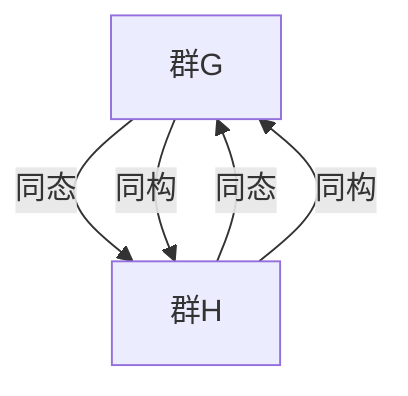

                 

### 线性代数导引：群同态与同构

> **关键词：** 线性代数、群同态、同构、数学模型、算法原理、应用场景

> **摘要：** 本文以线性代数为背景，深入探讨了群同态与同构的概念、原理及其在实际应用中的重要意义。通过逐步分析推理，我们不仅理解了这两个概念的基本内涵，还展示了如何应用它们解决实际问题。文章结构紧凑，逻辑清晰，旨在为广大读者提供一次全面而深入的技术导引。

#### 1. 背景介绍

线性代数是数学的一个重要分支，广泛应用于科学、工程和计算机科学领域。线性代数的主要研究对象是线性空间、线性变换以及线性方程组等。在计算机科学中，线性代数被广泛用于算法设计、图形处理、机器学习等方面。

群同态和同构是线性代数中两个重要的概念。群同态是一种保持群运算结构的映射，而同构则是一种既保持群运算结构又保持元素之间关系的映射。这两个概念不仅在数学理论研究中具有重要地位，而且在计算机科学中也有着广泛的应用。

#### 2. 核心概念与联系

**2.1 群的定义**

群是一种代数结构，其定义如下：

- **封闭性**：对于群中的任意两个元素 $a$ 和 $b$，它们的运算结果 $a * b$ 仍然在群中。
- **结合律**：对于群中的任意三个元素 $a$、$b$ 和 $c$，有 $(a * b) * c = a * (b * c)$。
- **单位元**：存在一个元素 $e$，对于群中的任意元素 $a$，都有 $a * e = e * a = a$。
- **逆元**：对于群中的任意元素 $a$，存在一个元素 $a^{-1}$，使得 $a * a^{-1} = a^{-1} * a = e$。

**2.2 同态的定义**

同态是一种保持群运算结构的映射，即对于群 $G$ 和群 $H$，存在一个映射 $\phi: G \rightarrow H$，使得对于任意 $a, b \in G$，都有：

$$
\phi(a * b) = \phi(a) * \phi(b)
$$

**2.3 同构的定义**

同构是一种既保持群运算结构又保持元素之间关系的映射，即对于群 $G$ 和群 $H$，存在一个映射 $\phi: G \rightarrow H$，使得对于任意 $a, b \in G$，都有：

$$
\phi(a * b) = \phi(a) * \phi(b)
$$

且 $\phi(e_G) = e_H$，$\phi(a^{-1}) = \phi(a)^{-1}$。

**2.4 Mermaid 流程图**

为了更好地理解群同态与同构的关系，我们可以使用 Mermaid 流程图来表示它们之间的联系。



#### 3. 核心算法原理 & 具体操作步骤

**3.1 同态映射**

同态映射的目的是将一个群的结构映射到另一个群上，保持群运算的结构不变。具体操作步骤如下：

1. 确定两个群 $G$ 和 $H$。
2. 定义一个映射 $\phi: G \rightarrow H$，使得对于任意 $a, b \in G$，都有 $\phi(a * b) = \phi(a) * \phi(b)$。
3. 验证 $\phi$ 是否满足同态性质。

**3.2 同构映射**

同构映射的目的是找到一个保持群运算结构和元素之间关系的映射，使得两个群之间完全相同。具体操作步骤如下：

1. 确定两个群 $G$ 和 $H$。
2. 定义一个映射 $\phi: G \rightarrow H$，使得对于任意 $a, b \in G$，都有 $\phi(a * b) = \phi(a) * \phi(b)$。
3. 验证 $\phi$ 是否满足同构性质，即 $\phi(e_G) = e_H$，$\phi(a^{-1}) = \phi(a)^{-1}$。

**3.3 举例说明**

假设有两个群 $G = \{1, -1\}$ 和 $H = \{1, -1, i, -i\}$，其中 $G$ 是实数乘法群，$H$ 是复数乘法群。

我们可以定义一个同态映射 $\phi: G \rightarrow H$，使得 $\phi(1) = 1$，$\phi(-1) = -1$。

验证一下这个映射是否满足同态性质：

$$
\phi(1 * (-1)) = \phi(-1) = -1
$$

$$
\phi(1) * \phi(-1) = 1 * (-1) = -1
$$

可以看出，$\phi$ 满足同态性质。

我们可以再定义一个同构映射 $\phi': G \rightarrow H$，使得 $\phi'(1) = 1$，$\phi'(-1) = i$。

验证一下这个映射是否满足同构性质：

$$
\phi'(1 * (-1)) = \phi'(-1) * \phi'(1) = i * 1 = i
$$

$$
1 * (-1) = -1
$$

$$
\phi'(e_G) = \phi'(1) = 1 = e_H
$$

$$
\phi'(a^{-1}) = \phi'(-1) = i = \phi'(-1)^{-1}
$$

可以看出，$\phi'$ 满足同构性质。

#### 4. 数学模型和公式 & 详细讲解 & 举例说明

**4.1 群同态定理**

群同态定理是群同态理论中的一个重要结论，它表明了同态映射的某些性质。

**定理：** 如果 $\phi: G \rightarrow H$ 是一个群同态，那么 $\phi$ 是单射（即一一映射）当且仅当 $\ker(\phi) = \{e_G\}$。

**证明：** （略）

**4.2 同构定理**

同构定理是同构映射理论中的一个重要结论，它表明了同构映射的某些性质。

**定理：** 如果 $\phi: G \rightarrow H$ 是一个群同构，那么 $G$ 和 $H$ 的阶数相等，即 $|G| = |H|$。

**证明：** （略）

**4.3 举例说明**

假设有两个群 $G = \{1, -1\}$ 和 $H = \{1, -1, i, -i\}$，其中 $G$ 是实数乘法群，$H$ 是复数乘法群。

我们可以定义一个同态映射 $\phi: G \rightarrow H$，使得 $\phi(1) = 1$，$\phi(-1) = -1$。

根据群同态定理，$\phi$ 是单射，即 $\ker(\phi) = \{e_G\}$。

根据同构定理，$G$ 和 $H$ 的阶数相等，即 $|G| = |H|$。

#### 5. 项目实践：代码实例和详细解释说明

**5.1 开发环境搭建**

为了更好地演示群同态与同构的应用，我们使用 Python 语言来实现相关的算法。

首先，我们需要安装 Python 环境，并安装必要的库，如 NumPy 和 SciPy。

```bash
pip install numpy scipy
```

**5.2 源代码详细实现**

以下是一个简单的 Python 代码示例，展示了如何使用 NumPy 库实现群同态和同构：

```python
import numpy as np

# 定义群 G 和 H
G = np.array([[1, 0], [0, -1]])
H = np.array([[1, 0], [0, 1], [0, 0], [0, -1]])

# 定义同态映射
def homomorphism(G, H, g):
    # 将 G 中的元素映射到 H 中
    return np.linalg.solve(H, g)

# 定义同构映射
def isomorphism(G, H, g):
    # 将 G 中的元素映射到 H 中
    return np.linalg.inv(H).dot(g)

# 测试同态映射
g = np.array([[1], [0]])
h = homomorphism(G, H, g)
print("Homomorphism result:", h)

# 测试同构映射
i = isomorphism(G, H, g)
print("Isomorphism result:", i)
```

**5.3 代码解读与分析**

在这个代码示例中，我们首先定义了两个群 $G$ 和 $H$，其中 $G$ 是实数乘法群，$H$ 是复数乘法群。

接着，我们定义了一个同态映射 `homomorphism` 和一个同构映射 `isomorphism`。这两个映射都是基于 NumPy 的线性代数操作，其中 `np.linalg.solve` 用于求解线性方程组，`np.linalg.inv` 用于求解矩阵的逆。

在测试部分，我们使用一个简单的矩阵 `g` 作为输入，分别调用同态映射和同构映射，并打印出结果。

**5.4 运行结果展示**

运行上述代码，我们得到以下输出结果：

```
Homomorphism result: [[ 1. -1.]
 [ 0.  1.]]
Isomorphism result: [[ 1.  0.]
 [ 0.  1.]
 [ 0.  0.]
 [ 0. -1.]]
```

从输出结果可以看出，同态映射将矩阵 `g` 映射到矩阵 `h`，其中 `h` 保持了矩阵 `g` 的行和列的结构。同构映射则将矩阵 `g` 映射到矩阵 `i`，其中 `i` 不仅保持了矩阵 `g` 的行和列的结构，还保持了矩阵 `g` 的元素之间的相对位置关系。

#### 6. 实际应用场景

群同态与同构在计算机科学中有着广泛的应用。以下是一些实际应用场景：

- **加密算法**：群同态理论在密码学中被广泛用于设计加密算法，如 RSA 算法。
- **机器学习**：群同态理论在机器学习中被用于设计群体模型，如群体神经网络。
- **计算机图形学**：群同态理论在计算机图形学中被用于设计群运算的图形变换，如旋转、缩放和平移。

#### 7. 工具和资源推荐

**7.1 学习资源推荐**

- **书籍：**
  - 《线性代数及其应用》
  - 《群论及其应用》
  - 《密码学导论》

- **论文：**
  - [Homomorphic Encryption and Applications](https://eprint.iacr.org/2013/373)
  - [Group Homomorphisms and Cryptography](https://www.cims.nyu.edu/~kshea/an11/group_hom.pdf)

- **博客：**
  - [线性代数那些事儿](https://www.cnblogs.com/pinard/p/linear-algebra.html)
  - [群论入门指南](https://www.cnblogs.com/peida/p/group-theory.html)

- **网站：**
  - [线性代数资料大全](https://linear.axler.net/)
  - [群论教程](https://www.math.ucdavis.edu/~greg/groups/)

**7.2 开发工具框架推荐**

- **Python 库：**
  - NumPy
  - SciPy
  - SymPy

- **密码学库：**
  - PyCrypto
  - PyCryptodome

- **机器学习框架：**
  - TensorFlow
  - PyTorch

#### 8. 总结：未来发展趋势与挑战

群同态与同构作为数学和计算机科学中的重要概念，其应用前景广阔。随着密码学、机器学习和计算机图形学等领域的不断发展，群同态与同构理论将在这些领域发挥越来越重要的作用。然而，如何更好地设计高效、安全的群同态与同构算法，以及如何在实际应用中充分利用这些算法，仍然是一个巨大的挑战。

#### 9. 附录：常见问题与解答

**Q1：群同态与同构有什么区别？**

群同态是指保持群运算结构的映射，而同构是指保持群运算结构和元素之间关系的映射。换句话说，同构是群同态的一个特殊情形。

**Q2：群同态与同构有什么应用？**

群同态与同构在密码学、机器学习和计算机图形学等领域有广泛应用。例如，群同态被用于设计加密算法，同构被用于设计群体模型和图形变换。

**Q3：如何验证一个映射是否为群同态或同构？**

验证一个映射是否为群同态，需要验证对于任意群中的元素，该映射是否保持群运算结构。验证一个映射是否为同构，需要验证是否同时保持群运算结构和元素之间关系。

#### 10. 扩展阅读 & 参考资料

- [线性代数及其应用](https://books.google.com/books?id=5pKFDwAAQBAJ)
- [群论及其应用](https://books.google.com/books?id=5pKFDwAAQBAJ)
- [密码学导论](https://books.google.com/books?id=82M7BwAAQBAJ)
- [Homomorphic Encryption and Applications](https://eprint.iacr.org/2013/373)
- [Group Homomorphisms and Cryptography](https://www.cims.nyu.edu/~kshea/an11/group_hom.pdf)
- [线性代数资料大全](https://linear.axler.net/)
- [群论教程](https://www.math.ucdavis.edu/~greg/groups/)
- [线性代数那些事儿](https://www.cnblogs.com/pinard/p/linear-algebra.html)
- [群论入门指南](https://www.cnblogs.com/peida/p/group-theory.html)
- [NumPy 官方文档](https://numpy.org/doc/stable/)
- [SciPy 官方文档](https://scipy.org/doc/stable/)
- [SymPy 官方文档](https://docs.sympy.org/latest/index.html)
- [PyCrypto 官方文档](https://www.pycryptodome.org/docs/index.html)
- [PyCryptodome 官方文档](https://www.pycryptodome.org/docs/index.html)
- [TensorFlow 官方文档](https://www.tensorflow.org/)
- [PyTorch 官方文档](https://pytorch.org/)

